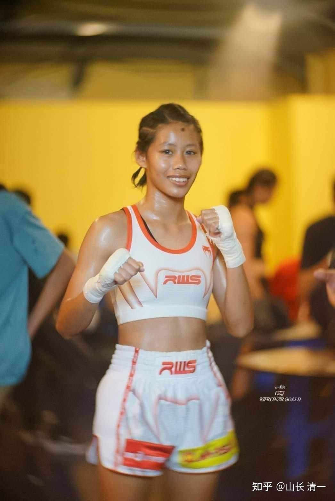
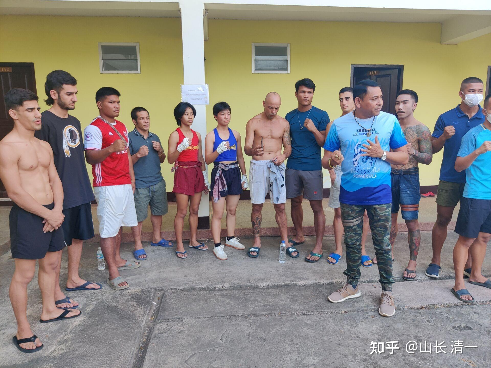
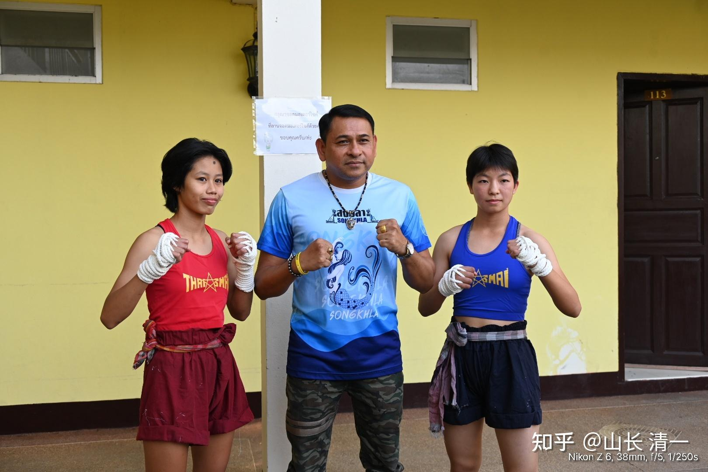
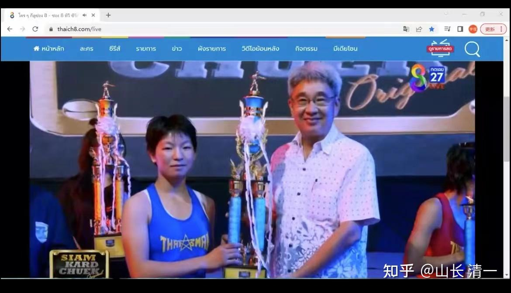
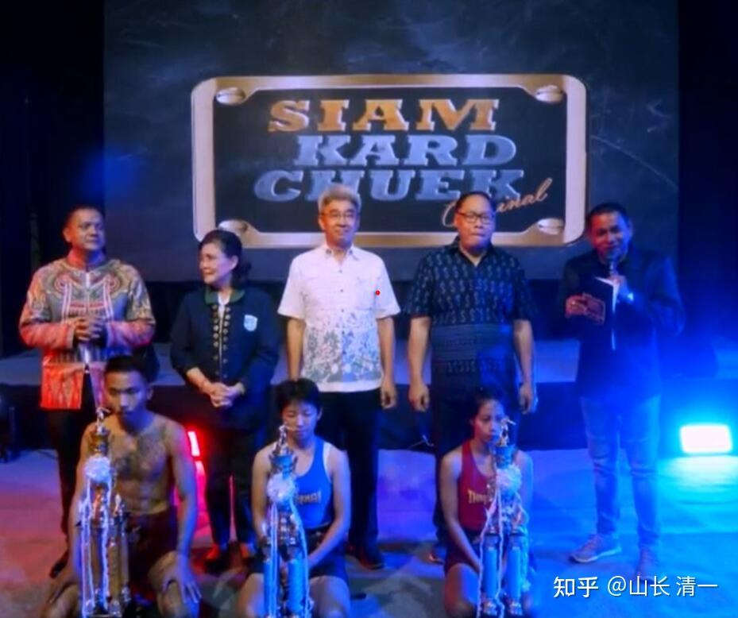

缠拳比赛两天后（2022年11月5日晚）就开打了。4日一早老拳师，就来带佳慧和助手们去外府参与比赛。因为要提前一天去进行称重。由于对手比佳慧更高，更壮（大概重4公斤）。所以佳慧根本就不操心减重问题，对手才要关心。这种大型的比赛，由于泰国的第8电视台要来现场转播，因此相对正规一些。也正因为如此，还有专门的称重程序。规则上要求双方的体重不能相差太多，必须在限制以内。佳慧是唯一一组参加缠拳赛的女拳手。对手还是很善于肘法的。

艾拉这两天采访了拳馆的教练和拳手。问他们对于木兰参加缠拳赛的想法。没想到很多拳手对参加这种比赛都不感冒，认为很容易受伤。对于佳慧这么短时间就敢升级打这种残酷的比赛感到有些惊讶。居然有拳手宁肯去打MMA也不愿意去打缠拳赛。还普遍认为是很优秀的拳手，才去打缠拳比赛的。还有一个男拳手，面对女生的采访，也不怕丢人，公开说不肯去。因为太危险。所以，显然这种比赛，对普通的泰拳手来说，都是一个可怕的存在。不愿意参加。也因此比赛的奖金设得更高一些。大约是普通泰拳比赛的两三倍。

不过一些跟佳慧打过的拳手，都善意地表达了对佳慧的祝福。这段时间佳慧也自己买了缠拳的工具来练习手感，以及和队友练拳。避免上场后不习惯。艾拉的视频中有练习缠拳的录像。

[!\[image\](images/img_001.jpg)

缠拳比赛采访录像 https://www.zhihu.com/video/1571643569093484544](http://link.zhihu.com/?target=https%3A//www.zhihu.com/video/1571643569093484544)

11月4日13:30的后续播报：

佳慧以及随行人员已经到达现场了。佳慧的对手临时换了。原来预定的对手据说得了新冠，不能参加比赛了。前天说新换的一个对手，是一个比佳慧高和重。但与佳慧比赛，被KO的对手。没想到这次去现场，发现对手又变掉了。因为主办方说找一个曾经被佳慧KO的对手没意思，就算对手想复仇也不给机会。所以找了一个在曼谷与仑披尼赛场齐名的迦南隆赛场打拳的拳手，也参加过NAMWAN一样的8号电视台的小拳套比赛。算是实力级人物。主办方应该希望这次比赛的悬念更大一些，不希望佳慧拥有明显的优势。而且这人看上去个子有点高。身材还不错。如果拼拳估计佳慧手短会有些吃亏，但拼腿和内围战佳慧均占上风，所以只要用好自己的优势，是不用担心的。

*拳手现场集体照*

15:30的更新：

唯一的一对女拳手。与主办方合影。看样子这个拳手与佳慧的身高差不多。体型也不壮。这个样子跟佳慧打内围战会很吃亏的。场上应该很容易被佳慧摔倒。

前方传回的信息：现在推广人在给拳手交待比赛，说他们有三年没有举办这个比赛了，希望他们保护好自己，尽量不要在一、二回合就结束。如果打满五回合，不会分胜负（算平局），中间被摔倒打倒多少次都没有关系，除非裁判叫停，或自己放弃。

也就是说：拳赛的规则，与缅甸拳的规则差不多，没KO就算平局。所以打缅甸拳的人，都追求拼命KO对手。泰拳规则的区别，就是缅甸拳会使用头撞。

【尽量不要在一、二回合就结束】。含义有点深。一方面要求拳手不要一开始受到打击，被出血就放弃比赛。一方面，也希望选手照顾主办方，别太快结束战斗。毕竟是节日庆典的拳赛，希望打的热闹一点。三两下就结束战斗，太不好玩了。虽然古泰拳的打法本身就是以KO为目的的。

最终确认的比赛规则是：

打满五局算平局。最终结果判输赢的方式：

1、拳手放弃

2、出血后医务人员介入叫停

3、被KO打晕或被打死

和普通比赛的区别可能在于裁判不会提早介入给TKO，即便多次读秒，只要拳手想继续，就可以继续。

怪不得泰拳手一般不参与这个比赛：看这架势就有点吓人！应该会打得很血腥的。

11月5日11：50 最后更新：

没想到第一局对手就猛烈抢攻，出手又快又重。可惜泰拳手越猛攻，自己越吃亏。太极最擅长打防守反击。其实第二局下半段，对手就发现她的攻击对木兰没有用，反而引来非常强劲的反击。因此开始避战了。佳慧也没有得理不饶人。可能也不想死命揍对手吧？反正KO不了对方也不会判自己输。因此佳慧的压力并不大。我也没要求她一定KO对手。场面实战上，是佳慧占明显优势，甚至用野马分鬃直接击倒对手。但由于没有KO，因此判了平局。但最终的颁奖仪式上，佳慧的位置显然更受重视，放在居中的位置。我相信今天中国木兰的表现，也令电视台的观众大为吃惊---居然中国人能够打出这种水平，一点也不输泰国拳手，场面凶猛激烈。最终佳慧的脸没有打花。

老拳师承诺：如果这一战可以打好的话。以后就可以安排曼谷的缠拳比赛给明晓和佳慧了。她们将来会有更好的舞台去展示中华武术的魅力。

*颁奖仪式 *

