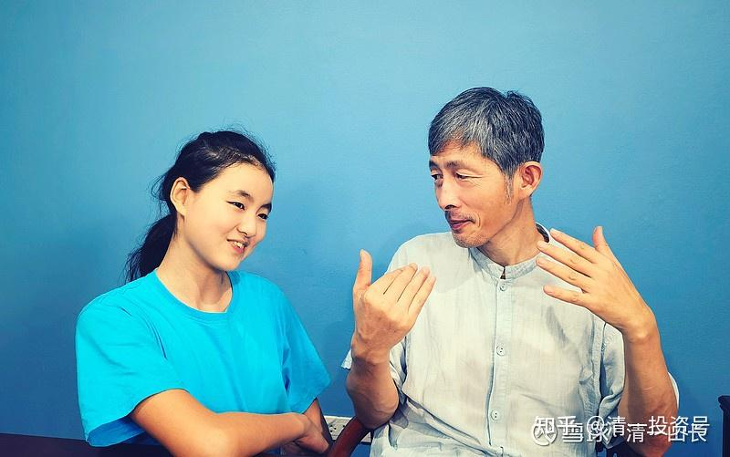
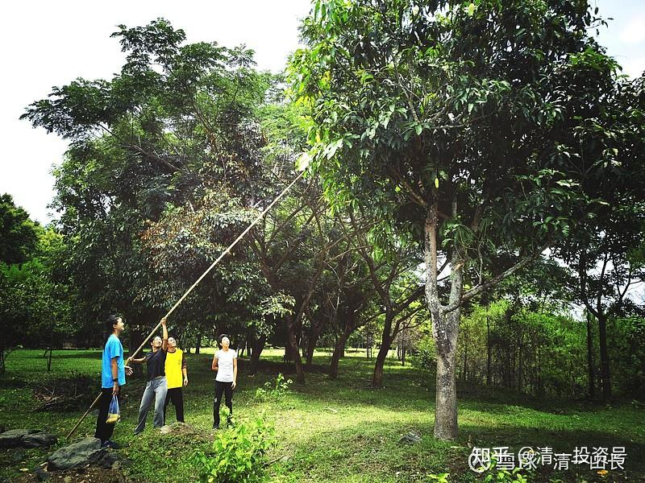
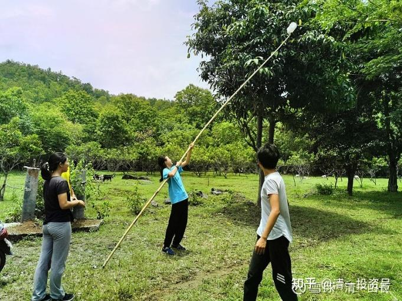
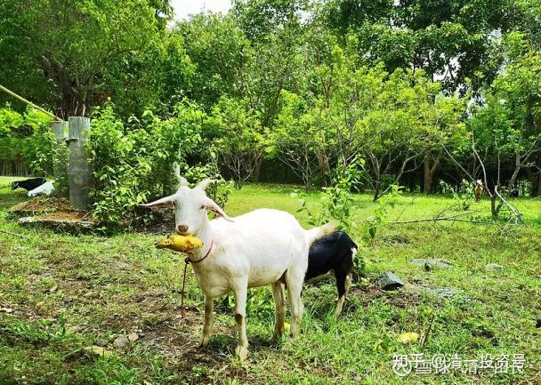
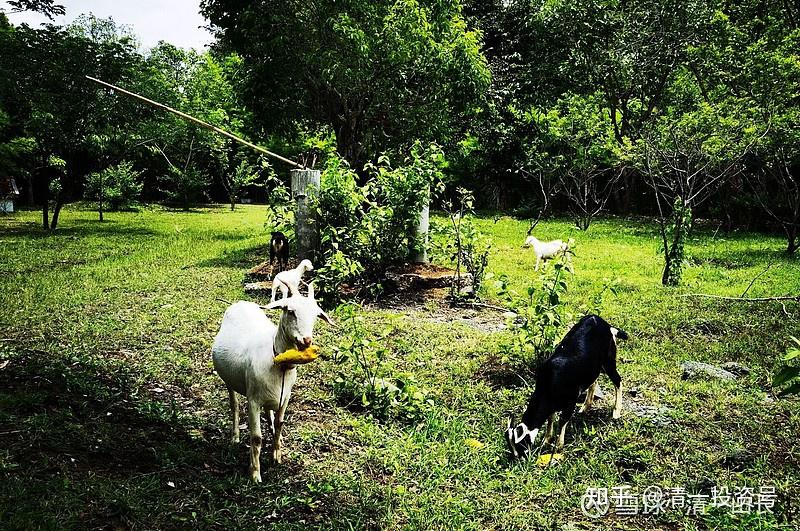
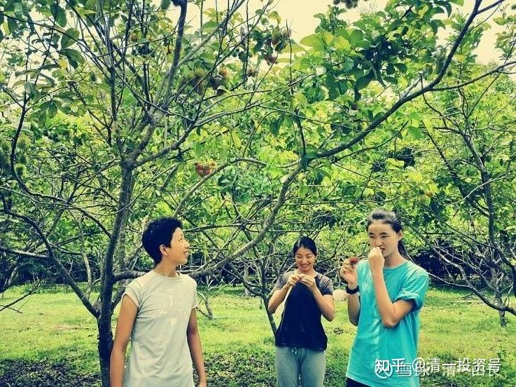
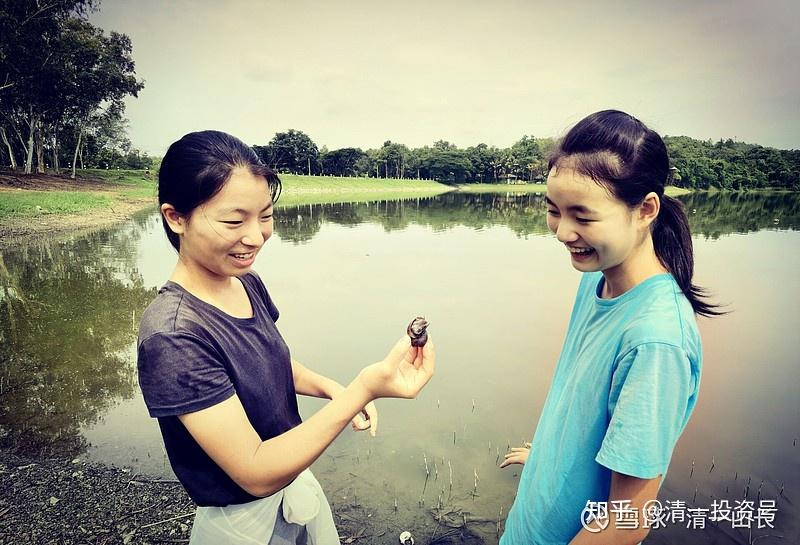
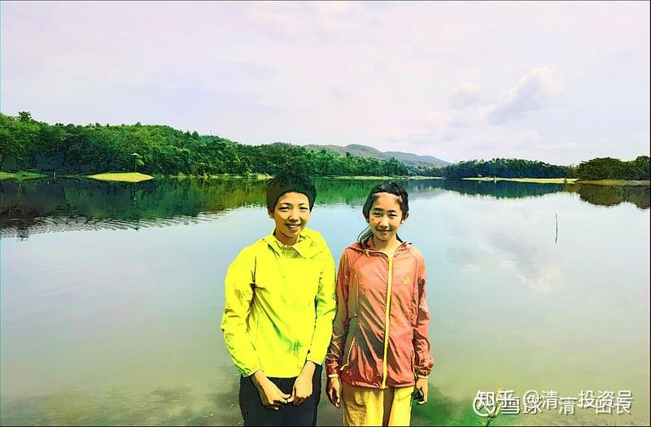
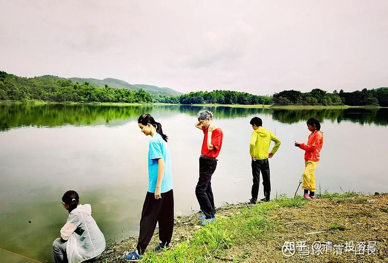
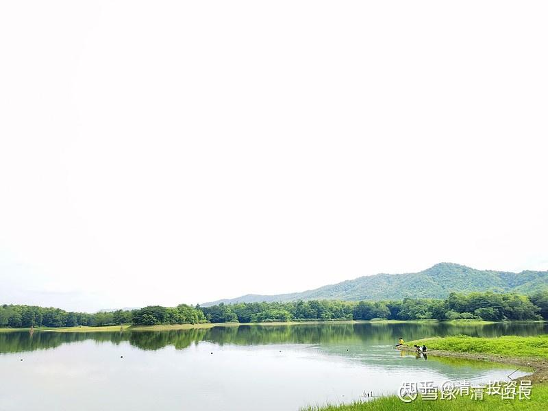

原雪球专栏[172篇.用四年拿到四个名牌大学本科文凭是不务正业吗？](http://link.zhihu.com/?target=https%3A//xueqiu.com/9310099567/181985970)

清一山长2021年6月7日

某人出来义正辞严地批评我：“术业有专攻，闻道有先后。不要当什么都懂的完人和哲人。不要误导了球友！”

因为考虑这是大多数人的心结：要专攻一门，这肯定是没错的。我教学生，也一样是要求**“一门深入”**，可惜**很多人专攻一门，却在错误的道路上狂奔，累死了还没啥好结果**。我一直说：我学和教的东西，都是很简单的，小学级别的。问题是别人都在幼儿园死拼，理解不了，我可以轻松上小学，还觉得我很高明，实在汗颜。就专门回答一下此大侠，供大家参考，**什么样才是专业态度？什么是跨界？什么是真正的教育？**

多谢教诲[献花花]。你是好心人，的确说的是良心话。我相信您，是真心这样想的。因为你接受的教育，就是这样的——强调专业性。祝福你专业赚钱吧！花钱的事情，就教给别人替您思考算了[俏皮]，毕竟巴菲特就是这样做的。

我懂的东西，跨界的确很多。其实并不是啥高级的东西，都是各行各业的基础入门的级别。**武术、医学、投资、教育**，这些看起来是获得了超越别人专业成绩的项目，我实际上都只是入门级别的水平而已，并不高，我觉得也并不难。问题是：别人都没有入门，我入门了，你们就觉得我高级了，专业了，这是笑话来的。我的学生都比我专业得多。

我发现，虽然追求专业，但你们都苦苦地走在错误的道上，比如投资，心里明明都是想来赚钱的，大多数人的身子，却走在赔钱的道路上；教育上，家长们都想教好孩子，身子却走在毁掉孩子的路上（刚结业的我的教育心理学培训班，每一个学员和家长，上课得到的教训，就是：原来都教错了孩子，犯了很多的错误）。我教的孩子们，似乎表现特别的优秀，并不觉得我教的课程很困难。其实只是孩子们走对了路罢了。

至于您让我别去学医？专心炒股赚钱？这就是有点太不爱惜自己了吧！**人生如果要健康长寿，不懂医咋行？敢无知无畏地把自己交给医院？恐怕才是找死呢！我弟就是被现代医学，现代医院给整死了，死的时候才47岁。**我敢不学医学，不懂医学吗？我靠得住谁？您推荐下？**我光专心赚钱，然后把钱交给医生们去把我整死吗？现在的专业人员，有多少敬业的人？投资界的私募、公募，都是为投资者服务的吗？还是设各种圈套来愚弄投资者的？**您真不知道**基金黑幕**吗？

另外，我不听您良言劝告的原因还有一个：这个世界上专才很多，不缺我一个。跟这么多人去竞争，我未必能赢。但**目前教育系统的设计，培养出来的通才很少。未来世界，需要的是跨界人才**。

我的教育，我的学生全都教跨界、跨专业。小女的教育目标：是18岁上大学，四年后要拿到四个国家、四个大学、四个不同专业的大学本科毕业文凭（其中一个是中国的985大学本科专业文凭）。与她同时去上大学的，有一批她的同学，我称为公主班的学生。她们未来的目标都完全一样（现在这批孩子才13岁，5年后上大学）。难道您认为她们就应该22岁，只拿一个本科文凭就好？又不是读博士、博士后，没必要这么自我折磨吧？她们虽然四年要拿四个本科大学文凭，其实就当玩一样学的，不会“头悬梁，锥刺股”的苦学。**我们只是用这个跨专业的动作，故意地讽刺一下全世界的教育界：你们教的东西，无论内容还是方法，都太弱智了！对不起我们的下一代。**

我的观点：是**大多数的学生，认认真真的只学一个专业就够了，然后去做事。少数喜欢学习的，心性良好的学生，可以多学几个专业玩。**专业读书人，就读出一点别人读不出的特色来。

下面是昨天，我带清迈的小公主们去周日游玩的照片。这批孩子，就是规划中18岁要去上大学，四年拿到四个名牌大学文凭的孩子，现在才13～15岁。半年多前，她们刚去[中国电建](http://link.zhihu.com/?target=https%3A//xueqiu.com/S/SH601669%3Ffrom%3Dstatus_stock_match)当小老师，教经理们泰语。她们的中英泰三语都非常好，电建基本上找不到三语人才，两种语言的倒还好找。所以，特别希望我们推荐三语人才给他们，甚至希望她们18岁就去电建工作，不要文凭，都愿意以大学毕业生的待遇来聘请她们。可惜，她们现在去工作一年、半年倒是没问题，算是历练一下。但等她们到了18岁，她们愿意去从事的职业和单位，就很挑剔了。

前几天我告诉她们：现在就已经可以去国内拿2万元的月薪了，可没有一个人愿意去赚钱，她们希望留在这里继续学习。她们刚刚结束了21天的心理学培训学习，与成年学生一起学的。实话实说：**她们取得的学习成绩，比很多成年学生的作业，课后讨论、思考总结，都好得多。现在小小年纪，就可以洋洋洒洒地写出万言文章了，也可以站讲台讲课了。中文水平上，很多大学毕业生已经不是她们的对手了！**

上图是15岁的三语生艾拉。是我去见泰国的校长、教师、律师们时的小翻译，水平能力，已经超过大学相关专业的毕业生。这是心理行为课程上互动课程的照片。

孩子们在我买下来的庄园里面，取成熟的芒果下来吃。现在是芒果成熟季，天天芒果落地，每天羊都会跑来吃最新鲜的芒果。

这是我的羊群，主要任务是当“化肥工厂”。因为庄园太大了，草太多，三年前买了三只羊，现在变成了14只羊了。你们将来想吃的话，也可以卖给你们杀羊吃。我告诉园丁：太多了就要卖掉了。园丁计划等有40只再开始对外卖羊。

孩子们在吃自家院子里面结果的红毛丹。味道很甜。

孩子们在小湖边玩水

天地悠然——这就是我们生活的世界。孩子们就是这样：**每天玩一样的学习。将来用别人学完一个大学本科的时间，就可以读完四个大学，实现很多人一生都无法实现的目标。**

最后说一句：昨天回来的正餐，是我们一起吃味道鲜美的芒果糯米饭。我们一行总共七个人，总共饭费，才花了30泰铢。因为就是买了30泰铢一公斤的熟糯米饭回来就足够了，芒果是自家院里树上的果子，不要钱的。所以，我们的生活，简单而快乐，而且健康，看风景也不要钱。恐怕这种生活，是你们有钱买不到的！

**好生活，需要认真智慧的安排。不是你钱多，就能自动拥有的**。这就是基本的道理！

（以下内容为编者收录）

**评论回复：**

**[润哥](http://link.zhihu.com/?target=http%3A//xueqiu.com/n/%25E6%25B6%25A6%25E5%2593%25A5)回复[清一山长](http://link.zhihu.com/?target=http%3A//xueqiu.com/n/%25E6%25B8%2585%25E4%25B8%2580%25E5%25B1%25B1%25E9%2595%25BF)：**

佩服啊！就欣赏你这样的态度，我要是能像你这样，怎么会惹得一身病？

**[清一山长](http://link.zhihu.com/?target=https%3A//xueqiu.com/9310099567)回复[润哥](http://link.zhihu.com/?target=http%3A//xueqiu.com/n/%25E6%25B6%25A6%25E5%2593%25A5)：**

呵呵，**难道您喜欢用别人的错误，来惩罚你自己吗？生病就是老天提醒您做错了。我们只能管自己的事情，不能管别人的事情。**

**我是无欲而刚。我又不想在雪球上吸引粉丝，用当大V的方式来发私募，我也不想牟取任何利益。想要钱，我自己赚，不更开心、更自由吗？何必迎合粉丝，看粉丝的脸色来赚钱？所以，雪球粉丝的多少，对我毫无意义，我不关心这些数字。他们应该关心我的发言对他们有无帮助才对。粉丝想用各种发言，想用各种粉和黑，来操纵我的行为，是不可能的。我可不是粉丝的奴仆，更不是黑我的人的奴仆，跑来黑我、骂我，我就赶快拍他们马屁去？我可没这么低贱的**[俏皮]**。**

**每天，都有来来去去的粉丝，我们关注他们的来去，不是自己找抽吗？爱黑、爱粉随他们便。每个人都有他们自己的理由。我们不用关心这些理由，对错都不用介意，我更关心自己判断的对错。但发言不文明，我有责任清除。并不是谁粉我的，我就容忍。发言不文明，就算是粉我的，我一样拉黑的。我也注意我自己的发言，可以不好听，可以不客气，但不能不文明，更不能不真实。**

**祝福你，找到了自己的位置。我们为自己的荣誉而活。但荣誉不是靠别人施舍的，更不是粉丝施舍的，是我们自己获取的。**

**[润哥](http://link.zhihu.com/?target=https%3A//xueqiu.com/6451611049)[2021-06-07 08:56](http://link.zhihu.com/?target=https%3A//xueqiu.com/6451611049/181978787)：**

最近在看《光荣与梦想》，看到黄晓明演的周恩来，除了形似，其他完全不似。非常佩服这样的人，从出道以来，骂声不断，各种被骂，然后他还不能怼回去，不然就被骂耍大牌，只能自己承受。做了大V后感觉到了他的承受能力真是惊人。如果我写出来东西，哪怕有9个人说好，有一个人说不好也让我勃然大怒，却又不能怼回去。因为怼人怕自己失去粉丝支持，也不能拉黑，拉黑人，让让我觉得很内疚。最后都是伤到自己，然后就被气病了。又觉得自己太脆弱了，不是做公众人物的料。所以，现在看看一直被骂却不能骂回去的黄晓明，觉得非常佩服，他怎么就能承受得了呢？所以特别佩服像[清一山长](http://link.zhihu.com/?target=http%3A//xueqiu.com/n/%25E6%25B8%2585%25E4%25B8%2580%25E5%25B1%25B1%25E9%2595%25BF)、[银翼杀手20049](http://link.zhihu.com/?target=http%3A//xueqiu.com/n/%25E9%2593%25B6%25E7%25BF%25BC%25E6%259D%2580%25E6%2589%258B20049)这样敢于怼人的人，他们活成了我期望成为的样子。

**[清一山长](http://link.zhihu.com/?target=https%3A//xueqiu.com/9310099567)回复[润哥](http://link.zhihu.com/?target=http%3A//xueqiu.com/n/%25E6%25B6%25A6%25E5%2593%25A5)：**

**别跟戏子比，戏子除了面子，就没啥实在的本事和内容了。别人是服务业，当然要忍住自己的气，丢掉自己的自尊心，好好地伺候客人。我认为我从事的是知识创造者行业，是思想者的角色。我们必须有自己的独到性、创造性的思想，并把我们的思想分享出去。喜欢我的人就来，不喜欢的就走，没啥好计较的。如果要求别人都不说你坏话，也没人怼你，也很容易——跟别人一样，做个小人物，无名无姓，就行了。**[加油]**。当然，这样做，也没人说你的好话了。**

**[51nxp](http://link.zhihu.com/?target=http%3A//xueqiu.com/n/51nxp):回复[清一山长](http://link.zhihu.com/?target=http%3A//xueqiu.com/n/%25E6%25B8%2585%25E4%25B8%2580%25E5%25B1%25B1%25E9%2595%25BF)：**

面对别人的攻击，最好的回复就是成功。我觉得芒格比巴菲特更成功，因为他的后代延续了爱读书的基因。这也是我佩服山长的原因，虽然这两年我们的持股完全不同。[https://xueqiu.com/6451611049/181978787](http://link.zhihu.com/?target=https%3A//xueqiu.com/6451611049/181978787)

**[清一山长](http://link.zhihu.com/?target=https%3A//xueqiu.com/9310099567)[2021-06-07 12:29](http://link.zhihu.com/?target=https%3A//xueqiu.com/9310099567/182013460)回复[51nxp](http://link.zhihu.com/?target=http%3A//xueqiu.com/n/51nxp):**

[很赞]。对，**我最喜欢的，就是用一个一个的成果，来回应一路上鄙视我的人！生命中一路有“黑”，但这些“黑”们，都成了我的推动力。感恩他们的存在。**

**面对骂我的人，鄙视我的人，我每天想的就是：如果我真的活得不好，不开心，不快乐，活得纠结，不就是让瞧不起我的人，都更得意了吗？我干嘛要牺牲自己让他们开心？所以，我要每天活得比我的敌人更开心、更快乐、更健康、更成功[加油]！并和我的朋友们一起分享成功和快乐！**

**[清一山长](http://link.zhihu.com/?target=https%3A//xueqiu.com/9310099567)[2021-06-07 18:54](http://link.zhihu.com/?target=https%3A//xueqiu.com/9310099567/182059735)**

悬赏¥300.00

**你最低用多少钱的资本金，用来进行稳健的投资，就能得到财务自由了？请写出你的财富自由方案！**

财富自由的概念：就是

1：不需要工作，只需要投资的被动收入，就能过上其他人通过工作、劳动，才能过上的生活。当然，要求是普通工薪人员的生活，别跟富豪们比！

2：你的生活质量，不比你所居住地区的工作人员的生活质量更低。

3：你有行动自由，可以满足必要的工薪人员层次的旅游需要，甚至您还可以出国旅游。所以您不能买一块地，天天守住，种地刨食吃。这种自由其实不算自由。

4：您还能结婚生子，养儿育女，帮孩子们一路考上不错的一流大学，甚至还能出国留学，去国外的第一流的大学留学。所需的留学费用您都可以支付，您完全能尽到做父母的责任，帮助愿意学习的孩子考上理想的大学。支持他们顺利读到大学毕业。虽然这样做，有可能要紧紧张张地使用您到手的固定收入（不能提取和减少本金）。

5：住房，卫生健康条件，都是有保证的，你不比一般人差。您不能住在一个牛棚里面。

6：您的投资，必须保障您每一年都能得到稳定的收入，避免您生活质量下降。而且，还必须能够很长期地维持下去，就算几十年之后，通货膨胀惊人，但您的收入，依然会随着市场的增加而增加，不会让您过不下去日子。就算遇到金融危机，您也不至于没收入。您的这笔资产，永远在帮助您获得自由的生活。

请拿出您的有效财富自由方案。我根据您方案的有效性，分配奖金。等大家答完了，我也公布一份我研究的结果，也许答案比你们想象的更容易。你们会发现：**很多人，其实自己早就有财富自由了，只是他们以为没有！傻乎乎的每天过着自己不喜欢的职场生活。**