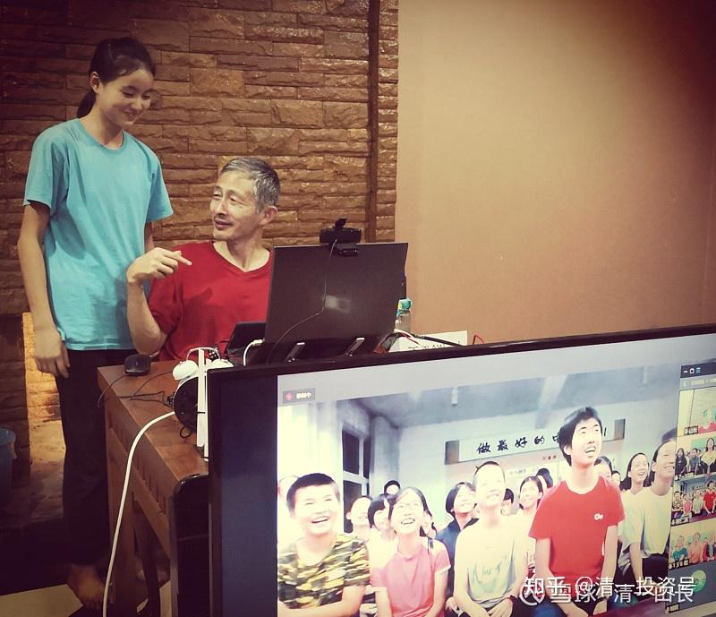

原雪球专栏187篇.37岁博士回家养老，会是你家孩子的未来吗？

清一山长 2021年7月4日

今日家长们在分享网上的一篇文章：“37岁博士回村啃老、榨干父母：养废一个人”。

微信网页链接：[https://mp.weixin.qq.com/s/5v6k3QOovPJo5jAVbs6_LQ](http://link.zhihu.com/?target=https%3A//mp.weixin.qq.com/s/5v6k3QOovPJo5jAVbs6_LQ)

我不同意这个文章所作的结论：认为养废一个人，是从夸他乖开始。我在内部群上的回复：废的原因，并不是从夸他“乖孩子”开始的，瞎说的。而是国人的一个持续了上千年的错误信念系统的问题，甚至我们清粉圈，甚至今日学堂的一些家长，都依然在相信和拥有的**一个错误信念：“万般皆下品，惟有读书高。**”只要学习好，成绩好，其他什么都不重要。

**真正的清一新教育，占第一位的信念系统是“服务他人”——不讨人嫌，让别人喜欢，才是最重要的**；**第二位的是会做事；第三位的才是——学习**好不好。当然，能力强的学生，可以做到三项全能——做人、做事、读书都好。未来的公主班学生，就是必须“三好”都好，文武全才，否则没资格当选公主班的学生。

昨天上午，我给婚恋营上课。接下来，接待了一个三口之家的私人咨询。晚上又给公主夏令营的全体小女生上课，讨论她们嫁人的标准问题，主题是男人喜欢什么样的女生？结果让孩子们笑坏了，也气坏了。我告诉她们：男人最喜欢漂亮的女生，让她们父母把她们生漂亮一点。如果不漂亮，就要多花钱，去做外科手术，把自己整漂亮一点。还要去学塑形、舞蹈、身体训练，把自己的身段训练好，还要会唱歌，会弹琴，会逗人笑。然后，好让男人看了开心，学会娱乐男人，男人就会喜欢你了。因为男人好色。

我让女生们举手，表示觉得自己很漂亮的举手？结果一个都没有。有两个倒是举手，表示现在不漂亮，长大后应该会漂亮的。我说以后就算不漂亮也没关系，可以去做外科手术，把自己整成网红脸。但女生们对这种取悦男生的方式表示不开心。问有没有其他方式，来嫁给想嫁的优秀男生呢？我就介绍了第二种方式，温柔贤惠。照顾好男人的生活，为男人做好服务，也可以赢得男人的欢心的！比如应该怎样做1、2、3、4……甚至还要去打工，养活男人和孩子，男人在家里什么都不做。很多女人现在就在这样做。女人越来越能干，自己养活自己，顺便养活男人。

（网络上课现场照片：我让艾拉作为“温柔女生”的代表，让女生们向她学习）

小女生们开始炸锅了：“我们女人，干嘛除了讨男人开心，就是要服务男人？为男人做事？干嘛就不能让男人服务我们，讨我们开心？”

我故作惊讶地说：“难道你们不知道，你们生活的世界，就是男权社会吗？这个社会上，你们女人是没有发言权的。既然是男人来定的社会游戏和社会规则，当然前提就是女人要为男人服务，要让男人开心和愉快，帮男人生孩子，做饭洗衣。只有原始部落，才是女权社会。原始社会的男人，要经历各种磨练才能得到女人的欢心的。现在，不是文明社会了吗？男人已经解放了。当然，妇女也解放了，不用来操心如何管理男人了[大笑]。”

结果：小女生们表示她们很不喜欢男权社会，要自己去做女权社会，不想当温柔贤惠的女人。我说，我们男人肯定不会同意的，你们想办法去吧！女生们这两天的任务，就是讨论在男权社会中，她们应该怎么办？

其实，这就是老子的教育模式——“欲取先予”。想让女孩子们自强，让她们自己来选择命运和目标，自己认清这个社会的现实现状。**想要适应的，就去适应；想要改变的，自己去改变。**我们不能去“拯救她们”，只能让女孩子们自己拯救自己。

这样的夏令营，这样的课程，**所谓的培养公主，并不是培养男人的玩物，而是培养自尊、自强的女性**。可惜，家长们似乎不理解公主夏令营到底在培养什么目标的女人。以为是穿花裙子，学会享受生活吧？

现在这个公主夏令营，有些家长虽然送来学习当公主，但有些女孩，已经是“公主”了——情绪和脾气都很重。娇滴滴、懒洋洋的，能坐着就不站着，有时间就玩手机游戏。还有人来了第一天，就嚷嚷要回家。第二天一早，父母真的就来校区，把孩子接回家了[为什么]。所以，我都不知道这种家长送孩子来公主班学什么？难道不知道今日学堂的公主班，不是教你学“娇生惯养”的吗？既然家长喜欢养“公主”，孩子就回家，让你养一辈子，你满意了吧？

其他留下来的学生，我告诉助教：“毕竟是夏令营，不要强行改变她们。只告诉她们事实，引导她们，想改的就改，不想改的，回家让父母养着去。”这种女生，男人也不会要的，没有男生傻到娶个“太后”回家养起来的，只能父母养了。

我示范的这种教育，就是**“成人教育”——教孩子们成为最好的自己，要学会服务自己和他人，而不是等别人服务。**

但有些孩子实在是**脑子不开窍**，就是**学不会“成人”**。这种人怎么办？就**要学会做事，学会行动，学会自立自强了。**

昨天的私人辅导，就是一个学堂的家长，孩子15岁了，已经是三语学生。现在马上面临考三语高中，还是做其他选择，就来找我咨询的。因为家长是海归，国外名校毕业，知道国外大学是啥样的，表示不愿意让孩子去读海外大学。孩子自己想当3.0（国际教师），但家长认为有很多问题判断不清，所以找我咨询。

我跟孩子聊了半个多小时，认为这孩子，读书是能读的，也比较服从，愿意努力。考上一流的海外大学，是没问题的。但是她的能量级很低，胆小、懦弱，缺乏领导力，不太可能当新教育教师，因为她没办法对付调皮孩子。这孩子也承认：她不喜欢管别人，怕管人。

我说将来不做新教育教师，想当教师的话，可以去传统学校。我还告诉她们：比如去泰国教中文，很容易找到这种工作的。懂三语，其实就业很有优势，也可以去做个文员。将来嫁个人，也可以做个跟别人一样的小女人，平平安安地过一生。但家长认为：这样活着就很没意思了，希望孩子活出勇气来，希望孩子改变懦弱的个性。我只好告诉家长：我倒是知道怎样改变，但是这对家长和孩子本人，都是一种折磨，孩子有可能不愿意，让他们好好商量去——就是**通过练武来改变个性，这是目前最有效的方法**。

家长很快就决定了：要亲自带孩子练武（是对抗性质的）。练一年后，希望送到清一武道馆来代训一年。我特别教了家长武道训练的方式——孩子个性懦弱、胆小，就别练对打，光让她去打人，练攻击，父亲练防守。等她的勇气出来了，再开始练对打。这样大约练两年，就完全改变个性了。这样她可以去上清一大学的人学课程、哲学课程，将来去新教育学堂带班，就完全没问题了。

面对这种知道自己要什么的家长，我的咨询期间很简单明了。做到“无私”即可，不要面子，只要满足家长的需求。如果我认为我做这样的建议，会损失一笔学费，我就让她继续读书。如果家长认为不上大学没面子，也让她继续读书。这孩子也不是读不下去书。成绩算是中等（今日的中等，就是体制大学的优等了），也愿意努力。但**家长很明智地认为：改变个性，才是第一位的。读不读书，上不上学无所谓**，所以才能轻松做出这种决定。

其实，现在选择了去武道馆训练的学生，家长们都是不要文凭的人（因为武道馆只能发我的清一大学“国学专业私人文凭”），也不在乎面子和学历，只在乎孩子的能力和实力。也因此，清一武道馆招人的标准其实是很高的。其中一些想做“职业运动员”的标准的学生，目标是拿世界冠军的人，必须是能够考上三语高中的学生，但不想去读海外大学，只想专业练武，只想拿冠军，才能来清一武道馆当职业队员，接受我的供养。其他也提供少量代训任务，但只提供给极少数特别的家庭。家长必须是特别理解新教育的。所以，**清一武道馆**，可以说是**全中国文化水平最高的武馆**。也许将来有一天，大家还会发现：也是中国武术水平最高的武馆！这就是新教育的最高学府——文武双全的人才。与公主班一文一武，成为新教育的闪亮双星。

今日的家长们，正在奉行：“行有余，才学文”的古训。你们在做什么呢？继续如文中博士一样？37岁回家啃老吗？**第一等的教育，是教人学会做人！第二等的教育，是教人学会做事！第三等的教育，是教人学会读书！**您认为体制教育，是奉行第几等的教育？

你以为是第三等吗？我告诉你实际真相吧！连第三等都不是。体制学校，连会读书都不教。反而败坏了学生的学习兴趣，教会你“反读书”、“反教育”，教出来大批厌学的学生。很多体制教师，自己也不会读书，不爱读书。**今日学堂“三年学完十二年”的项目，才能真正的教读书**呢！体制学校，会这样教人读书吗？

你就糊涂了：“体制学校连读书都不教，他们教干啥？”其实，“文革”时期的老体制教育，没教啥读书，但教了做事——“做共产主义事业接班人”。我们小时候要干很多活的，老一代的人，都很积极上进，没有人啃老的。其实很多人自己读书，也读出来了，不比别人差的。从这个意义上说，“文革”前的教育系统，还是很成功的。

现在的教育，现在的学校在干什么？就是提供一个筛选的平台，把社会需要的各种人，用考试等方式筛选出来。能读书的去读书，能研究的去研究，能干活的去干活，能创业的去创业。一些只会等靠要的废物，就回家啃老！**学校就是分流器，不关心教育的事情。**

所以，**现在这个时代，孩子能否出息，除了自己的愿望和努力，更依赖父母的智慧和指导。如果父母在家不教孩子基本的价值观和行为，一味丢给体制学校去“负责一切”，家长只管出钱的话，大概率，就是出现文中的“37岁博士孩子回家啃老”。**这种人，混了几十年的学校，却连一个朋友也没有，根本无法与人互动，不会工作，也不会做事，更不会做人。当然，也没女生会嫁给他。你就等着断子绝孙吧[哭泣]！

我的身边，已经出现了女版的啃老博士。我认识的一个女生，海外留学毕业的，现在30多岁了，在家啃老，也没朋友，更谈不上朋友圈。前段时间找我要付费咨询——我给拒了。告诉她：等她每天能跑10公里了，再来找我。连这个行动力都没有，我是不见的——连视频见面机会都没有！（其实，我就算收钱咨询了，我要提供的答案也基本一样——让她自己先动起来。别成天懒洋洋地躺在家里，这样的懒人，我能有啥办法？只能啃老等死。）

**现在这个时代，是考家长的时代——你进今日学堂，也一样考家长。我们教会孩子读书，拿文凭没问题。其他做人做事的教育——家长不配合，是得不到的。甚至你根本看不懂我们在教什么。**比如送来上公主夏令营，你认为是发个公主文凭，证明你有档次吗？[大笑]

估计这人除了读书啥也不会了，硬着头皮读到37岁（其实说明他读书都读不好，真会读书的人，20多岁就读完博士了）。他读完了博士，实在没有出路了，才回家养老的。只是我在担心：他父母死后，谁来养他？博士喔！不能死的，国和家，花了这么多钱来培养[加油]。

有文凭却放弃文凭不要的家长，看似疯狂，其实是最大的理性。我已经成年的孩子，都没让他们去读大学，去拿大学文凭。只拿“清一大学”的学历和文凭。我认为这是对他们最负责的表现。而最不想去上大学的小女，反而让她去读四个国家的大学（我对她的威胁是：“如果不去上四个大学，就要早点结婚，去生三个小孩给我[大笑]。”吓得她只好乖乖地去准备读大学）。

一心追求文凭，看似正常，其实是最大的疯狂。

其实，很多孩子，是不适合上大学的。特别是去海外大学，以及文科大学。诱惑太多，收益太少。**欲望重的孩子真不能去上大学，上了就废掉了。**所以，我一直跟家长们说：“**除非您的孩子特别优秀，欲望低，才可以考虑去海外一流的大学读文科。其他一般般的学生，最多只能去读理工科。如果更差的，学不好的人，就别去读书了。在家学干活，学门技术过生活，比去读一个烂大学、烂专业要好得多。别成天想做人上人，结果成了人下人！**[哭泣]”

参考链接：

[清一投资号：5篇.即将到来的“社会分层”如何面对和解决？](https://zhuanlan.zhihu.com/p/535106255)

[清一投资号：36篇.15岁上名牌大学 VS 99%的大学都不值得上！](https://zhuanlan.zhihu.com/p/545439129)

[清一投资号：39篇.值得所有家长看的纪录片：反省吧，家长们！](https://zhuanlan.zhihu.com/p/545526875)

[清一投资号：68篇.我以为考上了985，就不愁找工作！](https://zhuanlan.zhihu.com/p/555244021)

[清一投资号：99篇.你家孩子，是第几等人？要用几等的教育适配？](https://zhuanlan.zhihu.com/p/569930721)

[清一投资号：106篇.借用外脑，是最低成本的改错方式！](https://zhuanlan.zhihu.com/p/571033703)

[清一投资号：111篇.做事一定要有规划：嫁女也一样！](https://zhuanlan.zhihu.com/p/573549252)

[清一投资号：130篇.凯利的生日礼物：你给别人的越多，你得到的也就越多](https://zhuanlan.zhihu.com/p/580335132)