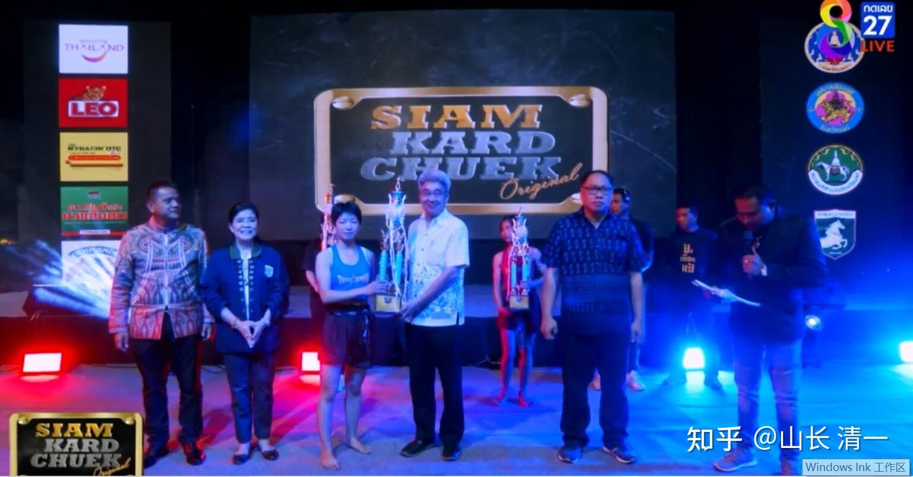

11月5日的缠拳战，顺利打下来了。木兰佳慧没有被打花脸，还拿到了一个很大的奖杯。但场上的对拼，也是木兰开战以来最凶猛的一次。上一次征泰第30战的高壮对手，虽然双方对战的水平很高，但双方都很谨慎，没有大打出手，算是低烈度的技巧性的对抗。当时木兰由于考虑到马上要打缠拳战，因此采取了很保守的打法。虽然双方的技战术很高，可场面不好看，只有高手才能看出其中的奥妙。

但这一次的缠拳战，对方居然请来了是曼谷拳场的签约高手，不会在地区拳赛中打比赛的现役高手，目标就是KO木兰，所以本次比赛，双方场上拼得很猛。可以说是这一次缠拳赛全部9场比赛中最好看，让现场观众最激动的比赛，就是木兰的开场比赛了。观众的反应就是要比后面的男拳手比赛要好看很多，精彩激烈得多。跟大家想象中的泰国女拳手的比赛，沉闷无趣，就完全不一样。所以主办方这一次，非常的开心，给两位参赛的女拳手，都颁发了奖杯。奖励泰国北部在三年来，第一次举办的缠拳比赛中，表现最优秀的最佳拳手。这是木兰带回来的第二个泰国主办方的奖项，第一座颁发的奖杯。设计很漂亮，拿回来就引起了木兰们和公主班的围观。大家心中都痒痒的，也想将来去弄一个奖杯回来。不过----新木兰可能就没有佳慧这么好的机会了。我已经发现泰方对我们的木兰拳手，有日益增长的关注和嫉妒，还有专门为我们量身定做的阴谋和手段。很幸运的是---本次比赛支持木兰的泰国老拳师，以师父的名义，带领木兰们去到的现场，估计是他认为这场比赛很不寻常，非常的重视，所以亲自带木兰去比赛。上一次举行的金腰带二番战，他都没有出来的。 这一次参加比赛，幸亏有老拳师的参与，由于很多拳场上的裁判和主办者是他的学生，他了解到很多的内幕。我们才知道：这一次的比赛，不是一次简单的比赛。更不是拳手之间的恩怨。而是泰拳的背后资深人员，老牌泰拳的馆长教练们，对木兰战力的一次摸底测试。他们在一个月前就精心设计的一系列圈套。泰方要用各种可能的手段摸清木兰的真实战力。而且为了不露底，还让泰国最顶尖泰拳俱乐部的高级拳手，改名换姓，甚至以一个普通拳馆的名义来报名参加本次地区比赛，目标就是摸清木兰的战力同时而不暴露目标，如有机会，就借缠拳战的残酷性KO木兰复仇。所幸木兰靠高强的技术，以及良好的心理素质，最终让泰方铩羽而归。没有占到啥便宜。但---未来我最担心的，就是会不会将来泰方会给我们设计更深，更可怕的算计？如果各位知道---几天前举办的第30战，其实并不是当时以为偶然的比赛，它其实是这一次缠拳赛有机的组合部分，是开战前奏之一，你会不会奇怪？

*木兰获奖缠拳赛最佳拳手奖杯*

*最佳拳手获奖者三人，木兰对手也同时获奖*

*当地最高城市长官（市长）发奖给木兰*

什么是泰国签约拳手呢？泰拳是分区进行比赛的，有很多不同的赛场。一般分为泰北地区，泰南地区，中部地区，东部地区等。清迈地区就有三个拳场，只要是职业拳手，有拳馆的推荐，你就可以来这些拳场打比赛从初级到高级的对抗都有，主要是打给游客看的，收门票来支付拳赛的开办费用。给拳手的拳酬，就是勉强够生活费而已，受了伤，养伤都得自费。好处就是：几乎每天都有比赛，因为每天都有游客想看比赛。因此这种地区拳场的最大好处，就是给了拳手最佳的比赛机会，可以练出良好的赛场经验来。所以泰拳上的场上经验，心理素质，比赛技巧，都是非常成熟的。这在中国，就几乎没有这种条件，想打真正的实战很难。所以很难出优秀的拳手，这就是一个拳手的熔炉，什么人都可以炼出来。

除了有规律举办比赛的拳场，还有一些入场标准更低的赛场，只要谁想上去，约好了对手，就都可以打一场的泰国庙会比赛，一般是村镇一级的单位主办的，他们拿钱出来给拳手和裁判，相当于为本村镇提供娱乐活动，当然，拳酬很低，一般就是500-1000B。一些新拳手甚至就不给钱，让你去试一下。各位会看到一些七八岁的小孩子上场打比赛，就是这种乡村庙会拳场。在这些地区级的拳场比赛中，很多人表现平平，有输有赢，比赛没啥出彩之处。这种人，就只能留在低级拳场里面打日程赛事，勉强糊口。年龄大一点，觉得没啥出头的机会，就自动退出了比赛。去结婚，就业等等。但其中，总有一些天赋良好，表现突出的拳手冒出来，比如比赛就一直赢对手。这些赢率很高的拳手，就会获得地区比赛主办者的注意。会给更上级的主办机构推荐拳手去参加更高级的比赛，有点想选秀比赛。类似佳慧参加的这种，某个城市举办的大型庆典比赛，这种比赛的拳手，一般来说都是该地区的优秀拳手。正常情况下，泰国最顶尖的拳赛组织者，会参与这些城市庆典的活动。还有如果有地区拳场主办人的推荐，会有意的跑来这种赛场，现场观察某个表现优异的拳手，甚至他们会安排一些特别的拳手来和新秀对战，衡量新拳手的实力。不知不觉之间，就利用比赛完成了考察工作。觉得好就再继续发给拳手比赛邀请。如果觉得不好，就悄然放弃。拳手完全不知道背后发生了什么。因此也没啥期待和失望的。比如这一次，佳慧肯定是一些拳场关注的对象，老拳师一定要跟著去，肯定是要跟一些人交流。不然不会赛后马上告诉佳慧她已经获得了曼谷的比赛邀请，日期都基本定了（大约是12月5日）。 如果去曼谷的“核心拳场”比赛，表现继续很良好，打起来有吸引力，有实力的话，就有可能成为两大拳场的“签约拳手”，专心在泰国拳赛最高的中心拳场打比赛，如果连续大几场比赛都比较令人失望，就会触发退赛机制，拳手会发现收不到比赛安排了，只能黯然退出，重新去地区拳场混日子。

这个选拔机制，就是这样，一层一层的建立起来，拳手可上可下，都有机会。这就完成了泰拳的金字塔结构，每年都在推陈出新，不断推出更优秀的新拳手。中国格斗之所以世界上排不上名，很难出一些优秀拳手，就是没有这个有效的选拔机制，整体上我们国家缺乏格斗手的生存土壤。泰国的这个筛选，资金，人流进退的机制，已经相当的成熟，中国再花几十年，也未必能够建成这样的机制。因此短期内指望中国整体格斗水平提高是不现实的。不可能有人会像我一样会，自己花钱，而且必须连续投入很多年，根本不指望回报，来做这件事情。只有傻瓜才会像我一样来不求回报的培养拳手。没有这个供养机制，技术再好也出不了人才。泰国连村镇一级的单位，大家都愿意筹钱出来举办一场拳赛。全国这样子层层选拔，当然会出现一批一批有才华的优秀拳手。中国的格斗俱乐部制度，根本就没有这些东西，所以最终都陷入了山头林立，自我封闭，自然衰落。各地拳馆基本上沦落为骗小孩子钱的俱乐部。而泰国的拳馆，反而是穷拳手的俱乐部，一分钱不要就可以去拳馆训练，只有外国人才需要出训练费。这样就让泰拳入门相当的容易，任何泰国人，想打拳都有很好的机会，甚至是冠军拳手来教他们。中国的很多搏击俱乐部，一堆啥都不懂的水货也在忽悠人。所以，格斗强国根本就没有中国的份，理论再强大，也没有实践的土壤。所以，外国人鄙视中国的格斗水平，也完全不奇怪！

泰国的拳手圣地介绍：在曼谷市中，座擁兩個堪稱為「泰國泰拳聖地」的比賽場所——**Rajadamnern Stadium（迦南隆拳場）及Lumpinee Stadium（仑披尼拳擊場）**。 Rajadamnern Stadium是泰國史上首個職業化的比賽拳場，建立於1946年】。

作为这两个拳场的拳手，一场最普通的比赛报酬，大约是城市庆典的一到两倍，各地区比赛拳酬的10倍，是庙会拳赛的20倍。在两大拳场打一次比赛，比你在地区拳场打两个月的收入还高。更重要的是：你还有机会参加一些高级的比赛，有可能一场重大的比赛就会拿到上百万的奖金。因此---所有的泰国拳手，最大的梦想，就是去曼谷两大拳场比赛，更幸运的人会成为两个拳场的签约拳手，以后就可以专心在两大拳场比赛，不用去其他拳场了。这就是功成名就的顶级拳手了。但大多数泰拳手，可能一生都没有机会走上这两大拳场的舞台。一生都只能在地区拳场以及庙会拳台上打比赛。这种地区性拳场给的拳酬，虽然饿不死，但也只是饿不死而已。想买房买车，是没机会的。如果有机会走上顶级擂台，打一年下来，起码车是有了。如果你一直赢，你的拳酬就会越来越高。如果一场重要的赛事你取得了成绩，拿到了冠军奖金，可能房子也买下来了。所以，这两大拳场，就是泰拳手们心中的圣地。终身的梦想。就算去不了，他们还会希望培养自己的孩子去比赛。泰国热爱泰拳的所有人，永远会是两大拳场的粉丝，观众。所有的拳手，都对能去两大拳场比赛的拳手充满了尊重，更别提签约拳手了---因为这种资格，代表了水平绝对不一般。正常情况下，两大拳场的签约拳手，是不能在其他拳场打比赛的。两大拳场互相有一定的“竞争关系”，分别拥有不同的拳手，彼此之在自己所属的拳场打拳，很少有同时在两大拳场打拳的人。自己偷偷去外面用自己的拳场身份打拳，属于“打黑工”，会被“领主”处罚的。她们更不会在下面的普通地区，打普通的比赛，因为拳酬也很低。她们才犯不着去参加低级别的比赛。可以这样说：各地区的各种比赛，就是选拔赛。每年都会选择最优秀的拳手，进入“顶级阶层”，两大拳场。除此之外，还有一些新的比赛项目，也在吸引和招收优秀的拳手成为签约拳手。比如8号电视台的体育节目。他们靠自己更大的名气，以及更高的拳酬，成为抽水机，或者成为泰拳的精英阶层，成为泰拳的世界级代表。目前据说：迦南隆拳場的水平技术是最高的，本土技术含量最高，主要参与者是泰国人。在泰国拳界的影响力最大。不过--如果谈到国际化，以及对外宣传做得最好的是仑披尼拳馆，外国拳手参与的比赛最多，水平也是一流。风格也杂一些，不够纯泰！老拳师有点希望木兰去迦南隆拳場。我们倒是随意。哪里有机会去哪里。反正这么多木兰，将来可以分别去不同的地方打拳。

这种两大拳场的签约拳手水平到底有多高？跟地区冠军的差别有多大？我们也不知道，只知道NAMWAN这种世界冠军，她会得到去两大拳场打比赛的一些邀请，有机会和一些签约拳手打比赛。但她目前，还不是这两大拳场的签约拳手。所以---很简单就得出的结论，就是普通的泰拳世界冠军，还没资格当两大拳场的签约拳手。只能参与一些互相的“友情比赛”，NAMWAN在曼谷的比赛，不是常胜，而是有赢有输，她的确没有必胜的把握。她拿到的泰拳世界冠军是真的。但泰国人自己根本就不把“泰拳世界冠军”放在眼里。因为泰国本土两大拳场的冠军身份，含金量比“泰拳世界冠军”更高。更多资深的优秀拳手，比如签约拳手，是不去国外参加比赛的。一些国际比赛，估计不是商业比赛，可能是世界性的文化交流比赛，因此拳酬也不多，顶尖拳手根本就不愿意出去。这就是在泰国令人哭笑不得的结果----世界冠军，可能还不如国内冠军厉害的核心原因。这两种冠军，在比赛中是不会遇在一起的。所以NAMWAN的师妹---一个拿到了【青年世界冠军】称号的拳手，已经被我们KO了两次。她在清迈拳场的比赛，还打不赢被我们KO的拳手，她国内比赛居然多次被击败过。所以----擅长外战的泰拳手，击败了外国人的拳手，未必是国内优秀拳手的对手。

据说namwan正在参与一项重大的资格赛，也许通过之后，她就可以升级成为两大拳场的签约拳手了。我们知道这个消息，是NAMWAN原计划11月与佳慧打二番战的，但最近表示要推迟到2月份了。因为她这两个月都要打资格赛。木兰问老拳师自己是否有机会打NAMWAN参加的这种“资格赛”，答案是：这种资格赛，不是一般拳手能参加的，首先是拳手必须要有NAMWAN这样的实力和资格。还要外加一些“关系”，有高级的泰拳资深人士推荐你，才有机会参加。现在，老拳师是有“关系”的，他可以找到能够安排资格赛的人。但他认为木兰的实力还不够，打比赛的资格也不够，打过的高手仅仅是泰北的，还需要与全国级的高手打一些比赛才会有资格。她还需要通过一些高水平的比赛来证明自己，比如她还要看是否能获得两大拳场的比赛邀请，参加与全泰国最顶尖拳手的比赛，然后大家都发现她的比赛成绩良好，再加上还有人推荐她，才有机会参加资格赛。这一次8号电视台的比赛， 以及上次与NAMWAN的比赛，就是老拳师可以借此比赛推荐她的“有价值的比赛”。拳酬多少，倒不是要点。8号台原计划，是不转播女拳手比赛的，因为女拳手的比赛往往都不好看，只是男拳手正式比赛的赛前花絮。但老拳师威胁：不转播就不来参加比赛了。对方无奈，做出让步，但要求降低佳慧的出场费，扣掉40%作为给电视台加班转播的“酬劳”，这样才为佳慧争取到了转播的机会。当然，8号电视台这一次也特别开心---原以为是不起眼的赛前花絮，普通的女拳比赛，没想到竟然成为了“高手对决”，打成了本次比赛最大亮点，热点。比后续的男生比赛好看多了。因此这场比赛后，电视台就向佳慧发出了比赛邀请。12月初就可以去曼谷打8号电视台的高级比赛了，承诺的拳酬，至少是缠拳赛的一倍，清迈赛场的6-10倍。

怪不得，原来泰拳的等级和核心资源，都掌握在一些有权利安排重要比赛的“拳霸”手中。所以，一些天才拳手，比如投靠他们，才有机会参加比赛。比如播求和他的师兄，当年最顶尖的泰拳手，就是一个小拳馆培养出来的。但这家小拳馆的教练，却没有办法喂他们安排理想的比赛平台。为了他们的长远发展，在已经把他们初步培养出来后，就找曼谷的更高级的老师，让他们进入更高级的拳馆（应该就是掌控了最高级拳手比赛机会的泰拳界实力人物），他们才有机会安排参加一些高级的比赛，才有机会去打更高级的比赛，拿到更高的奖金。为了获得这些机会，年轻的拳手，不得不以出让更高的分成给这些实力人物，才有机会加入这样的“高端俱乐部”。控制这种机会的人，就拥有挑选，甚至是夺取其他没有关系的人培养出来的优秀人才，让他们成为自己的摇钱树。而普通的小拳馆。就永远是苦巴巴的为他人做嫁衣了。“阶层地位”，在泰拳界如此清晰地存在，令人叹息。

一般来说这个分成比例是50:50。拳手和高级拳赛的代理人（师父）各拿一半，我听说每场比赛的拳赛安排人，还要拿走10%的“小费”。普通没有关系，没有背景的小拳馆，根本没有这种实力去安排高规格的比赛，就算手上的拳手很优秀，参加不了比赛也没有办法证明自己，所以必须把弟子“送给”这些曼谷的权贵中间人。播求的师兄，据说当年被拿走了70%以上拳酬，他对此不满，跟他的师父吵了一架。从此就被这些拳霸禁入，失去了在泰国参加比赛赚钱的机会。最终他在泰国穷愁潦倒，后来只能去香港发展。而播求虽然才华出众，可能是因为他原来的拳馆教练，得罪了本土的权贵，他也失去了泰国发展的机会，始终无缘于两大拳场。他就只能向海外发展，去打日本的K1。所以，中国人认为大名鼎鼎的播求，以为就是泰国的拳王，泰国第一高手。其实----他连泰国两大拳场的签约拳手都不是。泰拳界内部，据说他的地位并不是特别的高，只是在外国很有名气。还有中国人特别喜欢的善猜，也不是签约拳手。泰拳界认为他们只能打外国人，真实水平，并不是泰国一流的。对内打比赛，他们也没啥优势。前几个月，泰北举行了一次类似佳慧参加的这种地区的节日拳赛，善猜就被本土拳手轻松击败了，好像是被KO了，但我没看到视频。播求今年有两次比赛，虽然在泰国比赛，我看了对手，水平很差的。跟他不是一个级别的，所以应该是商业比赛。非关实力。他赢的毫无悬念。恐怕----他也没参加过泰国的“资格赛”。当然他也没必要参加。国外的K1比赛奖金，要比泰国的本土比赛的奖金多得多。他的名气很大，赚到的钱比本土比赛更多。只是泰国内外有别，有些拳手是专门打国内比赛的。一般不外出。其实---播求就是K1的签约拳手。按规定，他也不能参加其他机构的资格赛吧？商业赛属于娱乐性质，应该不在限制之内。

我说这么多的故事干嘛？其实就是---佳慧这次的对手，就是曼谷两大拳场之一：迦南隆拳場的签约拳手。而且---她是用假名，假身份，代表北部的拳场，来参加的比赛，真名直到现在我们都还不知道。之前还有很多的隐蔽手段，目的就是要终结木兰的连胜势头----虽然木兰有几场比赛，因为打满五局被判负，但泰拳界自己知道----真实的结果还是泰方输了，只是没有被我们KO而已。而且木兰比赛以来，从未被KO过，这也是一个奇迹。因此这个人就是当地的赛事主办方，专门去曼谷请来的高手，就是要利用我们没打过缠拳比赛的机会，用泰拳的顶尖的老手，来KO木兰，特然泰国的北部拳手们，找回一点点面子。毕竟缠拳战打满五局就是平局，竭力KO对手就是双方的目标。

但泰方自己知道木兰的实力：就他们专程从曼谷请来了签约拳手，但能否终结木兰，依然没有十足的把握。木兰原来去训练的泰拳馆的馆长，不久以前无意中对别人说：泰北地区，已经没有人能击败木兰了。凡是能打一点的拳手，都已经被两个木兰全部击败了。关键是：清迈的拳场，甚至请出了泰北原来打过60公斤级的拳手来打不到50公斤木兰。虽然技术上不是顶尖的，但她也是优秀拳手，10公斤的体重差距，依然没有占便宜，最终还被木兰KO了。这导致泰拳界内部，认为这一次他们遇到了木兰是劲敌。因此才有了一系列的骚操作，潜规则，意图至少这一次，可以彻底击败，KO木兰。为泰拳争取一点荣誉。

这次赛事，是起因于征泰22战的对手。这应该是泰方在泰北拳手中，找到的跨重量级的优秀拳手，当时认为是唯一有可能“干掉木兰”的拳手了。但以10公斤的体重优势，她最终依然被木兰场上KO。此战后，泰北的拳馆馆长们，已经知道：泰北再也找不到可以击败木兰的拳手了。因此就只能“请外援”了。但为了要面子，也为了保险，不至于太丢脸，因此要假装是泰北的拳手，他们先以这个被KO的拳手名义，来挑战木兰说：上次被KO，是她生理期。所以状态不好，她不服，还要跟佳慧再打一场。问佳慧敢不敢打11月5日的缠拳战？木兰心想:谁怕谁呀？你体重优势上次又不是没体验过。照样摔，照样打。缠拳战有啥了不起的？因此毫无犹豫的答应了参加比赛。只是泰国的老拳师有点奇怪，多次反复确认：你真的要参加吗？似乎过于谨慎了一点。当时还不知道为啥这样慎重。但老拳师，显然是知道这场比赛非同一般的。

比赛一周前，原来来挑战的拳手，突然说：自己得了新冠，不能参加比赛了。所以，她所在拳馆的馆长，就主动联系老拳师，说只能换一个拳手来跟佳慧打了。这次是一个体重虽然比佳慧重几公斤，但比60公斤的人肯定要轻得多，大约是53-55公斤左右。而且这个拳手，原来也跟佳慧交过手，就是被佳慧9连膝KO的人。佳慧认为：原来的对手，拥有体重优势，跟她打还是有点费劲的。换了这个新对手，就更轻松了。所以当然不在意。我们还认为：泰国北部，真是找不到厉害的拳手了。打个缠拳战，都找不到厉害一点的人，只能拿原来被佳慧KO的拳手来打，到时候不是场上毫无悬念的再次被KO吗？

其实----我们已经开始上当了。这就是泰方希望我们这样想的。一开始，泰方就没打算让这两个拳手上场打缠拳赛。早就约好了曼谷的关系，找来一个很厉害的签约拳手，而且改了名字，假装是北部这家拳馆的拳手。还改了战绩，公开的战绩只打过20战（在泰国这就是非常初级的拳手了），而曼谷的签约拳手，一般有两三百战的历史都是很普通的。

----木兰们到达赛场后，才知道又换了对手。这个人，看似人畜无害的样子，体重居然与佳慧差不多。而且---一见面就抱怨，她也是临时来替换别人比赛的。她的师父提前一天，才让她来参加这个缠拳赛，她根本就没做任何准备，不想打的。而且几天前，也是只提前一天，被师傅突然要她去替补一个拳手在曼谷的比赛，结果因为不熟悉对手，结果被对方KO了。很委屈，很无奈的样子。木兰也相信了她，觉得她好小白，好无辜。也认为泰方好像儿戏一样，找不到对手了。越找越差。对手的体重越来越轻，从60公斤降到53公斤（官方体重），实际木兰看，觉得跟自己的体重身高应该差不多，似乎不到53公斤。而且此人还根本不知道木兰是谁。也没看过木兰的比赛。像个傻乎乎的小白一样。因此赛前一天双方拳手的见面后，木兰认为这个新对手，不会比原来的对手难打。甚至会更好打。隔日比赛，KO对手毫无问题。（其实，这些都是烟幕弹。就是让我们轻敌的。赛后老拳师了解到的内幕情报，是这个拳手，就是专门针对木兰选出的高手，已经针对木兰备赛很久了。目标就是要利用一切机会来KO她，为泰北的拳场找回一点面子来）。

比赛前，还发生一次很有意思的小插曲：第一天达到外府报道的时候，拳手们安排都住在同一家旅馆。艾拉去采访了对手，但老拳师告诉我们，赛前尽量不要跟对方的拳手多接触，有人会认为我们有私下交易就麻烦了。因为这场比赛有电视转播，很多人会去参与赌拳的。如果我们有事先的场外私人接触，有人输钱，就有可能认为是我们双方有私下交易，有可能造成纠纷。此后，木兰们也尽量避免与对方接触。但第二天，赛前几个小时，对方居然主动来联络艾拉，说希望帮她做头发。她找不到人帮忙，可伶兮兮的样子。这有点奇怪---参加这种重要的比赛，肯定会有助手和陪伴一起来的，居然连做头发都找不到人？好像拳馆根本就不关心她，没人帮她一样。还要找对手帮助？不过，艾拉和佳慧也没多想，本性很善良，相信对方的话语。两人就一起去帮对方做了比赛的头发（女性为了防止比赛中掉落而进行的特别固定方式，如张伟丽的发型就需要专门来做的）。但我心中就想，这件事情很奇怪。泰国人不至于找不到本国人帮助，这是对手“拉关系”的表现。也许她是有意与木兰“建立感情”的手段，让你认为大家都是朋友，因此打起来就心软一点。 真怕了吗？但我们当时也没有多想。

其实-----换人，换名字，换拳馆，换资格，拳手示弱，装可爱，让你轻敌，还不是极致。泰方还有更深的算计。主办方的人，已经提前布置了一个大大的陷阱------提前一天的称重，主办方接待人，一再的吹捧木兰，说她很厉害，看过她取胜的场次，全都是KO对手的。双方见面的以后，主持人还一再的交代双方拳手：为了比赛好看一点，希望前面两局，打慢一点，不要KO对手，让观众看的更开心一点。这个----看起来很正常的要求。而且，泰方其他人，也有意无意的表示：这场比赛毫无悬念，佳慧肯定会KO对手的。都表示特别看好佳慧。我让佳慧这一场比赛，把拳酬用来赌自己赢，说：如果赌赢了，你有双倍的钱可以用来买礼物给泰国人。如果输了你无非是白打了一场比赛，自己一点都没损失，还增加了知名度。而且，由于打满五局判平局，你这一次根本就不可能输，裁判都黑不了你，因为泰方不可能KO你。

但很意外的是：泰方居然不接招。说：这次比赛，对手的体重，身高，技术，资历等都不占优势，是找不到人来赌对手赢的，因此不接受佳慧的赌拳要求。这让佳慧有胜券在握的感觉，优势特别的明显，连赌拳的人都知道佳慧准赢。这一点其实有点奇怪---这是外府的比赛，知道木兰的泰国人应该是很少的。难道木兰知名度已经大到了令泰国人望而生畏的地步了？我相信不可能所有人都赌木兰赢的，更多人，应该赌泰方赢。常识就是泰方优势。赛前，一个外国拳手跟佳慧一起做赛前准备，当知道佳慧是中国人之后，马上就说了一句:YOU DIE！（你死定了）。大多数人，都相信中国拳手是不行的，特别是打这种缠拳赛，特别残酷（结果很搞笑，这个外国拳手上场被泰国拳手KO了，他说了要DIE，结果自己倒下了）。

居然这次比赛不接受木兰赢的赌金？我有些意外，但也没在意。 我还想：这样也好，应该是一场公平的比赛，起码裁判不会黑佳慧了。其实，这就是一个陷阱，故意让我们轻敌的，佳慧差点就掉进去了。而且场上的裁判一点也不公平，一直在拉偏架。后来佳慧反馈说：内围战佳慧刚取得优势的体位，正准备发力攻击KO对手的时候，就被裁判拉开。而且当她有机会，对手露出破绽，她上去正准备加速攻击的时候，裁判就完全没有理由的大叫停，停，扰乱木兰的进攻（这一招特别狠毒，万一木兰犯傻，听话停手，同时对手乘机反击，就会KO木兰。只是木兰就算停止攻击，也防守严密。对方才没有得手）。弄得老拳师在台边观战，都看不过去了。打电话找对方的上级主裁判去抗议，后面才勉强好一点（电视转播是听不见裁判说话的）。但场上裁判依然公开的偏袒对方，甚至还公开表达---泰国人就应该帮助泰国人，让泰国人赢，大家都开心。意思就是老拳师作为泰国人，怎么出来帮中国人了。裁判依然在场上尽量帮助对手，让对方避免被佳慧KO。简单地说---这一场比赛，是泰方从拳手当裁判以及接待人，都集体来对付木兰的一场阴谋，只是没有得逞。

因为：泰方让我们放松警惕，特别是要求我方前两局慢慢打，不要KO对手的时候。这就是一个大大的坑。对方拳手得到的拳馆教练的指令，是完全相反的。就是利用我方的轻敌，突然发动猛烈的进攻，击垮木兰。显然，泰方认为中国木兰的身体很强壮，体能很好。泰国一直发现：每次比赛，就算打满五局，我们的木兰也完全没事的样子。但泰方的拳手，往往在场上第三局，体能就消耗得差不多了，接下来很容易因为体能下降被我方KO，每个拳手都说跟木兰打比赛特别累。所以泰方认为跟我们拼体能，不可能有优势。因此给对方拳手的要求，就是一开局就出全力猛攻，争取在前两局就KO木兰。所以，比赛一开打，我就发现局面不对：一方面这个拳手绝非庸手。技术水平甚至好过我上次说【目前最高水平的第30战】拳手，老拳师也说让NAMWAN来也打不过的拳手。这人还更厉害----她的反应，特别是防守技术特别好。进攻的时候，拳和腿的速度力量都很大。其他泰拳手，包括NAMWAN，都没有她的拳腿力量更重，速度更快。

缠拳比赛开始，果然意外了。赛前温柔，可爱。毫无信心的对手，突然就变了样子。很意外地一开场她就开始猛攻佳慧，完全不考虑体能储备，这完全违背了泰拳手一贯的作战方式（泰拳一般是前两局节省体力，第三局双方才开始猛攻）。实际上，由于双方拼得太猛，特别是前两局泰拳手过于猛烈的攻击，导致她体力不支，第二局体能就消耗得差不多了。第二局快完的时候，居然被佳慧一拳击倒。第三局以后，她体能不够了，都是消极避战模式。特别第四局，就是一脸的恐惧，尽量避战，生怕被佳慧KO。我看直播，也很意外佳慧居然没有乘胜追击。特别是第五局，场上局面就是明显双方罢战的意思，双方都无心恋战。对手不想打，完全可以理解，她根本就没有赢的希望。但佳慧也不出手，就有些奇怪。后来才知道：第四局打完后，老拳师就交代佳慧：下一局，就不要追击对手了，我们打满五局就行。意思就是不要KO对手。怪不得场上是这个局面。裁判也对双方的消极避战，根本就没有处理。我估计，老拳师可能知道了一些内幕，认为也没必要赢下这一场。双方平手，给主办方一点面子，给泰国人一点面子，我们场面上也不吃亏。这样的结果就最好。所以，就让佳慧第五局不要继续进攻了。所以，第四局，第五局的对手，其实是非常的狼狈。她按照师父的吩咐，依计而行，开场就猛攻，导致前三局，就完全耗尽了自己的体力。而佳慧前几局，主要是防守反击，虽然也一样硬拼回去，我教她就是对方温柔，你没必要太狠，但如果对方狠，你要比她更狠。因此她防反也毫不客气。由于对方大开大合的攻击，特别连续攻击，更消耗体力，所以佳慧的体能储备也更有余地一些。佳慧如果后几局，强行反攻的话，她必然会被KO的。因此我看到场上，就是对手后面三局都是一脸的恐惧，毫无斗志，拼命的躲避，避免被KO的命运。再也没有前两局的威风。最终比赛结束铃声响起来的时候，对手很开心，马上就放松了，噩梦终于结束了。但对手非常的懂事，她知道自己逃过一劫，不是自己有本事，显然是佳慧场上放过她了，没有追杀她。所以在场上，在全国转播的电视机面前，她主动的跪下去礼拜，不仅仅是她礼数周到，更应该是心照不宣的感谢佳慧“不杀之恩”！泰国人的细腻和用心，真的是表现极致。打比赛特别凶狠，打完了比赛，就变得特别的温柔---礼仪之邦，的确称得上。

我认为这个结局也很好，虽然没有赢比赛，但我们赢了朋友，也赢得了主办方的心。这个结果也是他们最能接受的。如果我们KO了对手，场上的确很不好看。相反，这一场，双方场上双方打得很激烈，拼得特别猛。但最后双方握手言和，言笑晏晏，也让观众非常的开心。同时，我们也没有让押注泰方赢的人输钱。所以---平局，的确是对双方来说最好的结果。只要是看了比赛的人，都知道木兰是明显完全控场了。在直播的过程中，海外的留言跟帖在第一二局刚打完之后，就开始议论：这一局，红方（泰国方）会输的。外人都看出来了，当事人当然知道第三局之后的结果了。

好心有好报：佳慧比赛后也收获了她想要的礼物。老拳师告诉她----曼谷的比赛安排，已经基本确认了。下月初就举行。现在，曼谷的核心赛场，终于对我们开放了。8号电视台，同时也举办包括MMA，K1在内的诸多格斗对抗比赛， 这一次木兰在8号电视台的亮相，非常的精彩，获得了主办方的青睐。征泰道路，今后将走上更高一级赛场了。

对了，还忘了补充说明：对方为了这次比赛干掉木兰，还有一个大坑，被我们无心地避开了。如果我们太贪，非要赢，就有可能上当。

第30战安排的比赛，说是临时安排的，其实也是泰方精心为佳慧准备的圈套。之前是为明晓安排有一场比赛，但临时主办方告诉我们：安排错了人。对手是比明晓重了差不多20公斤的一个拳手。这个对明晓来说是很难打的。所以，这其实是安排给佳慧的比赛（实际上也比佳慧重了差不多10公斤）。主办方假装是弄错了两个木兰（其实是故意的）。但由于已经安排了比赛，海报已经公开了当天有国际比赛的，为了信用，也只能勉强佳慧去打比赛了。其实---这就是泰方的居心。由于三天后就要打缠拳赛，泰方想要用一个精心选择的人，不仅仅技战术水平很不错，而且体重很重的拳手，提前来拖住佳慧。这个人是很有可能击败佳慧的，老拳师都承认:namwan来都打不过这人的。但为啥不拿她来跟佳慧打缠拳赛呢？因为她和佳慧的比赛，是不能拿到公开的电视台去打的，因为正规的大型比赛，特别是电视直播的，对双方的体重有严格要求，差距不能超过2公斤。这人一看就知道是欺负人，又高又壮，违规不说，打赢了也不光彩呀？但如果在正式比赛前安排这种高难度的比赛，如果这人能够提前KO和击败佳慧，三天后佳慧带伤去参加公开的缠拳赛，就很容易输掉。就算不能击败佳慧，这种重的体重，佳慧拼下来，也会精疲力竭。这就是泰方的规划。当时，佳慧接到比赛的任务告诉我，其实我也有点奇怪。我虽然不知道对方是高手，但光体重身高体重多出这么多，我也担心影响更重要的缠拳战赛事。就特别交代佳慧:这次去打，就当练习赛。不求胜负，不求KO对手，你自己支撑下来，比赛不受伤，不消耗体能就行。因此我就只她打防守反击，让裁判催你攻击都不主动攻击，另外尽量避免内围战，就算能赢，也不打，避免消耗体力。这样也尽量避免意外受伤。不然就算这一场赢了，三天后也会吃亏的。缠拳比赛，才是我们最重要的比赛。木兰佳慧完美的执行了这次的赛前安排。泰方的节外生枝，特别安排的这一场加餐，虽然因为打满五局判输了，但我们不在意结果。只是锻炼了木兰的心态和反应，但没有造成伤害（泰拳比赛一场的话，就算是赢家，很顺利打下来，一般小腿都会受伤）。身体也不累。基本上满血参加缠拳赛。如果我们第30战，我要求木兰竭尽全力去打，希望她KO对手的话，一定拼的很激烈，就算最终拼下来赢了，估计也会影响缠拳战的比赛。

最终的思考和结论：

此战的过程说明，显然是泰方已经有组织，有计划地针对我们采取行动了，泰方高度重视木兰们带来的泰拳冲击。提前一个月，就处心积虑安排种种细节，试图打跨木兰。虽然没有成功，但足够让我们非常的警惕，避免以后中圈套：

必须明白的是：泰拳是泰国的骄傲。一个木兰的胜利，就已经让他们有如此强烈的反应，设计了种种圈套来对付我们。第一是说明：在泰国，不是有本事就会有机会的，不是真正公平的。如果完全公平的真打实战，就算拿出看家宝贝，泰方也认为不一定能够赢我们。所以才会如此的处心积虑，花一个月的时间来布一个局。以后肯定也有更多的招式要对付我们的。为了捍卫泰拳的荣誉，泰国的国宝，我相信泰方会不遗余力地对付我们的。

第二就是：目前为止，泰方的种种手段，基本上还是在规则范围之类的。虽然属于心机和阴谋，但还基本合法。未来参加更重要的，更实质性的比赛，会不会有更恶劣的陷阱，甚至会是非法的举动呢？比如----重大比赛的前夕，**比如冠军头衔争夺战，以及是涉及百万大奖的比赛，**为了不让头衔和奖金落入外国人手里，会不会找黑帮打手，故意的设置圈套，找茬提前来打你一顿，让你实实在在的带伤上场?或者干脆逼你不得不弃权呢？

第三：一两个木兰，就已经给泰方造成了如此的震动，找不到能够公平击败我们的人，就设计了这么精巧的连环陷阱。将来成批的木兰在泰国下场作战，会不会带来更大的隐患？其实---目前相当于佳慧水平的新木兰，现在就还有三四个人。将来还会有更多的出现。面对批量的木兰武士群，泰方会如何反应？会不会急眼了用黑手整死我们？

对此，我不得不做出最坏的准备。

目前计划就是：佳慧明晓，可以继续征战，夺取名誉。反正目标已经被发现了，没有必要藏起来，而且，她有老拳师的保护和照顾，应该不太危险。小心掉坑就好。但其他的木兰武士，可能需要韬光养晦。将来尽量只在清迈的拳场练兵，尽量不外出比赛。而且比赛中，也尽量的不以取胜，不以KO对手为目的，尽量陪对手玩满五局，裁判判我们输也没意见。甚至还可以故意输掉比赛，显得毫无进取之心的样子。先用真打实战来练兵。等大家全都准备好了，我再设法安排与全世界的顶尖高手决战。但还没有最后的决战之前，就不要像佳慧和明晓一样，到处去打泰拳了。这样---起码泰拳的脸面，是能够保证的。现在的个别木兰赢比赛，还不足以撼动泰拳的世界霸主地位。毕竟原来也发生过外国人取得了仑披尼冠军的身份。外国总有一些天才拳手出现吧。泰国人还是可以接受个别天才的。只是批量出现击败泰拳的木兰，就代表泰拳的体系出了问题。历史上从来没有出现过这种情况，所以，我们需要等他们准备好了再说。起码我们要做好泰拳界无法接受这种局面的思维和行为准备。我们没有做好之前，我们就先不动。只是慢慢的“玩泰拳”。至于泰国的“全国战场”征战计划，这一两年内，就只让佳慧和明晓去前台跳舞好了。其他人就先当配角玩玩票友算了。

[清一木兰战泰拳第31场（佳惠第17战）视频20221105_哔哩哔哩_bilibili](http://link.zhihu.com/?target=https%3A//www.bilibili.com/video/BV1S8411h7SD/%3Fis_story_h5%3Dfalse%26share_from%3Dugc%26share_medium%3Dandroid%26share_plat%3Dandroid%26share_source%3DQQ%26share_tag%3Ds_i%26timestamp%3D1667789816%26unique_k%3DEt2CieI)

以上是本次比赛的视频。艾拉小公主正在翻译讲解版的视频。预期一两天后会在我的视频中放出来。现在各位先看原版吧。