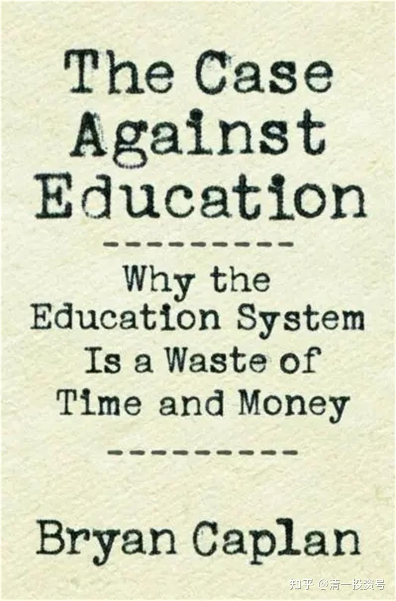
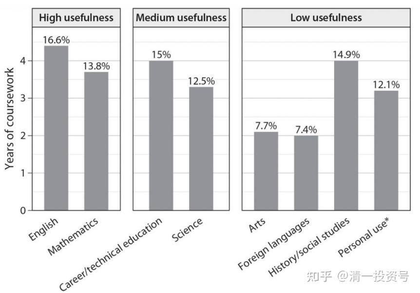
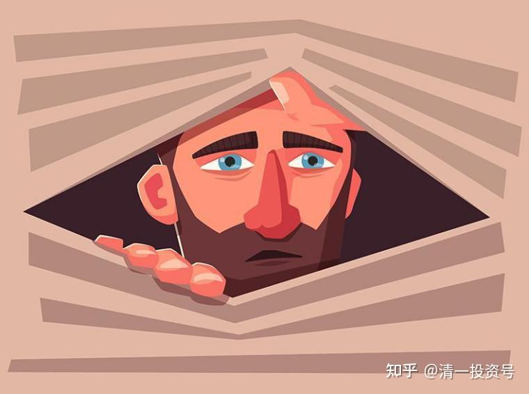
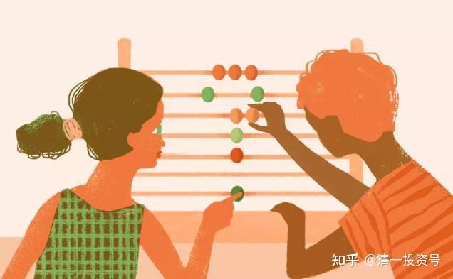
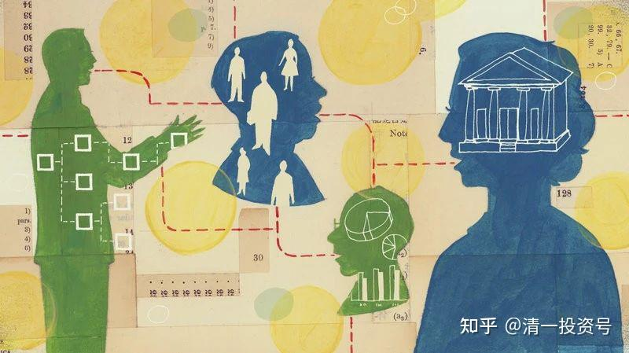
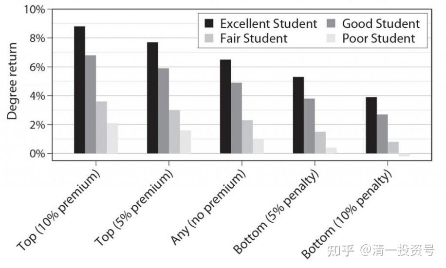
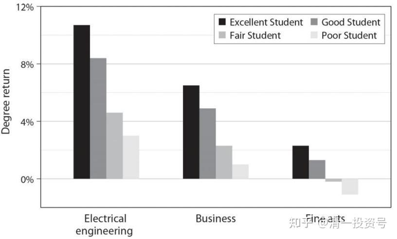
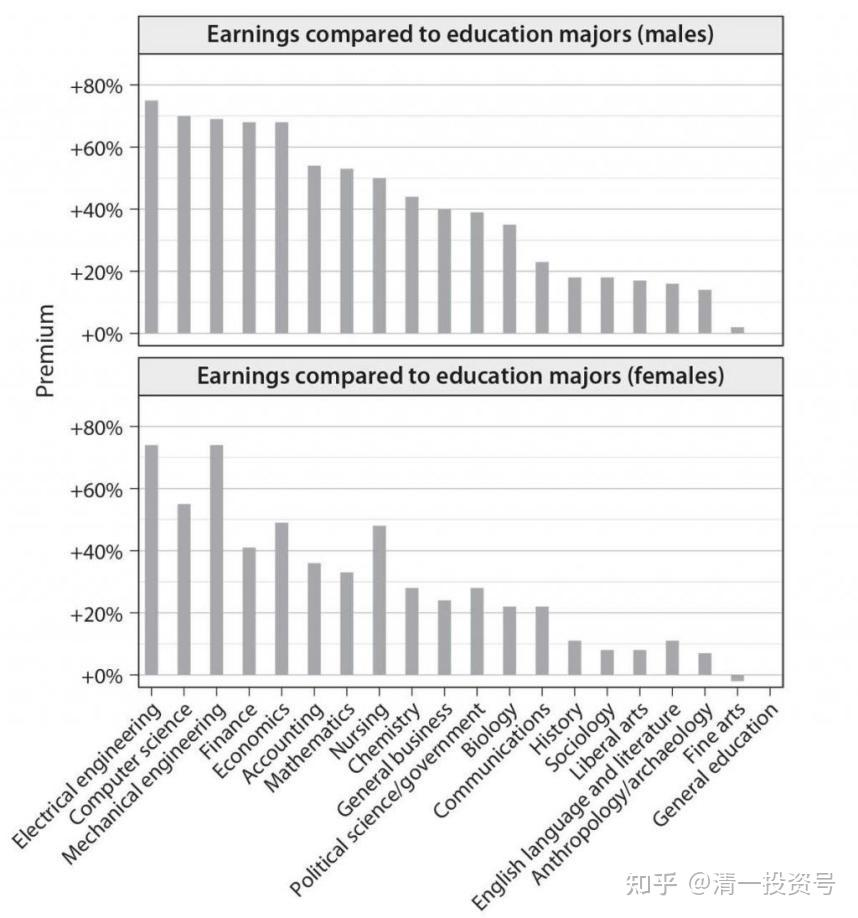

原雪球专栏**[189篇.转美国教育的⼋宗罪！中国学校会不会更甚之？](http://link.zhihu.com/?target=https%3A//xueqiu.com/9310099567/189674725)**

清一山长 2021年7月7日

题记：一周上课五小时，您愿意为这种教授买单吗？

看了美国知名教授对美国教育的研究报告你就知道：**今日学堂做到“三年学完美国十二年课程”的核心不是我们的学生和老师是天才，实在是因为对手太差**——美国教育（其他国家的教育其实是一样的）极其的低效、弱智，我们只是正常一点罢了。可叹中国很多家长居然把孩子送到美国读中小学，这就是典型的钱多人傻了。

**现代大学以及现代教育的核心目标就是提供职业教育，让学生能够毕业后适应职场工作**，但因为一些本质上的原因，现在的教育系统根本就无法完成这个任务。道理上，美国教授认为是“因为老师只能教自己会的东西而大多数老师从来没有真实的职场经历”没错，**一群根本就没有职场经验的人怎么可能教你职场攻略技巧？**

但质疑就是“令人费解的,不是为什么学校教无用的东西,而是为什么全世界都觉得理所当然呢？”

我也一样质疑：为啥**中国的大多数学校不仅仅没有提供真正的教育**，反而**提供了削弱孩子能力的伪教育**（让孩子的体能、学习态度、学习愿望、价值观统统变得更糟糕）为啥家长还乐此不疲地送孩子去“上学”？如果爱孩子，起码让孩子在家里学效果会更好！

我对于现在全世界的大学，除了一些正牌的理工科大学外，其他的大学我认为统统是无用的——**唯一的价值就是交朋友、混简历**，当然还要一张文凭——你的**未来职业特许证！**

也许您认为我的这种结论很偏激，不过似乎下面这个美国人的观点比我更偏激！他与我的主要差别是他花了很多时间用数据来证明这一点，我是用观察和推理来说明，所以别人的结论显得就不偏激了，非常的受人尊重。可是——难道您就会接受他的观点吗？这意味着您必须改变现在的教育选择方式，而这是挑战您智商和判断力的事情，我猜您更愿意放弃尝试。最好的方法——就是骂“说这些与您的愿望不符合的话是偏激，甚至是——骗子”。虽然您更想欺骗您自己！

**国际教育观察**

看点：乔治·梅森大学经济学教授布莱恩·卡普兰博士，在其颇有争议的著作‍‍‍‍‍‍‍‍‍‍‍‍‍‍‍‍‍‍‍《反对教育的理由》中指出，教育系统浪费了大量的时间和金钱。他用精算证明，美国教育投入大、产出低，未能提高学生的生产率或丰富他们的人生，而文凭通胀贬值，则增加了全社会成本。冷眼旁观美国教育的理想和现实，他总结出美国教育的“八宗罪”。

文章：Sylvia 编辑：Jennifer

**第一部分、“吃饭砸锅”的名教授**

乔治·梅森大学（George Mason University）的经济学教授布莱恩·卡普兰（Bryan Caplan）有个梦幻的工作。他从伯克利本科、普林斯顿博士毕业后一直在同一所大学教经济学，直到成为终身教授。

Bryan Caplan

这意味着他一周只需上5小时课，每年工作30周，其余的时间，“随心所欲地思考、阅读、写作——用大学的术语，那叫做‘研究’”。

2018年以来他“吃饭砸锅”，以著作、访谈和演讲，指出美国教育的浪费和低效，建议削减政府对教育的投入，而无论他自己的大学，还是整个教育界，对他都无比包容和尊敬。

**“The** **Case** **Against** **Education”（《反对教育的案例》一书，副标题：Why the Education System Is a Waste of Time and Money为什么教育系统是在浪费时间和金钱）**基于教授整整41年象牙塔生涯经验和四分之一世纪的阅读反思。按书中的内容，中文书名可译为：**你所知道的教育理念几乎都是错的——基于经济学的视角。**

《The Case Against Education——Why the Education System Is a Waste of Time and Money》

（反对教育的理由）

没有经济学、统计学训练的人，容易被政治家和教育家的理想主义、浪漫主义的口号所迷惑。

**“把最好的给孩子！”**

**“不让一个孩子掉队！”**

**“每个人都能够成功！”**

**“为未来投资！”**

经济学家不为所动，他问：怎样定义“最好”、“掉队”、“成功”？给予的机制怎样？效率如何？损耗如何？结果如何？机会成本？有哪些可衡量而不是凭直觉或道听途说（说个真事，朋友的孩子之类）的定性定量、可重复验证的指标？

让我们借这双经济学家的慧眼，冷眼旁观美国教育的理想和现实，推算普通人的最佳策略。

需要强调，Bryan Caplan（布莱恩·卡普兰）教授纯粹从经济角度提出这些观点，不考虑个人、家庭的审美、价值观、生活方式和情感取向，不否定个别出类拔萃、不走寻常路的孩子的志向和梦想，不看低“明知山有虎偏向虎山行”的勇敢选择。

教育投入对国家、社会和人类的好处，不妨作个背景参考。

书中每个论点都有多个研究报告支撑，篇幅所限，本文概述结论，省略大多数论据，举少数例子分享交流。

**第二部分、美国教育的“八宗罪”**

Caplan（卡普兰）认为美国教育投入大、产出低，未能提高学生的生产率或丰富他们的人生，文凭通胀贬值增加全社会成本。

教育既无用又无升华，只能定义为浪费。具体总结为“八宗罪”。

**一、象牙塔与真实的世界和职场脱节**

从幼儿园到大学，大多数科目对大多数人毫无用处。“工作中用到古罗马历史、莎士比亚或哲学的话，你的工作怪怪的。”Caplan（卡普兰）调侃到。

以高中为例，教授把各门学科按照有用程度，分为高、中、低三个范畴，用柱高表示学生花在这些科目上的时间。

高中毕业生在学科上花的时间

可以看出，**40%的时间花在对大多数人无用的科目上。**

科学听起来很有用，但高中科学课程只对大学理工专业的学生有用——占高中毕业生不到5%。

英文和数学最有用，然而高中的教法偏学术而非实用。英文基本用于阅读文学和诗歌，而非商业和技术写作。几何、代数2、高数、微积分只对大学少数专业的学生有用。

大学本科如何呢？Caplan（卡普兰）用最“仁慈”的标准界定有用和中等有用的学科。比如农业和健康专业都跟工程类算在一起；尽管商科、教育、公共管理类本科生需要跟非专业生一起竞争工作职位，从事这些工作也不需要专业文凭，也算在中等有用的类别。

按照这样宽的尺度，只有24%的专业有用，而40%的专业非常无用。绝大多数人文学科毕业生，难以找到跟本专业对口的工作。

Caplan（卡普兰）以内部人解释说，这是因为**老师只能教自己会的东西**。**而大多数老师从来没有真实的职场经历。**

令人费解的，不是为什么学校教无用的东西，而是**为什么全世界都觉得理所当然呢？**

**二、基本读写和计算——不可完成的任务**

也许学生无论学什么，都能提高基本读写和计算能力——所有社会人需要的。那么，美国在这个使命上得分如何呢？

2003年，教育部随机抽取18000人进行成人读写能力测试（National Assessment of Adult Literacy——NAAL）。题目非常简单，标准非常低，结果令人咂舌。只有13%的被测试者在三项指标上达到熟练。

细看题目令人啼笑皆非，每加仑油节省0.05美元，140加仑节约多少？一半人不会选7美元。35%的人不能正确填写包裹寄送回执表格上的地址姓名（拼写错误不扣分）。

将数据按学历重新运行一次结果，更令人沮丧。

**完成了9年基础教育的高中肄业生，一半缺乏管用的读写和计算能力；大学毕业生中，不到三分之一熟练——这本来是对大学入学者最起码的要求。**

**三、中学几乎所有科目都白学**

美国建国中心（American Revolution Center）测试1001个美国人的建国知识，83%不合格。高校校际研究机构（Intercollegiate Studies Institute）考核2500个美国人对政府和本国历史的知识，71%不及格。

新闻周刊让1000个美国人做公民考试，38%考不过。只有14%的人知道抗生素不能杀死病毒。一半人不确定地球绕太阳转。

外语？只有0.7%的学生说自己把一门外语学得“非常好”，另外1.7%说学得“好”——这还是学生自己说的。

Caplan（卡普兰）指出，学校“教授”学科这个说法本身就是夸张，确切地说，学校教了关于这个学科的那么点内容。经过漫长的13年中小学，美国人总算知道世界上有历史、科学、外语、社会科学这些事。

工作生活中用不到的东西，很快就会忘记。5年后你学的数学会忘记一半，25年之后全部忘光，除非用到。

据最有权威性的“**高中学生参与度调查**”（The High School Survey of Student Engagement）2010年的数据，66%的高中生说学校的每一天都很乏味，17%的学生说每节课都很乏味，只有2%的学生说学校不闷。

为什么学校如此没劲？82%的学生说教材无趣，41%说教材不相干。

**四、不存在的举一反三**

教育者说，就算学校没有教有用的技能，学生记不住所学的知识，他们毕竟学会如何学习和思考。比如，历史教会批判性思维、科学训练逻辑。

世人有所不知的是，教育心理学家已经花了一个世纪的时间，研究学习的转移效应和教育对智识潜在的好处。结论令人失望：**教育是狭窄的，在理想状态下——好老师、好教材、好学生，学生也只学到你明确教给他的内容**。

用教育心理学家Perkins（帕金斯）和Salomon（所罗门）的话说，“不仅仅由于遗忘，人们一般做不到将课堂学到的东西有效地运用在课堂外或是其它领域。学科之间，教室到外界之间如果有一座桥梁，那它是遥不可及的。”

**举一反三是个幻影。**无数研究表明，需要跨越的障碍太多。首先学生要透过现象看本质，然后要在多年之后还记得当初的深层原则，还要有人从旁提醒——最好是他当年的老师。

研究还发现，**教育未能持续地提高课堂之外的批判性思维。**

举个例子。调查对象是高中、大学、研究生一年级和毕业班的学生，口头回答辩论题，如常见的“电视暴力是否导致更多的现实暴力？”

研究发现，新生和毕业班的学生辩论能力并没有明显差距，同一个学生经过几年的学习辩论能力没有明显提高。如果学生表现出很强的思辨能力，是因为他在起跑时已经领先。

另一项研究表明，哪怕经过数年数学和科学的学习，大学生对于日常现象的推理能力提升仍然十分有限。

**五、人文教育的好处是一厢情愿**

也许教育的意义在于丰富人们的心灵，塑造美丽深邃的灵魂？

就像复旦大学的师生，以“自由而无用”为荣。世界一流大学弱化职业技能，强调教育“底蕴”。

经济学家说，听起来不错，但我们必须追问：学术是否成功地、在多大程度上拓展了学生的眼界？在学生人群中能够观察到的好处比例又是多少？凤毛麟角的伟大老师，把熊孩子引导为莎士比亚爱好者和前卫艺术家，遗憾的是，现实生活中这样的故事少之又少，以至于每一个都能成为传奇（就像难忘的电影《死亡诗社）。

有人说孩子要被强迫灌输人文，最终他们会懂得欣赏高雅文艺。今天的孩子个个都经历了10年以上的灌输，结果如何呢？

美国家庭每年购买书籍仅100美元，占家庭年收的0.2%，多年只降不升，大部分用在畅销书上。古典音乐只占音乐类消费的1.4%，经典文艺始终是极其小众的市场。

大多数年轻人对高雅文艺无感，成年后改变的也极其稀有。

互联网使人文教育真实状况尽显无疑。最优质的内容已经悉数免费上线，却少有人问津。人们拒绝高雅文艺的原因，并非经济因素或者不方便，唯一的原因就是没兴趣。

合理的猜测，那些对高雅文艺感兴趣的人，其中有相当一部分，不管教育经历如何，总会喜欢上高雅文艺。而**对大部分人而言，多年的灌输丝毫不能动摇他们的审美偏好。**

近年来，美国大学左倾，政治正确到了夸张的地步，许多家长担心孩子被大学洗脑成为左派。Caplan（卡普兰）教授翻阅研究资料，发现“政治正确”是个纸老虎。

原因很简单，学生只是在象牙塔内左倾，一旦步入社会，有了跟教授学者老师不一样的职业和身份认同，便把大学高中学的历史和政治哲学抛到云霄，**主导他们政见和价值观的始终是社会经济地位。**

如果学习既无用处又不能使人高雅，那经济学家只好将它定义为“浪费”。

相反，技能教育不苛求好内容、好老师、好学生。只要学生掌握了可用技能，教育就有了某种价值。

**六、精英教育的本色**

**有人说，美国的教育结果不佳是被劳苦大众拖了后腿，精英学校和教育还是硕果累累的。**那我们就跟着Caplan（卡普兰）看看实际情况。

**不管走进哪个教室，大部分的年轻面孔上写着“乏味”；**

**大学缺勤率为25-40%，学生们拼命躲开有挑战的课程；**

**Rate My Professors（评价我的教授）网站上，大学生们按照“最容易过关”评价他们的教授，没有“有用的课程”这一项。**

英国2009年的一份研究报告说，59%的大学生觉得一半以上的课程乏味。

哈佛大学知名教授Steve Pinker（斯蒂芬·平克）曾伤心地透露，尽管他本人如此大牌，连续多年被评为“最受欢迎教授”，尽管他讲的内容要考试，而且没有视频，每学期几周时间过后，他的教室就空了一半。

**“哈佛学生翘课人尽皆知，每次翘课相当于烧掉父母50美元现钞。”**英国教授Greg Clark（格雷格·克拉克）充满期待地赴斯坦福大学，满心希望遇到更优秀的大学生，他们的申请文书展现出不可思议的广泛兴趣和充沛的热情：历史、辩论、象棋、运动、文艺、无数自愿者活动。

当他以副教授身份带一年级新生时，沮丧地发现文书中的光彩只是为了照亮升学的道路，目的一旦达到，这些兴趣和热情被毫不留情地抛弃。

**七、文凭的回报是真实的，只是因人而异**

**尽管文凭有如此多的水分，收入溢价是真实存在的。**

普遍被引用的数据是，高中文凭的收入溢价为30%，大学文凭的收入溢价为70%；每多熬一年，收入增加5-10%。

因此，除非学生实在读不进书，高中毕不了业，或者根本不打算有个常规全职工作，否则必须念到高中毕业。

是否上大学则另当别论。因为收入回报是一个平均值，按照不同专业和学生分位细分，不同组别差距巨大，成绩不佳的艺术专业学生的回报甚至为负。

另外，60%的大学生未能在4年内毕业，一半研究生以上拿不到毕业文凭，严重拉低回报。

以下图表尤其令人印象深刻的是，优秀的学生哪怕在普通大学，回报也跟一流学校的好学生有得一拼，而成绩不佳的学生哪怕在排名非常靠前的学校，回报远不如普通大学高材生。

不同档次大学的文凭回报

**八、文凭信号效应占比高，而信号是一场消耗战**

Caplan（卡普兰）透露，普林斯顿大学没有门禁，任何人都可以搬去大学附近，不受阻拦地听课。你甚至可以跟在校生打成一片，参加他们的小组讨论。

如果你跟教授聊，说你不是学生，但是特别想上他们的课，教授们估计会热泪盈眶，原来真有人想跟我做学问啊！Caplan（卡普兰）自己也公开宣布，任何地球人都可以免费听他在George Mason（乔治·梅森）大学的课。

稍微研究一下，除了互联网，免费的线下优质教育不难获得。

为什么极少人这么做？因为你需要文凭才能找到工作，**文凭的一小部分是人力资本，大部分是信号效应。**

信号是三个层面的组合：智力、态度和努力，对现有社会秩序的遵从，后两者对雇主来说更为重要。换句话说，文凭认证符合社会利益的素质。

Caplan（卡普兰）估算，50-80%的文凭价值为信号效应——“羊皮效应”。通俗地说，你需要原厂贴牌。文凭通胀在20-50%之间，资历过高率20-35%——所谓内卷。多熬的岁月，**多获得的文凭没有创造财富，不增加个人福祉，纯粹浪费**。而在文凭通胀大背景下，大家不得不为之多奋斗数年。

如今，大量出租车司机、餐饮酒店服务生、厨师、酒保、保安、收银员、前台、快递、清洁工等等拥有大学文凭。

如果不是政府大幅补贴高等教育，很多人上不起大学，但是也不需要文凭就能从事如今的职业，可节约社会成本和家庭支出。

**第三部分、“好学生”的秘籍**

说清楚了美国教育的伟大理想和千苍百孔的现实之后，Caplan（卡普兰）教授提醒大家，尽管教育界乃至全社会都认识到问题，改革却举步维艰，共识难以达成。

好学生要面对现实，少走弯路，求得最大回报。因此他给出如下秘籍。他将“好学生”定义为认知能力和学习态度处于中等偏上的孩子——认知能力73%分位，能够充分享受高中和大学文凭溢价。

低收入家庭高材生拿到私立学校奖学金是最完美的回报。而除非你是非常出色学生，私立学校经济回报十分不值。图表非常清楚，中等水平的学生在顶尖学校的回报也低于4%，扣除通货膨胀因素，乏善可陈。

研究生以上毕业率只有一半，经济回报为2.6%。除非有超强的学术能力——5-10%分位，不应该继续深造。（这也侧面解释了为什么生物、化学、环境、材料这四门实打实的STEM专业在国内被戏称为“四大天坑”。原因是，这些专业本科只学到皮毛，要想在本专业立足必须读研究生博士，而有能力热情完成的人比例极低。）

按专业和学生分位的学历回报

不同专业的经济回报，男生女生分列

因此，Caplan（卡普兰）认为，“好学生”应该念大学，但是有三个前提：

第一、专业重要性超过学校名气。选一个真正的专业，STEM（理工科），经济学、商科，甚至政治学。

第二，本州公立大学价廉物美。尤其是加州伯克利、弗吉里亚州立和密歇根州立，学费白菜价，毕业生在雇主眼中跟顶尖私立大学相当。

第三，毕业后一定要全职工作，否则前功尽弃。

至于73%分位以下的学生和家庭，教育最大的意义是给人希望。

希望不灭，神话永续。在神话笼罩下理性选择，谈何容易。

**附录：前文被删后，清一山长再次发文**

我转发的美国教授写美国教育问题的帖子，很快冲到了2万阅读量，结果就被人删除了。这舆论控制够严的。这文章，犯了谁的忌讳？三观哪里不正了？

我发现了美国人也在反省自己的教育问题，是质次价高。也说了为啥我们的学生，三年能学完别人12年的内容，原因不是我们的学生和教师是天才，而是我们的对手是蠢蛋，根本违背了教育原则。但是，我没有详实的数据来证明这一点，这美国教授，用具体的数据来证实了美国学校教育系统的弱智和低效（我认为我们的学校系统也一样低效率）

看看美国人的教育水平把“2003年，教育部随机抽取18000人进行成人读写能力测试（National Assessmentof Adult Literacy——NAAL）。题目非常简单，标准非常低，结果令人咂舌。只有13%的被测试者在三项指标上达到熟练。

细看题目令人啼笑皆非，每加仑油节省0.05美元，140加仑节约多少？一半人不会选7美元。35%的人不能正确填写包裹寄送回执表格上的地址姓名（拼写错误不扣分）。”

看看，就这水平。可中国有钱的家长，却拼命把孩子送去美国读中小学，是不是钱太多，人太傻？

作者是“吃饭砸锅”的人，他自己是美国的大学终身教授，每周只需要上课5小时。其他时间想干啥就干啥，美其名曰“研究学术”，还有两个长长的假期。这种教育模式，其实是养了很多懒人和闲人的。尽管一些教授，可能真的用心在研究学术，提供知识积累。但更多人真的是在鬼混日子。居然真有美国的教师就算来上课，也就是喝茶、看报，不上课的。连五个小时都不敬业的。

其实我在武汉大学教书的时候，也是差不多的节奏：每周上课只有4-8个课时，剩下时间都是自由支配时间，我拿来办了一家成功的商业公司，成为了当时的“武汉大学首富”。

虽然我认为我没有对不起武汉大学。因为我的课，是学生们最喜欢的课程，每小时给我一万也不亏的。实际上当时一个月，只给了我两三千多元，但相对民工的工资而言，我已经很舒服了，一天的工作量（8小时），比他们一个月还多了（现在的武汉大学，肯定比这种标准高，我辞职了，所以不知道了）。但我的同事们，上课拿个教科书去念书的人，你总不能说：他们的一小时“教书”，也有这种价值吧？我觉得就是拿教师职位混饭吃的文化混混罢了。

可是，这些钱，是要拿学生的投资买单的。就算是国家拨款，也是根据学生的人数来给钱的。养这种人，对学生有价值吗？

算了，不多说了，你们自己做结论去。给个链接算了，不然又要删除我的帖子了。现在连美国人说美国不好的帖子，都不能发了！说美国好是否就能发了？

[微信网页链接](http://link.zhihu.com/?target=https%3A//mp.weixin.qq.com/s/F1mDVUMrO1LG-YDBu1Q5Dg)：

[https://mp.weixin.qq.com/s/F1mDVUMrO1LG-YDBu1Q5Dg](http://link.zhihu.com/?target=https%3A//mp.weixin.qq.com/s/F1mDVUMrO1LG-YDBu1Q5Dg)

**[美国经济学名教授：文凭通胀导致的教育低回报，比你想象的更严重](http://link.zhihu.com/?target=https%3A//mp.weixin.qq.com/s/F1mDVUMrO1LG-YDBu1Q5Dg)**