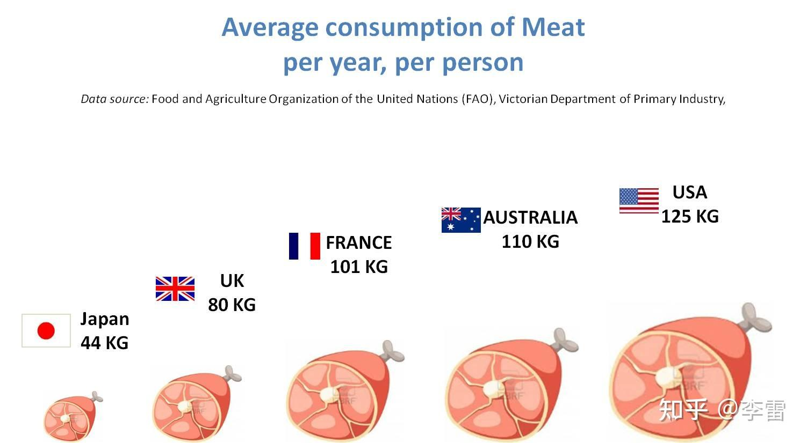
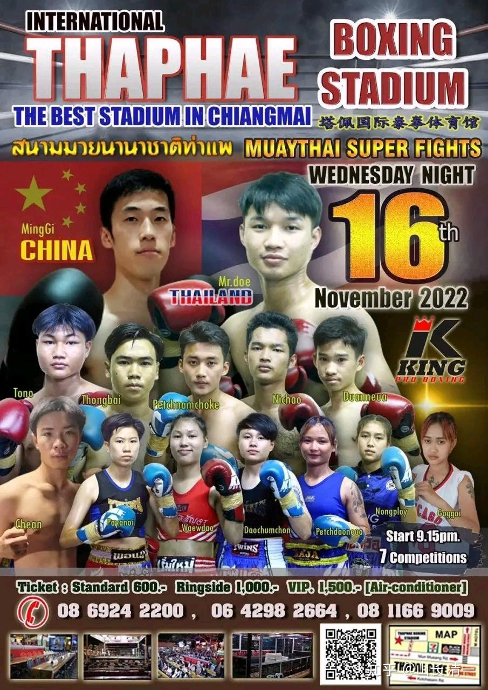
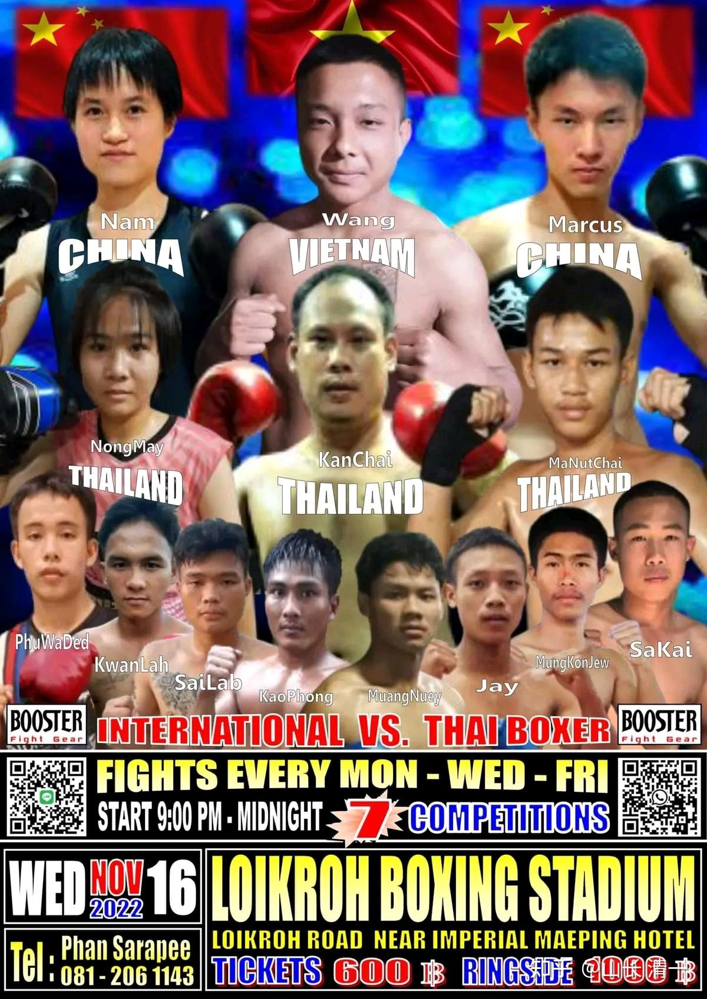

中国人最关心的事情，花费最多时间的事情，应该就是吃和做吃的。如果一个人的一生的大多数精力时间，都用来弄吃的。您认为:这种生活方式，与成天找食吃的动物有啥本质区别？所谓的“人生难得”，就是为了耗费在为自己弄吃的，为子孙后代弄吃的，你认为划算吗？是不是一种对人生巨大的不尊重？

第二：更不可思议的是：我们的身体，真的需要“美食”吗？还是我们的嘴巴和大脑需要美食？而所谓的“美食”，一定与肉食联系在一起。每天操弄“美食”的过程，就是在处理各种动物尸体。这种所谓的“人生”，每天都在与各种动物的尸块打交道，还把它们弄来吃掉，这种人类，是不是可以称呼他们为食尸族？厨师们是不是可以叫做“理尸者”？

美国人肉食消费量惊人， 居然每年要吃掉250市斤红肉。还不算鱼虾蛋奶！平均算起来，每天至少都要吃一斤以上的各种动物制品。说这个国家是“食尸国”，基本上是个事实吧？不幸的是美国人的确很霸权，武力值超高。吃素的中国人，是不是能打赢吃肉的美国人呢？看我们的努力吧！

*全球主要国家肉食消费量*

科学背后的愚昧，只能用事实来打脸。肉食的品质和数量，与生活的幸福和身体的健康成反比，而不是正比。追求肉食，就是追求疾病和各种辛苦和平庸的人生。

日本是全世界人家寿命最高的国家，我相信与日本人的节食习惯有关。去过日本的人，都对日本供餐的“袖珍”级别感到意外吧？这种饮食习惯，带来了更健康的日本。而美国，是全世界医疗水平最高的国家，同时也是全世界心血管病和癌症最高的国家。我认为:这和美国人不良生活习惯，高肉食的饮食方式，有很大的关系。

2020年，一份不完全统计的各国人均肉食量数据：

- 美国：118公斤，牛肉为主。

- 澳大利亚：121公斤。牛肉、羊肉为主。

- 以色列：102公斤。羊肉为主。

- 意大利：87公斤。牛肉、羊肉为主。

- 英国：83公斤。牛肉、羊肉为主。

- 德国：88公斤。牛肉、猪肉为主。

- 韩国：62公斤。牛肉、猪肉为主。

- 日本：49公斤。牛肉为主。（*鱼肉不计入*）

- 中国：59公斤。猪肉为主。

- 泰国：28公斤。鸡肉为主。

- 印度：4公斤。鸡肉为主。

清一武士们，正在用素食和太极格斗来改变世界。我们要用一批批的武士的奋战来证明：肉食者鄙！最强壮，最健康的身体，来自于良好的生活方式以及健康的饮食习惯。吃不是为了享受口腹之欲，这个层次实在太低了。吃就是为了活着。而选择吃素，就是为了让我们活的更好。更强壮，更灵敏！

如果美国吃肉这么多，美国人，就是我们清一武士们必打的对象：我们将用事实来证明----吃肉的打不赢吃素的。不过，我们先干翻泰拳再说。未来美国最有霸权的UFC，拳击等领域，也会被清一武士们一一拿下的。我们慢慢来。

今晚有三场清一新武士的首秀，其中两位是大家盼望已经很久的男子比赛。很多粉丝都在担心---木兰们表现非常良好，为中华武术争光了。但会不会像是中国足球一样？我国的女子可夺冠? 但男子却连一个小国都打不赢？体育上阴盛阳衰的局面，会不会在太极格斗上继续体现？结果今晚就会出来，而各位明天就能看到实战视频了。

我相信孩子们会轻松拿下比赛的。但我要求他们不以KO对手为目的，以打好比赛为目的，尽量打满五回合。多有一些实战训练的时间。不积极求战，只是应战。打反应。打防守为主。泰方裁决谁胜我们不关心，我们只关心拳手是否能适应泰拳手的进攻。现在是不思进取，磨炼技术的比赛，不是打排名的比赛。还是让两位通泰语的木兰去打排名吧。

*明骐的首秀比赛海报*

* 郭琪和谭琛怡的首秀海报*

一下转文字，中国专家的水平，就是瞎忽悠人的，我相信这个专家跟我比体能会输惨的。他吃出啥健康来了，无非是为食品利益集团摇旗呐喊罢了，跟真正的科学没有半点关系。

是：中国人每天的参考食谱是：六两粮食四两肉，六两蔬菜一两油，一两鸡蛋二两鱼，半斤水果一斤奶。根据家庭结构特点，不同家庭的食谱可以有所调整。

中国科学院中国现代化研究中心主任、中国现代化战略研究课题组组长何传启研究员13日在北京发布《中国现代化报告2012》时推荐了上述中国人的营养食谱。

中国人非常愿意为吃付出生命：每年中国人中，因饮食问题导致患癌死亡的比例全世界最高。这是国际研究者在著名医学杂志《柳叶刀》上发表的研究结果。研究者们估计，每5个死亡案例中就有一个是因为饮食不健康引起的。而每年因为不健康的饮食而死亡的人有1100万人。食尸族自己也更快成为尸体！

北京通州区一母亲给儿子送饺子途中被撞身亡

[北京通州区一母亲给儿子送饺子途中被撞身亡，「外卖员」被公诉，如何看待外卖员超速？还有哪些信息值得关注？](https://www.zhihu.com/question/566791295)

中国人对吃的关注，胜于对生命的关注。我们也许就是【拜吃教】的教徒，极其愚昧（每年还喝酒喝死几十万人）

醒醒吧，中国人别在吃上花钱买疾病，买痛苦，买死亡了！