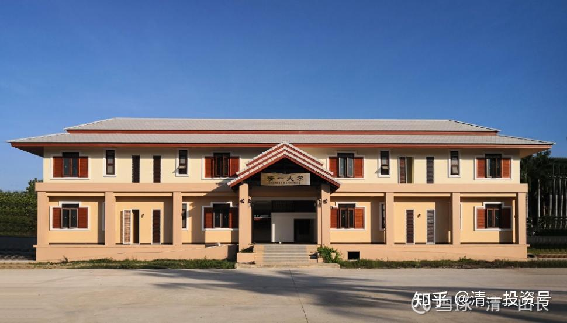

原雪球专栏[195篇.心比天高，命比纸薄的“当代大小姐病”](http://link.zhihu.com/?target=https%3A//xueqiu.com/9310099567/190785561)

清一山长 2021年7月17日

公主夏令营已经体验过半了，可是一些高贵的大小姐，居然到现在都依然没有进入状态。

一方面，心比天高。觉得这个世界都欠她们的一样，一个朋友都没有，却谁都看不上。总觉得自己才是最牛的，却拿不出任何让人佩服的本事。世界上，似乎也没有任何能够让她们喜悦和兴奋的东西。平时看她们的样子，一副挑剔的眼神：看什么都不顺眼，做什么都不带劲，听什么课都听不进去，也听不懂。但问她们有啥理想和追求？一个个倒是很雄心壮志的，动不动就说自己将来要赚几个亿，几十个亿，几百个亿。导致带她们的小公主都很纳闷，问她们要这么多钱来干嘛？她们也不知道拿钱干嘛，只知道钱越多越好。说：“只要有钱了，就想要什么，就有什么！”再问怎样才能赚到这些钱？这个，干脆就没回答了。她们也不知道咋赚钱，怎样花钱更不知道。反正——就是要钱多多的。

一方面，这些大小姐们又命比纸薄，思维差，身体差，活力差，病恹恹的。在夏令营就没有朋友，没人喜欢她们。因为不肯好好学习，不肯融入集体，还会干扰他人，就被原来的班集体投票给踢出去了。相同命运的，都有“公主病症候群”的伙伴们处在一起，也互相看不起。没谁更喜欢谁，内讧严重！而且——都不想上课，不想学习，不想运动。有人成天捧个iPad看视频（估计抖音啥的），或者看言情小说。但老师认真给她们讲爱情课，讲《傲慢与偏见》，讲《律政俏佳人》，她们也根本就不好好听。

昨天公主夏令营布置了新课程，完成作业：“一，别人应该喜欢我的十大理由。”以及“二，我最喜欢的人是谁？她身上有哪十种品质让我特别喜欢？”一些小公主们，写了半天，也写不出几条值得别人来喜欢的理由。本来应该好好的反省：自己为啥不招人喜欢，怎样改进。可别人小女生自有主张：我不喜欢团队合作，我就喜欢单干怎么的？别人喜欢不喜欢，我才不在乎！

最关键的是：一些女生特别讨厌运动，一副娇滴滴的、懒洋洋的样子。

前段时间做了一道题目：**世界上有四种人**，自己是哪一种？

**第一种是上等人。领导者、决策者。这种人，特别有影响力，能出主意，拿决策，能担当风险，会领导和激励其他人一起做事，一起创造世界。**

**第二种是中等人。虽然没啥决策力，但管理能力不错。除了能够管好自己，还能管好身边的人，管理好身边的团队。**

**第三种人就是下等人。没有思考力，也没有领导力。不懂如何管理别人，但能够管好自己，能够独立生活。他们也愿意接受和服从中等人、上等人的管理，加入团队一起工作，养活自己和家人。**

**第四种人是废材。**没有人需要他们，世界少了他们一点都没问题，多了他们也只是多了一堆麻烦，除了父母，谁也对他们没兴趣。而他们离开了父母，就无法在这个世界上正常地生活下去。

我建议家长们好好想想：你的孩子是哪一个等级的人？如果是废材，万一你现在就意外死了她咋办？你做好了后事安排了没有？“**成功学法则：今天是我生命的最后一天。每天都这样想，这样过，你才知道活出自己的精彩来。**”

孩子们上完这一课，虽然不愿意承认，但大多数准确地发现了：自己现在还是废材级别，啥都不会做，离开了父母就无法生存。一些孩子，开始有了一点急迫感，问带班的小公主，她们是什么级别？小公主们说，现在大概应该是下层，可以独立生活，只是没法支付学费。**如果15岁考上了免费的三语高中或者清一大学，就完全独立了，不再需要父母供养了。如果将来能够独立带班，就是中层了。**将来来泰国打天下，打入上流社会，就可以成为上层了。所以她们现在开始学着带班，就是希望自己早日独立，不要成为废材。

不过，一些孩子明明知道自己是废材级别，却一点都不着急。似乎跟她就没关系一样。上课归上课，生活归生活，跟自己似乎就没关系，依然天天混日子！我不知道这些孩子的家长急不急！小公主助教们倒是有点急——怎么还有这种油盐不进的人？

我让夏令营的带班小助教们，不要去强迫她们，毕竟是夏令营。只是一种体验，不是一种训练。不愿意配合班级的，不想上课的，不好好上课的，就集中一起，可以自由活动——想学什么让老师教，想玩就让老师带。反正再过十几天就回家了，让她们过一个自己选择的夏令营吧！尊重这些大小姐们的选择。

现在我很想问这些大小姐的家长们：

这些被你们呵护出来的“千金小姐”，马上就成年了，你们指望她长大了做什么？

一、你想找个好的工作吗？什么单位会要这种人？谁的庙里缺个活菩萨，想要请回去，恭恭敬敬的供起来？

二、你想做有钱人的全职太太吗？就这慈禧太后的脾气和毛病、德行，哪个男生看得上？谁敢娶她们？谁愿意娶她们？

三、你想自主创业吗？三百六十行，行行出状元。但一个人很懒，没思维，没脑子，不学习，情绪大的大小姐，能指望她创业成功的话，母猪都能飞上天了。

我看，唯一靠谱的出路，就是父母继续养着算了。马上就到青春期了，求偶欲望将让这孩子更加的疯狂和无法理解，也让她根本学不进任何东西去。在网上刷抖音，关在小屋里做春梦，然后学业失败，人生失败，一家人双方互相冷漠，互相仇恨地继续生活在一起。艰难熬过未来的几十年，就是这种“大小姐”病患者的大概率出路了。

我挺奇怪的：家长送来上新教育，却什么都不学，什么都不懂，只知道像是养猪一样养孩子。孩子已经教成这样子了，你以为上了公主夏令营，就自动成我们的小公主一样的人吗？**我们的小公主，全都是泪水泡出来的，汗水浇灌出来的。**您孩子啥都不愿意动，不愿意学，难道我们拿个鞭子去抽她吗？只能让她随意了。

您家长要问了：这种超级没能量的孩子，就是脑子也不动，身子也不爱动的孩子，还有没有救？要是我的孩子咋办？

很简单呀！你天天养她，养得好好的，她养舒服了，自然啥都不想动了。这是人的天性。只有饥饿了，才会去找吃的。天天衣来伸手饭来张口的，这人生还有啥动力。

该怎么办？其实别问我，看别的家长是咋做的。案例是当年偷懒的孩子，今天逆袭成功，考上清一大学免费入读。别的家长咋做，你也咋做就行了。

微信[网页链接](http://link.zhihu.com/?target=https%3A//mp.weixin.qq.com/s/Uzjna_y4vLAl9TRMExV5Zg)：[https://mp.weixin.qq.com/s/Uzjna_y4vLAl9TRMExV5Zg](http://link.zhihu.com/?target=https%3A//mp.weixin.qq.com/s/Uzjna_y4vLAl9TRMExV5Zg)

这件事情，只有家长能做，别人无法代理的。如果您做不到咋办？

就去看看：[37岁博士回家养老](http://link.zhihu.com/?target=https%3A//mp.weixin.qq.com/s/5v6k3QOovPJo5jAVbs6_LQ)，[会是你家孩子的未来吗？](https://zhuanlan.zhihu.com/p/580530679)

雪球[网页链接](http://link.zhihu.com/?target=https%3A//xueqiu.com/9310099567/188704512)：[https://xueqiu.com/9310099567/188704512](http://link.zhihu.com/?target=https%3A//xueqiu.com/9310099567/188704512)

[https://zhuanlan.zhihu.com/p/580530679](https://zhuanlan.zhihu.com/p/580530679)

放心，我的意思，不是说您的孩子这样子肯定能考上博士。而是说，他现在就等于博士毕业了。你就好好养吧！这种“大小姐”，我没看出有考上什么大学博士的潜力。其实，这个37岁的博士，如果12～13岁来今日学堂的话，今天是不可能这样子的。因为当年的他，依然是愿意好好学习的人，只是不善于跟人打交道罢了。这种人，我们是可以教的，教成正常人。

您的孩子，今天就已经放弃学习了——连我们安排的非常的生活化，非常的有趣味的课程，甚至连《律政俏佳人》来做教材，她都不好好上课，您指望她还去考体制大学的985、211吗？别做梦了！

不如家长们现在就好好送养老院吧！要不就学上文链接中的北京家长去。两条路，何去何从，由您自己决定！

**人懒了，无论学什么都学不进去了，只有让她动起来。所以——运动是清一新教育第一重要的课程。这个课程不过关，别的都白说！懒病严重的，除了运动啥都不用学了。彻底改了懒病再说。**

**评论回复：**

爱与感谢11回复清一山长：

今天回复了山长上一篇的评论，感慨学习新教育这几年，我家两个孩子发生了翻天覆地的变化。刚好昨天跟一个妈妈交流，儿子17岁，比我儿子大两岁，4年前妈妈一个人带着儿子来到澳洲留学，但最近很长一段时间沉迷打游戏，每天晚上打游戏不睡觉，早上起不来上学，学校的出勤率不达标，教育局要求退学，过几天就打包袱回家了。而另一边，我儿子在新教育学堂每天都非常自律、精进地学习、运动、做事，很充实，一点都不让我们操心。

今天回复了山长上一篇的评论做参考：

--------------------------------------------------------------------

十年前我们移民澳洲，就是为了给后代一个更好的教育、生活环境。那是不是到了国外我们的孩子就自然地好了呢？对于我们家来说，真的不是。

为什么我们要走新教育的路？就是因为我们虽然到了国外，但孩子仍然出现很大的问题。当时儿子从一年级开始到四年级都处于非常的自卑、焦虑、容易崩溃的状态，主要是我们作为家长的不懂怎么教育孩子。

刚好7月20日，儿子将在“清一联盟分享会”上，跟学堂的其他孩子一起做一场分享，他将详细分享这十多年来他在澳洲小学、中学的学习生活情况以及转入新教育后身心各方面的变化。有兴趣的朋友可以关注哔哩哔哩的主播“清一联盟读书会”，或加入“清一联盟读书会直播群”：272076246，这是新教育很主要的一个学习分享群，对新教育感兴趣而找不到门的朋友可以了解。这里有我儿子所在学堂的学习、运动、生活视频，想了解一下新教育孩子们的学习、生活、精神面貌等情况的，可进入浏览：合一塾SAT备考班“清一联盟读书会”分享公告

再来看我小女儿的情况，现在九岁多，悉尼最近封城，学校也只能上网课。平时她自己调好闹钟，每天一早就自动自觉地起床、叠被子、洗漱，准时出门慢跑5公里。这里现在是冬天，一大早还挺冷的。看着这个小不点，每天老老实实、吭哧吭哧地跑步、做事、自觉学习，我不由得发自内心地赞赏她，为她感到骄傲和自豪。

当然，她还有很多问题需要进步，但是对比自己已经有了很大的进步，再对比身边的孩子，已经算是非常让父母省心了。同龄的孩子，父母普遍都吐槽一旦网课就受不了，在家里跟孩子们的各种对抗，全家鸡飞狗走的。甚至大家都调侃说，疫情刚开始前，很多父母因为担心孩子感染，强烈要求学校在家上网课；但真的在家上学一段时间后父母都不吭声了，反而期待学校赶快开学，因为孩子继续在家，家长等不到被感染就被气死了。

先不论孩子的学习、将来的学历文凭怎么样，光是孩子比较自动自觉地做事就让我觉得这已经是无价的。

山长说了，新教育的方法和理念家长都是可以自己在家实践的，只要理解正确，都会有成效。可能连山长都不知道，有一个男孩子当年大概9岁多，在今日学堂试读了一个月，后来家庭移民到了新西兰去，但妈妈一直尽量地践行新教育理念。现在孩子已经17岁了，各方面都非常优秀，准备要考美国的藤校。我问这位妈妈怎么把孩子教育得那么优秀，她就说了，山长的理念只要你好好地学习、理解，**从小教会孩子承担、自我负责，那么，作为家长就会很轻松，孩子的教育就会非常地顺。**

我远在悉尼，也在尽量地践行新教育，但山长并没有从我们这些家长身上得到一分钱。甚至，山长还倒贴！今年9月份，我儿子将要入读清一少年班，是完全的免学费，并且包吃包住，都是由山长掏钱供养的。

山长以前在大学，放不下努力上进的学生，所以一直在校园外给学生们免费上课，不单是《人生十二讲》，还有2007、2008年每周讲解老子的《道德经》（目前，我和其他清粉家人花了将近三年还在校对山长的讲解，因为当时的讲解内容实在是太多，太丰富了。并且大家也可以对比发现，山长的理念在十几年前就已经很成熟、很稳定。感兴趣的朋友，欢迎加入“山长解读《道德经》新版发布群”：930638490）；而到现在，山长放不下我们这些因为孩子教育、家庭问题而焦头烂额的家长。所以，他经常在我们家长群、清粉群、雪球上耐心地给我们各种指引，让我们得以在世界各地都能免费地、及时地学习、跟进。

有时候看到山长为了更准确地表达信息，三番几次地撤回、修改发言，就是琢磨着怎样让我们更好地理解。我写这么一篇长点的文章都要花很多时间，更何况山长这么频繁地发布大量的文章？可想而知，山长每天花费多少的时间、精力在做这些事情。山长不是神，他并不是轻易地就能把所有的事情做好的。相反，我看到的是山长很谨慎，很努力，也很踏实，十几、二十年如一日地为他的目标深耕细作，从不动摇。

而他的目标就是为了给后代创造一个更好的世界。我相信这也是我们大多数家长的心愿。感恩山长无私的奉献，我们且行且珍惜！

清一山长2021-7-18 23:50 回复爱与感谢11：

**“从小教会孩子承担、自我负责，那么，作为家长就会很轻松，孩子的教育就会非常地顺。”**

**对呀！新教育的核心就是这一点：简单地说就是【责任和荣誉】五个字。做到了很简单，没做到，拼死也没用。**

参考链接：

[【清一大学少年班】走进我们的日常生活](http://link.zhihu.com/?target=https%3A//www.bilibili.com/video/BV1Hr4y1K769)

[这就是今日学堂](http://link.zhihu.com/?target=https%3A//space.bilibili.com/487498588/channel/detail%3Fcid%3D149241)

[今日明师荟](http://link.zhihu.com/?target=https%3A//space.bilibili.com/487498588/channel/collectiondetail%3Fsid%3D55359)

[清一大学武医学院](https://www.zhihu.com/people/mkaga)

[清一投资号：5篇.即将到来的“社会分层”如何面对和解决？](https://zhuanlan.zhihu.com/p/535106255)

[清一投资号：36篇.15岁上名牌大学 VS 99%的大学都不值得上！](https://zhuanlan.zhihu.com/p/545439129)

[清一投资号：39篇.值得所有家长看的纪录片：反省吧，家长们！](https://zhuanlan.zhihu.com/p/545526875)

[清一投资号：68篇.我以为考上了985，就不愁找工作！](https://zhuanlan.zhihu.com/p/555244021)

[清一投资号：99篇.你家孩子，是第几等人？要用几等的教育适配？](https://zhuanlan.zhihu.com/p/569930721)

[清一投资号：106篇.借用外脑，是最低成本的改错方式！](https://zhuanlan.zhihu.com/p/571033703)

[清一投资号：111篇.做事一定要有规划：嫁女也一样！](https://zhuanlan.zhihu.com/p/573549252)

[清一投资号：130篇.凯利的生日礼物：你给别人的越多，你得到的也就越多](https://zhuanlan.zhihu.com/p/580335132)

[清一投资号：133篇.你在同龄人中的竞争力，将自动与社会层级和收入匹配！](https://zhuanlan.zhihu.com/p/580521227)

[清一投资号：134篇.37岁博士回家养老，会是你家孩子的未来吗？](https://zhuanlan.zhihu.com/p/580530679)

[清一投资号：135篇.同样年龄：人跟人差距怎么会这么大？](https://zhuanlan.zhihu.com/p/580535422)

[清一投资号：141篇.怎样才能为女儿创造一个比我们生活的世界更好的世界？](https://zhuanlan.zhihu.com/p/584730874)