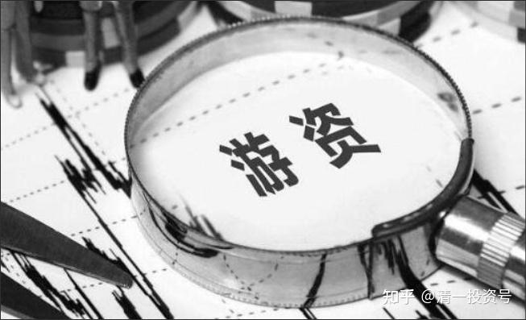
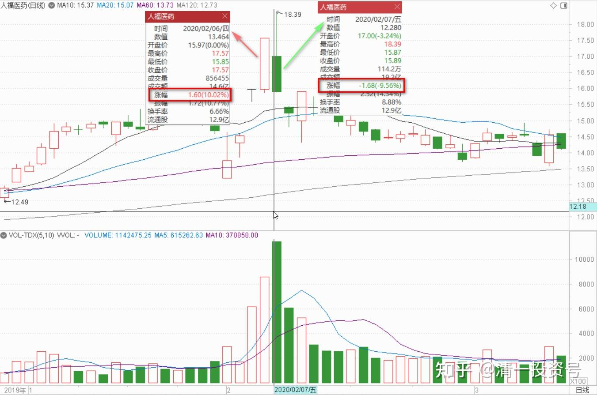
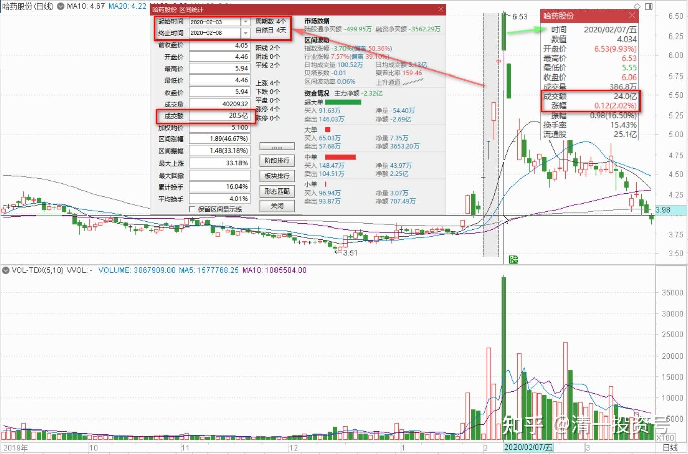
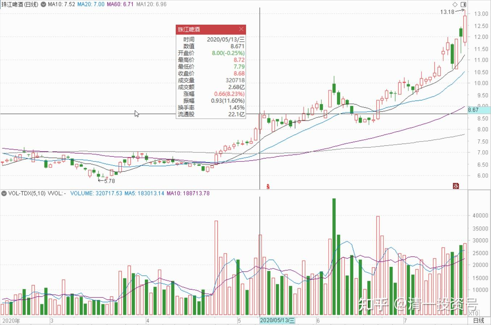
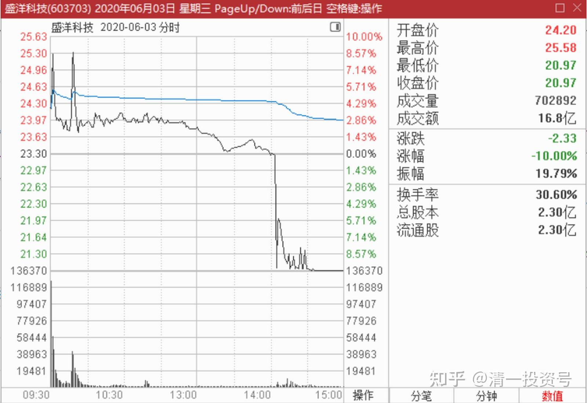

85篇.游资闲谈一：进货与出货手法及散户如何防骗？

清一山长2020年2月～6月

**一、与狼共舞的后果**

清一山长2020-02-07 12:58:38

$人福医药(SH600079)$ 昨天涨停，今天就跌停。典型的游资操作手法，很对中国人的胃口，可怜的小散户，热情地参与行情，追逐热点，却注定是被人收割的命运。

清一山长2020-02-11 12:30:47

**$哈药股份(SH600664)$ 这个股有意思，游资出击手法的绝妙教材**：这个股长期平盘，估计一些资金慢慢吸入。由于疫情，这个股进入主力的视野，春节前是试盘，看盘子重不重，春节后直接拉升。四个交易日，涨了40%，总成交20个亿。第五个交易日，开盘涨停价。随后下跌，震荡，交易24亿元。前期拉升的主力资金已经全部安全退出。最近两天的跌停，应该是2月7日追进去的投机客发现情况不对的“逃命行情”，但已经晚了，没有人接盘，怎么出的去？当然还是有勇敢者进入的。未来较长一段时间，这个股是没戏了。原来的题材用尽，而且前期能够让散户快速涌进，一个是三个涨停板改三观。还有就是估计前期媒体上广泛招募的游击队进来救场了，比如各种“美女股神”的广告，拉来的傻瓜们的资源也用尽了，这次下跌，高位接盘用了融资的，再跌两三个跌停就要爆仓了。主力的利润，也不太多，三五个亿是有的，短平快的闪电战，让群狼饱餐了一餐！

未来此股还有20-30%的下跌空间。等散户们忘了被咬的痛苦后，还可以再做一波。

**总结：中国的散户们真奇怪。自己明明不是狼，却喜欢与狼共餐。**怎么就不怕成为狼群的食物呢？以为给狼们交了一点“咨询费”、“会费”你就成为狼了？可以与狼一起吃饭了？真是笑话！

以上解析，纯属猜想。如有巧合，请勿对号入座[俏皮]！

**二、游资炒作还是强庄抢筹**

清一山长：2020-05-13 14:57:01

$珠江啤酒(SZ002461)$ 下午挂了个8.67的单子，休息去了。刚回来看已经成交了。本次上涨，已经出了10%的仓位。既然这么多人抢珠江，俺也大方一点，分点赚钱的机会给人[滴汗]。看有啥困难户需要救济的。看中国建筑今天挺困难的样子，就5.16补了1M。也留点现金，准备明天有机会做T玩。

明达野老回复@清一山长：（回复上贴）

不带这么同步的[大笑]。我的出货价是8.68元，首笔出货价是8.58元[献花花]。

祝贺山长在珠江上大赚。

只是，我出的比例比您多不少（看这两天这么去狂摘，我就送点货出去，做做贡献），出来的资金买了些中建还有其他啤酒股，剩下的资金继续补充我的备用金头寸，因我始终感到不对劲，不知是否有大事要发生。说回珠江，我其实很怀疑最近的拉升非真正的“大买家”所为，更像短炒的敢死队干的活（如果龙虎榜出来，我得看看去，直觉告诉我前期收货的资金和这次拉升的资金风格不相似，这次更像是搅局的快庄资金）。如果是主力，不必要如此去全盘上摘，如果货拿足了，缓推到8附近，做个缩量回踩假装冲不过去，再快速推上去吃掉8.3附近的压盘点火即可，又轻松又能推得更高做得长远，顺鑫就是这么干的。不过毕竟我不是主力，希望我是错的，这样持有没卖的同学短期可能能赚更多，我就少赚点，学贝莱德的大股东和巴菲特，在这个时候多做点防守，不死就行了。

清一山长2020-05-13 16:17:02回复@明达野老:

真有意思，双方再次同步[很赞]。的确心有灵犀。

你卖得比我好，进出点掌握得特别漂亮。

跟你一样，我觉得现在的势头很不正常，燕京不跟也很不正常。**我想的版本跟你的不一样，你认为是游资炒作一把就走，所以避险情绪重。我认为有可能是强庄来抢筹。**因为市场上没多少浮码了，只能拉升，强行介入。如果未来真走上重庆啤酒之路，现在多花一两元抢货没啥感觉不好的。

我的依据是：燕京和珠江的市值差不多（今天珠江市值还高了12亿），但珠江花个两千万，就可以进入十大股东，甚至是进入到第五大股东。但燕京至少要1.2多亿，才有可能进入十大。第五大股东，差不多三个亿。两者的市值差不多，说明珠江市场上的浮动筹码很少，大多数筹码已经被锁定了。主力不一定在十大里面。

还有：两家公司的十大股东，燕京是一股独大，持有51%的股票。珠江是三家机构，占有82左右的持股。这些持股，理论上是打死也不卖的。市场上能够买到的股票，总共只有17%左右。这些流动的市值，算算才三十多个亿，加上一些长期的大户锁定了筹码。所以珠江的盘子其实很小。我认为拿3～5个亿来坐庄，就足够目前这样级别的拉升了。所以，我原来一直说：珠江的价格是多少？取决于这笔资金来决定，爱给多少就多少。我猜想他们以后会涨涨跌跌的，实现控盘利益的最大化！这几天，只是在秀身段，吸引跟风盘罢了，不会轻易罢手的。

所以，我只出了10%。手上还有不到4M的货，准备跟随主力坐过山车!

(以上判断纯属猜想，不作为投资依据。本人未来处于不断减仓中，不会加仓，除非做T补仓）

**三、防骗其实很简单：永远别想占别人的便宜**

清一山长2020-06-04 22:22:49

$燕京啤酒(SZ000729)$ 燕京现在还不是出货，我认为不是。虽然成交量有点大，可能有些人出了。但图形上不像。有人想看什么是出货，我找到一个，昨天用16个亿走出来的血汗图，钱都流到骗子的手上去了。一天之内涨停到跌停，成交量30%。赚了全跑了，股价跌回原地。**盛洋科技。大家见识一下什么是游资的庄家进货与出货的手法。**

**防骗其实很简单：永远别想占别人的便宜。**想让别人用真金白银拉股票上去，让你轻松赚钱？天底下没这么好的人。素不相识，凭什么撒钱给你？

**第一：要远离荐股的人。**我从来不推荐股票，只说我买了什么股。特别是高位的股，跑出来推荐，99%就是骗子。推荐低位的股，也不排除是骗子，因为地下层下还有地下层。长期低位盘整的股、大盘股，游资是没办法坐庄的，散户低位买这种股大概率不会受骗。为啥我说牛市来了我就走了？不在雪球发言了？**市道艰难的时候，我用正确的理念鼓励散户不要失望，也用自己的真金白银的实战投资记录，让散户对投资抱有信心**。但牛市来临，我一谈股说我买了什么股，就有可能很多人追股，比如珠江8元多，9元多都有人追股，说是山长的股。有一天就会被收割。为了不误导人，股票高位了，我就不说话。谁见我顺鑫涨起来之后天天吹顺鑫值得买的？我19元买进，30多元都一股不卖，但也不吹股，就是怕人上当。高位荐股，当心！要不脑子有问题，要不人品有问题。

**第二：相信常识，做点基本功，别成天追星，股吧听谣言。**有人还花钱去谣言。花钱进群的，未必就帮你赚钱的。只要推荐股票的，都有骗子的嫌疑。

**第三：洁身自好之人，不荐股，也不评价别人买股的对错。**有人或者公开，或者私下，问我现在买啥股好？要我微信加，等等。我不理你，是对你最大的善意和慈悲。假如我“热心帮助你”，可能就是在培养韭菜。等养熟了找机会宰的。

所以，喜欢私下找人聊的人，有嫌疑。**真有本事之人，没有人喜欢闲聊的**。也请大家原谅我不会跟你私信互动。除非你有东西要教我，帮助我，否则别跟我玩私信，当心被拉黑。

参考链接：

[清一投资号：86篇.游资闲谈二：快进快出的“小李飞刀手法”](https://zhuanlan.zhihu.com/p/589591604)

[清一投资号：87篇.游资闲谈三：炒股秘诀——看空不做空](https://zhuanlan.zhihu.com/p/591303412)

[清一投资号：88篇.游资闲谈四：吃亏的游资，饱食的游资](https://zhuanlan.zhihu.com/p/593039607)

