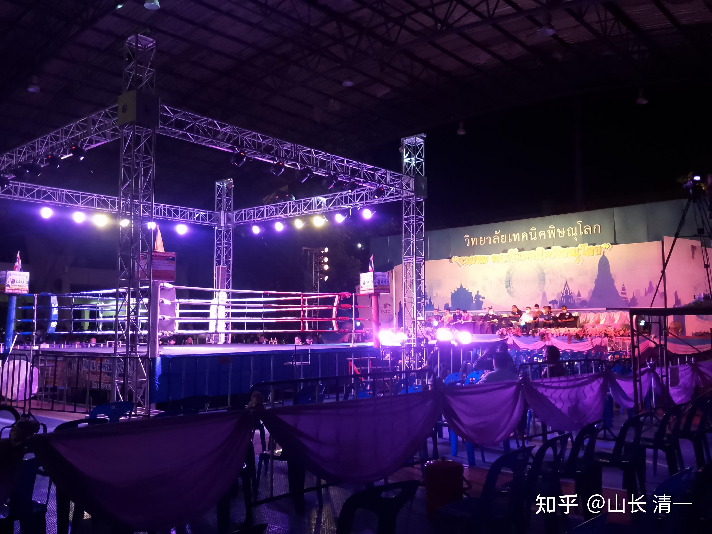
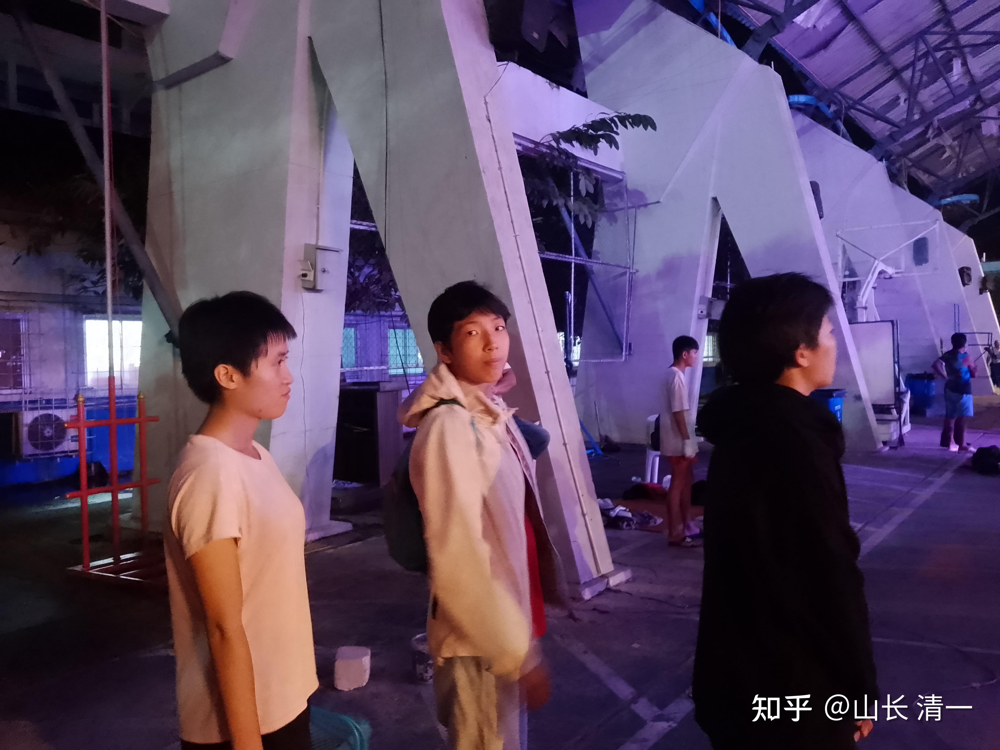
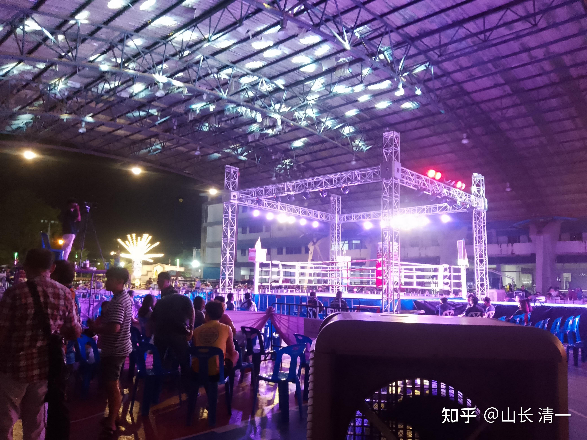

11月19日，老拳师带两个木兰去外府参加跨区比赛。这种地区性的城市举办的公众性质比赛，是面向泰国民众的节日庆典赛事。也是北方各府的各知名泰拳馆“推送新秀”的最佳时机，馆长和老拳师们，都会把自己拳馆最有实力的新拳手，积极地推出来参加这种地区比赛。其中如果表现良好，打得好看的拳手，就会被来观摩比赛的“拳探”选中。要不推荐去其他地区继续比赛，继续观察。如果场上的战绩特别好，就会直接帮你安排去曼谷参加比赛。因此----所有的泰拳手，都盼望能够得到参加这种跨府联赛的机会。有些拳手恐怕连跨府机会都没有就退役了。虽然这种比赛的拳酬并不高，但万一被选中了能够去曼谷比赛，拳酬就会上十倍的增加。正因为如此，所以这种跨府比赛，虽然看起来不是很有档次，并不会在体育馆里面举办，但每一个拳馆的新晋拳手，以及拳馆的老板，都非常重视这种跨区比赛。木兰的泰国导师，也利用自己在泰拳界的关系，帮木兰们争取到了一些这样的比赛。赛前，也特别交代两木兰要打好比赛。告诉她们：如果这次比赛打好了，曼谷方面来看比赛的拳探，就会给她们高级比赛的机会。我认为：两个木兰可以去积极争取参加泰国的高端比赛，但其他大批量的拳手，就只在清迈拳馆练练手，不要出去混了。免得过于招眼。动了别人的奶酪不好。如果我们的女生都叫木兰，外面的人也搞不清有多少个木兰，以为只有两个。如果出去多了，绝对暴露目标。但两个木兰为大家探探路，还是有必要的。

*赛场 有电视台转播*

*两拳手准备上场*

两个孩子也蛮争气的。我当晚与清迈的学生们一起看了实况直播，场上佳慧第三回合KO了对手。明晓第三回合打完后，我看对手已经体力耗尽，都累瘫了。防守意识已经不行。我就说：明晓如果跟第三局一样打的话，第四局就会KO对手了。果然明晓第四局用拳肘KO了对手。导致大会的主播说：两个中国木兰拳手都好恐怖！估计在场的女泰拳手，都会对两个木兰的强悍打法，留下心理阴影的。老拳师也很满意两个木兰这天的场上表现，说打得不错，有威风。没有提太多的继续改进意见。赛后还高高兴兴的带着木兰去到处见他的老朋友。老朋友们也有点嫉妒他，说他带出来的拳手居然这么厉害，一定会被人抢走的。的确---赛后不少拳馆的馆长和拳探都对木兰很热情，找木兰要联系方式，邀请她们去参加一些活动等。但木兰很懂事---说自己的一切赛事，活动，都是老拳师在安排。意思就是自己不会跳槽。泰国人还是很重义气的，有些拳手不尊重自己的导师，有好处就跟别人乱跑，结果就失去了比赛机会，遭到行业的集体排斥。就只能转行了。我要求木兰要注意这一点，不要随便跟外面的其他拳馆馆长等搞关系。别人只是想利用她们多赚钱罢了，不一定会考虑她的前程。电影【百万宝贝】中，大家看到了寻求比赛机会的拳手。都非常在意是否有人愿意帮拳手安排更多的比赛，愿意投靠更有关系的经纪人。因为更多的比赛意味着更多的金钱。

本次打完后第一时间，老拳师就告诉他们：比赛前。他就邀请了曼谷最老资格的迦南隆拳场的拳探来看木兰的比赛，想要把木兰推送到曼谷去。让两人好好打比赛。他来现场看后对木兰的表现很满意，当场就拍板给木兰佳慧安排了本月25日的曼谷比赛，对阵一个外国女拳手。目前还不知道是哪国的。木兰早就想打八国联军了，更想打日本人，一直没机会。这次听说她可以打外国人，高兴坏了。目前正在积极准备曼谷最高级别的两大拳场之一的正式比赛。

另外赛后，由于老拳师表扬说：两个木兰这次的比赛表现良好，比上次拿奖杯的比赛更好，打出了很多有效的攻击。木兰看到现场有类似上次比赛的奖杯，就说今天是不是还会得到一个新奖杯？老拳师说：应该会吧，打这么好！

结果-----最终比赛完了，颁奖仪式开始，但----没有两个木兰的任何奖杯，啥都没有。木兰说：都说我们两打的这么好，怎么没奖杯呢？老拳师笑笑。说：你全程优势，一路臭揍对手，比赛一边倒，完全没有悬念。所以当然没有奖杯了。奖杯一般只给双方水平差不多，双方拼斗非常的激烈，让现场观众都非常的激动，比赛效果特别完美的拳手，才发奖杯。但不一定是给实力最强的选手。木兰恍然大悟，才明白上次回来后，我说她上次缠拳战就是没有打出水平来，降低了自己的实力，打得难解难分的，才得到了奖杯。如果她真把对方KO了，就没有奖杯拿了。现在她相信了---果然如此。其实----上次她获奖，不仅仅双方拼斗激烈，也因为她是明显的胜方。判平局，有点亏待她了，所以补偿她一个奖杯。

另外还有一个消息：赛前木兰们并不知道自己的对手是谁。现场来了才知道对手是谁。打完后，去跟对手和对手拳馆的馆长拜谢，因为木兰这次打得很凶狠，并用膝多次重击了对手的脑袋，木兰的膝盖赛后都酸痛不己。她想对手肯定被打得很惨，觉得有些抱歉。跑去找对方道歉，拜谢对方。这才发现----原来对手是上次二番战被她KO的馆长女儿的拳馆。这个馆长父亲，这一次也亲自带队来参加比赛了。他这次赛后见到木兰佳慧，脸色特别的不好看，有点有苦说不出的感觉。这一次，见到佳慧就说：你就是力气大，技术啥的根本就不行。佳慧也不辩解，赶快说：是的，你的拳手很厉害，扫腿特别漂亮，泰拳技术的确比她好，她要向对手学习。她由于的技术不好，吓得只敢乱打一气，只能用力气了。不小心KO了对手。馆长见佳慧“服软”，找回了面子，脸色才好看了一点点。

另外。此次场上裁判拉偏架也很明显。佳慧反馈控住对方自己顺出位置来打的时候，裁判就会阻止，叫停等等。最后第三局，我看裁判是看到对手完全没有还手之力（一拳都还不上），及时拉开了停止比赛。就知道对方拳手是重点保护对象，尽量防止她被真正KO，就算是TKO起码不受伤。不然会影响自己后续的高价值比赛。因为是借来的拳手，馆长应该委托了裁判要保护拳手的。就像上次金腰带比赛，也是保护拳手第一位。馆长这次拿更重量级的拳手来打佳慧，以为稳操胜券，显然没有想到才过没多久，佳慧的技术已经提升了不小。现在佳慧的力量。速度。以及连续攻击能力，已经与上次打金腰带二番战完全不一样了。主要是上次与世界冠军甜水的一战，她输了比赛让她很不甘心。对自己的攻击力不足非常的不满意，所以后续一段时间，都在拼命强化连续不断而且有力量的攻击，而不是与对手僵持不下。因为与对手一样，就意味着被潜规则，因此佳慧是被泰国的裁判偏心，导致出手越来越狠的。泰国拳场解说员都说中国拳手“好恐怖”，打的太凶猛了。泰国拳手应该非常的不适应这种连绵不断的打击方式。

但答案其实没这么简单。木兰的老拳师告诉她们：跟她对战的这个拳手很厉害，是在曼谷拳场打拳的高级拳手。木兰们却一直蒙在鼓里，场上真没发现是高级拳手。还说：原来安排的对手，是一个重量跟木兰差不多的人。但临时比赛又换了人。换了一个身高体重都比木兰大上一圈的对手，实力也很强。我认为：对方馆长在上次女儿被KO之后，肯定想找人KO掉佳慧。这就是馆长找来的外援。而且木兰还告诉我场上的异常情况。第一局打完，对手有点吃力，就一直有人在大叫要给对手发奖金。让她拼命打，还一路不断地加奖金，一路加到了6倍。我猜一定是有人赌对方赢，看木兰凶悍，怕拳手顶不住，怕输了自己着急，就一路不断提高奖金。可惜还是被KO了。我认为:对方馆长见到木兰的脸色很难看，不仅仅是“为女复仇”没有成功，我估计他是认为他专门请来的外援来助战，就算打满五局肯定判木兰输，他赢定了。所以他肯定赌了钱要赢木兰的。可惜被KO，一点机会都没有。所以脸色才这么的难看。这馆长是老江湖，算计很深，跟他女儿的一番战，要求我必须赌拳，结果黑了我一万元。二番战也不断使小心眼想坑木兰，被我破了。现在拿个强手来用体重优势欺负木兰，结果反而被KO。下次新仇旧恨，肯定要“报仇”的。就不知道将来会怎么算计木兰了，我已经提醒木兰：现在荣誉加身，更要步步小心，别乱走。听老拳师说过，有些人，知道场上的实力打不过，会在比赛前一天，找几个人，堵住拳手先打一顿。拳手带伤上场肯定要输。而原来不知内情，依旧相信拳手实力赌他赢的人，就输光了。这就是泰拳界的种种黑幕之一！泰拳这些老玩家，啥人都有，有真心爱武，不求回报的武痴，也有机关算尽的老江湖。有完全免费支持拳手发展的老拳师，也有盘剥自己的拳手非常厉害，让优秀拳手穷愁潦倒的“师父”。更有比赛前跟自己的徒弟一起吃饭，却偷偷下泻药给拳手，让拳手第二天上场打失败的“师父”。在利益面前，泰国人也表现出了种种的创造力。当然---据我了解，中国的武林江湖水更深，更黑，更没底线。具体我就不说了，说了伤人。

关于拳舞：老拳师让佳慧跳泰拳舞，而且要求她在对手结束之后，还要继续跳一段。让明晓跳一半泰拳舞，一半中国舞。两孩子不明所以，不过都照做了。回来问我为啥这样安排？有点奇怪。

我说：今天来看比赛的，肯定有人是为了看木兰的比赛而来。应该是拳探，赛事安排人来选人的，而且目标就是佳慧而不是明晓，所以明晓乱跳也没事。老拳师安排佳慧跳泰拳舞，还特别要求她跳长一点时间，对手跳完还要跳一会独舞，应该就是表演给这种人看的，让他看到木兰是“正宗泰拳手”，连拳舞都认真学了，有文化认同感。不然主办方有可能不会愿意安排她的比赛。果然赛后，相关人马上就安排了佳慧的25日曼谷比赛。所以---泰拳的选拔机制很有意思，让拳手在不知不觉的完成“面试”了。佳慧的拳舞，是我找到了泰国“拜师舞”比赛的全国冠军（自己猜猜是谁？）。在一个重大的仪式上（好像泰国王都出席了）专门出来表演拳舞的视频，特别的认真细致，比拳场上的要细致很多。非常的完善。我就让她跟随视频学习的。结果她上场表演，泰国人都说她跳的好，比泰国人的“更正宗”。纷纷问她找哪个师父学的。她只能含蓄不语。如果说是我这个师父“教”的，肯定会被笑掉大牙。在这次比赛上，播音员也多次感叹：中国人跳的泰拳舞很好，很漂亮地道。看起来用了很多功夫学习泰拳。哈哈---达到这个目的就行了。在别人的国家，还是入乡随俗，尊重别人的文化。不然会被嫌弃的，没人跟你玩。老师父也不想帮你安排比赛了。

[https://www.zhihu.com/zvideo/1578242522379505664](https://www.zhihu.com/zvideo/1578242522379505664)

通过这个视频看到与直播不同的角度，才发现泰方找来的对手，都是超重量级压制我们的。佳慧体重约49公斤，她的对手明显高和壮一圈。了解是打53-54公斤比赛的拳手。明晓这个对手看起来更重。因为明晓个子比佳慧高不少，明晓的体重比佳慧轻了9公斤，而这个泰国对手比明晓更高。因此目测两人的体重差距恐怕有点大。如果去曼谷打比赛，都不可能安排这种级别差的（正规比赛要求选手互相差距不得超过2公斤）。但这种地区比赛居然安排差距如此大的拳手来打，有点“欺负外国人”。当然，实战的结果是明晓毫不客气地欺负了泰方找来的不对称对手。远距离作战显然明晓占优，内围战对方也毫无机会。明晓多次摔翻对手，内围中也是压制状态，泰方毫无机会。体重差异下，这更显出太极技术的优胜，的确能“以弱胜强”，并不是完全靠拼肌肉群数量的。

由于本战明晓已经提高了正蹬技术，因为上一次使用正蹬，多次被对方抓住腿，回来被我批评出腿拖泥带水不干脆。本次看正蹬技术已经改善，更加快速有力，对手中招较多。想抓抓不住，也躲不过，导致身体被大量击中，第四局已经毫无还手之力。不过，原来明晓打的拳手，往往中了三记正蹬就撑不住了。这个速度和力度的正蹬打击其实很难受，普通人应该一记就蹲下去了。但本战中这个拳手，居然一直抗了下来，但身上至少中了十次以上的有效正蹬（我没有认真去数数），光从这一点看，这个拳手绝对不是普通的拳手。抗击打能力超强的。明晓第四局才KO她，已经算是顽强奋斗了。可惜泰拳的技术不行，想要发动强行扫腿根本就无用。虽然速度快，力量大，但面对木兰完全无效。泰拳武器库里的东西实在太少了，因此本场就只能被动挨打了。