泰国两大拳场：迦南隆和仑披尼，是泰拳圣地。泰拳手的最高学府。原来都不接受女子拳手打比赛。近几年才放开女子拳手的比赛。木兰佳慧应该是第一个进入拳馆比赛的中国女拳手。

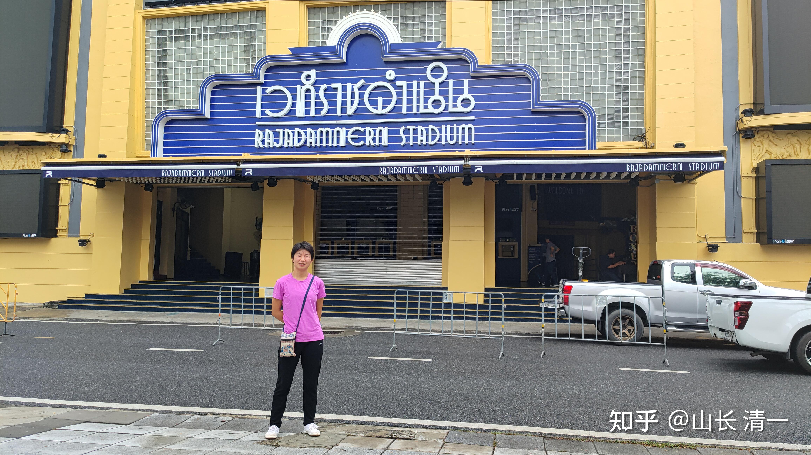

*24日抵达拳馆，进行赛前称重仪式的木兰佳慧*

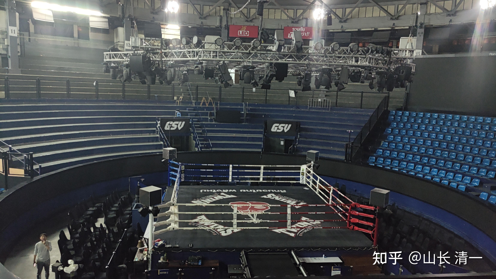

*佳慧将要25日晚上比赛的拳台。*

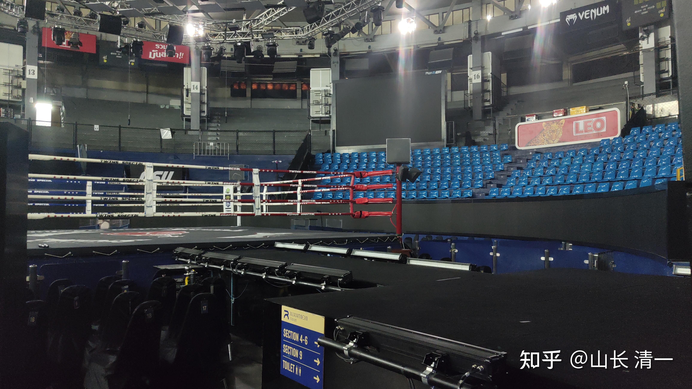

*拳手入场通道*

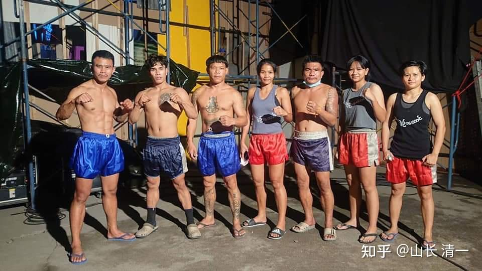

*最右边的黑衣女子，是佳慧本战对手เพชรจรัส ม.กรุงเทพธนบุรี*

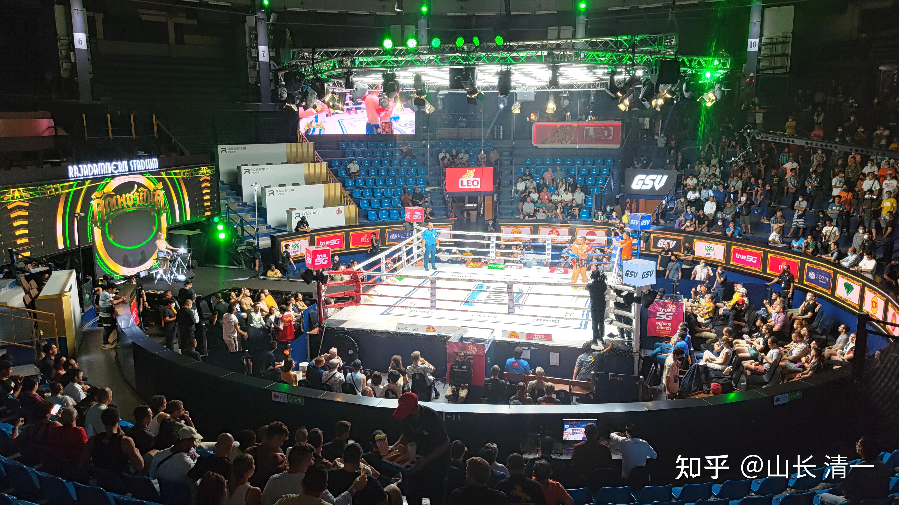

*今晚先去拳馆观摩拳赛*

佳慧的对手，临时换掉了外国人，换成一个从小就在体育学校训练和长大的女生，比佳慧大十岁。她开始打拳的时候，佳慧还没有出生，她已经打了20年的拳。在曼谷拳场打过几十场比赛，而且还打过拳击赛。肯定是一个强调出拳的对手。我看了油管上有很多她的拳赛视频。出拳极为凶猛，有力。后手拳特别强悍。真被击中应该比较麻烦。我看实战视频是习惯全力出击，后手拳力量超强，一拳就能把对手打倒。感觉有点像张伟丽的架势，成长背景也有点像。张伟丽从小就是武校出身的。两人的年龄也比较接近。不过显然她的天赋不如张伟丽，灵活性和变化不及张伟丽。

下图是当你面对一个拳击重击型拳手，结果会如何？佳慧会成为乔安娜第二吗？

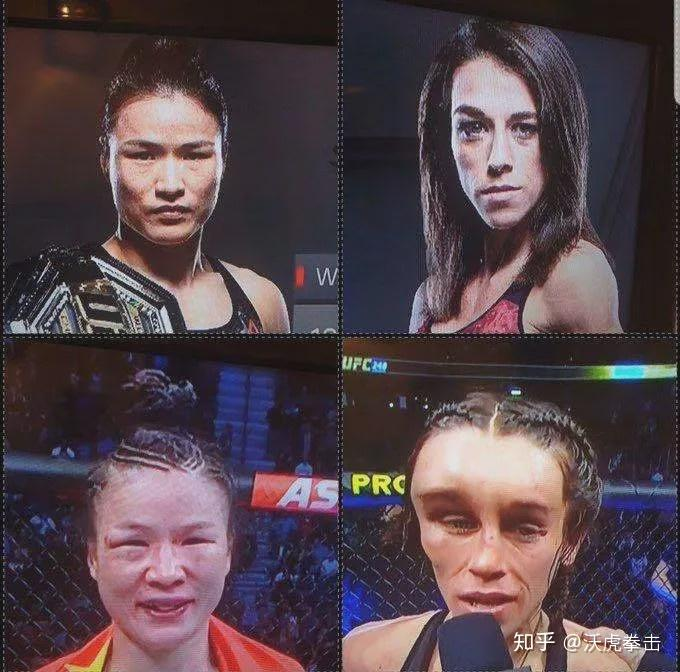

佳慧是新手，第一次参与这种级别的比赛。安排这个拳击型的泰拳手来打她，应该这个拳手的职业战绩不够好。不是啥重点比赛。不用担心。另外，就算是乔安娜本人来打，佳慧也不至于打成这样的，不至于当寿星。这一天的女子重点赛事，是一个泰国女子冠军，也就是佳慧她们常说的冠军姐姐。要与一个白人拳手打。不过---听说白人拳手拒战临时找借口（体重不合格）而退出了。真实原因，是冠军姐姐上次KO了与她同拳馆的战友。而这个战友的水平要比她高。她怕出来也被KO了。

我给佳慧的战前安排：

山长 清一 14:58:53

是一个拳击型的对手，佳慧的最佳策略是连续腿法和内围肘膝对付她，不跟她拼拳。佳慧注意：一开打，就用很重的连续正蹬来对付她，最好逼近，在她出拳的时候正蹬。她的拳击，对于习惯扫腿的泰拳手来说会有效果，但对于正面攻击她的阻击正蹬来说，是大杀器，能够让她根本就扑不过来。所以，佳慧记住用连续的腿法来让她体力丢失，再用内围摔用膝来终结她。报KO她的目标，去发力打拳。但不要心急，打出你习惯的风格来，别相信老拳师说的啥技术好。她拳击技术肯定不错，但你也不差。内围战和腿法远远胜过她。她就是来给你送礼物的，好好地收下这份礼物。另外---—从体型上看，她很壮实，可能很耐打，所以你要多打几腿重击，像明晓的正蹬一样，不断出击，来击倒消耗她。她敢贴身，就用内围技术，旋转，膝击，可以轻松拿下。

山长 清一 15:03:13

佳慧现在多看看她的录像，熟悉她的风格。然后用心去体验出腿发力，击她的关键区域。消耗她，最终KO她！

山长 清一 15:24:09

我看了她的视频。跟一般的泰拳手不一样，正面暴露少一点，拳击手的特点较为明显。佳慧的打法是：用前足虚蹬假打，引诱迷惑对方后，上步落地拉近距离用后腿（左腿）正蹬打击她。错开正面一点，侧面上步左腿飞起打入。然后连续拳击跟上一起后续打击，不给对方机会还击，不断猛攻。反正才三局，不怕累。这个战略应该很有效。佳慧提前多练练这种组合。

山长 清一 16:14:48

看了实战视频，她很喜欢用后手重拳打人。木兰左手要做好防护，贴进去打她。但我看她的速度慢。虽然力量大，不快就没啥威胁力。我看的一场泰拳赛，两人都喜欢用拳拼，结果她被一个后手击腹打躺到了，KO结束比赛。另外她看来不喜欢内围战，我看也没啥内围技术。所以——远战用腿，近战用内围肘膝，KO她没问题。木兰提前多看几场她打的比赛，边看，边琢磨，该怎样打她。站着看比赛，边看边打动作。多看几次，上场就很熟悉了。她打了20年，7岁就打了。这种惯性已经很强了。基本定型。

对付这种喜欢重击，但缺乏更多技巧变化的力量型拳手，我们使用快速变化的攻击，不断的进攻，会让她蒙菜。另外，她习惯在对方出前腿的试探性扫腿之后，马上就用后手重拳沉重还击。互相交换攻击的话，对手吃亏。往往还会被击倒。所以，对付她就一定要前腿打完之后，马上就用后手（左手后拳），抢先重击中线她的胸部。就像在缠拳赛一样打。这样她正好迎上来要挨打，就会被你的后拳打的很惨的。越看越觉得她不够你打！但记住要连击。仅仅是明琪一样的单发进攻，她会非常的适应。防守躲闪。你必须连续不断地攻击，她才会被打蒙！

清一大学武医学院 林佳惠 16:18:11

好的山长。[表情]另外今天中午还发生了一件事情，也反馈给山长：

这次冠军姐姐的对手，和上次被冠军姐姐KO了的对手来自同一个拳馆，都是外国人，但是这个女生在内部拳馆就比不过上次的人，因此这次就不想和冠军姐姐打（有直播，怕被KO没面子），故意减重不通过，能减也不减。于是主办方提供了两个解决方案：

方案一：让我跟冠军姐姐打。我自己觉得，打赢了得罪了老拳师和泰国的朋友，故意不出力又损害我自己的名誉，就是打假拳。所以我当时的回答就是装怂：啊呀，姐姐你太厉害了，我不想跟你打。冠军姐姐说，没关系，我们俩上去打着玩玩就好了。后来老拳师又来试探着问我，我说她是我的学姐，我不想跟姐姐打。老拳师说要打你也打不过。

方案二：让我的对手和冠军姐姐打，我的比赛取消。老拳师来问我的时候，我说愿意听从安排，怎样都行。老拳师还是很关心人的，说既然来了就要上去打，怎么能不打呢？估计也是知道我一直特别期待这场比赛，对我来说这场比赛很重要。

所以最后的结果是，冠军姐姐明天不打了，其他人也不想跟她打，所以她直接晋级到冠军赛，今天晚上听说办“庆功宴”，去吃饭。我的比赛正常进行。

山长 清一 16:45:53

@清一大学武医学院 林佳惠 [表情]。佳慧很聪明，处理这种难题应对得很好。如果换了一个直脑子的人，可能就要打就打，还觉得有机会。最终得罪了人，都不知道咋得罪的。冠军姐姐在实力上是打不过你的，跟甜水她们本质上一样。但老拳师蜜汁自信---老拳师说要打你也打不过——但就是打得过，你现在也不能打。现在这样不清不楚的真打了，假如实战中让这个姐姐丢脸了，老拳师和姐姐都不好看。将来关系就不好相处了。你想打成绩出来，就使劲打给你安排的这个拳手好了，让其他人看了都怕。至于他们提议要换你的对手去打？这就很滑稽，我认为是看你态度的。因为泰国拳手这么多，怎么可能找不到拳手来换？有钱拿，谁不干呢（外国人可能在乎一点，我看泰国人不太在乎），特别是跟冠军打，多有面子。总比在清迈打好多了。

山长 清一 16:49:03

对你人品的考验无时不在，怎样成为一个受人欢迎的人，比输赢本身更重要。也许有一天，拳场正式安排你们晋级排位赛，你在比赛中遇到这位姐姐，可以大大方方的跟她比一场，还要求冠军姐姐一定要尽力KO你，绝对不要留手。要打就认认真真的打。但这种搞笑的比赛（关系拳），你就不能打。你输了损失自己的职业生涯机会，你赢了对你自己发展也没啥好处。但这种结果，会非常影响她的职业排名（最近她一直在胜，排名越来越高）。因此被你打断了进程，会让老拳师和冠军姐姐都很生气的。现在老拳师正在捧她上位，而且这次冠军奖金非常高。百万级，她们会很在意的。

11月25日，19:40：补充信息

木兰佳慧做赛前准备：

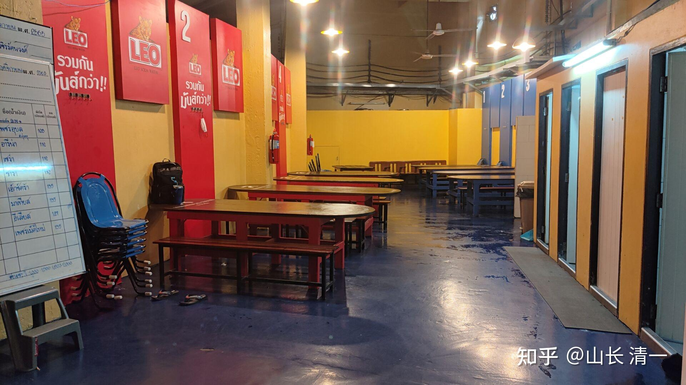

*拳手更衣室*

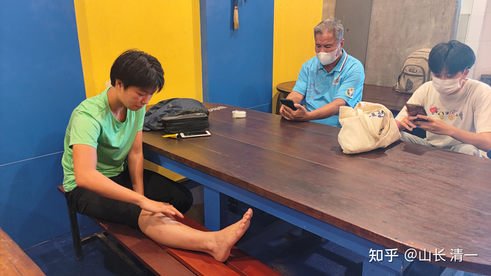

*佳慧正在做赛前准备*

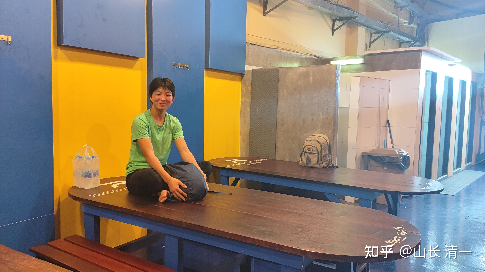

*佳慧的赛前状态不错*

这种拳馆的更衣室，对于明星拳手来说，是一个很危险的地方。就像酒吧的卫生间常常出事一样。因为拳手更衣，会比较放松，陪同人员未必在一起。只要拳手单独出现，但一些仇家居心想坑你，可能就会故意引发冲突。导致你受伤之类的。当然，泰国拳场估计管理良好，保安工作到位。这种情况应该不发生。但一些地下拳场难说就有种种事故。据说原来有中国拳手老赢，就被人拳场外埋伏收拾了一顿。清迈拳场，以后我们的拳手要小心，不要让拳手单独呆在什么地方。助手必须随时在身边， 以策安全。

21:26分，再度更新，很快就要上场打比赛了，进入候场状态

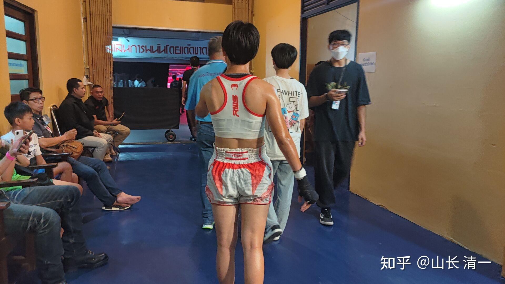

*跟老拳师进入拳手准备室*

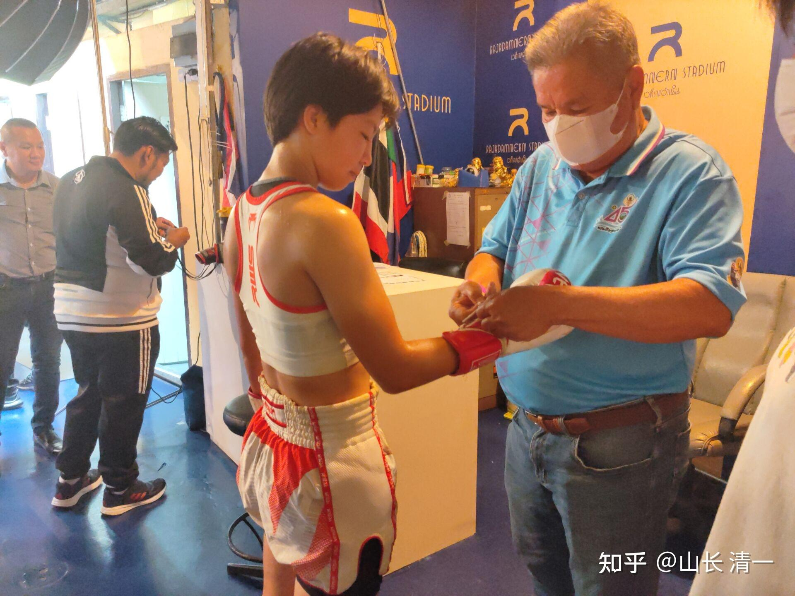

*老拳师帮助扎好拳套*

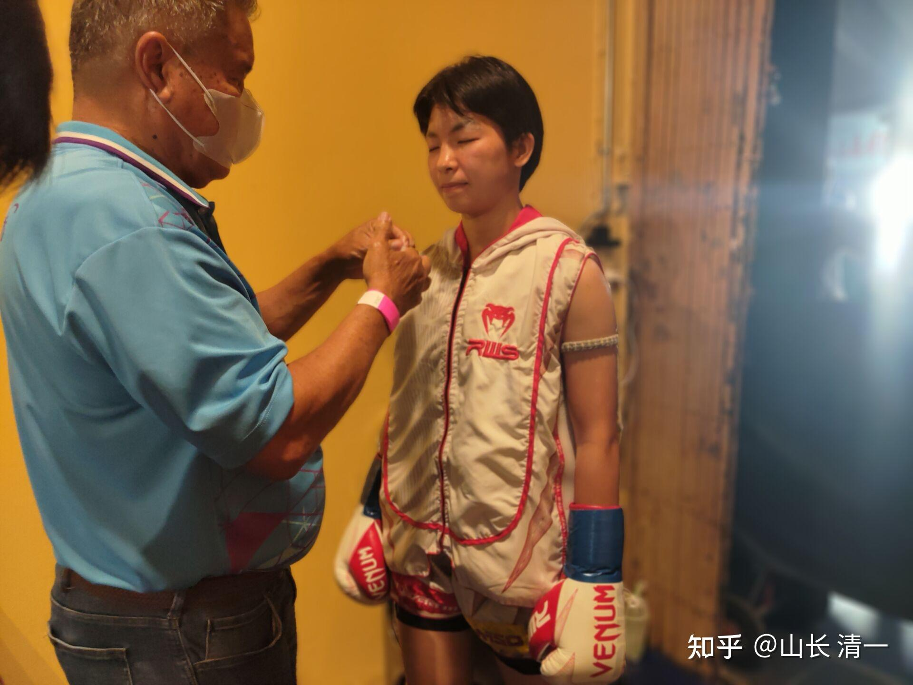

*完成准备工作，等待上场*

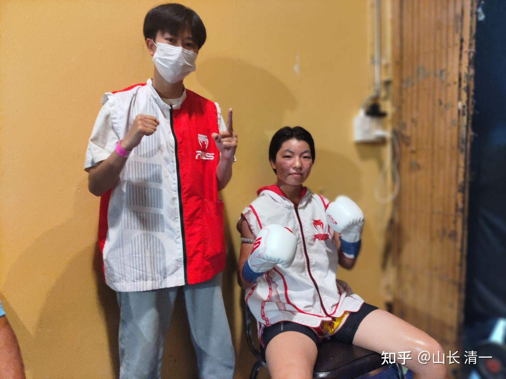

*这个小姐姐是老拳师的泰国弟子，本场为佳慧做助手。*

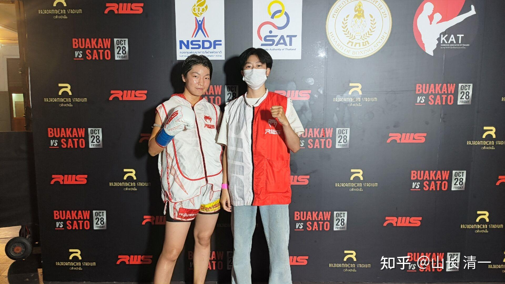

*拳手墙上预报28日有播求的比赛*

更新：清一大学武医学院 谭琛怡 22:10:18

佳惠赢了！！！打满三局，点数胜。

【我的点评：看了这个拳手的确壮实，KO不了她。不过曼谷拳场看来干净一点，不会像清迈这么黑，承认佳慧的点数获胜。难得—佳慧还是第一次点数胜呢】

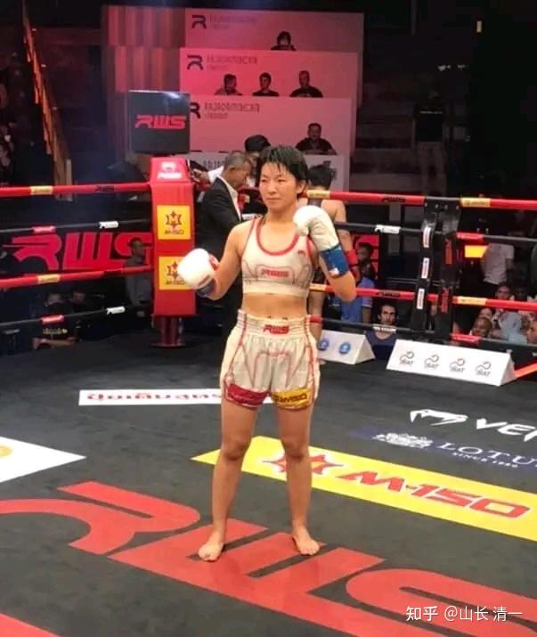

*场上 胜者留影*

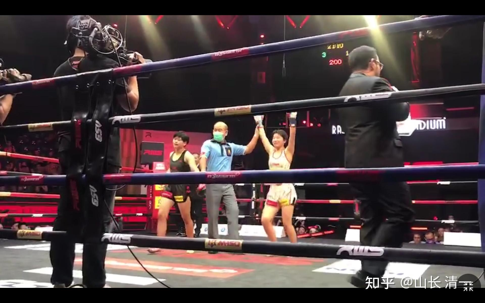

*打满三局，裁判宣布获胜*

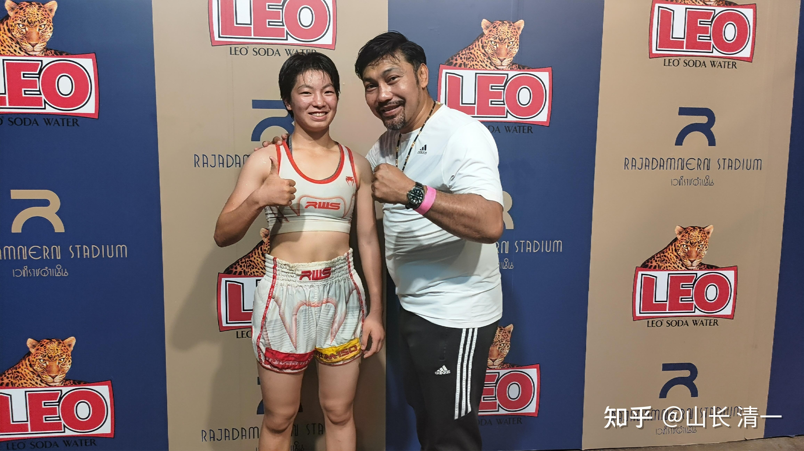

*已经退役的前K1冠军和拳击双料世界冠军，找佳慧合影！赢得了泰国拳界的欣赏！*

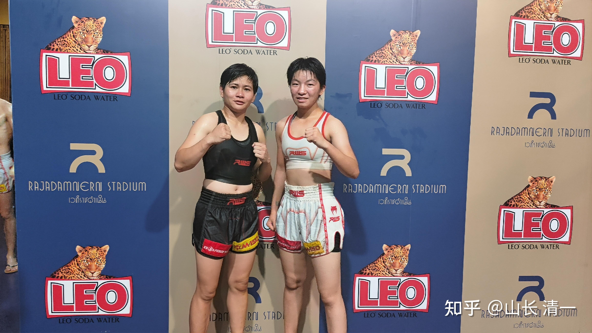

*场上对手，场下朋友*

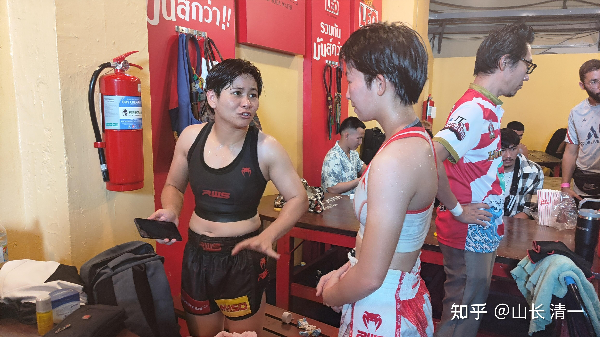

*看样子输了比赛的对手，对佳慧是心服口服。*

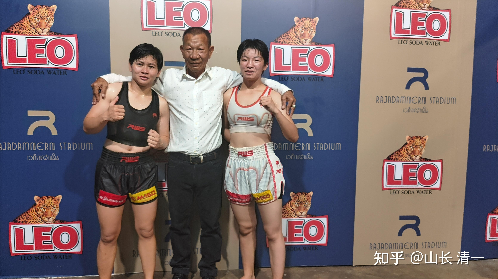

*大概是什么权威人物，找两位选手合影*

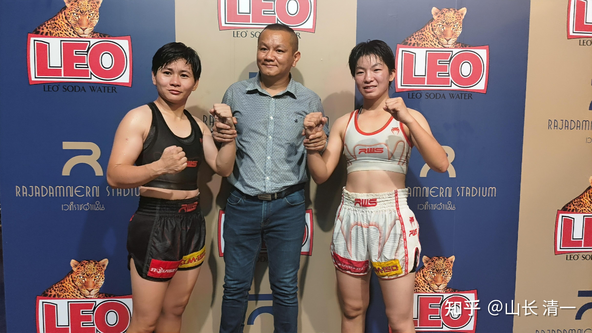

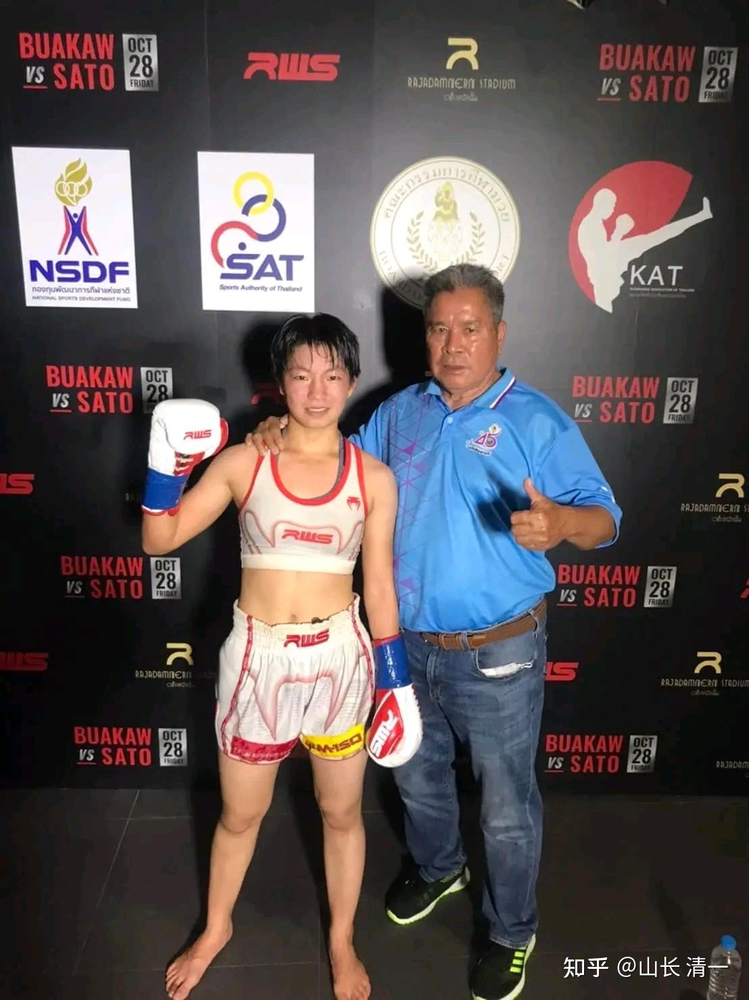

* 安排佳慧赛事的泰国72岁老拳师*

佳慧赛后感言：

清一大学武医学院 林佳惠 23:39:35

谢谢伙伴和老师们的鼓励[表情]，这一次我打的还是紧张了，不够放松，不够漂亮，可能比塔佩打某些场次还不如[表情]应该第二回合就把她KO了，很多山长教的都没用出来，我会回来继续努力训练和提升的，早日拿到迦南隆的冠军。[表情][表情][表情]现在正在现场看比赛，老拳师说男子和女子顶尖的水平都在这了，在现场我深深地感受到，我们差的真的只是泰拳手的心态，要学习这些选手的冷静大方和放松，但她们技术真的不咋地。相信自己上过这一次所谓的“大场面 ”，以后也会更加淡定，就算曼谷也不过如此，就是个台子而已。再次感谢山长的指导和伙伴们的支持[表情]

我的赛后点评：

虽然佳慧没有实现KO的目标，其实也不是坏事！如果打满三局，判佳慧赢的话，场面一定比KO更好看，更激烈得多。就像缠拳赛佳慧发挥并不好，但场面是最好看的，还得到了奖杯。后来的外府战发挥好了， 技术更好，很快ko对手，但奖杯也没了。所以---相持不下应该是赛场最好看的。我猜这个拳龄比佳慧的年龄更大的泰拳手，本场比赛被佳慧虐的够呛，场面应该比较精彩激烈。这对于佳慧未来的比赛安排，会更有利的，8号电视台的大门应该打开了！

佳慧的反馈：关于昨天的比赛，老拳师整体还是比较满意的，说我再打个10场，应该就能到冠军姐姐的水平，没人打的过我了。早上和他一起看了我的比赛视频，他的评价是：我会拳但不太出，内围的攻击不够有效，有时候有机会把别人打疼了也不打。结论是，一觉得我缺乏经验，所以应该多打一些就好了。二是觉得要增加泰拳技术，他好像想要把一辆车放在慧心楼那里，让我天天开去拳馆训练（因为我之前提过说想要学开车，像明晓一样）。我感觉有一些危险，有点像manop的感觉了，这一次上场前，离比赛还有一个半小时，我就被全身涂满了拳王油和凡士林，然后我还想坐着睡一会儿，结果就被老拳师拉去训练，盯着我练空击，非常着急和严肃地嘱咐各种要点。我能够理解这是老拳师表达关心的方式，但还是觉得有点棘手。

我的看法：佳慧在实力上，已经是冠军水平，不需要再打10场比赛。实力上，现在的冠军姐姐也未必是对手。但佳慧在经验上，的确与泰拳老手们差距很大。冠军姐姐是打了300多场比赛的人，佳慧还不到20场，当然经验，心态，控场，应变的能力，要差一截。佳慧自己的总结，是到位的-----技术上泰拳手根本不够看。但心理素质优胜于她。老拳师的总结，没有抓到根本。

昨天比赛，我看了视频。打的有点拘束，没放开。估计是被大场子镇住了，而且被对方的资格有点吓人，打得很保守。如果放开打，肯定KO了对手。还有比赛前，我的安排都是让拳手“静心”，好好休息。这样上场后反应非常灵敏，老拳师这种安排，赛前穷折腾，临阵磨枪，这只是适合外家拳，不适合内家拳。很早就制造紧张，不仅仅消耗精力，还练拳消耗体力，实在有点得不偿失。佳慧只要入静，定心。上场就可以打出快速勇猛的攻击来。不然这样消耗下来，跟泰拳手差距就不大了。怪不得佳慧这一次场上的反应，我觉得不如原来的一些比赛机敏，特别是第三回合。反应有点迟钝，只是对手更迟钝，看起来还是佳慧占优。所以证明：静心真的很重要。老拳师原来都不管她，自生自灭。反而佳慧自己调整的很好。老拳师现在关心备至，指点备至，胆儿佳慧有点不适应。所以：老师要学会放手一点（我就太放手了，啥都不管！）

佳慧家长的留言：

太震撼了。看一些资料，很多泰拳手，一辈子的梦想，就是要打进两大拳场（迦南隆、仑披尼）。木兰们，从3.25日第一场正式比赛开始算，今天11.25，仅仅只8个月，就叩开了迦南隆的大门。由衷感叹老祖宗留下来的东西太厉害。更厉害的是，山长仅凭一己之力，重新破译祖辈宝藏，并且在如此短的时间内，就批量培养出一大批木兰和武士们，来之能战，战之即胜。再现传武太极的威力，恢复祖先的荣光，谱写历史的新篇章......我们作为门外汉，也能亲历见证，何其有幸！感恩山长智慧开创，带领我们见证一个又一个的奇迹