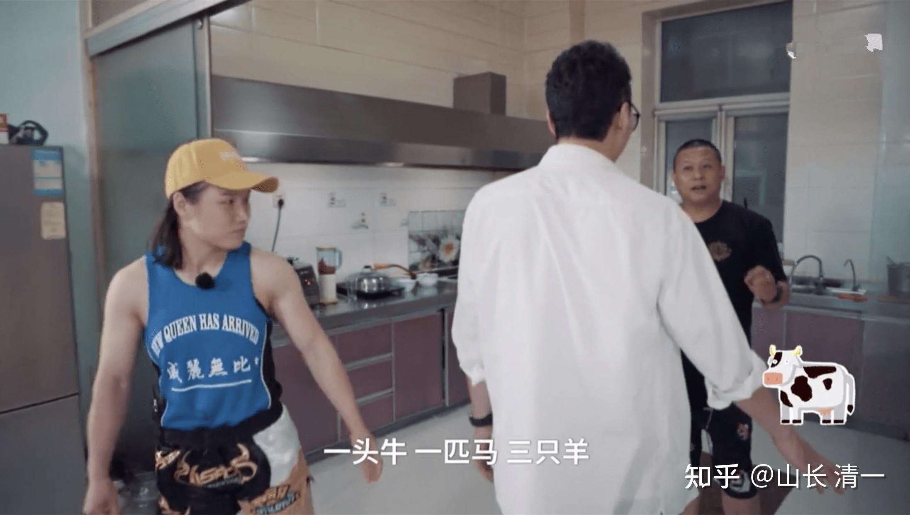
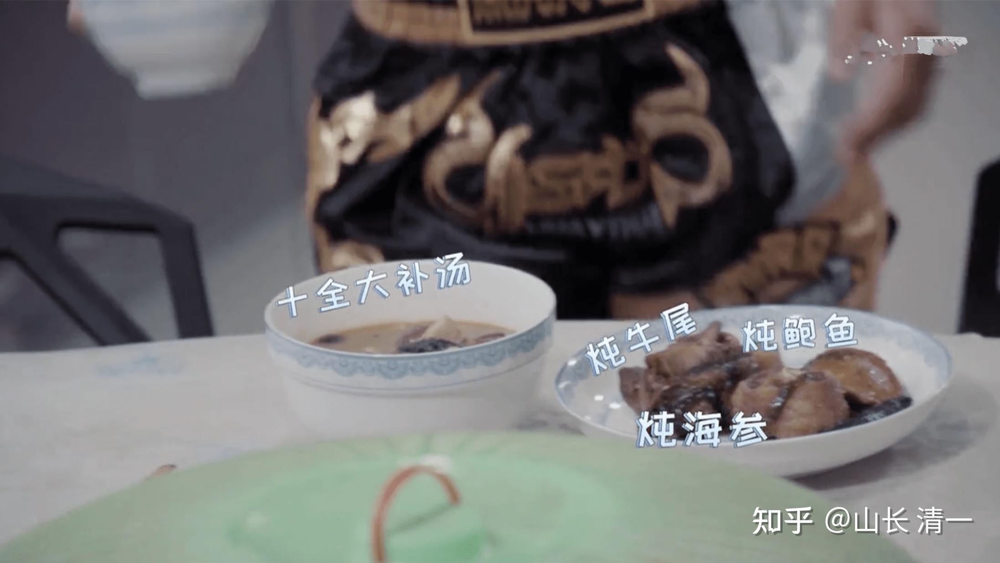

我发现：木兰们的饮食方式，和崇尚现代格斗的群体意识真的完全不一样。代表中国第一个取得UFC冠军的张伟丽，两者吃的东西，居然完全相反。印证了西方谚语说的一句话：一个人的美食，是另一个人的毒药！

清迈的公主班，武道馆成员的饮食，是【全碳水化合物】----谷物和一些蔬菜，生菜。完全拒绝蛋白质。甚至一些学生，连鸡蛋都不吃。

碳水化合物据说是重视肌肉力量的格斗手“永远的敌人”。而我们居然完全吃碳水（谷物），按道理，应该不是吃肉的泰拳格斗手的对手。但事实上，吃肉的泰拳手们，纷纷败在吃素的木兰们手里，而且泰国人还一致的承认：我们的木兰是“力大无穷”。他们没有输技术，是输给了中国人不知何来的力量大。

我们不仅仅主要就是吃谷物，而且更过分的是：我们居然不吃干饭，而是喝稀饭。我个人体会：稀饭似乎比干饭更耐饿。特别是用焖烧锅闷了一夜的糯米稀饭，喝上一碗稀饭就饱了，很久都不饿。而且没有正常吃饭时饱腹困倦的感觉，吃完饭的精神体力都很好。公主班的孩子们也是这样的感觉。

木兰佳慧的感受是：她的饭量比原来更少了。但体重还升了一点，体能比原来更强了，力量也更大。甚至可以摔翻男生。木兰们打对手，根本就不降体重，经常与比自己更重的对手比赛。不像张伟丽赛前要拼命降体重。多累呀。谁说碳水是永远的敌人？

张伟丽和木兰们的饮食方式，到底谁是对的？现在还说不清。

但是我知道一点：用木兰们的方式吃饭，简单，快捷。身体的感受很好，很轻松。而且厨房无污染。

但用张伟丽的方式吃饭，厨师很累，吃饭也累，吃完饭消化起来身体也很累。别忘了:消化肉类，是非常需要能量的。狮虎们吃饱后，大量的时间，都是懒洋洋的躺在地上睡觉。而素食的动物们，大量的时间都在活动。因此，吃肉真心很累。这种能量的来源，长期坚持下来，够用吗？会不会老的更快。

也许：有一个指标，可以衡量谁是对的。张伟丽现年33岁，将来看她什么时候打不动退役了。将来木兰们可能需要取得超过张伟丽的战绩，甚至还必须远远超过张伟丽的退役年龄还在继续打比赛。可能只有到这个时候，各位才会承认：木兰们的饮食是正确的。是更有利于拳手的健康和运动生涯的。只是-----这个时间看样子要等很久了！

我们等得起，你的身体等得起不？

转发 张伟丽的媒体报道：
**综合格斗需要高度自律，肉体和精神都强悍的人才能走得更远。 **

去年生日，她砰砰地打着靶，韩竞赛和其他人把蛋糕端过来，噗噗吹完蜡烛后，继续练。「每天就是训练、吃饭、睡觉，吃饭是为了训练，睡觉也是为了训练，感觉自己像一个机器人一样。」张伟丽说。

打拳变成了一种下意识的习惯，和朋友走路的时候，她也会做出拳击动作。「最近干啥呢？」她问，然后踢一脚，「忙不忙啊？」再对空气挥一个左勾拳。她手指每个指节处都有深色的茧，两年打烂了四个拳套。

日复一日的训练是痛苦的，但更痛苦的是饮食。几乎每顿都是牛羊肉，碳水化合物是永远的敌人。对饮食的控制也不是毫无破绽。她偷喝过几次可乐，「特别想喝那种带汽的，刺激的，不吃饭也行，就是想喝那种。」为了不被蔡学军发现，她独自找机会跑到超市，直接在里边喝完一整瓶，出来后把瓶子一甩，就那么回去了。但有一次，她无意中了知道了NBA篮球运动员勒布朗 詹姆斯管理自己身体的故事：1年花150万美元保养自己的肌肉，8年没有吃过猪肉，有一次他很饿，旁边的人在吃披萨，喊他一起，他走过去，说这不是詹姆斯吃的东西。「我一下就觉得，职业运动员就靠身体吃饭的，而我还喝可乐，我就说，这些东西以后我不动了。」

**有个新闻报导说，张伟丽是最擅长减重的那种人，「减重」也是最令张伟丽心惊胆战的一个词：比赛前两周是减重时期，只能吃水煮肉，没有油盐，也没有碳水，最后两天连水都不能喝，又饿又渴到晚上都睡不着觉的时候，张伟丽就打开电视看美食节目，看那些普通人触手可及却离她很远的东西，展开各种想象：颜色鲜艳的鸡尾酒，还有各种看上去就很美味的果汁…她能从深夜一直看到天空发白。**

*张伟丽的功夫是吃出来的吗？*

在一档节目中，张伟丽还向大家展现了自己的冰箱，自述她家的冰箱中有“1头牛、1匹马、三只羊”，还有鲍鱼、海参等海鲜，全都是高蛋白高营养的食材。

张伟丽每天早上的训练量一般都很大，所以早餐吃的比较“豪华”，有牛肉炖得“十全大补汤”、炖牛尾、炖海参、炖鲍鱼，看着就非常补，难怪张伟丽这么“精壮”！

一般早上的饮食多以蛋白质为主，所以除了海鲜外，牛排是最佳的选择，对于普通人来说，嘴馋了吃牛排，但是对于张伟丽来说，吃牛排就像“噩梦”，每天睁眼就是吃牛排，有时真的是吃不下，因此出去吃饭时她从来都不吃牛排，估计是吃“伤”了。

运动员要训练还要控制体重，补充蛋白质，所以像猪肉那样高脂肪的肉类都不能吃，詹姆斯就曾说过自己在训练期间就不吃猪肉，只能吃这些高蛋白的食物。

在没有赛季的时候，张伟丽的午饭就没有那么苛刻了，因为可以吃碳水，例如吃些饼、大米等主食，肉类还是以牛肉为主，另外吃一些青菜如西蓝花、胡萝卜等，加上一些水果小番茄、樱桃，这一餐也是张伟丽最开心的时刻。

虽然早上、中午吃的“丰盛”，但到了晚上张伟丽几乎很少吃东西，她说晚上不消耗，所以要吃的简单、清淡一些，让自己的肚子空一点，饿了多喝水就行了，**不得不说作为运动员，不仅训练辛苦，每天的饮食也要严格的控制，才有了他们站在领奖台上散发光芒 的一刻。**

**补充：对一些脑残科学教教徒的回复：**

【这么理直气壮的传播伪科学真的一点都不心虚吗？】

**回复：这么理直气壮的崇拜伪营养学，真就一点也不体虚吗？**

**我们绝对不反对你们迷恋吃尸体，这是尊重各位的饮食自由！食尸人族在地球上很多，很主流。我们食素小众群体，怎么敢反对你们的“食尸自由”？**

**但你们这些食尸族，也没必要以一种不可思议的，居高临下的架势，来审视另外一些就是不肯吃尸体的人吧？你们当然认为世界上除了尸体之外，就没有有价值的可吃之物。但这肯定不是事实----毕竟在动物界，食素者才是最主流的群体，他们普遍活得比食尸动物更健康，更长寿，更壮，更大，甚至更灵敏。真正的自然界，是无法提供这么多的尸体用于食用的。只有少量的种类，需要专门负责清理倒下的尸体。避免腐败的尸体污染环境。但改变自然游戏规则的，只有人类这一种特别的“食尸族群”，他们利用所谓的高科技，激素和药物，外加掠夺其他动物的生存空间，大规模采用化石燃料和化工产品，种植生产大量的植物来供应动物的饲料，这才发展出“先进”的养殖业---地球人每年宰杀六十亿以上的生命，用于伟大的食尸事业！每天用这么多鲜活生命的牺牲，仅仅是用来给“文明人”当做食物，这真的代表我们这个星球的文明和进步的程度吗？**

**更新：刚看到一个练了十年，拿过全国前三名的体操运动员食谱。很惊人----完全违背基本的健康常识**

**【强化训练的时候，一年多没有沾过白米饭，没有吃过正常的晚餐。早上8:30上秤，早上都不吃早饭。中午是唯一可以吃到饭菜的一顿。晚餐就是发一袋牛肉干解决问题。就这样吃了一年多。晚上实在饿得不行，就买一瓶水。饿了就喝一两口。】**

**我真的惊呆了：我们的奥运体育项目，就这样瞎胡闹的吗？居然不吃米饭？希望她能够吃面了。如果连面都没有---身体长期这样下去一定出问题，连累孩子一生的。还有---不想长胖，晚餐可以吃稀饭，甚至不吃饭都没问题。空腹吃牛肉干？难道想得胃病吗？这不是害人吗？这是最害人的吃法。教练太不负责了，太愚昧了，完全不懂基本的饮食常识！**