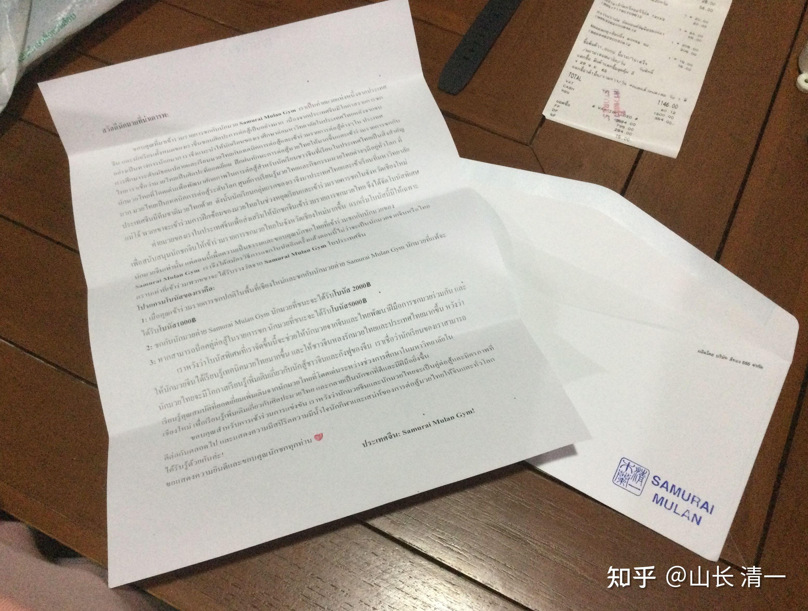

木兰们来泰国打泰拳，夺走了泰拳的名誉，打倒了泰拳手的骄傲，还拿走了一笔笔的出场费。但我们起码也要给别人留一点好处和念想。人生名利二字，往往只能取一种。想要名利双收，吃尽榨干，是没有前途的。只有极其少数的案例才有可能名利双收，大多数情况，只能两者取其一。

我们来泰国太极征泰，选择“夺名”---“让利”！因此，我们下周起，每次参赛，将主动给参赛的泰拳手发奖金，金额相当于他们参加清迈拳赛出场费标准的一倍到五倍（由于泰拳手的女生出场费更低。我们给的奖金，大致相当于普通女拳手的2倍-10倍）。这样的奖励，可以让泰拳手们有一点安慰：虽然被中国人击倒了，但起码拿到了中国人的钱。就怕是现在这种局面，中国人不断击倒泰国拳手，还拿走了泰国人的钱！如果---与中国人打拳，可以比跟其他人打拳，一样是比赛，与我们打能有更好的收入，也能够让泰国拳手们建立起对中国人的好感。因为：其他国家的拳手，肯定没有这么玩的。我们为天下先！做一个让泰拳界欢迎的中国人！

当然，负面的效果肯定也有，**就是KO对手，就发相当于正常出场费的5倍奖金，这样玩的话。我猜泰国拳手都会拼命努力KO我们了。木兰和武士们的上场风险将大大提升！拼斗程度将更加的激烈。**

**以下为装在信封里面，与奖金一起发给泰拳手的信件原文。**

尊敬的拳手您好：

感谢您来参加与清一木兰拳馆拳手的比赛。我们是一家中国的拳馆，我们的学员都非常的热爱武术。由于在中国很少有正式比赛的机会，因此我们推荐我们的学生，高中毕业后，就去泰国的大学留学，顺便还可以学习泰拳，了解实战格斗技术，还可以参加泰国的各种格斗比赛。我们相信——泰拳是一门伟大的艺术。我们中国的学生，能够在泰国学习，掌握更多的泰拳实战格斗技巧，与泰国的优秀拳手们一起参与比赛，对于提高我们中国拳手对于实战格斗的理解，非常的重要。泰拳已经是一种世界性的格斗技术，全世界都有泰拳的学习中心和各种泰拳赛事。中国也有国家泰拳队。因此，我们的首批学生们，来泰国上梅州大学，他们将在业余时间参加泰拳的训练，也会用业余时间，来参加清迈拳场的实战比赛。

我们中国的拳馆，为了鼓励中国拳手们积极参加泰拳比赛，特别设置了一项奖金，支持中国拳手更多地参加清迈地区的泰拳实战比赛。原来这项奖金，只提供给中国的拳手。现在为了公平起见，也为了感谢泰国拳手一起参与和中国清一木兰拳馆拳手的对战，我们现在重新申请了奖金发放方式，现在无论是中国还是泰国的拳手，只要参赛，都可获得我们中国拳馆发放的奖金。

我们的奖金方案是：

1：只要您参加在清迈地区的正规比赛，与木兰拳馆的拳手比赛，负方可以获得一倍的额外奖金。

2：与木兰拳馆的拳手比赛，胜方拳手可以获得2倍的奖金。

3：如果在比赛中KO了对手，胜方拳手就可以获得5倍的奖金。

希望我们设置的这一项特别奖金，能够帮助中泰两国的拳手，都共同提高拳技，让中国拳手能够学习更多的泰拳技术，让更多的中国人爱上泰拳，爱上泰国。也希望泰拳手们，有机会更多地了解中国拳手和中国功夫。我相信我们的学生，在清迈的大学学习期间，能够从优秀的泰国拳手身上，学到更多的优秀品质，更多地，更深入地了解泰拳，成为更优秀的格斗武士。

非常感谢你的参与，希望中国拳手和泰国拳手，永远是好对手，好朋友！一起对中国和世界展现泰拳的无限魅力！

中国：清一木兰拳馆！

以下是艾拉小公主翻译的泰文。你们谁懂的就检查一下她翻译错误没有！

**สวัสดีนักมวยที่น่าเคารพ: **

ขอบคุณที่มาเข้ารวมรายการชกกับนักมวย **Samurai Mulan Gym** เราเป็นค่ายมวยแห่งหนึ่งจากประเทศจีน และนักเรียนทั้งหมดของเราชื่นชอบศิลปะการต่อสู้เป็นอย่างมาก เนื่องจากประเทศจีนมีโอกาสรายการชกอย่างเป็นทางการน้อยมาก เราจึงแนะนำให้นักเรียนของเราศึกษาต่อมหาวิทยาลัยในประเทศไทยหลังจากจบการศึกษาระดับมัธยมปลายและเรียนมวยไทยกับเทคนิคการต่อสู้และเข้าร่วมรายการต่อสู้ต่างๆใน ประเทศไทย เราเชื่อว่ามวยไทยเป็นศิลปะที่ยอดเยี่ยม ฝึกฝนทักษะการต่อสู้มวยไทยให้มากขึ้นและเข้าร่วมรายการชกกับนักมวยไทยที่โดดเด่นเพื่อพัฒนาศักยภาพในการต่อสู้สำหรับนักเรียนชาวจีนที่เรียนในประเทศไทยเป็นสิ่งสำคัญมาก มวยไทยเป็นเทคนิคการต่อสู้ระดับโลก ศูนย์การเรียนรู้มวยไทยและกิจกรรมมวยไทยต่างๆมีอยู่ทั่วโลก ที่ประเทศจีนมีทีมชาติมวยไทยด้วย ดังนั้นนักเรียนกลุ่มแรกของเราจึงมาประเทศไทยและเข้าเรียนที่มหาวิทยาลัยแม่โจ้ พวกเขาจะเข้าร่วมการฝึกซ้อมของมวยไทยในช่วงหยุดเรียนและเข้าร่วมรายการชกในจังหวัดเชียงใหม่
ค่ายมวยของเราในประเทศจีนเพื่อส่งเสริมให้นักชกจีนเข้าร่วมรายการชกมวยไทย จึงได้จัดโบนัสพิเศษเพื่อสนับสนุนนักชกจีนให้เข้าร่วมรายการชกมวยไทยในจังหวัดเชียงใหม่มากขึ้น แรกเริ่มโบนัสนี้มีให้เฉพาะนักมวยจีนเท่านั้น แต่ตอนนี้เพื่อความเป็นธรรมและขอบคุณนักชกไทยที่เข้าร่วมชกกับนักมวยของ**Samurai Mulan Gym** เราจึงได้สมัครวิธีการแจกโบนัสอีกครั้งแล้วตอนนี้ไม่ว่าจะเป็นนักมวยจากจีนหรือไทยตราบเท่าที่เข้าร่วมพวกเขาจะได้รับรางวัลจาก **Samurai Mulan Gym** ในประเทศจีน
**โปรแกรมโบนัสของเราคือ:**
** 1: **เมื่อคุณเข้าร่วมรายการชกปกติในพื้นที่เชียงใหม่และชกกับนักมวยค่าย Samurai Mulan Gym นักมวยที่แพ้จะได้รับ**โบนัส1X฿**
**2: **ชกกับนักมวยค่าย Samurai Mulan Gym นักมวยที่ชนะจะได้รับ**โบนัส 2X฿**
**3:** หากสามารถน็อคคู่ต่อสู้ในรายการชก นักมวยที่ชนะจะได้รับ**โบนัส5X฿**
เราหวังว่าโบนัสพิเศษที่เราจัดขึ้นนี้จะช่วยให้นักมวยจากจีนและไทยพัฒนาฝีมือการชกมวยร่วมกัน และให้นักมวยจีนได้เรียนรู้เทคนิคมวยไทยมากขึ้น และให้ชาวจีนหลงรักมวยไทยและประเทศไทยมากขึ้น หวังว่านักมวยไทยจะมีโอกาสเรียนรู้เพิ่มเติมเกี่ยวกับนักสู้ชาวจีนและกังฟูของจีน เราเชื่อว่านักเรียนของเราสามารถเรียนรู้คุณสมบัติที่ยอดเยี่ยมเพิ่มเติมจากนักมวยไทยที่โดดเด่นระหว่างช่วงการศึกษาในมหาวิทยาลัยในเชียงใหม่ เพื่อเรียนรู้เพิ่มเติมเกี่ยวกับศิลปะมวยไทย และกลายเป็นนักชกที่ดีและมีฝีมือยิ่งขึ้น
ขอบคุณสำหรับการเข้าร่วมการแข่งขัน เราหวังว่านักมวยจีนและนักมวยไทยจะเป็นคู่ต่อสู้และมิตรภาพที่ดีต่อกันตลอดไป และแสดงความมีสปิริตความมีน้ำใจนักกีฬาและเสน่ห์ของการต่อสู้มวยไทยให้จีนและทั่วโลกได้รับรู้ด้วยกันค่ะ!
ขอแสดงความยินดีและขอบคุณนักชกทุกท่าน

**ประเทศจีน: Samurai Mulan Gym!**

*木兰们自己制作完成的信封和信件*

木兰佳慧的报告：中国拳手的出现，让泰方奇怪。因为泰方主办者，都不相信中国人会来这个体育馆打拳。另外。昨晚的比赛规格的确很高，出场费是正常情况下的十倍以上了。但木兰说：没觉得有啥实质性的差异（技术上），只是赛手的心理素质更高，经验更丰富。可惜这些用于对付我们基本无效。

木兰的信息回复

3.关于山长让我调查的问题：老拳师说泰国人和中国人不一样，不会有这样的情况的（不喜欢外国人赢！），包括这一次南伽隆的冠军晋级赛，其实男女方外国人的比例都各占一半。最后女子冠军赛得到争夺权力分别是冠军姐姐和一个外国人，所以外国人厉害是被接纳的，而且可以拿冠军，跟国籍无关。我自己猜想可能相比于国籍，金钱的力量会更大一些，这一次的比赛，老拳师说男生拿的出场费都是几十万以上的，背后的赌钱可能就更多了。包括冠军姐姐也跟我们说，她下一次比赛一定要好好保护好自己，防止在赛前遭受到不好的影响，下一个月直到冠军赛前也哪儿都不去，只去拳馆训练。（这一次比赛前我也被老拳师和冠军姐姐反复叮嘱，绝对不能喝别人给的水和食物）

4.赛前主办方询问我的国籍，问是不是日本或者韩国，老拳师说是中国，主办方都不相信。老拳师说好像就没见过中国人来打的，突然发现我们真的就是第一批打泰的中国人。