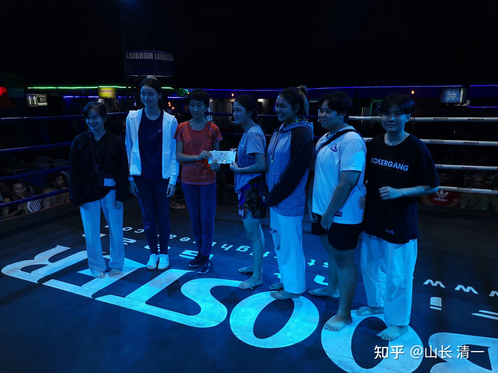

**提醒：本文价值万金。内容很深，很丰富，值得各位家长读10遍，20遍！**

这个世界很残酷：10%的人，拥有90%的机会。而剩下的90%的人，不得不去拼命获取10%的机会。

股市如此---10%的人，赚走了90%的利润！

企业也如此：头部的三家企业，赚走了90%的利润。甚至苹果手机一家企业，就赚走了该行业90%的利润。

教育行业也如此：国家排名前三的大学毕业生，往往占据了这个国家80%的高管位置。甚至更甚---一些国家就一所最顶尖的大学毕业生，占据了这个国家90%的高管位置。

因为爱女心切，不忍心我的孩子，要与90%的人，去拼10%的机会。我认为孩子太累了。所以我为孩子设计了一条轻松进入国家前三，甚至是国家第一的大学路径。供认为自己孩子，未必能轻松考上清北的家庭参考借鉴！

**1：怎样帮孩子规划一份最靠谱，最光明的人生和职业未来？**

**2：怎样才能考到SAT1500分以上，获得世界名校的入门资格证？**

**3：做人，做事，读书，你该怎样平衡三者之间的关系？**

**4：如果我家孩子就是想上清北，怎样的考读姿势更容易？家长如何帮助她考上清北？**

我认为：每一天，真关心孩子的父母，都要认真思考这些问题，拿出你的最佳实施方案。不然，可能百忙了20年，最终收获一个教育失败的孩子回家养起来。

这个世界很残酷

今天我就试着用小女的教育培养规划，来回答以上这几个问题。给各位有心人一个规划方案。让你们可以轻松就读世界名校，轻松考上北大清华！当然，你不信我的方案，你就自己折腾去好了。我也不会在意的。我女儿的方案，我已经认真执行了14年，还会认真执行下去的。

我相信：中国家长基本上没有这个观念：从小给孩子规划人生。

首先是多数家长根本就没有这个概念。别说人生职业规划，当然也没有教育规划。绝大多数的家长，只是一群盲目跟风的傻瓜，盲目跟随体制教育罢了。以为随大流就不会错。因此---最终出来的培养结果，让你大失所望也一点不奇怪。

我习惯规划未来。**作为家里最重要的资产----孩子，当然也要先做好“人生职业规划”，再做好相应配套的“教育规划”！**这其实并不难，难的是家长心中要有数。一些走一步，看一步，是短见识的家长。是做不到的。至于另外一些看不懂，听不见，光跟著大流走，连看路都不看一眼的人，就是最愚蠢的家长了。他们都把家里最大的财富，变成了未来的垃圾和家庭黑洞，把家庭带入深渊。

比如说：很多家长很迷惑，**我为啥要让小女去四个国家，读四个大学？学四个不同的专业？她要读这么多书干嘛？**其实，这个教育目标，就是为了实现我为她规划的“人生职业目标”而安排的“配套教育”。因为小女安排的人生规划，是将来要做我们家的“外交大使”，她不需要去给别人打工。因此，自然要按照我们家的未来需要量身定做教育体系了。

要当“外交大使”，自然是去大学，交一些有档次，有地位的朋友。这些人，肯定是每个国家第一流大学的学生。所以，她要去四个国家的四个顶尖大学，去与该国最顶尖的校友圈互动，交往。而不是去学啥专业的。也正因为如此，她每个大学，都去读一年也就够了。但她必须在这一年内，就要在学业上，和个性特色上，都成为该大学的“明星校友”，才有可能获得最大的人脉----毕竟**人脉，并不是有多少人认识你，而是有多少人喜欢你，尊重你！敬佩你！**

*小女昨日在清迈赛场上，与ELLA小公主一起发奖金给泰拳手---做送钱大使*

[附言：昨日晚上比赛， 小女与ELLA一起送参赛奖金给泰拳手。送钱当然受欢迎，但要送出荣誉和尊重来，让对方真心喜欢和尊重你，就很不容易了。语言，举止，态度，都要到位，这就是“会做人，会做事”的磨炼。她13岁春节，就去清迈大学与大学生交朋友，送礼物。14岁就开始给泰拳手发奖金。这些事情看起来简单，其实难度很大。因为要送出荣誉和尊重来，而不是送给乞丐。交往的话术也很重要---送钱的时候要送给对方荣誉和尊严。

小女考上大学后，要如何才能获得名校大学生的敬佩?显然成绩不好不行，但仅仅成绩好，依然是不行的。 因此，小女必须是才艺过人的学霸才行，言辞举止，行为态度，容色神气，本领特长，都得让人敬佩才行。这些技能，都不是读书读得出来的，都需要从小就培养。我让她在考上大学之前，就要拥有很好的才艺，还要令人喜欢的态度行为。才艺最好是学霸大学生们，都不太可能拥有的稀奇才艺-----比如---成为格斗世界冠军。这样---小女一进校，就会成为校友里面的明星人物。因为格斗拳手，一般都是穷人家的孩子，文化课成绩都很差，基本没有啥高级拳手有资格上顶尖名校的。一旦有人进入了名校，一定是大新闻，会成为大学的“名片，名流”，多少年都会被校友们记住的，因为你给大学增光添彩了。她还可以在大学就读期间，代表所在学校，去打一些高级的国际比赛，甚至有可能参加奥运会？这样校友们都会以她为荣的。老师们都会为拥有这样的学生而自豪的。而且----作为优秀运动员，常春藤大学都有特招名额。基本上小女可以不用太费劲，就能考入这些常人需要拼命，还未必能考上的顶尖大学。因此，她将来要上四个名牌大学当学霸，对她来说根本就当玩一样容易。因为基础不一样。

前提就是：小女18岁之前的读书成绩至少是中上，**个性，行为，人际关系，以及运动，格斗成绩必须是上上。**这样她就可以上顺利地在各国顶尖大学成为明星校友了。20-30年后，这些校友就是她最有力的伙伴和支持者。

各位家长说：难道父母可以不尊重的孩子的愿望，强迫一个小女孩去打实战格斗吗？逼孩子是没用的。父母的责任是要求，引导，关键是孩子接不接受，不接受就算了。不过，小女的职业理想，就是去当“职业拳手”。她不想给别人打工，不想去当机器人。她认为做拳手很自由。只需要一个月打一场比赛，上场十几分钟，就挣到了一个月的生活费。其余的时间，就可以自由自在的学习，读书，锻炼。不用去当996，007当知识工人。而是自己做自己的主人，多好！因此---小女每天练拳，还是很积极主动的，进步也很大，虽然现在正式练拳备战还不一年。她练累了，就去看书玩。这种习惯很好。 最近她在看【深夜加油站遇见苏格拉底】。还跟我讨论过一些情节。看这本书，她更神往去当职业拳手了，因为书中的老头，苏格拉底就是武功高手，也是哲学家，特别有思想。她想要长大后，去当一个“女苏格拉底”。最好去做教师，如果没机会，就做“自由职业”，多好的自我教育规划！

这里给家长们两个方案：

一个是读书，读书的最高目标，是考上顶尖名校，如中国的清北。美国的常春藤，成绩上，SAT拿到1500分以上的高分！

一个是教做人做事，教就有，不教就没有。你18岁之前应该教啥才符合你们家庭的利益？

家长们不思考的话，就只有一个选项：只会一门心思的傻读书。最终孩子18岁，大多数还是考不上名校。考不上没关系，关键是很多孩子成了废物，融入不进社会。这不就是一起步就输掉了人生吗？

比如：多少人家，做梦都想考上北大清华，上什么专业都无所谓。只要身份是北大清华毕业的，你在什么行业都有很好机会。不在乎你学的专业。

普通人怎么玩这游戏呢?当然是最笨，最花钱，最话精力的事情了。

家长从小买个最顶尖的学区房，送孩子小学，初中，高中，一路兢兢业业的拼搏，一路班级第一，年级第一，全校第一，全市第一，连续拼搏12年，差不多就有希望了。真考上了，家长欢天喜地。但这种孩子，大约除了傻傻的读书，啥都不会。成功了，是个傻傻的学霸，失败了（更多），是个家里的烦心事。您说，这种人生和教育规划，不就是找抽吗？

对我来说，小女如果想上北大清华，她根本就不用这么操心，她可以从小好好的玩，玩疯掉都行。她将来想上北大清华，最多花上一两年时间来备考就行了，一点也不用费事！

这真不是吹牛。只要你善于使用资源，实现这个目标，实在是太容易了。根本不用苦巴巴的准备应试很多年，就可以一路顺利，轻轻松松的考上北大，还成为北大专业学霸。而且，很可能同时得到其他世界名校的录取通知，想去哪里上都可以，选择范围特别广。还不耽误她当职业拳手的美梦，做家族友好使者的荣誉。

清北其实不是我们家的目标（我认为上老挝大学和朱拉隆功大学，对我们家来说价值高于清北），但我知道是大多数中国家长们的目标。我就假想她一定要去读清北好了，中国的第一名校，要为家族争光，该怎么办呢？我该怎样帮她设计清北之路？

方法很容易：就是现在啥应试准备都不做，天天练拳，做事，跟着我见见人，长长见识，读大量闲书。甚至根本就不用去任何学校上学，就在家里跟我一起混，连中小学文凭都不要，甚至今日三语国际学校也不去读，不用像示范班一样刻苦学习。大约等她17岁的时候，去拿一个GED美国高中文凭证书。凭此证书，再加上一个SAT成绩超过1100分（几乎不用准备都可以通过的成绩），或者一个雅思6.0以上的分数（对新教育学生来说，简直不要太容易，14岁就可以考出这个成绩来了）。然后----她就可以直接去泰国最高学府，朱拉隆功大学上学了。她就读一个泰语专业怎么样？不上课，她都可以是学霸。因为她的泰语，几乎跟泰国人的母语一样地道，泰国人都以为她就是本国人士。然后剩下的时间，用来练拳，在泰国打拳，拿到泰国的全国冠军，并代表大学参加一些格斗赛事，拿到一些世界冠军的头衔。课余时间，继续读一些闲书，反正小女就是喜欢读书当做娱乐。可以非常快乐，非常悠闲的读完四年大学。毕业后----她去考北大泰语系的研究生。您说：她居然会考不上吗？才怪！

你说：国内存在“本科歧视”，不是北大的本科专业，上北大读研究生，也会被就业单位歧视的。不如本科就在北大的学生更牛。

我承认您说得对。不过---问题就是----您学的是泰语专业。您总不能说：北大的泰语专业，比朱拉隆功大学的泰语专业更牛吧？别人才是该语种的母国最牛大学，泰语水平国际考试的中心。从朱拉毕业，来读北大的泰语研究生，这是“向下兼容”，而不是“向上高攀”，这多容易被接受呀？就如同西班牙顶尖大学毕业，去北大西语系读研究生，一样是向下兼容，一样是“根红苗壮”，专业背景特别扎实的体现。还有啥专业歧视？

您说：这不是多浪费了几年时间吗？不是读了两个大学吗？

问题是：很多学生为了考上北大，不断高中复读。朱拉再不济也总比你的高中复读班牛吧？你读北大，直接拿了两个很牛的大学学位（泰语朱拉本科肯定牛，北大硕士中国肯定牛）？你亏啥呢？

如果你想省点时间，早点读完大学出来打工，我还可以帮你出主意，额外多赚两年时间回来。因为GED考试，16岁就可以考了，你就直接用GED美高证书去考读朱拉，等于就可以提前上大学了。然后你20岁去读北大研究生，不就更牛了吗？想要文凭，就找到拿到文凭最容易的方式，而不是拿孩子的生命去慢慢墨迹。

你还是不服：我就是不喜欢泰语。泰语就是没档次----这个当然没问题。我因为在泰国生活，认为泰语很重要。你不想学泰语，还可以学其他语言，任何语种都很好学--在新教育里面。英语研究生也行呀?只是竞争会激烈得多了，而且出路也会更少一些（因为几乎所有人都是这样想的）。我举例泰语，只是它的比较优势最明显，最突出罢了。你想更辛苦一些，更卷一些，我也不反对。

**如果中国的第一名校，都可以如此简单的“套路”去得到，想要上别的海外大学，肯定就更容易了。**

因此：聪明的家长，真想要儿女有出息，其实不是往死里整孩子，每天家长陪读，苦苦的学到半夜，使劲“鸡娃”，身体都读坏了。而是家长要努力提高自己的眼界，视界，找到真能帮助孩子的最佳方式。我的方式，就是带孩子像玩一样学习，最终还能考上世界名校，读不读还在我想不想。而不是能不能。

当然，我认为我家小女上北大，实在没啥意思。我们家不想在国内发展（看现在YQ防控成了啥样？一点对人的基本尊重都没有）。因此不太会真的执行以上方案。我的方式是：四年读完四个国家的顶尖大学，有没有毕业文凭无所谓，有校友资格就够了。中途辍学也没啥。因为我只要校友的人脉，不要苦巴巴的用四年生命，来拿一纸文凭回家供着。你家更喜欢要文凭，因为要找工作非要不可，你就多花几年，拿个文凭好了。

所以，对照起来就是：

**1：同样上名校，你希望用传统的体制思维**，从小努力学习，补课，熬夜，奋斗12年，考上名校呢？还要冒着成功率地的危险，去慢慢走这条“大家都走的路”？【最低效，成功率最低的路径选择】

**2：还是家长更聪明一点，选择用新教育的方式，帮孩子走捷径更好？**而且----更划算的是，你甚至不需要出高额的私立学校的学费，你只需要跟随我们的示范班课程，在家跟随模仿就可以了。一分钱学费都不花。你努力跟随个三到五年，就可以实现你的考世界名校的教育目标了。

[这就是今日学堂的个人空间-这就是今日学堂个人主页-哔哩哔哩视频](http://link.zhihu.com/?target=https%3A//space.bilibili.com/487498588)

3：至于我们家的小孩教育规划路径，需要你在3-4岁就安排好语言突破，9-10岁就成为三语达人，然后集中精力学做事做人，有空在家读各种闲书。这条路是最佳通道。但我没法分享给你们。也不敢这样做（因为几乎没人看得懂）。所以，你们跟随从11岁就开始学习的示范班，才是正解！这种培养方式，会多一群学霸，至于做人做事？就勉强合格就行，起码比体制学校强吧？我们学堂还尽量多教一点做人做事的东西。但别指望能够赶上小女这种轻松愉快的超越模式了。用以上第2种方式来学习示范班，就足够可以轻松考上清北了。示范班**相比小女的培养方案，就是少了一点做人做事的教育而已。**反正你们也不要这些东西！

另外，我家孩子不学理工科，因为她不需要去社会上做打工女。所以我的方案，只是采用完全的素质教育，而不是知识教育，不理睬工具化教育。我们还采用了新教育最大的优势：去发掘全世界最不知道该怎么教，而新教育最擅长的外国语专业教学潜力，来作为世界名校的突破点。同时获得沟通技能和学霸的地位。

但这条思路，并不是只适合文科，更不是只能用于语言专业。任何大学专业，你都可以实现的。你要去读理工科世界名校，也可以一样轻松考上的。甚至可以读比清华北大排名更高的世界名校，跟随示范班，比用你们熟悉的传统方式，死拼硬攻，卷死孩子的价值更高，效率也更佳。只要孩子愿意认真学习，不用太刻苦（当然也不能偷懒），只要正常学习，就能考上世界一流名校了。

以上文字，是解读了文章开头的第一个问题，和第四个问题。现在我们开始解读第二个问题！

**2：怎样让学生考到SAT1500分以上，获得世界名校的入门资格证？**

**方案一：**如果采用传统的国际学校模式，在孩子没有学废掉，不辍学，一直努力学习等情况下（其实家长知道，已经很不容易了），经过12年的国际学校高投入，低回报的学习后，您能够取得的孩子的平均成绩，是SAT1100分左右。家长不要总以为你孩子是超人。用SAT的平均成绩来做国际学校的标准成绩，就是你投资得到的正常回报。当然你孩子乖一些，努力一些，也可以考到1400或者1500分，不太轻松地努力12年，入读世界知名大学。但这些往往是“别人家的孩子”，都是学校的少数学霸，往往不是你家的孩子。就别幻想了。

方案2：如果您读的是新教育，跟随示范班，成功率就大大提高了。大致上:经过【三年学完十二年】的系统，精细的学习，新教育的学生，就可以仅仅用三年的学习时间，就跨越国际学校12年的学习进程，并取得超过英美平均成绩的水平。这就是示范班正在做的尝试，具体的平均分是多少?现在还不知道。因为本学期刚开始冲刺第三年的任务。还需要半年多的时间，才能获得正式的成绩，但我的个人预估，应该这个班的平均成绩，是在SAT1200分左右。

这个分数虽然高于国际学校的平均分，但实话实说，不是太理想，想上世界名校有点难。但是----已经可以入读美国前100名的大学了，各位去查查美国前100大学的最低录取分数线，就是在1250分左右。入读世界排名前00名的大学，也完全没有问题（朱拉隆功的QS世界大学排名是220名，录取分数SAT1100分就够进去了）

但家长对美国前100名的兴趣也不大，要求更高。很多家长希望自家孩子能够考上世界前50名的大学。这样的话，你就还必须继续提高成绩，达到1400分左右，才有希望入读。大概示范班的学生，在完成【三年学完十二年】的任务后，再努力的多学一年，做好应试的话。第四年学完，就可以实现这个目标了。学好这个目标，就超越了90%的美国和世界竞争者。对我们示范班来说，取得这个成绩，也是不是太难。两年后成绩出来，就知道我说的真假了。

如果家长更贪心，更鸡娃，非要求自家孩子要考到1500分以上，这样才有机会入读世界前20名的大学。甚至家长希望更高一些标准，达到1550分以上，能够入读世界前10名的大学。这能否实现呢？大概---示范班的学生，就需要学完四年，获得了1400分的水平。之后考入三语高中，再继续强化学习，坚持学三年“高级重复”课程，还要加上一些AP课程等。总共用7-8年的时候，来冲刺走这条路。最终大约不到一半的学生，是可以实现这个目标的。孩子从11岁读突破班，拼到17-18岁，新教育也只有极少数学生能实现这个目标，还特别累人。其他的多数学生，就算是再多学几年，超过18岁，恐怕也达不到这个目标。这在美国本土，也只有1%不到的优等生，能够实现这个分数。 这种人，是天赋和勤奋两者都非常强，差不多得是天才学生，才有可能实现这种目标！你们想投机取巧？就没门了！小女的基础这么好，我判断都是做不到的，要实现也更勉强，还会让她读得苦死，读到厌学的（**当然我们也不想去做，怕这样读下来变书呆子了。别高分没拿到，人还教废掉了，得不偿失！**）

就算你运气超级好，真的完成了这个任务，考过了1500分，能够上世界名校了。但这孩子也只有一门英语很强的专业能力，他未来的职场人生还很艰难，他还必须跟全世界的优秀学生们，去竞争毕业后难得的高级职位。因为全世界的学生，都在定制这些完全相同的目标，大家都是聪明人，谁也不傻。彼此竞争卷得很厉害。所以---家长如果选了这条路，非要一条路走到黑，我觉得这孩子好可怜！这是下策。本质上是跟风。中国高考是跟风，你这样追求考SAT奔着满分而去，也是国际高考跟风。累死你还没好结果。

优等生去英美上学，都卷死你，成功了都是惨胜。而学习习惯不好，国内都是差生的孩子，**家长送去英美国家上学，想要装啥高大上的门面，就是花大钱找抽了。**基本上送羊入虎口，是花大钱培养留学垃圾的道路！但中国家长似乎认为这是最光明的道路---因为这样说起来，在亲朋面前特别有面子！哪里像我这么傻---居然高高兴兴的让孩子在泰国读大学？亲朋会认为我的女儿是不是学渣？怎么不去欧美上学？我只是不想找抽罢了。她绝对有能力考上世界前50名的大学，但我不想她出去浪费生命。

但我们会尊重家长的选择，如果我们的家长，真的要选择中国人“走自己的路，让别人无路可走”的强卷精神，就是要在SAT成绩上冲刺到底，取得最高成就，去英美名校上学，我们会配合家长的。就一直卷到底好了。示范班如果家长要求孩子出绝对成绩，我们就会一直把SAT的考试预备学习，延长到18岁，肯定将创造全世界的集体SAT高分，最佳成绩记录。取得惊人的教育记录。

如果家长心疼孩子，不想这么卷，我会建议家长：15岁考出1400分就够了，不要再卷了。孩子已经努力了学四年的英语，已经超过90%的美国学生了。剩下来的时间，多学一个第二外语，成为三语人。多学一点人情世故，了解社会，了解人性，起码学一点两性关系。将来可以把你的人生职场空间，扩展到更加广阔的世界去，做一个更充实的人，而不是只会做机器。至于家长想学的第三外语是什么？是不是一定要学泰语？这个就不是我的事情了，家长们可以自己选，我们什么语言都可以教。家长喜欢去什么世界发展，就学什么语言。第三语言是根据家长认为最好的职业发展空间来选择的。当然---**家长如果觉得有面子的话，似乎学法语和拉丁语，比学泰语和西语更有面子，国外高阶家庭都这样设计的。**会不会更容易找一份好工作，就不知道。但用来装门面，装贵族，看起来更有素质，的确要有档次得多！美国优等生也会这样选的。还可以选意大利语---歌剧的语言。只是真不知道中国企业在意大利是否有职员需求。学法语，装13很好，但在法国找工作很不易。但非洲少数讲法语的国家还是有机会的。是不是机会比泰国更好？生活更舒服？我就不知道了！

**3：做人，做事，读书，你该怎样平衡三者关系？**

我的孩子，是【1400分万岁】党，超过90%的英美学生就是胜利，不追求超越99%的学生，不用卷到1500分。而且她18岁才去考SAT，不是14-15岁去考，这样她的应试准备时间会更少，效率会更高。现在她会使用英语就成。我们根本就不关心考试的事情。为啥：我认为她的童年时光，现在应该学更重要的东西，而不是只是学英语，学考试。学一堆科学课程根本就没意思。学会做人做事会更重要---虽然这些内容不考试！但生活中，每天，甚至每时每刻，都在考验她做人做事的能力，怎么能不学呢？

今日三校，是新教育最顶尖的学堂。家长们的最高愿望，就是孩子要努力考入今日三校学习。每年高标准的入学考试，淘汰了大量的申请者。其中最亮眼的班级，是今日示范班。最有素质的班级，是公主班。我的女儿，正好是这个年龄段的。按道理，我应该把她送进示范班和公主班学习。但为啥没有？她为何缺席？

今日的老家长们都知道，过去四年多，小女才9-10岁，就已经在今日学堂的明珠班打好了外语基础，已经把英语学到“超母语水平”，还实现了“泰语初通”，成为三语生之后，我就把孩子接回家了，不在学堂继续上学了，一直是我在家自己教小女。直到现在公主班集体来到泰国，她才跟随这个为她成立的班级，一起学习。之前公主班在国内，也一样卷考试--她们用三年时间，不仅仅学了泰语，也学了英语，成绩优秀，都过关了，才能来泰国“放羊”。但公主班来泰国之后，其实是“不上课”的状态。因为公主班的目标，是要去考泰国顶尖名校朱拉。她们现在的学业成绩，就已经达到（其实是远远超过了朱拉的入学要求），因此大家全都“躺平”了。不再去准备应试的内容。小女现在回班，跟随公主班在一起，重点不是读书，而是做事做人。每天核心就是两件事情：训练太极武术，准备两三年后上擂台征泰。其余的时间，大家做事，游戏，阅读各种散书，以及上我的电影课，聊天课等等，看起来“很不正经”的样子。这里的公主班学习，特别不像一个学校。弄得一些家长都不放心，认为孩子不学习不考试将来会怎样？但孩子们倒是很开心，也非常的认真。觉得比在国内好多了。还学到了很多有价值的东西。她们都很羡慕一直跟随小女在一起学习私家课程的艾拉小公主，觉得这几年，她们跟着我学了很多她们没有机会去学的东西，人会非常成熟，比她们在国内傻傻的学了三年知识课程好多了（小艾拉是三年多前，来了清迈就不走了，一直跟小女一起呆到现在）。

为啥我自己都不送孩子去今日学堂（当然就更不会去体制学校，国际学校），学各种“正规知识课程”。不去考SAT，不学习A LEVEL，不考雅思，而是成天让她在家“瞎混”？（孩子妈妈的话---几年前，看我带孩子不务正业，说我干嘛不送女儿回国去公主班上学，而是在家瞎混？）

因为：这些体制的东西，知识课程内容，其实很容易学。年龄越大，越容易学。现在她小时候，学得苦巴巴的内容，老师怎么讲，她都难以理解的内容，到了她18岁后，就变得超级的容易，随便看看就懂了。我干嘛傻到要在她不擅长的年龄，使劲去啃这些其实没啥价值的知识和学科内容？

等小女到了18岁，认真学一年，比你的孩子从小一步一步的赶着鸭子上架，效果会好得多，成绩也会突出得多**。现在去学校慢慢学，从1年级到12年级老老实实的走流程，是天下第一大傻子！**把孩子全耽误了。

那么：我的孩子现在学什么最好？**什么才是16岁，18岁之前最重要的内容？什么是16岁之前没学好，以后就很难学的内容？必须在16岁之前抓紧学好？不能耽误的课程？**

我认为有三个内容，是小时候很容易教，很容易学，但长大了才开始学的话，就是教不会，也学不会的内容。

**第一个小孩子的重点学习内容，就是外语。**大家都容易理解这一点：外语从小学，效果更好。高中部招过一批超过15岁的学生（天使班），他们学外语，一年一部电影都学不好。但11岁的小孩子，来今日一年就可以学完7部电影，熟练度还远远超过天使班，这差距有多大？体制内的学校就更差了， 根本不会教外语，教的内容也很少。反而小学初中高中，都是语文数学等学科内容特别多（中国教科书的语文。根本就不是语文，而是咬文爵字。更像是“文字研究和政治课”的统一）。数理化生物地理，全是一堆一堆的知识，根本没必要在这么小的时候学。相反---外语，语言能力，一定要学会，从小学，最好幼儿园时期就开始，更容易学得地道，变成母语一样的水平（当然家长要懂学习的方法）。

因此，我在小女3岁半，就让她提前去今日学堂上学，班级是采用全英文环境，认真的泡了几年美语。孩子9岁多，来清迈去上过很短的国际学校，居然被美国小孩认为她是“我们美国人”。她还学了一年多的泰语，来泰国基本能适应。小孩子9岁就成为三语达人。因此，她教育设计中，考名校最重要的外语关，就轻松越过。你问她咋学的，她都不知道。这就是不知不觉当学霸！

当然，她的这种教育方式，缺点也有：就是她除了会一点汉语的生活词汇外，汉语的能力极差，会说话，但根本就不会认字。她去书店看书，只看英语书，不看汉语书。跟国外长大的孩子一个样。为了让她拥有正常的汉语水平，我自然不能送她去学堂，跟随其他学生一起学英语了。因为其他学生来今日，是为了学外语，孩子们的汉语都已经基本过关。她去班上跟着学啥？因此9岁以后，小女就是跟我在家学习了。重点内容，就是学习好汉语。在我独特的方式下，半年就过了认字关。两年后，就成了阅读达人，到哪里都喜欢捧着一本书。而且---她现在更爱看汉语书，而不是英语书。这个阅读深化过程，已经持续四年了，我将维持下去，让她好好的用阅读，讨论等来学汉语，学表达，学汉语思维。以及学习用汉语演讲和辩论等等。毕竟她是中国人，汉语才是她最重要的语言。这个课程太重要了，因此她将一直要跟我学到17-18岁，这就是汉语除了会听说读写之后更高的“学术汉语，思维汉语，文化汉语”提升，相当于中文系的大学高级课程了。真学完了，她的汉语应用能力已经超过中文系的大学生了。这时候，她才需要重新把重点，回到强化英语和泰语的学习提高上面来。开始用这两种她从小就已经熟练掌握的语言，进行“学术化外语能力的提升”。未来小女的大学，主要是上国外的顶尖大学。大多数是英语课程内容。她的学术英语能力，在这个去海外上大学过程中，自动会达到很高的地步，成为文化英语的掌握者。就算是中国的外国语大学专业，很多人一辈子都没有达到的水平---一般只有在国外大学上学多年，才能获得这种能力。毕竟喜欢阅读的她，上大学肯定是她大量阅读各种外语材料的时间。18岁前读中文书，18岁后读外语书。22岁读完大学回来，就跟我继续学用中文，这一回，该开始读古文了。

这就是我为小女设计的，16岁之前的培养思路，以及18岁之后的规划---重点不是啥科学，啥物理化学数学等，而是----三语学习，以及思维，应对等的学习，重于一切学科的学习。17-18岁，再来学你们认为重要的学科，应付考试的需要，此时，她一年就可以学完12年的所有知识课程，成绩还会很好。

**2：16岁之前最最重要的学习内容---做人和做事！**

现在的孩子，大学毕业之后，无论多高的学历。有两点特别的惹人烦。

**第一是不会做人。要么是傻乎乎的书呆子。**要么是自以为是的小皇帝小公主，熊孩子。很多孩子，没法与人正常的交往。甚至---这些孩子长大连谈恋爱都不会。根本不会与人相处。家长要着急帮忙，到处帮着相亲。这是多大的笑话？而且---现代的孩子很多人还特别单纯，除了读书啥也不知道，特别容易上当受骗。一个个的社交小白。为何会这样子？因为现在的教育里面，缺了一种非常重要的教育，就是从小教孩子做人的教育。从小教孩子会做人，懂人，理解人，让人喜欢，有人尊重，比教她会读书，要重要十倍。可惜：国人都去追逐不值钱的知识。而把重中之重：做人的能力丢了。身边见过很多老板，自己很会做人。但家里的小孩，带出来实在是令人讨厌。家长还不自知。还以为花钱送到国际学校， 学了一点洋课程和洋知识，就了不起，就有面子了。我认为这些家长，将来就是要找抽的。

所以，小女从小最重要的课程，就是教她做人，天天让她要让人喜欢，让人尊重，会说话，会解决冲突。会理解人，会看事。这些东西，去学校里面，真教不了。所以，现在小女就在我身边， 就天天跟我学这些东西。本学期公主班来到泰国，她很快成为这些小公主们的朋友，大家都很喜欢她。她也常常很早就离家，很晚才回家，成天都在忙。我都难得见到她。这种融合能力，我认为比考啥SAT强多了。

第二是做事的能力。从小就要求孩子做事，各种事情。这一点，也是中国小孩非常缺乏的教育，长大后的孩子，很多是不会做事的，连家务都料理不好。而小女虽然才14岁，已经在泰国去当过售货员，洗过碗，砍草，砍柴火，煮饭烧菜，洗衣扫地清洗鱼池，做各种泡菜，还做生意，卖水果，卖蜂蜜，赚了钱拿来买股票。她还要去工地干活，开过拖拉机，也会开汽车（自己偷偷学会的），啥都能。现在公主班学生，最喜欢吃的一种下饭的辣椒酱，就是小女创造配制出来的，比老干妈更受欢迎，小公主们叫“明慧酱”。这孩子，现在直接走出家门，完全可以好好的过下去，完全独立生活。不用担心她赚不到钱。管理不好自己生活的。这就是她基本上完成了“做事教育”。我不担心她上大学会弄得生活一塌糊涂了。

**做事，做人，就是从小必须教的最重要的课程。长大了教不了啦。**

因为：各种科学课程，专业课程，人长大了，想要补课学习很容易。只要这人小时候的学习习惯好，爱阅读，要学会这些东西，是一点也没问题的。任何课程，她都能学会。

但是，做事，做人的课程，想要长大了再回头来补课，难于登天。我的庄园里面，就有两位博士。读书读的很好，但教他们做人做事，就卡壳了。特别是做人，他们就是没法理解人。-----小孩子都认为很简单的事情，教很多次就是不会。比教小孩子认人，识人，学会良好的应对，要难100倍。因为他们从小的教育，就是要好好读书。结果长大了，失去了小时候自然的观察人心的学习敏感期，跟人打交道的很多东西都不会。才知道人生最重要的课程是什么。现在辞职，跟我身边学做人做事，看他们很认真的学习，但效果比小孩子差太远了。各位看小佳慧才17岁，跟老拳师，泰国姐姐们打交道，非常的讨喜。但两位博士，怎么学都做不到这水平。

所以：这就是我为小女安排的教育规划。**你们不学的，看不起的人生基础课程，对小女是重点课程（家长语录：孩子你啥事情都别干，我来！你只要好好读书就好）。**你们看重的课程，啥SAT。A LEVER,以及AP课程，我都康不上。不着急，慢慢学。到了18岁，你学的东西，我一样都不少。但我学到的东西，你将来一辈子也追不上。这才是教育的重点！

小时候，该学的一定要学，做人做事，才是重中之重。等长大了，这门课是补不上的！其实到了14-15岁，不会做人，不会做事的缺点，就开始暴露。严重一点的人，成绩大幅下降，自闭封锁或者疯玩游戏，就是不能正常跟人打交道，也不好好学习（**说实话，脑子正常一点的学生，有谁会喜欢体制学校的教材内容和学习方式？**）。家长原来小时候强迫学习的一套全部无效。孩子变得特别的不懂事，很难相处。他自己都没法与自己相处。会变得很怪异，追星，追游戏等等。从小没有教育好的恶果，会让家长吃一辈子的亏。您还敢把学科教育，知识教育，放在第一位吗？我是教育世家，父母就是特级教师，我自己当了30多年的教师，见过太多各种各样的学生了。家长没见过多少样本，总以为自家孩子就是例外，就是天生赢家。这样我就没法说了！

当然，我说是说**---你想怎么安排你自家孩子的未来人生和职业，怎样进行配套的教育呢？**这就是您自己的权利和自由了。作为家长，你尽到了你的责任没有？用心帮助孩子没有？还是你只是把孩子交给一个虚浮的体制，打着学校的名义，其实只是一群吃皇粮的“打工干部”，在开动的一条知识灌输的流水线上机械地工作。猛往你孩子大脑中强行塞进去很多根本就不管用的知识。而把人生最重要的做人，做事的本事全丢了。当有一天，你发现你孩子被人教成了孔乙己，您甘心不？

到时候再后悔，已经晚了！