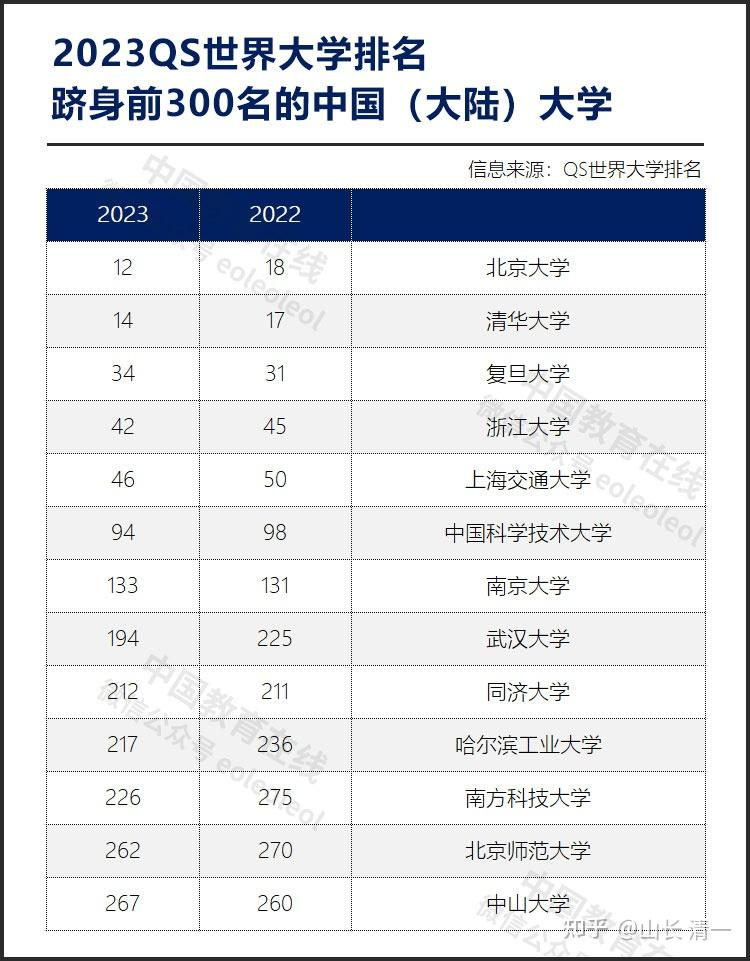
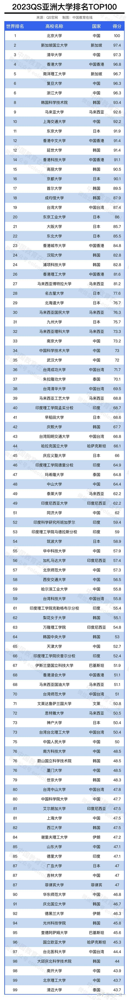
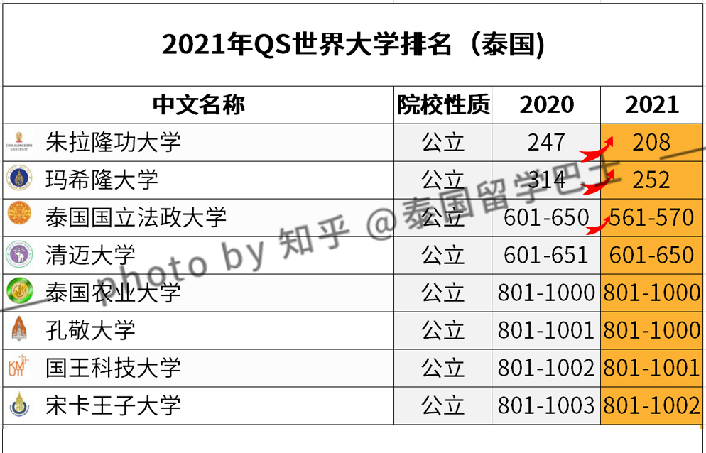

千万别相信教育是用来提高“全民素质的工具”。如果是这样，为啥很多菲律宾的大学生，毕业后依然只能做菲佣？只是---大学毕业，她们的外语不错，可以出国去做菲佣。不用在国内做家务罢了。

教育是用来分层的。用来决定在社会上，你将拥有什么样的社会地位，你能去什么级别的城市，以及你能过什么样的生活，以及拥有什么样的伴侣。

最关键的“人生等级证书”，是18岁的时候，你考上什么等级的大学。这个等级证书，会跟随你一辈子。有些人，就算是赚了大钱，当上了大老板，但没上过好大学，人生也因此会留下遗憾。因为公认的社会等级就是不够。

中国每年有1000万人可以考上大学，录取率在考生的95%以上。但你别以为考上大学，就自动有档次了？这个录取率，只是证明大学文凭已经烂大街了，很多大学生混的还不如民工，已经是现实的结果。

社会并不是以你**“是否考上大学”**来区分你的人生等级的。而是以你能考取什么级别的大学，来评价你一生等级的。因此---大多数的大学，读不读都一样。读出来，也未必比民工更高级，毕业即失业，只能去当外卖员的“大学生”也不少。

**超一流人才：**在中国，18岁如果考上了“清北复交”，你就是超一流人才，你将拥有这个国家最好，也最多的发展机会。韩国三大名校毕业生，只有同龄人口的1%，却占据了全国高管80%的职位。剩下99%的同龄人，只能去竞争20%的高管职位。这个比例，是否说明了“等级差异”带来的竞争优势？

**第一等人：**中国学生如果考上了985大学，你就是“一等公民”。你将拥有中国最多的机会---包括出国留学和工作，职场发展的机会。这种“一等公民”，只有不到1%的学生才有机会得到！也就是说：中国的985等级证书，证明了你是属于战胜了99%平庸大众的顶尖1%优胜者。

**第二等人：**如果你只是拿到了211大学的录取通知书，你就是“二等公民”。这是中国两千所大学中选出来的最顶尖的115所大学。你考上了211大学，你等于战胜了这个国家95%的同龄人。你就等于是这个国家的二等公民。因为第一流的企业，薪资最高，地位最显赫的企业，他们只会去985大学校招。如果你被标记为“二等货色”，无论你上学后如何努力上进，你也将失去人生中一些最宝贵的机会，或者是你根本就没有机会进入高端阶级！但你进入211，也等于拿到了“中级人才”的标记。可以做一些中等档次的职位。

**第三等人：**如果你只是考上了【一本大学】，大致证明你的档次是同龄人的TOP20%的水平，说明你是三等公民。（2019年高考一本录取率当中一本招生比例达到24%左右，最低的省份也达到12%左右的水准）。一本高校的数量，大约是在400——500所之间。每年1000万考生，只有200万左右可以拿到一本的通知书。你就知道----这个含金量有多高了---你必须与200万人去竞争社会提供的有限职位。

不入流的等外人：二本，三本就不多说了。这些大学的证书，你拿出来，只能证明你是80%的平庸大众。你只配去和80%的大众，争取这个社会剩下来的20%甚至2%的职位。

你是否发现了一个基本的道理：**18岁之前不努力的话，你的一生，连努力的机会都没有！“低等级，不入流”的标志，将伴随你的一生。有极少数的人获得了逆袭的机会，但这就像是灰姑娘的故事一样，只是励志罢了。真实世界里面，嫁给王子的正常概率是公主，而不是平民，大众！**

不仅仅中国是如此，其实全世界都一样，马太效应全球通用：

只有你拿到了世界顶尖的文凭，你才能获得世界最多的机会。比如------全世界顶尖的企业欢迎你入职，全世界顶尖的国家和城市都欢迎你移民和入籍！当然---一贯骄傲美女帅哥，也更愿意与你谈恋爱，与你成家！如果你的级别不够，你就只能远望。或者学大妈，在电视剧里面追梦。

世界的“985大学”，顶级人才的标志，是什么大学呢？

就是世界排名前100名的大学。由于全世界有三个权威大学排名榜单，所以总大学数量，大约在130所以上吧！

一些冷傲的高级城市，比如香港，新加坡，只欢迎有钱和有才的人进入。普罗大众，欢迎你来旅游花钱，但---他们绝不给你留下的机会。这些城市和国家，也欢迎有钱人，但资本移民的门槛，都是几千万。但：只要你拿到世界前100名大学的毕业证去敲门，作为“高端人才”资格，你一分钱都不用，几天时间就给你批下来入籍资格。也就是说：你拥有世界TOP100的证书，含金量相当于数千万！是不是你的等级标志？

[香港推出高端人才入籍签证；留学生上海直接拿户口](http://link.zhihu.com/?target=https%3A//mp.weixin.qq.com/s%3F__biz%3DMzA4ODg0MzIyMw%3D%3D%26mid%3D2653245162%26idx%3D1%26sn%3Df8be6ad5f2b4438f3955969f894fa3a3%26chksm%3D8bf21852bc8591440a54b53b0baeef10f231aaf22bf842f5f707a88e6398d46f3db1cba90401%26mpshare%3D1%26scene%3D23%26srcid%3D0113oguqn5jCfRddAiF5FC4I%26sharer_sharetime%3D1673591808466%26sharer_shareid%3D135a2331654752b534d73b4b08b49182%2523rd)

不仅仅香港欢迎你，比香港更有优势的新加坡也欢迎这种人才。----全世界都会热情的欢迎你，拥抱你。只要你有这个等级，愿意去工作，要获得良好的职场机会很容易。

所以---教育当然能够改变命运了----只是你，必须要用顶尖名校的入学资格证明，来证明了自己就是“世界顶尖人才”。而TOP大学的证书，就是你这个身份的证明。世界TOP100大学的排名，远远高于中国985大学的等级。因为-----中国985大学有38所，但能够进入世界TOP300的大学，中国只有13所。所以，一旦你考入了世界前100大学，妥妥的就是世界顶尖人才了，走到世界各国，都非常受欢迎！

那么：有世界985，是否还有【世界211大学】呢？有可能世界TOP300，就相当于中国211吧？其实----真实国际地位要远远高于中国211，甚至高于中国985大学。

世界大学排名总共有1000所大学，中国接近一千多所大学，只有71所大学进入这个世界大学榜单。大致上，世界前1000名的排名，弱于中国985 （38所），强于中国211大学（120所左右）！

如你的外语很好的话，考世界985，要比考高考，进入中国985难度要低得多！这就是聪明人的机会！

如果你的目标只是世界1000名？相当于中国211？就简单得不要太容易。用我的说法：只要不是白痴，认真学几年，就能考上世界1000名。你就轻松地超过了中国211大学的档次。

亚洲大学排名榜，总共收录760所大学。其中中国大学上榜128所。大致上，这个榜单在世界上的地位，相当于中国的211大学档次！

如果这个世界大学榜单上没有的大学，我的建议很简单：千万别去读。你就是白花钱的主！读了，也只能证明你没档次！

我建议：如果你想上大学，想拿到自己顶尖人才的证书，就只选择世界前100名大学，至少是亚洲前100名大学。这样的身份锁定，会让你人生更顺利。除非你想自讨没趣，花钱买个寂寞。否则，还是老老实实的18岁去考一个自己想读的大学吧！我看泰国进入亚洲前100的大学，只有三所。因此---除了这三所大学，其他泰国大学都不值得读！

干嘛苦巴巴的去追逐中国高考，与1000万卷王死拼级别呢？换个思维，你就可以轻轻松松的获得成功！

如果你只要就是想在亚洲地区上学的话，亚洲大学TOP100大学排名榜相当于亚洲985。虽然这个榜单中，很多大学是也是世界前300名的大学！

建议各位：将来你和你的孩子，锁定这个榜单，在你人生18岁的时候，拿到“世界一等人才”的证书，获取上流社会的入门证。这才不浪费你的人生与青春。你可以上了大学不读完，自由发展。就像高晓松考上清华又退学一样。但---当年的清华身份，至少别人有了人生“谦虚，低调”的资本---可以大气滴说“文凭不重要”。但你考不起好大学，你说文凭不重要，就是一股酸味了！

附录：泰国进入世界大学排名的只有这8所大学！（相当于泰国的本土985吧？）

