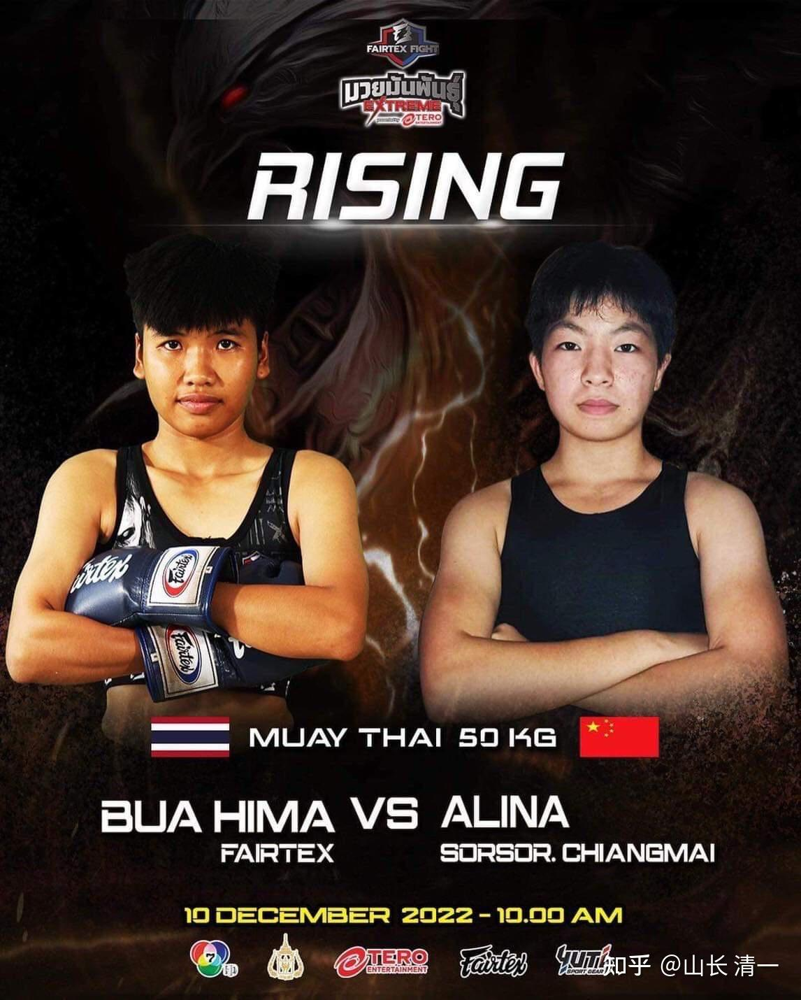
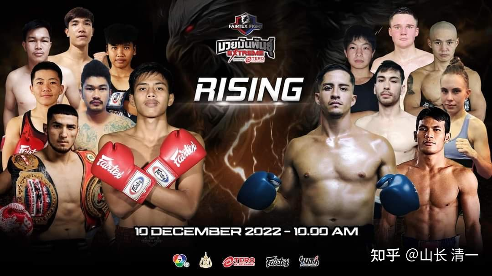
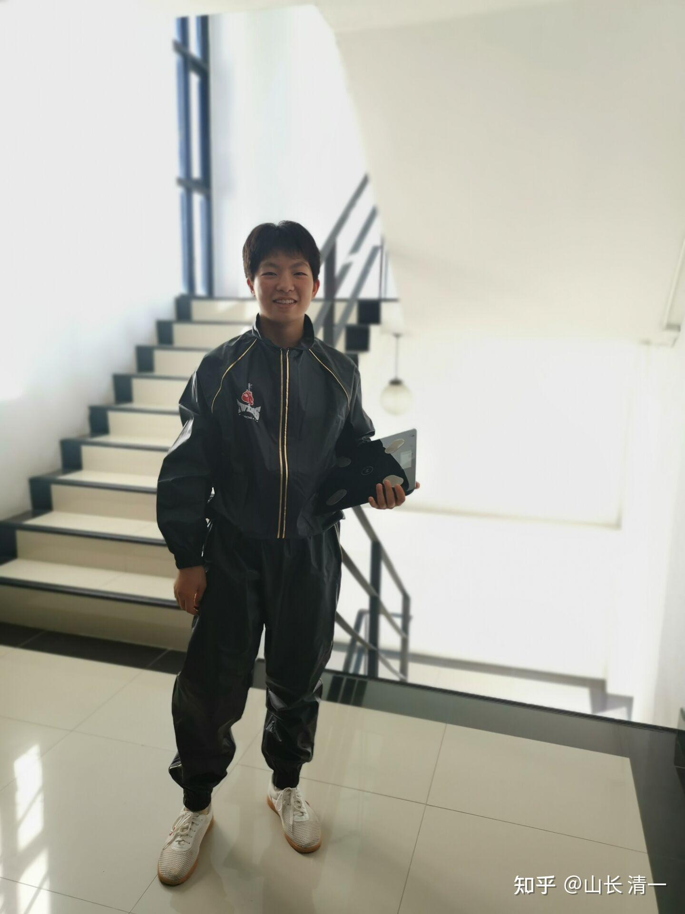
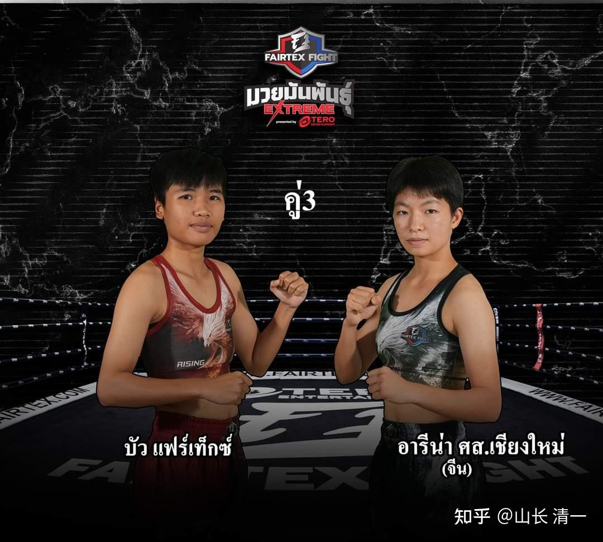
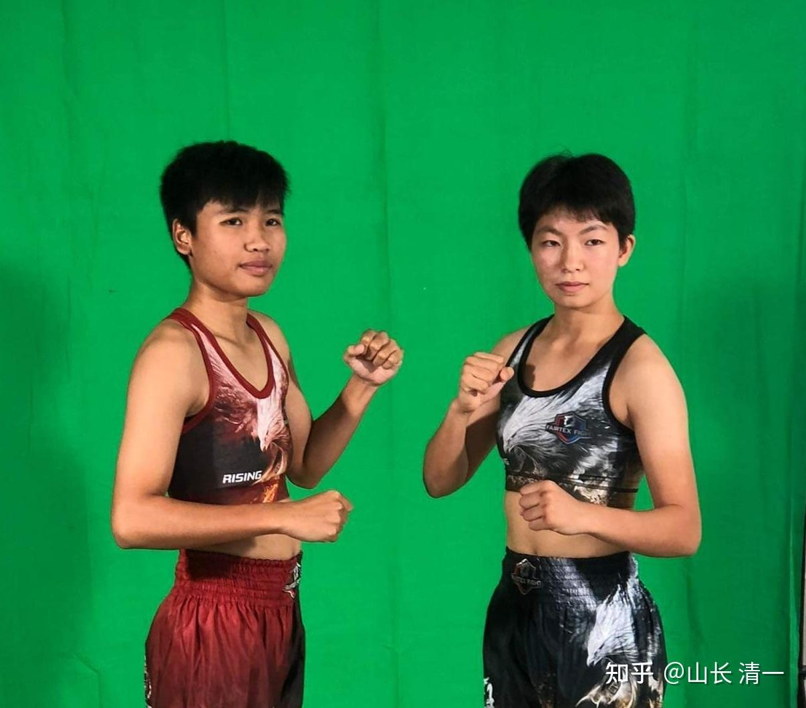
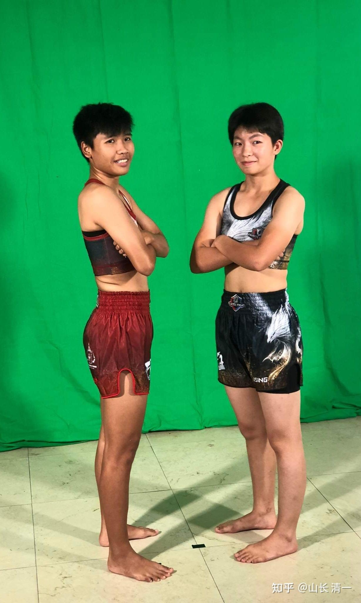
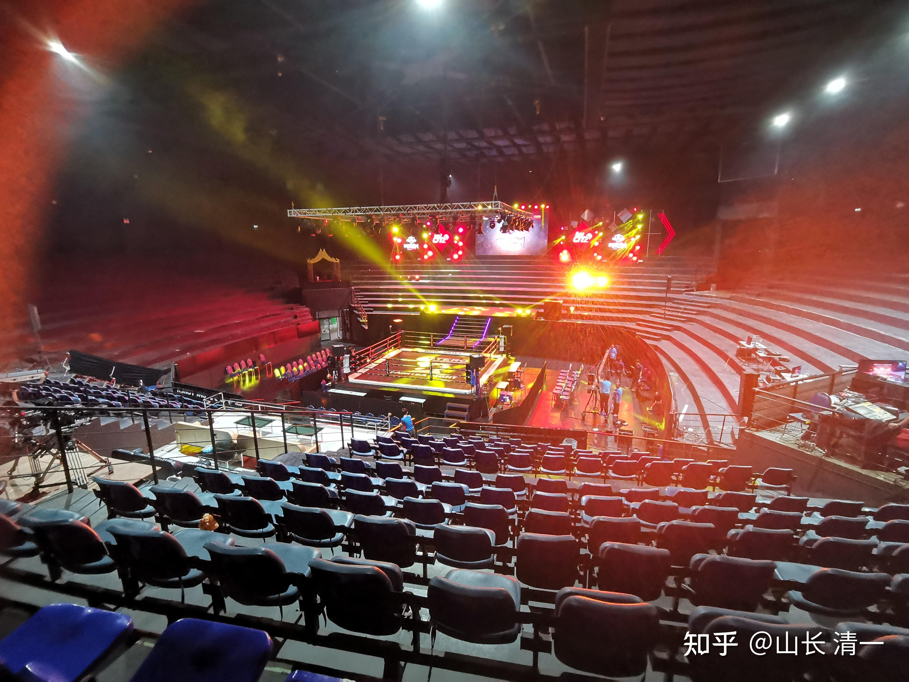
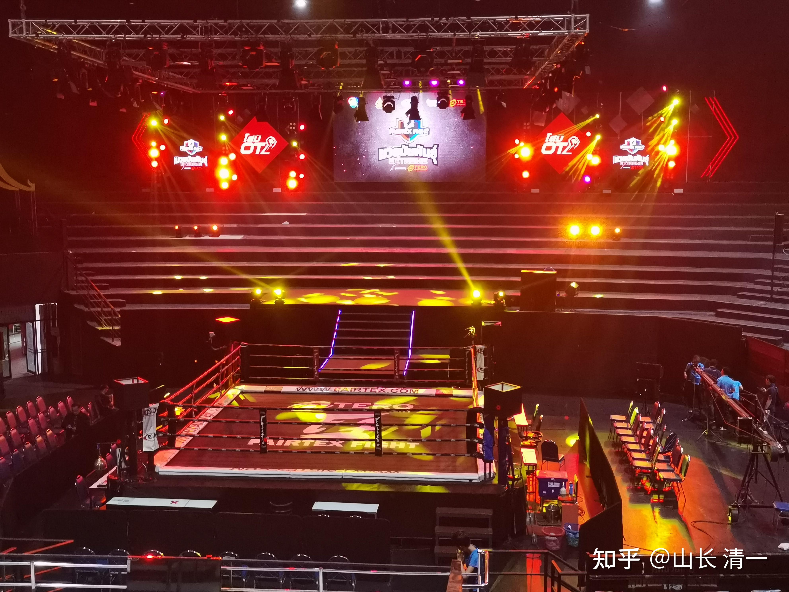
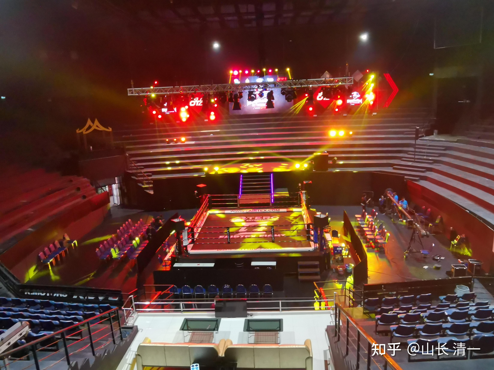

本周清一武道馆有四场比赛，周一就有明晓的比赛。最重要的比赛，当然就是12月10日周六的佳慧仑披尼首战了。这么短时间（8个多月）就从零起点打到了仑披尼战场，中国拳手没有实现过的目标我们正在实现。甚至大多数的泰国职业拳手，直到退役都没有机会走上这个最高的泰拳战场竞技比武，只能在台下当看客或者服务队友。这是泰拳的圣地，走上赛场，是拳手一生的梦想。中国人至今，尚未有人在泰国取得泰国仑披尼冠军的记录。我查看日本至少有6名拳手，是在泰国拿到了仑披尼冠军头衔的。清一武道馆，必将是为国人开创【中国新记录】的创新者。

*泰国仑披尼拳馆*

【转发雷武龙 美丽拳王文【东开始化妆上台源于一次意外，这也来自于波姐与蔡哥的一次对话，蔡哥一直抱怨自己没有拳手能去打伦批尼，自己顶不住拳馆老板施加的压力，波姐则劝说蔡哥，说伦批尼不是谁都能去打的，必须要能吸引人，拳手要有特质才可以，就连蔡哥你这样厉害的拳手都没能去伦批尼打比赛何况别人呢？波姐因为激动，说出的这句话深深的击中了蔡哥，蔡哥的眼神顿时变得有了怒气……

这里伦批尼指的是曼谷的伦批尼拳场（Lumpinee Stadium），和御驾拳场（Rajadumnern Stadium）并称为泰京两大拳场，曾几何时，这两大拳场是多少泰拳手的梦想，其中以伦批尼为最，高额的奖金，全国直播，世界各地的拳迷，一战成名的典故，都让这里成为了多少泰拳手流血流汗都要为之一战的地方，能登上伦批尼，在当时来说就等于成为了国家级的泰拳手，拥有了可以开馆授徒的身份和实力，虽然如今的伦批尼拳场有钱的拳馆也可以派出选手参赛的地方，但是在东那个年代，伦批尼拳场必须是全泰国东南西北各地的名将才能有机会去比赛的地方，而在蔡哥那个年代，能去伦批尼打拳更是轰动一方的事情，（笔者在泰国读大学时期的泰拳教练也因为没有去成伦批尼而遗憾）这不亚于在中国某地出了一个奥运冠军的概念）】

重点**【伦批尼不是谁都能去打的，必须要能吸引人，拳手要有特质才可以】----第一，武力值肯定要过人。但仅仅有武力值，打得不好看，也不行的。因为要求拳手还要打得好看，能吸引观众，能有够制造明星效果的拳手，才有机会去仑披尼。我一直要求佳慧要记住：当一个格斗拳手，不仅仅会打拳，还要有修养。让人喜欢（或者超级讨厌，这也是特色）。所以，上台的目的，不一定是专心放倒对手（取得胜利当然是很重要的结果），而是在比赛中，要打出漂亮，而令人激动的技术动作来。美丽拳王靠古泰拳一般人不练的复杂招式，不仅仅取得胜利，也获得了拳场的欢心，所以她会得到比赛的机会。但M拳馆的副教练，虽然他出拳的威力巨大，打死过三个拳手。却没有机会走上仑披尼，获取比赛机会。因为他单纯的以为打拳就是要有赢。但失去了观赏性。连比赛机会也没有，他儿子有实力，可以拿清迈冠军，但也没有机会走入仑披尼。这就是格斗界的商业现实考量：观赏性和格斗性必须统一在一起。这是一门生意！主办者的赔赚，不仅仅是拳手的格斗质量，也在于如何把各种风格的格斗手搭配好推上舞台。否则每场比赛都是千篇一律的格斗风格，可能很快就会让观众失去胃口。UFC的白大拿，就特别擅长这一套运作方式。**

[https://www.zhihu.com/zvideo/1582115818141278208](https://www.zhihu.com/zvideo/1582115818141278208)

​上面视频，是佳慧本场比赛的对手在仑披尼赛场打实战的记录。从这个视频看下来，这个对手是擅长拳击的格斗手，不是典型的扫腿型泰拳手。而是更像是张伟丽一样的风格的，拳重力猛，像个男生的拳手。原来与木兰们打过的帕开，就有点假小子，据说还有女朋友。但这个拳手比帕开更像男生，典型的假小子一个！属于武术界认为睾丸酮含量较高的女拳手，更容易打出成果来。三年多前，一些武术界的朋友对于我要出钱来培养队伍打世界格斗冠军的目标，首要的建议就是让我去登封招一些这种类型的女孩来训练，被我放弃了。我认为太极哲拳，不能招没文化的假小子。只能招学霸来学。目前看，这个策略是对的。现在的四个木兰，都是三语高中的学霸，理解力和悟性很好。这种人，只要肯好好练，就能练出来。而相对文化水平最低的一个女拳手，虽然练拳也算刻苦努力，要点就是掌握不来，已经首战后就退役了。

技术上分析：擅长拳斗的格斗手，一般来说腿法都比较差。张伟丽的腿法，就实在不够看，出腿笨重而且速度慢。这是训练体系带来的特征----外家拳擅长出拳的人，一定要双腿的支撑良好。但双腿过于强调支撑训练，起脚攻击的能力就变差了。显得更笨拙一些。因此，我给木兰佳慧的对策，就是：别去跟她拼拳，就算赢了也赢的不容易。跟她就以拼腿为主，让她的拳法够不着你，干着急，只能白白等著挨打。对手喜欢用拳，一般来说就是趁攻击方出腿之后，快速靠近贴身用拳来攻击。视频中也反应了这种情况。这种策略，对付泰扫腿其实还是很不错的。但用来对付中式的穿心腿，而且是连环腿法的攻击，应该是根本就靠不近身子就会被多次击中的。她们支撑良好，身体稳重的优势，此时就会变成一个很好的靶子，会不断被穿心腿击中的。因此，佳慧应该尽量的发挥腿法的优势，足够克制她了！

第二个要点：这种拳手不擅长位置的变化，步法移动变化上，不会做得太好。重拳重手的攻击模式，肯定很耐打，反击能力也很强，体能也相当不错。由于体能和步法身法的移动变化，一向是我们的优势，因此佳慧的要点，就是一开局就全力猛攻，注意用猛而不急。尽量不断地逼近对手，造成压力，迫使对方出手。然后我方打防守反击---在对手出手攻击的同时，拳腿全力出击，以野马分鬃等猛攻对手。

第三个要点：观察发现对手的内围技术也不是太好。这种坦克车一样的拳手，稳扎稳打，打阵地战，还是很厉害的。可惜就是应变能力不够。因此我方的要点，就是打运动战，不断变化和连续的攻击，会让对方根本就不适应。一旦接近后，就采用内围战的旋法，肯定可以有效克制对手。肘膝交加，应该就可以KO对手了。

清迈的拳手们，最近对一直在练更新版，提高版的【哼哈二劲的野马奋鬃】。要求是快速前腿腾空扑出，身体在空中的时候，就发出一个重拳，前足还可以空中抖身击出，发哼劲。所以对手弄不清到底是拳攻还是腿攻，会乱套的。不仅仅如此，本招还是连环攻击法。在前脚落地的同时，就要马上发出左右两拳跟进攻击，一上一下两个方向，与双足合拍发出，有微小的时间差。空中的合劲攻击发力，与落地的开劲发力，两次攻击发力距离不在一个位置上，相当于是对方退躲了一步的距离，特别适合追击攻击发力，用来对付不断后退的对手。敢不退的人，就会被直接打倒。发劲方式上， 这一招走的是“合开劲”，开始发“哼”音。落地的时候发开音，哈劲出来。练出来后杀伤力很大。个人认为：这一招练好，就足够对付泰拳了。佳慧目前掌握水平一般。但至少老版的野马分鬃，她已经会较为熟练的使用了。上次的缠拳战，野马分鬃打得就很好看。只要知道，就是类似的动作，但对方不是只中一拳，退几步就完了。而是连续中三拳，甚至加上一腿，用好了对方中招后并不会退步，而是直接击倒。这就是改进版的野马分鬃。如果在仑披尼能够使用出来，场面会非常好看的。

为了能够充分使用这些技术，佳慧除了平时苦练这一招外，还要学会上场前静坐，冥想过招，就像是【英雄】电影中的“意念过招”一样，尽量逼真赛场情况。如果状况调整良好，这一次的仑披尼首战，她给赛场留下一些精彩的记录。

小公主艾拉将在8日，就作为助手，随佳慧一起出发去曼谷。因为9日上午就要举行称重仪式，要双方拳手见面。小公主负责全程跟踪和汇报此战情况，并把前方信息发回来，我将在本帖里面滚动更新。本次比赛有电视直播，会在本站公布直播链接。各位有兴趣的拳友，可以从8-9日开始，跟踪关注本帖的更新信息！见证中国女拳手首次登录仑披尼赛场。开创新的历史纪元。

12月7日更新：比赛海报出来了。老拳师专门让她摆个【力量型，秀肌肉】的照片传过去主办方制作的。

*中国女拳手第一次征战仑披尼拳场*

曼谷拳场，原来有过中国拳手前来比赛的。虽然现在泰国拳界几乎不敢相信中国还有人来打泰拳。都一直以为佳慧是日本人或者韩国人，一再确认是不是搞错国籍了。也证明中国格斗手的世界存在感的确很差。但这一次，中国女拳手，肯定是第一次站在仑披尼的拳台上比赛，让五星旗标志出现在赛场上。一个值得纪念的历史突破记录。

内部指导

山长 清一 11:41:45 更新！

战前准备的指导：[https://www.bilibili.com/video/BV1cW411E723/](http://link.zhihu.com/?target=https%3A//www.bilibili.com/video/BV1cW411E723/) 佳慧看看这个播求与拳击手打泰拳比赛的视频。第一局播求犯傻，居然跟对方拼拳。结果被击倒，差点第一局就被KO。幸亏身体好，扛住了。后来改了打法，才勉强扳回来。你10日打的对手，也是更善于拳法的。虽然你的拳法比播求更好，但也犯不着跟对手比长处。你拼她的最短技术—腿法。第一局就用腿法狂轰她，正蹬，外摆，连环腿。第二局，开始拼野马分鬃和内围战肘膝交加。第三局照样复制。估计顺利的话，她第二局就有可能被KO。你这样布局，就算狂攻三局也不会吃亏。就怕你第一局狂打拳对攻，一不小心，就可能出现“意外被击倒”的情况。记住这个格斗原则。这个仑披尼第一战，就是一场送礼的比赛。对手送你给你吃点心，你认认真真收下这份礼物。

再次更新

12月8日，早上七点老拳师来带佳慧出发去曼谷。小公主艾拉和明慧一起做陪同前往。因为佳慧希望懂泰语的伙伴陪同做助理，不然她什么都要管，助手语言不通，就帮不上多少忙。她操心太多会影响比赛。上次就是赛前前没有处理好一些事情，导致精力不足。现在两个泰语小公主陪同，就好多了。老拳师带徒弟的节奏，是临阵磨枪。赛前两个多小时，居然带着佳慧练空击，纠正她的动作。怪不得上场佳慧打得很放不开的样子，原来是乱了节奏。我对佳慧的安排，是赛前一定要休息好，多做冥想。只做舒展的运动。这次交代随行的小公主配合好，保护好佳慧。尽量不受场外因素的影响。

小女外出旅行，准备的随身厨具。因为小公主们越来越不喜欢外出用餐了，所以需要自己打理饮食，跟张伟丽这种世界冠军，出去比赛需要带上随身厨师，营养师不一样。她们就只能自带【随身厨房】了：一小包糯米（一公斤），还有一罐自己制作的泡菜，一个闷烧杯。一小瓶黄豆酱作调料用。有这几样东西，她们路上的食物就齐全了，不需要外出上饭馆到处找饭吃了。外出的时候，找饭馆不仅不卫生，而且不熟悉地方，找起来很麻烦。而带上这几样东西，这几天只要宾馆有开水供应（咖啡是泰国酒店必备的供应），她们就有饭吃。带了书，有书读，她们就不会寂寞。这是公主班全体成员现在的生活模式。至于你担心她们这样吃会不会身体垮掉？不吃肉和菜，会不会骨瘦如柴？起码各位看佳慧的样子，就知道不是这回事。你们不至于以为每天喝软软的稀饭，人也软的像稀饭一样吧？如果你真这样想，我建议你吃一点钢材！

1208.19:00再次更新

小公主艾拉汇报，已经到了大曼谷区，但未去拳场。在宾馆休息。下午老拳师监督下跑步，打靶。艾拉要求是否明天就不打了。

本次比赛的海报：比赛的名称是 RISING。显然是一次选秀赛，从这些新冒头的拳手中，选出未来有培养价值的拳手来正式签约，成为两大拳场的正式拳手（根据曼谷泰拳的规则，这两大拳场的签约拳手，不能去其他的拳馆和地区比赛，但他们给的拳酬，一场比赛相当于普通拳场一个月的出场费）。怪不得老拳师非常的重视这次比赛，专程陪护送，还很严肃的要求佳慧：一定要打赢比赛。

*12月10日上午的选秀赛海报*

Ella 18:18:55

今天我们没有到拳场，明天大概还要坐两个小时的车才能到称重的位置，明天9：30前得到达检查拳手身体，10：00前完成所有拳手的称重，然后拍照，发拳服，拍打拳的视频（到时候会在佳慧上场的时候放在大屏幕上）星期六，12月10日，所有拳手必须在早上7：30前到达拳场，10：00～12：00比赛。全程是在7号电台直播。

*到达今晚（12月8日）目的地宾馆*

[!\[image\](images/img_005.jpg)

适应性训练。 https://www.zhihu.com/video/1584262894652444672](http://link.zhihu.com/?target=https%3A//www.zhihu.com/video/1584262894652444672)

2012年12月9日下午19:00更新

今天是称重仪式和拍照！称重和体验过关后，穿上拳场提供的拳手服装照相摆拍！

*称重仪式上拍的照片*

*原版是这样的。绿幕是方便后期制作背景的。*

*两人见面是这样的场景，没有你们熟悉的剑拔弩张！虽然场上双方都想KO对方。*

[电视七台比赛直播链接 ช่อง 7HD ทีวีเพื่อคุณ: ดูสดทีวีออนไลน์ ผังรายการ ละคร ข่าวช่อง 7HD](http://link.zhihu.com/?target=https%3A//www.ch7.com/live.html)

以上是泰国电视台的直播链接。国内应该可以看吧？上一次是FB的平台，国内不能看。这次是泰国电视台的，应该可以通过吧？看不了也没办法了。

比赛时间是明天上午泰国时间10:00。北京时间就是上午11:00。佳慧的比赛是第三场。想看自己去登录进入直播画面。

**22:00再度更新：前方小公主传回来的消息---主办方认为木兰佳慧技术不行，打不过已经练了10年拳的对手！**

**小公主Ella今天晚上，跟仑披尼的主办方聊得不错。摸清了很多信息。**

Ella 20:53:17

山长，下午我们跟主办方聊天，了解到了一些信息：

1. 佳惠是第一个在伦披尼打的中国女生，之前有中国男拳手和混血的女生，但没有纯中国血统的女生来打过。（主办方也挺激动的，或许也是为了我们开心，就很大声的吼说**“Alina，第一个，100%纯中国，来伦披尼打比赛的人！”）**

2. 他觉得佳惠打不过对手，因为对手有技术，是从12岁就开始打的拳手，现在22岁。不过中间停了4年上大学，现在又重新开始，但他觉得就算是停了，佳惠还是打不过，有40%的可能性赢。他说佳惠是战士型选手，没有技术（他指的没有技术就是没有扫腿），只会勇敢向前走。对手是泰拳经典式拳手（classic），有技术，扫腿比较好。然后他说佳惠不是不能赢，只要佳惠不站在原地不动，一直往前走，让对方的扫腿踢不到，然后连续攻击，让对方没空反击，就也可以赢。我听了觉得很有趣，因为这不就是我们的“技术和战术”吗？但我没有说，只是说嗯，Alina会努力，会勇敢往前的。

3. 他说佳惠能来伦披尼打是因为第一，佳惠打的比较有趣，因为佳惠会不断上前，第二，老拳师说佳惠能打的败这个对手，让佳惠来打。感觉这个主办方还是挺讨好老拳师的。不过老拳师也会给主办方带东西，带了一大袋牛油果送给主办方。

4. 我们问为什么迦南隆不需要水检，他说因为伦披尼更加正式，像踢拳，ONE，等正式比赛都是要水检的。他说迦南隆打拳就是为了赌拳，伦披尼是为了娱乐（entertain）。我就趁机问那伦披尼有赌拳吗？他说拳场里没有，但他们会在手机上赌。

5. 关于淘汰赛：他说要有至少53公斤才能打淘汰赛，还说他觉得佳惠这两年肯定还到不了这个重量，我们问所以只要到53就可以参加，他说可以。

**6. 关于素食：但他说佳惠肯定到不了这个体重，因为佳惠不吃肉，没有蛋白质，我就说她会吃豆子，米，是种子，他说哼！豆子！豆子！你天天吃豆子怎么行。我就说可是你看牛很强壮，但他只吃草，还有大象也是。他有点被噎住了，然后笑了一下说，好的那明天我就让主持人说佳惠很强壮就是因为她不吃肉！吃草！我也笑着说好呀！好呀！**

7. 我问这次如果输了，以后佳惠还能来打吗？他说可以，只是会安排更差的选手，如果赢了就会安排更强的拳手，但主要是要打的好看，他说这一次主办方等都是第一次近距离看佳惠的比赛，都会重新观察和了解佳惠的。

8. 他又告诉了我们更多看直播的地方，就是在Facebook搜Fairtex fight也会有直播。

9. 他说要给佳惠安排比赛，佳惠说听老拳师的，然后这个主办方就很快并有点含糊的说：“嗯，当然要听老拳师的，老拳师喜欢哪个主办方，就会安排到哪比赛，不喜欢就不安排。”不知道是在暗示什么。

冯月茹 Ella 20:53:40

以及佳惠把一些来伦披尼和对手的照片发到Facebook上后就有两个主办方在下面评论，打赌。一个是迦南隆的主办方，一个是伦披尼的主办方。大概是这样的，迦南隆主办方：“加油，佳惠，我想看你赢，让那些看不起你，觉得怎么能让你跟这个对手打的人看看。”伦披尼主办方（曾说过佳惠打不过）：“哎呀，谁敢告诉你她打不过呀”迦南隆主办方：“别口头上说的好，如果佳惠打赢了，你就要请我吃一顿饭。”佳惠就调皮的回复说“我会尽全力的，起码要让老师有饭吃对吧？”迦南隆主办方就回了一个大拇指。

我看了前方反馈的信息，觉得蛮搞笑的：**连仑披尼的人，都看不出木兰的格斗技术，是专门训练过的，专门克制泰拳的全新格斗技术。**不知道太极拳的格斗原则，就是“打死不后退”。一遇到攻击就向前。他们还以为佳慧是“战士型拳手”---就是匹夫之勇，猛冲猛打的人。没技术，靠勇气过人，来赢得比赛。泰国人肯定不知道佳慧原来是三语学霸，是学术型的人，考上他们的顶尖大学毫无问题。佳慧在场下很心细，很照顾人，绝对不是血气之勇的女汉子。不过场上看起来，的确是勇敢无畏的向前冲。而且佳慧的发型也比较男性化，不像是一个“温柔”的女子。这些都会让泰国人很迷惑的吧？

当然，我们必须用战绩来说话！用结果来说明问题。也许，木兰会成为仑披尼的一颗代表性的明星。

12月10日，下午21点更新

上午的比赛，佳慧点数负。有点遗憾---不过主办方的态度是输掉很正常。能这样已经不错了，换别人已经被KO了。

对于一些问题的交流，小公主ELLA继续汇报

Ella 17:17:09

下场后主办方过来说，没关系，对手比佳惠重这么多，还对我说这下你相信我了吧，佳惠就是打不过，她应该打48公斤级的，我想稍微说一下是没发挥好，但主办方说完就急急忙忙的走了。（因为当时还在进行下一场比赛，他应该比较忙吧。）

**山长 清一 21:04:53**

**冯月茹 **Ella 17:13:41

比赛前找主办方问了问题，以下是新了解的情况：

1. 最多可以相差2公斤，那种打8个重量级是增体重打的。

2. 如果打的好，就可以打露指拳套的比赛。不过他说Alina肯定打不了，因为她太瘦小了，而且露指拳套是很疼得。我说佳惠都打过缠绳了，而且打完一点伤也没受。他说那是对手不厉害。

3.MMA也是可以打的，他说本来今天也有，每星期会有两场，但来不及找人。泰国打MMA的大概只有100人。而且他说打MMA会裸绞，会受伤的很严重，要休息很久才能打下一场。我说那如果有人愿意参加MMA比赛，主办方会不会很开心。他说不，也要确定那个人真的可以打MMA才行，比如你告诉我佳惠可以打，我就不信，她那么轻，会伤的很惨的。我说那要怎样证明她可以打呢？他说要老拳师说佳惠可以打才行。或者先在外面打一圈才行。（在外面怎么打忘记详细问了）

不过老拳师说泰国打MMA的人不是很厉害，跟美国的差远了，体重也不一样。就是打着玩。不过先在泰国打也有好处，就是以后再去美国申请时就可以告诉别人你已经打过了。（但老拳师还是说，在泰拳规则下，MMA最厉害的人跟泰拳最厉害的人打是打不过的。）

**4.之前没有朱拉隆功的人来打过，他说朱拉隆功的人就只会学习。**我说如果佳慧明年佳惠上朱拉隆功就是第一个打拳的了。他就笑了，跟别的主办方说他们中国人就是喜欢做第一个。

5.他说女生不能打男生，这是规矩，外面庙会比赛可以，伦披尼不行。我说那如果一个女生打赢了所有女生，没有对手了还不行吗。以及昨天你说伦披尼打比赛是为了娱乐（entertain），这不是更好的娱乐吗？他还是说不行，你们女生天生就是更弱一些，不能跟男生打，是为了保护你们。

6.比赛前主办方又说佳慧肯定打不过的，刚刚对手称了，是54公斤，然后佳惠是50.7，差3公斤。还说昨天让佳惠多吃一点她也不吃。我说佳惠在清迈还打过更重的人呢，他说那是他们不厉害，还说了几个我们觉得佳惠打过的比较厉害的对手的名字（比如外府的，还有人妖）他说她们都没有曼谷的厉害，都不好好训练，跟佳惠今天的对手打会上场不久就被TKO的。

虽然这次比赛点数输了，我认为泰方的判决没有啥问题，佳慧这次的确输了。上场的状态不太对劲，跟她原来上场都不一样。估计是这种大场面，她还不习惯，有些紧张。因此场上打得很不放松。而内家拳的要点是“松”字，一紧张就动作变形，速度力量全都下降了。另外，对手的体重更重，她甩不动对手也导致技术无法发挥。不管怎么说：佳慧需要进一步的训练---心理和技术上的更加完善！

实战视频：

[清一木兰战泰拳第46场（佳惠第20战）视频20221210_哔哩哔哩_bilibili](http://link.zhihu.com/?target=https%3A//www.bilibili.com/video/BV1v8411G7Wd/%3Fis_story_h5%3Dfalse%26share_from%3Dugc%26share_medium%3Dandroid%26share_plat%3Dandroid%26share_source%3DQQ%26share_tag%3Ds_i%26timestamp%3D1670856673%26unique_k%3DHHajjuB)

