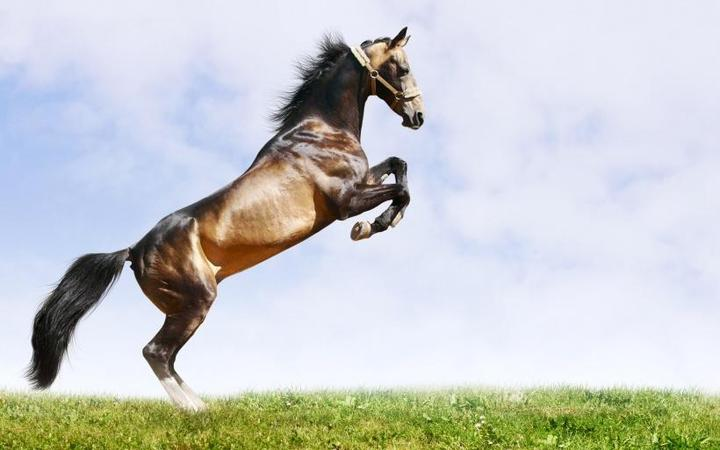

技法：

反架，对峙中，左腿发力，右腿提膝跃起，攻击可以是拳攻，出手发力。也可以是前腿正蹬，足发力进攻。根据对抗情况决定取舍。这一招，对付主动向我方进攻的对手效果特别好。特别是泰拳的扫腿，我们只需要抢中，用中，泰拳的侧面袭击威力不大，根本就不理睬，打上来也不会有力量（因为我们的身姿前移动作，破了泰拳扫腿的重击距离，所以发力没啥威胁）。但我们中线打上去对手，他们会很吃亏的，甚至容易被KO。因为我们正蹬的力量，超过泰拳手对于正蹬的理解。目前她们判断为木兰们是本力太大，不好抗衡。但不知道是技术差异导致的结果。

缺点：如果对手采用保守打法，不肯主动进攻，我们就不容易发挥这一招的威力。特别是泰拳手们吃过亏后，都知道木兰们的正蹬厉害，就会采取防守打法，利用主场优势（不被KO就赢）来对付我们。冠军甜水就采用了这种打法。如果我方急于进攻的话，还会遭到善于拳法的泰拳手的反攻。后手重拳有可能击中我方。

为了在主动进攻中，有效攻击对手，就必须根据赛场需要，改进训练野马分鬃的各种变式：垫步野马分鬃，换步野马分鬃，飞身野马分鬃，双击野马分鬃！

**垫步野马分鬃**：左脚推动右脚，前进一个小跳步后，垫步超越右脚。快速地拉进与对手的距离，然后右腿快速提膝，上步，做左脚落地的同时，对正前方对手发出正蹬。或者右拳对正前方的目标进行打击，也可以两者同时攻击。正常情况下，对方不会意料拳手接近的速度和距离，会退守不及时，或者退的距离不够而被击中。当然，与往前攻击是被防守反击的击中，还是效果要差一点，对手采取回退的身姿，会消去不少我们的主动攻击力量，比打反击效果差得多。

**换步野马分鬃：**其实就是右势野马分鬃攻击做完后，右脚一落地，就换用左式的野马分鬃继续攻击。直到击中对方为止。这一招，对于随时准备打防守反击的对手会很有效。正好在对方以为攻击已经结束，轮到她来攻击了，不管用扫腿还是拳击攻击， 这时候正好迎上我们的后续野马分鬃拳脚攻击，打了一个迎击，效果会很好。但对于一些根本就心无战意，不断退开的对手，也很难发生作用。此时对付这种人，就只能采取对方退无可退的“飞身野马分鬃”发动攻击了。

**飞步野马分鬃**：在对手距离较远，一遇到攻击，就尽可能退开的情况下，就直接快速冲击上前，飞身上步。高跃起来，用下劈之势攻击对手。敢于接近，就是肘膝砸上去了。站远一点是拳和足打人！这一招气势上很吓人。但只能在对付弱手，败退逃避的时候使用。平时可以多练习。如遇强手会在你势头没有起来之前就袭击，破坏你的攻击。等你身姿都跳跃凌空之后，这个势头太强，没有人有能力抵抗的。只能尽可能的躲远一点。由于泰拳手很多人很木，遇到攻击的本能反应，是站在原地硬抗下来。因此这一招用来对付泰拳很有效。属于花式打法。而且要比善猜的翻身踢威力大得多。泰国的【美丽拳王】，有类似的一招经常性地KO对手。但他是用肘击对方头顶，要求的准确度很高。我们是拳，手臂，肘全通用，应该威力更大。成功率更高。如果下劈导致对方失去重心之后，可以抓住对手颈部，用膝顶肋骨解决问题。

*野马奋鬃*

**双击野马分鬃**：如果用拳攻击，就是反架的情况下，右拳在空中就发力一次，落地的时候又发力一次。另外：落地的时候，左拳也跟随右拳一起发力，基本上是双拳齐到，一上一下分别袭击对手。这一招，可以是防守反击，也可以是主动攻击。进攻的时候，全身防守严密，根本不怕对手的攻击。防守的时候效果更好，属于【硬打硬进无遮拦】。对方防无所防，攻无所攻的态势。这是训练难度最高的野马分鬃，需要很长时间才能练出来实战效果。也是最正宗的野马分鬃！

这四种野马分鬃，目前的泰拳技术，都很难针对性的打反击，也不能随便接招。双方一旦交接在一起缠斗内围的话，练过太极的格斗手显然更占优势，肘膝交加的攻击更可怕。因此，泰拳手的最佳策略，也只能是退让，或者挨打后抱住防止后续的攻击施展。当然也不是不能破。只是破的动作，也必须是【反向野马分鬃】---功力强的一方胜。古人说的：怎么打，怎么还！这就是后发制人。