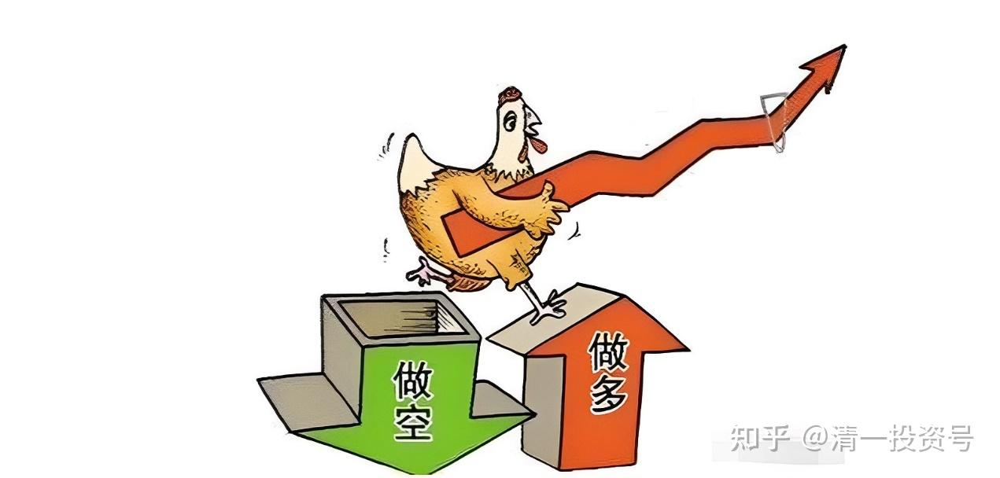
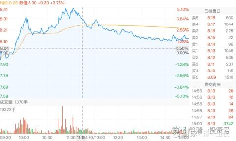
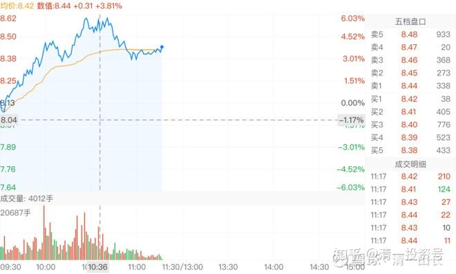
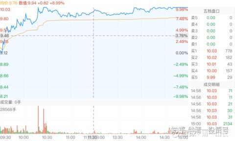
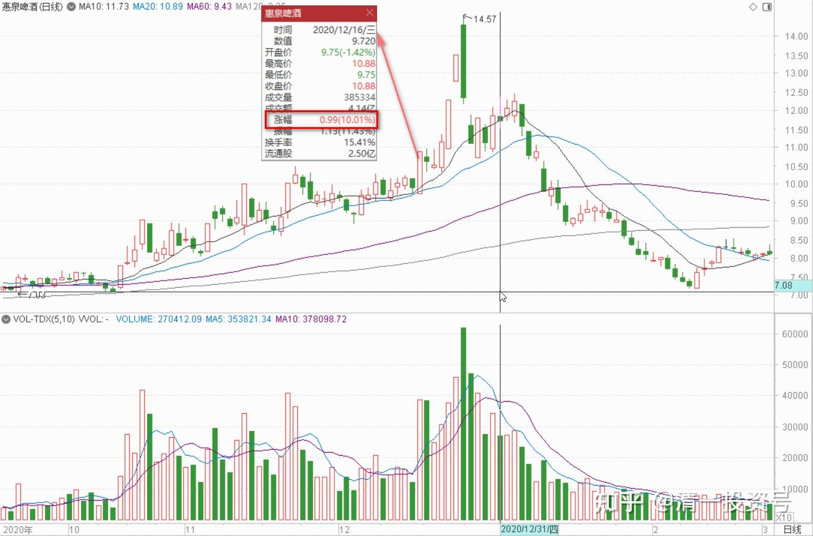

游资闲谈三：炒股秘诀——看空不做空

87篇.游资闲谈三 炒股秘诀——看空不做空

清一山长 2020年11月～12月

**一、炒股秘诀：看空不做空**

**[清一山长](http://link.zhihu.com/?target=https%3A//xueqiu.com/9310099567)** **2020-11-19**

[$燕京啤酒(SZ000729)$](http://link.zhihu.com/?target=http%3A//xueqiu.com/S/SZ000729) 这走势，就是出货的图形[吐血]。真不知道这价位出啥货。这么急钱用！13号抢筹的钱，亏本退走吗？

[清一山长](http://link.zhihu.com/?target=https%3A//xueqiu.com/9310099567) [2020-11-20 10:54](http://link.zhihu.com/?target=https%3A//xueqiu.com/9310099567/163772776)

[$惠泉啤酒(SH600573)$](http://link.zhihu.com/?target=http%3A//xueqiu.com/S/SH600573) 好奇怪的主力：10:18分，一分钟直接拉涨停，跳涨2毛钱,成交量285万股,差不多成交一个第二大股东的量。可偏偏又不封住涨停,导致抛盘蜂拥而出。8分钟后，再拉涨停，250万股成交。偏偏又再次封不住,抛盘继续跑出来。主力是真没实力，还是假装示弱？跟昨天的燕京一样，故意示弱的？如果想让市场沸腾，让小股民兴奋。封住涨停，才是最佳决策呢！还可以让更多人跟风，自己也不用买进过多筹码。这种玩儿，明显就是让别人快卖啊？当然，也可能还是要跌下来，让卖掉的人高兴——我冲高就卖就对了！**强化这种信念，显然对主力有好处。**

其实，昨天燕京啤酒，我已经看出来，虽然K线图就是出货的图形。但结合基本面来看，绝对是不应该出货的。其实也出不掉。也许只是几个账户换仓玩儿的，顺便洗出浮筹。所以是典型的骗线，我就贴出来让大家看了。不过，别人毕竟是用了几个亿画出来的线，做得很不容易，我也不说破，免得被人恨。今天，走势已经证实昨天的确就是骗线了。所以，我今天公布真正的答案。昨天的，需要大家思考。昨天出来说要跌到6元、5元的人，今天出来走几步看看？这就叫打脸。不懂没关系，别一张嘴就乱说话。

各位今天，知道我告诉你们的**炒股秘诀：“看空不做空”有多重要的了？看空，你跟着做空，你就正好上当了。看空，不做空，反而做多，忍住内心的煎熬，你就赚了。“反者道之动。”**各位好好领悟去。

惠泉马上就要到我的止语区了。感谢惠泉来来回回地帮助我赚钱。这次下跌，我又补进了更多的数量。再次恢复原高，我的仓位也早已恢复原高，只是成本又降低了不少。全体持仓，正在等待最佳的卖出机会。今天涨停，也未必是最佳卖出机会。只是可以卖出上次卖出的相同头寸，算是平仓，赚了两次，该满足了。

向资本市场的大佬们致敬！我这三大算什么。你们这些才是“看不见的上层”。一笔成交买入，就超过我的全部持仓了。[俏皮]

**[清一山长](http://link.zhihu.com/?target=https%3A//xueqiu.com/9310099567)** [2020-11-20 11:25](http://link.zhihu.com/?target=https%3A//xueqiu.com/9310099567/163777415)

[$燕京啤酒(SZ000729)$](http://link.zhihu.com/?target=http%3A//xueqiu.com/S/SZ000729) 昨天的走势是出货图形。今天证明是假的。

今天的走势是啥呢？明说，是收货的图形（看帖子，居然有人说今天还是出货图形[吐血]。这种看图水平，就别在股市混了。明牌都看不清，还有很多暗牌呢！）

今天上涨放量，没有明显的出货痕迹。**下跌量缩（昨天是下跌放量，所以是出货图形）。**今天一上午的成交量，比昨天的全日成交量还高。所以今天的收货很成功，也可以说，是昨天的出货图，吓坏了很多人。今天刚解套就跑掉了。

今天主力是真收货？假收货？

我就不知道了。这个主力，实力过于雄厚，想干啥就干啥。我们惹不起。也不去猜。只认一个死理——给钱我就走。不给钱就是死不走。承认我脑子笨，没主力聪明。但也没笨到算不清赔赚的地步。

想知道主力的真实意图吗？等看下午和明后天的走势，就会告诉你了[大笑]

**[清一山长](http://link.zhihu.com/?target=https%3A//xueqiu.com/9310099567)** [2020-11-20 19:41](http://link.zhihu.com/?target=https%3A//xueqiu.com/9310099567/163804362)

[$惠泉啤酒(SH600573)$](http://link.zhihu.com/?target=http%3A//xueqiu.com/S/SH600573) 今日解盘：由于惠泉已经超过10元，我不再示范操作了。只告诉大家一声：惠泉持仓利润再创新高。暂时列名啤酒股第二利润股。不过燕京虎视眈眈，很快就有超过的迹象。惠泉正常情况下，只能当老三。燕京当大佬的可能性正在增加。

今日盘面解析：主力送钱。跟10月23日的涨停不同。主力这次不再自己来接盘，而是打掉压力位的压盘之后，让积极参与散户们积极接盘，互相多空对战，提升股票热度。但主力并没有出手抛售，没有玩大欺小的游戏。而主要是观战，关键点花钱拉升一下（别问我怎么知道的，花了钱买的消息[俏皮]）。今日冲涨停7-8次了吧？尾盘勉勉强强地收在涨停价，但接盘只有778手，看上去很可怜，很小气，可能主力是怕我这样的人，一单子砸两百多万股给它拿着。所以盘面上接盘都不多。我想跑还没这么容易的。不过，盘面也反应了主力没有主动参战情况下，真实的交易情况，散户们积极接盘，已经很了不起了。主力把大资金都腾出来，不跟散户抢了，等大家不敢冲涨停的时候，冲给大家看[大笑]。

与燕京啤酒不同，燕京现在似乎还有骗筹的怀疑，还处在第一阶段的尾期。惠泉主力已经进入了**第三阶段：与散户共舞，庄散目标一致**。现在是大家最好的蜜月期，他这时候，愿意与散户们分享利润，大家一起赚钱，制造赚钱效应，并扩散消息出去。真是一个长庄、善庄，吃相很端正。（坐庄的**第一阶段是收集筹码，第二阶段是拉升股价，秀身材，吸引跟风盘**）。现在离第四阶段看来还早，因为散户交投还不热络，想走也走不掉。所以要培养一下人气，主力已经这样做了。赞一个！（**第四阶段是高位派发，套牢散户**，这时候谁能及时离开宴席，谁就是最后的赢家，如果没能及时离场，之前赚到的，全都要赔回去的）。

**了解一只个股，主力坐庄的四个阶段，是很重要的。**燕京为啥我认为是假出货？因为它的第二、第三阶段都没开始走，还在第一阶段的尾声阶段，怎么可能直接走第四阶段？主力一出货，就会砸到自己的成本线以内，刚刚走出成本区的股票，是根本出不了货的。只能自己憋死自己。什么是真的主力庄股？看看几个主力白酒的走势？多漂亮，很多都在走第三阶段的尾声，第四阶段的开启了。现在天天网上都在嚷嚷什么要买赛道股，别的都是神马。这就是第四阶段的迹象。**如果各位有一天，雪球上的各种议论，热点都是“啤酒才代表炒股的品味”。你手上没有啤酒股，你都不好意思见人（就像现在手上没白酒股，你都不好意思说自己是炒股的一样）。这时候，可能就是第四阶段了。**

不过，要主动的离开第四阶段很难，这是完全逆反人性的。因为利润太丰厚了，赚钱太容易了，真舍不得离场的。可能三天就是两个涨停。你舍得走吗？我们都想吃到最后，最甜最美的那一口，吃饱之后慢慢的再离开宴席。然后，可能你就再也走不动了[俏皮]（**2015年**年中，我4500点撤掉融资，周围人全都在想法抢融资，还配资。**我示范给清粉们卸融资，守住基本原则。不贪心。**却被一群人笑话说：老师都老了，现在要看年轻一代了。他们半年就赚了五倍、十倍。真比我牛。这就是第四阶段的特征，诱惑力极强。当年我要没这定性，退场，也不要老师的面子，不去跟他们比拼赚钱的倍率，只想守住胜利成果，被人笑话也无所谓。不然我现在就是穷光蛋一个，有多少钱？再就是几十年的积累，全都要被打光的）

总结：我为啥一年前会看中惠泉？我为啥一直说惠泉的股性，比燕京更活？是一个良好的价值投机股？就是因为惠泉是主力容易驯服的马。燕京这匹马太强悍，不易驯服。惠泉要容易得多。所以游资容易看中惠泉。如果您也看中了惠泉，自然也可以与主力一起分享大宴。**只是别太贪了，吃相别太难看了。别挤到主力的嘴边抢食吃，别主力顺嘴就把你直接吞了！**（自己参看五年前，冲21元后的惠泉走势，你该怎样离场？只有跳楼一条路。漫漫熊途，等了五年之后，“解放军”现在好不容易再次攻到半山腰）。

本人负成本持有超过百万股级的惠泉！均来自于主力的赏赐！继续与惠泉主力。散户一起共舞。再次感恩主力，感恩一切参与惠泉交易的伙伴们，对手们！

二、**游资炒作或是高潮前奏**

**[清一山长](http://link.zhihu.com/?target=https%3A//xueqiu.com/9310099567)**[2020-12-16 18:14](http://link.zhihu.com/?target=https%3A//xueqiu.com/9310099567/165922479)

[$仁东控股(SZ002647)$](http://link.zhihu.com/?target=http%3A//xueqiu.com/S/SZ002647) 说实话，我想破脑袋，都想不到仁东会这样走[吐血]。昨天开盘就21个亿砸进去，打破了跌停板。全天成交33亿。这资金体量，可以买半年前的两个惠泉了。这么多的资金急乎乎地冲进去，接近一半的筹码已经换了手，我以为：起码今天要装模作样的来个“强势反弹”上攻呀？结果一看开盘就来了个跌停！成交7.8个亿。玩什么把戏？

我才不相信昨天是新资金抢盘，没人这么大方来当解放军的。可能就是套住的资金自救吧？左手倒右手？50元上方这么长时间的高位盘整，我以为庄已经成功退出了，怎么还套在里面？30多亿，做啥不好。现在腰斩上再腰斩的，还剩下几文钱？融资的，上配资的，全都打光了吧？

国人赌性就是强，昨天，今天冲进去的小散无数吧？真不知道你们来股市上要什么。是要赚钱的，还是来玩的就是心跳的？喜欢这样玩，不如去澳门呀？

真正的投资，都是无趣的。甚至是极其无聊，甚至郁闷的。等你忍耐不住了，就开始爆发了。我猜惠泉啤酒这几天10元上下的鼓捣，都把不少缺乏耐心的小散给鼓捣跑了。还自以为找到了“规律”，10元以上卖，10元以下接回，今天一早就T飞了。等你玩聪明玩飞了，它就涨停了。不如啥都不做，傻傻地等着庄家来抬轿。因为你算定他就要来抬，就是不知道什么时候罢了。[大笑]

天天涨的，天天跌的，玩的都是心跳，这都是妖股！非常反常。绝对不是投资。我的处理方式，就是看看热闹。想象这里面的人何等的快乐，何等的焦灼。一半是冰水，一半是火焰。然后看懂了，就哈哈大笑：领悟到“原来这就是人生”！好玩的游戏。

[water2017](http://link.zhihu.com/?target=http%3A//xueqiu.com/n/water2017)回复[清一山长](http://link.zhihu.com/?target=http%3A//xueqiu.com/n/%25E6%25B8%2585%25E4%25B8%2580%25E5%25B1%25B1%25E9%2595%25BF)：

委托游资撬板骗跟风赌徒，然后跌停闷杀锁定。标准操作。

**[清一山长](http://link.zhihu.com/?target=https%3A//xueqiu.com/9310099567)**[2020-12-16 19:33](http://link.zhihu.com/?target=https%3A//xueqiu.com/9310099567/165927990)回复[water2017](http://link.zhihu.com/?target=http%3A//xueqiu.com/n/water2017)：

这解释比较靠谱，原来可以这样玩，我咋就不知道[大笑]。

委托的游资，就不怕出来的人反悔，资金逃出后，今天不肯重新接回去，咋办？反正你告诉我去翘板，给10%。但我怕我为了这10%，被人100%的闷在里面，当接盘侠了。江湖刀客，真有这个信用吗？[俏皮]

不管咋玩，与狼共舞的小散，应该是最终的买单人。

[明达野老](http://link.zhihu.com/?target=http%3A//xueqiu.com/n/%25E6%2598%258E%25E8%25BE%25BE%25E9%2587%258E%25E8%2580%2581)回复[@清一山长](http://link.zhihu.com/?target=http%3A//xueqiu.com/n/%25E6%25B8%2585%25E4%25B8%2580%25E5%25B1%25B1%25E9%2595%25BF)：

恭喜山长在惠泉上收获满满！[献花花]**惠泉目前的盘口，我个人看，已经是游资炒作频繁换庄的状态，我不打算跟玩了，因为看不懂，这部分利润注定不是我的，就让这些喜欢一日游的炒家们利用后面的空间玩“传雷”游戏吧！**所以，我目前的操作是——全线撤出惠泉（部分在华东溜达了一圈）换回了珠江，啤酒整体头寸基本不变。

**[清一山长](http://link.zhihu.com/?target=https%3A//xueqiu.com/9310099567)**[2020-12-30 10:43](http://link.zhihu.com/?target=https%3A//xueqiu.com/9310099567/167104086)回复[明达野老](http://link.zhihu.com/?target=http%3A//xueqiu.com/n/%25E6%2598%258E%25E8%25BE%25BE%25E9%2587%258E%25E8%2580%2581)：

祝您新年快乐，大吉大利！[献花花][干杯]

我认为惠泉的高潮戏，应该还在后面。基本面和技术面都支持未来的精彩表演。所以这波跌到11元左右，我就拿回了高价卖出的筹码。昨天10元多，也买进了不少，摊低持仓成本，陪主力多玩一阵再说！目前应该还在十大里面，除非十大升级了[笑]。

您退出惠泉，也是很明智的：珠江10元区的调整，已经很久的。这个价位现在基本上算是珠江阶段性的底部了，不太可能继续破位。比惠泉调整有限的11元价位区，显然要靠谱很多。我也在10元多，完全补回了12.17元卖掉的珠江，还多买了20多万股。算是把赚到的利润也放上去了。惠泉就不敢多买了，只敢少买，**没跌到理想的价格，宁肯错过也不追涨**（前天追涨的人，肯定昨天就吃亏了）。赚到的利润都留出来。别不小心就赔回去了。珠江就没有这个担心！

参考链接：

[清一投资号：85篇.游资闲谈一：进货与出货手法及散户如何防骗？](https://zhuanlan.zhihu.com/p/585167445)

[清一投资号：86篇.游资闲谈二：快进快出的“小李飞刀手法”](https://zhuanlan.zhihu.com/p/589591604)

[清一投资号：88篇.游资闲谈四：吃亏的游资，饱食的游资](https://zhuanlan.zhihu.com/p/593039607)