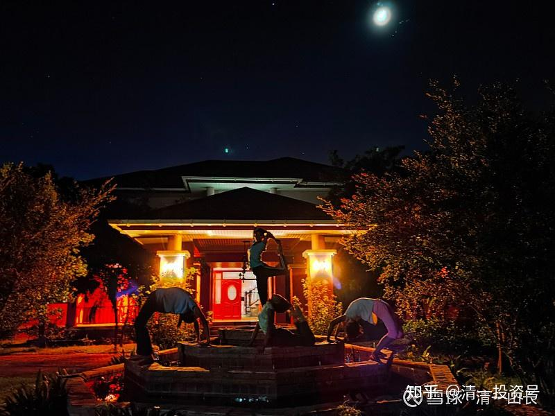

原雪球专栏[208篇.陪伴式成长——一种简单、高效、厚积薄发的教育方式](http://link.zhihu.com/?target=https%3A//xueqiu.com/9310099567/198719532)

清一山长 2021年9月25日

今天我给学员讲授了一种早已被遗忘的，但却是人类最佳的教育方式：陪伴式成长。小女从三岁多就送去今日学堂寄宿学习，9岁多，完成英文基础教育之后，用她自己的话说，就是她的母语都是英文之后，我把她接回来，在我身边，我亲自带领她学汉语，做她的家庭教师。没有任何压力和学习任务，更没有考试，这样度过了快四年了。小女的成长速度是惊人的。几乎是从零开始学的汉语，已经达到了同龄人的水准，甚至阅读理解力还超过了同龄人的水准。但别人用了比她多三倍的时间来学语文，还学得很辛苦，同时，她的英语和泰语水平也有了很大的长进。

关键并不是课程学业的进步。这四年，她的心理、个性上的改变，非常的大，越来越积极阳光，思维力也快速增长。原来熟悉她的学堂教师们，每次看到她都能发现她的明显变化。但要问我到底安排了什么特别的课程，学了什么东西，实在地说，我没做啥特别的，我很轻松，主要带着她们玩，带着她们干活。她也很愉悦。而且有几个朋友的女儿，也送到我这里，与她一起成长，享受我的特别家庭教师服务。这几个孩子两年来的进步都很大，**关键是心理个性、待人接物的水平大大提升了，与她们在学校上学的同学，已经成了不太一样的人。学业也没有拉下。**

这是什么方法呢？其实这就是**工业化时代之前，上层阶层人家的教育方式：不去学校，在家里面，陪伴式成长**。有时这些上层社会的家长，会请一个家庭教师来家里住，作为“西宾”，主人住在东面，成为“东主”。孩子在这样的教师或者家长的陪伴下，成长取决于家长的高度。如果你实在不知道这是什么样的教育，你可以去看看**《红楼梦》**，这些女儿们，从来就没有“去学校上学”的说法。但你不得不承认金陵十二钗，个个都是才女。文采、才情、待人接物、做事能力，都各有所长，绝对不比我们今天学校培养出来的人差。

西方其实也差不多，你们去看看[《傲慢与偏见》的BBC电视剧（1995年版）](http://link.zhihu.com/?target=https%3A//www.aliyundrive.com/s/yGoJNRpbiHE)，你就知道：贝内特老爷子，是如何带着自己的四个女儿，给她们陪伴式成长的。培养出伊丽莎白这样优秀的才女，还有温柔的大女儿。另外两个小女儿，受妈妈的影响太大，有些不太成功，但也是上流社会的常客。这家人，从来没有“上学”的说法，你却不能说她们没文化、没教养。《飘》这部影片的生活方式，也是那个时代的特点——没有学校，但不意味着孩子们没有文化。除非你是下等人。

反而**现在的工业化社会，我们看起来超级重视教育，却培养了一堆废物出来，不仅没有学到知识和文化，还成了社交和生活的白痴和废人**。所以，现在是回归自然，回归工业化之前的教育方式的时候了。

我对小女的培养，已经充分证实了这个“传统路径”的优点，她的成绩，我认为将来是可以轻易考取世界第一流大学的，她要适应工业化社会也不难。何必把她送到学校去受罪呢？小女估计未来的几年，也不会去学校上学的，依然在我身边陪伴式成长（当然，她会用一个学籍来注册，准备上大学的时候用）。明年9月，公主班的孩子学完英文之后（我要求这一年，她们要学会标准的女王英语、牛津英语，学会演讲和辩论之后，才能来泰国）。我就取消你们熟悉的，正式的课程和计划，也不要什么老师来带固定的课程啥的，让孩子们自我管理、自我成长。让她们融入**古代农业时代的“耕读传家”**生活，会很像《傲慢与偏见》中的生活方式，只是人有点多。这批小公主将尝试一种与你们想象的教育完全不同的教育——**不上课的教育、生活教育、做人做事的教育。业余时间，再顺便读读书。**看一两年之后，这些小公主，会不会比你们的孩子学习更差？我相信她们依然是今日学堂其他班级的明星级学霸！但我要用一种“不学习、不上课”的方式，来培养未来的学霸。

怎么培养呢？各位参考今天的学员日记吧！

学员张国亮的学习日记：

今天是上山长课程的第五天，这是我前所未有度过的5天，似乎回到了柏拉图的课堂，这种教学方式和教学内容一直冲击着我的大脑。我自认为我是一个特别爱学习、爱思考的人，然后，这确实是我第一次碰上这种教学。山长讲授的**陪伴式的教育**和**稀里糊涂教育法**彻底颠覆了我过去的认知，我犯过多少扼杀孩子的事情。曾经带孩子认字，重视有形，而忽视了无形，重视实而忽视虚，一直不在道上，尤其是临时采访Ella，更加让我惭愧。作为父亲，作为一个重视教育，深爱子女的父亲，居然用错误的，离谱的方法，还自以为是地教育子女，殊不知严重破坏了孩子的思维，严重增加了孩子的障碍。连公主班的“中积中发”都差距甚远，更别提厚积薄发了，感谢山长智慧的引领，就这一堂课就价值百万，真是太幸运了，遇上新教育，避免自己的四个子女，还有姐姐弟弟家的孩子继续被摧残。

照片说明：Ella在她的房间跳舞。这个房间，大约一百平方。原来春节期间，我们全学堂的女教师都住在这里。

孩子们的真人雕塑照片，喷泉上的造型。

2021年9月24号日记

陈嘉靖

今天所讲到的“陪伴式教育”真的很触动我，因为我以往实打实的体验也见过这种模式的教育。

山长所说的陪伴式教育，很像古代的学武等等的跟师模式。拜师之后，徒弟会和师父同吃同住，平时一直都能观察到师父的一言一行，通过师父的一言一行来浸染徒弟，也就是通过言传身教来教徒弟如何做人做事。因为以往学武，师父不单单只是教拳，还会教做人，只会拳而不会做人只是一介莽夫。

之前接触过一个6岁的孩子，家长和我说，这个孩子没有上过体制，在家里没有强迫他干过什么。我当时心里暗喜，这个孩子应该会不错，没有怎么受到摧残。但是这个孩子后面的表现让我大吃一惊，嘴里经常飚出各种粗俗的话语，不会穿衣服、穿鞋子，吃饭也需要别人喂，运动的时候会躲到一边睡觉。后来才了解到，这个孩子在家里吃饭、穿衣服、鞋子是父母帮忙的，从来不需要他自己动手，而这些粗话和惰性，是待在家里的父亲言传身教而来的，这个爸爸带孩子的时候，不一会就会躲到一旁睡觉，晚上熬夜，平时还经常飚粗话。当一个这样的爸爸在孩子身边做陪伴的时候，我真的无法想象孩子长大后究竟会变成什么样子。

还有一个12岁的孩子，他虽然是在学堂里学习了一段时间的，但是他十分的讨人厌，没有孩子喜欢他。后来家长把他送到了一个老师那，这个老师的行为处事什么的都没有什么毛病，我也很尊重他。这个孩子就跟着这个老师待了1年多的时间，就住在这位老师家里，每天跟着他练功、运动。因为他的讨人厌的行为也被教训过，1年多的跟师回来之后，这个孩子整个人都变了，热爱学习、热爱运动，还十分的讨喜，还成了孩子王。

所以山长这个陪伴式教育的核心——**陪伴的人，真的很重要，不同的人所陪伴教育出来的孩子不同。**

山长 清一 21:58:17

这个学员的解读很好——**老师不用特别教什么，但选一个很正气的人，你很喜欢的教师，放手让他带，不要管啥课程。同吃、同住、同睡**，这孩子大概率就慢慢改过来了。

山长 清一 22:04:39

广东某老板的女儿，经过我的特批，现在就得到了这个特别的待遇。这孩子从小受照顾较多，有不少大小姐的毛病。现在跟一个2.0的实习教师，每天生活在一起，同吃、同住、同锻炼，是今日级别最高的待遇。实习教师不知道咋带，我就告诉她：“**你每天认真地生活，一起锻炼，一起读书，自己好好学习提高，她读不读，你也不用管，不在意她的成绩，爱学不学的随意。她抱怨你不用去处理，淡然处之。以后她的很多脾气慢慢就会改过来了。该说的要说，该做的要做，她做的你一起跟着做，一起训练。最终，你和她都出来了。**”**这就是老师不累，孩子也没有压力的成长方式。**

**清一武道馆**，也是类似的方式，代训人员**天天跟一群未来的世界冠军在一起同吃同住。过几年，自然不一样。没有谁教他们，但他们自动会成为更好的人。**只是这种教育，我们目前只给了极少数根本不在意学业成绩和文凭的老板家庭。一般人，不敢给，给了怕被黑。吃力还不讨好！

**评论回复：**

洋洋无忌回复[清一山长](http://link.zhihu.com/?target=http%3A//xueqiu.com/n/%25E6%25B8%2585%25E4%25B8%2580%25E5%25B1%25B1%25E9%2595%25BF)：

初到马来西亚时，发现不少家庭（白人家庭）的孩子在家homeschool，但是孩子非常有教养和礼貌，和来旅游国内的孩子鸡飞狗跳、野蛮喧闹的对比特别强烈，很吃惊。后来发现不少私立学校其实就是规模略大的homeschool，注重运动和社会服务，以学生自学为主，老师答疑辅助，近百名学生教师不超过10人。当时，只是震惊，和国内学校师资硬件配备差别太大，心里也疑惑这样也可以吗？最近看了《自驱式成长》，结合山长这篇文章，总算有些思路：**把孩子的成长推给学校，是没有真正理解到言传身教的力量，有人是身不由己，有人是偷懒或不愿承担责任，所以没有耐心陪伴孩子。**教育的方式是多样的，去学校读书只是一种，现在看来，还是性价比实在不咋滴的一种。

清一山长[2021-09-29 12:51](http://link.zhihu.com/?target=https%3A//xueqiu.com/9310099567/199117001)回复洋洋无忌：

你的判断正确。但教育利益集团不喜欢你们这样想，你们都这样做，你们就控制不了啦！**白人们选马来西亚的原因，是马来西亚的政府，对私人办学非常的鼓励，其他国家都有限制发展的情况。**马来的办学自由度较高。白人办学，还有一大好处，就是**可以通过英美成熟的考试系统获取权威毕业证书，不依赖举办地的学籍管理制度，逃脱了基础教育被政府控制的不利家长的局面**。英美崇尚自由，政府也不太管国民的教育控制。所以，相对自由度较高。还有，**马来的签证相对门槛更低一些。泰国的长期签证很坑人，要花很多钱。泰国对外国人管得很紧，拿长期居留签证很费力。**在家教育，办私立学校，选择马来西亚，是个好办法。

洋洋无忌2021-09-29 17:46回复[清一山长](http://link.zhihu.com/?target=http%3A//xueqiu.com/n/%25E6%25B8%2585%25E4%25B8%2580%25E5%25B1%25B1%25E9%2595%25BF)：

一觉醒来看到山长回复，忍不住再分享个事。马来西亚的生活成本可能比国内还低，但在这上国际学校的国内家庭都还是家境挺滋润的，有那么点小骄傲。然后就来了奇怪的一家，家长以前在杂技团呆过，现在以中医按摩为生，带着一儿一女。教室都开着冰冷冷的空调，妈妈就让孩子在短袖、短裤里穿秋衣、秋裤，怕受冷风留长头发掩着脖子。妈妈很热心，经常主动搭讪要帮人看病，再加上确实有些邋遢，其他中国家长都唯恐避之不及，甚至还有中国家长给校长写信要求她们退学。马来西亚疫情一直很严重，大多数时间一直是网课，孩子妈妈（孩子爸爸回国挣钱了）就给两个孩子退了学，一边接点生意，一边在家教。1年下来，两个孩子在家看哈利波特原版没有障碍，在家聊天也都是英语。我跟孩子妈妈聊天，她还想带孩子去新加坡，如果去不了只能回中国，她打算带孩子全国穷游，一路表演杂技，杂技、中医按摩发视频，一路旅游，一边挣钱一边带孩子学点啥，反正就是不去公立学校。我一看到她就会想起小时候看到走街串巷带着孩子辛苦谋生的南方人，不同的是她是为了孩子教育流浪他乡，真是凭着一双手努力把孩子托起，挣扎到能够到的她认为最好的地方。没有钱，又怎样呢？在孩子教育上她看的够通透，也够拼。

[专注做好一件事](http://link.zhihu.com/?target=http%3A//xueqiu.com/n/%25E4%25B8%2593%25E6%25B3%25A8%25E5%2581%259A%25E5%25A5%25BD%25E4%25B8%2580%25E4%25BB%25B6%25E4%25BA%258B)回复[清一山长](http://link.zhihu.com/?target=http%3A//xueqiu.com/n/%25E6%25B8%2585%25E4%25B8%2580%25E5%25B1%25B1%25E9%2595%25BF)：

感恩山长的智慧和大爱，孩子暑假没有被突破班录取，现在就自己带在身边，陪伴式成长，短短不到一个月就看到孩子进步，比以前踏实了许多，做事、说话也沉稳了。这是简单又最有价值的教育。教育就像走路，自己不知道路，就紧跟导航；自己不懂得教，就紧跟山长，跟着新教育。

清一山长[2021-09-27 12:19](http://link.zhihu.com/?target=https%3A//xueqiu.com/9310099567/198873239)回复[专注做好一件事](http://link.zhihu.com/?target=http%3A//xueqiu.com/n/%25E4%25B8%2593%25E6%25B3%25A8%25E5%2581%259A%25E5%25A5%25BD%25E4%25B8%2580%25E4%25BB%25B6%25E4%25BA%258B)：

你们这样子**在家跟随示范班的示范，家长陪同一起学习，是最廉价，最高效的学习方式。家长不放弃，坚持就有回报。家长想偷懒，就算送过来也达不到效果，除非孩子很自强。关键是家长要自强。**祝福你们一切顺利如意[献花花]。

[专注做好一件事](http://link.zhihu.com/?target=http%3A//xueqiu.com/n/%25E4%25B8%2593%25E6%25B3%25A8%25E5%2581%259A%25E5%25A5%25BD%25E4%25B8%2580%25E4%25BB%25B6%25E4%25BA%258B)回复[清一山长](http://link.zhihu.com/?target=http%3A//xueqiu.com/n/%25E6%25B8%2585%25E4%25B8%2580%25E5%25B1%25B1%25E9%2595%25BF)：

感恩山长！我们在家跟随一起学习，一起成长，暑假突破班夏令营结束后，我们从云南徒步回家，完成了一千多公里，现在练习做事、做饭、运动，继续每天21～42公里不等，等孩子实在想学了，再给他学！

清一山长[2021-09-27 14:04](http://link.zhihu.com/?target=https%3A//xueqiu.com/9310099567/198886545)回复[专注做好一件事](http://link.zhihu.com/?target=http%3A//xueqiu.com/n/%25E4%25B8%2593%25E6%25B3%25A8%25E5%2581%259A%25E5%25A5%25BD%25E4%25B8%2580%25E4%25BB%25B6%25E4%25BA%258B)：

这样好，**先学会做事，想学再说。真的不想读书，家长花再多的钱，帮孩子上啥学校，他也只会浪费机会，不如就做打工仔算了。**[献花花]

参考链接：

[【清一大学少年班】走进我们的日常生活](http://link.zhihu.com/?target=https%3A//www.bilibili.com/video/BV1Hr4y1K769)

[这就是今日学堂](http://link.zhihu.com/?target=https%3A//space.bilibili.com/487498588/channel/detail%3Fcid%3D149241)

[今日明师荟](http://link.zhihu.com/?target=https%3A//space.bilibili.com/487498588/channel/collectiondetail%3Fsid%3D55359)

[清一大学武医学院](https://www.zhihu.com/people/mkaga)

[清一投资号：86篇.知识权力时代，教育战决定胜负!](https://zhuanlan.zhihu.com/p/566819841)

[清一投资号：46篇.新教育送给中国人的礼物——中国公主](https://zhuanlan.zhihu.com/p/553173076)

[清一投资号：47篇.如何用三年学完十二年的课程？](https://zhuanlan.zhihu.com/p/547313287)

[清一投资号：56篇.创造历史的清一大学：首届学生集体合影](https://zhuanlan.zhihu.com/p/551968023)

[清一投资号：65篇.在泰国过春节：请300个大学生吃饭](https://zhuanlan.zhihu.com/p/554009396)

[清一投资号：66篇.如何鉴别优质教育](https://zhuanlan.zhihu.com/p/560659119)

[清一投资号：136篇.转美国教育的⼋宗罪！中国学校会不会更甚之？](https://zhuanlan.zhihu.com/p/581920937)