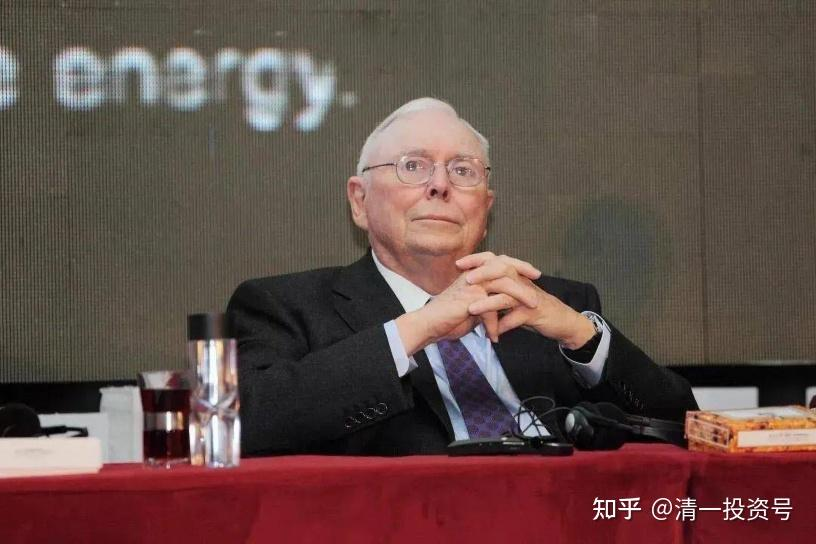

原雪球专栏[209篇.无为而教的示范：大道至简，教学可以很简单](http://link.zhihu.com/?target=https%3A//xueqiu.com/9310099567/199021364)

清一山长 2021年9月28日

最近我要带公主班的课程，还有清一大学（高中部）的学生，还要带最新一期的心理行为课程，有点忙不过来了。所以，9天前，就给高中生们布置了课题，实施**“无为而教”**，让他们这段时间，自己教自己。我相信比我自己亲自教的效果更好。老子的教诲，是“用之不勤”，不要老师忙死，学生却懒死，天天课堂上睡觉。你们要学这种教学方式吗？可以把我布置给学生的题目给你们看。让你们知道我的清一大学少年班，在教什么东西。你们学不学，是否学得会？我就不知道了。

我相信：我这样训练出来的高中生，是你们这群大学生、研究生，都PK不赢的强对手。不服的话，就写出你们的作业来，跟他们比一比，我过几天会把他们的作业发上来的。这段时间，男生班和女生班，每天PK一次，天天打得不可开交。因为我告诉他们：**赢家可以选人来参加我的私家心理行为课程**。孩子们为了获得机会，都想在PK中胜出。当然，现在青春期的男生、女生，都不希望输给对方。所以，都在认真的学习，写作业。

**芒格给大学生的演讲，内容很深，价值很高。如果你只是泛泛地读过去了，其实没啥价值的，你可能啥都没学会。你只有认真的反复阅读、思考，你才能吸收一些有价值的东西**。我布置的课题，就是让他们必须每天不停地阅读和思考，然后——就可成为更有思考力的人。

这种无为而教，我当老师的，似乎布置了一道题目之后就啥也不管了。学生们每天忙忙碌碌的，也不敢松懈。这样的教学方式，看起来很简单，其实要能实现教学效果，要求的难度极高。基本上，是你们无法模仿的。我估计：除了我的学生之外，其他学校采用这个方法极难，稀有人及之。至于原因，就不分析了。“功夫在诗外”。这是老子的智慧——“无为而无不为”。跟你们不会做事的无能为力，是两回事喔！

这次先公布题目，下次再公布学生们的PK作业结果。有兴趣你们就自我训练一下。表面上，是让学生写**“小故事，大智慧”**，其实核心要求，是让学生们**深入理解芒格的思想和精髓，跟巨人学习、共振，这样才能成为巨人**。单纯的学习讲解，没啥好的效果。不如让学生们自己去动脑子。

**作业：芒格的文章中，有很多非常重要的内容和思想。如果泛泛地读过去，就太浪费资源了。请大家用“小故事，大智慧”的方式，写出针对文中，最能打动你的一个思想、一个启发，写出一个个的小故事来。围绕着一个核心观念，把这个思想和原则，进行深度的理解、解析，成为让人能够欢喜接受的“小故事，大智慧”。**

**请高中的男生班和女生班的学生，分别写出你们的“小故事，大智慧”。然后进行故事写作排名榜。女生班和男生班，每天分别选出自己的前三名，然后把当天的六个故事，交给武道馆，让武道馆评出这六个故事的名次。六天选出36个故事。**

**要求是：每天写一个新故事，做一次新排名。第二天：每个人重新再读一遍芒格的文章，再重新写一个新的小故事，新的大智慧。与昨天自己的内容，必须是完全不同的新故事、新观点、新构架。你们可以换题材，换内容，换角度，也可以不换，然后继续评选排名。**

**这样重复一周。这一周，你们就只做一件事情：根据本文提供的材料，写“小故事，大智慧”。每天排名一次，六天，每个人都要写出六个故事，得到六个排名表格。最终排名第一、二、三名的学生，选出你们最满意的一个故事，我来把你们的“小故事，大智慧”，登到我的雪球主页上，让8万多人，都来阅读你们写的小故事。**

**示范小故事一：**

**一位年轻人去拜访莫扎特。他说：“莫扎特，我想写交响乐。”莫扎特说：“你多大了？”年轻人说：“我23”。莫扎特说：“你太年轻了，写不了交响乐。”年轻人说：“可是，莫扎特，你10岁的时候就开始写交响乐了啊！”**

**莫扎特说：“没错，可我那时候没四处问别人该怎么写。”**

**很多人看了这个故事，可能会完全错误的理解。会认为：想做什么事情就自己做，到处问人证明自己是蠢蛋，还不如别去问别人更好，埋头自己干事算了。的确现在的人，很多人面对自己明明无法解决的问题，也不愿意去求教他人。只会蒙着头自己做，自己找抽。导致自己一生中不断犯下很多很明显、很可笑的错误，简单的事情都做不好。比如：自己也不知道，上大学对自己有何意义和价值。但也从来不去思考和询问，解决自己的疑惑，依然非常努力，或者非常纠结地去跟风，考大学。最终，无论考上，还是考不上，都会让自己很失望。如果他们提前去找真正的专业人士，询问一下。让自己清晰地知道自己上大学的目标，最终，自己无论考大学或不考大学，都很容易解决。这就是一般人容易犯下的错误。而故事中的这个小伙子，愿意虚心请教真正的行家，虽然他没有得到自己想要的答案，但他可能得到了更重要的答案。也许他会重新思考和选择，做出更符合他自己利益的决策。总比自己闷头在家继续写交响乐更好，更容易成功。提前知道“此路不通”，也总比一厢情愿的“撞墙而死”更有智慧。这就是这个故事我悟出的道理！**

**示范小故事二：**

**一位年轻人去拜访莫扎特。他说：“莫扎特，我想写交响乐。”莫扎特说：“你多大了？”年轻人说：“我23。”莫扎特说：“你太年轻了，写不了交响乐。”年轻人说：“可是，莫扎特，你10岁的时候就开始写交响乐了啊！”**

**莫扎特说：“没错，可我那时候没四处问别人该怎么写。”**

**这个小故事的重要启发，就是由于现在教育制度的存在，会导致人们持有一种惯性和错误的认识，就是以为所有的知识和技能，都是我们可以通过学习和教育就能学会的。只要设法找到这个行业的顶尖专家，只要我们自己愿意努力，我们就能实现这些顶尖专业人士类似的成果。**

**其实，这种思想是错误的。我们的教育和学习，只能让我们掌握一些常规的技能。任何行业，要实现如同莫扎特一样顶尖的结果，需要的不再是老师，不再是教育系统和技能，甚至不是自己努力就可以了。而是你对这件事情的热爱和专注，以及天赋，才决定你能走多远。再好的老师，再好的训练，也无法把所有人变成“某种特定的人”，如作曲家。只有你自己，才能让自己成为自己想要成为的人。当老师的，也只是一个指路人，无法帮你实现自己的目标。莫扎特并没有否定年轻人，说他一定就不能写交响乐。只是提示他：可能还需要去准备很多的音乐基础之后，才能写交响乐。如果小伙子真的有对音乐无比的热爱，并愿意为了音乐而牺牲一切，不为名，不为利，去热情地追求音乐的一切，就算他达不到莫扎特的成就，但最终写出一部交响乐来，也并非难事。《寿司之神》里面的主人公，他的技艺，就不是跟老师学的。而是他对寿司的热爱，以及十几年如一日的专注和热情，才成就了他。教师和教育，只能成就中等之才，中等水平。只有对从事的事业无比的热爱和追求，以及不断的行动，才能创造出顶尖的天才！**

**示范小故事三：**

**一位年轻人去拜访莫扎特。他说：“莫扎特，我想写交响乐。”莫扎特说：“你多大了？”年轻人说：“我23。”莫扎特说：“你太年轻了，写不了交响乐。”年轻人说：“可是，莫扎特，你10岁的时候就开始写交响乐了啊！”**

**莫扎特说：“没错，可我那时候没四处问别人该怎么写。”**

**这个小故事，说明了要想获得人生的成功，“选择行业”非常的重要，一旦选择了错误的行业，即使你有才华横溢的“天赋”，也很可能失败。比如，艺术行业，如音乐，就是一个注定只有极少数的人才能成功的，具有超高的就业失败率。只有极其少数的幸存者，才能登上行业的顶峰。因为这些行业，并不需要太多的人，大多数人注定只能成为牺牲者。只有个别人才会成功。比如，现在几百年过去了，都没有第二个莫扎特出现。绘画也一样，几百年过去了，都没有出现第二个毕加索，第二个梵高。但由于这些成功的榜样存在，很多年轻人，很多的父母，都让自己的孩子从小去学音乐，幻想自己的孩子是小小莫扎特。其实只能是幻想罢了。我们可以设想，很多人并没有天赋，而且，就算有天赋，也未必会成功。我相信，就算是莫扎特重新在世，他也未必能够获得一样的成功，他也不再会是当代莫扎特。因为，我们这个时代，不太会给莫扎特时代一样的机会，去当音乐神童，去当作曲家。我们现在，只愿意听一个孩子去演奏莫扎特，而不是听他创作自己的作品，甚至很多人不再听严肃音乐。因此，就算莫扎特再世，也无法成功了。因此，我们不需要去模仿别人，即使是伟大人物的成功之路。我们更应该踏踏实实地去做我们喜欢的事情。如果我们想要成功，我们就去选择世界上有最多人需要的行业，同时别人还做不好的行业，并去设法让自己做得最好。如果这三条都能实现，我们依然是最棒的，最杰出的。就算我们没有做到最好，我们也是成功的，因为这样的行业，对于愿意努力踏实做事的人来说，就没有失败者。**

**示范小故事四：**

**一位年轻人去拜访莫扎特。他说：“莫扎特，我想写交响乐。”莫扎特说：“你多大了？”年轻人说：“我23。”莫扎特说：“你太年轻了，写不了交响乐。”年轻人说：“可是，莫扎特，你10岁的时候就开始写交响乐了啊！”**

**莫扎特说：“没错，可我那时候没四处问别人该怎么写。”**

**这个去向莫扎特请教的小伙子，我们看了故事会认为他很愚蠢。莫扎特的回答，看起来嘲笑和贬低了他。其实对他正好是最大的帮助，起码能够让他明白：有些事情，可能并不是适合自己的道路。比如写交响音乐这种事情，可能已经超出了他的能力圈。这个领域，不是靠个人努力学习，就能成功的领域，而是非常依赖天赋的事情。如果他发现了自己不具备这方面的特长，不再幻想自己要在音乐界成功，不再妄想成为莫扎特第二，改变初衷，不写交响乐了，而是去做一些更符合他特长的事情，可能更容易成功。因此，彻底放下音乐梦，未必不是一件好事。也许他去创办企业更符合他的能力，更能符合社会的需要。其实，我们这个社会，并不需要太多的音乐家，有一个莫扎特已经够了，不需要一大群的莫扎特。可我们的世界，需要很多很多的工人和农民，他们比去做一个毫无希望的莫扎特的梦想家，可能更受社会的欢迎，更能帮助到这个世界！**

**示范小故事五：**

**加州曾经有一家非常大的投资咨询公司，为了超过其他同行，它想到了一个点子。**

**他们是这么想的：我们手下有这么多青年才俊，个个是沃顿、哈佛等名校毕业的高材生，他们都为了搞懂公司、为了搞懂市场趋势、为了搞懂一切，不遗余力地拼命工作，只要让这些青年才俊每人都拿出他认为最好的一个投资机会，我们把所有最好的机会集中起来形成组合，必然能遥遥领先指数啊！**

**这家投资公司的人能觉得这样的点子行得通。他们满怀信心地付诸行动，结果毫无悬念地一败涂地。他们又试了一次，一败涂地。他们试了第三次，仍然失败。**

**这个小故事，说明了一个大道理：现代的教育系统，以为自己可以教会学生所有的知识和技能，只要学习优秀，努力勤奋，名牌大学毕业生，你就能获得成功。其实这很可能是一句谎言。很有可能大学教给我们的知识和技能，是完全脱离社会现实的，甚至教给我们的，是可能导致你失败的伪知识，还不如相信社会实践更靠谱。大学并不是无所不能的，是我们希望和想象大学应该无所不能，他们就装成他们似乎什么都懂的样子。起码这个小故事，就证明了：在金融和投资这个领域，现代大学根本就无法教授给学生，如何正确地做出判断和选择，尽管这些大学，都有各种各样的投资理论。但很多很多的事实，都已经证明了：大学的金融教育的确是失败的。甚至大学教育的其他学科，其他专业，都无法帮助学生在金融投资上成功！金融如此，别的方面也一样，以为读了大学，学业成绩优秀，就以为进入社会之后，就会像学业成绩一样的成功。这只是一厢情愿的想法。上大学，和社会化成功，其实没有本质的联系！不要迷信读书上学了。**

**示范小故事六：**

**加州曾经有一家非常大的投资咨询公司，为了超过其他同行，它想到了一个点子。**

**他们是这么想的：我们手下有这么多青年才俊，个个是沃顿、哈佛等名校毕业的高材生，他们都为了搞懂公司、为了搞懂市场趋势、为了搞懂一切，不遗余力地拼命工作，只要让这些青年才俊每人都拿出他认为最好的一个投资机会，我们把所有最好的机会集中起来形成组合，必然能遥遥领先指数啊！**

**这家投资公司的人能觉得这样的点子行得通。他们满怀信心地付诸行动，结果毫无悬念地一败涂地。他们又试了一次，一败涂地。他们试了第三次，仍然失败。**

**上面这个故事，说明了一个大道理：金融市场投资，需要的仅仅是常识。用最简单的方法，就能赚到大钱。美国金融市场长达两百年的历史表明：金融市场是最可靠的投资稳定增值方式，你仅仅只需要买指数基金，就可以胜过绝大多数的主动投资管理基金了。说明：人为的选择，远远不如被动地跟随市场策略更佳。**

**但这个金融常识，因为太普通了，太简单了，所以，只有自认为自己是傻瓜的人，才会去这样做。而这家公司招收的这些聪明人，都不甘心自己只是获得市场平均的回报。他们因为学业成绩一向超过普通人，也自然认为自己可以在金融市场上取得超过普通人的回报。因为他们都有聪明的脑袋，善于去计算各种模型和方法，去创造各种新的金融理论和概念。但最终市场会证明他们才是错的。这说明：在金融市场上玩聪明，总想超越市场，是没有出路的。只有尊重基本的常识才最可靠。**

**如果把这种智慧，引申到实际金融投资中。就可以很简单地发现：绝对不要轻信一些很聪明的股市大V和证券专家的股票投资建议。越聪明，越是吸引你的投资言论，可能就越有毒，越容易造成你的账户亏损。最安全的方法，莫过于买靠谱的指数基金，或者找到一些拥有护城河的行业龙头企业，在低估的时候，不断的坚持买入。然后长期持有，跟随市场一起波动，不要妄图高抛低吸，无视市场的起伏。这样最终坚持下来，一定会战胜最聪明的专家和各路的大V——不自作聪明，就是这个故事最好的启发，也是在残酷的金融市场长期活下来的最关键因素！**

**文章：[芒格分享：让你受益终身的投资常识！](http://link.zhihu.com/?target=https%3A//www.sohu.com/a/442895484_475956)**

**

**

**一、常识：平常人没有的常识**

大家都知道，**所谓常识，是平常人没有的常识。**我们在说某个人有常识的时候，我们其实是说，他具备平常人没有的常识。人们都以为具备常识很简单，其实很难。

我举个例子。大量高智商的人进入了投资领域，都想方设法要比普通人做得更好。许多高智商的人蜂拥而至，在投资领域形成了别处罕见的景象，于是，怪事发生了。加州曾经有一家非常大的投资咨询公司，为了超过其他同行，它想到了一个点子。

他们是这么想的：我们手下有这么多青年才俊，个个是沃顿、哈佛等名校毕业的高材生，他们都为了搞懂公司、为了搞懂市场趋势、为了搞懂一切，不遗余力地拼命工作，只要让这些青年才俊每人都拿出他认为最好的一个投资机会，我们把所有最好的机会集中起来形成组合，必然能遥遥领先指数啊！

这家投资公司的人能觉得这样的点子行得通，是因为他们接受的教育太次了。他们满怀信心地付诸行动，结果毫无悬念地一败涂地。他们又试了一次，一败涂地。他们试了第三次，仍然失败。

几百年前，炼金术士幻想把铅变成金子。炼金术士想得很美，他们觉得买来大量的铅，施一下魔法，把铅变成金子，就发大财了。刚才说的这家投资公司，没比几百年前的炼金术士高明到哪去，它不过是妄想把铅变成金子的现代翻版，根本成不了。本来我可以把这个道理讲给他们的，但是他们也没问过我啊！

值得人深思的是，这家投资公司集中了全球各地的精英，甚至包括许多来自中国的高智商精英，中国人的平均智商比其他国家的人略高一些。其实，这个问题很简单。这点子看起来行得通，为什么在实际中却行不通？你不妨自己想一想，为什么会这样？

你们都接受过高等学府的教育，我敢说，在座的人之中，没几个真能把这事儿解释清楚。我想借此给大家上一课，你们怎么能不知道呢？投资领域可是美国的一个重要行业，在这么重要的一个行业，出现了如此惨重的失败，我们应该能给出一个解释啊！

能回答出这个问题的人，肯定是在大学一年级的课堂上，全神贯注地听讲了的。令人遗憾的是，即使你把这个问题拿到一所高等学府的金融系，让那里的教授回答，他们也答不对。我把这个问题留给你们思考，因为我想让你们感到困惑。

我接着说下一话题了。其实，这个问题，你们应该能答上来。从这个问题，我们可以看出来，即使是一些非常简单的事，要保持理智也特别不容易。人们有太多太多错误的想法，都是不可能行得通的。人们错误的想法为什么行不通，你们却讲不出来。

如果你们接受了良好的教育，应该能一眼看透。我理解的“接受了良好的教育”，是知道什么时候教授是错的，而且知道什么是对的。教授说什么，就是什么，这谁都做得到。关键在于，你要分辨，教授讲的东西，哪些对，哪些错，这才是接受了良好教育的人。

**二、一生抓住少数几个机会，足够了！**

回到投资领域，至少在未来相当长的一段时间内，如果你主动选股，并且妄想无所不知，你仍然跑不赢指数。

在伯克希尔·哈撒韦，在每日邮报（Daily Journal），我们一直比平均水平做得好。问题来了，我们怎么做到的呢？我们怎么做到的呢？答案很简单。我们追求做得更少。

我们从来没天真地以为把一批青年才俊招进来，就能无所不知，无论是汤罐头、航空航天，还是公用事业什么的，都能比别人懂得更多。

我们从来没这么妄想过。我们从来没以为自己能做到，不管在什么领域，我们都能获取到真正有用的信息。我们不把自己装成无所不知。**我们始终很清楚，只要我们特别用功，我们能准确找到少数几个机会。这少数几个机会足够了。只求找到少数几个机会，我们的预期更合乎情理。**

假如你像我前面提到的那家投资咨询机构一样，你去问沃伦·巴菲特同样的问题：“告诉我你今年最看好的投资机会。”然后，你买入沃伦找到的那个最好的投资机会，你肯定能赚翻了。沃伦不可能妄想无所不知，他告诉你的只会是一两只股票。投资咨询机构雄心勃勃，沃伦更知道克制自己。

我的太姥爷，也就是我妈妈的爷爷，对我帮助很大。我的太姥爷是一位拓荒者。他来到爱荷华州的时候身无分文，但是年轻，身体好。他参加了与印第安人打的那场黑鹰战争，在战争中当了上尉。后来，他在爱荷华州定居下来，每次，在出现土地非常廉价的机会时，他就非常有头脑地出手，大笔买入。

最后，他成了小镇上最有钱的人，还拥有银行。他受人尊敬，有个大家庭，过着非常幸福的生活。他刚在爱荷华州定居的时候，一英亩土地还不到一美元，他一直住在爱荷华州，亲眼看到了富足的现代文明在这片肥沃的土地上兴起。我的太姥爷说，他赶上了好时候，一辈子活到90岁，老天能给他几个大机会。

他这一生幸福长寿，主要是老天给他的那几个机会来临时，他抓住了。每年夏天，当孙子辈的孩子们围绕在他膝下时，我的太姥爷总是一遍一遍地讲这个故事。我妈妈对钱不感兴趣，但是她记住了我的太姥爷讲的故事，并且讲给了我听。我和我妈妈不一样，我知道我的太姥爷做得对。

所以说，我还很小的时候，我就知道了，**重大的机会、属于我的机会，只要少数几个，关键要让自己做好准备，当少数几个机会到来的时候，把它们抓住了。**大型投资咨询机构里的那些人，他们可不是这么想的。他们自以为，他们研究一百万个东西，就能搞懂一百万个东西。

玩好投资这个游戏，关键在于少数几次机会，你确实能看出来，一个机会比其他一般的机会都好，而且你很清楚，自己比别人知道的更多。像我说的这么做，只要抓住少数几个机会，足够了。

沃伦经常说：“一个人，居住在一座欣欣向荣的小城里，他有这座小城里三家最好的公司的股份，这么分散还不够吗？”只要这三家公司都是拔尖的，绝对够分散了。广为流传的凯利公式可以告诉我们，在自己占有胜算的时候，在每笔交易上应该押下多少筹码。你的胜算越大、成功的概率越高，你下的注应该越大。

**三、在有鱼的地方钓鱼！切记！**

钓鱼的第一条规则是，在有鱼的地方钓鱼。钓鱼的第二条规则是，记住第一条规则。我们很多人去了鳕鱼已经被钓光了的地方，还想钓上鳕鱼来。在竞争极其激烈的环境中，你再怎么努力都没用。在投资领域，即使很小的机会，也有人在跟踪。

有一次，我参加密歇根大学的投资委员会会议，会议上其中一位取得成功的投资者来自伦敦。这位投资者在伦敦是怎么投资的呢？他看中了撒哈拉以南非洲地区。撒哈拉以南非洲地区上市的公司很少，只能找到几个在粉单市场上市的银行股，于是他买入了这些银行股，能买的量很少。

非洲的穷人逐渐改变把钱放在家里的习惯，越来越多的人开始把钱存入银行，这位投资者也越来越赚钱。最后，他赚了很多钱。没有别人投资非洲的小银行，只有他自己。可惜，这个小小的利基很快被填上了。

作为基金经理，投资撒哈拉以南非洲地区的小银行，为客户赚了钱，下一个投资机会上哪儿找去？利基填平是很快的。一个在伦敦的基金经理都能去买非洲小银行的股票，你说赚钱的利基还能剩下多少？太难了。

**四、走正道，路越走越宽**

在我们生活的现代世界中，有人专门拉别人下水，**教别人频繁交易股票。在我看来，这和教唆年轻人吸食海洛因没什么两样。**蠢到家了。一个已经赚到钱的人，怎么可能以教唆别人炒股发财为生？

电视也是个神奇的地方，在电视上我们经常看见，有人说“我手里这本书可以教会你每年赚3倍，你只要付邮费就能得到这本书。”一个人，突然发现了每年赚3倍的秘诀，怎么可能还在网上卖书？太可笑了。我说的这一幕是现代商业的写照。人们每天都在做这样的事，还自以为自己是对社会有益的公民。

我再讲个小故事，也是关于现代生活的，希望你能从中得到启发。这个故事发生在从前。有个人，他有一匹好马。这是一匹骏马，步履轻盈、毛发光亮。这匹马什么都好，就一个毛病。有时候，它突然脾气暴躁、性情顽劣，谁要是当时骑着它，非得被摔得断胳膊断腿不可。

这个人找到了兽医，他问兽医：“该怎么治治这匹马呢？”兽医说：“很简单，我有办法。”这个人说：“快告诉我吧！”兽医说：“你在你这匹马表现很好的时候，把它卖掉。”

总的来说，沃伦（指沃伦·巴菲特）和我，**我们两个人从来没为了赚钱，忽悠傻子从我们手里接货。我们赚钱，靠的是在买的时候赚。**如果我们卖的是狗屎，我们不会把狗屎说成包治关节炎。

我觉得，别去骗人，还是像我们这么活着比较好。在现实中，骗子总是有。就说那些江湖骗子吧！他们蒙人的伎俩多着呢！**总有骗子利用人性的弱点牟利。我们必须增加自己的智慧，才能远离种种欺诈。**

彼得·考夫曼（《穷查理宝典：芒格的智慧箴言录》作者）和我说过很多次：“**如果骗子知道做老实人能赚多少钱，他们肯定都不当骗子了。**”沃伦也讲过一句很经典的话，他说：“**走正道，路越走越宽。**”此言不虚。

**五、慢一点，我们不在乎**

有些道理很简单，却真的很受用。每日邮报（Daily Journal）做的是难做的生意，为法院等政府部门服务的工作不好做。法院等政府部门需要自动化。别人想占法院等政府部门的便宜，我们没有。我们只是一家小公司，我们做得很辛苦，我们也逐渐占领了很多市场。

速度虽然慢，但前景光明。有钱的好处在于，慢一点儿，我们不在乎。那我们是怎么有钱的呢？我们记住了我的太姥爷的话，机会只有少数几个，当一个机会来临时，我们扑过去把它抓住。想一想，你们的人生是不是这样？

再讲一个我的亲身经历。1970年代，我犯了个错误，一笔该做的投资，我没做。没犯这个错的话，芒格家族的财富是现在的两倍。我犯的那个错太傻了。我错过了那个机会，否则我的资产是现在的两倍。生活就是这样，错过一两个机会，难免的。

**六、老成这样了，为啥还能开心？**

我们这个董事会里的人，大家一起做特立独行的事，共度人生的坎坷，算是够奇葩的了，毕竟我们年纪都这么大了。盖瑞·威尔科克斯(Gary Wilcox)算我们这里的年轻人了。我们是个很独特的董事会。这个案例也值得各位思考。

你看我，岁数这么大了，老成这样了，还活得很开心。怎么做到的呢？这是另一个话题了。

你们愿意听，我再讲两个小故事。下面这个故事是编出来的，但是很启发人。

一位年轻人去拜访莫扎特。他说：“莫扎特，我想写交响乐。”莫扎特说：“你多大了？”年轻人说：“我23。”莫扎特说：“你太年轻了，写不了交响乐。”年轻人说：“可是，莫扎特，你10岁的时候就开始写交响乐了啊！”

莫扎特说：“没错，可我那时候没四处问别人该怎么写。”还有一个关于莫扎特的故事。莫扎特可以说是人类有史以来最伟大的音乐天才。他的生活过得怎么样呢？莫扎特一肚子愤懑，郁郁寡欢，英年早逝。

莫扎特怎么活成了这样呢？他做了两件事，谁做了这两件事都足以陷入痛苦。莫扎特不知道量入为出，在金钱上挥霍无度，这是第一件。第二件，他内心充满了嫉妒和抱怨。谁要是挥霍无度，还充满嫉妒和抱怨，一定能活得又苦又惨，早早离开人间。想活得苦，想死得早，请学莫扎特。

那个年轻人请教莫扎特如何写交响乐，你们从这个年轻人的故事中也能学到一个道理。这个道理是：有的东西，有的人学不会。有的人天生就比你强，你再怎么努力，也总有人比你更强。我的心态是：“那又怎样？”我们现场的这些人，有哪一个是非得站上世界之巅不可的吗？没那个必要。

帝王将相修了那么多规模庞大的陵墓，我总觉得很可笑。难道他们是为了让后世的人羡慕自己？让后世的人在走过他们的陵墓时希望能住进去？（现场笑声）

总之，我们一路走来，很享受其中的过程，最后也做得很好。你可以自己去研究一下，在每日邮报（Daily Journal）公司，在伯克希尔·哈撒韦公司的历史上，一共做了多少个重大决定。重大的决定，平均算下来，每年没几个。

这个游戏的玩法是：始终留在这个游戏里，盯住了，在稀有的机会出现时，别让它溜走，要知道每个普通人能分到的机会并不多。

**七、如何低成本地从错误中爬出来？**

赚钱的秘诀是节约支出、生活简朴。沃伦和我，我们年轻没钱的时候，我们都是省着花钱，把钱攒下来投资。坚持一辈子，最后很富足。这道理谁都能懂。

生活中需要解决的另外一个问题是：怎么才能不付出过高的代价，从错误中爬出来？从错误中爬出来，我们做到了。伯克希尔·哈撒韦，它最开始的生意是什么？穷途末路的百货商店、穷途末路的新英格兰纺织公司、穷途末路的印花票公司。

伯克希尔·哈撒韦是从这些烂生意里爬出来的。好在我们买得非常便宜，虽然一手烂牌，我们还是打得很好。最后**伯克希尔能取得成功，是因为我们换了一条路，改成了买好生意。我们能成功，不是因为我们善于解决难题，而是因为我们善于远离难题。我们只是找简单的事做。**

每日邮报（Daily Journal）公司，我们刚买的时候，它的生意很好做。现在每日邮报（Daily Journal）做的软件生意，很难做。公司的老同事都还健在，在种种机缘巧合下，新的软件生意做得还可以。这生意有潜力，我们也愿意做下去。报纸已经走向衰落，有几家报纸能像每日邮报（Daily Journal）一样，账上躺着数亿美元的股票，还经营着有前途的新生意？我们是最后的莫西干人。

**八、提问环节**

问：您有一句金句，我特别喜欢。您说过，您在招聘的时候，一个人智商130，但认为自己的智商120，另一个人智商150，但认为自己的智商170，您会选择前者，因为后者能把你搞死。

芒格：这说的不是埃隆·马斯克吗？我当然要选知道自己几斤几两的人，不选那些自不量力的人。我自己会这样选，但我也学到了生活中一个非常重要的道理。这个道理是和霍华德·阿曼森学的。他讲过这样一句话：“千万别低估高估自己的人。”

高估自己的自大狂偶尔竟然能成大事，这是现代生活中让人很不爽的一部分。我已经学会适应了。自大狂偶尔能成为大赢家，但我不愿一群自大狂在我眼前晃来晃去，我选择谨慎的人。

问：您说，好机会虽然好，如果做过了，却要吃大苦头。如何不完全错过，又不做过头？如何才能避免进场太晚？如何判断好机会已经过头了？

芒格：把问题彻底想明白，问题就解决了一半。你已经说了，这是个矛盾：好机会，刚开始进场的时候，潜力十足；好机会，做过了头，危机四伏。你脑子里清醒地绷着这根弦，什么机会，是什么类型的，自己去分。这个问题，你已经解决一半了，你不需要我帮你。你自己已经知道该怎么做了。既要看到潜力，又要看到危机。

问：在伯克希尔的致股东信中，您也写了伯克希尔的过去和未来，您讲到了伯克希尔之所以能取得成功的几个原则。我的问题是，伯克希尔作为一家控股公司遵守了一些原则，取得了巨大的成功和优异的记录，为什么其他公司不和伯克希尔学？

芒格：我觉得最主要的原因是学不来。例如，像宝洁这样的大公司，它的固有文化、它的官僚作风，早已根深蒂固，你说怎么能把宝洁变得像伯克希尔·哈撒韦一样？这个问题可以直接分到“太难”一类。太难了，已经不可救药了。

人们还是没意识到官僚主义的危害有多大。伯克希尔能取得今天的成就，原因之一在于总部根本没几个人。伯克希尔没有官僚主义的毛病。伯克希尔有几位内部审计员，总部有时候派他们出去巡查。总的来说，我们没有官僚主义的毛病。

没有官僚主义，上层的管理者头脑又清晰，这是我们的巨大优势。

问：我的问题是关于长期利率和复利的。过去几年，利率一直很低，很难找到实现长期复利的策略。除了投资伯克希尔、价值投资、指数投资，请问能以高复利长期投资的机会在哪里？

芒格：你问我如何实现理想化的高复利，我的建议是，降低你的预期。我觉得，在一段时间里，应该很难。让预期符合实际，对你有好处，你不至于抓狂。我们经常听到有人说，从几百年以来最严重的那场大萧条到现在，不计算通货膨胀，投资股票指数的年收益率是10%。扣除通货膨胀，大概是7%左右。

在这么长的时间里，7%和10%能拉开巨大的差距。我们就算实际收益率是每年7%。取得这个收益率的时机非常完美，恰好是在大萧条之后开始并且经历了人类历史上最繁荣的时期。从现在开始投资，实际收益率完全可能只有3%或2%。未来人们投资的年收益率是5%，通货膨胀是3%，这样的情况完全可能出现。

真出现了这种情况，正确的心态是告诉自己：“即使出现了这种情况，我也能活得很好。”我们这些老年人生活的那个年代，哪有你们将来的生活条件好，你们有什么可郁闷的？

除了正确的心态，如果将来投资更难了，你应该采取什么实际行动呢？答案很简单，因为难度提高了，你应该更努力。可能你努力了一辈子，最后超过了5%，得到的是6%，你应该高兴。

问：在分析一家公司时，您更看重投资收益率这样的定量指标，还是品牌优势、管理层素质这样的定性因素？

芒格：我们关注定性因素，我们也关注其他因素。总的来说，**在具体情况下，什么因素重要，我们就关注什么因素。什么因素重要，需要具体问题、具体分析。我们总是遵守常识——平常人没有的常识。**我刚才讲了，把很多东西扔到“太难”的一堆里，这是平常人没有的常识之一。

问：我还处于不知道自己的能力圈在哪的人生阶段。我想请教您，您是怎么找到自己的能力圈的？

芒格：**知道自己的能力圈的边界非常非常重要。连边界在哪都不知道，怎么能算是能力圈？**没那个能力，却以为自己有，肯定要犯大错。我觉得，你得始终对比自己能做到什么、别人能做到什么，你需要始终坚定地保持理性，特别是别自己骗自己。

从我一生的阅历来看，理性地认识自己的能力这项特质主要是由基因决定的。我觉得像沃伦和我这样的人是天生的。后天的教育很重要，但是，我认为，我们生下来就具备了投资成功所需的性格。我没办法让你回到娘胎中重生。

问：今天的很多问题都是在问您长寿、幸福的秘诀是什么。

芒格：这个很好回答，因为道理很简单：**不嫉妒，不抱怨，不过度消费；面对什么困难，都保持乐观的心态，交靠谱的人，做本分的事**……都是些简单的道理，也都是些老掉牙的道理。**做到了，一生受益。**

**【**出自2019年2月14日，95岁的美国投资家查理·芒格先生在其担任主席的《每日期刊》公司（Daily Journal Corp.）年度会议上发表的讲话**】**