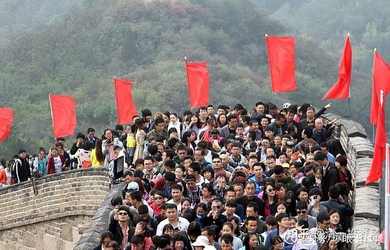
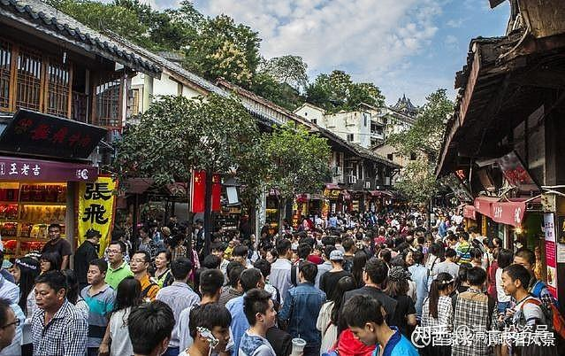
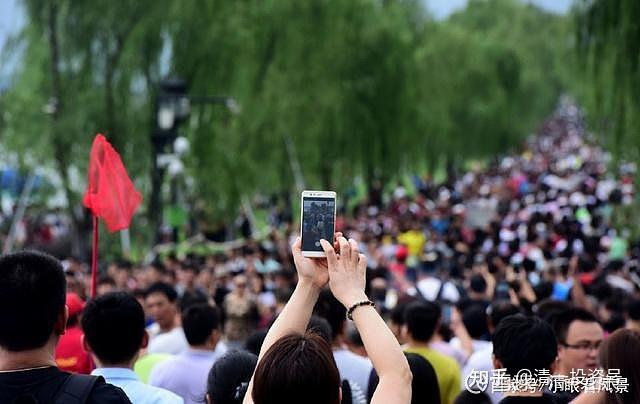

[原雪球专栏](https://zhuanlan.zhihu.com/p/591552552/edit)[212篇.国庆新玩法：一起玩一个世界首富的游戏！](http://link.zhihu.com/?target=https%3A//xueqiu.com/9310099567/199312955)

清一山长 2021年10月1日

今天国庆节，我给公主班上一节特别的课程。下午七点上课，内容是：世界首富把他的壹万亿财产、万亿美金，都送给公主班去帮助全世界的穷人。请公主班你们分的两人小组，每个小组拿出一种不同的方案来使用这些钱（可以只用一部分，不超过万亿就行），作业要求：这笔钱，不能给你们去办学校，只能拿来帮助穷人提升生活质量。看你们能不能聪明地找到帮助穷人提升生活质量的方法。我晚上上课，就针对你们的方案来提出一些问题，看你们如何解决？（**教你们学会企业方案的陈述和应对处理**）。

今天过节，但我们的学校，今天继续正常上课，教师们就当普通的一天，继续带领学生们该做运动做运动，该学习就学习。没有学全国的人，今天跑去什么地方吃喝玩乐。但我们也会玩我们自己更精彩，学生们更喜欢的智力游戏——探索世界首富秘密的游戏。这种游戏，大大增加了孩子们**对于世界财富以及财富使用方式的了解，提高了思维，以及解决问题的能力**。它是课程，也是游戏，玩的结果，无论成败，好坏，大家都很开心。您认为：这样来过节，不比去吃一顿大餐，更有意义吗？

国庆节，“好汉”们都去登长城了！

重庆某古镇的人流，比城中心更“城市化”

闲游西湖，原来大家都是来看人海的，每个人都是一道风景。

羊群效应这么强，怪不得在中国的股市赚钱很轻松。

要不，你们也来做一做这个作业？万亿美金，帮助穷人提高生活质量？如果您的方案很有实施的价值，真正的能够帮助到穷人，我绝对给优厚的打赏。方案好的话，我拿这个万亿的万分之一来为世界做好事，还是没问题的。