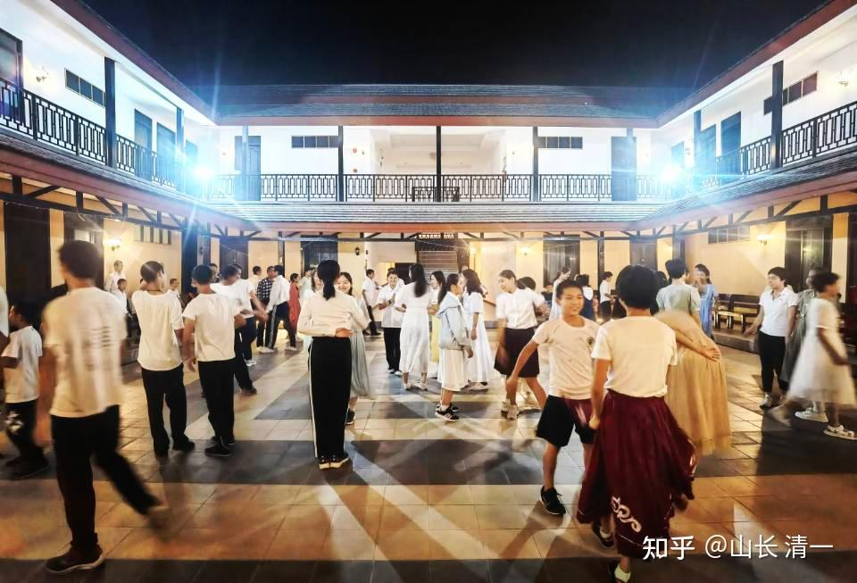
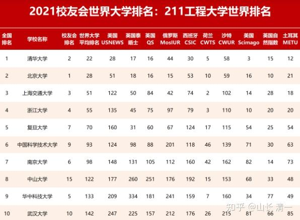

这个社会是分等级的。高阶人士会拿走了最多的机会和社会资源。而低阶人口，几乎完全没有机会。如何突破阶层壁垒，是每一个人都面临的挑战。

大致上：1%的人口，拥有80%以上的社会资源。90%的人口，只能分享其他的20%不到的机会！

一个案例：最近木兰们的泰国好朋友，刚打了一场冠军比赛，拿到了100万的出场费。但一个普通的泰拳手，同样是打一场激烈的比赛，能够拿到的出场费，仅有1000B。干着同样的活，花费同样的时间和力气，都需要竭尽全力去拼搏，都必须冒着同样的危险，两者的报酬差距却是1000倍。原因就是：前者是以冠军的身份，地位来参加全国的比赛。后者只是普通的拳手参加地区的比赛。他们两个人的阶级地位不同，层次不同，造成了财富分配上的巨大差距！与明星拳手播求相比差距更大，他可以拿到一场比赛的拳酬是1000万B，与普通泰拳手的差距是一万倍。他只要打一场比赛，你就算打一生的比赛，都拼不过他。因此：**底层和高层，付出差不多的情况下，回报相差千倍，万倍。**

所以：聪明人，拼命也要竭力提升自己的社会层级，不要在底层卷。傻瓜才会混日子，安心留在底层，而不去努力提升自己的层级。聪明人都懂得---—留在底层的命运，实在太苦了，太悲惨了！有些泰拳手，冒着被KO的危险，来打泰拳实战比赛，可能就只是为了给孩子买两罐奶粉！而顶层的拳手，却轻轻松松的名利双收。

**关系到每个孩子一生阶级地位的筛选，是在18岁以前的教育决定的。**

中国的每一个孩子，18岁以前，都必须通过两场重要的考试，来决定将来他一生中在社会上的档次和地位，层级，收入状况等等。这两次考试，决定了将来他可以拥有什么样的工作，社会地位，阶层，以及关系到他要组建什么层次的婚姻和家庭。

第一场人生最重要的考试，是15岁举行的中考。这个年龄中，有50%的人会被打上“失败者”的标签，不能上高中，只能读技术学校和中专，将来只能从事我们这个社会最底层的工作！也普遍被人看不起，会失去很多很多的人生机会。

第二场人生最重要的考试，是18岁的高考。你将参与一场大约有1000万人参与的考试竞争，目标并不是要“考上大学”，现在的录取超高，考大学已经不再是问题，你们竞争的是“考上985，211大学”。但只有3-4%的成功者，才能够实现这个象征“社会第一等级”的入门证。

**问题一：你愿意去与1000万人竞争获取一个国家的有限职位？**

** 还是愿意去跟200万人去竞争，只有20%的竞争者，却能获取全世界提供的上层阶级的入门证？**

**问题二：你要去跟世界上最勤奋的族群竞争，就算赢了也是惨赢？还是去跟一群喜欢躺平的对手PK，不用太费力就轻松获取超越普通人的成功？**

**问题三：如果要取得同样的学习结果，你愿意用12年时间去慢慢的苦熬拼搏？还是愿意用3年时间去快速突破？然后用剩下的时间来完善自己？补上短板？**

**问题四：你愿意用聪明，而简单的方法去高效学习，取得优异成绩？还是愿意被一群笨蛋强迫着，用复杂而愚笨的方式去低效，重复的劳动？弄到厌学？抑郁？**

这些选择，看上去是非常“理所当然”的答案，当然选择最轻松的路径了。可是中国的家长们，居然都选择了“最艰难的道路”。而这些家长选择艰难道路的原因，是因为有一个家长认为很重要，不可逾越的障碍。其实是可以轻松绕开的“学籍管制”。您说搞笑吗？中国家长其实根本就不会动脑子！他们只会费心费力在最不擅长的赛道上，彼此一起猛卷。

我们就一一来解答这些问题吧？我的解答绝对价值百万，你爱学不学，我无所谓。因为不去采用，是你的损失，不是我的损失！这是我为我自己家孩子，研究教育系统多年，选择的最佳成才道路，友情分享出来罢了。、

**问题一：你愿意去与1000万人竞争获取一个国家的有限职位？**

** 还是愿意去跟200万人去竞争，只有20%的竞争者，却能获取全世界提供的上层阶级的入门证？**

这个看上去烧脑子的难题，其实换句话说，就是：你选择参与中国的高考，与一千万人一起竞争？还是选择参与全世界通用的高考SAT？

**如果你就是学渣，无论这两大考学体系，对你都是没啥意义。**他们都是通过严格的考选，筛选出未来的精英和地底层的工具。学渣在中西两大考学体系中，都只能花钱上一个不入流的差大学，混一张无用文凭。你拿到的证书，无非是证明你在18岁的时候，面对一场人生最重要的淘汰赛，输在未来人生和职场的起跑线上。你们都是被中西两大教育体系严酷的筛选，挑出来的失败者，本质上没啥区别。

**如果你就是顶尖高手，超级学霸**，学啥都很轻松。你选这两大系统任意去考，去学，都完全无所谓。在中国，在海外，你都是成功者，顶尖待遇的职场，都会对你敞开大门的！无所谓优劣。

**但如果你的孩子，就只是中等资质，你对赛道的不同选择，就很可能决定你孩子的一生成败。**选错了赛道，孩子一生就算是非常的努力，也很可能收获失败的结果！

首先，中国有两道对人才进行筛选的关卡：中考和高考！

**第一关是15岁的中考。**中国几乎强制性地要求初中升学考高中，但名额上，只有50%的学生，才能够上普高。目的是通过这种方式，强行把不会读书的一半的人选出来，未来去当工人！中考失败的学生，就只能上中专和职业学校。这就是提前分流----**如果你的孩子15岁考不上高中，基本上你就只能生活在社会的底层了**。好一点的工作根本就别指望。优越的社会地位也别指望，你就是一个底层劳工的命运。你的人生发展空间。由于你15岁的失败，就已经被固定了阶层---不入流的下层阶级！

**第二次中国的阶级分层筛选，是中国的高考。**你要参与的，是与1000万同龄人进行一场每年一度的竞争和比赛。这个考试更残酷----真实比赛的考试内容，并不是比你能否考入大学？而是比拼谁能考入985/211大学。如果你能够成为这3%的赢家，你就可以得到这个国家职业机构提供的最好职场机会！如你很不幸运，你这一场考试也失败了，你就只能去一个三流大学，你的人生地位和命运，与中考就被分流，只能去底层打工，送外卖的人基本上毫无差别。但你更悲催，因为你花了更多的成本来做底层的工作——更多时间，更多的学费来上大学，其实你只是给这些打着大学之名来发文凭的商业机构额外送钱罢了。**只有顶尖的大学，才能真正给你好的职场机会。**最优秀的企业，也只去顶尖的大学校招！普通大学的学生，根本没机会接触到我们国家的顶尖企业，最高薪酬和最好前途待遇的企业。

2021年高考，全国总计高考报名1094.7万人。其中，全国985高校录取人数是18.3万，录取率1.67%；211高校总共录取了52万的学生，录取率4.75%。别忘了这个比率，在15岁之前就已经筛选淘汰了50%的学生，不能参加高考，可见这种竞争之激烈！

如果你把眼光放远一点，去参与世界高考，你会发现不一样的风景。你要参与的，仅仅是与全球200万人考试竞争。如果你赢了，你得到的是包括中国优秀企业在内的，全世界最好的企业，都争着为您提供最好的职场发展机会！SAT虽然俗称是美国高考，但它得到了全世界几乎所有知名大学的认可。一旦取得SAT的优异成绩，你就获得了全世界优质大学入门许可（除了中国大学以外）。中国清北的高材生，大多数本科毕业之后还要去海外读研究生，获取更高的平台。你可以直接就跳过高考阶段， 直接获得清北高材生才能获取的海外名校入学机会。等你毕业之后，你就能够获得包括中国顶尖企业在内的全世界所有企业的欢迎。

而这个全世界的高考游戏，每年仅仅有200万人参加！远远比不上中国高考的1000万人！甚至比中国的研究生考试的人数还少一大半（中国研究生每年都有470万人参加，可谓卷到极致）。更让人惊喜的是---这个考试还可以多次参加考试，你可以拿你考的最好的一次成绩来申请大学！相比中国高考的激烈程度，完全就是如同度假一样轻松愉快！

**近5年来SAT应届高中毕业生考试人数和平均分**

- 在**2016年12月前**考过至少一次SAT的2017届高中毕业生人数 **约172万 平均分1060分**

- 在**2017年12月前**考过至少一次SAT的2018届高中毕业生人数 **约214万 平均分1068分**

- 在**2018年12月前**考过至少一次SAT的2019届高中毕业生人数 **约222万 平均分1059分**

- 在**2019年12月前**考过至少一次SAT的2020届高中毕业生人数 **约220万 平均分 1051分**

- 在**2020年12月前**考过至少一次SAT的2021届高中毕业生人数 **约151万 平均分 1060分**

**2021年，SAT的大学基准分数线是：阅读与写作480分；数学530分。每年居然只有45%的人，能够超过这个大学基准线。**也就是说：每年能够通过SAT大学基准线的全球学生的总人数，只有几十万人而已。大致上只是与中国211大学录取人数差不多。**能够达到1400-1600分数段的总人数，仅有11万零8704人。**而这一年全国985高校录取人数是18.3万左右。你没看错---只要你能够拿到1400分的分数，你就等于在全球范围内，成为顶流的优等生，远远超过985大学的档次！就算是更差一点的学生，只要能够拿到超过1060分，达到了SAT的大学基准分数线，全球也就只有不到100万人才能达到这个分数。------相比之下，中国每年多少人进入大学？900万人！（当然，大多数垃圾大学，上了也等于没上一样），成为全球每年不超过百万人的精英学生？还是成为中国9百万分之一的学生？我猜你们的前途和命运，不会是相同的！

**可能部分同学和家长会对这个分数感到诧异，为何SAT大学基准分数线如此之低？没错---这个全球考试，不仅参加的人数比中国少很多，而且难度也不高----要考上美国5000所大学中排名TOP100名的优质大学（相当于中国的211大学）。你只需要考到1220分就够了。对于今日学堂的学生来说，是一个傻瓜都能考取的分数！基本没啥难度。与中国学生想上985，211，全家人都一起拼掉半条命的高考残酷竞争相比，实在是温柔极了。只要学生稍稍再努力一点点，就可以轻松越过1400分---这就是世界级比985大学更牛的大学了------全球TOP50名大学的录取区间了（很多中国985知名大学的世界排名，只有200-300名，甚至更低）。**

看上去，这是一个肉眼可见的美好的机会。基本上不需要深入思考，你就知道应该选啥赛道了。但这么好的机会，为啥全世界这么多人，却不去参与？竞争的人为什么会这么少？

答案很惊人，原因其实很简单----不是大家不想玩，而是绝大多数人玩不起这个世界高考！为啥？这个看起来开放，简单，轻松的，对全世界70亿人开放的高考游戏，每年居然只有区区的200万左右学生参加考试，只是因为大多数学生，根本没机会没资格去参加这个考试。全球极少数的富裕家庭，才有能力来玩这种世界高考游戏。你能够参与进去，你将来人生的圈子，肯定身边就是富裕家庭的阶层了。不可能是乡下的穷小子，这就是国外的阶层固化情况！

因为SAT世界高考游戏，是用英语来考试的，对非英语国家的学生来说，外语就成为了最大的障碍。 你必须与五眼国家的母语学生来比拼高考成绩。对于普遍外语教学水平极差的世界各国大众教育机构来说，是无法实现这个“看起来很轻松”的教育目标。这种游戏，一向就只是有钱人家的孩子，才能获取的优质教育机会。只有从小就读高价国际学校的学生，才有机会和能力，去参加这种“国际高考”。如果你只是就读中国的中小学校，学校里面教的这点简单的外语基础，补课的外语水平都极差。大学的四六级英语，对付美国高考都根本不够用！

正是这种“国际教育”成本的高昂代价，形成了一道高高的门槛，导致全世界90%的家庭，对此轻松而美好的机会，只能“望洋兴叹”！这就是所谓的英语霸权-----发达国家，利用自己的天然语言优势，为自己的后代子孙，设置了一道高高的精英大学门槛。其他国家，只有极少数家庭条件良好的学生，能够一路上高价国际学校的学生，才有机会参与他们的设计，一起玩这种：“国际高考游戏”。这样，就成功地避免了大量激烈的竞争，避免了内卷。

不过----世界上，总有规则打破者出现的。中国，是发达国家垄断地位的粉碎机。现在，有一所名字叫做【今日学堂】的傻瓜学校，居然把自己研究了快20年的，超越国际学校的优质教学经验和水平，把原本可以用来卖高价的国际接轨教学过程，教学方法，甚至教学内容，细节等等，居然通过网络直播的模式，完全免费地提供给了大家。让普通人家都能有机会，参与这种【国际高考】。

[这就是今日学堂的个人空间-这就是今日学堂个人主页-哔哩哔哩视频](http://link.zhihu.com/?target=https%3A//space.bilibili.com/487498588)

按道理：这么好的东西，高价的国际学校都没有的高水平突破性课程，居然都免费送给你了，你应该会非常的珍惜吧？但现在看来并不是。因为：这个账号的粉丝，居然只有1.9万。说明只有极少有眼光的人，才会关注它！其他人，要么是根本就不知道这个道理。而是----他们被第二个难题给卡住了。

**问题二：你要去跟世界上最勤奋的族群竞争，取得胜利也是惨胜？还是去跟一群喜欢躺平的对手PK，轻松获取超越他人的成功？**

中国的家长们认为：我的孩子是中国人，当然要选择中国高考！至于代价？家长能支付的都要支付，全家都围着孩子的教育转----于是，家长们的孩子刚出生，就要去抢学位房。上学后，要去抢几百元一小时的课外辅导课程，每年大笔的投入，让高考战场，变成了全世界最热烈的教育战地！无论是职场还是教育界，中国人都是最勤奋的，都是最卷的！另外两个世界级的教育卷王，应该就是日本和韩国了。

在中国，我已经熟悉了中小学生，每天都在努力的上学，晚上很晚，还在努力的写作业，写到半夜。但我在国外，却看到大多数学生，特别是国际学校的学生，每天都在轻轻快乐的混日子，常常放假。怪不得国际高考SAT考的人不多不说（据说美国本土也只有成绩好的学生才去考）。SAT的平均成绩，却只有1060分，低得可笑。这个成绩，我们中国学生花上3年去学习，方法正确的话，就绝对可以过了。学习上，对手如此懒散（当然有勤奋的，只是少数人），职场上，相对来说要击败竞争对手也不难。我们认为是正常的工作和努力，多数国家的人确认为“太努力”了。因此：只要是名校的好一点的专业毕业生，除了发达国家外（因为全世界的竞争对手都来参与竞争），一般的国外，想找一个合适的工作真不难。很容易竞争过当地的土著，找到顶流公司的好工作**。目前，**在中国跟美国进行新冷战，贸易战背景下，中国企业更是要大量的“走出去”，所以中企对海外人才的需求很强！海外企业对真正人才的需求也很强。要是真的有本事，就真不怕没机会。而国内，现在大批有真本事，真能力的员工，依然被裁员，被降薪，完全就不是一回事！因为现在的职位需求太少了！连农民工的工资都在下降了。白领职位就更不用说了。我认为未来中国会跟日韩一样---超级大卷！职场竞争白热化！东亚人，都很善于卷。所以避开东亚的热卷，日子就会很舒服！

**问题三：如果要取得同样的学习结果，你愿意用12年的时间去慢慢的苦熬拼搏？还是愿意用3年时间去快速突破？然后用剩下的时间来完善自己？**

如果说：中国高考，你要跟1000万人去竞争。代价是学区房。你想参加美国高考，SAT你要去读国际学校，要去跟150-200万人去竞争，代价是高学费。

那么：你去学新教育。你的竞争对手，每年就只剩下数百人了。你支付的代价，仅仅只是网费，以及自己用心去跟随。基本上是可说“人人都有机会”。本质上，你的竞争对手只有一个：就是你自己！只要你击败了自己，你愿意认真的学下去，你就击败了上千万人。

因为：新教育走的是一条超级近路----我们发现了全世界都没有发现的【外语教学的秘密】，可以让学生快速达到母语水平，把全世界教很多年都教不好的外语，变成了新教育的优势课程---学生只需半年一年，就可以学会外语基础。三年五年，就达到了母语国家学习12年的程度。目前只有数百名学生在这条超级赛道上跑。

**这么好的事情，比最好的国际学校教学水平高，还是不要钱的“超级国际学校”，全免费提供示范教学。为啥家长还是不选这条近路？非要去绕远费劲花钱的走远路？**

**因为两个原因，让家长认为“近路不好走”，所以继续走远路。实际上，这种思维方式很搞笑：**

第一个原因，是家长认为:跟随示范班学习**，“初高中阶段，的确免了学费。可将来要上国外的大学留学，还是需要支付非常高昂的学费，俺们可出不起”**。这个---看起来的确有道理。但家长不知道的是---除了五眼国家的大学，会利用帝国主义的优势，瞎收全世界的教育行业智商税外，很多欧洲国家的大学， 甚至是免学费的。如德国，法国，西班牙等国的大学，都是这样的-----大学免收学费。自己支付生活费就行了。这些大学对于国际学生也是免费的。

另外---就算你傲气，就是只想学英语，不想学小语种，也有便宜的留学方案。比如可以去东南亚国家留学，上这些国家的第一流的大学，甚至是排名世界前100名的大学（如马来西亚，新加坡的大学），有些比中国的985排名更高的海外知名第一流的大学，也只收非常低廉的学费，基本上与在中国上大学的学费和开支差不多的。所以---认为去读海外大学没钱，是你没脑子，没信息，没思考。你只会只看着美国，英国，加拿大这些传统上收英语智商税的国家大学。没看到海外留学，有钱没有钱，都一样有机会。因为很多海外小语种国家的大学，他们都在意吸引真正的人才。只有五眼国家，仗着语言和文化的优势，把大学当做商业来办，专门宰割外国富裕家庭的学生，大量收教育行业的智商税。

**第二个原因就更搞笑了：家长认为新教育没学籍！**

其实，在今日学堂全日制寄宿上学的学生，无论是海内还是海外的学校，都是有学籍的，都是相关国家承认的正规学籍，不存在家长担心的这种问题。但你自己在家，全免费跟着我们学示范班的课程，肯定就没有“中国的学籍”了。（您别指望业余时间跟学，中国的卷王考试，不会给你的孩子业余时间的，SAT考试，也需要你全力付出）

就算是没有中学的相关学籍，对于你想考大学来说，根本就不是问题-------你可以以社会考生的名义去参加中国高考，只要考上，就可以读大学。中国大学不管你的高中成绩的---除非你是推荐生。

至于你要考全世界的大学，没学籍，更不是问题了。因为美国早就解决了这个问题------美国是允许学生在家学习的，然后通过一个叫做GED的国际标准统一考试，学生通过考试要求后，就拿到了【美国高中毕业资格证书】，等同于美国高中毕业文凭。可以用来考大学，也可以拿去找工作，这个证书是“证明你有高中毕业的水准”。这个考试难度吗？---其实是很容易的。我们示范班的学生，只要认真学了三年的突破班，都可以拿到一个很不错的优等成绩证书。

你只要拿到了GED的资格证书，再去考一个美国高考SAT，或者雅思，托福的成绩，你就拿到了通向全世界大学的入学资格证。根本就不需要什么国家的教育机构，来给你限制“学籍”和“学历”。你为了一个本质上没有啥作用的学籍和学历，苦巴巴的守着一个烂学校，一堆烂老师，一群差同学，不去拥抱最好的大学，这才是你一生最大的损失呢！

**问题四：你愿意用聪明，而简单的方法去高效学习，取得优异成绩？还是愿意被一群笨蛋强迫着，用复杂而愚笨的方式去低效，重复的劳动？弄到厌学？抑郁？**

**谁愿意用愚笨的办法学习呀?你这样想！**

绝大多数人都选择：**跟着大家一起走准没错！**

的确---很多所谓的“教育创新”，就是骗子。孩子的终身大事，不轻易相信骗子，是很明智的决定。别人说什么，你都相信什么，最终一定会被骗很惨的。

问题是新教育的高效学习方式，19年来，已经培养出来了很多人。我们教的学生，一些甚至成了家长们都非常拥戴和追捧的新教育学校的校长和教师，让名牌大学的毕业生竞争者都望尘莫及。因为新教育学校是以教学成绩为标准，让学生来选老师的。学生们都喜欢和选择新教育出身的教师，而不是体制内的硕士，博士等。这些实实在在的结果，不是非常能说明问题吗？我们开发的**创造教育模式----三年学完体制12年课程，**现在已经不是啥“新方法”，而是已经实践了多年，被很多学生采用，并证明是非常有效的创新教育方式。而且：我们还拿出了示范班公开直播整个突破的过程。2019年开始，我们就开始公布每天的教学内容，让你看我们的学生一步一步是怎么走出来的。你不相信结果（可能会作假），但你可以去研究过程，看看这些一步一走出来的路，是不是忽悠人的？

如果你就是不肯用这么轻松高效的方式来学习，就相当于互联网时代，你就是不相信短信，和手机，非要“飞鸽传书”，你才觉得靠得住的话，只能说你浪费自己的时间和精力和金钱，我们没意见！

但你的孩子面对“换维打击”的对手，他们三年就学完你孩子需要辛苦学习12年的内容，恐怕会过得很艰难的！怎么努力，都赶不上别人玩一样就实现的教育目标。

**但骨子里面，家长对“传统路线”，对“体制”的信任和依赖还是很重的。**我们的一些家长，也会在孩子在学堂学得好好的，突然就转学去体制了，生怕“跟不上体制”，要去考体制大学。你们喜欢跟1000万人竞争我们没意见，我们不是没这能力，实在是觉得没这必要。我们可以三年学完美国十二年，你以为我们三年学不完中国的12年？才怪！

只是我们绝大多数脑子正常的家长，不想选这条跟国内上千万人拼杀的很卷的路。他们更愿意选一条甚至不需要跟200万人竞争的路，只跟自己竞争的道路。

我可以非常负责地说一句话：

体制学校的优等生，如果初中时代就来新教育，一样是优等生。甚至体制学校的普通学生，还有一些个别的差生，来新教育成为优等生，一点也不稀奇。

另外---**在新教育很适应，成绩很好的学生，去体制一样会很优秀。**因为我们培养的学习能力，是兼容中外的体制学校的，认真学习的学生，去体制可能混的比一般同学更好不奇怪！

但：**如果在新教育学堂都不适应，学不好的学生，家长认为转学去体制学校，是绝对不会变得更好的。只会变得更糟糕**。一个人，给他一把枪都打不赢人。你认为换种方法，让他徒手去拼，却指望他取胜？这不是笑话吗？

所以---如果在体制学校学不好，也许新教育可以有拯救你孩子的机会。

但是，如果给他新教育的条件和环境下，居然这孩子依然学不好，这样的学生咋办？其实只剩两条路好走了：

1：要么就是家长犯傻，孩子不愿意好好读书，也愿意拿钱出来养着他。就家长出钱，让他去国外读个普通大学，混个几乎就是没用的文凭出来。海外的普通大学，只要给钱就能上，天天吃喝玩乐的也可以毕业，过完四年，就给你发一个文凭打发你回家。回家肯定是找不到工作的留学垃圾（海外垃圾大学，也不可能被优秀企业的HR认可的），只能回家继续躺平。家长在家给他养老，这样就行了。

2：如果家长务实一些，也不想白白的浪费投资的话，在新教育还不好好学习的学生，就让他们直接去打工，去社会上磨炼。自己去生存，当一个蓝领，也可以独立生活，养活自己。毕竟----这世界需要不同的工作人员。不是所有人都能当管理阶层和精英的。普通的工作，也需要人去干的。孩子不努力，家长操心也没有用的。

*这是15岁就已经考过SAT1400分的今日三语学校学生，在举行舞会*

资讯：**985，211工程大学的含金量，与世界排名前200名的大学相比，谁的含金量更高？**（信息解析：就算是中国排名前10名的大学，世界大学排名往往很难进入前100名。北京外国语大学，上海外国语大学这样的211工程大学，世界大学排名是1600名左右。中央民族大学，中国矿业大学这样的世界排名。直接掉到了2000至3000名。因此，显然只要你考入一个世界排名200名以内的知名大学学习，你的个人“身份排名”是绝对不亚于985大学的。你将成为【世界一流人才】。起码证明你在18岁的时候，你是有这份实力和自信的！

思考题：

1：中国第一档人才的代表是985高校学生，每年大约录取18万人。你认为与中国的1000多万考生，去竞争每年只有18万学生才能考取的39所中国知名大学的名额更容易呢？还是与全世界的所有学生，去竞争每年只有12万人才能达到的水准，进入世界TOP50大学更容易？

2：中国211大学总共有116所，每年录取52万学生。你认为进入中国TOP100大学更容易呢？还是考入世界TOP100大学更容易？

3：你认为成为1.34亿人口（每年全世界出生人口）中，成为其中最顶尖的，只有百分之零点一的优胜者更容易呢？还是成为中国只有十分之一同龄人口中的1%优胜者更容易？哪一种竞争的难度降低了十倍？

4：智力正常的孩子，要取得用3年时间学完12年的传统课程，你认为取得这项成绩的最关键要素是什么？家长怎样保证自家孩子符合这个关键要素？

5：新教育的学生，普遍在15岁就达到了SAT1400分的成绩。你认为这些学生在15岁以后的高中三年内，他们继续学习什么内容，会让这些学生进入社会后更有竞争力？还是继续去像中国高考一样努力刷分，争取考到1500分以上更有竞争力？

6：如果孩子的学习不好，你认为是啥原因导致的？作为家长，应该怎样改变这些因素，帮助孩子学习成功？

7：孩子放假在家里，就不爱学习，不想做功课了怎么办？是什么原因导致的这种情况？你认为将来会出现啥问题？