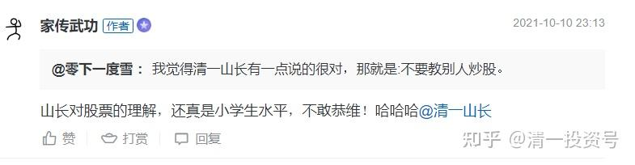
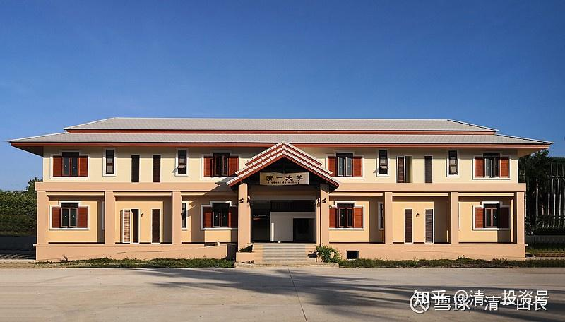

原雪球专栏[216篇.老讲师被中年博士嘲笑只有小学生水平](http://link.zhihu.com/?target=https%3A//xueqiu.com/9310099567/199804049)

清一山长 2021年10月12日

山长对股票的理解，还真是小学生水平，不敢恭维！哈哈哈[清一山长](http://link.zhihu.com/?target=http%3A//xueqiu.com/n/%25E6%25B8%2585%25E4%25B8%2580%25E5%25B1%25B1%25E9%2595%25BF)”

家传武功写了[两篇](http://link.zhihu.com/?target=https%3A//xueqiu.com/5159163033/198256535)[专栏文章](http://link.zhihu.com/?target=https%3A//xueqiu.com/5159163033/191658491)，来回应我昨天的转发小帖。不回复不礼貌，就把我的回复写在这里吧！专栏对专栏[笑]。

您说的真对。在炒股上，我的确只有小学生水平。股市的水太深，学无止境，谁都拿不到博士学位的。巴菲特也说：只要有小学数学的水平，炒股就完全够用了。我承认我在股票上极其的无知，基本上看不懂市场，我还经常看错市场，我知道——**我只能适应市场**。所以，我就只敢在最有把握的时候才买入，只有在最安全的时候才动用融资（比如我的买入收益，能够覆盖融资利息的时候，才上杠杆。我的券商给我的融资利息，只是5%多一些，恐怕比大多数人的融资利息都低。像您这种敢于拿超过本金十倍的杠杆来炒股的，年富力强的博士，我只有惊叹和佩服的份儿，自愧不如。这里真没有嘲笑您的意思，我真不喜欢我胆子越来越小的熊样。挺喜欢您炒股的英雄气，我只是不喜欢您炒股的结果。[加油]

转发您的帖子，倒不是要用我的资金实力来嘲笑您，故意贬低您。我的粉丝，应该都知道我的市值大致上是多少数量级的，不需要我来证明什么。您的粉丝，基本上只会认为我只是个吹牛狂，我说出来只会被人骂骗子。如果仅仅是因为您只有几十万的本金，我就跑来笑话您的话。雪球上的人，真的多到我笑不过来的。因为我知道中国90%的股民，资金都不到50万，嘲笑你们这些人，有啥意思？还不如去嘲笑某些比我有钱的人，还没我聪明，更有意思，更有成就感。就像您一样，您就可以来笑话我——钱多人傻！只有小学生水平[大笑]。

我也承认我的确傻。钱也不多——跟很多有钱人相比。您知道，人比人，气死人。我如果要找人显摆聪明，我看不如去找许家印，说说他有多笨，要我来干他的位置，我就会如何如何英明之类的。比如建议许家印把他的钱都拿来买几大银行股，做大股东，就世世代代都是超级富豪了，不至于破产了。但我不会这样做的。许家印就算破产，起码他也曾经风光过、成功过，还是超级的成功过。他依然是英雄，只是他是一个失败的英雄；他依然有很多值得我学习的地方——除了上杠杆太激进，十倍杠杆玩恒大，把自己玩死了。我很惋惜：我认为恒大好好的一家企业，就是被他拼命大干快上上死了的。他保守一些，恒大不会这样子的。

**股市不分大小，只有输家和赢家**。很多亿万资产的大户，亏起来也一样凄惨。比如上了十倍杠杆的许家印。我猜想，你我都不愿意坐他现在的位置吧？我说我每年的分红收益超过千万，这的确是真的，没必要吹牛。仅仅[中国建筑](http://link.zhihu.com/?target=https%3A//xueqiu.com/S/SH601668%3Ffrom%3Dstatus_stock_match)一只股的分红，就超过我千万股息的一半了。目前**中国建筑是“重仓套牢持有中”**，看起来是一笔不太成功的投资[哭泣]。我还用了融资杠杆拿了中国建筑，目前5%的红利，15%的ROE，20%以上的PE资产净值率，我用5%多的融资利息拿他，这样才敢动融资。而且，就算如此有吸引力，我也不敢满仓满融，只动用了比我的总市值大约四分之一的融资总额。目前账上的融资额度还有不少空余，但我真不敢动心去用光融资额度——尽管看着很多银行股和中国建筑馋得流口水。所以，显然您说我不会炒股是说对了！我也不是职业炒股人。我只是一个不拿薪水的文教师（学生交学费，但我不拿薪水，全捐出去建学校了），同时还是一个赔钱教学生的武教头。今天上午，我刚刚给学生上完课。跟您相比，实在离专业投资人的高尚形象相距甚远。我不怕丑，披露这些消息出来，很让您笑话吧？炒股上，您显然比我这小学生强得多，炒股理论水平也很高，动用融资能力也更强，虽然炒股结果不太理想，但炒股的过程很精彩。我真的自叹不如[献花花]！

不过，我转载您的文章，发表一点评论，目的倒不是想要嘲笑您。每天都有爆仓的人，每天也有暴赚的人。有空去嘲笑别人，嫉妒别人，不如自己埋头苦干更好。我费力发帖子，是犯了一个老毛病：“人之患，在好为人师。”您别忘了我的老本行是教师，虽然是不赚工资的教师。我只是无意中看到您的上一篇述说您不到40万本金匹配了700万总市值的文章，场内场外融资超过10倍，导致自己压力很多，很幸运才勉强躲过爆仓的文章。我转发是觉得可以提醒我的粉丝注意风险，不要乱上杠杆。转发后点评，后来又看了您鼓励女儿炒股的文章。我正好也有个小女儿，估计和您女儿年龄差不多。但我真心不赞同教您女儿做职业股民，同时觉得您女儿真聪明：坚决不学您炒股。估计是您的“身教”不太好，不能让女儿佩服您的结果。虽然您认为过程很美妙。

您30岁才拿到博士，读这么多年书，真心也不容易。您来炒股，原来学的这些知识似乎都用不上。因为小学生文凭，就可以炒股了。您已经浪费了30年的时间，去学一些您也看不起的知识和文凭。难道还不应当珍惜生命，去创造一些真正的价值吗？这就是我发文想提醒您的。

我20多岁研究生读完，就坚决不肯继续读博士了。因为我当年发现：百无一用是书生。所以我30多年前就放弃继续读博士的机会，下海创业经商去了。所以，我跟您一样，很讨厌自己的书生身份，我想做点有价值的事情。实际上，**我更喜欢我的“武师”身份**——目前我是一家自己花钱办的武馆的总教头。我看您网名是“家传武功”：如果您练的是真功夫，大家就同是武林人，您有兴趣，倒是可以互相切磋一下。如果您有本事教出来学生，可以击败我的弟子，我愿意奉上千万奖金给您，恐怕比您奋斗十年，甚至20年来炒股的收益都要高。如果您没有学生，我可以负责帮您找学生，供吃供喝，包职业，包工作，选送您认为合格的学生来跟您学真功夫。只要击败我的弟子就拿千万奖金。就算没有击败，只要您教的是真功夫，我也每个月发一份武术教练的工资给您，这不好过您每天炒股盯盘还不赚钱吗？您专炒银行股，有啥好盯盘的？每个季度看看报表就行了！选好了股，甚至几年都可以不调仓的。

当然，如果您的家传武功，是指您炒股的武功，或者是跟马保国他们差不多的武功，您的家传，只是一个传说，就算了。以上的话，就当我没说[俏皮]！

您6年来全职炒股，但六年来的总收益，还是负数。如果让我来做建议的话，您是银粉，我也是银粉，我们都同意中国的银行股是有价值的，未来是有前途的。如果您2015年实现账户市值高峰之后，您可以继续保持账户的本金不动。但卸掉融资，等低估的时候，比如2016年2月份，融资全部买入银行股（我就是这样做的，2016年2月，我动用融资大举买入才12.88元的[招商银行](http://link.zhihu.com/?target=https%3A//xueqiu.com/S/SH600036%3Ffrom%3Dstatus_stock_match)等股票），剩下的六年时间，您账户都不用看。每天去做一点给社会创造真实价值的事情，顺便也为自己创造一点剩余价值。我猜，您这样做的话，今天的总市值，恐怕就不是仅仅为了**“回到2015”**而奋斗，早就上了几个台阶了吧？干嘛把职业股民作为您唯一的赚钱选择呢？天天盯盘，辛苦还不赚钱。何苦来哉？

[家传武功](http://link.zhihu.com/?target=https%3A//xueqiu.com/u/5159163033)，礼貌上，我应该回复到您的帖子上。但您的贴子设定必须关注您三天才能发帖，很有大V的派头。我实在没有这个耐心。就发在我自己的帖子上，学您一样给你就行了。再次强调：我没有恶意。没有想踩您来显摆自己上位的意思，也无法达到这个目的。仅仅是一个善意的提醒。也许我的话太直，我的资产值太高，伤了您的自尊心。我为此感到抱歉。但我不想为了让您满意，改换我的真实身份。显然我的转发，已经给您的文章带来了更多的流量，为您加粉还是做了一些贡献的。考虑到这一点，希望您能原谅我的鲁莽。我只是与您意见不一致罢了：我非常地不支持大多数人都来炒股。我认为大多数人不适合炒股，就应该干活去（包括我在内）。不然，大家都学您来专职炒股了，我买的这些企业，谁去干活呢？老板自己干吗？[俏皮]

上图是我自封的私人大学建筑，是个中式的四合院，中间的中空庭院，可以容纳近百人聚会。该小院有八九亩地（4莱多）。环绕楼房的步道有两百多米，每天早上小女在上面跑步，我傍晚会去散步。总共花了几千万砸进去，至今因为疫情，还没有启动使用，当然也没有任何收益可言。我愿意赔钱来玩这些文化教育事业，平衡一下我在股市上抢钱的罪恶感。[大笑]

（以下内容为编者收录）

**评论回复：**

**[清一山长](http://link.zhihu.com/?target=http%3A//xueqiu.com/n/%25E6%25B8%2585%25E4%25B8%2580%25E5%25B1%25B1%25E9%2595%25BF)[2021-10-10 16:59](http://link.zhihu.com/?target=https%3A//xueqiu.com/7881563787/199724207)回复[家传武功](http://link.zhihu.com/?target=http%3A//xueqiu.com/n/%25E5%25AE%25B6%25E4%25BC%25A0%25E6%25AD%25A6%25E5%258A%259F)：**

（[2021-09-19 21:55](http://link.zhihu.com/?target=https%3A//xueqiu.com/5159163033/198256535)[每天一睁眼2000块钱利息：本金40万负债700万的炒股经历](http://link.zhihu.com/?target=https%3A//xueqiu.com/5159163033/198256535)）40万的本金，敢上700万的负债，这种对自己的判断力极度自信的奇人。也值得佩服！我咋就完全不相信自己的判断力呢？根本不敢这样玩。买中国建筑都能亏惨的人，也是稀奇之事。博士炒股，跟小学生炒股一样，没有啥护城河的，出来当职业股民，真是白读了30年。

**[清一山长](http://link.zhihu.com/?target=http%3A//xueqiu.com/n/%25E6%25B8%2585%25E4%25B8%2580%25E5%25B1%25B1%25E9%2595%25BF)[2021-10-10 22:26](http://link.zhihu.com/?target=https%3A//xueqiu.com/5159163033/199737731)回复[家传武功](http://link.zhihu.com/?target=http%3A//xueqiu.com/n/%25E5%25AE%25B6%25E4%25BC%25A0%25E6%25AD%25A6%25E5%258A%259F)：**

[这篇文章](http://link.zhihu.com/?target=https%3A//xueqiu.com/5159163033/191658491)（[战争年代要当兵，和平年代要炒股](http://link.zhihu.com/?target=https%3A//xueqiu.com/5159163033/191658491)），写得很有意思。他也有个女儿，我也有。我女儿很崇拜我不工作就赚钱的本领，但我不教女儿炒股，也不教女儿打工。**只教她学会买股，吃红利，学会做事不要钱，但要让人尊重**。他却表示要免费教女儿炒股，女儿还瞧不起。

他还说了一大堆，炒股人是多么有档次的话。也吸引了很多粉丝跟他学习

我却说：“**炒股根本不创造价值，就是合法的抢钱罢了。利用的是人性的弱点。建议大多数人不要炒股。**”

他跟我还有一个共同点：都是银粉，都在2015年重仓浦发银行，都在2015年市值创造新高。但他创造的市值新高，就是总市值达到了50万。然后到现在都没有恢复失地。我仅仅是浦发一只银行股，利润就超过1000多万。同期利润超千万的银行股，还有招商、兴业、华夏。因为2014～2015年，我主要押宝银行，除了中国建筑之外。2015年的新高过后，我不断有新高，今年也创造新的新高。

我们还有一个共同点：我们原来都买了中国建筑。只是他赔了大本，我赚了大钱。他赔钱后跑掉了，我赚钱后跑掉了。现在我又回来了。

但是，我不敢号称我是银行股投资达人。更不敢说我是中国建筑达人。他的号，自称银行股达人。我更不敢指点江山，鼓励别人，甚至下一代人来炒股。我只敢让人买绩优股后，就死拿利息不放，然后去干自己喜欢的事情，不管赚不赚钱，有价值的事情都去做！他到处鼓励人炒股。**我鼓励人做好事。**

但是，我账户每年的分红，就超过千万。此君总资产现在才30万，加上借贷总共一百多万市值。他自己炒股多年，苦巴巴地守着一点小钱，六年来的总收入是负数。却笑话别人打工工资少的人。还说只有年收入超过50万的人，才懂他，才愿意与他交朋友学炒股。我想：他靠炒股，什么时候年收入能超过50万？这六年，他去当农民工，收入都可以超过50万了。现在他还为了自己的市值超过50万而奋斗。

但他照样可以指点江山：告诉别人，该怎么样炒股！这市场，真有趣！**这样**写文章的雪球大V，应该不少吧！文章水平超过炒股的水平。

**清一山长[2021-10-11 18:45](http://link.zhihu.com/?target=https%3A//xueqiu.com/9310099567/199820345)回复：**

调查一下：博士真有家传武功，会来拿我给的千万元奖金呢？还是不相信我真会给钱？然后每天继续炒股，写文章，无事可做？我觉得：如果他靠炒股，这几十万资本买银行股，要想赚千万，再给他十年，都做不到吧？就算银行股再像2015年一样疯一回，他都赚不了千万的。他何不拼一把，来拿我给的千万奖金，再去玩投资更有劲？博士带徒弟击败硕士的徒弟，也算是武林韵事一桩了！你们认为谁会赢呢？申明：我很愿意输掉这个赌约。如果我的弟子输了，我花千万发奖绝对值。起码说明：中华武术有人来传了。我就不用费劲了。

所以，这个家传武功，如果他拿不到千万的话，你们知道谁真的有实力，欢迎来找我拿奖金。要求：必须是练的中华传统武术，然后用现代格斗规则来正式的擂台比赛，请专业裁判来主持，如果我的弟子输了，我就给钱。绝不反悔！你们知道我拿出千万是没问题的，不是骗子吹牛。你们可以先签订公证和正式的合同再开始训练和比赛。别去找现在格斗选手来冒充，就算来了我也不怕，骗不过我的。只是这样比就没意思了。**中国不缺现代格斗的选手，缺真正的传武人。我是千金买马骨，希望激活中国传武的千里马市场。**

转：目前我是一家自己花钱办的武馆的总教头。我看您网名是[@家传武功](http://link.zhihu.com/?target=http%3A//xueqiu.com/n/%25E5%25AE%25B6%25E4%25BC%25A0%25E6%25AD%25A6%25E5%258A%259F)。如果您练的是真功夫，大家就同是武林人，您有兴趣，倒是可以互相切磋一下。如果您有本事教出来学生，可以击败我的弟子，我愿意奉上千万奖金给您，恐怕比您奋斗十年，甚至20年来炒股的收益都要高。如果您没有学生，我可以负责帮您找学生，供吃供喝，包找工作，包谋前途。还帮选送您认为合格的学生来跟您学真功夫。只要击败我的弟子就拿千万奖金。就算没有击败，只要您教的是真功夫，我也每个月发一份武术教练的工资给您，这不好过您每天炒股盯盘还不赚钱吗？您专炒银行股，有啥好盯盘的？每个季度看看报表就行了！选好了股，甚至几年都可以不调仓的。

当然，如果您的家传武功，是指您炒股的武功，或者是跟马保国他们差不多的武功，您的家传，只是一个传说，就算了。以上的话，就当我没说[俏皮]！

**清一山长[2021-10-11 22:18](http://link.zhihu.com/?target=https%3A//xueqiu.com/9310099567/199835435)回复：**

这件事情结束了，彼此都无话可说。最后做个总结，算是收尾。

1、别人说，2015年的峰值50万，现在只剩下30万本金，不能说是6年投资负收益，因为初始本金只有20万，中间2018年本来赚了300多万的，只是又亏掉了，导致现在账面难看。大家都别误会，他并没亏钱，中间还提了款用的，成本是负数。如果没亏300万，收益率秒杀绝大多数大V的收益。的确——2015年的50万，如果现在持有超过300万以上的话，有6倍收益，的确超过我这六年的收益。承认别人的水平高！（不能说博士！别人说，他没用博士头衔来证明啥，我表示尊重）。

2、别人说，没练过武。自称“家传武功”，是要传自己的三观给自家的两个孩子。但又说**“不客气讲，如果我专心去教武学，我的弟子赢山长弟子的概率至少超过80%”**。这就很牛了。但别人偏就不愿意接这活，千万奖金就帮我省下来了。因为他有更重要的事情要做（就是要做网格交易吗？）。我虽然奇怪，明明有超过80%的可能去赚到1000万元，却轻易放弃机会，有点不好理解。肯定他有把握赚到更多的钱吧？**我也很佩服中国教育系统能培养出这种“高能跨界”人才，从来没学过的专业，也能有把握80%以上概率击败半专业人士**（本人练武大约40年了，一个业余武术爱好者，起码算是半专业人士吧！但我狂妄到自以为我带徒弟的水平，是可以击败武林专业人士的另类业余武者。今天，**我居然被从没练过任何武术的中国大学高才生，一样给鄙视了一回，很有点惊讶。我敢说业余武者超过专业武者，别人就可以说武术小白，也能超过武学专业人员的成果**，这也没啥不可能的。真通了道，啥专业都不在话下的。国外还有一个游泳教练，自己不会游泳，但培养出了世界游泳冠军的案例呢！他如果真的有这种超级跨界能力的话，我相信此人，做什么都能成功的，因为已经融汇贯通了“道”，什么事情，都是想做就做了！就看喜不喜欢做的问题了。投资当然也不在话下。祝福他投资也取得超过巴菲特的收益吧！起码超过我是没问题的。遗憾这种准武林高手，不肯出面来击败我的不肖之徒，我就只能期待别的武林高手，不嫌弃我的千万奖金，能够拿走这笔钱。中国真的不缺钱，但真的很缺传武人才！如果花钱能买来，我觉得很划算！有志气的传武人请找我。

3、**我说“炒股不创造价值”**，我不认为这种判断有错误。但有人非要说“股市有其存在的价值和意义”，非要认为两者就是对立的。我却认为两者同时成立。这样故意贬低别人持不同的意见，就是“小学生级别”，起码是不够有气度，当然视野、角度都不够。不过——**有无价值这种判断，本来就是人心的自我判断，并没有实在的标准，**不需要非要维护啥观点。你说错了，就是错了吧！我还认为白酒没价值呢！就因为我不喝，对我没价值。但并不妨碍我买白酒股，并赚到钱的价值；也不妨碍我花钱买白酒送给工人喝，工人认为有价值。这个是不同人，有不同的价值观。说有价值，没价值都没毛病，没必要有一致的意见。