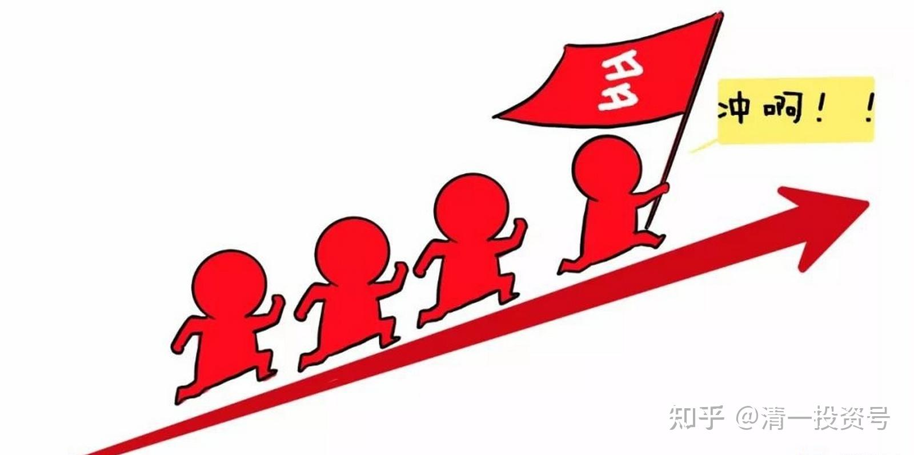
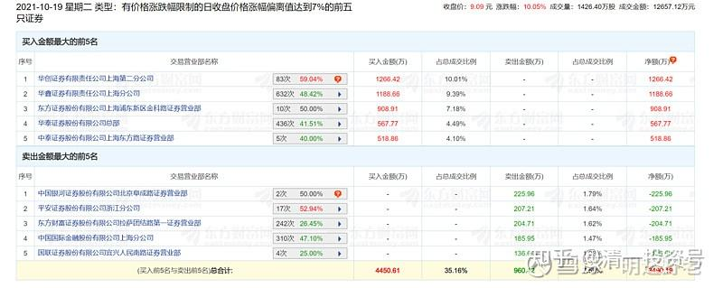
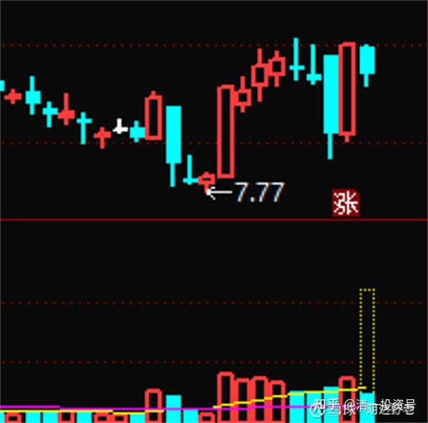
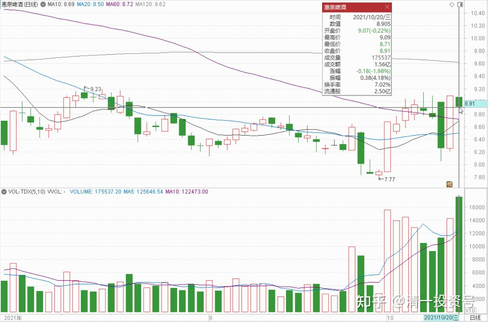
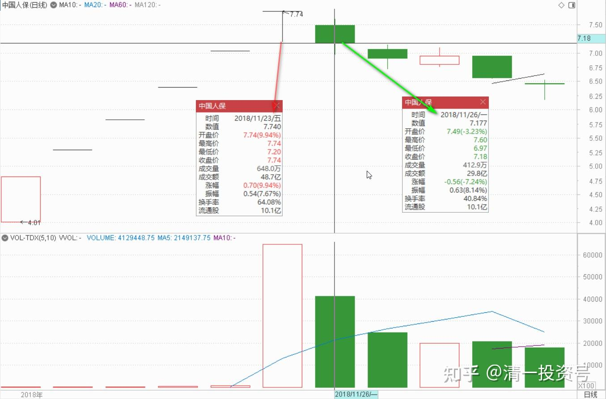
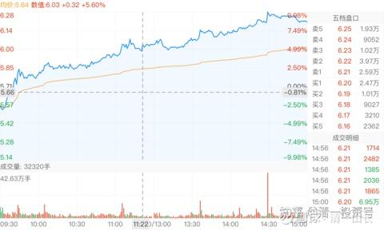

88篇.游资闲谈四：吃亏的游资，饱食的游资

明达野老 2021-10-20 10:22 $惠泉啤酒(SH600573)$

这是什么风把赵老哥和舔血资金吹过来了，又送走了？仔细琢磨，很有意思。

清一山长 回复 明达野老 [2021-10-20 22:57](http://link.zhihu.com/?target=https%3A//xueqiu.com/9310099567/200667032)

可能对比着，看看今天的成交榜单，就比较清楚了。今天成交量放大，看看是不是昨天涨停买的人，今天已经跑了[笑]。显然卖的人没多少，才十几万股的卖单，都上了涨停这天的龙虎榜，说明人气之差，没啥大户持仓了。这股相距仅仅在8天交易日，来了两个涨停，非常的不寻常，成交量其实不算大。而且算算价格差，**其实两个涨停，也没涨多少。说明主力也没真想涨上去**。如果说是上方的压力大，实际抛盘不算多的。看看原来的一个涨停会有多少成交量？现在没有涨停的量，跟涨停量也差不多。甚至更高（比如今天）。这种情况，要么是散货都被某主力全吃光了，散户手上就没啥货。涨停也走不掉几个人。要么都是高位套牢盘，现价没解套，大家都舍不得走。不然这种成交方式，不好理解[为什么]。

[明达野老](http://link.zhihu.com/?target=http%3A//xueqiu.com/n/%25E6%2598%258E%25E8%25BE%25BE%25E9%2587%258E%25E8%2580%2581)回复[@清一山长](http://link.zhihu.com/?target=http%3A//xueqiu.com/n/%25E6%25B8%2585%25E4%25B8%2580%25E5%25B1%25B1%25E9%2595%25BF)：

山长的思考很细致和全面[献花花]我补充一点我的看法：这个盘口给我的直接感受是：有人拿着棍子重新在搅和池塘了，而且还有点嘚瑟（估计是筹码买回得差不多，而且应该还费了点精力和时间），想看看鱼有多少、水有多深、是否是时机把池塘一起兜售出去卖个好价钱了，只是没想到，棍子一动，大买家就想提前介入分一杯羹，主家当然就不高兴了，所以索性就赶走了他们。

这位赵老哥的手法是标准的跟风派，不过，他有他的绝技，就是——二板定乾坤，说穿了，就是类似于技术派的突破理论，突破买入，突破失败就溜之大吉。从盘口上看，我个人估计赵老哥是在10月8日的10点半追进来的，拿了几百万的筹码，可惜，二板失败，后续6个交易日就是赵老哥的出逃时间了，从量上来看，他大头出逃应是在18号开盘的时候，次日涨停（上龙虎榜这天）只是甩最后一点货而已。而主家在清除出这些大号跟风者后（估计主家还赚了T的），就开始自拉自唱了，好不快活！另外，这次更有意思的点是，兰州黄河的盘子怕也是主家的朋友一起在玩吧？

清一山长[2021-10-21 10:49](http://link.zhihu.com/?target=https%3A//xueqiu.com/9310099567/200702969)回复[@明达野老](http://link.zhihu.com/?target=http%3A//xueqiu.com/n/%25E6%2598%258E%25E8%25BE%25BE%25E9%2587%258E%25E8%2580%2581):

兰州黄河，我估计坐庄失败，没有吸引到足够的跟风盘。筹码看起来，像是主力和跟风的一伙，自己吃饱了，所以涨跌随心。但没散户跟风，变不了现的。由于群众基础差，散户没赚到钱，也不会吸引人积极加入。**黄河是典型的游资手法。但相反：惠泉的主力志在长远，稳重得多。**最近出现的局面，不像是惠泉主力的手法。您判断是游资抢盘，很合理。但因为风口不在，勉强乱作盘会坏了原来的计划，成为黄河第二，所以主力不配合拉升。估计游资发现主力没有拉升的愿望，就跑了。原想主力看人抢盘，借机拉升，游资就赚一把快钱，高价抢盘的筹码喂给主力就走，快进快出。结果发现主力没动静，后续再投钱拉升，成本就高了，炒股炒成了股东，自己套住自己，就认输走掉了。应该也没赔钱。最近一次的涨停，可能是主力再次勾引游资的玩笑——朋友别走，我马上就拉升！结果第二天游资追进，主力就把第一天涨停的头寸全吐出来了。**游资又再次吃了亏。**但主力也没有刻意打压，后面略有回升，游资只好放弃跟风，知道该股主力是老江湖。哈哈，这是我讲的故事。不知道真假，看看后续几天的走势就知道了。因为我跟盘很久了，我觉得惠泉主力，就是一个老江湖，善于出奇制胜，你怎么算不准他的。只能坚守原则，被动跟随，不然很容易赔钱——**涨了就走，真低才进**。跟他一起赚慢钱没问题，耐心等他涨停没问题，不然自己想买货卖货都不好弄。有人想赚快钱，往往自己吃亏，被他左右打耳光。

[$惠泉啤酒(SH600573)$](http://link.zhihu.com/?target=http%3A//xueqiu.com/S/SH600573) [$兰州黄河(SZ000929)$](http://link.zhihu.com/?target=http%3A//xueqiu.com/S/SZ000929)

清一山长 2018-11-25 18:04:11

$中国人保(SH601319)$ 看盘心得：人保周五继续涨停，挺了不起的。但是成交量很吓人。换手率64%，成交量48.7亿。我相信人保创造了一个新纪录，一个疯狂的纪录。目前的价格区间，恐怕就是人保近几年的顶部空间了。

换手接盘的人是谁？难道是某位大公无私，专门来解救苦难散户的吗？我看到的盘面记录，是大量的散户在进入接盘的，而之前的很多大仓持有的机构在退出人保。这些人都是最热情的冲版敢死队。据说其他中小创炒作者，由于现在大股东会减持，如光洋股份等，让他们白忙一场。狂炒人保这样的股更安全。估计就是这些资金今天让开板后的人保继续封板了。

以后会不会继续涨上去呢？再来七八个涨停，创造新的中国傻瓜记录？真的傻瓜才会这样想。再涨上去，不是让今天64%换手买入的聪明人都大赚一笔吗？投资界，有谁会拿出大笔资金来“坐庄人保”，目的是帮助“大多数人”致富？一些股票长成妖股，都是前期通过各种手段控盘后，才不要命的拉升的。如全通教育今天6元多，它2015年冲上467元的时候，有几个人手上有这个股？只能看得眼馋，想要就要被套。从年线上，当年的成交量并不大。之后成交量一年比一年大。今年的价格最低，但是成交量最大。充分说明了筹码换手后的结局是怎样的了。

我个人判断：人保发行前，由于并不被市场看好。因此一些有资金实力的游资反向操作，判断中签率会比较高,因此投资大笔的资金来申购人保，自然很多的筹码就被这些游资锁定了。上市之后果断封板拉升，就是要吸引跟风盘进入。看样子他们真的很成功。11月23日先是封板，接下来开板，下行。成交放大。**游资大量回收了资金和利润（其实我判断现在游资的人保成本已经成为了负数）**。但他们还剩余了很多股票没有卖出，所以为了维持股价，昨天继续封板。封板的目标，不是为了下周继续涨停，而是让跟风盘不要被吓走，继续制造幻想。在震荡中才有机会把剩下的股票卖光。等他们彻底卖光之后，你看到的人保，就进入了长期阴跌模式了。而这批活跃的韭菜被收割以后，应该很长时间投机热点会暗淡无光，市场会很难看。等这些赌徒重新筹集了信心和股本之后，继续会开展新的“市场热点”。

这就是中国股市的故事，我25年来已经看过了太多，可惜我看人们似乎并没有从中吸取什么教训。依然是一样的故事。不同的地方，只是涉及到的资金量越来越大了——说明中国散户脑子虽然没有成长，但是腰包还是明显涨了几个级别的[大笑]。

下周判断：大盘恐怕不会有什么惊喜的地方，继续阴跌模式吧！我准备在泰国带孩子们多玩玩，看看风景，如果跌多了，我会用现在腾出来的闲散资金继续买入。如果顺鑫调整到30元区间，我继续无脑买进。一些酒股如泸州老窖等，如果进入14倍以内的价格区间，我愿意“高价”买入一些存起来当老酒放几年。目前市道，在市场上我可以买到还算可靠的企业，价格只卖2PE——4PE股票的时候,我愿意高价来买14PE的白酒股票，真的是要一点不怕死的勇敢投资精神。估计看起来有点像买20倍PE买入人保的狂热吧[大笑]！

清一山长 2018-11-26 10:24:11

**今天一早，人保下跌了7个点。倒不是说明我对了，而是说明市场最终还是有逻辑的。**一个小时就成交了十几个亿。是谁在积极的交钱买单？肯定不是我。也许今天收盘的时候，又会再度封板吧？你们相信这种逻辑的人，今天就赶快抢单，相信某大，相信人保上涨无敌，就去买吧！现在的下跌，是难得的入场机会喔！我就不陪你们玩了。

拉黑了一批无良喷子。理论上，这些没脑子的，乱说话的，缺乏基本教养和品德的人，都应该从市场上消失。当然，这是市场的事情,不关我的事。我能做的，就是让他们从我的世界中消失。让这批人滚远一点去，用你们疯狂的行为来为中国股市做你们有益的贡献吧！感谢你们提供的中国流动性。

**[清一山长](http://link.zhihu.com/?target=https%3A//xueqiu.com/9310099567)**[2021-07-07 17:35](http://link.zhihu.com/?target=https%3A//xueqiu.com/9310099567/189678956)

[$洛阳钼业(SH603993)$](http://link.zhihu.com/?target=http%3A//xueqiu.com/S/SH603993) 今日走势盘后解析。不知道出了啥消息，一点不带回调地涨了20多个点。**洛阳钼业显然这一次，是一次大级别的趋势反转走势，不像是游资暴动。今天的走势超级强势，资金涌入48亿，最高的一单是42.63万手，4千多万股，一笔就吃完了。**可见主力抢筹多主动，多厉害。盘中就完成调整了。

从盘面走势上说，明天继续上涨的可能性较大。但从风险上说，连涨三日，特别今天成交量巨大，回调压力也是很大的，也接近压力位6.48元。但我猜想：恐怕这个压力位，不构成啥真正的压力。万一今天抢盘的人就不想出售换钱呢?可能他们就是钱多多，不需要回笼资金。难说，这股也成了赛道呢？**如果是游资快速进出的，当然会回调，如果是群狼上阵，难说会一路向上。**

当然，正常情况下，明天是要回踩的。但现在似乎不能用正常思路来看了，明天继续观察看。

对我来说，反正持股不多，就40W。涨多少也没赚啥钱，就淡定地看演戏吧！跌了也无所谓的，反正都是捡来的钱。敢跌回原地，起码买过M级再说。[大笑]

参考链接：

[清一投资号：85篇.游资闲谈一：进货与出货手法及散户如何防骗？](https://zhuanlan.zhihu.com/p/585167445)

[清一投资号：86篇.游资闲谈二：快进快出的“小李飞刀手法”](https://zhuanlan.zhihu.com/p/589591604)

[清一投资号：87篇.游资闲谈三：炒股秘诀——看空不做空](https://zhuanlan.zhihu.com/p/591303412)

