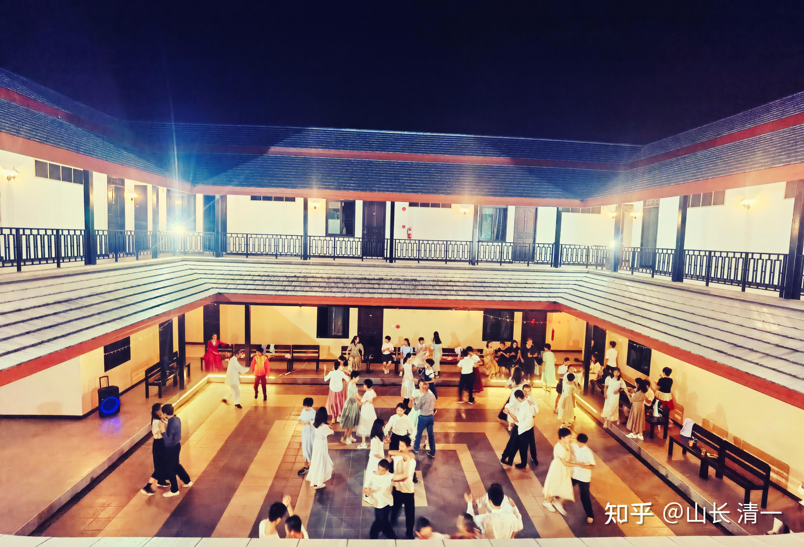
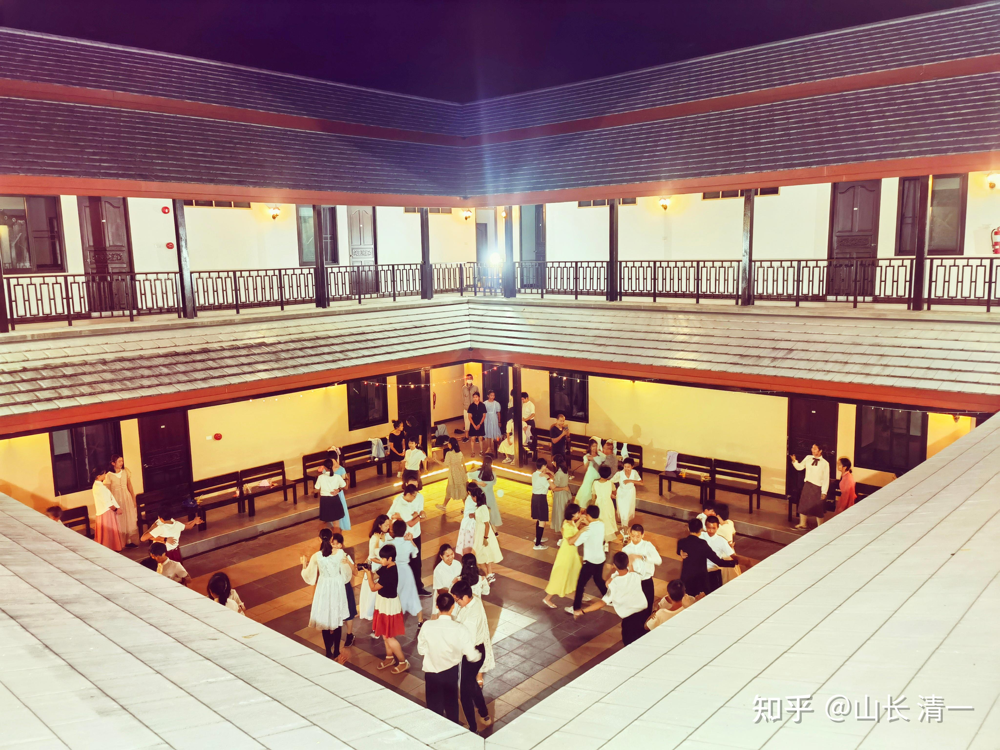
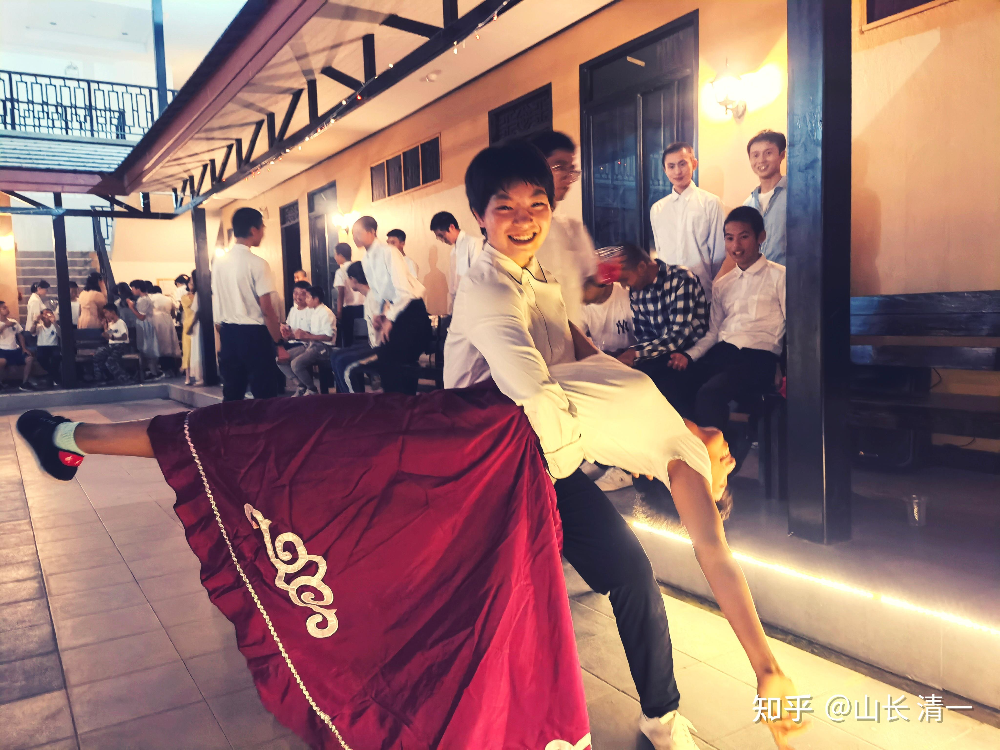

**说实话，开始我是不相信会有这种事情的。清华北大，优中选优，只有尖子中的尖子才有可能实现这种目标。但我看了一个网文，说有这记录。我有些怀疑，就去查了一下原始的资料：原来真的有过这事，真的实现过这种奇迹！虽然原作者的说法夸张了一些。**

**清一新教育正在做的事情，也是找到了世界考试的奥秘，正在把普通学生变成“天才学霸”。而且我知道：十年之后，这一套新教育的方法，就全透明了，很多人正在学习和模仿。将来再玩---就玩不出今天的花样了！ 普通人又会再次失去“逆袭”的机会。**

**下面先看考清华北大的案例：**

转网文：有一个老师叫孙维刚，他是改变了整个中国高中教学法的伟大老师。他自己亲自做了个实验，从初一开始随机挑选一个班级50个学生，一路带到高三，6年时间。最后这些学生99%都考上了清华北大，剩下的也都考上了名牌大学。

实践证明他的方法就是最好的，当时对别的学生是降维碾压打击。但是你现在想要去学习他的神奇教学法，是没有用的。因为孙老师的方法，已经在全国所有的高中都开展了。你们所用的教学法，就是孙老师开创的。也就是所谓的四轮复习法：高二就把三年的课全部学完，高三开始进行4轮的复习。

4轮复习法是我接触过几乎所有高中都在用的，是所有我的同龄人以及现在小孩的共同回忆。但是我表哥，我爸爸他们那时候考大学，是没这个回忆的。他们没有什么XX轮复习法，就是按部就班上课，高三一边学新课一边复习，高考了大家随意考下完事儿。

换言之，孙老师的方法在没有人采用时候，效果特别好。但是推广到全国，所有人都用了这个方法后。效果就消失了。该考上大学是多少人，就还是多少人。但是有一个变化：就是学生的学习强度，高三的受罪艰苦程度。

比我爸，我哥那一代人。大幅提高了。什么叫无效内卷？这个就叫无效内卷。

**任何特殊方法，随着大范围的推广，效果都会消失**

查询结果：看起来像谎言，50个人的99%是多少？49个半人考上了清华北大？原帖作者的数学是体育老师教的吗？不过---为了弄清咋回事，我还是去网上查了孙维刚老师的资料，结果如下：

**【资料：全班40人，38人过重点线，22人考入清华、北大，而当初这批学生入初中时，一半多还达不到区重点中学录取线。**

孙维刚是教学高手，但他不仅仅是培养学习能手，他的学生们说，孙老师首先教我们学做人。1993年的一天，孙维刚因在路上帮助一位摔倒的小贩，到校时晚了5分钟，他在黑板上写下：“今天我迟到了，对不起大家”。然后走出门外，在凛冽的寒风中站了一个小时。孙维刚用自己的灵魂去铸造学生的灵魂，把育人和教学融为一体，更注重的是学生的全面发展。他带的班班风正、纪律好，课堂安静，教室整洁，考试时老师不在也无人作弊。他带的学生不论文化课，还是各种文体活动在学校里总是很突出，甚至到高三时他班上的学生平均身高都高于其他班。】

**他的确创造了奇迹！40中考普通学生，38人过重点线，22人考上清华北大，的确是一大奇迹！也就是方法不同，他走了一条别人没有发现的道路！**

清一新教育，正在创造两个奇迹！

**第一个是创造学霸奇迹：**我们用了一种全新的学习方式，不同于数百年来的工业化体制学校的学习模式。让我们的学生，三年就能学完体制学校要学12年的课程，达到中等以上的程度。然后----如果我们成为顶尖学生，想要上全世界的清华北大，只需要模仿上面孙维刚一样：三年学完12年，达到中等程度之后，再给两到三年的拔高性学习，比如系统地展开【四轮甚至八轮】的复习，提高刷分的专项训练，学生到了18岁，就可以考出世界级别的顶尖高分，成为世界顶尖名校的优等生！

以下直播视频的这些学生，正在完成这个学霸创造的任务---这些13-14岁的学生，正在试图用一年时间学完美国12年的课程！你认为他们在吹牛吗？万一如同当年的孙维刚一样是真的，你居然不懂，恐怕你的孩子就倒霉了！所以，你们最好研究我们三年前第一天开播的视频。一直到今天，以及将来的结果，看看我们是吹牛还是事实！

[【示范班第五学期】第15周 成长日记 2022-12-11_哔哩哔哩_bilibili](http://link.zhihu.com/?target=https%3A//www.bilibili.com/video/BV1md4y1Y7Ag/%3Fspm_id_from%3D333.999.0.0)

**第二个教育颠覆，是我们正在创造【传武颠覆现代武术的奇迹】。**

**准确地说，这是两个项目的同时颠覆：第一个是让学霸成为世界级格斗武士的奇迹，而且实现了业余拳手参加职业拳赛，并击败专业拳手的目标。**

**体育界出现一个学霸谷爱凌，已经让人惊讶莫名。格斗界更是顽强拒绝学霸----泰国500年的泰拳，居然朱拉隆功大学连打进仑披尼赛场的拳手都没有一个。传统的格斗界，格斗手都是睾丸酮较高，而不能安静读书的躁动型拳手。而清一新教育，正在用全新方式，培养一批一批的达到仑披尼决赛水准的，温文尔雅的学霸拳手。**

我们的武医学院，只招收15岁SAT就考过1400分的优秀学生，当之无愧的学霸们进入学习。这些想要把学习传武当做一种业余爱好的人，用业余时间学习古传太极格斗术，就去世界职业格斗赛场上争胜！截止至2022年12月23日，我们已经在泰国打了57场泰拳比赛，70%的场次是KO了泰国人。比较一下知名的泰拳王播求：他在2022年度的战绩，是【420战，370胜，125次KO对手】，KO率还不到30%】。显然，我们中华拳手拥有超高的KO率。那么---我们的拳手，场上被泰国人KO的场次有多少呢？答案是零----你没有看错，至今为止，号称残暴的泰拳从未KO过我们的拳手。相反是“凶猛”的泰拳手，经常被我们温柔的太极拳手KO。即使是在泰国遭遇潜规则，打满五回合被裁判判负的场次，也是我们的拳手在追着泰拳手打。各位可以在本号的视频专栏里面看到这些实战的现场实录。这就是清一教育以文人行武事，“颠覆世界武术”的创造型记录。把中国只是记录在古籍上的传武的威风，重现在今天的现代格斗赛场上！

至于第二个颠覆历史的记录：就是我们是第一个采用中国传武技术来打现代擂台，并成功战胜现代格斗手，号称全世界最凶残的格斗品种---泰拳！而且还是第一个打到仑披尼赛场的中国拳手，达到了很高的战绩和成就！

这两个教育培养的记录和成果，都是清一新教育培养的普通中等生，通过特别的培养方式，实现了正常世界只能是极少“超级天才”才能实现的培养和训练目标！让刚进入格斗场的新拳手就击败了多年征战赛场的金腰带，击败了五百年不败的泰拳。让格斗界以为这些中国新冒出的拳手，都是“格斗天才”。“天生斗士”。可望而不可及。这说明：拥有一种新的方式，心得思路，去玩一些古老却恒久的传统游戏，是多么的重要！

当然：未来我们注定要重复孙维刚过去的成功归于平淡的故事：将来全中国的学生，都学会采用清一新教育的方式去培养学生的话，这些原本普通的学生又将回归普通，而不再是“天才学生”。

等全世界都知道：清一武道馆是怎样培养拳手的？我们的拳手，又将再度成为“普通拳手”。只有少数的天赋超强的学生，才能成为冠军拳手了！

因此---显然现在就接触新教育的家庭和学生，是最幸运的一批人：你们将收获时代送给你们的超前红利，因为他人还坚持传统方式的时候，你们走上了别人不知道的快车道，获得了超越他人的通关密码！

今天：时代再一次将【普通学生考上清华北大】的机会提供给你。你难道还要再拒绝一次超越他人的机会吗？

今天晚上：学生们在慧心楼，自行安排了平安舞会。这些孩子是现在的学霸，未来的武士和木兰，他们是文武（舞）双全的新新人类。

*慧心舞场*

*两个木兰的舞姿：是不是有点像是玩摔跤？*

[!\[image\](images/img_005.jpg)

入场开局 https://www.zhihu.com/video/1590126059185537024](http://link.zhihu.com/?target=https%3A//www.zhihu.com/video/1590126059185537024) [!\[image\](images/img_006.jpg)

https://www.zhihu.com/video/1590126540162830336](http://link.zhihu.com/?target=https%3A//www.zhihu.com/video/1590126540162830336) [!\[image\](images/img_007.jpg)

https://www.zhihu.com/video/1590126592390529024](http://link.zhihu.com/?target=https%3A//www.zhihu.com/video/1590126592390529024)

这些学生都是清一教育的大学预科班学生（高中文科班和公主班）。今年9月开始学太极格斗，大约将在2024年走上泰拳擂台。2025年进入海外一流大学，边学功课边业余时间打职业泰拳比赛。边拿出场费边读书。并创造一系列的格斗奇迹。被人誉为“天才”。其实，她们只不过是掌握了秘诀的普通人，只是愿意积极学习，掌握新的技术罢了。