[原雪球专栏](https://zhuanlan.zhihu.com/p/594100189/edit)[227篇.我家自产新谷上市（品种：糯米）](http://link.zhihu.com/?target=https%3A//xueqiu.com/9310099567/202455371)

清一山长 2021年11月8日

我在泰国，是个不算小的地主，拥有良田千亩。今年的新稻正在收获季，今天去地里收一些谷子上来，以后就可以吃自己家种的新谷子了。未来我们的学员来泰国，都可以享用自己土产的稻米，不用去超市买了。

我买入这些地，没计划用来赚钱，而是**规划为将来万一社会崩溃，我们学堂和学堂的孩子，可以自己种稻子来维持生活，不至于流离失所**。所以，未来的社会经济危机，与我们无关。这算是我**给子孙后代留的一点活命的根基**，所以是计划中不出售的资产。只保留到应对未来的危机，算是一笔保险资产吧？当然，万一将来地价上涨很多，也可以卖掉，但同时也会同步买入低价的田地用于农耕准备。

明年公主班要来泰国生活，这些田地，会提供她们很多的锻炼机会的。我创办的精英教育，不是坐在象牙塔上高高在上的贵族阶层，而是亲近生活，亲民、亲自然的生活模式。

他信和英拉，就是清迈人，也是清迈大学毕业。他们这个家族都很亲民，也很受到泰国民众的欢迎。我们土地上种稻的农民，很喜欢英拉和他信。说他们在任的时候，规定稻米的收购价是12泰铢一公斤，所以农民收入很好，活得很开心富足。现在的政府，却规定稻米收购价仅为6.5泰铢，导致农民收入锐减，一年忙下来，不小心还要亏本。所以，很怀念原来的他信政府。

如果我当领导，我也会提高稻米收购价格的。农民多一点收入，种稻就更有积极性。现在我看到泰国的很多土地，很好的田地，都是荒着的，没有人开发和种植，都在长草，谷贱伤农。这么好的糯米，居然今年只给了6.5泰铢的收购价，的确有点过分。超市的零售价大约是30泰铢一公斤。农民的血汗，都被商家拿走了。对于消费者来说，就算超市里面买多花了5泰铢，也没啥特别的感觉。但农民的售价能够每公斤多5泰铢的话，都要喜极而泣了。

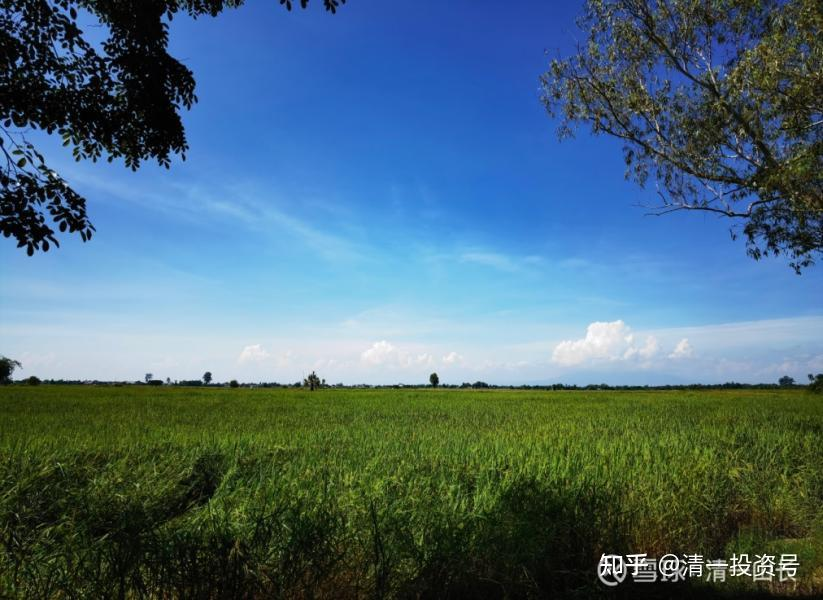

这一大片，都是我们的土地。远处有树的地方，就是土地的边界。

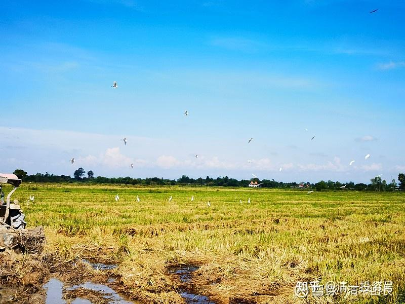

这一片地，是刚刚收割过的稻田。

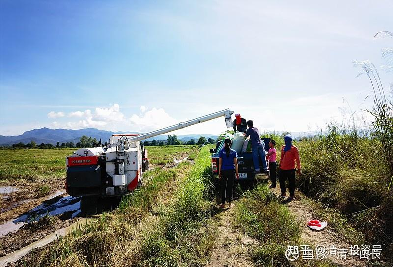

收割后的稻子，可以直接从田里送到拉货的车里面，我们的皮卡可以装一千多公斤。

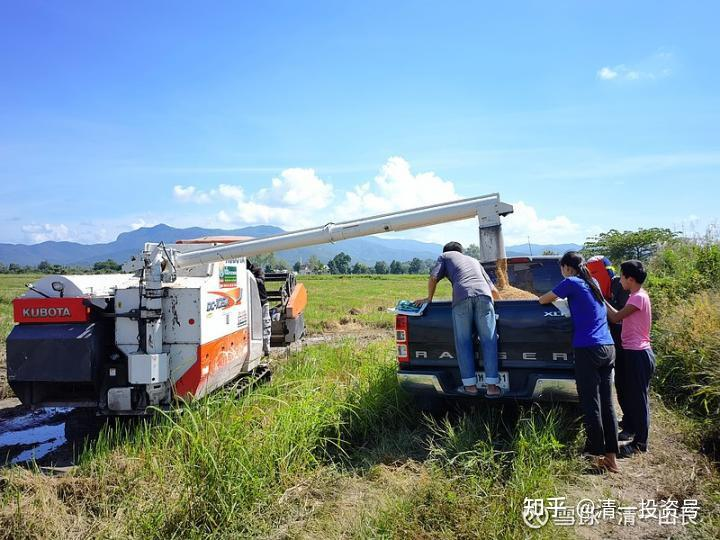

小公主们跟泰国农民一起协助装车。

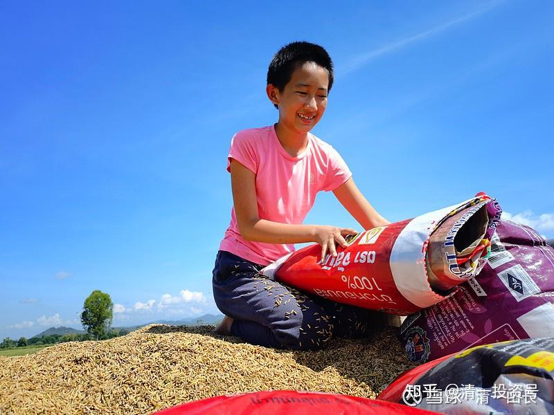

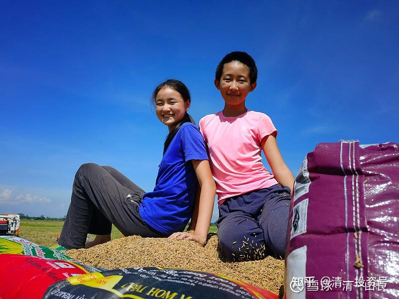

坐到车顶上“压车”，跟泰国的农民一样体验生活（其实皮卡车有五个座位，她们是为了好玩）

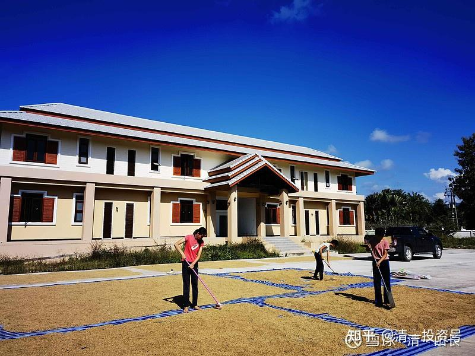

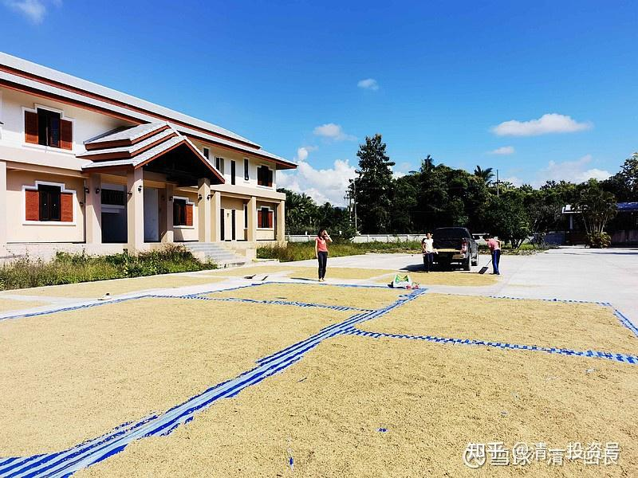

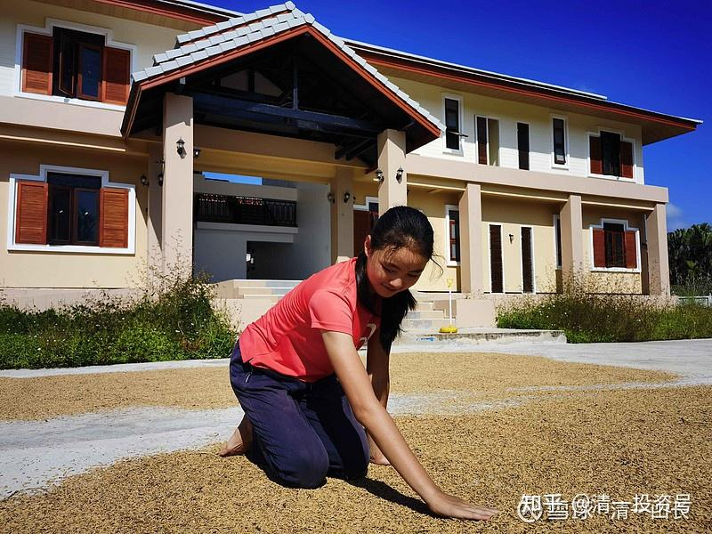

稻子拖回来，在因为疫情闲置的慧心楼门口广场上晒谷子

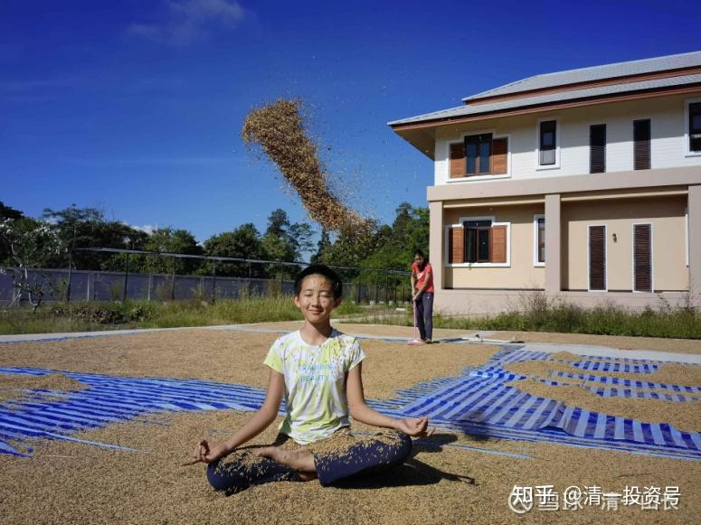

**感受“谷雨淋浴”。**

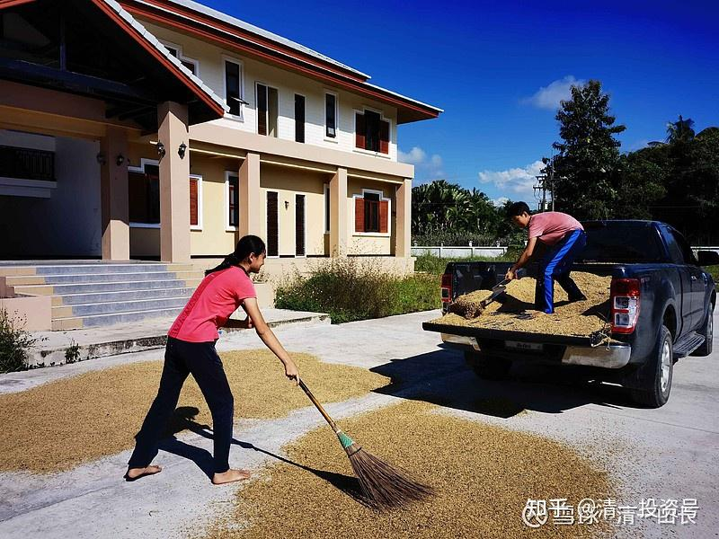

泰国田太多了，耕者有其田。据说，泰国的规则是：一个没有主人的土地，只要有人种田，管理N年之后，就可以申请变成自己的私有田产。所以，一些精明的商人，以及官员，会利用这个机会，大量的占有土地。一些人拥有万亩土地也不足为奇。一些小百姓也会利用这种机会占有公有的土地，我有一块湖边的很好的土地，就是当地人原来“占”过来的。然后200万卖给我，她白白的得到了一笔钱，泰国法律也认。现在她又在附近去占新的土地去了。真的很精明。但大多数泰国人，很淳朴。守住自己的土地，老老实实的生活。这些脑子都不会动。

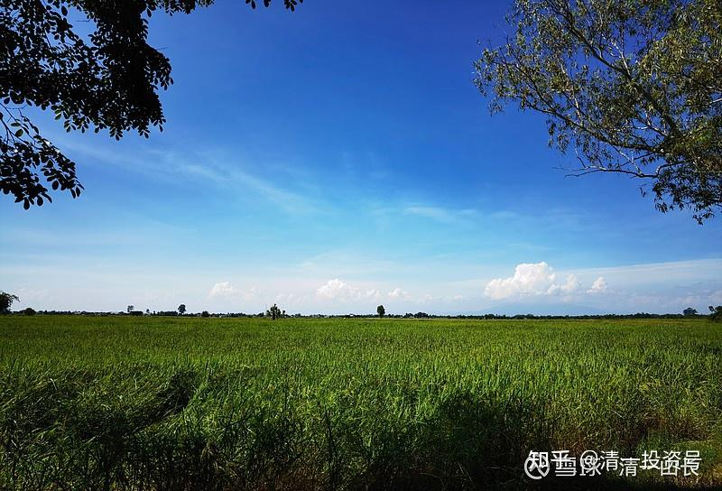

欢迎您到泰国来[加油]，泰国糯米很好吃的喔！今天晚上我带小公主们做汤圆吃，是我自己调的龙眼、椰糖、黑芝麻馅料，孩子们反馈很好吃。

（以下内容为编者收录）
**评论回复：**

**[东西方的雷](http://link.zhihu.com/?target=https%3A//xueqiu.com/8818075239)回复清一山长：**

如果我没记错 外国人应该不可以直接得到农地吧！

**清一山长2021-11-08 13:39回复[东西方的雷](http://link.zhihu.com/?target=https%3A//xueqiu.com/8818075239)：**

对，泰国法律是这样规定的。我们是请泰国朋友帮我们持有这些土地的。

**[Helenkm](http://link.zhihu.com/?target=http%3A//xueqiu.com/n/Helenkm)回复[清一山长](http://link.zhihu.com/?target=http%3A//xueqiu.com/n/%25E6%25B8%2585%25E4%25B8%2580%25E5%25B1%25B1%25E9%2595%25BF)：**

山长，可以卖到中国吗[笑][笑][笑]？

**清一山长[2021-11-08 15:50](http://link.zhihu.com/?target=https%3A//xueqiu.com/9310099567/202474894)回复[Helenkm](http://link.zhihu.com/?target=http%3A//xueqiu.com/n/Helenkm)：**

很快中泰高铁和高速路就通了，就可以卖到昆明来了。现在海运费太高，是不划算出口的。当地出口龙眼、芒果等高附加值的农产品。另外一条道，还可以湄公河水运出口中国去[加油]。

**[找你美](http://link.zhihu.com/?target=http%3A//xueqiu.com/n/%25E6%2589%25BE%25E4%25BD%25A0%25E7%25BE%258E)回复[清一山长](http://link.zhihu.com/?target=http%3A//xueqiu.com/n/%25E6%25B8%2585%25E4%25B8%2580%25E5%25B1%25B1%25E9%2595%25BF)：**

可以学蓝田。稻谷田里面养鱼，这样扩大收入。

**清一山长[2021-11-08 15:58](http://link.zhihu.com/?target=https%3A//xueqiu.com/9310099567/202475648)回复[找你美](http://link.zhihu.com/?target=http%3A//xueqiu.com/n/%25E6%2589%25BE%25E4%25BD%25A0%25E7%25BE%258E)：**

泰国稻田里面有很多鱼，也有很多螃蟹。我看跟国内卖的大闸蟹的样子很像，学名叫做“中华绒毛蟹”的。当地人会拿来做螃蟹酱，长期食用。我们没有吃动物的习惯。你们以后有机会可以来抓免费的螃蟹吃[大笑] 。

**[51nxp](http://link.zhihu.com/?target=http%3A//xueqiu.com/n/51nxp)回复[清一山长](http://link.zhihu.com/?target=http%3A//xueqiu.com/n/%25E6%25B8%2585%25E4%25B8%2580%25E5%25B1%25B1%25E9%2595%25BF)：**

好想吃山长的糯米！

**清一山长[2021-11-08 20:01](http://link.zhihu.com/?target=https%3A//xueqiu.com/9310099567/202497981)回复[51nxp](http://link.zhihu.com/?target=http%3A//xueqiu.com/n/51nxp): **

今晚正在做糯米饼，创新做法，给小公主们吃。北方煎饼的做法，但配料是泰国绿咖喱，原材料是糯米，外加木薯粉。小公主们吃得很开心，做出一个就很快分食干净，一直供不应求。认为拿到泰国卖街头小吃，会很受欢迎。会赚到钱的[大笑]欢迎你来品尝[赞成]。

**[ellhll李华丽](http://link.zhihu.com/?target=http%3A//xueqiu.com/n/ellhll%25E6%259D%258E%25E5%258D%258E%25E4%25B8%25BD)回复[清一山长](http://link.zhihu.com/?target=http%3A//xueqiu.com/n/%25E6%25B8%2585%25E4%25B8%2580%25E5%25B1%25B1%25E9%2595%25BF)：**

感谢山长的分享。看着这样的蓝天、稻田、晒谷场，像是回到了小时候。

小时候收割之后能在稻秆中找到一串稻穗像是捡到宝贝，还有挖野生的茼蒿，到小溪里挖河蚬，帮大人看守晒着的稻谷不被鸡、鸭、鹅、小鸟吃了，赤脚翻稻谷烫得直跳，这些记忆还那么鲜活，似乎还能闻到稻田泥土、沙蚬的味道。两个孩子经常问我小时候玩什么玩具，我说没玩具，最常玩的是田里的泥巴，还有就是上面提到的这些不是像玩一样的做事。这些玩的对象，带着无比浓郁的生命气息。这样的环境，现在在国内已经很少见了吧！我农村的家乡，孩子都不再有这样的儿时体验了。从山长的分享中，我看到泰国还有好多这样的机会。希望两个孩子在长大之前，能有机会体验这样玩一样的做事，打交道的是这些有生命的自然馈赠。希望就有另外，泰国的糯米1公斤6.5泰铢，澳洲这边普通的泰国糯米5公斤1袋是22澳币（550泰铢）**平均1公斤110泰铢**。普通的澳洲当地的大米，最便宜的是半价的时候5公斤8澳币（200泰铢）平均1公斤40泰铢。没有特价的时候，是**80泰铢**。这两个是最低价的，中等的、高等的就更别提了。这样对比山长提供的数据，泰国的消费真的真的很低。

**清一山长[2021-11-08 20:06](http://link.zhihu.com/?target=https%3A//xueqiu.com/9310099567/202498477)回复[ellhll李华丽](http://link.zhihu.com/?target=http%3A//xueqiu.com/n/ellhll%25E6%259D%258E%25E5%258D%258E%25E4%25B8%25BD)：**

做农民真苦，因为他们无法弄到澳洲去，卖110泰铢一公斤。这就是**底层的代价**[捂脸]。**很多利益集团抢夺终端，就是要夺取这样的定价权**。如果让马云来做了，农民直接连接客户，很多超市就没法卖这个价格了。将来我们可以打通供应链，绕过超市，直销客户。我正在打探能不能让泰国农民种国内价值更高的紫米、紫糯米，然后帮他们网络销售出去。比卖普通糯米就强多啦！

**[二马由之](http://link.zhihu.com/?target=http%3A//xueqiu.com/n/%25E4%25BA%258C%25E9%25A9%25AC%25E7%2594%25B1%25E4%25B9%258B)回复[清一山长](http://link.zhihu.com/?target=http%3A//xueqiu.com/n/%25E6%25B8%2585%25E4%25B8%2580%25E5%25B1%25B1%25E9%2595%25BF)：**

山长，咨询一个问题，在我印象中，江浙一带由于温度高，稻米生长周期短，不好吃。而泰国气温不低，为什么稻米香甜？

**清一山长[2021-11-08 20:37](http://link.zhihu.com/?target=https%3A//xueqiu.com/9310099567/202500908)回复[二马由之](http://link.zhihu.com/?target=http%3A//xueqiu.com/n/%25E4%25BA%258C%25E9%25A9%25AC%25E7%2594%25B1%25E4%25B9%258B)：**

不知道[为什么]。江浙一向是鱼米之乡，没这么不堪吧？也许是改良速生种？泰国北部是传统稻米产品，种的应该是几百年的传统老品种糯米、香米等。据说也有产量高、不好吃的新品种。泰国人不太买新品种吃。

**[二马由之](http://link.zhihu.com/?target=http%3A//xueqiu.com/n/%25E4%25BA%258C%25E9%25A9%25AC%25E7%2594%25B1%25E4%25B9%258B)回复[清一山长](http://link.zhihu.com/?target=http%3A//xueqiu.com/n/%25E6%25B8%2585%25E4%25B8%2580%25E5%25B1%25B1%25E9%2595%25BF)：**

超市基本上看不到江浙的米。

**清一山长[2021-11-08 20:51](http://link.zhihu.com/?target=https%3A//xueqiu.com/9310099567/202501955)回复[二马由之](http://link.zhihu.com/?target=http%3A//xueqiu.com/n/%25E4%25BA%258C%25E9%25A9%25AC%25E7%2594%25B1%25E4%25B9%258B)：**

我觉得是产量问题。东北主产区的产量很高。另外，东北的土很肥厚，种植业是近几十年才开发的（北大荒），土壤是很多年的涵养，这些是不是也有关系？不仅仅是气候。不过，真正的原因，恐怕需要问农业专家。云南其实也是稻米产区，但超市卖的大米主要是东北来的，自产的很少。而且价格比东北更贵。我原来在当地，喜欢买本地米，不喜欢买东北米。云南的西双版纳，气候跟泰国差不多。似乎没有说本地米不好吃的。