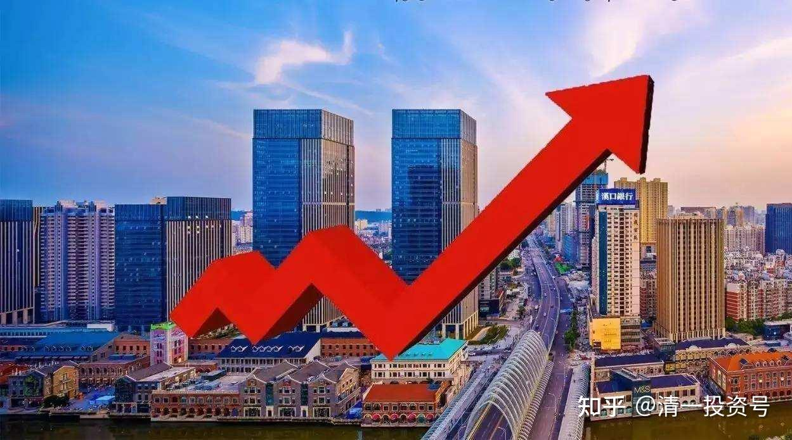

**​**

**

**

25篇.中国建筑系列之二十三：持有中国建筑亏损的几率很小

清一山长 2021年09月05日～10月10日

**导读：**

一、建筑啤酒两头押注，赚跷跷板的钱

二、股票不是看图，要看图背后的故事

三、投资切记杠杆，不亏永远比盈利重要

四、中建不涨也不会让你爆仓

**正文：**

**一、建筑啤酒两头押注，赚跷跷板的钱**

[晕娜](http://link.zhihu.com/?target=https%3A//xueqiu.com/u/1845773477) [2021-09-05 20:52](http://link.zhihu.com/?target=https%3A//xueqiu.com/1845773477/196762274)

[三个股友](http://link.zhihu.com/?target=https%3A//xueqiu.com/1845773477/196762274) 三个股友共同点：都看好中建，历史上都在中建赚的盆满钵满，各有自己的心得。一个股友今年刀枪入库，马放南山，逍遥自在去了。一个股友今年看好啤酒，其他两个股友不为所动，无动于衷。一个股友今年新开仓平煤，其他两个股友不为所动，没兴趣。这就是股市，共同点之外，萝卜白菜，各有所爱，求同存异，取长补短。

[清一山长](http://link.zhihu.com/?target=https%3A//xueqiu.com/9310099567)[2021-09-06 16:41](http://link.zhihu.com/?target=https%3A//xueqiu.com/9310099567/196855841)回复[晕娜](http://link.zhihu.com/?target=https%3A//xueqiu.com/u/1845773477)：

我的建筑仓位比啤酒的更多好吧[滴汗]。啤酒看起来多，是因为把珠江、惠泉两个十大，以及白酒的钱，连本带利，都转燕京上了。一大半是赚的酒钱，以酒养酒。运气还行。建筑，这一年多一直在净投入。只是徐志爆仓之后，就只投中国中铁了。原来的中国建筑也没减仓，晕兄别拿我当外人[笑]，依然在坚守中国建筑。我喜欢分散投资，相对集中。原来重仓有色的退出资金，正在重仓两大建筑中[加油]

[月亮未来](http://link.zhihu.com/?target=http%3A//xueqiu.com/n/%25E6%259C%2588%25E4%25BA%25AE%25E6%259C%25AA%25E6%259D%25A5):

晕兄的小平已经赚了50%以上了，山兄的啤酒不知道什么时候才起飞……

[晕娜](http://link.zhihu.com/?target=http%3A//xueqiu.com/n/%25E6%2599%2595%25E5%25A8%259C)回复月亮未来：

山兄的惠泉，今年没少赚吧！怎么也比中建赚得多吧！

[清一山长](http://link.zhihu.com/?target=https%3A//xueqiu.com/9310099567)[2021-09-06 16:49](http://link.zhihu.com/?target=https%3A//xueqiu.com/9310099567/196856821)回复晕娜：

中国建筑是吃老本。本轮还谈不上赚啥。但以后难说谁更赚钱，我要知道，就不会两头押注了[滴汗]。燕京看样子也快了。两个同步，不喜欢。更喜欢跷跷板，你上我下的就好轮流玩。

[清一山长](http://link.zhihu.com/?target=https%3A//xueqiu.com/9310099567)[2021-09-09 11:46](http://link.zhihu.com/?target=https%3A//xueqiu.com/9310099567/197196557)

$中国建筑(SH601668)$ 我新发的文章，说明我国庆期间会到深圳演讲的文居然被删除了[为什么]。犯了啥规矩？回过头来看，中国建筑居然涨了20CM，一路上攻不回头（对于大建，别人十个点，大建一个点就算涨停了[笑]）。涨个一毛钱，我账上就多百万的浮利润。所以：今天还是应该高兴一点。

**二、股票不是看图，要看图背后的故事**

[第一散户联盟](http://link.zhihu.com/?target=http%3A//xueqiu.com/n/%25E7%25AC%25AC%25E4%25B8%2580%25E6%2595%25A3%25E6%2588%25B7%25E8%2581%2594%25E7%259B%259F)回复[清一山长](http://link.zhihu.com/?target=http%3A//xueqiu.com/n/%25E6%25B8%2585%25E4%25B8%2580%25E5%25B1%25B1%25E9%2595%25BF):

山长老师，恕我无知，我再向您推荐一支股票，我也认为其股价已到底部，但是因为其公司股权质押等问题导致其股价创新低，但并不影响其会成为一家伟大的公司，您也可以关注一下，上海莱士，曾经的血液龙头，王泽龙按照持有的股份，应该也是十大股东了，我作为曾经在您的引导下持有中国建筑的学生，向您推荐此支股票，作为回报。感恩老师的指引。

清一山长[2021-09-10 21:31](http://link.zhihu.com/?target=https%3A//xueqiu.com/9310099567/197398397)回复[第一散户联盟](http://link.zhihu.com/?target=http%3A//xueqiu.com/n/%25E7%25AC%25AC%25E4%25B8%2580%25E6%2595%25A3%25E6%2588%25B7%25E8%2581%2594%25E7%259B%259F):

谢谢诚意推荐，我倒是去看了一下上海莱士的K线：技术上，有点像是底部，多年以来的底部横盘。很多纯技术派的人，基本上就被它迷惑了。其实仔细看，这是一个失败的坐庄股票的走势。从2元拉到26元，散户的股票似乎全交给他了，一直不放量，说明吸引跟风盘不足，自己拉自己唱，套牢了自己。定价全是假的。多高自己说了算。现在的价格，底部算的话依然是很贵的。2018年年底，大跌却不放量，应该是控股股东套牢了质押的银行跑路了，股票爆仓，释放出大量的筹码。后来，就是引来了抄底资金，各种博弈，热闹了一回。现在的筹码比较分散。虽然是底部，量很大。

**玩股票，不是看图，要看懂图背后的故事。**这股将来会不会有故事？我不知道。但大股东都偷偷的出走了，被踢出去了。您还说它有前途？大约也就您信了，我是不会相信的。两个中建比它靠谱得多！

不是说它不会涨，难说。这种股很妖怪的，要比惠泉啤酒妖十倍。我只是说：不是我的菜！我不会吃的。

三、**投资切记杠杆，不亏永远比盈利重要**

[萧兄](http://link.zhihu.com/?target=https%3A//xueqiu.com/1861919284)[2021-09-16 18:27](http://link.zhihu.com/?target=https%3A//xueqiu.com/1861919284/198004805)

《别了，融创中国！别了，球友们！》

原文链接：[https://xueqiu.com/1861919284/198004805](http://link.zhihu.com/?target=https%3A//xueqiu.com/1861919284/198004805)

[清一山长](http://link.zhihu.com/?target=https%3A//xueqiu.com/9310099567)[2021-09-18 23:33](http://link.zhihu.com/?target=https%3A//xueqiu.com/9310099567/198223420)评论上贴：

这么多人关注打赏。也的确值得人们深思。这些失败的英雄，往往比成功赢家的经验，更能获得国人的同情。但，我们吸取了教训吗？还是只是侥幸地想：幸亏不是我[哭泣]

我对此，感到的却是深深的同情和警惕：股市如火，如水。一不小心，就被淹死、烧死。所以，买入持有，都处处小心。别以为你就是来捡钱的大爷！

作者总结的教训很多，其中最关键的，这一条就够了：**投资切记杠杆，尽可能避免亏损。不亏永远比盈利重要。**

知道我为啥死守中建了？别的股再好，都没有中建的财务更健康。何况在底部多年，基本上看得出来不太可能大落，大起就不期待了。融创这种股，居然也敢融资拿？别说原来的高价我不敢，现价，我都不敢融资去拿融创的。港股通不给融资，其实挽救了很多人。就算拿中建，我都颤颤巍巍的算上20-30%的比例，根本不敢多要。就怕万——来一个万一，你一万就没了。所以，宁肯不赚，绝对不能赔钱（有点浮亏没关系）。这是投资的要诀。

清一山长[2021-09-18 23:50](http://link.zhihu.com/?target=https%3A//xueqiu.com/9310099567/198223420)继续评论上贴：

看时间，贴主是在周四清的仓，周五融创就大幅反弹了。如果有杠杆，一天之内就多了十几个点。砍在最低处。不知道他周五的想法如何？但已经不重要了。

一句话：**杠杆的最大坏处，就是：往往会迫使你跑在最低位。**

我一直记得几年前，一个大陆老板十亿还是更多的资金，重仓40元左右的比亚迪港股。结果被人瞄上了，知道当时调控，他无钱补仓，就联合一堆人做空，硬是把比亚迪打到18元。这老板爆仓，这批人大吃一把廉价货。看看现在比亚迪多少钱了？比亚迪最新价格是257元。这个老板，如果不被爆仓，持有到现在，百亿都赚回来了。但现在：只能眼睁睁地看着自己的爱股上涨，与自己无缘。

所以，港股特别忌讳杠杆。更忌讳单押！

**四、中建不涨也不会让你爆仓**

清一山长 2021-10-01 16:53

$道琼斯指数(.DJI)$ 昨天大跌500多点，似乎跟前几次的走法都不一样了。今天会继续来个黑色星期五吗？如果美股今天继续大跌，算不是送给A股的一个国庆大礼包[大笑][大笑][大笑]。我持有中建，等美股跌已经等很久了。

STgang回复清一山长:（上贴跟评）

我也持有中建，美股跌，A股跌，中建也跌[捂脸]

清一山长[2021-10-01 17:15](http://link.zhihu.com/?target=https%3A//xueqiu.com/9310099567/199319946)回复[STgang](http://link.zhihu.com/?target=http%3A//xueqiu.com/n/STgang):

照你这种说法，中建早归零了[为什么]。说话还是要客观一点。其实你认真看看，中建这几年，只是不涨罢了，持有它并不会大亏的。相同时期，很多股固然升上了天，但跌到地上的也不少。你看中国平安，这几天持有它，要比持有中建要凄惨多了[俏皮]

月如钩人空瘦[2021-10-9 08:23](http://link.zhihu.com/?target=https%3A//xueqiu.com/9310099567/199702381)

《[多年大户纷纷爆仓，15年杀散户，21年杀价投，各种白马血流成河](http://link.zhihu.com/?target=https%3A//xueqiu.com/1861635363/199660475)》

原文链接：[https://xueqiu.com/1861635363/199660475](http://link.zhihu.com/?target=https%3A//xueqiu.com/1861635363/199660475)

清一山长[2021-10-10 00:07](http://link.zhihu.com/?target=https%3A//xueqiu.com/9310099567/199702381)评论上贴：

原来A股也可以这样赌，长见识了。如果坚持只在长期底部买不会亏的股。比如5元以下买中国建筑，假如持股涨了永远只减仓，不加仓，这样玩会爆仓不？[大笑]

家传武功2021-09-19 21:55

《每天一睁眼2000块钱利息：本金40万负债700万的炒股经历》

原文链接：[https://xueqiu.com/5159163033/198256535](http://link.zhihu.com/?target=https%3A//xueqiu.com/5159163033/198256535)

清一山长[2021-10-10 16:35](http://link.zhihu.com/?target=https%3A//xueqiu.com/9310099567/199723032)评论上贴：

40万的本金，敢上700万的负债，这种对自己的判断力极度自信的奇人。也值得佩服！我咋就完全不相信自己的判断力呢？根本不敢这样玩。买中国建筑都能亏惨的人，也是稀奇之事。博士炒股，跟小学生炒股一样，没有啥护城河的，出来当职业股民，真是白读了30年。

参考链接：

[1篇.中建背后的神秘大手](https://zhuanlan.zhihu.com/p/481078141)

[2篇.赚钱王道：在低估的前提下轮动](https://zhuanlan.zhihu.com/p/509053673)

[3篇.中国建筑系列之一：就算是好股，也别谈恋爱](https://zhuanlan.zhihu.com/p/512602669)

[4篇.中国建筑系列之二：大A股的稳定器](https://zhuanlan.zhihu.com/p/519506160)

[5篇.中国建筑系列之三：发现投资机会的方法](https://zhuanlan.zhihu.com/p/565361369)

[6篇.中国建筑系列之四：只有少数人才知道正确的通道](https://zhuanlan.zhihu.com/p/522882446)

[7篇.中国建筑系列之五：投资中建的核心逻辑和理由](https://zhuanlan.zhihu.com/p/528942534)

[8篇.中国建筑系列之六：熊市布局，牛市收获](https://zhuanlan.zhihu.com/p/534585889)

[9篇.中国建筑系列之七：每个人都应有自己的投资逻辑](https://zhuanlan.zhihu.com/p/538090859)

[10篇.中国建筑系列之八：为自己的投资负完全的责任](https://zhuanlan.zhihu.com/p/549316895)

[11篇.中国建筑系列之九：如何用融资投资中国建筑？](https://zhuanlan.zhihu.com/p/559571938)

[12篇.中国建筑系列之十：综合对比下中建的长远价值](https://zhuanlan.zhihu.com/p/564749726)

[13篇.中国建筑系列之十一：多年不涨的中建，值得坚守](https://zhuanlan.zhihu.com/p/566546633)

[14篇.中国建筑系列十二：长持股的价值投机操作及未来畅想](https://zhuanlan.zhihu.com/p/568853074)

[15篇.中国建筑系列之十三：从年报的角度再次解读超低估的中建盘面](https://zhuanlan.zhihu.com/p/572007510)

[16篇.中国建筑系列之十四：买中国建筑的好处就是可以安心睡觉](https://zhuanlan.zhihu.com/p/574936145)

[17篇.中国建筑系列之十五：千万不要无原则的在股市中“赌”](https://zhuanlan.zhihu.com/p/577278058)

[18篇.中国建筑系列之十六：中建置顶文被删触动了谁的利益？](https://zhuanlan.zhihu.com/p/578823434)

[19篇.中国建筑系列之十七：通过对比发现中国建筑的价值](https://zhuanlan.zhihu.com/p/581419744)

[20篇.中国建筑系列之十八：中国建筑可能是最安全的投资标的](https://zhuanlan.zhihu.com/p/583777334)

[21篇.中国建筑系列之十九：做优质股权收集者，别对天叫穷卖惨](https://zhuanlan.zhihu.com/p/585173888)

[22篇.中国建筑系列之二十：如何超过杨百万？看到价值，坚定持有](https://zhuanlan.zhihu.com/p/589745640)

[23篇.中国建筑系列之二十一：未来房地产往代建转移，中建绝对实力超群](https://zhuanlan.zhihu.com/p/591659501)

[24篇.中国建筑系列之二十二：长期投资中国建筑具有稳定收益](https://zhuanlan.zhihu.com/p/593277270)

