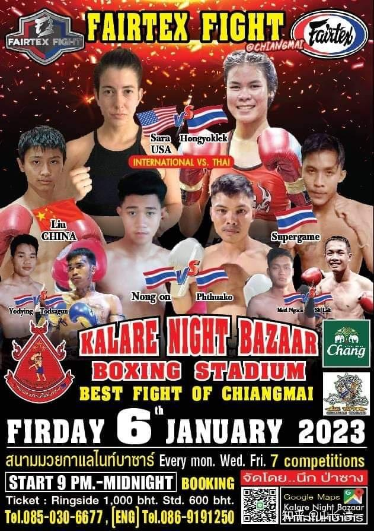
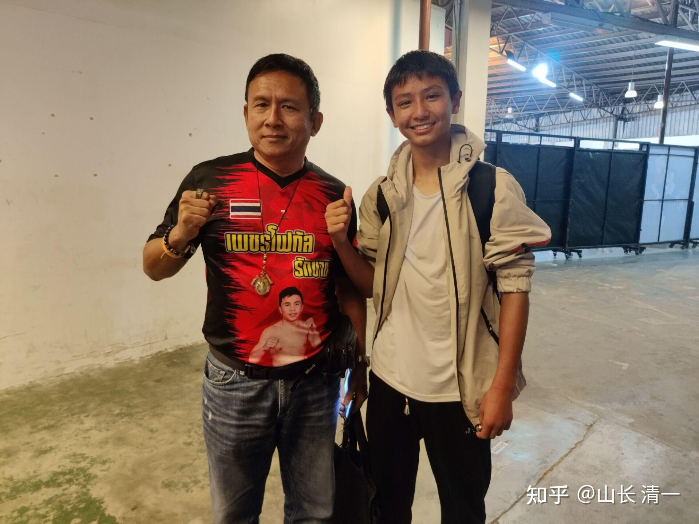
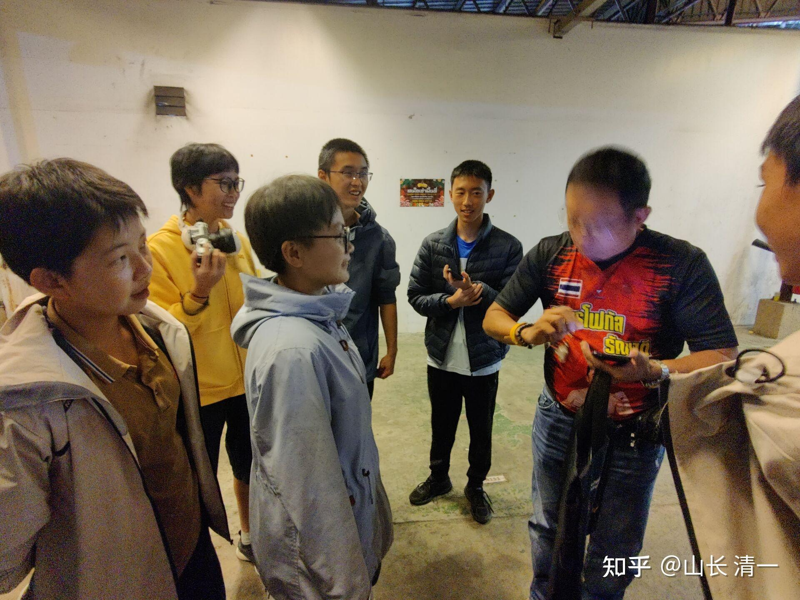
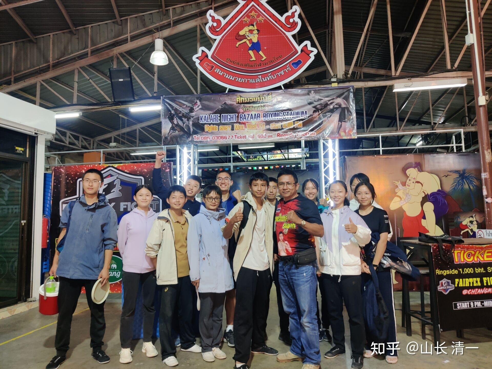
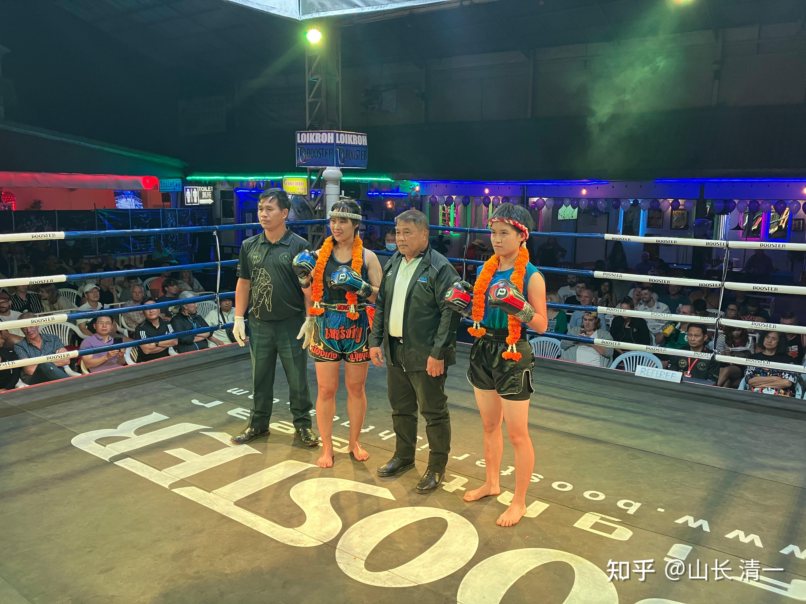

在格斗上，女生能够打赢相同级别的男生吗？

28年前，有人尝试过回答这个问题。 号称世界最强女子，与男拳手比赛却以惨败告终。从此再无女人敢上台与男拳手一较高低！直到现在-------木兰们不相信女人的眼泪！

虽然泰国有【美丽拳王】的真实故事，还拍成了电影传播。但---当年击败一众男生，成功拿到仑披尼泰拳冠军的“女拳手”，生理上其实是男性，只是心理上是女性罢了，俗称伪娘。一旦服用激素和做了手术，外形整得像女生后，就成为“人妖”，但再也打不赢男拳手了。有很多人都认为:女人的生理特点和肌肉结构，反应能力，格斗潜力，天生就不如男生。甚至不可能靠后天的努力来改变。女拳手只能击败没练过的普通男人。但无法平等地与接受过同样格斗训练的职业男拳手一较高低。泰国现在依然有很多伪娘拳手，但实力与普通男泰拳选手依然有差距。再无【美丽拳王】的瑰丽！

[泰国电影：美丽拳王 （依据真实故事改编）](http://link.zhihu.com/?target=https%3A//www.youtube.com/watch%3Fv%3DbZOlppBh_ds)

真正的性别大战，发生在29年前----1994年，荷兰踢拳女子冠军瑞克尔，号称30亿最强女。出拳力量比男子更强，职业战绩从无败绩，大量KO对手。因为当时已经找不到可以击败她的女拳手，就尝试挑战男拳手。为了保险起见，首战男子她选了一个身高体重与她相比都无优势的泰国业余男拳手，进行了一场史无前例的跨性别比赛，不料却遭遇职业首败。她在第一局就遭遇男拳手的连续重击，毫无还手之力。不甘心的她，第二局开始积极反攻，却被名不见经传的KO。从此，这个强悍的荷兰女拳手，认为男女的差别极其巨大，不是靠她的后天努力就能够弥补的。此后，全世界就再也没有女子拳手，愿意再跟男拳手比赛了。至今，全世界的格斗界，都一致认为----再厉害的女拳手，也没有本事和普通男拳手一比高低。28年了，这一瑞克尔用自己被KO的惨重代价，换来的“格斗界圣经”，被后来的女拳手们严格执行。甚至一些格斗组织，还严禁组织女拳手和男拳手的比赛。怕出现拳台意外，出现失手打死人的事情。毕竟男拳手的力量速度都远远超过女拳手。

[史上最强女拳王，挑战业余男拳遭惨败！](http://link.zhihu.com/?target=https%3A//www.ixigua.com/7159111638040183335%3FlogTag%3D5ddf684615db9e120099)

两个多月前，我对此也写过介绍的文章。 并说明木兰们将在一年后，挑战号称世界最强站立格斗的泰拳男职业拳手。当时导致巨大的争议----男女大战？这真有可能吗？清一自己吹牛，想拿木兰们的生命来冒险吗？

[山长 清一：史上最强女职业拳手也打不过业余男泰拳手吗？](https://zhuanlan.zhihu.com/p/578154965)

现在新消息来了：两位木兰，决定就在这个月底下旬，春节期间，就走上擂台，迎战男职业泰拳手，创造一项由中国人开创的全新世界纪录！她们想要用击败泰拳男拳手的胜利，来作为送给全体中国人的节日献礼。愿意用自己的生命和青春来冒险，创造全新的世界纪录。在全球中国人欢度春节期间，木兰们将用自己在海外的汗水和血水，奉献给自己的民族和祖国。

这是中国的木兰们，再创造了一系列的“格斗第一”之后（第一个出国打泰拳，第一个站到仑披尼，迦南隆拳场的中国人生等）。再一次创造的记录-----创新的世界纪录。无论成败，至少勇气可嘉！

如果木兰们冲击失败，她们也是间隔了28年之后，女性冲击世界格斗对抗记录的再一次尝试！

如果木兰们成功了，她们就开创了全新的世界格斗记录！

毕竟，当今中国娘化严重，小鲜肉偏地。甚至就算阳刚的中国男拳手，很多都不愿意来打泰拳这种“很残暴”的比赛。而这些柔弱的中国小女生，居然敢于去打男性泰拳手，的确非常需要勇气！

她们的冲击，不是没有代价的。敢于去与“根本不在同一等级”的男性拳手征战，甚至是冒着生命的危险去拼搏，真的值得吗？

各位大神----请在文章后发表你们的想法吧！并用时间来检验你们的言论真假。也许清一就是一个大忽悠，大骗子。也许清一真的掌握了中国太极的奥妙---柔弱胜刚强！

以下是最新的比赛消息反馈：

昨晚新武士刘轩宁首秀，他在13岁的时候，家人送来清一武馆训练，今年刚满16岁。今晚的首秀，在第三局KO了凶猛的泰拳手。泰方主办人非常的喜欢他。说他有冠军相，两年内就可以拿到冠军了。这个速度，其实是所有太极武术的节奏，用两年时间足够打到最高等级了。用我们的技术，打泰真不难！

*刘轩宁首秀海报*

*比赛主办人夸奖小拳手，说他两年后就能拿冠军*

*主办人希望武士木兰拳馆多多支持比赛*

*昨晚武道馆参与比赛和协助的全体人员与主办方的合影*

*谭木兰对手是花环拳手（高手标志），献花官员摄影留念。*

[https://www.zhihu.com/zvideo/1595002461743505409](https://www.zhihu.com/zvideo/1595002461743505409)[https://www.zhihu.com/zvideo/1594865795267440640](https://www.zhihu.com/zvideo/1594865795267440640)