宋老师汇报的情况：

小伙伴们来麦当三天了，逐渐开始适应这里的生活，有的同学跟着工人刷油漆，有的同学在工人的指导下搭房子，有的同学给工人做小帮手，住在泰国人家里的两位同学，每天都会送来美味的泰式料理。当然，每天也会有两位同学轮流为大家做饭，让大家在又累又饿时能够吃到可口的饭菜......

工人们对小伙伴们的到来都很欢迎，手把手教大家做事，虽然表示教学会让他们的做事效率更低，但看孩子们做事有模有样，也颇感欣慰。今天油漆组只用一天时间，基本完成了天花板的油漆工作；搭房子组仅用两天时间，也在工人的协助下建出了房子的框架；小助手们也帮工人捋直了大约200根钢筋，不得不让人感慨“人多力量大”。

以上是同学们干活儿时的部分照片，和大家一起分享[表情]

这个寒假，大多数公主班（未来新教育师资班）的学生没有回家，而是留在泰国体验生活。在我们当地团队的协助下，孩子们参与了不同的项目：

1：一些学泰语的小公主，居住在我们特别选择的泰国人家里面，全天候跟随泰国人一起生活。并学做泰式点心，饭菜等。我做这种安排的目的，是让泰国小公主融入泰国家庭生活，能够更快学会地道的泰语，比去大学上课强多了。这样的方式，还特别受泰国人的欢迎---因为泰国人有钱赚。双方都有好处，干嘛不多玩一点呢？所有学习泰语的小公主，都要去泰国家庭居住一两个月，快速提高泰语水平。

2：去工地做事，体验【民工生活】。一般来说。普通的工地是不欢迎外人去的，学生去了严重降低工作效率。还有可能影响安全等。但我们自己有自己的工人队伍，我们是“主人”，我们安排学生一起跟着工人一起做，要求工人们带着学生玩，工人们也没意见（只要我们不要要求他们的进度就够了）。

3：自己学农村人，玩自建房的游戏。让孩子们知道---泰国人自己建房其实很容易！成本极低。她们知道自己建房的奥秘之后，大概率不会愿意去北上广买天价的房子了。

4：很快公主基地就要最做后一道工序“贴瓷砖”了。不知道小公主们能否学会。据说香港这个贴瓷砖的工人，一天可以赚2500港币呢。拥有这个技术，比很多大学生的工资都高，不怕失业了。

5：还有几个小公主是体验“野外生存”的。看她们如果度过艰难的日子。

以下是宋老师拍的孩子们的照片：让大家看看---小公主们在家是乖乖女，在学校是学霸，走上工地是优秀的工人。走上擂台是凶猛的拳手。上得厅堂，下得厨房！

学习，没必要这么苦情。我们可以玩得像是游戏一样。一天的工作完成后，晚上孩子们是拍戏。最后附上了孩子们的表演节目----职场生存要领！与领导的出翔方式。

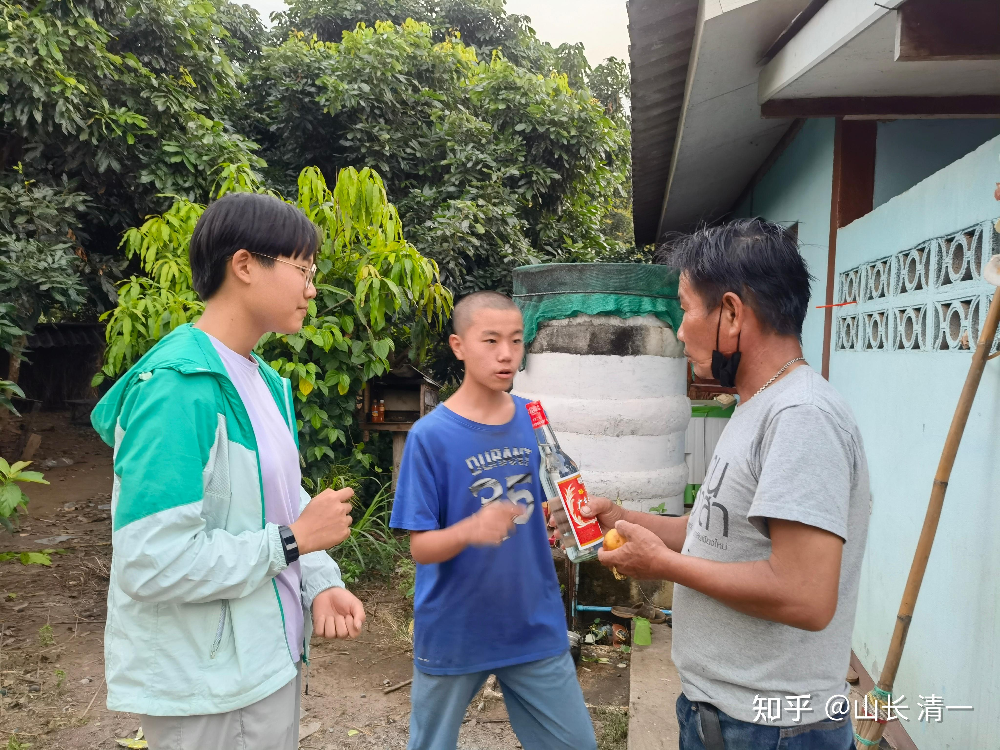

*新年送礼物给当地邻居*

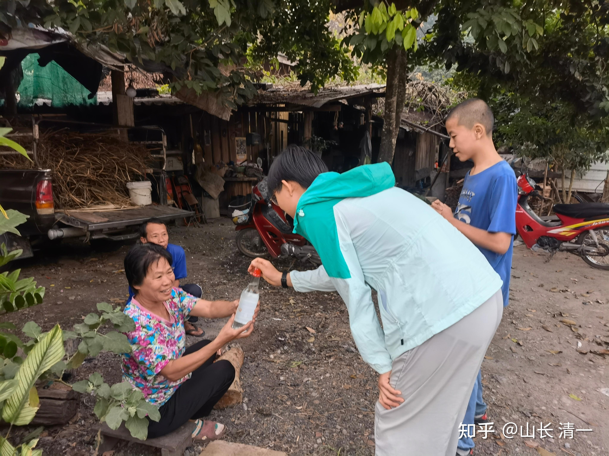

*送中国酒给泰国人喝*

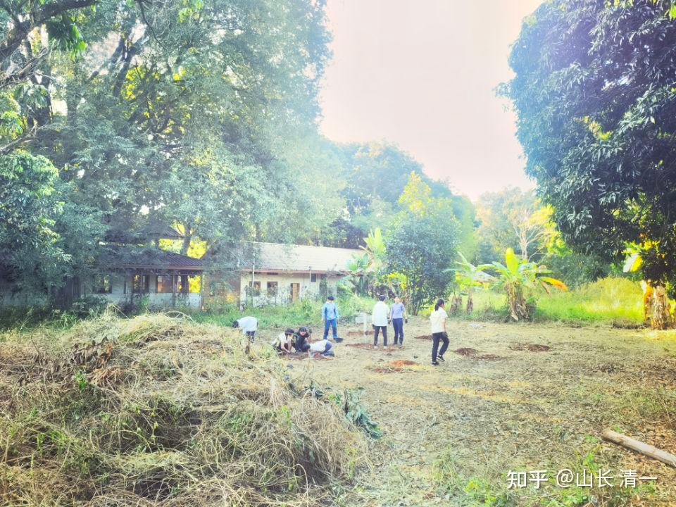

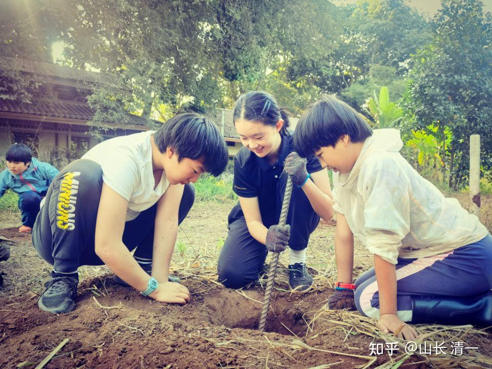

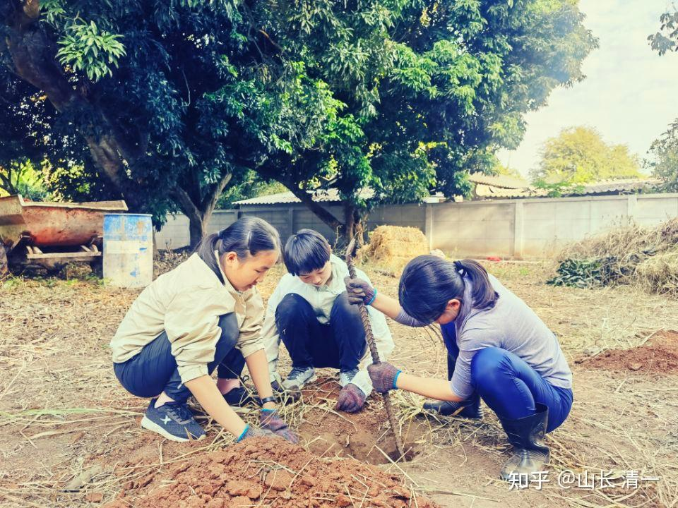

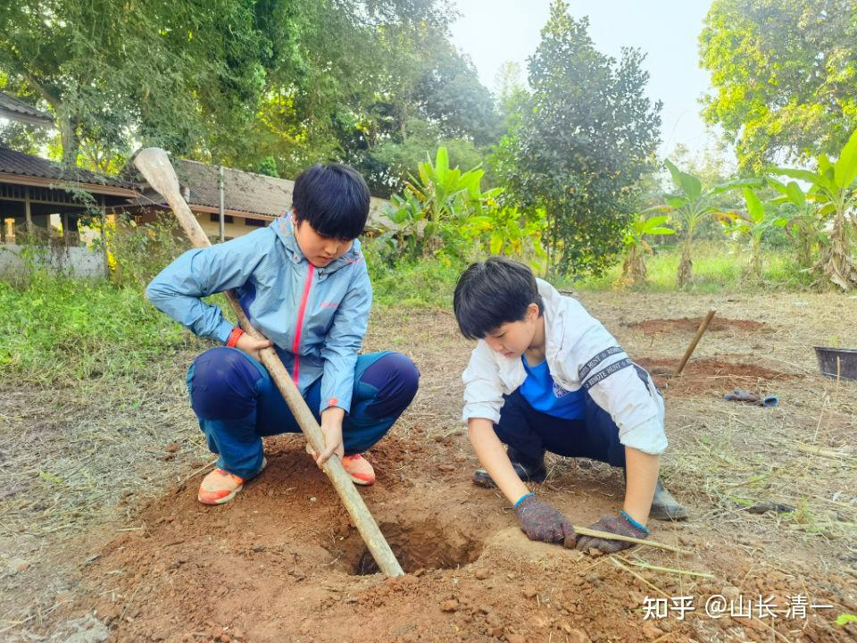

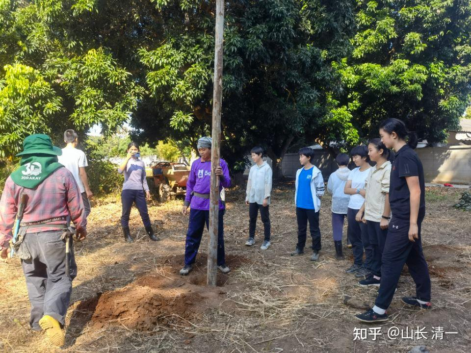

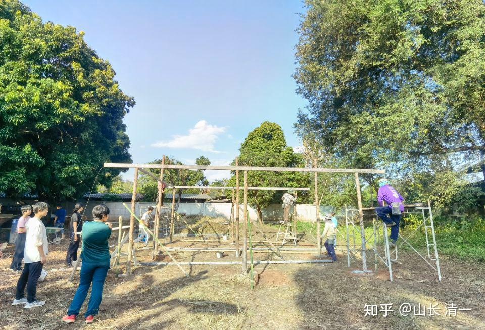

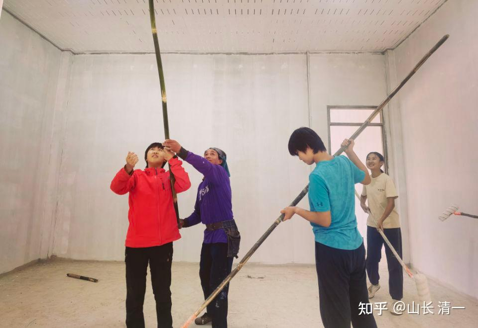

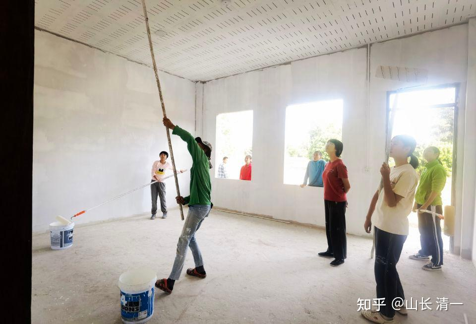

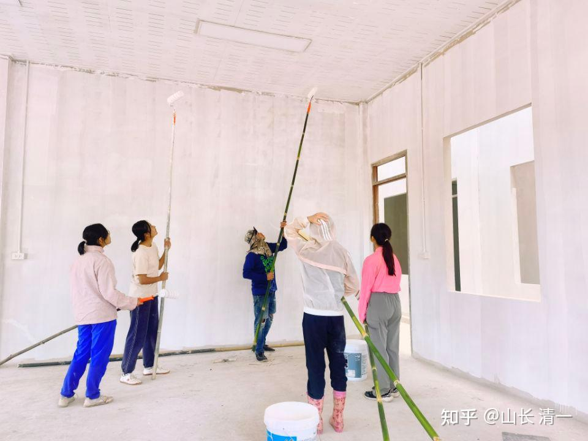

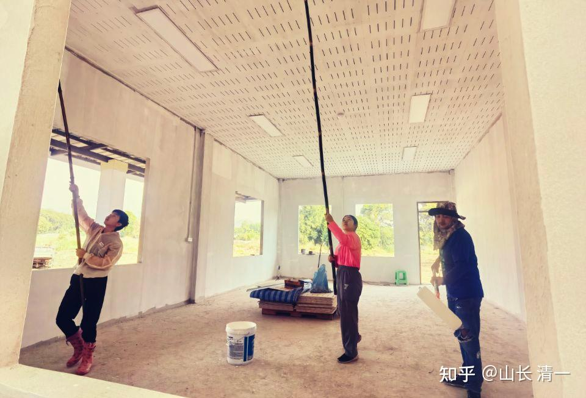

*公主基地未来的教室*

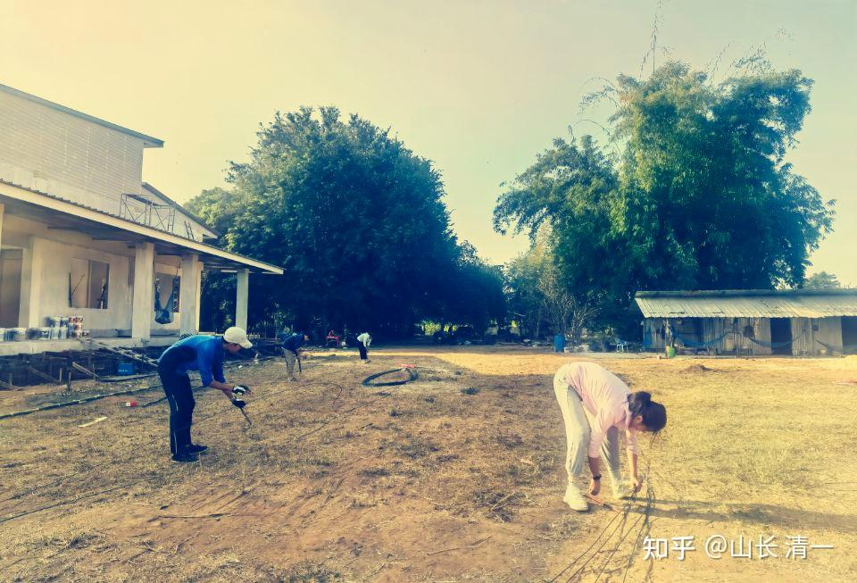

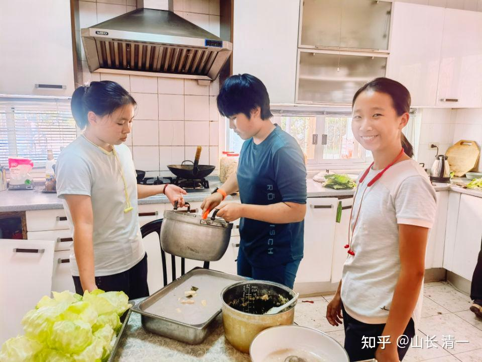

*孩子们自己做饭*

[!\[image\](images/img_015.jpg)

公主职场小品：怎样和领导相处？ https://www.zhihu.com/video/1596634351764291585](http://link.zhihu.com/?target=https%3A//www.zhihu.com/video/1596634351764291585)