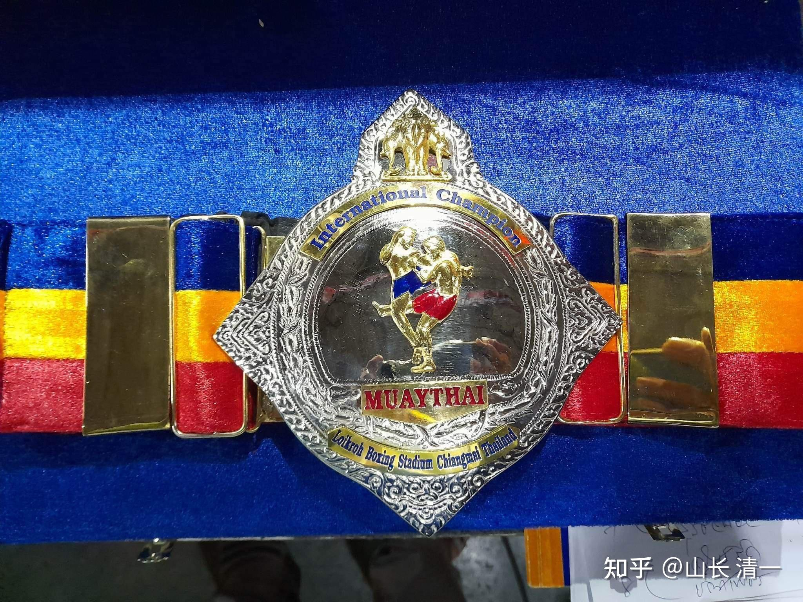

**（文后附昨天第75战木兰佳慧的实战讲评）**

今天刚确认的消息：不断击败清迈地区强手，同级别女生已经不敢跟佳慧打，参与60公斤地区冠军金腰带决战的拳手，居然被小10公斤的佳慧打到怀疑人生，赛后很久都没回过神来。这样的无敌战绩，为佳慧赢得了1月22日，在清迈L拳场进行的金腰带决战机会。对手是一个英国拳手。她一直在跟泰国拳手们决战，还没有跟木兰们交过手，木兰们也没有看过她的比赛。不过----我认为木兰可以轻取这个对手，她的结果，不会比昨天跟佳慧打的对手更好。

我正在说：昨天打的太出色了，如果清迈连高了10公斤的女拳手连出手的机会都没有，其他人谁还敢出战？同级别更不敢出战了。只能打男生，但受到法律的约束，主办方也不敢办这种比赛。恐怕未来只有找西洋拳手打比赛了。正在说，今天就接受到主办方的邀请----一场正好安排在大年初一的【清迈地区金腰带争夺战】

这个金腰带的级别，当然比曼谷两大拳场的金腰带含金量要差得多。但毕竟是一个新的突破。

我让佳慧别往这些虚头头衔往心里放，就别当回事。依然当做一个练习赛来打。我说：只要维持现有状况不变，今年她可以拿到泰拳界最高级别的金腰带，打成泰拳世界冠军都不是问题。大大小小的金腰带要拿一大堆的。很快2月5日就有预先安排的与世界冠军甜水的比赛。应该也是有啥头衔，或者奖杯可以拿的。估计是北部地区的泰拳决赛。

昨天佳慧的比赛，是一个里程碑，跃升了一级。我认为算是太极入门了。从此，打泰拳已经没对手了，现在就可以任意控制比赛节奏，想KO就KO，想放手就放水。甚至---只要愿意，任何一局都可以KO对手了。只是为了比赛好看，会尽量打的漂亮一些。会像播求和善猜一样，对手看起来很努力，但一切都在掌控中，根据需要就可以KO对手。而原来，佳慧一直控制不好这一点，做不到随心所欲！

[https://www.zhihu.com/zvideo/1599220490689851392](https://www.zhihu.com/zvideo/1599220490689851392)

不过---泰国老拳师对昨天一战的评价，却有些好笑。没看懂太极功夫的奥妙。佳慧的信息：刚才和老拳师打了一个电话，他觉得我昨天的比赛还有待改进，因为我总是跳着往前冲[表情]，跟对方搞内围。

我回复佳慧： 第一，他看不懂太极的战法，这样评价是关心你。以为如果是外家拳，这样打很危险，特别是对付高大壮实，比自己重的拳手，就是找抽。所以他认为你犯了策略错误。

第二：你说你由于练摔跤比较多，所以不怕打内围，才敢往前冲的。如果对手摔法厉害，你就会吃亏。谢谢老拳师的关心！

另外一件搞笑的事情，就是佳慧去泰拳馆找冠军小哥训练实战。虽然轻松应对，但馆长实在看不惯佳慧跳来跳去的样子。让她站稳了再打，认为她这种打拳太不稳当---结果她很快被泰拳手击倒。让佳慧真切的意识到---用泰拳方式去跟这些泰拳老手打，就是羊入虎口。只能用我们的太极方式，移动变化让对手无法捕捉战机，这样才有可能赢。

**这里再次说说泰拳，外家拳的优点和缺点：**

如果用泰拳方式和泰拳打，也就是都用外家拳的方式，相当于双方持有一样的匕首，训练程度还差不多。最终谁伤谁，其实是判断不出来的。只有最能抗的一个，或者运气最好的一个会赢。但双方其实谁赢都很正常。

太极与泰拳对打，就相当于持有长剑去跟持有短刀的对手拼，就算是训练强度不如对方，但依靠武器的优势，就可以轻松击垮对方。因为你是在对手无法攻击的范围内发动攻击的。对手此时，是没法攻击你的。只有你打对方的份。

比如，佳慧昨天的比赛，泰拳手几乎就没有发出啥进攻，看起来每次就是佳慧在打人，泰拳手在竭力抵抗，甚至有人怀疑，这个对手是不是太菜了？但别人一个月前，还参加了清迈的地区冠军决赛呢（类似22日佳慧要参加的比赛吧？）。为啥她几乎就没有攻击呢？因为佳慧没有进攻的时候，一直处在她的有效攻击范围之外，她够不着，无法攻击。作为高级拳手，也不愿意空击。只好等待佳慧攻击她的时候，才有可能反击。但佳慧进入攻击范围的方式，却完全出乎泰拳手的预料。她是非常快速切入内圈的， 而且在切入进来的同时，就发动了攻击（外家拳，是进入攻击范围，在发动攻击，因此给了双方一样的攻防机会）。一旦这拳手遇到一个切入攻击距离的同时就发动攻击的对手，她是没可能去攻击的，只能尽量防守，退让。而佳慧的攻击角度很刁钻，而且攻击角度多（上下同出），所以让她不知道何处被攻击，往往顾次失彼，所以一直是应接不瑕。当然根本就顾不上去攻击了。看起来就像不会拳一样，还笨手笨脚的样子。把一只鸡丢水田里面，她也不会走路了。但你让她到陆地上跟你比比？

比如第一回合就很明显：泰女的选择，就是坚决打防守反击，因为木兰步法灵活，她是跟不上的。主动出击绝对被打。木兰等她久久不动，就不耐烦了，右腿攻击了一腿。各位可以看到她闪躲不及，被右腿踢中，但不重。但显然没有反击的机会（一旦此时出扫腿，就等于被打迎击了）。继续等待，木兰又换腿出左腿攻击腹部。她再次预判失败，但及时退后，没有打上。正当她自以为处在安全距离，防守放松的时候。佳慧突然用飞步野马分鬃袭击，脸部被腿击到（2:02分），可以听到清脆的打击声。接著一拳就上来了。对手只能用内围死死抱住，防止肘膝攻击。木兰一个借势下按的动作，如果是同体重级别拳手，应该就倒下了。但这人的蛮力很强，木兰按不下去，双方僵持被裁判分开。

按照帮佳慧安排比赛的老拳师的观点---佳慧就不应该冲上去跟她打内围的，但佳慧如果进攻后保持在一定位置上，对手的反击就会跟上来。跟更重的拳手打内围虽然不明智，但也比远距离对拼更好。昨天的73战就是我方拳手用了外家的作战方式来跟泰拳手打，最终虽然Ko了对手，但主要是运气好，体力强，在对手体力不行的时候抓住了机会KO对手，但自己也很危险！多次差点被KO。

[https://www.zhihu.com/zvideo/1599210724638887936](https://www.zhihu.com/zvideo/1599210724638887936)

接下来，木兰也没有积极进攻，有点磨时间。但对手超级的紧张，随时防范木兰冲上来，但显然没啥防守手段，就只想用正蹬腿来拒止木兰的进攻。但没想到木兰的身形移动很快，她的正蹬堵不住缺口，被木兰一个野马分鬃袭击头部，接下来一个内圈腿直接扫倒。由于木兰移动出击的角度非常的刁钻，而且连击的速度很快，让人防不胜防。你们不用慢放都看不清楚的。只看着泰拳手莫名其妙的倒下了。说明木兰的速度不仅快，而且力量很重！一个60公斤重的人一击就倒下了。

泰拳手爬起来之后有点恼怒，想冲上去拼打，很快又停下来，继续持防守姿势。因为发现木兰争严阵以待，等着她冲呢，正好被迎击。只有心理控制良好，作战经验丰富的泰拳手，才不上这个当，将不可怒而兴兵。所以不敢妄动。2:50秒，看木兰切入太灵活，防不住攻击的泰拳手，想要靠内围抱住木兰以策安全，却没想到被木兰换劲旋转后压下身姿，随势膝击头部，肘压打头部一气呵成。导致泰拳手第一次读秒。各位看到泰拳手紧紧抱住的身子，突然被木兰一个转身就翻转过来，压下的动作，非常的流畅，显然这种翻转的力量很大，木兰成功应用了太极腰力。泰拳手明显站立不稳，随即被制住，膝击！

泰拳手显然蒙了，像是做了一场梦一样，起来就使劲跳身子，晃动头部。觉得自己搞不清状况了。晕乎乎的被摔倒。重新开始比赛的时候，木兰用二起跳攻击，让她完全不知道该防哪一只腿。只能使劲退，被木兰卡住身子，想要用体重优势压制木兰就，没想到3.39分却被木兰轻松摔倒地下。此时估计她已经完全慌乱了，不知道该如何应对木兰。内围，远战都不行。此后，木兰也没有积极进攻，毕竟只是第一回合，她已经尽量放慢节奏悠着打了。

第二回合的节奏木兰明显加快了。刚开局的时候，还想竭力拼一下的泰拳手，躲开木兰的反击后，虽然退的很远，但很快遇到木兰的飞步野马分鬃追击，并被再次摔倒。大体重，却被小个子如此无视，够羞辱人的。站起来后不思进取了，只是消极躲避，被追上后连击7拳。

4:50，木兰前腿攻击腹部，泰拳手躲过后马上就反击，正好木兰连环腿的第二腿攻到，被正好打了个迎击。但面对木兰很难预料的同腿两次攻击，还是被击中腹部后，泰拳手4：53再次的反击，非常快速有力，这的确是一流拳手的反应。一般泰拳手，做不出来这种连续反应。只是她没有料到----木兰撤退的速度超过了她攻击的速度，她居然击空了。反应了这拳手的水平还是很不错的。其实木兰不是怕她攻击而退步的，只是不想连续攻击的节奏太快，击垮她过早罢了，所以撤退如风。反应了太极的优势，侵掠如火，快速如风。进退都让人措手不及。

接下来，木兰的再次攻击，明明可以膝击重击的，但木兰只是制住对方，没有下手。估计是不想太快结束战斗。后面明显在放水，消极比赛。估计是想让对手攻击。但对手刚一攻击开始就被压制，反应了木兰的反应速度超快。木兰佳慧在内围也没有发力，不像第一回合还猛然发力摔打对方，而只是控住对方。就是6:07的太极旋转，没有刻意去做，就轻易就摔倒对手，反应了前面的控制，是故意不做技术动作的，不是不会做！显然木兰不想第二局就大开杀戒！尽量的留点面子。

第三局木兰就打得积极多了。虽然也没有下手死打，只是出招不出力，但对手很快脸上身上，都是累累中招之后被打红的印子。看得出木兰攻击效率极高，对手的脸部，都成了活沙袋了。有人笑话泰拳手像是个没练过拳的人，只会把双手高高举起，像个大螃蟹一样。但如果你的脸上总是被攻击（第一局就被腿击中脸部），后面被连续拳不断砸中脸部，估计本能上，也会把手高高的抬起防守吧？尽管这样就把腹部完全卖给对手了。顾头就不能顾腹。这就是木兰野马分鬃的牛气-----上下齐攻，对手往往顾头，正好打击腹部。也说明泰方拳手此时已经心惊胆战，毫无斗志。甚至已经失去正常的战术动作了。

8:05泰拳手的这个镜头很滑稽，前手伸直，双手高举。就是泰拳手恐惧心的彻底体现----面对对手，唯一想法是------快离我远点，这是拳手完全丧失斗志的标志。技术动作完全变形。这是泰拳手在前面一轮连续攻击中毫无防范之力，被打击后惊怕的效果。果然，几秒钟之后，8:10就被佳慧再次击倒，再次读秒。其实---佳慧这一轮只是在吓她，打了玩的，真的没有发力去打她，也没有想KO她的。但她已经被这种连续的攻击吓蒙了，轻轻一带就倒下了，导致读秒。起来后泰拳手生无可恋的样子，完全丧胆了。

该局结束后，其实泰拳手应该没有严重受伤，最多就是累坏了，吓坏了。因为佳慧并没有全力以赴攻击她，还是当玩打的。主要是心理上受伤严重，打怕了。所以回合中间休息完毕，泰拳手不肯走上拳台，裁判第三次读秒，泰拳手主动弃赛。镜头中，看她满脸不可思议，一副失魂落魄的样子，曾经去外府争夺女子重量级冠军的她，今天被打成这样，绝对是在怀疑人生。木兰说赛后去看她也没有恢复过来，眼神怪异。我估计她是在怀疑自己----是不是已经不适合打拳了？对付一个轻10公斤的对手居然被虐的如此凄惨。什么都玩不过别人---拳，腿，内围，肘膝。7:40的这连续腿法，明显就是玩的， 但对手肯定不敢轻忽呀？心里肯定紧张极了。所以，原计划打满五局的木兰，只捞到三局满局的机会。她真正开打的四，五两局，泰拳手决心不去面对了（老手都知道。真正的决胜局，是4-5两局，前面其实是餐前点心）

第二天。木兰查看她的FB脸书账号状态，发布的信息是:自己因为没有力气，打输了。需要加强训练。的确，这就是外家拳遇到内家拳的样子。经常是输的莫名其妙的，有力用不上。她肯定认为：连摔跤都输给比自己轻这么多的对手，肯定是自己吃错药了。泰拳手一直传言木兰的力气特别大，特别强壮，跟木兰打特别吃亏，这一回，肯定是实锤了。

只是：佳慧木兰吃素为主，现在更是吃稀饭为主。完全不符合“现代医学常识”，吃肉的泰拳手打不赢，是不是该改改饮食习惯了？

**（分享：木兰佳慧的主要饮食方式---米粥+花生，调料是泰式豆酱，外加一根生葱。外加生菜类，量和品种都不多。加上一小调羹的椰子油补充营养。蛋白质不需要吃肉。粥，花生，豆酱里面都有。维生素生菜里面有。如果还担心蛋白质不够，就每天吃一个鸡蛋，或者吃一些豆类食品。另外加上泰国的各种时令水果）。**