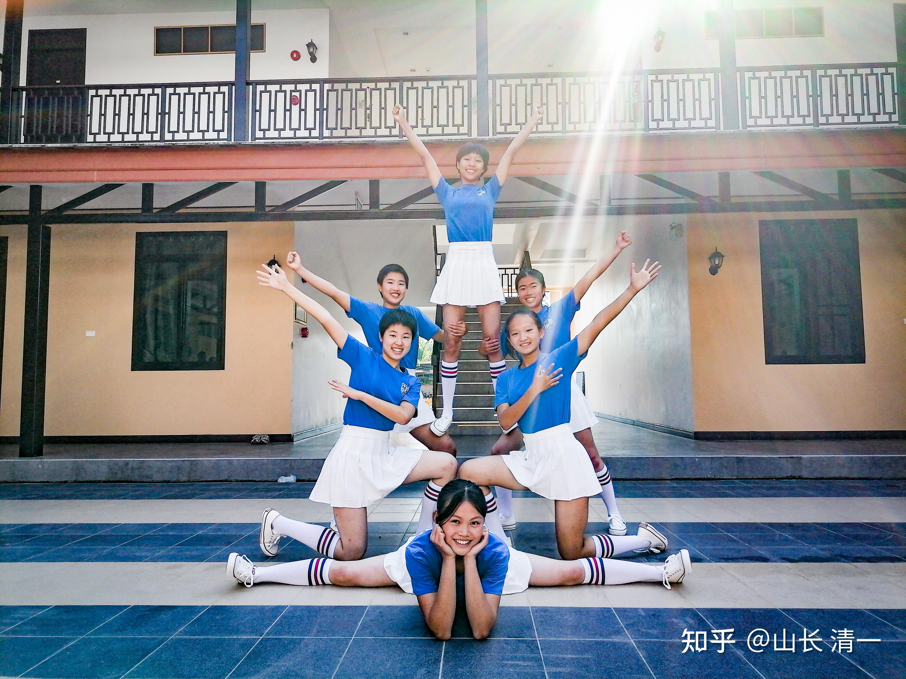
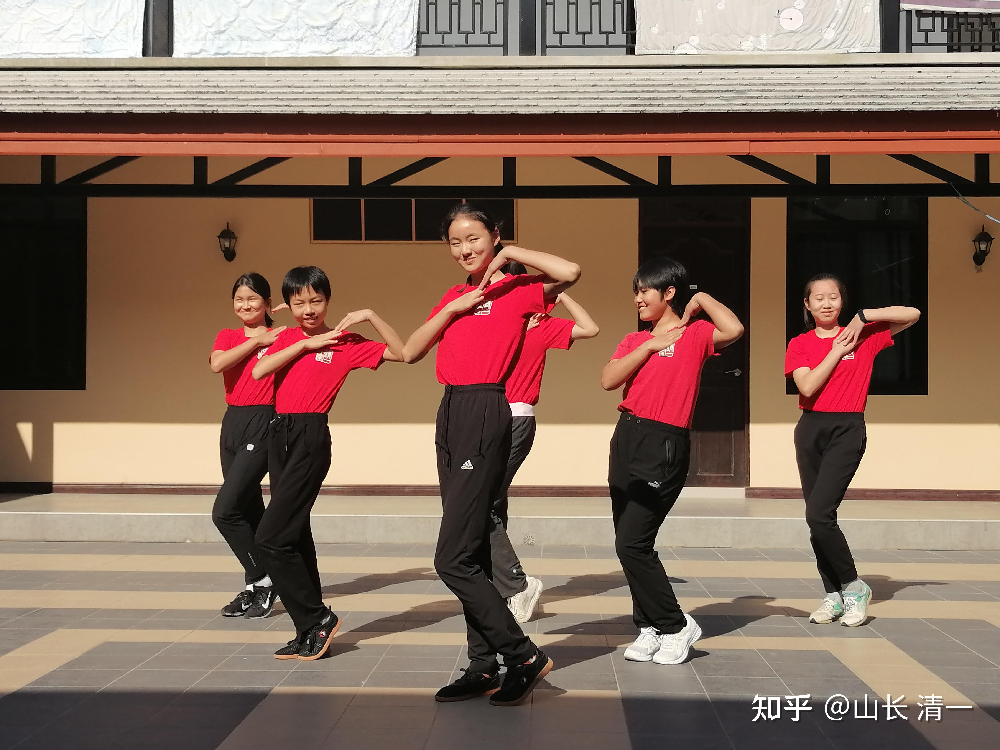
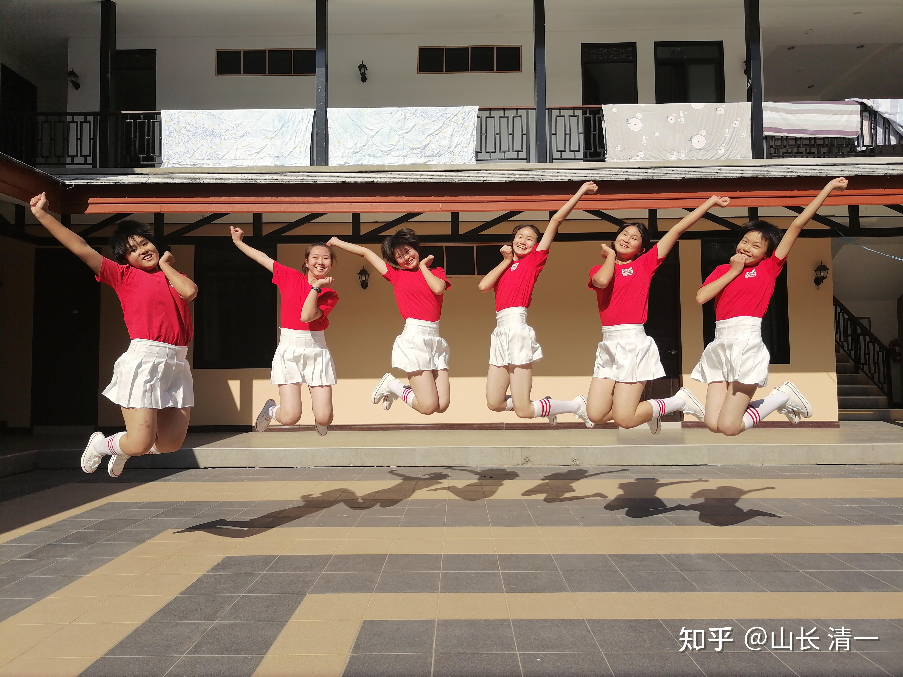

今天是中国新年的大年初一。

在中国，今天是国人们到处去访亲拜友，到处去吃喝玩乐，逛商场买东西的一天。

在清迈的清一书院，今天与其他日子，没有啥不同的。拳手们在练功，准备今晚和明天的比赛。小公主们在认真准备今晚和明天中国日的啦啦队跳舞。小武士在练“太极醉拳”，计划明天表演给外国人看。

*公主们分为两队表演*

*上场前的排练：红队秀可爱*

*慧心楼的中央舞场够玩了*

今天的清迈阳光灿烂。早晨吃了一碗粥之后，我在院里转了一圈，回到书房，准备写每年的惯例----新年第一篇文章。

全世界的华人，今天都在庆祝春节。泰国的华人们，会摆出数万元的春节晚宴（却舍不得给中文学校添加一张像样的书桌）。中国人总是把吃，看着第一位的神圣地位。似乎过节不吃点啥特别的东西，就太对不起自己了。过节不给自己买点啥好东西，也对不住自己！也许---我们就是全世界最关注吃东西，买东西的国民了。磨丁的今日国际学校，宾馆级的学校宿舍和商场级别的教室，用东南亚高档柚木打造的数百张书桌，以及用全柚木制作的学生床铺等，让老国教育部都吃惊不小：如此大资金投入的私立学校，华人世界中极为少见。但西方的私校，却愿意为教育投入更多。就因为中西方的思维价值观不一样。

国人眼中，教育是需要付出的成本，自然是越低越好。而吃喝玩乐是最重要的回报，自然是支付出去的金额和时间和金钱越多越享受，自己这一生才“不吃亏”。而西方的价值观，普遍认为吃喝很不重要，吃是成本，吃是为了活着，所以越简单越好。一片面包，涂点果酱，也算一餐。文化，教育等不是成本是投资，是生活和意义和目的，是可以不断再生的“资本"，自然要重资投入，多多投入。有钱就投入。

所以----才有耶鲁大学的笑话：这个大学，她创校的资金，居然原始出处是来自中国人的钱。因为，当年中国的富人们，喜欢用大量的银钱去“享受生活”，吃喝玩乐，大买当时东印度公司大量贩卖给中国的鸦片等物。伊利胡·耶鲁---这位1718年的不列颠东印度公司总裁，却因为用自己从远东赚来的钱投资和建设耶鲁，成为了名流千古的世界文化名人，自己的名字，也成为世界名校中最响亮的名称！

当年，上海一个比他更富裕的中国人，认为办学太亏，把钱花在别人身上划不来。有钱也只能用在自己身上。所以---他用远远超过耶鲁哈佛两校建校的资金，当年金额比一辆最先进的铁甲战舰更高的价钱，为自己的女儿出嫁，打造了一个【世界最贵的花轿】，今天用于放在上海外滩的博物馆里面供人观赏！而当初貌不惊人的耶鲁，多年后的今天，成为了国人要果断捐献八百万美金，只为获取一个“入学资格”的名校。因此---观念的差异，最终就造成了文化和教育的差异，国民基本价值观的差异。今天的我们，与大清时代，我看本质上也没啥不同：一样是重物质，轻文化。重身体，轻心灵！

这就是两国人民的核心价值观差异，持续下去不改的话，我们大约也走不出大清的困境：别忘了当年的大清，相对全世界的富裕程度， 不亚于今天的中国，甚至高于今天的中国！但物质的富裕，并没有给我们带来文化和精神的进步！

比如，直到今天，中国人关注的依然是吃：见面打招呼，就问---吃了没？吃了啥？网上秀的，是各种吃，各种喝！还喜欢囤积各种无用的“好”东西。

外国人关心的是玩，关心你开心不开心，所以见面打招呼就是：你干的怎么样？（HOW DO YOU DO ?), 你感觉如何？HOW ARE YOU?

所以，比较起来，中国人活成了动物模式----为吃喝拉撒睡忙乎一辈子。

而外国人活成了无忧无虑的小孩子模式：到处寻找快乐，玩了一辈子！玩出了各种好玩的东西，到老了都很幼稚。

但中国人到死都很沉重---身上永远压着生活的负担，生存的压力。很多就是自找的苦头-----比如买个要用30年来还贷款的房子。

总体来说，中国人也好，外国人也好，都没活出人性的光彩，没有活出灵魂的期待。

我想提醒大家：**你不仅仅是你的身体。你是【身心灵】三者的完美结合。你的每一天，都要找到身心灵的合一的生活方式，不然你就辜负了你的人生！**

你当然需要照顾你的身体。可是，身体需要的东西其实很简单，不饿，不冷，就行了，再多就无聊了。在目前这个比较富裕的社会，要实现这个目标一点也不难。

因此：要满足身体的真正需要非常的容易----10块钱的简餐，与万元的大餐，对身体来说没啥原则性的区别。甚至万元大餐可能对身体反而是沉重的负担，不符合身体的真正需要。我相信这个春节，你们大吃大喝，会感觉比平时工作日更累。因为身体真的被你们累坏了。

身体需要的生活，住宿条件，也很简单。几十元的房间，与几万元的房间， 你睡着了都一样。没啥区别的。乡村几千元就能搭起来的房子（小公主们正在搭建的房子，有三个房间，但材料成本也就几千元），与你大城市里面几千万元的房子，本质上差不多。恐怕公主们的房子，住在里面更舒服。起码空气好很多。

你需要更多的关注你的心：你的心，需要的不是“活下去”（这是身体的需要），你的心需要的是“快乐和自由”。你需要去为你的心灵寻找和创造快乐。而且要给心灵自由的空间----允许他去选择，去体验。以为心灵喜欢各种游戏。

中国的大人们，以为给孩子吃了好东西，就一切KO，不会关注孩子们的心灵追求。不关注“快乐”。所以：我们的下一代，往往身体被照顾得很舒服，但心灵很压抑，很扭曲，被剥夺了快乐。也被剥夺了“自由”，我们的孩子被家长以“为你好”的名义，剥夺了心灵的体验和选择的机会，获得好可怜！

自由当然不是孩子想做什么，就做什么。而是家长要让他去体验，去感受，拥有选择的权利。这对孩子来说很重要。

在新教育发展很好的孩子，往往都有体制教育的不幸压抑的体验。体制教育的压抑和不自由，让他们来到新教育后，非常的热爱和喜欢这里的气氛。在这里允许孩子们“做错事”，但必须承担“做错事”的后果。你不好好工作，不好好学习，就不得食。你想吃垃圾食品，就尽量的吃个够，最终自己放弃（而不是大人不许）。不想读书没问题，你就要去干活。不想干活，就关禁闭。你撒谎，骗人，就没朋友！

这就是“自由”，你有选择的自由。在这种环境下，孩子们成长很健康，丝毫不压抑，慢慢的越来越积极进取。

但---往往我们只关注“身体”，忽略“心灵需要”的父母，养孩子是吃好喝好，然后强迫孩子去做各种讨厌的事情---去上讨厌的课，读讨厌的书，写讨厌的作业，说各种违心的话。

比如：当年过春节，小女让她跟长辈说吉利话，她就是不吭气，用给压岁钱诱惑都没用。奶奶说这孩子有点傻。我知道，她只是认为不知道有啥要说一堆自己也不懂的废话。她也不喜欢过年的气氛，觉得还不如自己找本书看。但---今年给长辈拜年，就很会说话了，很讨喜。因为她14岁，已经成熟到，知道怎样说话会让大人们开心了。但如果当年强迫她要乖，也要服从，让她必须说自己也不懂的“吉利话”，就会出现一个无脑乱说一堆空话的孩子。因为我们没有尊重孩子的内心，我们教她虚伪和表演了，有口无心，就成为这个时代的悲剧。

小女原来就是不肯读我给她推荐的（三国，曹操题材的小说）。我并没有强迫她一定要读这些“好书”，只是说：好的，不想看就算了。你以后想看的时候再看。结果一两年之后，她自己拿着这些三国书籍，自己看得津津有味的。我还笑话她---现在才看得懂这种书，她有些不好意思。但我说---【飘】比这些书更好看，但你现在肯定不喜欢，看你什么时候喜欢看【飘】，你的阅读档次就上一级了。她坦率承认---【飘】她看过，认为太无聊了。就像她当初认为爸爸讲课一样。

【飘】是一个了不起的大作，很多成年人都看不进去。我觉得这本书很好，但也不能强迫孩子接受呀？（就像你喜欢吃鸡，但不能强迫孩子也吃鸡呀？）。我们干嘛不允许孩子自己选择自己的进度，跟随她自己的体验呢？干嘛非要把我们想要的结果，强加给孩子呢？这就**违背了“心灵”的最大要求---自由和快乐！**作为大人，你只需要引导，但不要强迫她。等时间到了，孩子会自己说：还是老爸厉害，原来推荐的书真的好！我怎么现在才发现。

当然，自由并不是放纵。国人往往把放纵当成自由。结果培养出一堆熊孩子来，超级令人讨厌。甚至自己也讨厌自己。

其实---真正拥有自由的孩子，是快乐的，自信的。你可以从孩子的行为和结果来观察你的教育是否正确，家长是不是“懂心灵自由”的概念！一些家长看到我们“整”孩子（家长认为不放纵就认为是整人），以为孩子会很怀恨。当年我弟妹，说将来我的亲子关系会很糟糕，因为我老收拾孩子。长大了，却发现孩子跟我居然很亲近，而且很有想法，很有主意，很自信快乐。这就是我尊重到了孩子的自由。对宠溺他们的老人，反而心理上有点距离。其实，所有的熊孩子，内心都是极其苦闷的。因为他们找不到“自由”的边界！反而感受到了环境的处处冷漠和敌意。心灵怎么会“快乐”得起来的？

心需要自由和快乐。其实我们还有更大的存在，更大的追求-----我们还有灵魂的需要。

**灵魂需要的是创造：我们来到这个世界， 不是来享受的，不是来掠夺的。万般带不走！我们只能带走我们的创造的经验。灵魂喜欢享受自己创造的结果！**

我们喜欢新奇的东西，本质上是灵魂喜欢创造的本质，而非“跟随”和模仿！因此，我们受不了流水线工作的重复，不喜欢日复一日的简单重复的生活。我们的灵魂，选择来到这个世界，是要来创造我们的“真实身份”。我们想在地球上留下我们创造的记录。我们想要短暂的一生，活出我们的精彩来。

所以---我们都很想做别人做不了的事情。

我们想去挑战别人无法挑战的记录。

我们想去创造别人无法创造的历史！

我们认为自己是“独一无二”的，因为我们代表“创造”，当然是独一无二的！

我们都想书写出自己的历史新篇章。

但为啥很多人并没有去投入这个创造的工作呢？

因为很多人，过于爱惜身子，被身子的欲望牵挂。忘记了自己的本性是创造，忘记了自己的心灵才是最重要的。他们委曲求全--为了身子的舒服而放弃了追求。因此----遭受心灵的谴责，一辈子活得郁郁寡欢。到处找“乐子”---往往找到下一代身上去，去为下一代的身子，吃喝操心，以为这就是寄托。把这种错误的观念传递给下一代。最终----老死也死得惶惶然，这辈子就没做啥让自己自豪，开心的事情。白白的浪费了一生！

既然我们的灵魂，有如此大的创造渴望，干嘛不把我们的生命和时间，用来创造我们的不凡呢？干嘛只会把我们的金钱，时间和精力，都用在“照顾”我们其实不需要太照顾的身体呢？

如果可以选择人生：你是想做一个英年早逝的乔布斯呢？还是想做一个唯唯诺诺，勤勤恳恳一辈子，认认真真走过场，踏踏实实混日子的公务员？最终得以善终呢？

反过来思考：你愿意与庄子相处一日？还是也广场舞大妈相处一生？

或者----你愿意做一天的庄子？还是愿意做一生的大妈？

你的灵魂，不难给出答案。可惜，大多数人的真实的行为，选择就是大妈之路！与心灵的选择完全相反！

因为：他们认为身子才是自己的主人，忘了心灵才是！

新的一年，希望大家超越身体的欲望，更多去关注心灵的需要，活出你们的快乐和自由，活出你们的创造和精彩。为物伤身，已经太划不来了。如果为物伤心，伤神，就更亏了！

只要愿意，我们可以创造神话！

作为中华太极传人，2023注定是一个精彩的年头。我们将为中国人奉上超过300场的精彩泰拳比赛，用我们的身体和智慧，努力去创造中国太极人横扫世界格斗界的奇迹！在格斗场上不断升起我们的中国旗。

我们的身心灵，都超级喜欢这样的创造！人生如此精彩，干嘛去沉迷吃喝玩乐呢？让我们把时间都用来创造和书写我们人生最精彩的一页吧!

转载：龙应台的文章【妈妈，我不爱吃鱼】，挺应景的（我们孩子奶奶也这样）。吃，比心灵的快乐，自由，尊重。自尊，理解都重要！

我去探望我妈。一起在厨房里混时间，她说：我烧了鱼，你爱吃鱼吧？

我说：妈，我不爱吃鱼。

她说：你不爱吃鱼？

我说：妈，我不爱吃鱼。

她说：是鲔鱼呀。

我说：谢谢拉，我不爱吃鱼。

她说：我加了芹菜。

我说：我不爱吃鱼。

她说：可是吃鱼很健康。

我说：我知道，可是我不爱吃鱼。

她说：健康的人通常吃很多鱼。

我说：我知道，可是我不爱吃鱼。

她说：长寿的人吃鱼比吃鸡肉还多。

我说：是的，妈妈，可是我不爱吃鱼。

她说：我也不是在说，你应该每天吃鱼鱼鱼，因为鱼吃太多了也不好，很多鱼可能含汞。

我说：是的，妈妈，可是我不去烦恼这问题，因为我反正不吃鱼。

她说：很多文明国家的人，都是以鱼为主食的。

我说：我知道，可是我不吃鱼。

她说：那你有没有去检查身体里的含汞量？

我说：没有，妈妈，因为我不吃鱼。

她说：可是汞不只是在鱼里头。

我说：我知道，可是反正我不吃鱼。

她说：真的不吃鱼？

我说：真的不吃。

她说：连鲔鱼也不吃？

我说：对，鲔鱼也不吃。
她说：那你有没有试过加了芹菜的鲔鱼？
我说：没有。
她说：没试过，你怎么知道会不喜欢呢？
我说：妈，我真的不喜欢吃鱼。
她说：你就试试看嘛。
所以...我就吃了，尝了一点点。之后，她说：怎么样，好吃吗？
我说：不喜欢，妈，我真的不爱吃鱼。
她说：那下次试试鲑鱼。你现在不多吃也好，我们反正要去餐厅。
我说：好，可以走了。
她说：你不多穿点衣服？
我说：外面不冷。
她说：你加件外套吧。
我说：外面不冷。
她说：考虑一下吧。我要加件外套呢。
我说：你加吧。外面真的不冷。
她说：我帮你拿一件？
我说：我刚刚出去过了，妈妈，外面真的一点也不冷。
她说：唉，好吧。等一下就会变冷，你这么坚持，等着瞧吧，待会儿冻