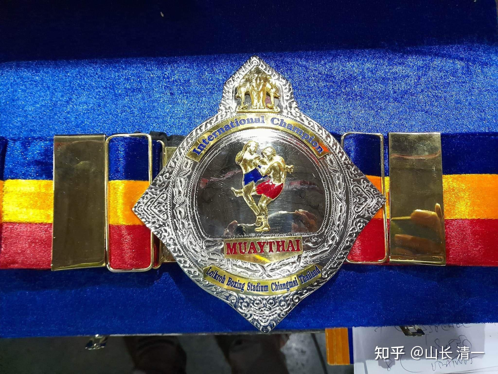
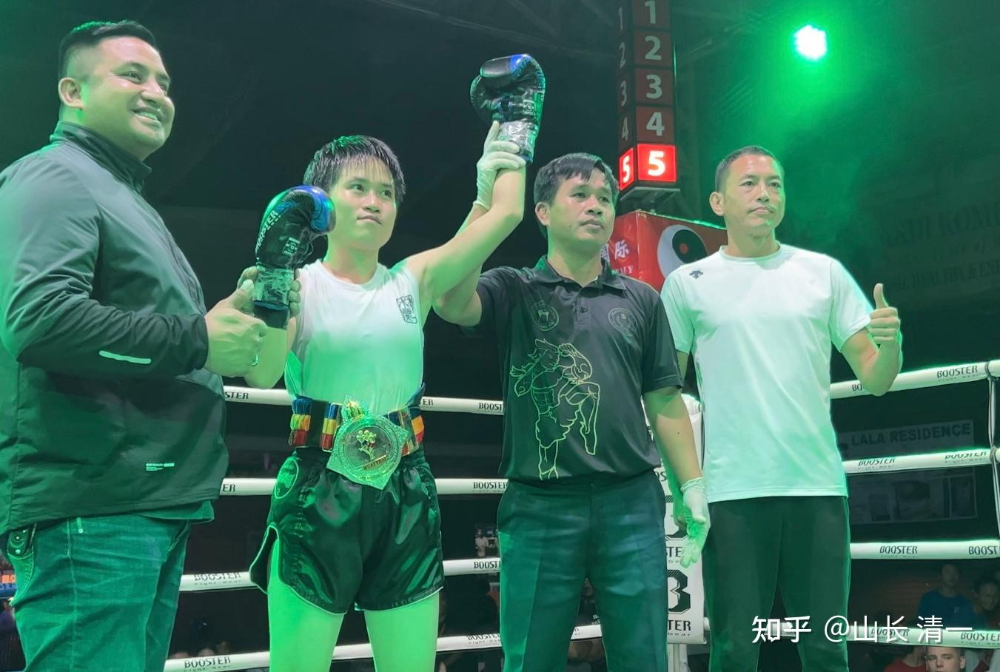
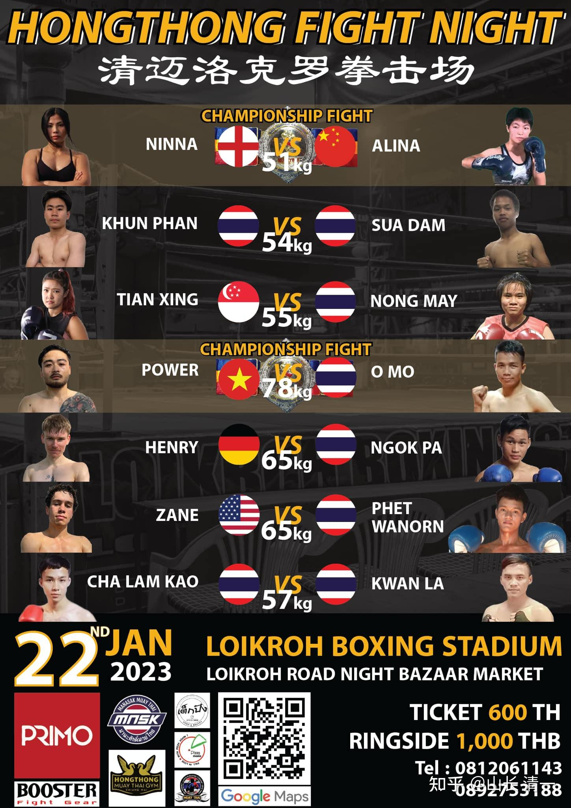

这条金腰带已经到手了！

*清一武道馆获取的首条金腰带：51公斤清迈地区拳场冠军*

虽然木兰们击败了不少地区冠军，但这是清一武道馆打了77场比赛之后，自己拿到的第一个正式格斗头衔：清迈地区的拳场冠军金腰带！

这个冠军争夺战，原来是提供给佳慧的机会，将在大年初一和英国拳手NINNA比赛争夺冠军。这个拳手，属于泰国HONG THONG拳场的签约拳手，是一个英国人。这个拳场知名度较高，多名运动员，在曼谷的两大拳场打比赛。这个英国女拳手，据说实力很强。同级别的泰国拳手，都已经不是她的对手了。她原来也只能越级挑战超过自己很多重量的泰拳手。这一次的赛事，是一场特别的专场赛事，所谓的HONGTHONG 格斗之夜。就是这个拳馆赞助的专场格斗赛事。主要目的，就是通过这个赛事，帮助这个拳馆的拳手，通过比赛拿到战绩和奖项。

他们这一次，挑选中国木兰拳手来打，其实是用来陪他们玩的。赛事方和参赛者，都以为可以轻松击败中国拳手。似乎这个拳馆对木兰们不太了解，不知道木兰的厉害。这个主办方佳慧很少参与他们的比赛 ，其他木兰来打过比赛。佳慧去年刚开始打比赛时候，最初几场是在这里打的。后来被泰拳馆闹矛盾，拳馆馆长认为她的技术不泰国，就把她停赛了。后来她就退出这个泰拳馆，就再也没有在这个拳场打比赛了。他们近期遇到她，一直邀请她重新回来打比赛。这次是泰国的老拳师，安排佳慧第一次回L拳场比赛，赛事方算是很给老拳师面子，让佳慧直接去参与冠军金腰带争夺战。

但---本质上，他们并不相信佳慧有实力拿到冠军，应该也是想看看这个盛名在外的英国拳手，是怎样收拾中国人的。邀请比赛，其实主要是给老拳师个面子。如果他们知道金腰带铁定会被抢走，恐怕也就不会安排木兰参赛了。因为轻视，反而我们赢得了机会。

为啥我知道这些内情？因为我看过赛前的采访，以及这个拳场的视频。其实现场的镜头，从比赛还没有开始，一直就是围着这个英国拳手转的。镜头就根本就没有给木兰（我看的赛事方直播和录像镜头）。这个英国拳手表现，赛前也是一副轻松自在，似乎笃定金腰带就是她的了，比赛只是走过过场而已。她在赛前表现得非常的开心！周围的人都在追捧她。挺有冠军相的。实际上她也的确是个很凶悍的人，敢打敢拼，只是遇到木兰不好使罢了。

一开始，我就认为---这个金腰带肯定是我们的。英国人不是我们的对手。佳慧知道这个英国拳手打过的对手，也和木兰交过手，知道她的实力还行，但也没啥特别之处。比赛的情况，是这个英国拳手，需要艰难打满点数的强劲泰国对手，却被木兰两次轻易KO。但英国人自己，肯定不知道佳慧打过什么比赛（由于语言限制，很多信息英国人不可能知道）。所以英国人应该很轻敌，认为中国拳手应该比泰国拳手更好打。估计泰国的师父们，也给了她这种错误的信心和概念（泰国的拳师们，普遍看不起中国拳手，认为技术差，不是泰国人的对手。就算他们跟我们比赛输了，泰国人也不承认我们的拳手实力强，只承认是自己没力气，是意外了，之前受伤了，等等的找各种理由）

其实比赛的前一天，木兰就出了意外。在练习的时候，佳慧与郭旗练内围对抗，郭旗由于换了很多方式都制服不了佳慧，急了就使蛮力，最后硬性的摔倒佳慧，他也失去平衡，全身压了上去，导致佳慧的脚腕扭伤。佳慧当场就哭了，难得现在面对一个本来可以轻松获取的金腰带，几乎是送到手上，却突然失去，所以特别难过。

不过她很快调整过来：成功不必在我。所以她把精力放在疗伤，修复，和帮助队友获得胜利上。可选的，能代替她上场比赛的人，就是明晓和谭木兰。她们两都有实力获取金腰带。但明晓的状态不够稳定，时好时坏，所以决定等她打完大年30的比赛（21日的76战），再决定取舍。如果明晓能够打出佳慧75战一样的技术和心态，这个金腰带，就让她去争夺。如果她打完后，发现没有确定性，就让谭木兰去打。两人的实力都差不多，关键是心态上谁更稳，就选谁。结果大家知道，明晓打的76战。有些拘束和紧张，没有打出自己的实力来，所以只能让谭木兰上了。（陆鸽虽然敢拼敢打，但练拳时间相对谭木兰更短，桩功也不够稳，对付金腰带还有些吃力，所以没有列入考虑）。

对手拳场出的海报：上面的名字和图片都是佳慧的！

*图中注明了两场是冠军争夺赛*

我相信比赛当天，对手知道她的原定对手受伤，新换了一个中国的新拳手来打，估计都笑死了。认为这场比赛就是让她出风头，狂虐中国拳手的。据我们所知，现场很多英国游客来观战，他们都下注英国拳手赢。可谓众望所归。刚开始第一局，观众和对手方都特别的兴奋，以为木兰会倒大霉了。代表对方拳场的支持人，也特别兴奋，话很多，但最终，特别是最后一回合，他们全都不说话了：眼睁睁的看着自己的明星拳手被击倒，晃晃悠悠的都站不稳了。最后宣布木兰赢了的时候，观众席上这些人都沉着脸，一声不吭。英国人一向极为傲慢，很难接受自己输了！

将来，英美人，被中国人打脸的记录，会越来越多的！我们一定会做到这一点的

回复看现场直播的网友点评：

谭木兰没打几场实战，有机会顶替佳慧打冠军争夺赛，居然就赢了，这是啥水平啊？！！[表情][表情] 清一武道馆真是藏龙卧虎啊！赞叹！

我的回复：如果是佳慧上，第一回合，这英国拳手就会被KO的。木兰们内部，还是有一些实力差距的。不过佳慧上去打，效果上反而不如谭木兰这样打更好看。谭的实力，经验，都差一点的，双方打起来，这种比赛才更精彩，也更能看出木兰们的水平。因为差了这一点，她让对手前几局有机会发挥自己的实力水平，可以看出对方其实很凶悍，只是她发挥了也没用。与佳慧打，佳慧根本就不会让她有机会去发挥实力和本事，会让她忘掉技术，这样就会提前结束比赛，锁定战果。因为我让佳慧这一次金腰带争夺战，上场就不要给英国人面子，第一局开始就放手死打，第一局KO对手都没问题，不让她拳，不给面子。但泰国人，因为我们要长久相处，反而让她前面两局放放水，别打太狠了。这英国人的做派，傲慢自负，还敢死命冲，一开局就想拼命KO我们，更是找死。佳慧不下狠手揍她才怪。

这个英国拳手非常的傲慢，自以为是强手无敌，没有做好赛前功夫。这个金腰带冠军头衔，其实是为她定做的。主办方的镜头，赛前一直在拍她，她的表现也是很自信，她看不起中国人，特别是木兰新手，她就更看不起，估计也从来没有研究过我们。她在第一局，率先被谭木兰踢中腹部后，她很意外，结果就爆怒，后就奋力冲击，想要快速的扳回来，快速KO掉“不懂事，敢惹他”的木兰。虽然当时她看起来很凶，其实仔细慢动作看，虽然谭木兰有点没料到，防守有点乱，但也对她没造成实质性的威胁。大量重击拳，都被架开了，没打上头部。只要木兰的心理素质好一些，稳住阵脚，扛过去就行了。如果换佳慧和陆鸽这种心态更强悍一点的上去（她们两个如果被人这样攻击，挨打后就反攻更狠），英国拳手敢这样冲锋，我们以攻对攻，她就很容易被KO。谭木兰过于保守，以原地防守为主，还击也不够狠，才给了她打下去的机会。

从第三局开始，敢冲敢打的英国拳手，就已经耗尽体力，最后站都站不稳了，如果不是裁判一直保护她，特别是最后一局，这种保护特别明显，英国拳手就已经被Ko了。显然：这个英国人，比泰国拳手笨多了。假如她采用甜水的打法，谭木兰恐怕会失去这块金腰带的。

对方拳馆知名度很高，连主持人都换了对方拳馆的人来主持，刚开始很兴奋，势在必得。最后看呆了，都不说话了。他们对这个结果非常意外，没想到自己最强的拳手居然打惨了（原来她也是同重量级别无对手，只能去打比自己重10公斤对手的人，跟佳慧一样）。所以，她以为这次金腰带比赛，只是打跟她同重量级的对手，就是势在必得。没想到却毫无挽回的败了。如果她状态好一些，出手稳一点，躲着木兰的攻击，打反击，结果不要打得这么狼狈，打满五局后，就算我们实际是赢的，主办方也肯定要把金腰带判给她。毕竟“关系”不一样。只是她最后一局实在太狼狈了，连还手机会都没有，只是勉强死撑下来。胸腹部英国拳手还中了不少重腿，最后一局，还被直接踢翻在地，居然没倒下，的确够顽强了。回去肯定要好好养伤的。

谭木兰进入比赛的情绪兴奋起来较慢，比较适应泰国式的缓慢打法。这种英国人傲慢自大的激进欺负人的打法，心态差一点的拳手，的确会被吓住。但木兰们心智都很强（心智差的，已经被我退训了）。所以，她们都有机会赢的。技术上，英国，泰国的拳手都不占优势。这个拳手明显是善于拳击（英国的国技），其实这种拳击方式，根本威胁不到我们，绝大多数都被防住了，勉强打上的也没有威力。木兰们明年就会去打拳击比赛了，把欧洲，老牌帝国主义最得意的国技，也要干掉的。一年我们就上一个新项目。后年，我们就转战MMA和UFC，巴柔。一年换一次对手。我相信：今年打上一年的话，时间已经足够泰拳彻底打翻了。今年大约会安排300场对外的赛事。应该会有不少对西洋人，欧洲人的比赛，我正在协调我方跟西洋人的比赛。打八国联军，在格斗赛场上把他们打倒在地，是我们作为中国人的追求和目标！

赛事点评：

[https://www.zhihu.com/zvideo/1600855404174540800](https://www.zhihu.com/zvideo/1600855404174540800)

佳慧虽然不能上场，但她今天双拐支撑，依然要求去拳场第一线，因为她要帮助伙伴们获得胜利，所以一直在场边作指导，帮助谭木兰调整节奏，参加比赛。毕竟是冠军争夺战，对手很强悍的，不可轻敌。她在前三局，发现对方善于拳击，喜欢用拳，就告诉谭木兰，不用跟她拼拳，要跟她拼腿，用正蹬打击对手，消耗对手体力。第三局之后，发现对手体力严重下降，就说现在可以跟她拼拳，拳腿齐上，这些指导都很在点。与对方教练和团队，只会乱喊乱叫---“出扫腿”，“使劲打她”相比，高明多了。木兰团队特别的团结，互助。金腰带夺取成功，是团队的努力！

裁判偏向好严重：2:52秒，马上英国拳手就要摔倒，裁判马上介入停止（这明显违反裁判规则---拳手内围在做技术动作的时候，裁判不能干预，双方没有技术动作僵持时，才能让双方分开）。第五局更是明显的拉偏架。

英国对手不善于分配体力，首局就用力过猛，想KO木兰不成，最终遭遇强大反击，自己体能撑不住了，第四局开始就不行， 特别第五局都站不稳了。谭木兰第五局，体能也出现下降情况，但吃素的她，比吃肉的英国人还是强很多。所以第五局击倒英国人两次，英国人都快打傻了，但真的很顽强，虽然有裁判帮助，也真有实力的。

看了昨晚的这场比赛：谁还敢说对手差的？她们遇到木兰，固然差劲，但遇到别人，强悍你就看到了。这个英国拳手，从一开局的强悍，到第三局的勉强，到第四局的求全自保，技术动作完全变形，看起来就像不会打一样，你以为是我们的对手差吗？是我们让他们的技术失效，只能挨打的！

泰国打了77战，我们的拳手一次读秒都没有挨过，更别提KO了。难道这是偶然？看不懂，没关系，多尊重祖先的智慧！

今晚还有八场中泰超强度的对抗比赛【中泰春节对抗赛】：泰国人会甘心让我们的拳手，去夺走全部的胜利吗？还是会竭力维护自己的泰拳不败的地位？

公主班的啦啦队，今晚有何种精彩表现？

今晚的醉拳表演，会不会在场上实战中出现？

中国功夫大战泰拳，今晚8场比赛，请关注B站直播！

[哔哩哔哩直播，二次元弹幕直播平台](http://link.zhihu.com/?target=https%3A//live.bilibili.com/22489198%3Fbroadcast_type%3D0%26is_room_feed%3D1%26spm_id_from%3D333.999.0.0)[今日国际学校的个人空间-今日国际学校个人主页-哔哩哔哩视频](http://link.zhihu.com/?target=https%3A//space.bilibili.com/487498588%3Fspm_id_from%3D333.337.0.0)