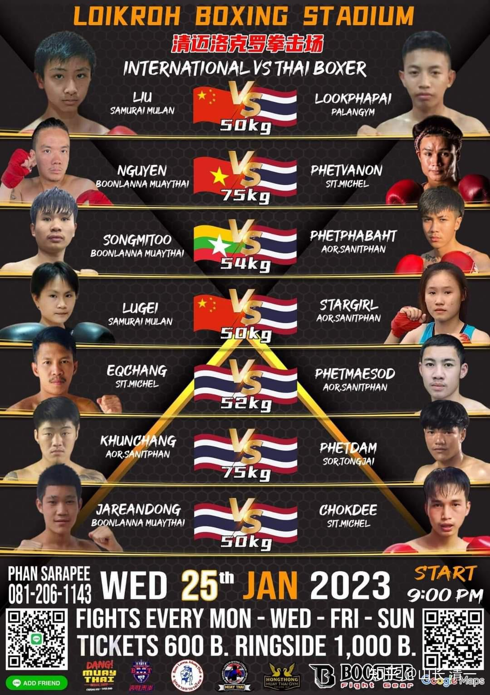
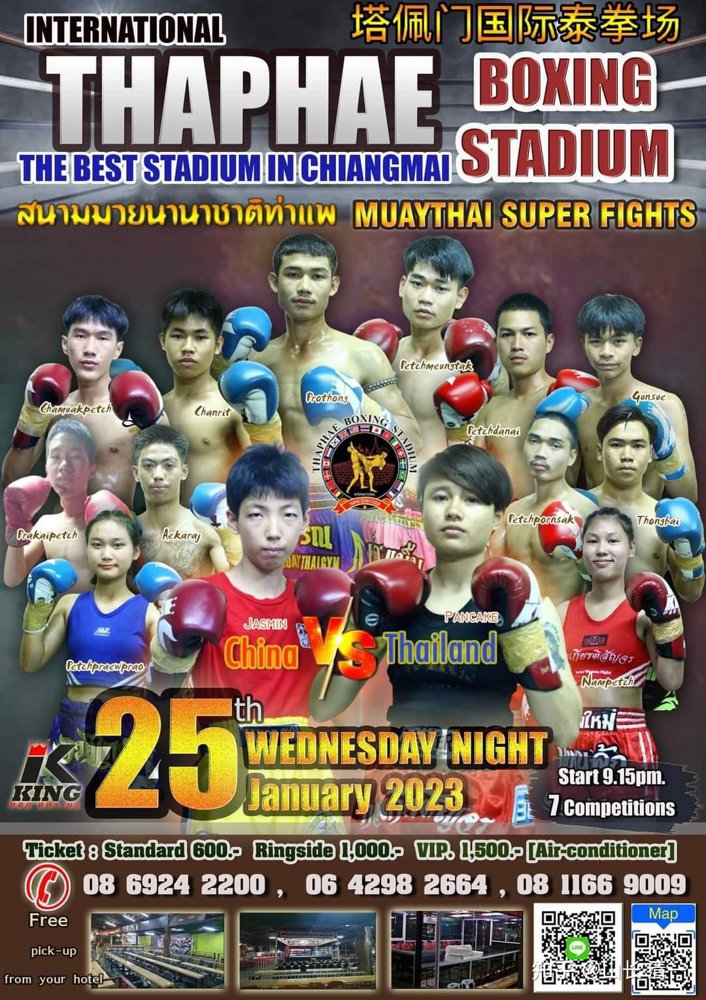

刚刚打完一场跨年大战的清一太极拳手们，发挥我军连续作战的精神，今晚继续征战泰拳场！

今晚比赛上场的拳手是三位：刘轩宁，陆鸽，明晓，连续作战，开打太极征泰85-87场。

三天后（28日），谭木兰和明晓，将去400公里外的外府，打地区冠军争夺战！

一周后，2月5日，佳慧将面对世界冠军甜水的二番战，孩子们都很努力，为国争光！[表情]

明晓今晚的对手是帕卡---这个世界青年组的冠军流年不利，跟木兰比赛多次，还从未赢过一场，甚至没有机会打满比赛就被KO。最惨的一次，是她被木兰们一拳打断了鼻梁，幸亏后来去正骨回来了。 但她显然没有放弃复仇的愿望，现在还继续挑战木兰比赛。由于明晓28日，要去外府打泰国北部地区的冠军比赛，今晚并不想打比赛，想要恢复和休息。但主办方就是逼她非打不可，说已经上海报了，不来就不行。所以---今晚，复仇心切的帕卡，能否乘明晓刚打完一场艰苦的大重量级比赛（上次比赛她与比她重10公斤的对手打满五局，打得非常吃力），她的体力还没完全恢复的机会，扳回一局呢？这是她最好的机会了。否则体力储备完整的木兰，她是没有任何机会的。

另外，明晓最近的三场比赛，都打满五局被裁判判输了，她也特别郁闷。明晓会不会今晚发狠，继续KO帕卡？不给她翻盘的机会？我真同情这个可怜的泰国女孩，希望她今天不要这么倒霉了，更希望她不要受伤。只是----她的武器实在太单调了，擅长泰扫腿的她，对付慢节奏的泰国拳手还行。但泰国扫腿，要在快节奏的木兰们身上，是用不出来的。但帕卡的拳击技术一般般，内围也不行。所以---她只要用不出来富有威胁力的泰扫腿，就只能挨打了。

另外还有一个消息：

输给谭木兰的英国拳手玲娜，对比赛结果不服气，找到赛事方要求和谭木兰打二番战。

谭木兰大气地接受她的挑战，并表示：上次英国拳手由于轻视对手，体力分配不当，导致后面几局体能不足，最终比赛失败。很理解她想打二番战的要求！也愿意跟她进行二番战，不会小气避战的。如果她赢了，就把金腰带奉还给她！

另外---如果英国人愿意打原来计划的金腰带争夺者佳慧的话，佳慧也很愿意来跟她打一场比赛，只要琳娜赢了，也奉还给她金腰带！这够意思了吗？

我在这里也凑个热闹：

不是有某些中国人，认为我们打的泰国金腰带比赛是假的吗？你们就来现场打假吧！我就跟你赌一把，你想赌多少我都陪你玩！把钱放在拳场主办方这里就行（我可不放心你们的人品）。你们总不至于认为：英国人也被我们买通了，来配合我们打假拳吧？以为她是一龙吗？如果她的拳馆，愿意跟我对赌，我也没意见的！照样上！

另外，你肯定怕我利用泰国的关系来黑你。我肯定不会这样做，但我也担心你买通裁判来黑我呢？泰国人，只有有钱，干啥都行。所以---为了双方都不被黑，我们约定----不KO，双方就算平局。不分胜负！以KO对手为标志！你敢跟我赌吗？这样肯定最公平。你总不至于认为我花钱去买琳娜输吧？我只会花钱买我的木兰赢！不想拿钱做恶心人的事情！

只要大家玩的开心就好！我们不用见面谈细节啥---你们自己跟拳场老板谈去。让他做中间人就行了。泰国---赌拳是合法的！