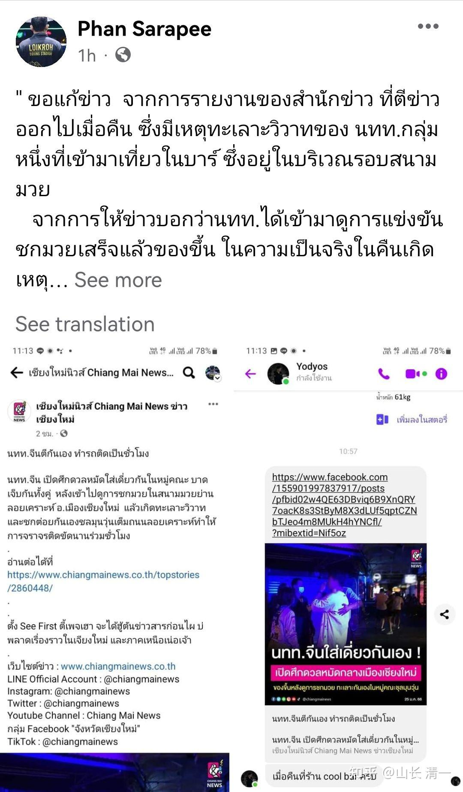

大家熟悉泰国的，都知道泰国有巴育，他是泰国的总理！但巴泰是谁呢？难道是总理的弟弟吗？这就真有点稀奇了！

巴泰，就是巴结泰国的中国人。就像哈巴狗一样，有京巴，还有韩巴！最新亮相的一个品种，就是“巴泰”。叫他们泰巴也可以。我们的家长，还把几个泰巴的照片发给我看了，肥墩墩的，估计是肉食动物。跟我们这种吃素的人，的确很不一样。不过----我还是给泰巴一点面子，就不放照片出来了。泰巴拳馆的照片也不放出来了。免得影响他们的生意。特别是木兰和武士们的粉丝越来越多，将来这些人到处去泰国就地寻找这种珍稀的泰巴收养的话，会严重影响他们的生存和繁殖的。我希望大家还是远远的观望就行，让他们自己活好自己，自生自灭好了。这个品种，据说很不好养。不像京巴还会对主人很忠诚。他们就是见利忘义的一群小怪兽。你们就别去弄来放在家里，只会把家里弄得一塌糊涂的。

转发：公主班刘家长给我发的信息：

山长好，关于“中国日”我在现场所目睹到的事情经过：我和几位在这边的家长当晚一起去现场观战，到了拳馆之后我们发现有一个看台聚集着一些中国人，想着可以在中国人比较集中的地方可以更好的为我们中国的拳手加油，于是我们便选择了这几个中国人前排的位置坐了下来，并和他们聊了几句，他们说今天的拳赛第4和第5场是他们的朋友，这两个拳手都是一个拳馆的，他们是过来为他们加油的。同时竟然还有人问到：你们不是叫今日学堂吗？这么又改成今日国际学校了？我们说我们两个名字都叫，海外校区的就叫今日国际。由此可见这几个人中有人对我们今日学堂是有所了解的。他们又问到：这里的这些拳手都是职业选手吗？我们回答说：不是，他们都是在清迈上学，业余过来打打拳的。

当拳赛开始时，他们也会偶尔喝彩，但也没有听到明显的倾向，在第三局谭木兰上场的时候，他们认出了谭木兰就是昨天在L拳馆拿到金腰带的选手，就听到有人说：他们学校是没啥人了吧，哪有这么干的，昨天才打完今天又打，这样很伤身体的，只有中国人才会这么干。当第四局即将开始的时候，只见后面有个人大声的喊下面的一个拳手，用中文在喊“小伟”，把那个拳手喊道了身边，往这个拳手手里塞了一把钱，目测有2-3千泰铢左右，并说：“一会就看你了哈，KO了他。”我们后来才知道这个拳手原来就是第五场明骐的对手，当第五场即将开始的时候，这几个中国人全部冲到了台下，和对方的教练和场务聚到了一起，开始为这个拳手拼命的加油呐喊。整个过程大家都看到了，这个拳手被明骐各种追打，但最终撑过了五局，判平，这样的判决结果大家心里也都知道有数了。赛后只见这位拳手把钱给了一个小胖子，这个小胖子又把钱给了当时递钱给他的那个中国人，就等于把钱又还回去了，这场比赛结束后那几个中国人就迅速离开了。

以上就是我们目睹到的一些情况，今天把事情梳理了一下，然后对应在清迈群的一些信息发现昨天收钱的那个拳手应该不是中国人，是一个在中国人开的泰拳馆里的一个泰拳教练的孩子，昨天坐在我们身后的人也在这个清迈群里，今天关于这两天的比赛还在讨论，这个群里竟然还有清黑，原来我们今日学堂已经这么有名气了，在国外的中国人竟然也有这么多知道今日学堂的了，看来今年是时候打脸这些黑子们了。

这群中国人在赛后的分析是：第一，我们是为了打广告招生。第二，为了给家长交答卷，所以（1）选了云南菜市场里面的小拳馆包场，（2）用自己的举牌小姐、啦啦队和解说，把客场变主场。（3）拉开公斤差，以大打小，说我们的两位男子主力队员（郭旗和明骐）目测实战功底在3年以上，级别至少高出5公斤，还说现场有人认出第五场的男选手（明骐）是曾经的上海散打队员。

首先，我们中国日的拳场是位于清迈最热闹的清迈夜市里，来过清迈的人都知道这里的客流量是什么样子的，虽说在清迈算不上数一数二，但也绝不是不知名的小拳场。第二，我们的举牌小姐，啦啦队都是公主班的孩子，山长为了锻炼她们让她们去实践，去社交，并且还特地交代不用搞的那么专业，就是去玩，怎么开始怎么玩，而主持人也是抱团小组李奕衡临时客串的，而所谓的主客场之说完全是无稽之谈，按照这种说法的话我们的拳手哪一次比赛不是客场？这影响我们赢得比赛了吗？第三，说我们拉开公斤差，以大打小，还说明骐是专业散打运动员之说就不用过多解释了吧，等视频出来了大家可以回看，自己判断。**（明晓的对手，比她重了10公斤，这群人明显颠倒黑白）**

赛后在这边的一个清迈群里，有人提到了大年初一谭木兰拿到金腰带那场比赛，也说是我们打的假拳。这就是这边一些中国人的普遍思维方式，无中生有，颠倒黑白，通过黑别人来达到打压的目的，我们唯有以更多酣畅淋漓的胜利和KO，来打他们的脸了，当我们还想去调查更多关于这个拳馆的一些信息的时候，山长却说没必要，他们不配！确实，今年300场的胜利将是我们最大的底气，相信今年的清一木兰和武士们将会用绝对的实力来捍卫我们清一太极的尊严！拭目以待！！

**我的公开回复：**

我这个人，有点毛病，一直不喜欢耀武扬威，自以为高人一等的洋人！但我更讨厌的，还不是洋人，而是给这群不良洋人当走狗汉奸的中国人！我看了上面的这些信息，特别生气！汉奸们当年投靠日本，借助日本人的威风来欺压中国人，耀武扬威！现在，居然还有一些中国人，要去投靠泰国人，去巴结泰国人，还妄图靠泰国人的手来打压我们捍卫中华荣誉的中国人。最后没达到目标，还叽歪，吐槽，不甘心，背后含沙射影！这种人，实在太恶心了！

清迈这些中国人，据说是在上海就开拳馆，来清迈开泰拳馆五年了。我们理解：你可以认为我们不专业，可以不服气我们的技术，说我们是假货。这完全没问题，每个人都有自己的判断标准。我想打击现代格斗，但你想捍卫现代武术的声誉，我想打泰，你想巴泰，捧泰，都没问题。双方都可以用实战来捍卫自己的观点。你完全可以毛遂自荐，请主办方的泰方管理人，安排你们认为“正宗的现代格斗中国拳手”上台，来擂台上好好教训一下我们这群“民间武术骗子”。你可以学徐晓东打假，我们支持和配合你！

就算你想开拳馆，教武术，你想要借我们的名气，压人一头来出名，也是完全没问题的。只要是公开的，正当的竞争，没啥可说的。我理解你们在泰国开泰拳馆，真正的目的是借用泰拳的威风，来赚中国人的钱，让中国人找你们学拳。你认为我们打泰，将来会影响你的生意。因为---你们除了教 中国人以外。就不会有学生愿意找你们学拳的。泰国人不可能找你们的，其他洋人肯定也不鸟你们！你当然要巴结泰拳了。当然会认为我们打泰就是砸你的饭碗了。因此，你比泰国人都恨我们也可以理解。比较---夺人钱财，如杀人父母。你对我们有仇恨，就公开来报仇好了，我接你的招！有本事就挑了我们，没本事，你也别在清迈装啥传授正宗泰拳，专门骗中国人。这么多的泰拳馆，别人凭啥相信你？你总得拿出一点真本事，来证明你自己吧？泰拳馆才是你的对手，不是我！你打不赢我们，你也可以打泰证明自己的地位。泰国数千家泰拳馆，都是这样做的，你不能光靠骗人赚钱呀！

**清一武道馆，不会对中国游客开武术培训课的，我们不是你的同行，我们不做这种生意！我们也不赚这钱，我们不想，也不会去影响你们拳馆的生意，不会去忽悠中国人来练拳。我们根本不赚这种苦力钱。我们甚至不赚教中国人练太极的钱，我们全免费提供培训服务！但---我们只收学霸来学拳！只收有理想，有志气，要打败洋人的年轻人来练，我供养一切---包括安排拳手们未来的就业！**

**你以为我们要抢你们的顾客?游客? 真心话，我还看不上！你们自己玩去！别来烦我！**

虽然我们申明，中国人不打中国人，我们不会主动去挑战中国武林，去打中国人。我们也主动放弃了在中国国内发展，不跟你们这群武林人士争名夺利。我们离开中国，专门来泰国打泰，打洋人，就是要为国争光。你们这群人不服，可以派人来泰国追打我们。也可以你们自己来打泰。你如果不敢打泰，想要打我们也行。你想自己找抽，我们也愿意赏光，让你打打脸。想找打，还不容易吗？自己跳上拳台，大家公平决斗就行了。有本事就KO我们。别去用买通裁判的方式来获胜，用拳头，用实力来比高低。

你们不服气，要比钱，你们恐怕也拼不过我的。谁怕谁？一个开拳馆的老板，你有多少本钱来拼？

你们想要比泰国的关系，也比不过我们。我们的木兰全都泰国本土化，我们的泰语，比泰国人还溜（泰国拳手往往学历不高，词汇量其实很少，不如我们的木兰学霸，她们翻译文章都很好，泰国拳手很多读不懂深奥一点的泰国文件的）。我们的泰国朋友比你们更多，更铁。不像你们只会窝里斗！

你们这群所谓的中国武术人，真有本事，我们一样服你们！也愿意把我们的名誉白白送给你！但---你们这群所谓中国“正宗武术界”人士，只会开拳馆赚中国人钱的馆长们（我绝对不相信泰国拳手会去你们的拳馆练拳），你们除了背后黑我们，在微信群中污蔑我们，还有啥手段？你污蔑孩子们用真打实战打出来的成绩，你污蔑我们连击败英国人的金腰带，都是花钱买的假比赛。要是真的假拳，你有本事，上来打不就行了？

你们去找个人来打吧，随便什么人。只要在拳台上公开的击败谭木兰，击败木兰佳慧！这个清迈地区的金腰带头衔和名誉，我们就送给你。不KO就算双方平局。我们只让泰国的裁判，场上维持比赛的规则，不负责裁判最终的胜负。我保证不用我的资源，以及我的泰国关系，人脉来欺负你。你也别跟我玩阴的。比赛按照缅甸拳规则来算----打满五回合，没有KO对手，双方就算平局，不分胜负！双方拼本事，不拼阴谋！

你们敢来吗？知道你们爱钱，没钱啥都不干。可以呀----我们来对赌，我陪你玩！你们有本事就来打假好了。我还给奖金，名利双收，你敢不敢来打? 中国拳手你找不到打赢我们的，我还让你可以去全世界找对手来跟我们打。有本事，就找来击败木兰的拳手好了。

至于男拳手：等我们的男拳手多一点经验，拿到泰国地区的金腰带，你也一样来挑战打假好了，也给你一样名利双收的机会！

怎么样？你们这群泰巴，就只知道私下拿钱买通泰国的主办方裁判，买通拳手，故意黑我们。还买通从小就练拳的泰国父子拳手，假装新拳手来打我们，就真的很令人恶心了。中国人花钱，请泰国人来打中国人？这啥行径？你们就算赢了我们，只能证明泰国人厉害，跟你几个泰巴牛不牛，有个屁关系！只跟你的臭钱有关系！花钱让泰国人来“证明中国人不行”你是啥居心？你让这些拿了你钱的泰国人，咋看你们这群中国人，毫无荣誉。一群汉奸走狗，泰巴巴？泰国人内心绝对瞧不起你们。

我相信：拳台上被我们拳手臭揍一顿的泰国人，内心一定最尊重我们。他们绝对更愿意跟我们交朋友，做真正的互相尊重的好朋友，而不是跟你们这群无耻的汉奸为伍！你们除了花钱买通泰国人，骗中国人来消费泰拳弄点小钱，你们还有啥本事在泰国混下去？

当佳慧手上架着双拐杖的照片亮相的时候，你们一定高兴坏了。但不少被木兰击败，KO的泰国拳手，都第一时间跑来安慰她。对她的状况很同情和吃惊---她被谁打成这样了？泰国拳手们都特别的关心和体贴人。要说泰国的人缘，我们在要比你们这群汉奸强得多！泰国的很多拳馆馆长（不仅仅是清迈），不少外府的馆教练拳手，都喜欢找木兰交朋友，说他们的拳馆，随时欢迎木兰去。这才是中国人的荣誉和尊严。你们除了含沙射影，对中国人背后使手段，还有啥剩下的？

不服就干！

有种你就来打！

附录：昨天有人在泰国拳场闹事，丢脸了！

木兰佳慧提供的泰国信息：

有一条消息转发给大家。今天一大早就有泰拳场的朋友给我转发了一条新闻，标题是：**中国人互相打架，导致堵车数小时！**新闻内容是：

** 【Chiang Mai News】**

2023年1月24日深夜10时30分，清迈“Ruam Lanna”救援协会接到Wiangping救援中心（1669）的通知，称在Loikroh拳场前发生争执. 组织了 601 救护车。工作人员和志愿者一起检查，发现一名外国男子被发现颈部有开放性伤口，执行基本急救后被救护车 601 带到中心医院。而另一名受伤者也是一名外国女游客。

据了解，此次外国游客争吵的原因是，有旅游团进入该拳馆观看拳击比赛，发生争吵、打架。填满道路，造成数小时的交通堵塞。直到警方稍后清理该区域并将调查肇事者以采取进一步行动。

阅读更多

[(มีคลิป) นทท.ต่างชาติเปิดศึกดวลหมัดกันเองเจ็บทั้งคู่ - Chiang Mai News](http://link.zhihu.com/?target=https%3A//www.chiangmainews.co.th/topstories/2860735/)

评论区也很不友善，我大概看了一下，有人说还没有确定是中国人。但更多的是嘲笑的言论诸如：

“哈哈，看完泰拳后自己再用中国拳打一架”

“这就是中国旅游团啊”

“你能对清迈的中国人有什么期待，我们接受一切，只要中国人来旅游就行了”

“推广中国拳，哈哈”

我最讨厌中国人内斗！暗斗！

丢脸丢到泰国来；实在恶心！

佳慧回复泰国朋友说：现在，还不确切知道是不是中国游客干的事情。如果真是中国游客干的事情，我为他们的不良行为感到羞愧！有些游客的素质真的好差！堵塞交通，影响了泰国的正常运行，非常不好，我替中国人对此表示非常的抱歉！