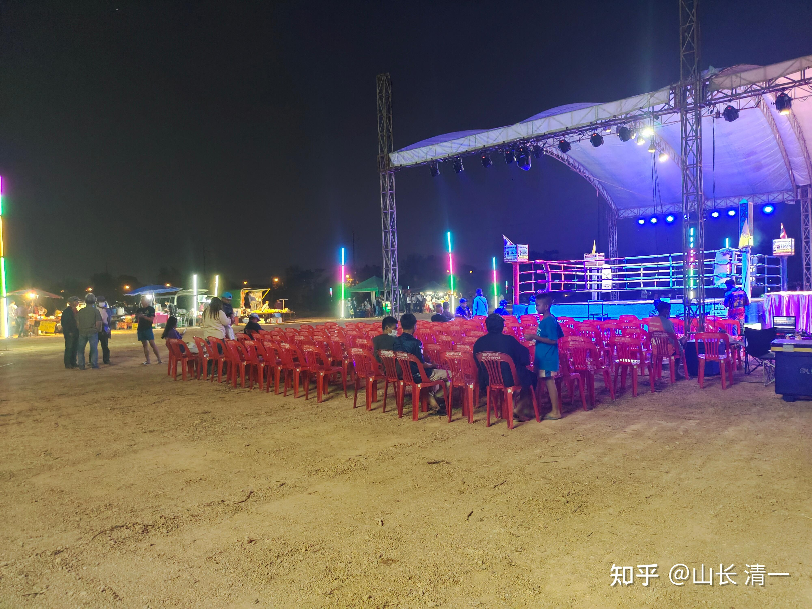
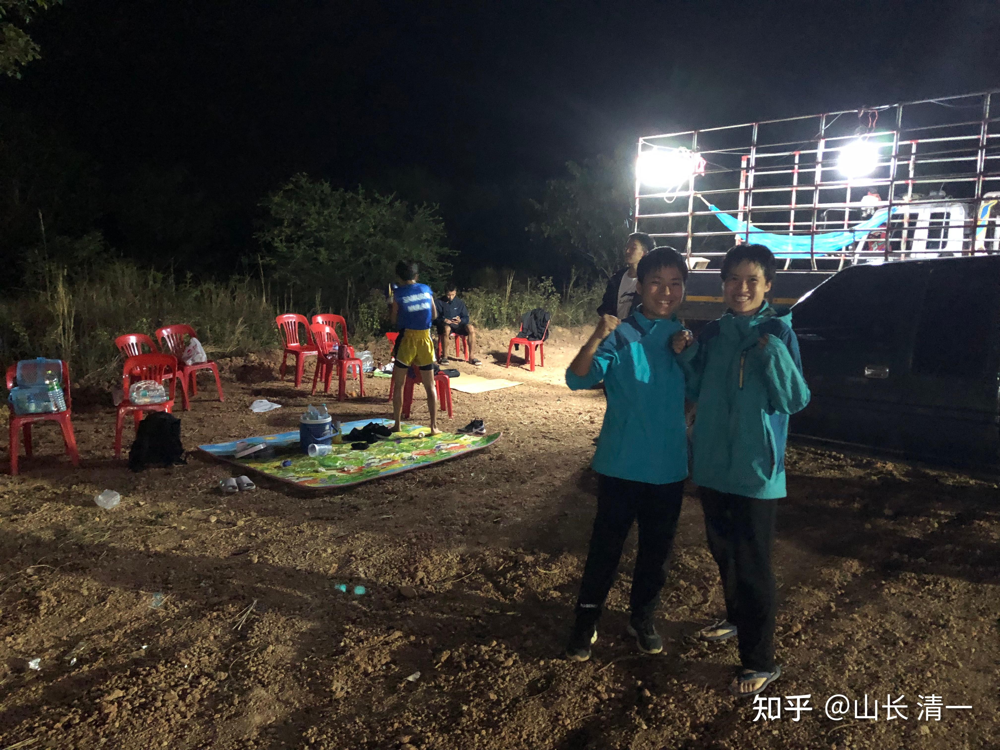
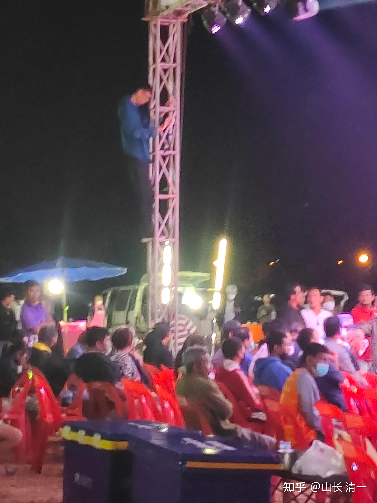
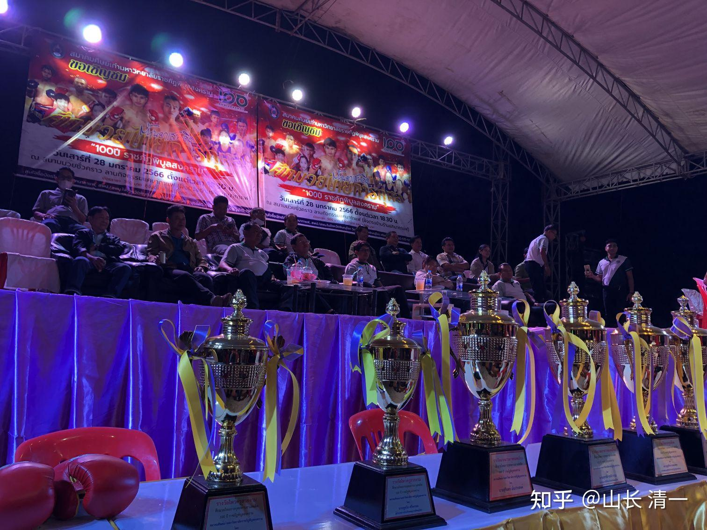
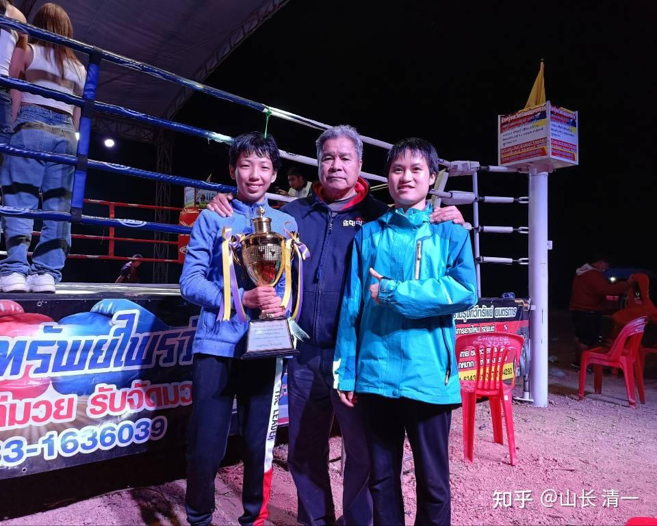
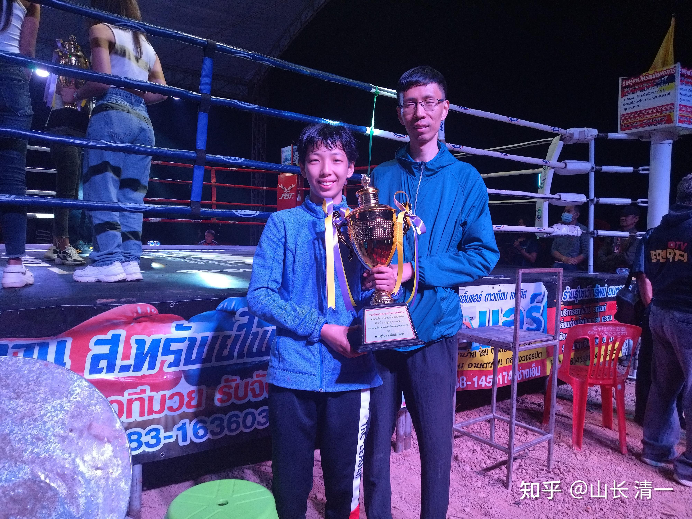

28日晚上是一个泰国的节日，泰国老拳师安排了谭木兰和明晓去外府比赛，对手是地区冠军，据说实力很强，在曼谷打过比赛。两木兰也拿到了清迈冠军。所以这次跨府决战的级别还是比较高的，这也是泰拳界选秀的方式：最低的乡村庙会比赛，拳酬最低，初级选手在这里打比赛。然后是府城的定期比赛，如清迈的两个（现在有三个了）主要拳场比赛，拳酬大约比庙会赛多一倍。然后是跨府，跨区的比赛。这种跨区比赛，就是平常不在一起比赛的拳手，有机会和其他府的拳手比赛，决出高低。在这里，每个府的最强拳手，会遇到其她府的最强拳手。总在自己的府打，有很多局限，比如木兰们打来打去都是这些老对手，都已经很熟悉了。这样比赛的提高就不大！所以，有意重点培养的优秀拳手，会被所在拳馆的馆长，安排去打外府的跨府比赛， 就让她们有了更广阔的发展空间。拳酬也会高一点，因为要解决外地住宿和来回路费问题。但除了路费外，其实拿到手的和本城比赛也差不多。普通拳手，是没有兴趣参加这种比赛的。拳馆也只会支持有培养前途的优秀拳手去打外府荣誉比赛。打好了，就可以用外府比赛的优秀成绩和表现，以及自己战胜的对手的情况，档次。去找仑披尼，迦南隆的主办方，要求申请安排仑披尼的比赛机会！因此，泰拳这种完善的市场选拔机制，就保证了泰拳真正的优秀拳手有机会被选出来。中国的拳手，缺乏这个正常的系统，基本上都是靠潜规则，各种包装，包养出来的，所以权利会非常集中在一些所谓的“拳霸”---武术利益集团手中。我们也惹不起他们，也不想去投靠和巴结他们。所以我们来到更市场化的泰国打世界性的比赛！打泰国人，外国人。当然，打少了可以，以后木兰成批涌现的话，也许泰国的拳霸也不开心。不可能让我们吧冠军都拿走的。

泰国虽然鼓励外国人参赛泰拳，但骨子里面还是希望泰国人赢的。比如监狱的罪犯，如果打比赛赢了外国人，就会获得减刑和释放。泰国一个拳手，监狱判刑15年，但他在监狱里面也可以安排出外打拳。他击败了外国拳手，只关了一年半，就释放了，获得自由。一个贩毒的女子，在监狱里可以学拳击。她三年就拿到了世界冠军，击败了日本拳王，结果获得特赦，被释放了。后来她的世界冠军头衔，在和中国的蔡冬菊比赛的时候，被夺走了！现在只是前世界冠军了。

我2019年，认为三到五年，就可以教出木兰们那世界冠军，也是因为看过这个泰国拳手的训练和较少的纪录片。一个囚犯三年，就可以拿世界冠军，我们心灵自由的人，也不会差。事实上证明三年真的就够用了。三年还培养不出来的人，也没必要继续培养了，心智和悟性肯定不合适打拳。因此，如果三年内，少数拳手就是打不出来的，就只能让他们退训了。

这个故事，说明泰国人还是非常看重自己的拳手击败外国人的。所以每次打比赛，都会给我们安排有分量的拳手，不会拿菜鸟喂我们。甚至木兰们的首秀比赛，都会拿百战拳手来打你（谭木兰的首秀，对手就是清迈冠军级的拳手，现在已经去迦南隆拳场打比赛了），所以，每一场比赛，都需要认真的打。当时谭木兰连续三四场比赛都输给此人，别的新手都KO了对手，就她总是输比赛。她自己很着急，我也不怪她，因为她的对手的确很强，会动脑子，也特别了解我们的打法。据说这个拳手比赛的打法完全不同了，她打泰国拳手，有点像木兰们的打法，会使劲往前冲。就是对阵木兰的时候自保，尽量退开。谭木兰一开始就是让这种级别的拳手狂练自己，现在拿到冠军也毫不奇怪！

*外府比赛现场，时间尚早，人还未开始聚集*

*两木兰到达拳场后台做上场准备（离清迈近400公里外的外府）*

*明晓父亲为录视频也是拼了*

*主席台的贵宾和为今晚比赛准备的六座奖杯*

今晚有11场比赛，22个拳手参加！发六座奖杯！由于两个木兰都打的很好，应该会有一个奖杯的。因为内定的两个木兰的对手，都是泰国的荣誉拳手。我看到明晓在比赛前，有一个市长给拳手带花环的仪式，这是泰国比赛前，给最优秀的泰拳手（至少是金腰带拳手）的荣誉，说明她的对手非常的重要。明晓跟着也沾光，一起给了一个花环带。泰国拳界在比赛前，举办这个仪式，基本上就是认为这个泰拳手一定会击败外国拳手，为国争光的。不然就是公开的自己打脸了。如果认为自己的拳手可能会输，他们会尽量低调处理的（比如中国日的比赛，泰国人就非常低调的广播，说他们派出的是新拳手，刚学半年等等，只打了几场比赛）。连刚拿到金腰带的谭木兰，中国日都打满五局，无法KO对手。你居然认为泰方真的是新人来玩的中国日？

但笃定泰方可以收拾中国人的预期，开赛后就彻底失败了。明晓的第一局，泰拳手还是很顽强的，反应很快，出腿攻击的速度和力量都很强。的确是优秀拳手。但她应该没有料到中国拳手很不好打，而且节奏很快，打法也特别不能适应，所以泰拳手第二局就体能下降了，被击倒读秒。第三局更是毫无抵抗力，基本上没有出手攻击的机会，都是在拼命自保，尽管有裁判帮忙也无法改变命运，再次读秒。尽管她还是努力的站起来，很顽强的坚持比赛，但裁判最终看泰拳手没有希望取胜，为了保护她，就及时终止了比赛。第三局KO对手。此战压倒性的优势，给泰方留下了深刻影响，泰国金腰带拳手轻易被击倒，花环秀拳手被木兰打脸。但泰方还是很公平，给明晓发了一个【最优秀拳手奖】。其实这也是泰方的荣誉----我们泰国的金腰带，输给最优秀的外国拳手不丢人！贬低对手，其实是贬低自己。国人才喜欢踩别人，非我族类其心必异。这个排外的习惯，注定没出息！

*两木兰都在第三回合KO对手。安排比赛的老拳师非常自豪*

*获最优秀拳手奖杯 父女两人很开心*

**谭木兰感谢泰国教练让对手用扫腿来对付她！**

在明晓上场前半小时，谭木兰也击败了自己的对手。也是一个泰国地区冠军，金腰带拳手。也是在第三回合KO了对手。我还没看到她比赛的视频，估计也是有花环秀的。最有意思的是---谭木兰却没有拿到奖杯，但她的对手，反而拿到了一个大赛奖杯：是【最优秀泰拳舞奖】！估计是泰国的优秀拳手，就算是被KO了，但主办方为了安慰她，给了她一个这种有点安慰性质的奖！打拳虽然输了，人被KO，但拳舞跳得还是不错的。老拳师要求明晓，佳慧比赛都要跳泰拳舞，不许跳太极舞。应该是尊重泰拳比赛的习惯，不要讨人嫌。但谭木兰一直没学泰拳舞。这次打完比赛，老拳师肯定要给她安排曼谷的比赛，应该会要求她学跳泰拳舞了。她们会找播求学拳舞的，他拿过泰拳舞全国冠军！

外府这种专门在泰国节庆日进行的跨府庆典比赛，不是给游客看的比赛，而是给本国市民看的比赛。肯定是希望用优秀的当地明星泰拳手，来击败外国的拳手，让民众们高兴的。一般在户外场所，公开举行比赛（外国游客的比赛，一般固定场所，在室内举行）。只要比赛能够打满五局，爱国心很强的泰国人，肯定是判泰国拳手赢的。就像佳慧上次去外府打甜水一样。没想到：今天派出的两个中国木兰，全都把她们的地区冠军给KO了。没有给裁判周旋调整结果的机会。泰国人应该很失望！但两个木兰此战漂亮的出击，就打通了仑披尼或者迦南隆拳场的通道！

赛后10:20：谭木兰报告勤劳的：根据您指导的征泰攻略，确实发现泰拳手很懵，最后一局主要感谢她的教练不停让她出扫腿，不然也没那么快结束的[表情]。不过第三局我其实也有点急了，滑倒了两次[表情]

谭木兰感谢对手的教练，不停让她出扫腿攻击----大家知道泰拳扫腿不能用了吧?你用了，就是帮助我们更快成功。清一太极格斗，废掉了泰拳的最主要进攻武器。泰拳当然就变得“很温柔”了，很好打了！[酷]。

不过也说明：这个对手的教练水平不高，没发现扫腿带来的危险。甜水的教练教的就是尽量躲开，打防守反击，或者内围战。坚持五局就赢了。第五局甜水干脆快乐的跑开来，练跑步了，就是不肯打。让没见过世面的佳慧当时很蒙----都搞不清状况，这还是泰拳比赛吗？还是玩追捕游戏？甜水就这样“赢”了比赛。她知道---冲上去打，找KO的。如果对手一直躲着打，新木兰还不好KO对手你，攻击力还不够强！

但：奇怪的是，甜水定下来2月5日与佳慧二番战，就不怕再输掉吗？对泰拳技术真的好有自信。我估计甜水对上一次比赛也很不满意，觉得打的不漂亮，有争议。她是没发挥好。想要再打一场的目的，最好是KO佳慧，至少打漂亮一点，所以才有二番战的安排。佳慧这次会让她彻底服气的。可是一周后就打比赛了，佳慧的伤还没好。现在最焦心的就是佳慧了，她一直恋恋不忘甜水对她的戏弄，一直想找机会打回来。最近伙伴们打得很热闹，她只能旁边看热闹，都快憋坏了！现在有机会去打甜水，她生怕没机会上。因为我说---伤没完全好就不能上。她只好寄希望一周后伤彻底好。只是----就算能上场比赛，这段时间佳慧一直缺乏训练，步法身法都没有训练。相反，甜水一直在认真备战，认真的训练和打曼谷的比赛，以及冠军排位赛。肯定不是当年的甜水，应该更老辣了。佳慧就算上场，也不能掉以轻心。我更倾向于其他训练状态好的木兰去打甜水的比赛。一定要拿下来。她忘了上次是靠裁判赢的比赛，这次在靠木兰受伤未恢复再赢一次，就太冤枉了！成功不必在我，只要是打泰，木兰谁打都是中国人赢了！