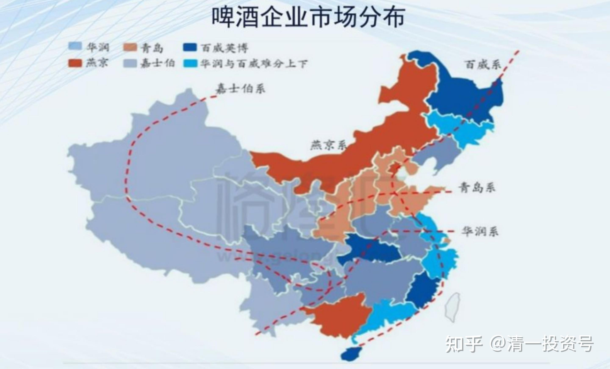
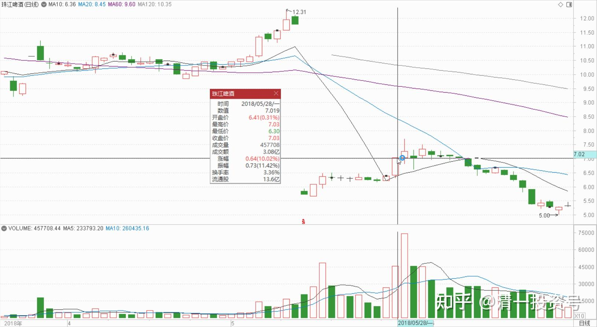
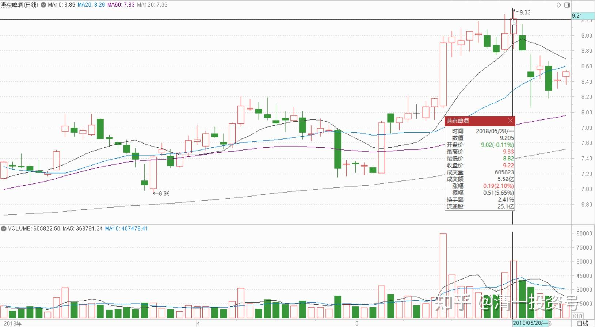
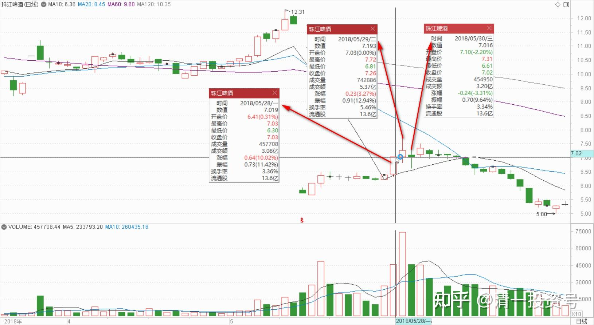

**12篇.早期珠江啤酒、燕京啤酒的换仓记录**

清一山长 2018年5月28日**～**30日

**一、燕京洗盘，珠江尾盘偷袭涨停**

清一山长2018-05-28 14:28:04（主贴1）

$珠江啤酒(SZ002461)$ 今天珠江上涨，是我预料之中的。前两天燕京涨过9元，我很想卖掉1M燕京换成刚过6元的珠江，理由就是珠江的相对涨幅明显不及燕京，换股会带来更大的收益。不过，因为珠江已经是A股最重的仓位了，比燕京还多，犹豫了一下就没换。所以，看来我就是不该赚这换股的钱[大笑]。就傻傻地继续等吧！**少操作也是避免失误的一个好办法。**

心海18191530007回复清一山长:（跟评主贴1）

珠啤68天持仓盈利52%，这太疯了吧！感恩山长。

清一山长2018-05-28 16:38:56回复心海18191530007:

是主力急，他们都没筹码。只好这样子快上了。因为主力需求量大，以后是越等越没机会上车的。

清一山长2018-05-28 15:54:17（主贴2）

$燕京啤酒(SZ000729)$ 今天的盘面，**是标准的洗盘动作**。还不到出货的时候。珠江啤酒是**尾盘偷袭涨停**。早点涨停的话，我就换燕京了[大笑]。

恐高的鸟p回复清一山长:（跟评主贴2）

冒昧问一下山长，您打算持有燕京啤酒多久啊？

清一山长2018-07-11 11:55:55回复恐高的鸟p:

**10年。**巴菲特说的：买股票，如果你不打算买入后持有十年，就一分钟也不要拥有[大笑]。

当然，如果十年内，燕京给我换仓的机会，我也很感激的。不会坚持十年之约了。这属于“意外的惊喜”。

**二、燕京、珠江明显的主力进驻的迹象**

51nxp:2018-05-28（主贴3） (原帖：

[https://xueqiu.com/9203843585/107896549](http://link.zhihu.com/?target=https%3A//xueqiu.com/9203843585/107896549))

$顺鑫农业(SZ000860)$

顺鑫的仓位越来越轻，遥想抱着它坐电梯若干次，原来是抱着金娃娃。

换的兴业套着，换的健康元也套着，唯有顺鑫，根本不调整屡创新高。

25～30元我守住了大部分，因为预期突破25就会到30元，但是30元以上我一点点地换到了健康元上，今天顺鑫再飞，我真的需要反思自己的策略了——同患难不能共富贵！

51nxp回复boolen1216:（跟评主贴3）

要怎样摆脱这个命呢？2015年5月底27元买的五粮液，股灾前30元抛了。

我复星是2016年3月底19.5元买的，20.3元抛的。23.6元再买入，24元抛的。

平安36元买的，37元抛了。顺鑫算赚得多的，也做得不好。

清一山长 2018-05-28 14:14:12回复51nxp:（跟评主贴3）

我们买入的时候是冒了很大的下跌风险去买入的。起码我买入后都预期再跌30%以上都可以接受才敢买入的。如果像您这样，每次都是只赚了一点小钱就跑了，是不是白白浪费了买入之前花费的心血和功课？

今天顺鑫的盘面研读：今天如早盘涨停，我就计划再丢20%出去。但是**居然就是涨到9%都不碰涨停**，这盘面，我就不卖了。因为显然**主力不是没能力拉涨停，就是故意不拉的，让散户们着急后赶快抛出锁定利润的**。因此，我本来想卖的，看这样子就先不卖了，继续观望一段时间。既然我们散户没能力给市场定价格，只能跟随主力沉浮，就一定要有看懂主力意图的能力。不然就太划不来了，**低位的时候，白白帮主力锁仓，刚刚开涨一点点，赚一点小钱就把股权放水给了主力，真划不来。**

51nxp回复清一山长:

我最早用顺鑫换兴业，连红斌都反对。

清一山长 2018-05-28 16:45:43回复51nxp:

我也委婉地反对[笑]。我表示理解你被坐电梯坐怕了，其实是提醒你可能中了主力的心理圈套。我也坐了几轮电梯，每次低于20元就买货，一股不卖。但25元之前，顺鑫根本就没走的理由，25以上会调整一下，做点波段也正常。35元左右，应该也有波段可以做的。但心态稳定的人，可以不做，死拿就行。**等出货信号出来——到处都有各种“公众号”，大V等，在吹嘘顺鑫多牛的消息，这时候才该走[大笑]**

51nxp回复清一山长：

嗯，你说了，且推荐啤酒股。

清一山长2018-05-28 17:03:13回复51nxp:

如果当时换了珠江，现在也有超过50%的收益了[笑]。当时珠江正好击破4.5元的底价（复权9元）。也算是稳赚不亏的换股行为。

其实你也看懂了燕京，只是你进入的时间早了一点，没赚大钱放弃了。今年我买酒，特别是啤酒很多的原因，是看到了燕京，特别是珠江上面，**明显的主力进驻的迹象**（大鳄入住，一定会激起一些的水花，水纹）。你不看K线，所以不关心这些指标。（我看K线的方法跟别人不一样，不是技术派这样的呆子。**我是看K线走势背后的主力和散户的行为和心理）**

**三、卖珠江买燕京平衡仓位**

清一山长2018-05-29 11:40:57（主贴4）

$珠江啤酒(SZ002461)$ 今天上午，首次开仓卖出珠江，总共卖出了约13%持仓的珠江啤酒，最高卖价是7.17元，最低卖价也高于昨天的涨停价[大笑]。目前珠江持仓成本才四元多了。

今天还同样执行了买入35万股燕京的操作，买入价格是8.94元。这个高价买入的动作，直接把我燕京的持仓成本从5.1元又提高了一些[哭泣]。但我认为把珠江和燕京的仓位平衡一下，觉得还是很有必要的。**目前燕京持仓只有珠江的三分之一**，这不太合理。**没有净卖出的原因，是现价我还不愿意放弃我持有的啤酒头寸。所以，目前我只换仓，不出仓。**

如果下午再给我换仓机会就继续换，不给机会就算了。我不贪心，市场给我机会就做一点操作，没机会我就算了。

清一山长2018-05-29 13:38:20（主贴4续评）

珠江卖出之后就打脸，直接上一个台阶。证明我一向是反向指标。不管了，我继续卖，7.49元再卖十万股[大笑]。反正我手中有货，心里不慌。

三果海回复清一山长:（跟评主贴4）

高手[很赞]，比我们看得远。

清一山长2018-05-29 14:36:07回复三果海:

什么高手，今天操作都是在打脸的。不过买我股票的人，今天赚钱了，我很高兴，希望参与的人都有钱赚，反正我也赚钱了。为了庆祝珠江连涨，今天我在泰国买一辆车，来庆祝一下（前天定的丰田凯美瑞，今天车老板答应下午四点送到家里来。泰国的车老板服务很周到[大笑]）

来抄作业的回复清一山长:（跟评主贴4）

佩服山长的操作[很赞]，从市销率来比较珠江和燕京，珠江要比燕京高接近一倍，换燕京值[很赞]

清一山长2018-05-29 15:48:48回复来抄作业的:

**从主力的操盘控盘的实力，以及流通盘的数量来说，珠江优势远远大于燕京。另外，珠江的高端啤酒销量利润优于燕京。**[大笑]

所以，这两个股，到底谁更好，真说不清的。看你的喜欢了。喜欢跟庄的人，绝对更喜欢珠江。燕京的庄是投资大名人裘国根，他似乎不喜欢炒股。所以，燕京走势才有点死气沉沉的。我的珠江才最多，就算今天卖出这么多之后，还是比燕京持仓更多。

清一山长2018-05-30 11:42:16（主贴4续评）

今天在7元下方，接回了大部分昨天卖掉的珠江啤酒。最低接回家的价格是6.90元。大多数是6.96元成交的。今天也买了一些低价的燕京补充啤酒仓位，价格是8.46元。感谢这么多愿意低价放手的人。

昨天晚上，我定的车送来了，是一辆白色的，油电混合顶配版凯美瑞。看起来挺大气的，开起来很稳，空调超级快，这个功能在泰国很重要，就算是雨天，开车不开空调也闷热难当。更重要的是；这个车的空调，居然还有制热功能，这个功能在中国是标配，但在泰国，我是第一次知道原来泰国也有制热的空调车。我三年前坐皮卡在清莱旅游，被冻惨了。司机也冻惨了，他说泰国的车就没有制热的，只能制冷。反正这车夫人很喜欢，觉得挺好的。我感到不好意思的就是：昨天我卖出了啤酒，今天又买进了啤酒，中间的差价，就可以买到两辆这样的车了。但我其实什么都没做，只是坐在舒服的家里面按按电脑的按键。跟泰国商场里面推销啤酒的小姐相比，根本就没有对伟大的中国啤酒事业做任何贡献。但市场却送给我这么丰厚的奖金，实在是觉得世界太不公平了。**这个世界，是大额奖励一些“不劳而获”的人，却对辛勤劳动的人要求很苛刻。**偏巧绝大多数都喜欢去工作，而不是像我一样用投资赚钱。我十几年前放弃实业，就是发现了这个怪圈。今天这个怪圈更加吸金似乎更有效了。

今天还以10.07的价格，买入了平安银行，补充了我原来卖掉的仓位。比我第一次8.99元买进的价格高一些，但时间过去这么久，也应该涨一点了。如果一直在关注我的人，应该知道我是什么时候卖掉的。当时还很让人笑话了一通[大笑]。

(标题、图片为编者所加)

**参考链接：**

[YJ走势果然神鬼难料\[表情\]](https://www.zhihu.com/pin/1604810289215668226)

[发表今天的想法，就是非常的感谢，感谢这…](https://www.zhihu.com/pin/1604504352521158656)

[8篇.初谈燕京](https://zhuanlan.zhihu.com/p/594537053)

[9篇.起码十年不涨就值得一起守候了](https://zhuanlan.zhihu.com/p/596134341)

[11篇.啤酒系列4：连连出台的质疑文让我加紧了买啤酒的行动](https://zhuanlan.zhihu.com/p/598382916)

[12篇.啤早期珠江啤酒、燕京啤酒的换仓记录](https://zhuanlan.zhihu.com/p/602033762)?

[13篇.买卖操作后的富足之心](https://zhuanlan.zhihu.com/p/604162057)

[14篇.珠江的破位急跌，名曰跌停进货法](https://zhuanlan.zhihu.com/p/606062514)

[15篇.金融市场是考验心态和修为的地方](https://zhuanlan.zhihu.com/p/608010478)

