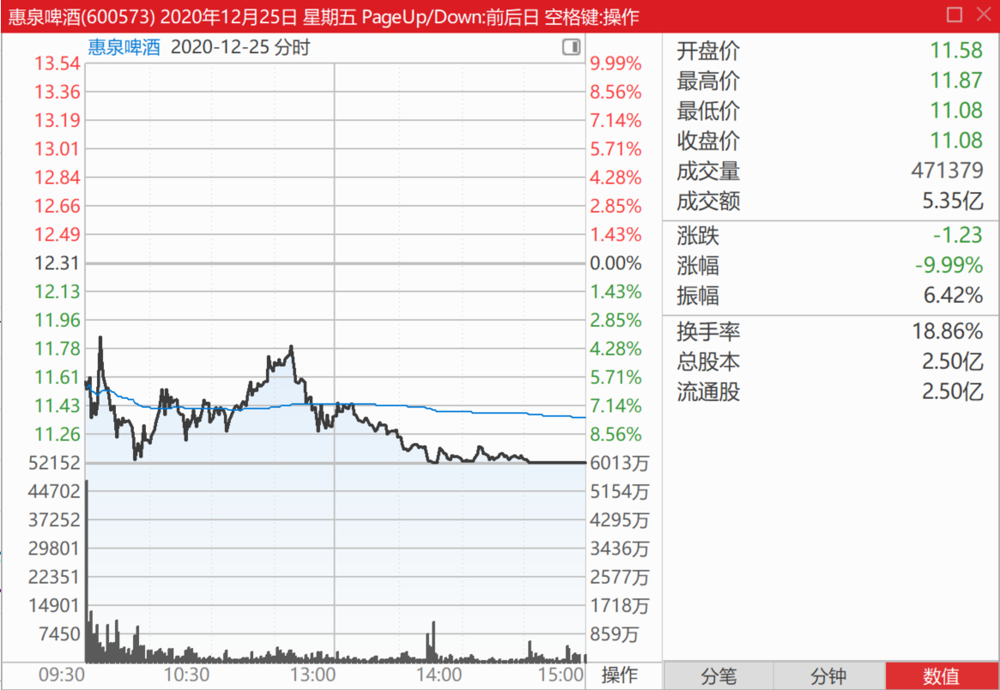
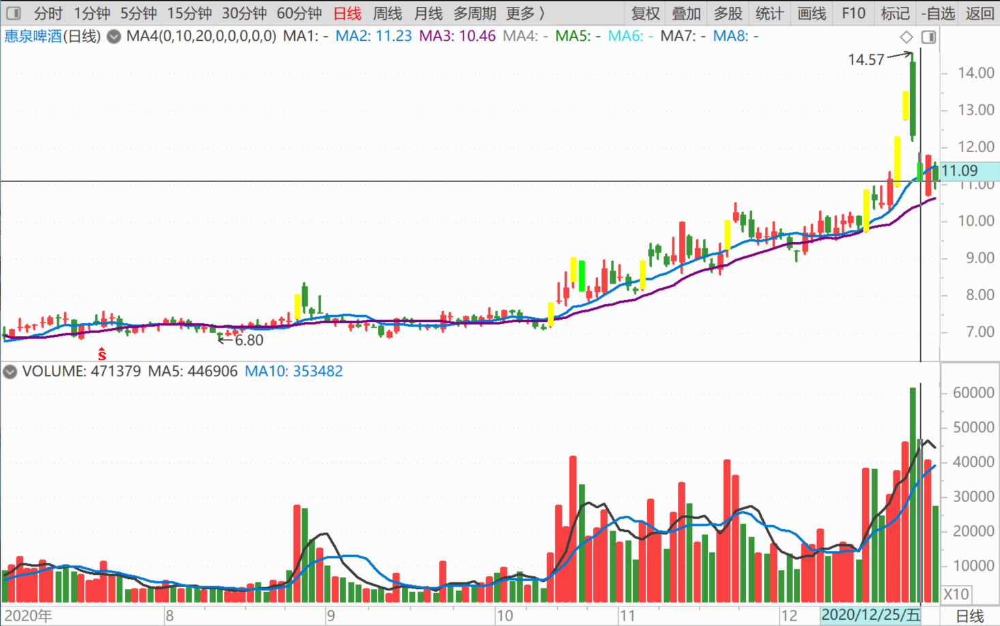
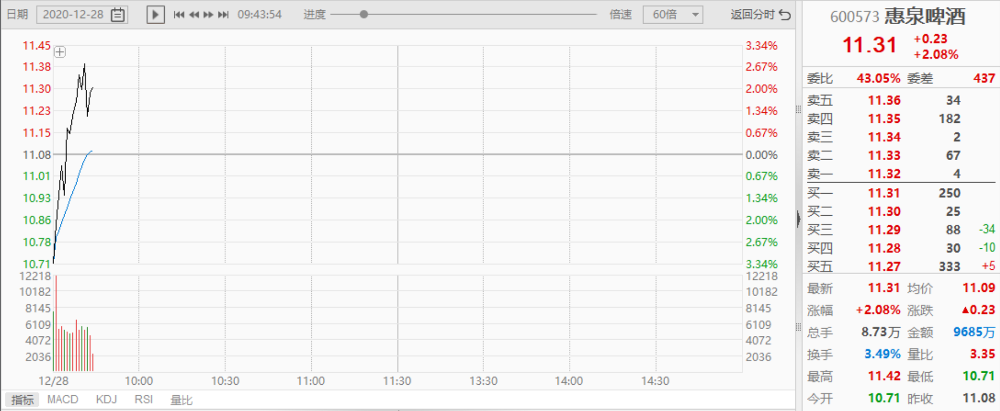
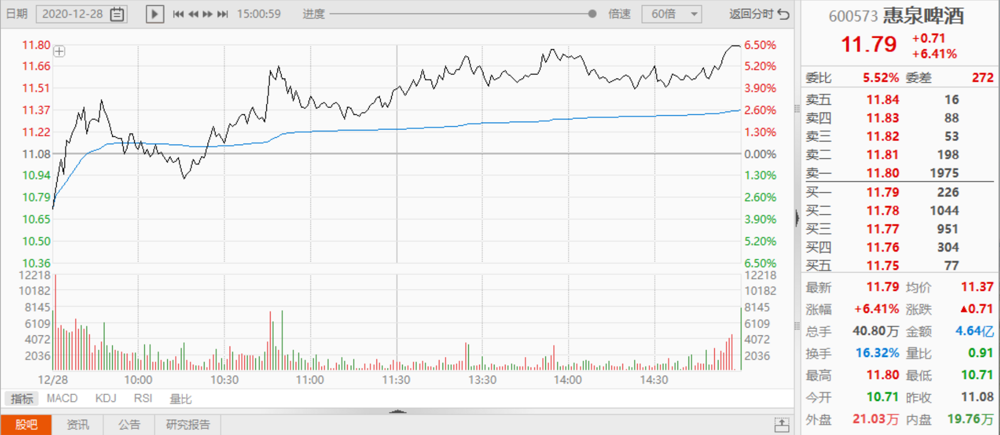
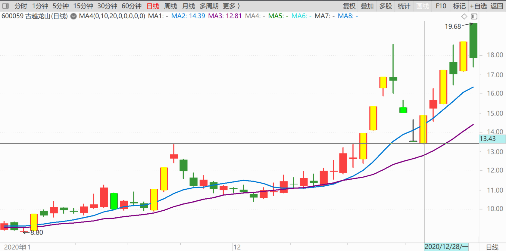
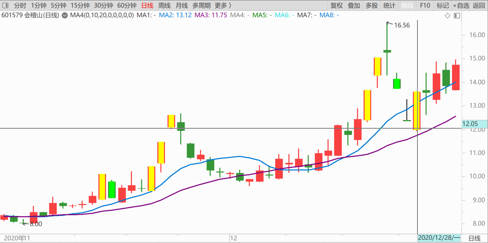

84篇.我的啤酒股票，绝对不会“出清”

清一山长2020年12月28日

一、明知下周会出现更低点为何还要买进?

[$惠泉啤酒(SH600573)$](http://link.zhihu.com/?target=http%3A//xueqiu.com/S/SH600573) 上周我说的话，今天兑现了吧？我说，**下周会出现比跌停更低的低点。我明知是这样，为何还要上周跌停买进**？

因为就算出现了，我怕我也买不到。因为主力好不容易才打到跌停价格的，就是为了下周继续下探，但能探低多少？很难说。**因为这一天成交量很大，已经吸引了很多恐慌盘涌出，主力应该已经拿回了不少筹码**，还需要多少？不好说。

今天10.71元的价格，谁买到了？为了保险，我当然就跌停买进算了，反正每股成本摊低了两元多，没啥不划算的。别把所有钱都赚到自己手里了，有赚就该满足了。

我认为不会破10，有人认为要到8元，谁对谁错，我也不知道。再看几天吧！说不定又跌下来了。**继续跌，手里有钱，可以继续买。往上涨，手中有股，可以继续卖**。涨跌我都接受，而且喜悦地接受这种市场的波动。我就怕不动，就没得玩的了[俏皮]

存一个收盘的图在这里，今天走的特别有意思！

[Helenkm](http://link.zhihu.com/?target=http%3A//xueqiu.com/n/Helenkm)回复[清一山长](http://link.zhihu.com/?target=http%3A//xueqiu.com/n/%25E6%25B8%2585%25E4%25B8%2580%25E5%25B1%25B1%25E9%2595%25BF)：

太担心涨上去了，所以一大早就来买，还好买到了一点。总算抄作业成功。

清一山长回复[Helenkm](http://link.zhihu.com/?target=http%3A//xueqiu.com/n/Helenkm)：

恭喜抄了我的底[献花花]。12元以上再走吧

[春天73](http://link.zhihu.com/?target=http%3A//xueqiu.com/n/%25E6%2598%25A5%25E5%25A4%25A973)回复[清一山长](http://link.zhihu.com/?target=http%3A//xueqiu.com/n/%25E6%25B8%2585%25E4%25B8%2580%25E5%25B1%25B1%25E9%2595%25BF)：

山长大人，请教一下为啥黄酒这样疯狂呢？我始终觉得啤酒应该高于黄酒的投资价值的。谢谢！

清一山长回复[春天73](http://link.zhihu.com/?target=http%3A//xueqiu.com/n/%25E6%2598%25A5%25E5%25A4%25A973)：

你都说疯狂了，正常人怎么理解疯狂？

反正黄酒低位，我就告诉过你们可以买的。我也买了，还超过百万股的持仓。你现在认为他们疯了，你就只管卖，不管买。不就行了？我就是这样做的，所以也不推黄酒。你认为没疯，是理性的，你就买。古越的中央酒库，是一个好的故事和卖点。

啤酒还没疯，所以我还说说啤酒。等啤酒也疯了，我也啥都不说了。你看黄酒我说啥了？白酒我也不说，我只做，主要是逢高慢慢卖。今年的收益，主要来自酒，今年如果没酒，日子就寡淡多了[滴汗]

二、**我的啤酒股票，绝对不会“出清”**

[$燕京啤酒(SZ000729)$](http://link.zhihu.com/?target=http%3A//xueqiu.com/S/SZ000729) ，12月23日晚，贵州茅台公告称，控股股东茅台集团拟通过无偿划转方式将持有的5024万股股份（占总股本4%）划转至贵州省国有资本运营有限责任公司。其实，2019年12月25日，茅台集团也曾将5024万股（占总股本的4%）划转至贵州国资运营公司。在那之后，贵州茅台股价一年大涨近5成的同时，贵州国资运营公司却悄然减持，累计套现或超600亿元(链接：[茅台连续第二年向贵州国资无偿划转股份](http://link.zhihu.com/?target=https%3A//www.guancha.cn/economy/2020_12_24_575699.shtml))

如果我是茅台的股东，这个价，我也会减持的。这种行情下不减持，难道等低迷的时候减持吗？茅台减持后，最好别拿去银行理财，多傻的土财主才会这样干！拿去把特朗普打压不许美国人买的中国建筑、中国中车等都买下来算了。白酒公司就成为中国最牛公司，世界五百强的大股东了！还成为爱国英雄，茅台就真的成了“神茅”了。巴茅？菲特茅？[大笑]。

从一家实体公司，转化为控股公司，对茅台这种不需要资本金不断投入的企业，是最好的出路。不像电视机企业，赚点钱，一换代就又没了。这种苦巴巴的行业，哪怕最好的公司，都是最不值得买的公司。“赛道”就不好，高科技企业都是这样的。

**啤酒其实是一个好赛道，这几年拼市场拼得太狠了。等不打内战了，你看这个赛道好不好，都是现金牛公司。**继续等吧！据说，啤酒也是陈酒好喝，只要拿在手上放久了，就变成白酒了[大笑]。

白酒拿久了，可能会变醋吧？喔，不不，说错了，是变酱油！[大笑][大笑]

**白酒这几年不断上涨，涨翻天，就是因为不断提价带来的。**不是公司突然的就变好了。这种传统公司，一百年也都一样做。

**啤酒也一样：啤酒的价格，一直在底部。**这两年微涨了一点。之前是20年不涨，股价也是20年不涨。**等啤酒开启白酒一样的涨价模式了，大家都来买啤酒了。这一天是必然的**。黄酒都未必这么确定（黄酒企业太分散了）。红酒有“正宗红酒”的竞争。啤酒的集中度，是黄酒没法比的。所以**，我的啤酒股票，绝对不会“出清”的。**我要等啤酒疯狂的一天，也许再等五年？**没疯之前，跟着波段做做T，进进出出的，收益不比白酒差。**现在冲进去买白酒，我就怕死得快，我是慢慢退出的模式。我现在的惠泉净收益，就已经超过我原来很成功的顺鑫农业了。顺鑫因为太牛了，都没敢做T（还是做了一点，不多），惠泉这样几乎全仓进出的，实在难得遇到。燕京一直不让我做大的T，也许燕京会给我更好的回报。

(标题、图片为编者所加)

**文章音频**：

[506篇.我的啤酒股票，绝对不会“出清”](http://link.zhihu.com/?target=https%3A//www.ximalaya.com/sound/773221155)

**参考链接：**
[76篇.聪明人赚钱，傻人赔钱](https://zhuanlan.zhihu.com/p/715051514)

[77篇.在确定企业价值的基础上进行金融投机](https://zhuanlan.zhihu.com/p/717031167)

[78篇.你这样做，庄家会吐血](https://zhuanlan.zhihu.com/p/718319738)

[79篇.卖出涨停股，买入跌惨了的股](https://zhuanlan.zhihu.com/p/719002613)

[80篇.燕京是一座金矿](https://zhuanlan.zhihu.com/p/720733084)

[81篇.做人，做事，都必须有“道”](https://zhuanlan.zhihu.com/p/722042320)

[82篇.投资必须依赖自己的投资系统、有效的原则、纪律](https://zhuanlan.zhihu.com/p/783923357)

[83篇.第一天涨停第三天跌停](https://zhuanlan.zhihu.com/p/846758124)