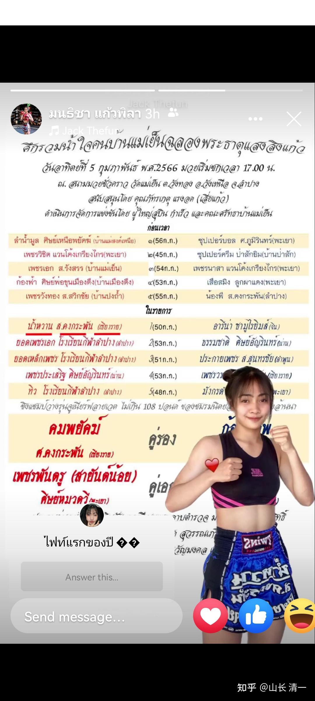
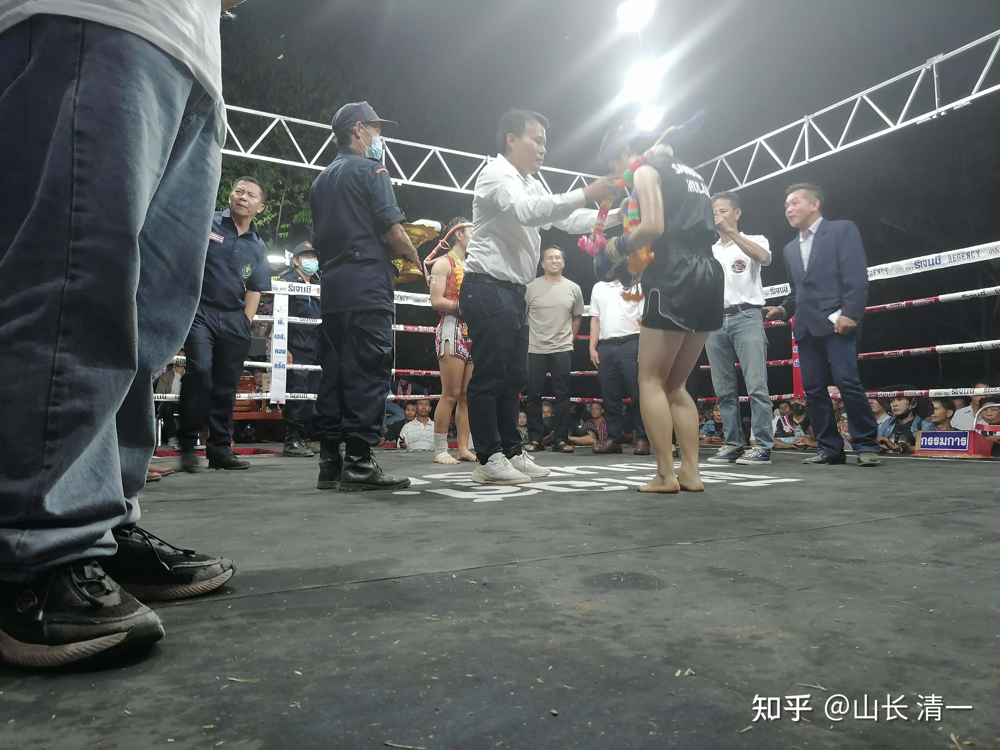
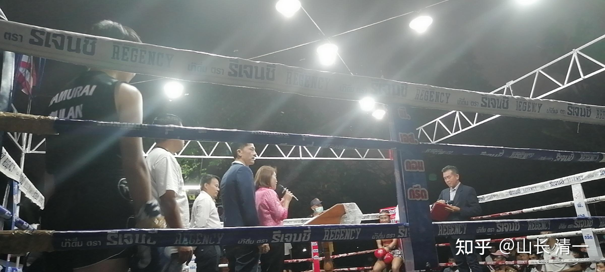

甜水这一战，是与佳慧约好的二番战。只是佳慧的脚扭伤还没有好彻底，因此让谭木兰代替。对方刚开始还不太高兴，因为谭木兰没啥名气，也不是仑披尼拳手。由于本场比赛打得还是很精彩，很激烈的，就是说比较好看。所以：总体来说赛事方还是比较满意的，观众都是甜水的粉丝，他们对甜水最终获胜，还是比较开心的。比赛临时改成三局制，打满三局判泰方胜。甜水赛后对老拳师说：谭木兰很厉害，很强壮。如果打五局她会输的。这个世界冠军的技术和人品都很不错，不装摸做样，不摆明星的谱。对一起去的佳慧和谭木兰，赛前赛后见面都很友好！很聪明，非常善解人意的一个拳手。有很多值得学习的方面。

这是昨天比赛的赛程单，昨晚总共有十场比赛。与清迈拳场的比赛不同，清迈拳场很少有泰国本土人去看。基本上不是接待外国游客的，因此对比赛选手的选择可能不会太高。但昨晚这种比赛，是当地政府部门为了取悦民众组织的节日庆典比赛。基本上都是当地的泰国人参加。为了增加吸引力，往往会请一些上过电视台的当地的明星拳手参加，打一些高水平的比赛。特别喜欢让泰国拳手来打外国人。甜水显然就是这一次节日庆典比赛的中心人物！我们是配角。

甜水此战是当天的第六场。之前的比赛，有5场垫场赛，全部以KO结束。不少比赛，首回合就结束战斗了，由此可见泰拳擂台的残暴。强调重击和力量，给对手造成严重伤害的泰拳， 称为世界最强站立格斗术，吸引全世界的拳手来泰国学习和训练，也包括中国拳手（张伟丽的备战训练，就是在泰国进行的，她的格斗底子就是泰拳）。泰拳的强悍，就是如果你没有针对性的练过泰拳，只是一个普通人的话，甚至是不太适应泰拳的武术界人士， 没有做好足够的技术和心理以及抗击打训练，刚上场遭遇重击，就会严重受伤。真不是随便可以打的。过去香港的传武大师们征泰，很多就是第一回合就被击垮，打伤，甚至打断骨头，硬度根本比不过泰国人。我国内的当体制武术教练朋友也说：他原来带队员，最怕跟泰国人打。泰国人太硬，打不动。他们的队员经常受伤。家长也很不满意，最后放弃了与泰国拳手的对抗。看到我们木兰打了快一年了，并没有严重的受伤，甚至没有被泰国人KO过，感到属于奇迹！

由于垫场比赛都以KO结束，很快就到了核心主场比赛：不到八点，就到了木兰与甜水的比赛时间。该场比赛，打满了三回合，是双方比拼技术和意志，打得难解难分的比赛，让观众也很兴奋。

下面是赛前，当地官员给这次比赛的核心荣誉拳手挂花环。这是对拥有金腰带等高等级的拳手进行表彰，显示这一场是高级别，高技术比赛的礼仪。当然这个荣誉是给甜水的。只是作为她的对手也跟著沾光，主办方也给谭木兰相同的礼遇，表示认同下面是一场双方是势均力敌的高手之战！

*官员临场讲话，甜水很放松的坐着，笑嘻嘻的*

这张照片，明显看出甜水的经验丰富，的确是见过大世面的，也有明星范。在官员讲一些场面话，吹嘘她的光荣经历，展现官场身份的时候，她没有去对应这些虚头衔，场面话。而是开开心心的安住于自己的拳手身份，放松地坐在角落里面等著比赛。她看到谭木兰有点犯傻的站着，不知所措，还用眼神友好地示意谭木兰---让她也可以坐下等（佳慧赛后给我的回馈）。说明她很聪明，自己拳手就是拳手，别人怎么演前奏，闹气氛，是别人的事情，她只管打拳！这是很专业的人才！

这次比赛，我发现甜水比上次跟佳慧打的时候心理更成熟，技术更老道了。毕竟她也在进步，经常出现在仑披尼的拳场上！而且木兰们的战绩，她也一直关注。佳慧和木兰的FB，她有关注和互动。也知道佳慧受伤的事情。当然也知道佳慧在与她打完一番战后，击败了很多高强对手的事情。她显然对木兰们的正蹬技术，做了相应的应对功课。一开始，谭木兰不太适应，吃了一点亏。只是调整很快，马上改变了战术，第二局就扭转了战事！

佳慧发回来的赛后汇报

身体状况：赛后谭身体良好，没有受伤，胫骨也没有磕到。

第一局甜水还悠然自得的样子，第二局脸就变色了，开始累，第三局都快要被KO了[表情]。但还是判我们输了。只要多给一局就绝对KO了

谭回复：师父好，很抱歉这次我没打好，心态上没有之前冷静，距离没把控好，导致中了一些反击。甜水的反击速度和距离把控很强，我会认真吸取这次教训回去好好训练提升自己。

我的指导【距离没把控好】---关键是心理紧张。把她当”冠军“高看了一眼。你的恐惧，让你在距离之外发动攻击，给了她回手的机会。如果冷静地迫近到攻击距离再打，不急于出手，死坚持在0.8X距离才出击，或者对手出击的时候出击，啥冠军都没回手机会的。所以---你不是输给甜水的技术和反击，是输给了自己的心态。甜水值得学习的地方，就是很冷静。加上技术也不错。她的确是冠军的心理素质！你们都有冠军的技术和能力，就是缺乏冠军的心理素质！继续加油！

木兰佳慧回复：谢谢师父的指导，其实这一次观看比赛对我的收获也很大。

在技术上，后两局谭用了较多的飞身和连续攻击，甜水就真的毫无办法，谭木兰打的比我的第一战好多了，这一点我要向谭木兰学习。[表情]

同时这一次我也被甜水圈粉了[表情]，她的冷静和机智，以及不骄不躁的态度很让我佩服，刚开始打的时候，甜水以为谭木兰水平不咋地的时候，并没有表现出很狂妄和自大。后来发现谭很厉害时，也是很冷静想怎么做对自己有利，全程都没有乱打或者不沉稳的时候。也向甜水学习。

由于此战是难得的高手决战，我答应认真点评给清一拳手们学习借鉴，将来面对这个级别的泰拳高手就不担心了！知道高手是咋样的，有啥好担心的？

**第一回合点评：虽然双方互换攻防，但判胜利是属于甜水的也合理，**因她打的两次场面很讨巧，好看。拿下这一局，也让甜水对自己更自信了！

从技术上分析：甜水的心理素质很老道，就是坚持打防守反击，稳住自己的阵地，就是不肯主动出击。谭木兰比较急躁，就冒进了。但因为甜水早有准备，谭木兰的几次进攻不太有效，反而被甜水抓住战机反击，两次把谭木兰打得失去平衡倒地。

第一次是01：34，甜水的扫腿非常的凶猛，快速和有力。谭木兰被她狠狠的一腿就扫倒下了！可见泰扫腿有多重。普通人的肋骨，如果没有练过抗击打，这一腿恐怕就打断肋骨了，或者打错位，以KO结束。五场垫场赛就有这种情况，双方照面，狠狠的打出一腿之后，就有人倒下，退场了！

这一腿，反应甜水的腿击力量，速度，以及拿捏的时机，距离感，都是最佳的。她正好在谭木兰发动攻击的时刻抢先攻击，与我教木兰们的格斗要点是一样的-----典型的后发先至。这也反映甜水到底是泰拳世界冠军，综合能力很强，远超当年一起夺冠的青少年世界冠军师妹帕卡。帕卡的扫腿也很好，但综合素质差，时机和场上的距离感不足够。内围也差，导致她现在场上比赛，多次被木兰们KO，估计都有恐中症了。目前，还没有看到其他泰拳手有甜水一样高准的扫腿技术。快，狠，准。

谭木兰被一扫腿击倒。也有技术上的问题不完善导致的问题！

**第一是发动攻击的距离过远：**她是从1.2X距离，进入到1.0X距离攻击的。这个距离，正好是泰拳手天天在训练的反应距离，更别提甜水这种高级拳手了。她如果一定要发动攻击，必须进到0.8倍的距离再进攻。这样对手就算想要反应也来不及。或者就算是勉强打出来扫腿，也会发不出力量。因此击中了也没事！

**第二个错误，就是身体没有往前使劲的压上去**，形成“野马分鬃”一样的扑击的压力。如果这样做了，就算被扫腿击中，也不会像现场一样当场坐地。失去平衡也会扑在对手身上，把对方当支撑了。谭木兰出招，是站在1.0位置上想要安全出腿，结果反而不安全！如果第一，第二两条原则做到了，甜水的这一击。会导致她自己被打退。如加上后面一条速度，甜水会被击倒！原来的木兰比赛，大家已经看过多次泰拳手出扫腿被木兰击倒，奥秘就在今天我说的三个大原则这里！

**第三个错误：攻击的速度太慢。**攻击腿刚提起来，对手的扫腿已经上身了。所以单腿支撑不足，导致失去平衡倒地！（这些错误的原因，应该都是因为谭木兰心态不放松，不冷静）

**第四个错误：缺乏真假虚实的出招技术。每次都老老实实的攻击，**没做到我示范和要求的----先勾引对方出手后再出真正的攻击。试探太少了。对付甜水这样的世界冠军，顶尖高手，你想用在清迈拳场的普通攻击技术去打。肯定是不行的！她很聪明，简单莽撞的攻击，只会直接进入她精心设计的陷阱：比如这一击，显然就是甜水的得意技术，专等你进攻的时候打击你的！

**第五个错误：身体的正面面积暴露过多，胯部没有前后拉开。**没有打出太极开门腿的要领。如果是严格按照要求出的太极正踢腿，甜水这一扫腿，会正好踢谭木兰的左肘上，而不是左肋上。或者踢到左手和右手的防护圈上，打不上身子的！而手臂固有的防御圈，以及没有达到最大发力位置，这样就会消解甜水扫腿的威力。而且这种站姿也更稳定，不容易失去平衡摔倒！还有----我要求的这种站姿，足伸出去的长度更远，更容易击中对方。

**第六个错误：发动攻击的位置，应该偏自己的右边，甜水的左边一点。**不要站在甜水攻击的中线，让她需要转一点角度才能踢上来，要转动身子，她的进攻速度就会受影响。简单地说，谭木兰应该站在对手的左足前面延长线位置发动攻击，现在是站在对手的两足中间发动攻击，对我方最不利的位置。

对付甜水这种严阵以待的拳手，我方最有利的攻击位置和方式，不是谭木兰现在这种直接攻击，而是**必须用二次攻击，转换攻击！**先靠近一点点，用前足轻轻的做出攻击腹部的态势，扰乱对手节奏和判断。但距离较远，正好在1.0位置，不构成真正的攻击，只是像真正的攻击。而是要借假攻击的动作，快速地前压身体，重心落在对手左足外侧位置上，成功抢占0.8X攻击位置。用后腿（左腿）快速的提起，转换重心，蹬踢对手的胸腹部。此招更快速，更有力量，更接近对方。对方就算反应最快，扫腿上来打到的位置是背部，而且不在她发力的重心上。打上也没有力量。如果对手只要慢了一点点，她正在努力转动身体打重扫腿，我方这一腿会直接迎击对方胸部。这样，倒下的就是甜水了！对付木兰此招式，最好的方法只能是退开，没法硬接的。这种就是躲开对方的攻击，还同时进攻对方的好技术。木兰们现在练的技术，旋身功法。就是强化这种转换的技术。可以用拳，肘，膝，腿攻击对方（根据距离不同，采用不同方式打击对手，原则是一样的）

02：12这一招交换，谭木兰又犯了跟上面一样的错误，傻乎乎的直接冲上去，想用用左腿正蹬。结果早就被准备好的甜水用后腿正蹬打到胸部。由此可见甜水的正蹬技术也不错。因为谭木兰正在前冲，这种迎击当然就破坏了平衡，只能被击倒了。由此看出---甜水的反应很快，踢腿速度也很快，后发先至，超过了谭木兰。当然，谭木兰的主要错误，就是在1.2X距离外就发动进攻，给了甜水足够的反应时间。

这里也强调一下技术原则：甜水这种很聪明且心理稳定的的技术型拳手，是绝对不会让你轻易走到0.8x倍距离，让自己发挥不出来的。因此，采用缓慢逼近的方式。她由于距离感良好，会轻松地退到1.2x距离之外，你冲进1.0倍的时候，有效距离她正好反击打你！一般泰拳手，很难对付她这种技术。我看过佳慧打一个泰拳手，慢慢逼近对手到了0.8倍以内了，她还站在原地没反应。佳慧是等她出手再攻击的，她也不攻击，也在等。结果佳慧忍不住先出手打她的头，才反应过来该往后退，但已经被击中了。这就是距离感不好的泰拳手。还有一些笨蛋一点泰拳手，是会用一只手伸直在身体前，测出自己的攻击范围！甜水这种非常灵敏控制距离的拳手，肯定是高级拳手。她的战术有很好，打反击。所以对付莽撞的泰拳手，常常可以轻松获胜！

所以：对付甜水这种人，缓慢逼近的0,8x战术失效，她总在1.2的距离等你进入攻击陷阱，让谭木兰吃了两次亏，该怎么办？继续猛冲，肯定继续吃亏！幸亏连续被打倒两次，谭木兰换过思路来了：**不能用常规方式打甜水，不能从正面攻击，**就开始侧面用前腿攻击，还启用飞身野马分鬃。这是快速突破甜水防御圈，从远距离直接进入0.8攻击距离，而不需要1.0距离来过度的进攻方式。再加上连续攻击，甜水预设的阵地战就失效了！

后面双方接著再打，甜水原来的战术优势失灵，就开始吃亏了！

谭木兰接下来两腿正蹬，就改正了上面的第五个，第六个错误。从甜水右脚够不到的左侧位置攻击甜水的腹部。她如果敢用右腿扫或者蹬，就会把正面的身体暴露更多，而且速度慢。她很聪明的退开，没有直接迎击，但没想到谭木兰跟进速度很快，踢了她身上两腿。只是这两腿，谭木兰依然没有改变第一和第二个错误，所以未能给甜水造成重击效果，只是不是很严重的被击中。有点没面子。甜水其实非常的善于防守反击，她一退开后就会马上拉出反击的架势，想要右手重拳攻击谭木兰，但没想到谭木兰没有站在原地，而是继续向前攻击，她被迫强行拉回攻击姿势，重新防守但依然被击中。刚刚认为自己轻松控住局面的甜水连续挨打两腿后，有点火大，马上就发动反击，反应了甜水的实力果然过人。她的第一波冲上前的反击被谭木兰的反攻击防住。2：23秒的再一次努力冲上去的反击，被谭木兰退开，她继续努力的追击，却迎上了谭木兰的迎击脚，被蹬中腹部！被打弯腰的同时，还用手想抓住谭木兰的脚控制对手。只是谭心理也紧张，忙着退开，不是上前，收腿也很快，没抓住。但甜水毫不犹豫的就马上跟随一记扫腿上来攻击，只是谭已经躲开在甜水的攻击距离之外，没有中招。这一系列过招，甜水的反应，连贯性，技术完善性，的确非常的快速和凶猛，而且非常的流畅，的确是世界冠军的水平！相比谭木兰上次打过的双金腰带，反应速度比甜水差多了！

甜水马上就意识到自己的恼怒情绪，也意识到谭木兰不好对付。马上调整情绪，放弃了继续追击，避免再次被迎击。其实谭木兰还是有点顾忌她这世界冠军，如果刚才不躲闪。直接迎上去硬攻的话，她会被打得更重的。因为谭木兰刚被打倒两次，因此也无心恋战，才没有猛烈攻击，也给了甜水调整情绪的机会！

甜水很快又若无其事的样子，等著谭木兰进攻。但我有一点不理解的地方：刚才攻势猛烈的甜水，突然降低了级别，**反应速度降低了，扫腿的力量也降低了**。基本上无法造成对木兰的威胁。刚才看上去极其灵敏的格斗机器，似乎降低速度了。我猜测：应该木兰的三次腿击腹部，特别是第三次的迎击，太极有抖劲，她可能当时没反应。现在身体不适，所以反应速度减慢。没有一开始的威风了。

这一局，按道理应该算平局。因为谭木兰拳腿击中甜水的次数更多，而且攻击已经明显造成她的体力下降。甜水值得称道的有效击打就是这两下把谭木兰击倒的攻击，其他都没啥建树。不过----这两下，虽然没有对谭木兰的体力造成影响（泰式正蹬打击力不强），但观赏性很好，我们就算泰国方赢下这一回合好了！

** 第二局：毫无疑问是甜水输了。基本上没有打出清晰有效的攻击，都是被动防守。谭木兰相反有不少清晰有效的攻击！**

谭木兰注意了从对方左脚侧死角进攻，而且加强了攻击的连续性，让对手无法反击。也提升了攻击速度。甜水习惯设置的“反攻击陷阱”，这样就对谭木兰没有用了。特别是后半程谭木兰，已经发现采用飞步野马分鬃的优势，开始面对尽量拉开距离的甜水，用远距离飞步来连续进行攻击，甜水显然对此毫无办法。一直在被动挨打。她擅长的退后一步反击的策略，常常同时遭到下一轮木兰的攻击，多次自己被击中！在第二局快要结束的时候，甜水居然没啥防守反应，没躲过谭木兰的正踢腿。而且身体靠着围栏来进行防御，不像是她应该有的正常敏锐的反应。看上去很像是体力严重消耗的情况。这一局，甜水没有打出一记漂亮的攻击，只有一些骚扰性质的攻击，她一直都在防御，而且被清晰击中多次。估计是被这些击中，导致她的体力快速下降。太极的力量，有时候看外形很一般，但对手身体反应却很不舒服！慢回放7：08谭木兰发动的这一拳腿连击，威力比甜水击倒谭木兰的大多了。甜水被远远的击打到围栏上再弹回来。如果没有围栏她早倒下了。但遭遇重击的甜水反应不俗，身体站不稳，就依赖围栏提膝，正蹬，阻止谭木兰的进一步攻击，的确是高手！败而不乱！

**第三局，显然也是甜水输了-**--全回合只有一些骚扰性质的打击，没有能力打出有力和清晰的打击，不像第一局还有几个！

这也是最后一局（我猜是泰方发现木兰们体能超强，都是越战越勇，因此打五局肯定对泰方不利。所以特别规定此战是三局。假如再最多给一局的话，甜水应该会被KO的）。

甜水此局一开始，应该是师父和教练让她积极进攻，不要打得像上一场一样消极，一直被动的挨打。太不好看了。她也想挽回败势，难得的一开始就积极主动的进攻，打出招牌主动性的泰扫腿。但她很快发现：她的进攻对木兰基本无效。木兰此局距离反而更加的拉近了，不再像第一局一样，因为害怕冠军进攻威力站远一点。结果甜水的多次扫腿就只能半击而退，起不到应有的作用。只是谭木兰也很奇怪的，没有在这个对对手很有威胁的距离内，冲击或者虎扑对手，或者用旋身肘膝趁机终结对手。不然甜水这样近身勉强来打木兰扫腿，非常的危险，会多次被击倒的。只是木兰经验缺乏，送上门的菜居然拒绝了！

第三局的后半局，甜水体力已经跟不上，已经不再想进攻，而是尽量躲避。谭木兰多次使用飞身野马攻击，甜水明显不知道如何应对这种野蛮的攻击方式，身体头面部多次被击中，应该身体受创严重。因为我看到---10：09这一段。面对谭木兰的攻击，甜水几乎就是完全被动地靠在围栏上支撑身体，没有做拳手应该有的随动防守反应。这应该是她体力耗尽了，反应跟不上来的表现。这是很危险的迹象，被KO的前奏。只要谭木兰此时不再急于进攻，不忙于出招，而是贴身旋转，打出几个重拳，甜水就会被KO。

但是这傻瓜，急于进攻，却不讲攻防策略，不看局势。忙中出错，把体力都消耗在跟甜水纠缠内围上了！没有打出凌厉的攻击，让甜水逃过了这一劫。而甜水在已经明显累极了，体力消耗严重，打不动的情况下，居然场上不断的微笑，很高明的掩饰了自己非常紧张的状况。因为她身经百战，知道她此时已经无力再战，面临被KO的危险，用微笑让对方迷惑吧，对手会以为自己的攻击无效。她总算度过来了。虽然此战精疲力竭。但打满场，不被KO就是胜利！她做到了这一点！

赛后去喝水，甜水问老拳师谭木兰的体重（估计是认为谭体重不像她的身材，其实谭的手臂明显比甜水细一些）。老拳师告诉她后，她说谭很厉害，很强壮，如果打五局制，她会输掉的。她真的非常的坦率。此战虽然才三局，比她上次和佳慧打五局累多了。

有个数字很有趣：佳慧是第12战和甜水打的，佳慧在打完甜水后获得了迦南隆赛场的邀请。谭木兰也差不多第13还是14战。但谭木兰的战绩要明显好于佳慧当时的12战。木兰的成熟速度在加快中，谭木兰应该也快走上曼谷之路了。也许有一天：6战的公主拳手，就可以来打甜水了。我们的技术完善度也在提高！

面对世界冠军，木兰们打出了中国人的尊严。这一次泰方接待人员对我们的木兰都很礼遇。尊重是用实力打出来的！

原来泰国北部的拳界，都传说有个中国拳手佳慧很厉害。现在发现新冒出来的木兰，就没有弱的。木兰武馆，在泰国的名声肯定会越来越响亮的。

[https://www.zhihu.com/zvideo/1606035734401708032](https://www.zhihu.com/zvideo/1606035734401708032)