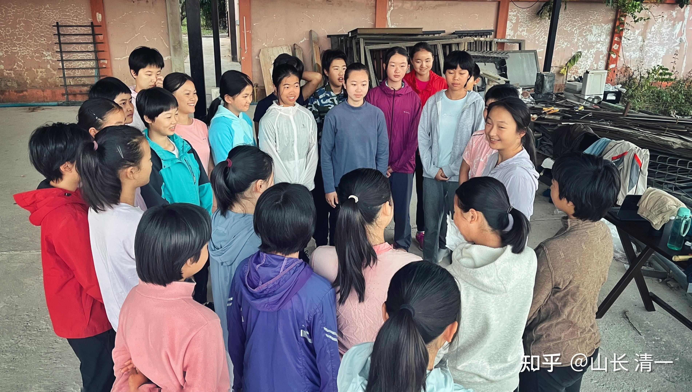
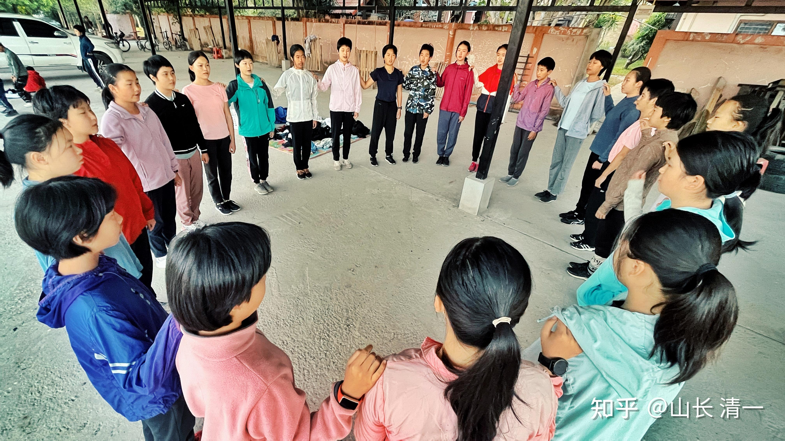
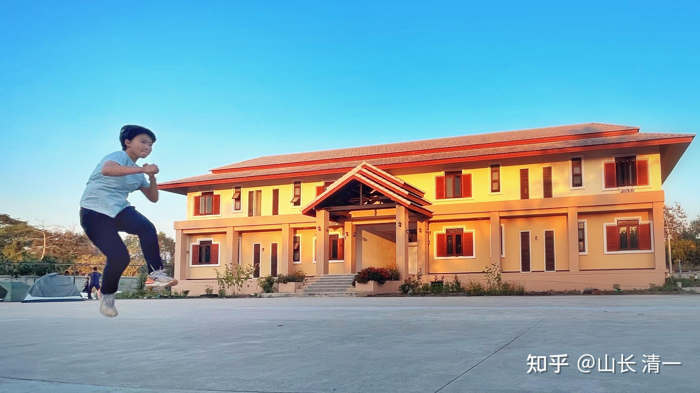
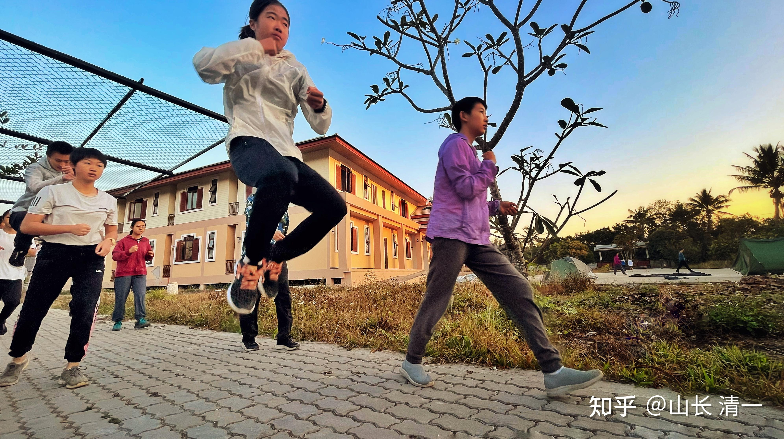
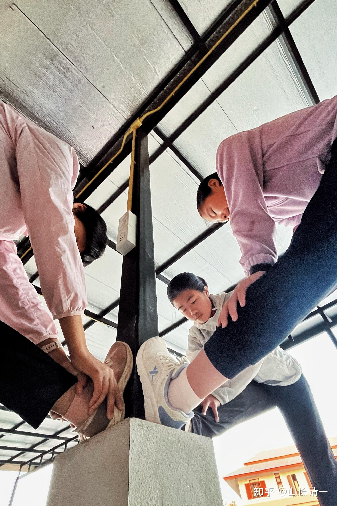
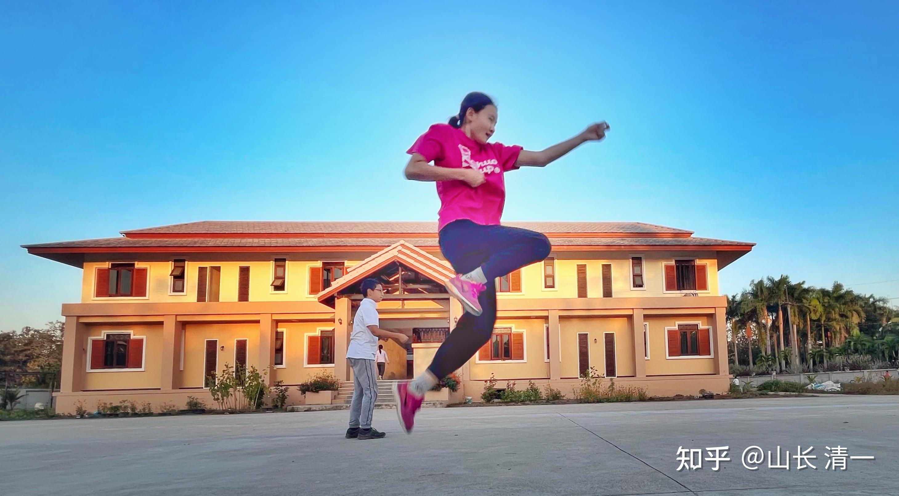
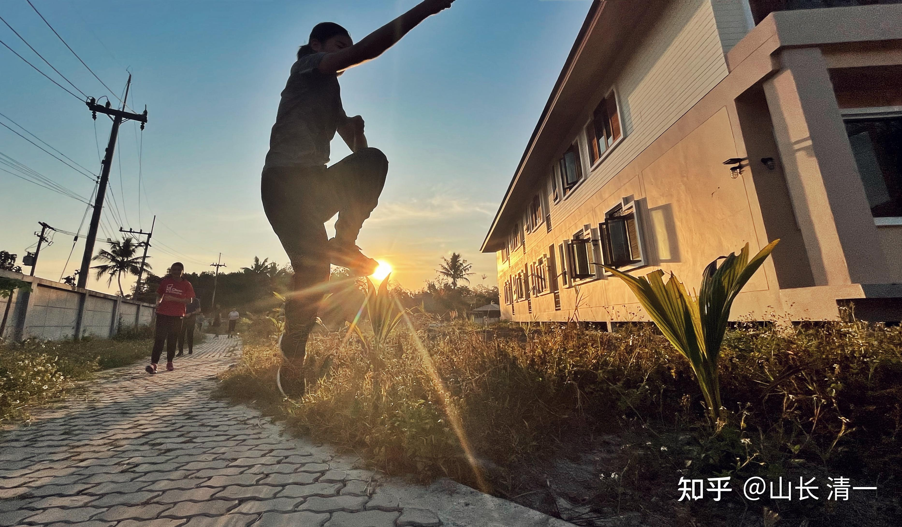
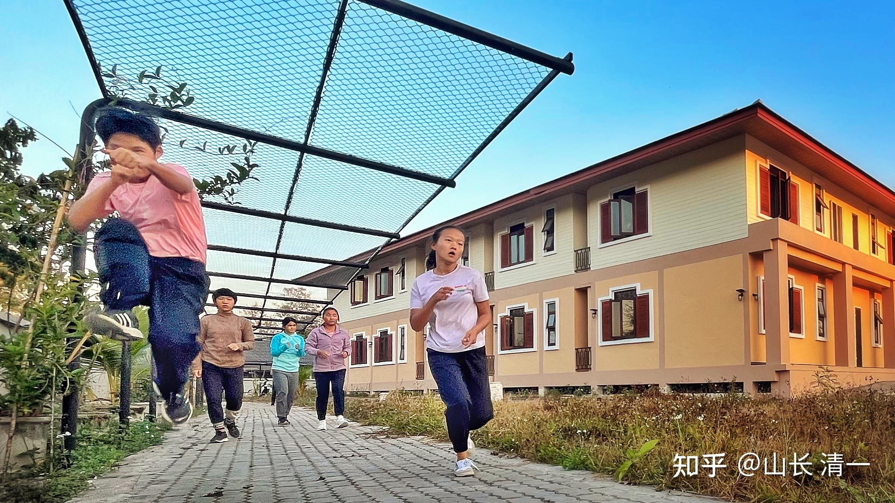
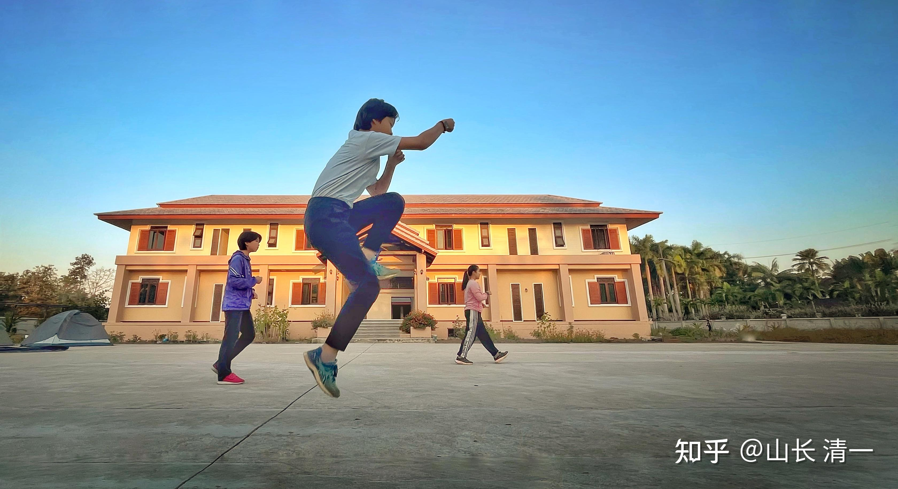
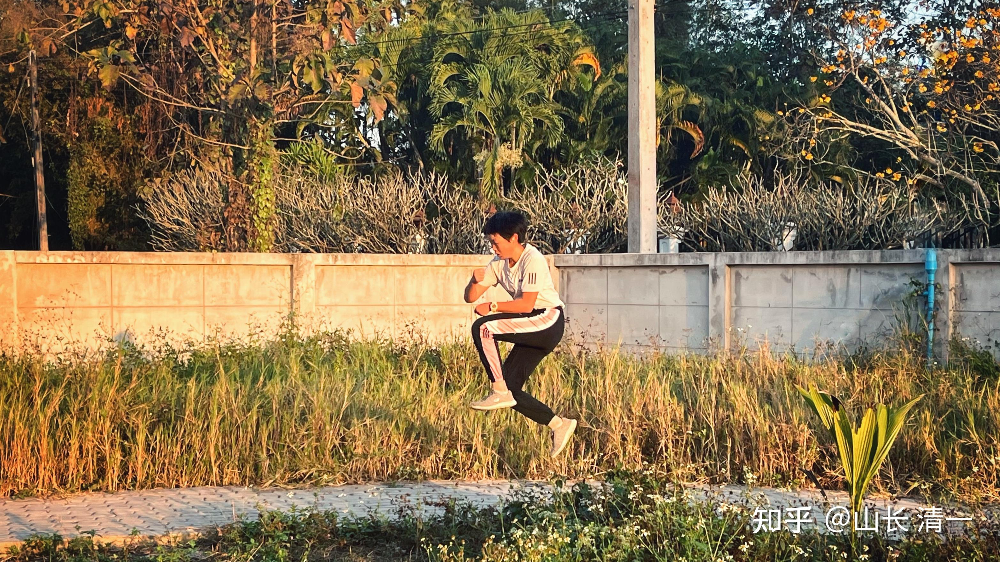

春节假期，经历了野生公主和工地公主，探险公主，节日公主等尝试的公主班学生，昨天重新回到清迈的校园，今天开始了新学期的学习。

今天我刚给孩子们讲了开学第一课：

告诉孩子们---人和人之间的差距，小时候都是差不多的。谁也不比谁强。但长大后，就有了很大的区别。人与人之间的差距，会比人和动物的差别还大！这种完全不一样的人生差别，就是看他们从小的业余时间和假期，是怎样度过的。如果她们的假期，课余的时间，去做的体验和活动，能够让她们得到更多的锻炼，人生就会更加的充实和理解社会，这样子度过假期的人，就肯定就比整个假期呆在家里吃喝玩乐，玩手机的傻瓜们，更懂得掌控自己的人生。人生和事业，未来也注定会更成功。精英阶层，就是一步一步的积累差距，最终让普通人完全望尘莫及的！

小时候不会玩的孩子，不懂得去探索世界的孩子，长大后注定是工业社会流水线上的机器，书呆子。

只有热爱生活，积极参与生活的人，才能是人生赢家。我们新教育学堂，也只有公主班我才会敢给学生安排这种我小时候经常参与的“校外，课外活动”。其他班级，只能鼓励学生“多补课”，去考出更优秀的成绩。安排这样子的“瞎玩”，家长会有意见的---耽误学习了。如果安排孩子们去做一些工作体验。家长就更有意见---我们的孩子不学打工。完全忘记了我们人生立足的基础！

经营者，随时经营和创造人生。消费者，一切都等著别人来满足自己！

但将来谁是生活的主人，是毫无疑问的。中国家长都以为让孩子娇生惯养，就是“培养贵人”。不知道老子教的“高以下为基”。精英的标志，绝对不是“啥事情都有人帮我做”。而是“别人会做的，我也会做。别人不会做的，我也会做，因为我是经营者”。

英国日不落帝国的精神，所谓的绅士精神，并不是高高在上的发号施令，等著别人来溜须拍马。而是“身体力行，品质高强，超越凡人”为特点。这一点，以“80天环游地球”的主人公的绅士风度和作为成为英国绅士的榜样。善于读书，更善于做事。甚至敢于决斗，不畏生死！在泰国，我见过的英国人自己干活建房。亿万富豪自己下场地修车，甚至自己造汽车。

而中国的“贵人”，就是连吃饭上厕所，都要人侍候的身份。这就是富裕的大清，会败给小小英伦三岛的核心思维和行为的原因。因为中国当年的精英阶级，上层社会，都忘记了【创造才是人生的使命】。都在追求【享乐人生】，自然是衰落的帝国。

现在的中国，刚刚富裕一点点的家长们，也在走大清的老路，忙着一家人“享受生活”。新生一代越来越缺乏奋斗的精神，缺乏创造的愿望！年纪轻轻就学着蝇营狗苟的混日子。

我希望公主们能够身体力行，转变一部分国人的愚昧思想！一切从自己做起，从现在做起！

今天开学，公主们要从中选出5个人来，跟随木兰佳慧和谭木兰两人一起练武，准备今年下半年走上擂台。迎接泰拳的洗礼！其他小公主们也摩拳擦掌的，但最早就只能明年在上了。

下面是公主们每天早上的晨会和晨练。飞步野马分鬃，就是日常训练的内容。每天早上最“飞”上上千步，赛场上也一样能飞起来。说不定这一批五个公主，第一场比赛，就开始起“飞步攻击”。对泰国拳手来说，这就是噩梦了！各位看工地干完活后，回学校飞的小公主们，姿势好看吗？这是善于摄影的公主家长拍摄的。 家长们想跟随公主班的学习和生活，让国内的家长们了解自己的孩子在学堂里面，每天到底在忙什么！

*首日早上，公主们与带班的秦姐姐见面交流*

*早上一起共同念公主经。强化公主信念！*

*慧心楼前的早上日常训练*

*环慧心楼的散步跑道上的公主班群体*

公主班的【流浪公主】计划

我告诉公主们：职场有成，有败。成功者收获喜悦，失败者品尝痛苦。

擂台上比拼，成功者站着，失败者躺下！

教育，就是要通过学校的日常课程的训练，让学生们提前适应职场的生活。起码要学会认真地对待每天的学习和生活。

但我们社会所谓的教育，以“保护”为名，剥夺了学生们对成功和失败的体验。甚至不让公布分数，不让排名，导致了学生在温室内长大，他们不明白：我们身边的社会，只会残酷地惩罚不努力精进的人。机会不会一直等你慢吞吞的来抓她，机会更不会求你要她。而是我们必须学会抓住机会！有些机会，很多的宝贵机会，失去就不再来。你们的每一天，就是失去后不再来的机会。你可以用它去实现你想要实现的目标，也可以用她去浪费掉。失去进步的机会。

因此：为了让大家珍惜学习机会，本周开始的作业，就是要布置排名。本周作业排名的最后两名公主，就要去当一天的【流浪公主】。两个人结伴，要被赶出庄园去体验一天的流浪生活，不能带钱和其他生活用品，只能带上随身的衣服。晚上也只能学流浪汉在外睡觉。不过---考虑到安全问题，可以去附近的一个庙里面过夜。【艾拉小公主负责一起去，提前跟庙里面的师傅们沟通好情况，说明是学校的体验项目，防止意外】。

我相信：这个【流浪公主】计划的存在，会让学生们更加认真地对待每天的学习和作业。这个对学生残酷吗？家长会这样认为吧？

不过，为了表示民主，我表达学生们也可以自己选择一个认为合适的计划，来帮助每一个小公主，更加认真地对待我布置的作业---每一份都是针对中国现实社会提出的策论！今天的作业，就是如果面对中国10-20年后的职业和生活！如何提前做好准备。经过三年这种特别思维训练后，我相信你就是博士。硕士。你也无法和我们这样培养出来的小公主竞争。就像是甜水这样的冠军，也打不过“刚出炉”的小木兰！因为我们是升级版！