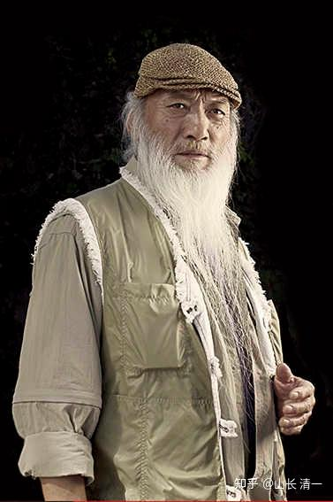
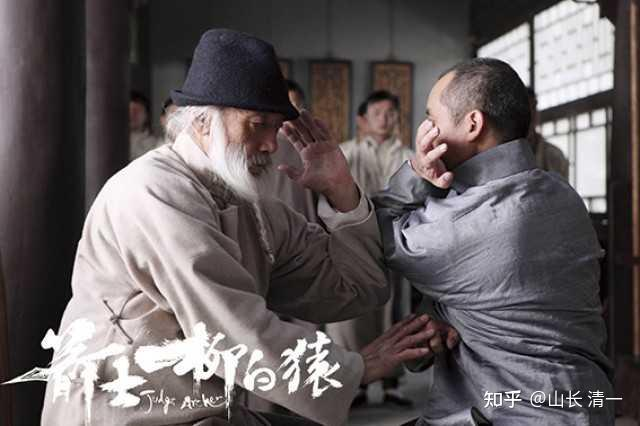
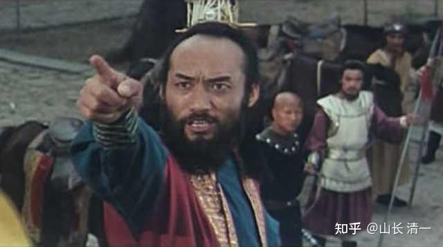

徐浩峰缅怀于承惠：心有剑器改乾坤 世无度量容英才

稿源：南方人物周刊 | 作者： 特约撰稿 徐皓峰 编辑 郑廷鑫 日期： 2018-01-03

*于承惠，中国武术界泰斗，国家一级演员，曾出演过电影《少林寺》《黄河大侠》《倭寇的踪迹》《箭士柳白猿》等。7月5日在故乡山东离世，享年76岁。*

《师父》开机前，廖凡武术训练时间仅两个月，我向他保证：“你失败了，就是民国武林的失败。”
他知我夸张，但选择了信任我。
之前，我有过一次成功范例。导演《箭士柳白猿》时，训练出了赵峥，他是话剧演员，无武术基础，两个月后可和真正高手于承惠对搏长枪。有香港影人看过此片，以为他是武术运动员，反夸他会演戏。
于承惠成名于1982年的《少林寺》，李连杰正一号，他反一号。他原在山东武术队，从事套路表演，看到老队员们跟体操运动员一样，年过三十，便技巧退化，等同普通人。他跟我说：“我那么热爱武术，付出这么多，一过三十，就什么都不行了，那我还追求什么？”
出于不甘心，他去民间访传统武术，访到一位民国时代山东国术馆的师父，之后又转学多师，修行实搏武技，年过七十仍功力不坠。
一次剧组小范围聚餐，于老要结账，我拦他。一搭手，我俩都本能地把手伸到对方肋下。于老肋下肌，坚实得如摸在马背上，勤练不辍的标志。
听到安排了长枪对搏，他拒绝用剧组准备的枪杆，用自己的。长枪对于武人，类似戏班演关公。关公戏，要上香禁语，娱乐事里出了敬神事。老派武人都敬长枪，长枪最练功夫、最显功夫，于老有根用了三十年的枪杆，已泛红色。
于老很关注跟他对枪的人，剧组的人也觉得该是于老这级别的高手，才对得起这场戏。当我告诉他是位话剧演员，正在勤学苦练，于老没评价，可能很沮丧。
看过赵峥练枪的视频，于老说话：“两个月练不到这样，此人有十年枪龄。”
我把赵峥送到八卦门，进行站桩、走桩训练，先有了习武人身形，再教他一种速成枪法。于老练的枪法叫岳武穆十三枪，形意门、太极门练的枪，以腰使枪，所向披靡的发劲，一碰便将敌兵器打飞。
十三枪是功力型枪法，招法简单，不以招克敌，以劲克敌，劲不好练，悟性不佳，往往虚耗岁月。
幸好还有赵子龙十八枪，燕青门和三皇炮捶所练。燕青门从事天津码头搬运，纠纷一起要群殴，三皇炮捶门押送镖车，遇上土匪要开战，都需要大量人手，必须速成，学了就得能参战。
燕青门名宿张克功晚年由我二姥爷照顾，我的十八枪源于此，没学全。《箭士柳白猿》中，赵峥亭阁练盲枪，蒙眼打四人，是这残本十八枪。
十八枪是技巧型枪法，腰劲很难练，脚脖子好练，便避重就轻，以转脚替代转腰，发劲大差不差，所以可速成。赵峥视频是仰角拍的，脚部不显，瞒过了于老眼睛。
开机后，赵峥一日说：“没瞒住。”
昨夜于老带着烟酒零食，来赵峥房间聊天，一片友好中忽然要求搭手，将赵峥挑飞，跌到床上。于老一战心安，悟到自己戏份，在我动作设计之外，献出两个转腰枪技，实拍时漂亮得惊了现场。
他俩的对枪戏，赵峥转脚行枪，于老以腰运枪，十八枪和十三枪技法分明，赵云对岳飞。

《箭士柳白猿》剧照
于老这杆三十年的枪，毁于《箭士柳白猿》剧组。此枪是爱物，于老收工后都带回宾馆房间，一日打戏辛苦，听道具组长说“您回去吧，我们帮您收着”，想次日也是枪戏，疏忽了。
半夜，道具组员要完成“断枪残杆”的制作任务，在一排枪中，一眼看上了于老的枪，觉得质地最好，想着“导演一定满意”，锯了——次日，我果然满意，赵峥眼尖，认出是于老的，组员吓白了脸。等于老到现场，我们以为他一定发火，不料他只是低头抚枪。
赵峥安慰于老，表示要收藏这杆断枪，作为两人友谊的纪念。不料于老说决不送人，不管它变成什么样，都要留着。
都知道于老伤心坏了，但于老除了这句话，什么也没说，正常拍戏。当夜，美术指导谢勇亲自动手，用钉子、铁箍接上了这杆枪，看着像假肢。于老称赞真好，他山东家里还有个铁枪头，装上，又是杆好枪。
他在表演，为那个锯他枪的组员，不想让年轻人有负疚感。

在《少林寺》中扮演王仁则
“心有剑器改乾坤，世无度量容英才”——原是去年路学长导演辞世，我写的挽联，一朋友觉得文有怨气，别刺激了大家，因而弃用。今日，来祭奠于老。
中国的竞技武术，遵循西方体操，以美观和难度为标准。于老脱离训练，去学民间实搏武术，练得火热时，被武术队召回，做汇报表演。于老觉得没事，不就是翻跟头么？但竞技武术和实搏武术是两套体系，人只有一个身体，记住这个便记不住那个了。出了事故，摔残膝盖。
那时还是福利社会，国家单位的工伤事故，国家养一辈子。于老不愿当病号吃国家，辞职当了工人。工休时总结古代双手剑剑法，编纂成套路，让实搏武技挤进了竞技武术赛场。有外省武术队有意聘他做教练时，得遇香港导演张鑫炎，邀演电影，须拍两年。
遭邻居非议：“老于38了，还不干正经事啊？”那时，38岁是事业稳定的年龄。入组后，一演员听说他年龄，赞道：“你家中必有贤妻。”两年后，《少林寺》大热，李连杰和于老成名。
电影观众和日用品顾客相似，多是女性和小孩。于老只是赢得了成熟男性的钦佩，于是香港电影界普遍判断李连杰更值得培养，“于承惠四十了，火了，又能火几年？”成为巨星，也会迅速贬值，人一老就没观众了。
张鑫炎说：“我不信。”让于老当男一号，拍了《黄河大侠》。可惜，时逢大陆电影厂改革，电影业崩盘，大陆人不看电影了。随后香港电影业崩盘，一晃三十年，于老七十了。
73岁，于老主演我的《倭寇的踪迹》，保持训练，每日倒立30分钟。他住我隔壁，有人喝醉了来我房，他听到赶来，也不说话，坐在一旁。那人谈乐了，走了，于老冲我一笑，随着走了。我知道，那人如撒酒疯，于老会保护我。
74岁，于老主演《箭士柳白猿》，他和主演宋洋、美术指导谢勇处得情同父子。有位宽厚长者，剧组是非少，他的德行在眼前，大家不好意思行为差劲。
前日，我和宋洋、制片路潞赶去济南，见于老最后一面。戴着那顶我们熟悉的草帽，他安详躺着。闭目的于老形象，是我们不熟悉的，他是谁？
不觉落泪。

**清一后记：这篇文章，让我们了解一些老一代武术人的风貌。于老这种寂寞武人，德行高尚，江湖武林中不多见。虽然他少林寺演的是坏人，在生活中，他是一个明白豁达的人。一生他活得非常的自尊。【倭寇的踪迹】里面的男主角，于世俗格格不入的高手形象，还真有点像于老的风格！**

**徐皓峰，有喷子说他不懂武，只会写小说，编故事。我认为：他可能功夫没咋深入练（大学教授，哪有时间天天练功），但他肯定懂武术，练得不多，但见过的高手多，见识高。甚至他是懂得该咋练的。他对武术的理解， 眼光，水准远远高于很多固步自封的所谓传武大师的。他还有武术世家后人的身份，肯定接触过很多真正的武人。因为都是行内人，还因为他不是武林中人，这些人愿意说一些圈内人互相不说的武术的奥秘给他知道----反正他也不练拳，不是竞争对手。而且他也知道很多高级的东西，别人也想套一点形意门的好东西出来。从他的电影作品中，看到他对江湖习气，思维行为的刻画，其理解深度远远超过梁羽生和金庸。他算是一个武人中的奇才，怪才吧！**

**他说他的作品：不是拍武侠的，而是拍武行----武作为一个行业，一个利益集团的真面目。这一点，在【师父】，【道士下山】，【倭寇的踪迹】里面。体现特别的明显----武行的各种勾心斗角，阴谋算计。我猜徐皓峰对中国人的国民性很失望吧？**

**于老是个武痴。他跟徐皓峰关系这么亲近，人不亲艺亲！不仅仅是演员和导演的关系。喷徐皓峰的人，难道比于老更懂武术吗？真是自不量力！**

**中国两个徐，改变了中国的武林状况：**

**一个是冬瓜徐：他作为武人的叫骂，撕下了中国这些“武行”的虚假面目，让陈氏的金刚们，太极的大师们都无地自容。搂钱的饭碗被他砸掉了。**

**一个是皓峰徐：他作为文人的作品，在揭露武行里面一些丑陋言行的同时，也让国人对传武维持了一点点信心：固然传武行业里面，有大量的败类的骗子，但也不能说传武全是骗子，至少还有于老这样的人，以及李仲轩这样的人。只是这些人都在死去！他抢在真传武彻底死去之前，留下一点武林最后的踪迹！**

**两个徐，都值得尊重，他们都在捍卫他们知道的真理。他们面对武林和江湖的虚伪，都不假模假样的跟着混日子，装一切OK！**

**另外：我还承认，就是这两个徐，才让我出来玩太极征泰的。原来真的没想自己要进入武行玩真的，只是在武林打酱油的路人甲。**

皓峰徐，让我认为【逝去的武林】需要在彻底死去之前，给世人留下一点光彩！不要只是停留在书里面。电影里面！我总以为有人会做这件事的。不是还有李老，于老这样的人吗？中国人有热爱武侠的马云，有热爱武术的年轻人。只要有钱的资本家，请来一个于老，李老，招上一批年轻人，不就成事了吗？

冬瓜徐让我知道：我以为的----不是我以为的！我等了两年，等著看李老，于老出来收拾这个狂徒呢。但---居然没有。说明-----中国武林的真人，大概率已经死绝了！至少是没有人愿意出来捍卫中华武林了。国家武术总局能做的事情，就是封杀冬瓜。这个可捍卫不了中华武术。甚至国家武术总局每年都在举办的【全国武术赛事】。都被冬瓜给搅合没了！堂堂大国武林总掌门，被如此打脸，证明高高庙堂，肯定是无人了！民间的于老李老，也不肯出来，要么就是老了，要么就是死了！也无人了！

至于马云的资本弘扬武林-----难道就是拍个【功守道】？马云的钱多，于是就用钱去，把一大堆的中华武林高手----叶问，陈真，霍元甲，黄飞鸿们，全都轻松统统击败了？然后一代高人自己再败给派出所？这是玩的啥玩意呀？整个游戏，打得比我的生日老头打金腰带木兰的比赛还假？

于是，我等了两年多，等看冬瓜打脸，却一直没等到。却看到“年轻人不讲武德”成了全国的“风行语言，全民共识”。我就只好一介文人，勉力出来，组建了私人的【清一武道馆】，勉强用个人的力量，帮助一批有上进心的年轻人，来打泰来挽救行将消失的中华传武！

所以：如果我做了啥好事，感谢两位武林网红徐姓大侠。

如果我的事情没办好，办砸了！只怪我自己没本事，跟别人无关！