下面附上我们开学第一课的课前作业。小公主们费了不少功夫来，回答这些作业。这种课程和作业，就相当于今日国际学校的高中部作业。在清迈的校外家长们，也一起听了课程。家长们对内容表示很吃惊----大开眼界。连家长自己都回答不出来的问题，偏偏这些问题，与未来中国的国运和发展方向关系巨大。

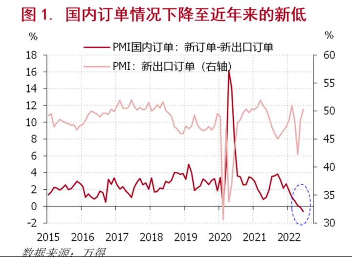

您认为：持续三年里面，我们这样不断的训练和培养公主们的思维和眼光，她们和其他每天学A-LEVLE。考SAT高分的人有啥区别？或者---这群小公主，和现在衡水高中备战高考的学生，未来会有啥区别？10年后，20年后，30年，他们会是差不多的命运吗？

15-18岁，你学什么东西，将来大概率成为什么样的人！

如果你学的是垃圾。一辈子垃圾人。（比如游戏，广告。玄幻小说）

如果你学的是工具。一辈子工具人。

我们学的是啥？将来做啥人？把决定权交给你吧！

先上一些家长们拍的公主班图片：

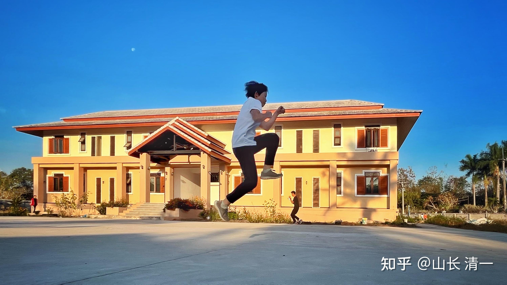

*慧心楼外的野马跳*

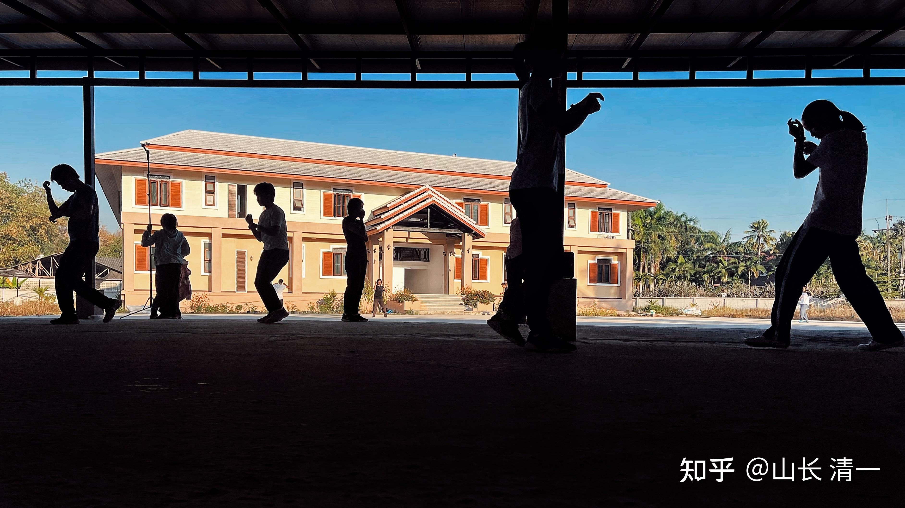

*防风雨的操场上练功剪影*

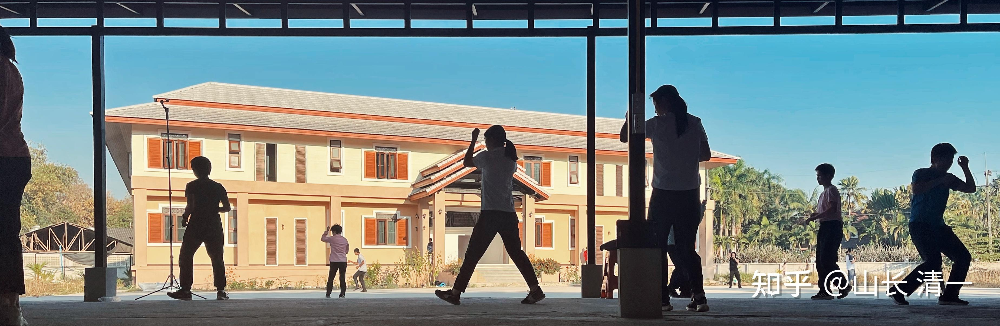

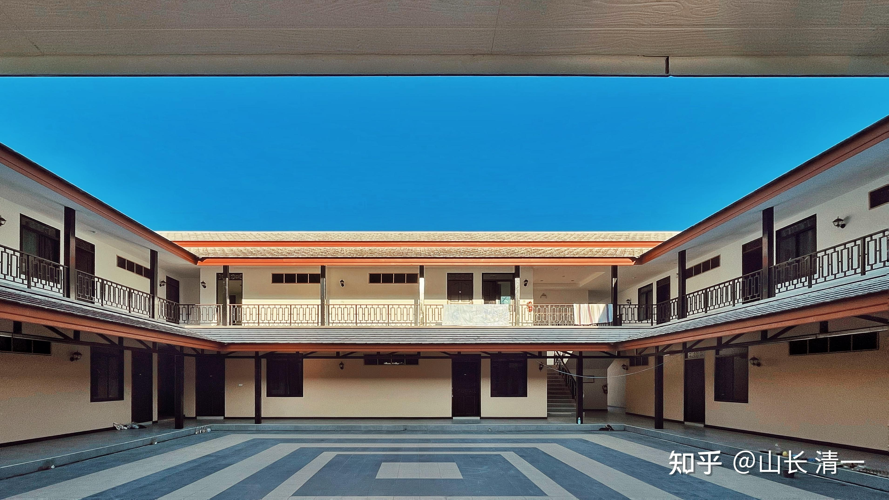

*公主们居住的海外四合院内景*

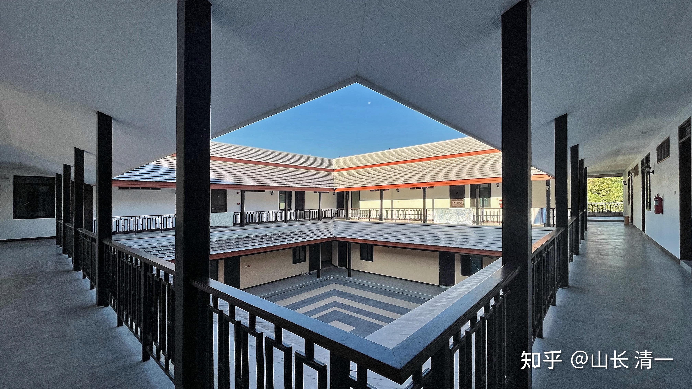

*四合院二楼内景*

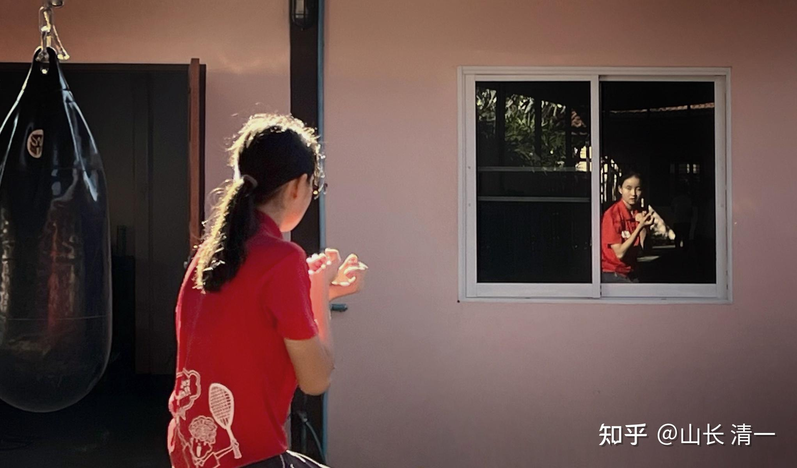

*万艾拉练功图---动作是不是有点传武老拳师的拳照样？肯定不是练泰拳*

*野马分鬃攻防演练---冲击时刻双方都闭眼睛-----很不专业的拳手*

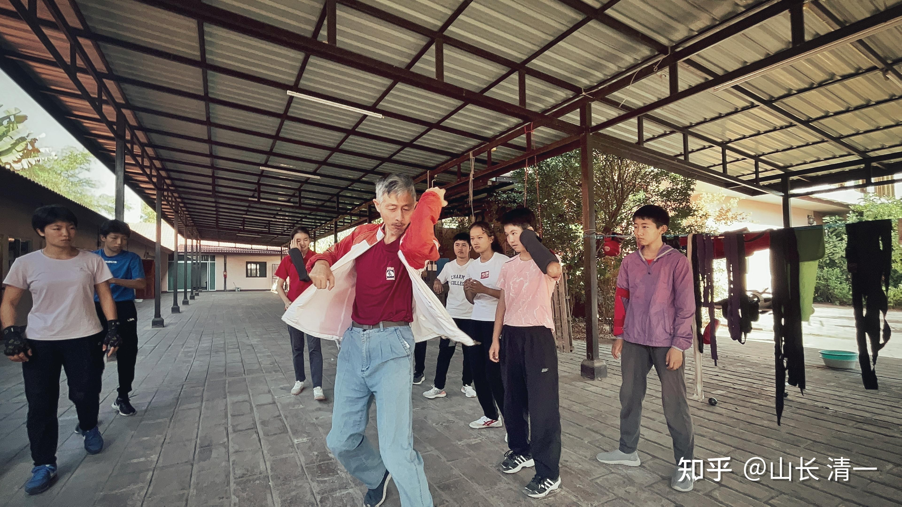

*我练拳显然没有公主们练的好看。更没有泰拳威风*

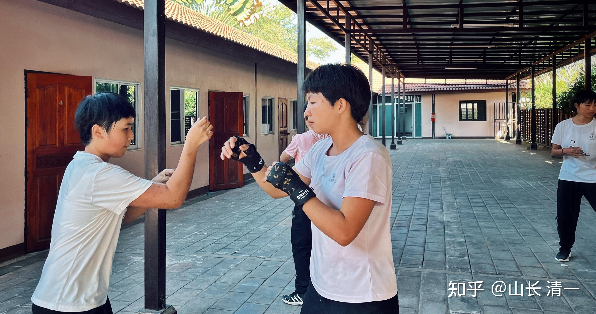

*佳慧负责带选出来的七公主练拳(征泰预备队）*

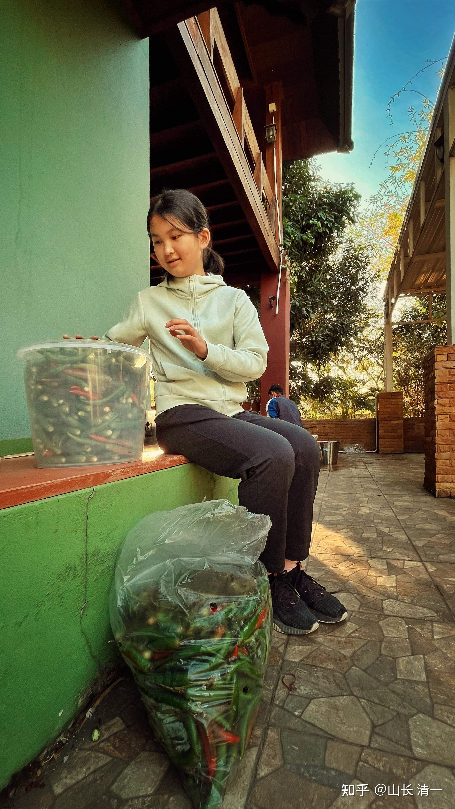

*练拳，读书----还有生活 *

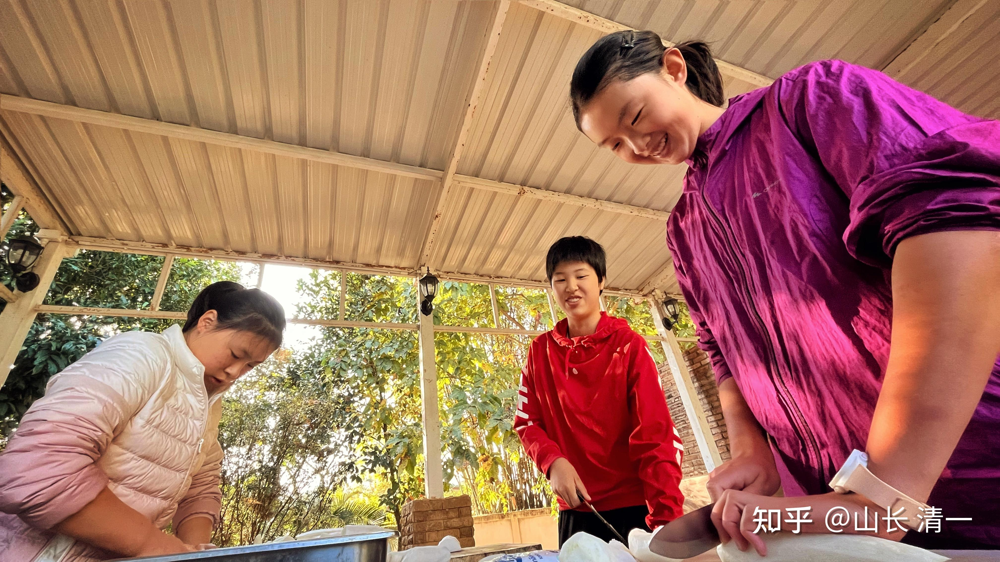

*公主们都是自己做饭做菜的*

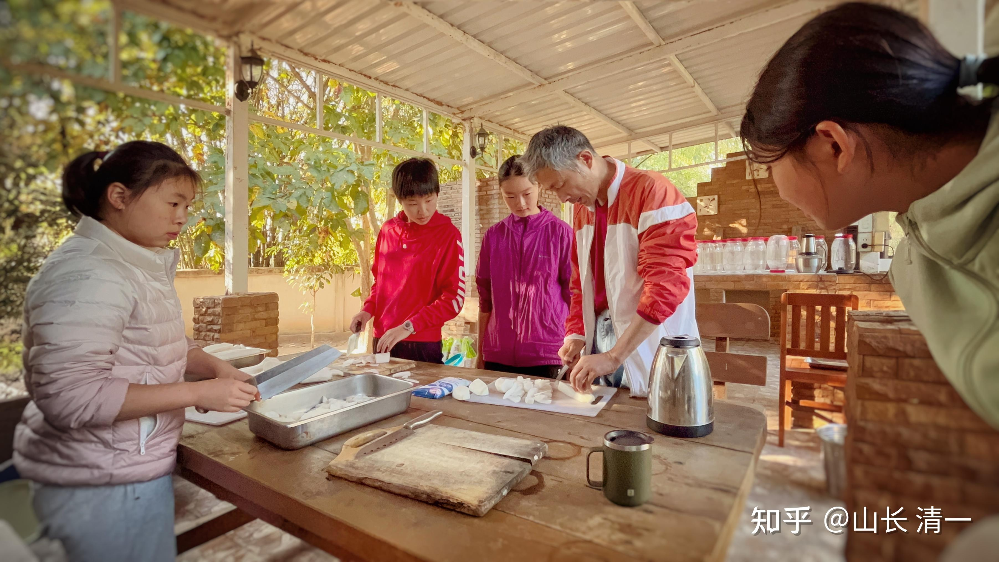

*我示范“太极刀法切菜”，比公主们的刀功更快，更节省力气！*

学期开学第一课: 给你一双发现未来的眼光！

聪明人，永远要看未来的10年，20年，30年。只有蠢货才鼠目寸光，只看眼前。只有呆子，才看过去来规划未来！比如中国家长，居然傻乎乎的以为——拼命读书考试，拿到一张大学文凭就可以找到工作——这就是过去，而不是现在。更不是未来！

本学期的作业，就是训练大家的眼光，让你成为一个聪明的，有眼光的人！

1：获得教育，拿到文凭，就能带来就业吗？为什么菲律宾的大学生要出国做菲佣？未来大学生的职业出路是什么？

2：如果中国社会未来会发生这种情况（各种就业机会减少），女性的职业取向，会是什么样子的？中国过去几十年，发生过这种情况没有—-就是有人无工作，无职业，无收入？当时我们的国家和政府，是怎样解决这个问题的？后来这个就业的问题，我国是怎样得到解决的？

3：台湾和日本发展过程进程很相似。台湾本土人的机会在哪里？为何相比日本似乎还不错？台湾经验对我们有啥价值？

4：根据中国国情，未来20-30年，清一新教育的发展会受到什么样的影响和困难？我们应该如何应对？现在该作什么准备？

5：不管什么发展水平的国家和社会，只要有远见的人，都能找到发展机会。请你为自己和后人找到未来的20-30年，你在新教育之外的行业发展机会！

本作业，将在本周五提交，周六我讲课。之后带班教师改学生作业，进行排名！高中部和公主班排名最后一名的（两人）。

处罚一：要被赶出庄园当流浪公主。思过反省提升，一天一夜24小时不许回庄园，也不许去旅店，不能带钱，可以带上衣服去庙里面过夜。

处罚二：复活赛-----周日一大早，公主班校外家长带作业排名前三的公主和最后三名的公主，分成两个小组去进行国际推广校外体验活动。去清迈古城与外国人交流谈话练口语，交朋友。晚上去古城内的周末夜市活动，交朋友。分享和推介今日国际的学生风貌，生活方式。学霸和拳霸结合的公主范儿。还要分享素食战士击败泰拳的比赛，以及推荐每周五的校友中国人比赛，如果中国拳手的比赛，能够获得外国人的点名观看，吸引更多的旅游者，将来三大拳场，就会不余遗力的邀请我们的拳手去比赛了。这就为未来的小公主们去比赛铺好了路！一举三得！

如果最后三名的小组，能够在周日活动环节，击败了前三名的小组，就可以免除流浪命运，复活成功。否则，周日晚上回家休息后，第二天（周一）一早离家体验流浪生活24小时！

作者：匿名用户

链接：[https://www.zhihu.com/question/398512836/answer/1525862433](https://www.zhihu.com/question/398512836/answer/1525862433)

工作岗位变少的更快。

日本就是例子。

NHK有个纪录片

[道兰][NHK纪录片]人事、会计聚集地——中国_哔哩哔哩 (゜-゜)つロ 干杯~-bilibili

[http://www.bilibili.com/video/BV1Zb411S7FV?from=search&seid=2901021293220978403](http://link.zhihu.com/?target=http%3A//www.bilibili.com/video/BV1Zb411S7FV%3Ffrom%3Dsearch%26seid%3D2901021293220978403)

日企不光是生产线，连人事、会计的工作也模块化，把事务性的工作都转移到大连（也就是日本只保留决策用的管理层，执行层面基本上完全在大连）。

这些还不满足，还要把总务工作（也就是国内叫的行政、综合等事务）也尽可能转移到大连。

经过测算，转以后在日本每小时需要5500日元成本的总务工作，到中国来只需要750日元，减少86%。

话是老总说的，他称之为了不起的成就，我们可以看到镜头扫到的员工们对了不起的态度。

是的，日本人不仅制造业的工人岗位没有了，人事、财务、行政这些小白领岗位也没有了。

结果就是什么呢？

从事了几十年总务工作的大管家也只能问是不是不需要我们了。

这样的迁移力度之下：

一、日本的正式工作减少的比人还快

主要承担[社会稳定器](https://www.zhihu.com/search?q=%25E7%25A4%25BE%25E4%25BC%259A%25E7%25A8%25B3%25E5%25AE%259A%25E5%2599%25A8&search_source=Entity&hybrid_search_source=Entity&hybrid_search_extra=%257B%2522sourceType%2522%253A%2522answer%2522%252C%2522sourceId%2522%253A1525862433%257D)作用的制造业及初级白领工作都跑了，大量的年轻人只能长时间做临时工、派遣工，那种终身雇佣的工作越来越难找。

二、东京以外的城市（大阪都快顶不住了，别说[名古屋](https://www.zhihu.com/search?q=%25E5%2590%258D%25E5%258F%25A4%25E5%25B1%258B&search_source=Entity&hybrid_search_source=Entity&hybrid_search_extra=%257B%2522sourceType%2522%253A%2522answer%2522%252C%2522sourceId%2522%253A1525862433%257D)、仙台以及更小的城市）失血严重

因为二产和简单的三产往往是二线、三线城市安身立命的法宝，只有一线城市可以靠金融、法律、娱乐、传媒等高端三产顶一下。

(在这里要提一下东南某岛地区，曾经台北和高雄一南一北，也有东京和大阪的意思，但是在制造业外迁以后，高雄迅速的衰落，台湾的年轻人在岛内没得选，只能去台北讨口饭吃，和[日本一](https://www.zhihu.com/search?q=%25E6%2597%25A5%25E6%259C%25AC%25E4%25B8%2580&search_source=Entity&hybrid_search_source=Entity&hybrid_search_extra=%257B%2522sourceType%2522%253A%2522answer%2522%252C%2522sourceId%2522%253A1525862433%257D)样一样）

中国和日本没区别，小城市你除了师医公这三个必需品外，能吸纳就业的就是制造业的工厂以及配套的行政人事财务岗位，这些都没了，就只有旅游业农家乐了（大家想想中国小城市的农家乐和日本旅游小地方那些所谓的[百年家族](https://www.zhihu.com/search?q=%25E7%2599%25BE%25E5%25B9%25B4%25E5%25AE%25B6%25E6%2597%258F&search_source=Entity&hybrid_search_source=Entity&hybrid_search_extra=%257B%2522sourceType%2522%253A%2522answer%2522%252C%2522sourceId%2522%253A1525862433%257D)旅馆有什么区别？）。

而全日本读了书年轻人，都只能去东京卷。

再回到国内。

想想？老版人民币上有什么？女[拖拉机手](https://www.zhihu.com/search?q=%25E6%258B%2596%25E6%258B%2589%25E6%259C%25BA%25E6%2589%258B&search_source=Entity&hybrid_search_source=Entity&hybrid_search_extra=%257B%2522sourceType%2522%253A%2522answer%2522%252C%2522sourceId%2522%253A1525862433%257D)，你的长辈里面女卡车司机、女电焊工、都不少吧？

现在还看得到多少女性去做这些？

都去文员、会计、教师、护士等去了，女性减少的比例和岗位减少的比例是同步的吗？能不卷吗？

原来每个县轻工业都是自成体系，毛巾厂、化肥厂、食品厂，解决本地年轻人就业，现在还有多少县城有？

除了进体制，不都得去大城市卷？

我还有在这里立个flag,等到你所谓的劳动力再减少

缅甸佤邦采用中国九年义务教科书 中国的历史也将成为必修课_哔哩哔哩 (゜-゜)つロ 干杯~-bilibili

[http://www.bilibili.com/video/BV1hf4y1m7GP?from=search&seid=12445294561741578185](http://link.zhihu.com/?target=http%3A//www.bilibili.com/video/BV1hf4y1m7GP%3Ffrom%3Dsearch%26seid%3D12445294561741578185)

缅甸工资只有中国的五分之一到十分之一，缅北直接用中文的义务教育体系，这可不是老外猎奇学中文那种[第二语言](https://www.zhihu.com/search?q=%25E7%25AC%25AC%25E4%25BA%258C%25E8%25AF%25AD%25E8%25A8%2580&search_source=Entity&hybrid_search_source=Entity&hybrid_search_extra=%257B%2522sourceType%2522%253A%2522answer%2522%252C%2522sourceId%2522%253A1525862433%257D)，那是和我们一样从小到大用同一套教材体系。2010年前后缅北局势稳定下来了，当地正在大力推进扫盲和义务教育，10年内缅北将有大批中文为[第一语言](https://www.zhihu.com/search?q=%25E7%25AC%25AC%25E4%25B8%2580%25E8%25AF%25AD%25E8%25A8%2580&search_source=Entity&hybrid_search_source=Entity&hybrid_search_extra=%257B%2522sourceType%2522%253A%2522answer%2522%252C%2522sourceId%2522%253A1525862433%257D)的劳动力。

菲律宾有成套完善的英文教育体系，菲律宾不是没文化人，是国内实在提供不了就业岗位，大把的大学生只能出国做菲佣。

我就不说转移什么越南泰国[孟加拉](https://www.zhihu.com/search?q=%25E5%25AD%259F%25E5%258A%25A0%25E6%258B%2589&search_source=Entity&hybrid_search_source=Entity&hybrid_search_extra=%257B%2522sourceType%2522%253A%2522answer%2522%252C%2522sourceId%2522%253A1525862433%257D)的服装制造业了。

就是所谓的白领工作，到时候跟日本一样一样，也得完。

只要政治环境稍微稳定下来，基建再发展一下，缅北招当地人培训一下做中文客服、人事、行政、财务，五分之一的工资，凭什么要你？

菲律宾招当地人，国内的IT培训班模式先走起，研发不行先搞测试，人家也是读过大学懂英语的大学生，原来只能背井离乡卖苦力做菲佣，现在能在菲律宾就业做白领工资还更高，你怕招不到人？那别人只要你五分之一的工资，你拿3万还整天叫穷想着跳槽，别人五六千乐呵呵心满意足，那凭什么在北上广招你？

人事、[行政文员](https://www.zhihu.com/search?q=%25E8%25A1%258C%25E6%2594%25BF%25E6%2596%2587%25E5%2591%2598&search_source=Entity&hybrid_search_source=Entity&hybrid_search_extra=%257B%2522sourceType%2522%253A%2522answer%2522%252C%2522sourceId%2522%253A1525862433%257D)、会计这些岗位到时候跟日本一样也没得了，只有教师、护士这些没法转移的还有的卷，下一代的姑娘们比现在还卷，不仅女拖拉机手、女电焊工要消失，女文员、会计也要消失一大半。

将来，只有人上人上人，才可以在一家大公司找到一个长期雇佣，体面稳定，签合同交社保的工作。一般人，小城市靠着旅游观光混口饭吃，大城市没野心的便利店打工、直播、送外卖，有一单是一单，做一天算一天的自雇佣，有野心的只能去体育、娱乐圈去博个出名翻身。

【中字】日本东京22岁快递员的真实一天记录| 看世界系列_哔哩哔哩 (゜-゜)つロ 干杯~-bilibili

[http://www.bilibili.com/video/BV1T7411h7nC?p=1&share_medium=iphone&share_plat=ios&share_source=COPY&share_tag=s_i×tamp=1602993050&unique_k=ASdCcc](http://link.zhihu.com/?target=http%3A//www.bilibili.com/video/BV1T7411h7nC%3Fp%3D1%26share_medium%3Diphone%26share_plat%3Dios%26share_source%3DCOPY%26share_tag%3Ds_i%26timestamp%3D1602993050%26unique_k%3DASdCcc)

感受一下，将来大部分大学生就这样，年轻漂亮的小姑娘，卷到快递业去不是梦哦。

社科院：人力成本远超东南亚 中国低成本优势在丧失

这个人也可以自己去工作的