本学期开始：为了强化外语的交流和学习，公主班的学生，本学期的周末活动大大强化。计划是每周五晚上和每周日一整天，利用清迈国际旅游城市的优势，对全世界的游客，进行中国人全新形象展示的“公主国际交流日”活动，直接拿洋人来练口语，练文化交流能力。从小进行“中国文化大使”的工作。为世界和平做贡献！为中国崛起而努力！也为完善自我而工作！

今日学堂一向奉行“在应用中学外语”的学习方式，与大家熟悉的传统学习方式不一样。因此：其实我们是没有【外语课程】的，而是用表演课，交流课，演讲和辩论课，文化学习，海外家庭居住生活等方式来学外语的。就算是去古城，直接拿洋人来练口语交流，但课程设计依然不是外语为中心，反而是“中西文化交流沟通课”。这样在使用中学习，效果又好，学习提高的速度也快，而且特别有趣。孩子们当玩一样就学成了学霸！不像国人，总把简单愉快的学习，弄得像进地狱一样苦难（比如衡中模式）。

国人把“学习”的事情看得很单一：交钱，请人来教学“最正宗”。其实---天地广阔，不要钱的资源，天下到处都是。何必把学习搞得这么正经八百呢？有时候，不花钱的课外学习，实地的体验，比花钱的课堂学习，价值更高，效果更好。假期，公主们跟工人们一起工作，不仅仅学习了干活，还让自己的泰语交流水平大大提高。生活在泰国人家里，泰语水平也肉眼可见的提高。现在开学，去清迈古城和西洋人交流，自然也能让自己的英文水平更加流利。而且----还把中国传统文化的理念，新教育的生活方式传播的更广！

目前市场正规机构课程外教一对一，一个小时大概300-500不等。我们的孩子，周末课外活动，有大批的洋人免费陪聊，家长们一天就可以轻松省下来几千元的外教费了。与其他学英语的中国人不同---我们是双向沟通交流，互有取舍。还能获得外国人的尊重。但国内学外语的学生，单向吸收西方洋人的价值观，结果最终培养成崇洋情结。未来，能在洋人面前自尊，自强，且获得洋人尊重的中国人，恐怕只能指望今日国际学校了。

下面是一路护航的校外家长们拍的公主们周日课外活动的照片！

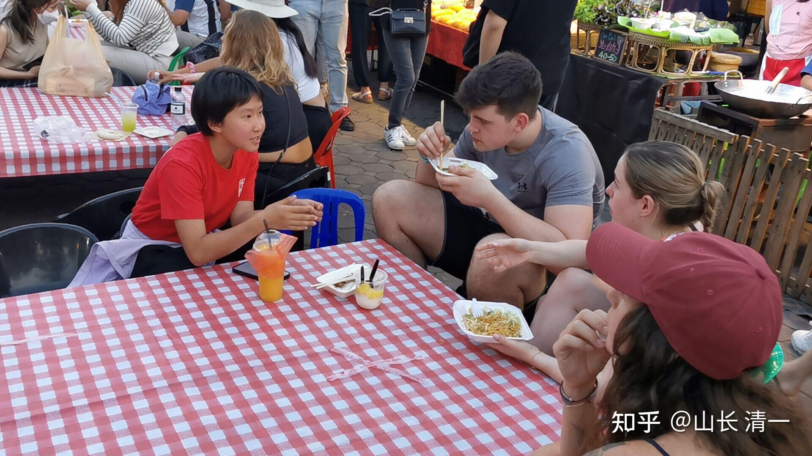

*与洋人拳手交流木兰拳赛*

给孩子们对洋人的交流任务，不是泛泛而谈，而是有主题的：本周日活动的主题就是---介绍木兰们的泰拳之战，分享木兰们的生活方式和武术战绩。以学生的身份，介绍自己的目标和独特的学习方式。上图这个小公主，正好遇见了“专业人士”，男的是练空手道的，女的是练泰拳的。对木兰们居然以素食者的身份，战胜了泰拳的全国冠军感到非常的不可思议，讨论了蛮久的。当然---公主们欢迎他们去现场观看---每周五的中国日，几个拳场都有我们中国木兰拳手的身影。眼见为实----自己去看，报上木兰们的名字，说是木兰们的朋友，还可以享受优惠价！

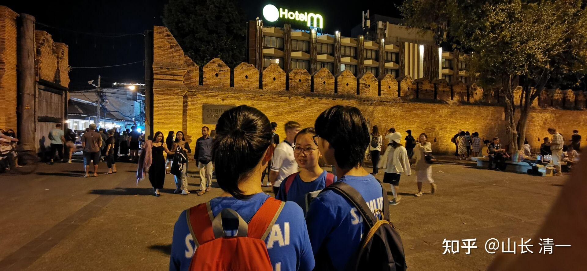

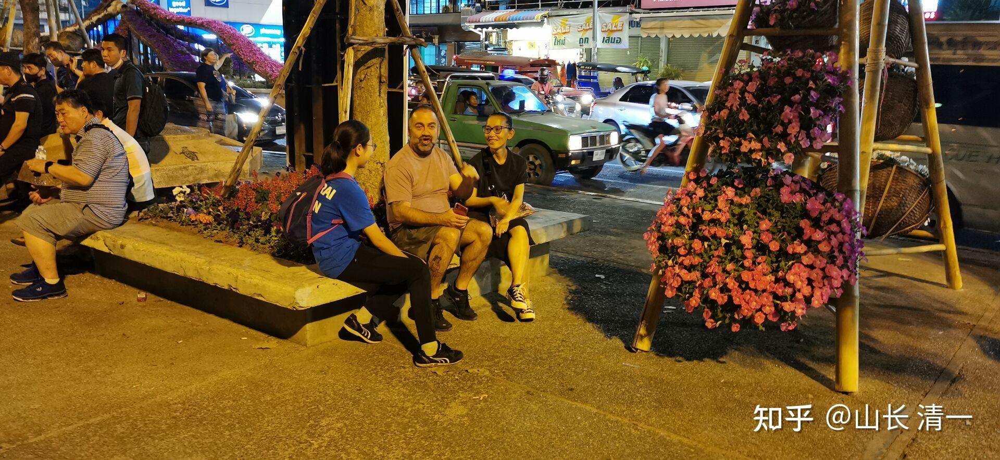

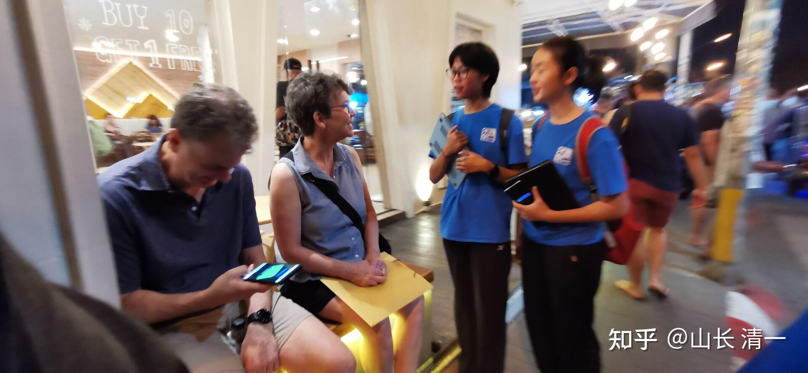

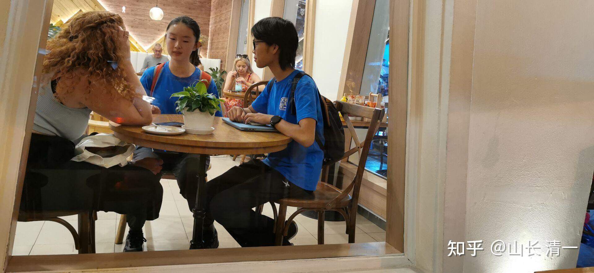

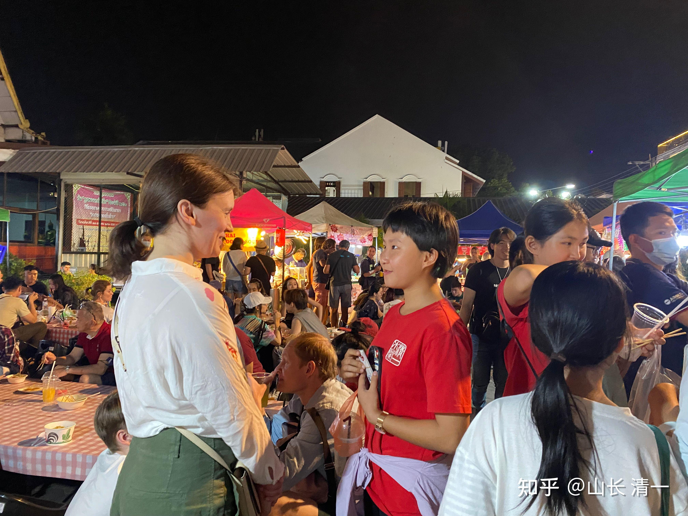

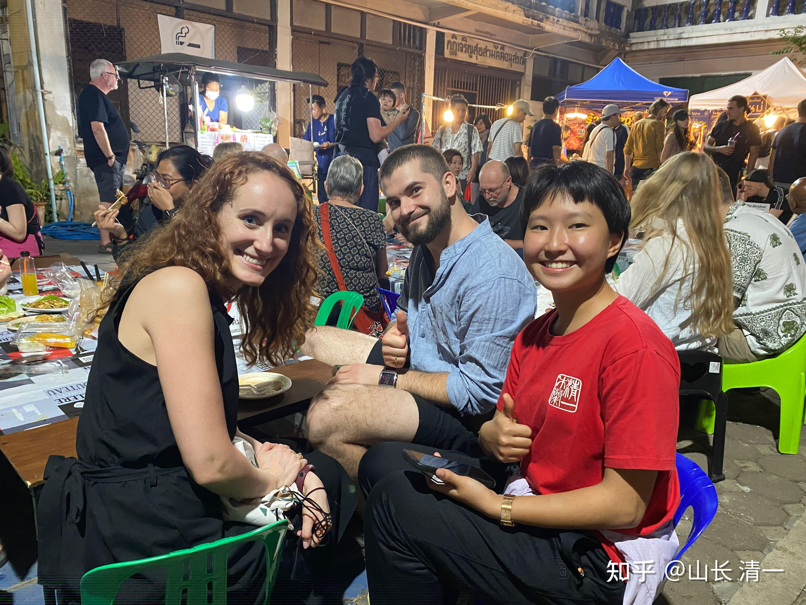

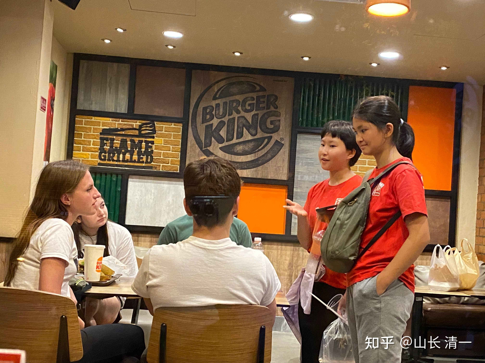

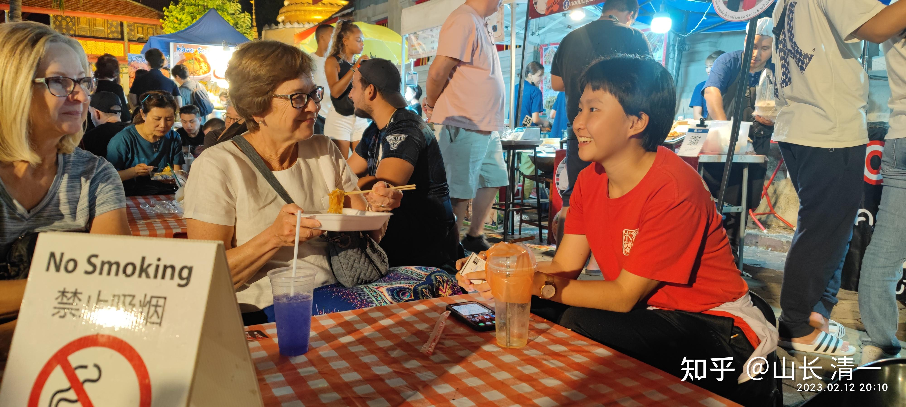

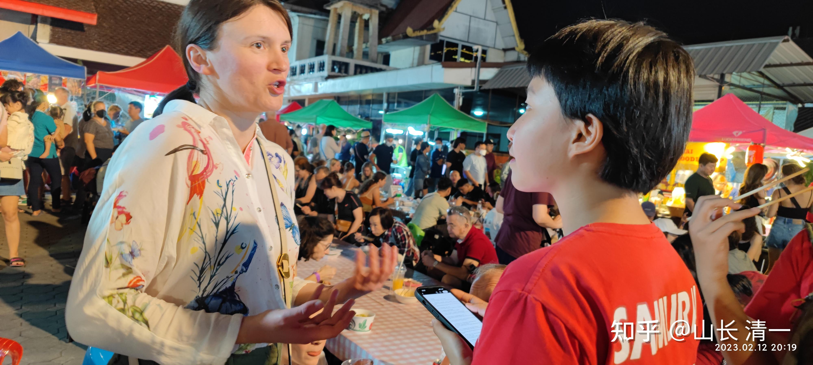

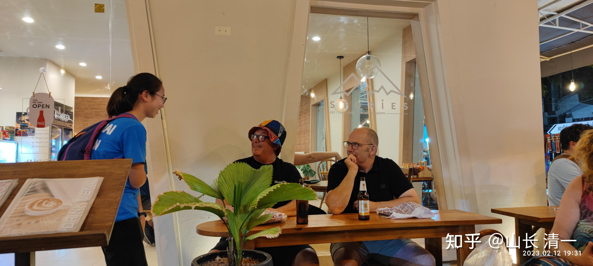

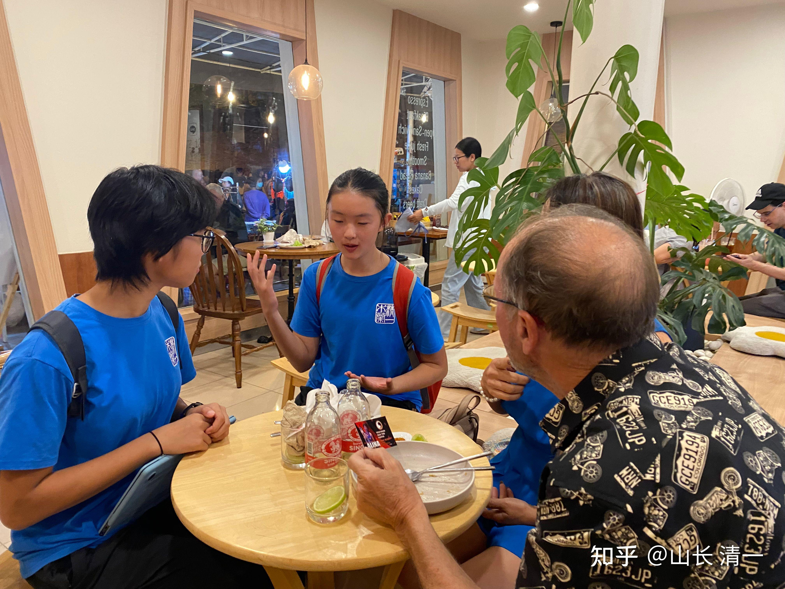

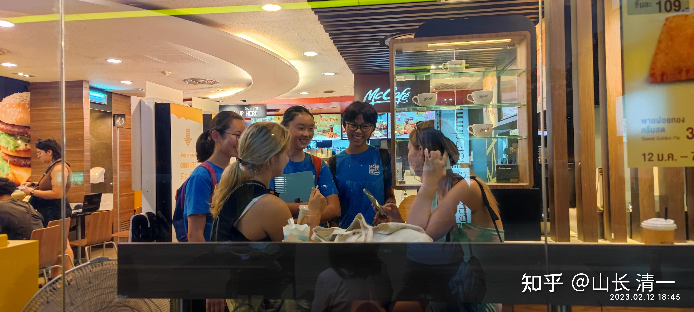

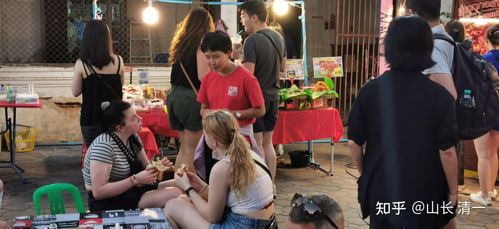

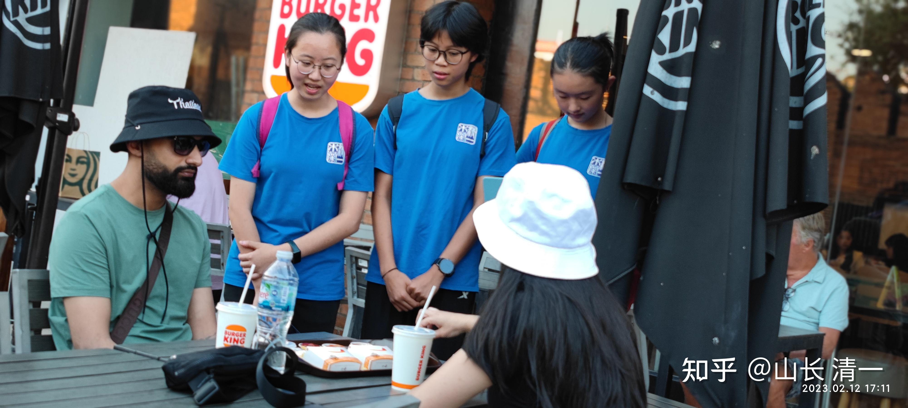

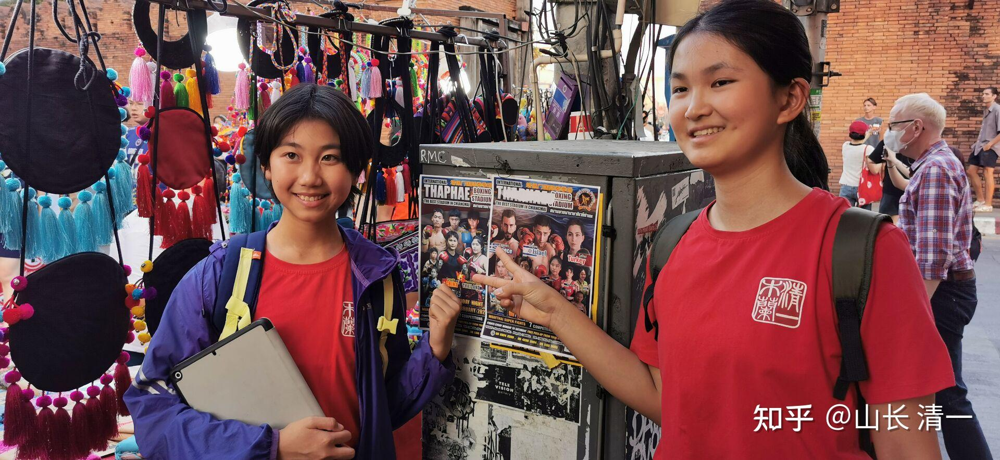

公主们还分了红队和蓝队两组人马，互相比赛，谁的沟通效果更好。谁更受欢迎！

家长们也跟随观察和评估公主们的沟通交流活动，并汇报给其他的国内家长。据家家长说-----孩子们适应非常的快：孩子聊天经验越来越丰富了，不管对方对拳击是否感兴趣，但最终都对孩子们的英语，谈吐表示了赞赏。

[!\[image\](images/img_017.jpg)

洋人认为素食击败肉食不可思议 https://www.zhihu.com/video/1608242849484333057](http://link.zhihu.com/?target=https%3A//www.zhihu.com/video/1608242849484333057)

素食者骨头更硬。体力更强，速度更快，耐力更好，身体更灵活。但外国洋人就是不肯相信，认为是不可思议的----基本上就是等于“谁说的，不可能的，你在骗我”，看她们的表情很有意思。这段视频中，也有公主们的英文发音，起码---外国人能听懂！交流无障碍。今日国际学校的外语教学能力，目前在全球尚属无敌地位。

家长现场反馈的沟通效果：

我们观察到和孩子们聊天后，有些外国人会认真记录名片里的信息，对照手机查询地址，有些会一群人拿着名片继续探讨(孩子们有时会和三四个一起聊），有些表示虽然马上要离开泰国来不及看木兰们比赛，但会把名片当纪念品收藏。这些都说明交流已经给他们带来了触动，也获得了他们的尊重。