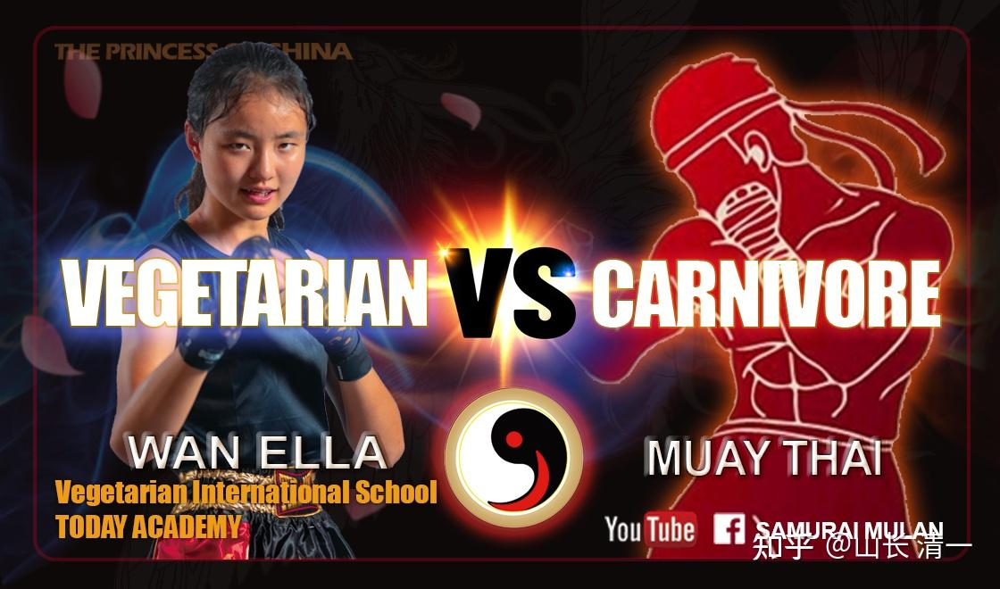

最近清一武道馆从公主班里面选新的木兰拳手，计划进行半年的针对性泰拳格斗培训后，就要走上泰拳的擂台了，为完成今年300场的太极征泰比赛而奋斗。公主班30多个小女生，个个都不甘落后，积极参加竞赛。最终WAN ELLA以各项比赛的第一名身份，与其他五个小公主一起，入选这一次的【公主木兰征泰小队】。负责带公主小队的格斗小指导，就是木兰佳慧和谭木兰两人。艾拉作为公主小队的武力值第一名，显然就是公主队的小队长了。

下面是家长们帮助设计的WAN ELLA拳手名片！未来征泰的小公主们，每个人都会有自己的【拳手名片】。

*素食者对战肉食动物。真人版【美女与野兽】*

下面是公主们去古城与洋人沟通互动的话题内容。你会如何回答下面的问题呢？你有怎样的判断和答案呢？

你们试着回答一下，看谁的答案更接近正确。

我是一个国际学校的学生，正在做一些问卷调查。我想请你帮助回答几个问题好吗？

1：你认为羚羊如果拥有猎豹的爪牙武器，还有相同的训练，两者相斗谁会胜利？

A：食素的羚羊耐力和速度和爆发力都更占优势，格斗武器一样，肯定是羚羊胜利！

B：食肉的猎豹更有搏斗的经验，更善于使用自己的武器，猎豹肯定会胜利 ！

C：两个物种没法比较，都有可能取得胜利！

2：你认为人类的素食者和肉食者进行最残酷的泰拳格斗比赛。双方都经过相同的训练程度，最终谁会赢？

A：素食者力量，速度，耐力都占优势，体重相同更有优势！素食者赢！

B：肉食者的力量更强大，肉食者会赢！

C：两者都有机会赢，看谁的格斗经验多，运气更好就赢！

3：在相同体重情况下，你认为素食者的力量更大？还是肉食者的力量更大？

A：素食者力气更大 B：肉食者力气更大 C：跟个人身体条件有关，与肉食与否没关系！

4：如果不考虑体重的差异，只考虑神经系统的反应。你认为是肉食者更灵活，还是素食者更灵活？

A：素食者会更灵活 B：肉食者会更灵活 C：看个人情况，与肉食和素食无关！

5：你认为一个从小只会认真学习和读书的学霸学生。15岁的时候才用业余时间练格斗。三年后，这个学生是否有机会在职业赛场上，击败从小就练拳，还从小打比赛的泰国优秀职业拳手？

A：没可能：因为读书人半途学武，不可能战胜从小就练泰拳的优秀职业格斗手。业余爱好是不可能和别人的职业选择拼胜负的！

B：学霸的脑子更灵活。学习能力更强，专注力很好，心理素质也高。如果训练得当，赢过职业拳手没问题！

C：格斗是一个需要非常高天赋的运动，勇气和灵敏，智力要求都很高。因此：看谁更有格斗天赋就会赢，而不是看谁练的时候更长！

6：格斗比赛，主要是身体素质的比赛。双方的体重差异，会带来格斗技术上无法弥补的优势。因此为了公平起见，正规的格斗比赛，均要求双方体重差距不能超过2公斤！如果双方都是职业拳手，比赛双方的体重差距超过10公斤以上，比如一个45--50公斤的轻量级拳手，要面对60公斤以上的拳手格斗，你认为体重低的拳手有无赢的可能？

A： 如果双方都是训练水平相当的职业拳手，轻体重拳手不可能赢重量级的拳手。

B：看天赋----极少数轻体重的天才拳手，有机会赢过普通的大体重拳手。

C：如果是素食拳手，由于身体素质良好，加上经过严格的格斗训练，完全可以赢过体重比自己重很多的肉食拳手！

7：你认为女性拳手，经过严格训练后，是否有希望击败相同训练程度的同级别男性格斗手？

A：不可能！因为男生在身体上的格斗优势很明显，训练良好的女生，也只有希望击败普通的男生！

B：有可能会出现个别的，具有超级格斗天赋的女生，训练良好的话，有可能可以击败职业男拳手！但世界上还没有出现这种记录！

C：如果是素食的女性拳手，在速度，力量，耐力，反应上优于肉食拳手，因此如果得到良好的格斗训练，是完全可以击败同体重的男性职业拳手的！

背景介绍：图面上这些非常特别的素食拳手，都来自同一个学校---今日学堂，是中国独一无二的一家素食，寄宿制三语国际学校。学生们全都是【语言学习天才】，要求在15岁就学完其他学生需要18岁才能学完的全科K12课程。还必须熟练掌握两个国家的语言，要求外语要达到接近母语的程度。从15岁开始，这些学生要学习第三国的语言。要求学生在18岁的时候，熟练掌握第三国的语言，水平要达到接近母语国家学生中等以上的程度。同时这些学生，还要准备好开打泰拳职业赛事，并完成第三国语言的国际考试，和全部中学课程和大学预科课程的学习。

这些学生从15岁开始，还要用课余时间来训练格斗技术，要求在三年以内的时间内完成训练，然后上正式的赛场，和从小就打泰拳的泰国职业格斗手比赛，优秀者会在参赛一年内，就和泰拳的各级冠军拳手比赛，甚至拿到金腰带头衔。18岁以上，大多数学生从今日学堂毕业后，就去世界各国知名大学上学！学习自己喜欢的各科专业，将来这些学生并不从事格斗相关职业。对于他们来说，武术和格斗，参加比赛，只是一种业余爱好。

目前，这个学校的首批学生，正在清迈的三大拳场打比赛。由于学生们习武只是业余爱好，主要的时间还要用来读书和学习，考试等。所以他们只有每周五，才会来拳场参加职业格斗比赛。目前的战绩（截止到2023年2月16日），他们已经创造了连续94战不败的战绩！（以缅甸拳的裁定胜负标准判定的。就是比赛不计算点数，双方如果打满五局就算平局。只有一方比赛中被KO倒下，才论胜败）。这些素食拳手的泰国对手，并不都是普通的泰拳手，他们还包括了泰国北部城市的冠军，地区的冠军，泰国的全国冠军等，甚至还有泰拳世界冠军在内！其中70%的场次，是素食中国拳手，KO了肉食的泰拳手，包括多名泰拳金腰带拳手在内均被KO。

2023年，这些素食拳手要实现的超越目标，是身为女子拳手，要和同级别的男拳手格斗，并击败男拳手！创造一项新的世界纪录！2022年，已经有三次中国素食女拳手，与泰国男拳手的对战（法律和生理意义的男性拳手），三次比赛，双方都打满五局，未分出真正的胜负（有录像记录为证）。