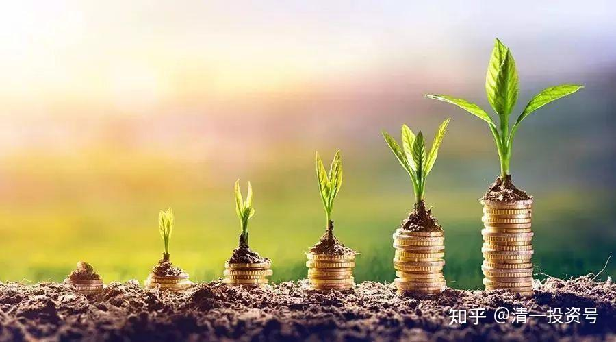

25篇.《人生十二讲》自由讲投资：（1）复利的魅力

清一山长 2007年9月30日（注：文中的“张老师”是指今日学堂校长张健柏先生，即大家尊称的“清一山长”）

**一、复利的魅力**

我们下一讲是关于男女婚姻爱情问题，这个男女问题也很重要，但是讲法比较独特，分为男生版和女生版。考虑到女士优先的问题，先讲女生版的，因为这个问题分开来讲好些。

有些问题很直接，甚至于有些会比较尖锐，有男生在场的时候，跟女生讲，不能太尖锐。比如说，我会教女生怎么样识破男人（众人哄笑），看透男人的很多鬼心眼什么的，男生在场会很难堪的。

要懂得真正的恋爱和婚姻，就一定要对异性有很深的理解。女孩子不了解男人，就会受男人的骗，就会稀里糊涂地做了新娘，然后稀里糊涂地吵架、离婚，多惨啊！有男生在场，讲这些问题，男生会很不自在，会觉得很难堪。

当然我也会告诉男生怎样识破女生的骗人招术，有些女孩对男孩子会用什么样的方式方法等，我还注意到，这对男孩子会很有用，这是实战版的（众人哄笑）！所以两周课程：一周男生，一周女生，后面想讨论就自己直接讨论。

关于男女婚姻爱情问题，有本很著名的书《M计划——哈佛MBA女性择偶策略》，这本书是美国商学院的教学课程，作者：雷切尔·格林沃德。

她把婚姻问题当作一个很严肃的商业问题，用MBA的案例教学法来进行分析和处理，最后使得自己有一个良好的结果。这本书在美国出版后，引起轰动，效果好像还蛮好。大家有兴趣可以看，特别对女生很重要。好啦！预告完了。

关于财务自由的问题，想推荐一本书，就是古古写的[《穷人缺什么》](http://link.zhihu.com/?target=https%3A//book.douban.com/subject/1440172/)，讨论财务问题的。

今天的课程，来的人比我想象的多，我以为大家留下一半就差不多了。因为从上次举手的人数看，没有举手的人也来了。所以按原定的计划：人少，我就想讲得自由些，让大家提出感兴趣的主题。

我相信我是一个很好的厨师，你随便点一个菜，我都会做出来。当老师的，有这个自信还不容易，你们可以考核一下。当然如果没有主题，我就随便讲呗。

有没有你们想要讲的主题？今天是额外的一讲。

（学生们讨论后，提议讲投资，讲武术，讲旅游......最后投票表决，讲投资。）

**二、二十多万买的车，价值一百八十万？**

既然讲投资，本人就给大家炫耀一下：本人有一辆160万到180万的车，就停在门口。大家感兴趣的可以去看一下，有问题可以回来问我，蓝色的就是我的车。（于是，有部分同学出去看车。）

没有出去的同学，你们可以做另外一个功课，我已经说了那辆车是本人买的，价值160～180万，你们估计他们看回来会说什么话？

学生：不值？

张老师：为什么啊？

（不一会，出去看了一圈车的学生回来，他们的表情都比较困惑。）

你们要猜一下结果，我为什么要搞这个插曲？既然讲投资，注意观察每个人回来的时候的表情，你们可以发现一些信息，有没有发现？

好了，他们辛苦了一趟，回来的时候带着一种比较奇怪的研究表情。另外我要说一句：我没有撒谎，我撒谎搞个噱头那是古怪。但是估计你们的眼睛也没有撒谎。

你们刚看了一圈，有疑问的开始发问吧！这是身边活生生的案例，这比哈佛的案例教学法还生动一些，你们看得到实物。去了那么多人，有问题吗？

学生：你说车值160万，我还以为是奔驰或者法拉利之类的车。

张老师：看到不是，你的感觉是什么呢？

学生：感觉要不就是那个牌子太不熟悉了，要不就是你骗人。

张老师：我已经说了，我的确花了160万～180万，这对我来说，不管别人怎么说。

学生：有点困惑。

张老师：还有没有人有疑问的？

学生：这辆车看上去确实比较普通，但是

张老师：如果让你买，你愿意出多少钱？

学生：我对车也不是很了解。

张老师：只觉得也就那么回事？

学生：差不多。

张老师：有疑问的举手，你说。

学生：作为一个讲师，你哪来那么多的MONEY来买车呢？

张老师：你第一节课没来，是吧？这是第一个问题。第二个问题，你一定没有到网上搜索过“张健柏”这三个字，搜索后它会告诉你，我买得起的。

学生：我没去啊！我觉得这个160万不只是买车的成本，而是有个投资损失成本在里面，加起来以后是这个价。

张老师：聪明！没错，是这样的。他猜到答案了，因为今天讲的是什么课？

学生：投资。

张老师：对啊！这就是投资。以我的个性来说，我不太会出这笔原始资金去买那么高级的车。

第一，**我是道家的**；第二，我**看上去还比较简朴**，是吧？大道从简，我**不喜欢那些炫耀的东西。**这个牌子也很平常，你们看了之后不会觉得开这车的人一定很有钱，这车绝对不是名牌。比如：奔驰、宝马，很酷、很炫。

因为学**道家的，一个性格特征**是什么呢？**很低调，不注重“名”的东西，不炫耀，不追求这个，很淡然，但是追求方便。**

这辆车的性能非常好，在这个档次的车里面，它的操控性能和综合性能都比较好，性价比很高。我追求性价比，我是商人，我肯定最追求性价比。那么，以我的性格，花160万去买车，是不合理的，看上去这车最多就值二三十万吧！怎么要那么多钱？

的确，这车我买的时候，车价加手续费、税收，全部差不多是20万左右，这是实话。更惨的是，买车一年多，已经贬值了，现在16万可以买到。不过16万能买这个级别的车绝对值得。它的性能跟本田的雅阁是一级的，但是价格比它们低，这叫静态价值。

**大多数人不懂投资的一个道理就是，他们只关注静态价值，不关注动态价值，看一个东西是死的，但是我看一个东西经常是活的。那么钱在我眼里面不是钱，它好像是一个生命一样，是活的，它会成长，同时它也会死亡。**

但是大多数人看钱，就是一个死东西，放在银行里有固定的利息，以为是算得出、看得见、摸得着的东西。在我看来，它是随时在涨，在落，随时可以变大，随时可以变小的东西。你有这种思维，你用这种思维去看待钱，钱就变成了什么呢？就变成了“资本”。

如果没有这种眼光去看钱，就像我父亲，我父亲绝对不是这种思维。他就是把钱拿来存起来，把生活费去掉，其它全部存，这么多年也攒了不少钱，但是很辛苦。

我回去跟我老爸说笑话，我说：“当年你一个月只给我五毛到一块钱。我买书还要省下一顿早餐，特别可怜，那时候你多给我一块、两块钱多好。现在一块钱、两块钱还是存在你的账户里面，没有改善你的生活价值，也没有得到更大的增值，太遗憾了，好划不来的一种方式，选择银行绝对是最笨的投资方式。”

我爸爸的回答就是：“我才不管你那么多的歪理！”

其实是真的。因为我说：“**你的钱可以帮助你改善自己的生活，以及我们家庭和家族的生活，可以起到真正实质性的作用。**”

因此，他的钱不是资本，他的钱是资金。“资金”跟“资本”是两回事，他的钱没有进入到一个循环体系，没有给它生命，它是个死东西。这个死东西尽管有一定的利息，但这利息实际上是负利息。

我们想象一下，在我小的时候，我父亲的工资是一个月52元。他是国家行政二十三级干部，现在说起来不起眼，但那时候一块钱、两块钱的价值跟现在是不是很不一样？事实上不一样到什么程度呢？那时候的大米是9分钱一斤，我们在那个时候曾经有个人买了一只野兔，那只野兔你们猜花了多少钱？花了5毛钱（0.5元），5毛钱就买了一只野兔。现在一只野兔50块都未必买得到，这就叫价值不同。

但是他把这些钱变成资金存到现在，1元钱存到现在，就算加上利息，了不起变成3元。其实还是变不了资本，就那一点点利息，变起来很难的。

那么现在的3元钱能干什么呢？现在的3元钱根本就不值什么钱，但那时1元钱很有价值。那时一元钱可以买什么呢？比如以我最喜欢的书为例，我小的时候喜欢买《十万个为什么》，《十万个为什么》的价格是四毛二（0.42元）到四毛八（0.48元）一本。对于我来说，他多给我一块钱，我可以多买两本书。而现在跟它差不多厚薄的书，大概要20块钱一本。

这种投资现在有很多人，包括我上次跟大家提到的我十年前的那个学生A，他很有这个头脑，他经常买书。他在大学时代，受到我的影响，大量地买书，走的时候也是一大堆书。这些书开始起作用，他越买书越花钱，他就越有钱。

他的一个同学B不太爱买书，他的同学就很没钱。现在只是攒了一万多块钱，还觉得是一笔大财富。而我这个学生A，有差不多上百万资产了，我觉得他还有更大的潜力。差距在哪里呢？差距就是书。

他就跟我说了对书的感觉，他说：“今后穷人一定会越来越穷，富人越来越富。”为什么呢？

他说：“**从买书就可以看得出来。买书是自我投资，投资自己的思维，投资自己的头脑，投资自己的眼界。那么这种投资，穷人都不去投资，因为书太贵了，穷人舍不得投资，他们的思维就会越来越不值钱，大脑就会越来越不值钱，最终结果他就越来越挣不到钱。因此贫富分化会越来越厉害，从买书这一点就可以看得出来。**”

他说：“这一点在西方好一些，西方都有公共图书馆，而且借书很方便。在中国要买书很难，像我随便逛一下书店，三五百块就没了。”

当然去逛书店，要一下子拿三五百块买一堆书回来，而且还是经常这样，对一般人来说是有点困难。只要我去逛，基本上就要花这么多钱。

我上大学时也很痛苦，我不太利用我们的图书馆。一个是很麻烦，一个是图书馆的书比较跟不上形势，最新的东西往往看不到。

图书馆最大的好处就是便宜。我可以告诉大家一个最简单、最便宜的读书方法，是到书店去“泡书”看。我原来当学生的时候也经常这样干，因为当学生时买不起书啊！

我们了解了这个观念以后，我们就发现“资金”永远是动态的。这个动态的资金，我在小的时候就已经体验过，就已经开始把它作“资本”使用。所以我们家族都在说笑话，说：张健柏这家伙，到底继承了他爷爷的传统。

我爷爷是一个皮货商人，他有十二个子女，我的父亲排行第九。我的父辈他们大多数人都请有奶妈，生活应该说都还不错。

他修的房子是前街通后街，中间有一个很大的庭院，是这样一种家族。但是他们后一辈中，做生意都没这个天赋，我的上一辈也没有，他们大多数人都是国家干部。我爷爷让他所有的小孩都读书，后面几个小一点的小孩都读了大学，前面一些的小孩，就是我的父辈他们，每个人（包括女的在内）全部读书。那时女的都不太受重视，一般不让读书的。所以全部都是国家干部，这就是我爷爷做的业绩。

他们说，是不是我爷爷的基因传到我身上来了？这东西我不清楚，但是在投资上的概念就是：

**我从来都不把钱当作钱本身，我不把钱当作一种消费品，我把钱当作一种再投资的工具**。

在我小学开始的读书生涯中，我的钱最大的用途就是用来买书。但是我弟弟妹妹不一样，他们得到了钱就买零食，所以现在他们都是美食家，他们都很会做吃的。我们家我是最笨的，最不会做吃的，也最不关心吃。他们都很关心吃，能吃出很多名堂来，也比较会享福。

另外我也是最瘦的，回家后我父母总是说：“你怎么还是这么瘦啊！”

我说：“不错了，我保持体形保持得不错了，我现在的体形跟我大学时的一样，多难得啊！”

我们兄妹投资的方向不一样，我投资到书上去了，所以就没办法了，投资书就瘦一些。

现在，我们回过头再来讲投资这个问题。我投的东西可能是增长，也可能是萎缩，但是价值的变动是什么原因呢？

我的投资在最近还不错，从我买车之后到现在，这个周期之内，我的投资收益比是8～9倍。大家知道我投资股市，最近做得比较成功。我管理多个账户，不是一个账户，平均收益就是这样。还有一个是我帮亲戚管理的账户，他是比较晚才拿给我的，还不到一年，投资收益比已经有7倍了。当时给我的钱很少，10万，现在是70万，还不到一年，比我买这辆车要晚一些。我们就算一下这个倍数，这就叫资本。

这个20万的资金，如果当初我不拿它去买车，而是把它放到我的账户上作为资本，而不是作为资金买消费品使用，那么结果会是什么呢？会不会是160万～180万这个结果？更惨的就是，如果我的计划没有错误，再过一年，你再问我：这辆车是花多少钱买的?我会告诉你是花三百多万买的。

上三百多万难不难？你们知道不难，我花了一年时间挣了这个倍数。如果再增一倍，你们知道是什么吗？我们不说多的，就再增一倍，再乘以八，就不得了啦！

当然这种可能性没有了，我已经在2004年就说过这个机会：未来有一个时间，这个时间是我这一生中最好的投资机会，暴富的机会。

当然，所有的中国人都会有这个机会。不过像我这样的人比较稀少，因为我是在股市最低迷的时候全仓介入。你们父母很多人也在炒股，但我估计他们都是在我进来后才开始介入的，或者刚开始介入一点，加仓是后来的事。但我在最早的时候，在它1000点左右就是满仓，所以报酬肯定是不一样的。这个倍率的收益，可能在中国我这辈子只有这么一次机会，我认为没有第二次了，所以明年我不可能再有8倍收益。但是明年我要求低一些，一倍好吧，一倍就是320万到640万，那这辆车就太贵了。再乘一倍，这辆车值600万，吓死人。这就是投资，当我们了解了这种投资之后，你有什么感觉呢？第一个感觉就是挣钱不难，是吧？（学生使劲摇头。）

你看，你要做千万富翁简不简单？比如你有十万，现在投资比是8到9倍，变成了80万到90万，我们算90万。再变到5倍，就有四百万，四百万再乘以二就差不多一千万了。所以只要这个历史重复两年就够了，10万就变成1000万了。这个原理在投资学上叫做**“复利的魅力”**。

10万的资本，如果你进行稳健的投入，在第一个轮回，把它增值一倍，它就变成了20万；第二个轮回再操作正确，它就变成40万。

在这个过程中，320万和10万之间，我们的理解是32倍的差距。但是用投资学上的概念来说，不存在32倍的差距，只存在5倍的差距。你**做五次的复利就可以达到32倍的收益，这就叫做复利的魅力。**

当然我们也可以看到，在投资学上的一个重大的、失败的案例。比如同样的，有一个人有10万，但是他投资一开始就失误了，然后就损失了50％。他就只做错了一次，后面我们假定全都是对的，我们来比较一下：

第一个人：**10 20 40 80 160 320 640 1280**

第二个人：**10** **5 10 20** **40** **80 160 ** **320**

第一个人，做5次复利，就达到32倍收益。

第二个人，做7次复利，才达到32倍收益。

再往下排下去是不是更吓人。我们有没有发现第二个人和第一个人越追越远，差距越来越大。那第二个人做了什么？他就只错了一次而已，错了一次就有这样大的差距，那错了两次呢？

因此，**投资学第一个原理就是永远要把资金看成是资本，它是动态的，不断在变化的。**这是第一个重要原则，你**必须死死的记住，而且你必须养成思维习惯。**

当你养成这种思维习惯后，你会突然发现你根本不会愿意把钱花到一些莫名奇妙的地方去。因此你不太可能看到我去买一辆奔驰，不是我买不起，而是因为我一算账就划不来。

比如我妻子就说：“你喜欢旅游，干脆就买一辆陆地巡洋舰。”她看我挺喜欢陆地巡洋舰。

我说：“不行，这实在是太贵了。”

她说：“不贵呀！也就70多万嘛！你又不是买不起。”

我说：“太贵了，我看它不是70多万，而是700多万。”

她说：“没那么贵吧！又不是日元。”

我说：“是啊！你把它放几年看看，放几年恐怕就是这个数字了。”

那么这个数字还不是最令人惊讶的，最令人惊讶的是另外一个人，有人说他是个骗子。他是不是骗子我不说，我认为他有一定的道理。

有人宣称他是“股神”，他在十几年前，1991、1992年开始投资股市。当时他是多少钱呢？8000元。他以8000元的资本进入股市进行投资，当然他当时就非常稳健，他一开始就学会了这套方式，很讲究，很稳健。我看了以后，他的一些理念我还是很佩服，我觉得他基本上没有太大的路数。他现在的资产号称是多少？20亿。完全合法。

他自己的说法就是，**投资，特别是作为金融投资，最大的价值就是：他随时可以从一个行业的盛衰转到另外一个行业的盛衰。**

投资跟实业有什么不一样呢？现在再讲一下投资跟实业的关系，顺便跟大家说一下这个人叫林园，大家有机会可以去网上查查他的资料。

他有一个观点跟我的观点惊人的相似，他自己的助手还是他的一个朋友，跟他在一起挣了一点钱，挣了钱就发烧，去年就要去买辆车，买宝马。

林园就告诉他说：“你买辆宝马干嘛？你又不是缺车。你已经有辆本田车，还非要买个宝马车干嘛？这些钱投到股市里面，天知道今后会变成多少？你不应该去买宝马车，而且现在不要去买车。”

那个人跟他说了一个理由，让林园无法拒绝，所以还是支持他去买宝马车了。他的理由是什么吗？

他说：“我跟你不一样啊！我还没结婚呢！总得买一辆漂亮一点的车......所以没办法了。”

那么这个时候，他的金钱就不是金钱了，他的金钱是一种工具——必须展示他男性魅力的工具。估计他长得不咋样，所以要买辆漂亮的车。

但是从这个意义上说，我们就发现林园的观点，他就把买车的钱看成是资本。他说你要去买一辆宝马车，那宝马车最多也就六七十万吧！可这几十万在他眼里，将来可能是几百万。他觉得拿几百万去买车简直是烧包，有一个普通车就行了。他自己的车就很普通，他的穿着和日常生活都很简单。

我知道的另外几个大“股神”也是这样简单，因为**他们永远都是这种思维模式，改不了这种思维模式。这种思维模式就是投资思维：永远将金钱看成是动态的**。**而那个人不把金钱看成是动态的，他只是觉得：我又不是买不起车，干嘛不买一辆。**

当然那个人现在应该会后悔。这件事情我是去年知道的，而去年到今年是中国资本市场高速发展，泡沫迅速生成的时间。在这段时间之内，他显然失去了一个很好的机会，而且可能是余生中都不会碰到的机会。

你们大家蛮惨的，等你们有钱的时候，你们将面临中国的崩盘。我不知道崩盘什么时候到来，但我认为不会到十年时间。你们十年后，正好是事业开始起步的时候，将有可能面临长长的因崩盘带来的萧条和各种各样的影响，有可能是一个你不愿面对的事实。

**做投资的人，永远要有一种随时做出预测的心态，对前途不会永远看好，也不会永远看坏，随时在对未来可能发生的事情做出预测。**

**参考链接：**

[27篇.《人生十二讲》自由讲投资：（2）金融投资和实业投资的差别](https://zhuanlan.zhihu.com/p/608151379)

[29篇.](https://zhuanlan.zhihu.com/p/610852390)[《人生十二讲》](https://zhuanlan.zhihu.com/p/608151379)[自由讲投资：（3）张氏投资法：看大势的“基础研究”加“心理分析”](https://zhuanlan.zhihu.com/p/610852390)

[30篇.](https://zhuanlan.zhihu.com/p/612686722)[《人生十二讲》](https://zhuanlan.zhihu.com/p/608151379)[自由讲投资：（4）自我投资和人生目标](https://zhuanlan.zhihu.com/p/612686722)

[32篇.《人生十二讲》自由讲投资：（5）学生自由提问](https://zhuanlan.zhihu.com/p/613765261)

[34篇.《人生十二讲》自由讲投资：（6）投资杂问（完结）](https://zhuanlan.zhihu.com/p/615302216)

