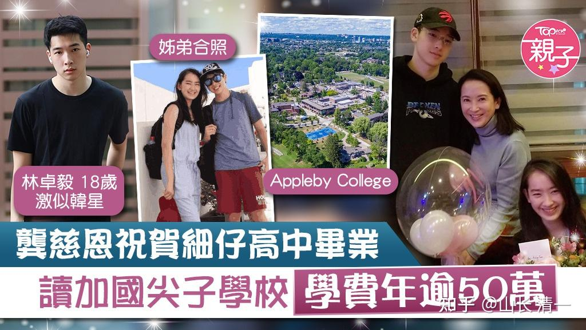
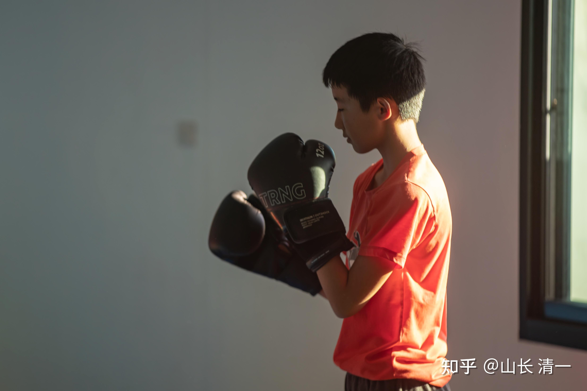
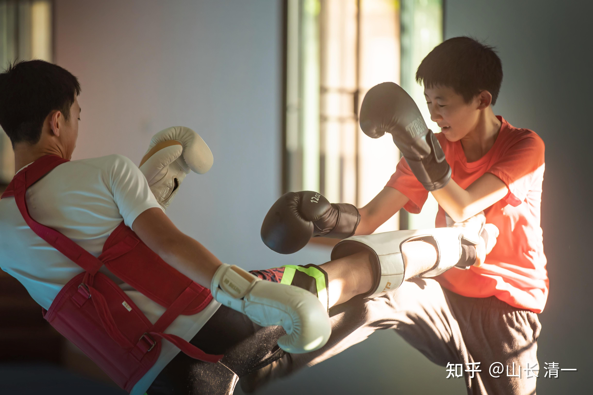
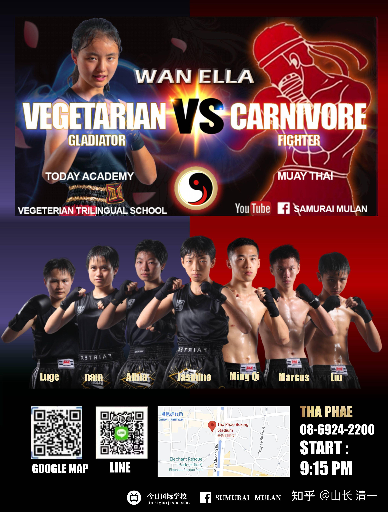

穷二代和富二代，需要的是完全不一样的教育。可惜现在很多人都学反了，结果对谁都没好处！

中国其实没有真正的富人家族，都是这几十年产生的暴发户。根本就不懂到底该怎样教育富二代，富三代。常常是乱教一气。因此，未来的挑战特别大，不少家族将来返贫，也不奇怪的。

我家孩子应该算是“富二代”了，按照2021的胡润财富榜，中国拥有600万净资产的家庭只有1%。我们家庭属于这1%里面的1%层次。普通家庭的教育目标非常的简单，就是要通过读书去谋求一个好工作，好职位！显然我们家孩子并不想去的打工仔。显然，让我们双百挑一的家庭，跟这些99%的普通家庭，去上一样的学校，去学一样的内容，是不是有点不太对劲？

怎样的教育？才符合这些高净值家庭的真正需要？而不是全国人民都学一套教材？考同一个试卷？这样公平是公平了，但就像是要求喝茅台的你丢掉茅台，必须去喝牛栏山，以求公平一样。你难道需要往一个极低的标准看齐，去限制住你的家族和孩子可能的发展空间吗？

不能指望我们这个刚从全世界难以想象的“均贫”中走出来的国家，有能力为我提供符合家庭需要的教育。更不能指望我能去西方国家，找到符合我家族需要的教育。就像中国人没法把西方的面包当正餐一样。因此，我只能自己创立符合我家庭需要的私人学校，为此我20年前退出商海，致力于办学。我的三个孩子，都在我为她们创办的学校中成长。两个大孩子早已经毕业，成为家长们口里“别人家的孩子”。最小的孩子，也快要上高中了。该学校也赢得了很多中国家庭的拥护，甚至有不少外籍华人，把孩子从西方国家转学来这里上学。

小女最近对我说的话就是：我太喜欢爸爸为她创立的这个班了（公主班）。这些伙伴都非常的好。她们都好棒，很优秀，很喜欢跟她们在一起学习生活！甚至于---小女最近还搬家了。离开了她自己上百平方的“私人闺房”，离开了泳池，花园，大别墅，搬去和伙伴们一起住集体宿舍。她妈妈还失落了一阵---女儿已经大了，已经开始起飞了。将来会越飞越远的。她还要去读四个国家的四个大学呢。

*小女所在的公主班晨会。另外还有7个公主在泰国人家“留学”未归。*

*公主们的舞会*

中国古代：努力改变贫穷命运的穷人，要学两样东西。现在中国的富人，要学古代穷人才学的东西。我弄不清哪里出了问题。

**一：古代的穷人要“学艺术”，“学表演”**：因为穷，必须出来卖艺，赚钱养活自己。歌舞，音乐，戏剧，相声，说唱，杂耍，套路武术表演等等，这些种种的“艺术”分类，都是古代称为的“跑江湖卖艺”的行业。同时有点尴尬的是：这些艺术，不少内容也是妓女的必修课，用来取悦客人的---因为男人来吃花酒，缺的不是性。而是“情调”，玩的是“艺术”。妓女们当然要多才多艺，才能吸引客人来。所以，娼妓和艺人都是差不多的等级，古代统称“娼优”，都属于社会底层的行业（下九流），当代所谓的“娱乐业”，其实很多从业人员都是穷人家孩子。富人家的孩子，当然玩玩这些艺术和艺人，附庸风雅。当当“票友”玩。但：绝对不当正式来做。就像“钓鱼”的人，并不是“渔业行业”一样！老板花8元一斤买来的鱼，放到鱼塘里面，让你钓起来，花20元一斤拿走。这就是有钱人寻个开心的地方，不是啥正业！本质上，这就是娱乐业的本质：消金地！

可是----现在中国的富裕家庭，家长却逼着孩子“学艺”，去天天练琴，练舞，画画等，各种才艺学习。让我叹为观止! 只是不知这些家庭，练这些玩意，到底对自己有啥好处？学好这些才艺，想卖给谁去？据说上艺校的女生，的确很多人在卖自己，甚至男生也在抢着卖小鲜肉。这个时代，笑贫不笑娼！

不过，古代学艺，虽然可以赚一些生活费，但由于社会地位极低，比工人农民都低，道德品质自然也很差。没有了真性情，所谓的“婊子无情，戏子无义”。老派的中国富人，是严禁子弟娶戏子回家的（更别说妓女了）。香港的李嘉诚，漂亮演员为李家公子生了三个孩子，却就是得不到“扶正”的身份。但李家算是柔情宽容的了，起码接纳了孩子。台湾首富王永庆的大儿子，违反家训，非要娶一个戏子。结果被王家除名！赶出家门，自生自灭了。香港霍家，可以娶优秀的运动员回家做老婆（郭晶晶），但戏子不能娶回家。可见：古人心中，戏子的地位有多低！戏子---本质上只是富人们的玩物罢了，虽然有机会跟富人接触，看起来光鲜，但毫无地位和尊严（看红楼梦里面养的戏班，真的毫无地位，连丫鬟们都会欺负她们）。因此，有志气的穷人，是断断不肯走这条路的，古人称为贱业。从事这些行业的人，自然就是“贱货”。几十年前，这还是一句骂人的非常恶毒的话。但现在---似乎没人记得了！

有志气的穷人，不想从事贱业，也不甘于贫穷，该怎办呢？他们会走第二条路：

**二：穷人要读书，考科举**。这才是古代的改命正途。穷人想要改变家庭的命运，考科举考试，做公务员，这才是古代的正途，才有可能受人尊重，光宗耀祖。虽然读书比较苦，但【十年寒窗无人问，一举成名天下知】。为了翻身，穷人只能拼了。不拼，一辈子的寒门。（其实我认为读书比学艺容易多了）

但已经是【朱门大户】的古代富人家，没有改变命运的愿望，只有保住财富和地位的要求。他们的孩子，要学什么？要接受什么样的教育？

**第一位的学习内容就是：应对。**对这些家庭来说，会读书只是最起码的要求。学会待人接物处事。才是最重要的功课。【红楼梦】中，贾府有一副对联是【世事洞明皆学问，人情练达即文章】。学会做人，这才是富人家最重要的本事。贾家的公子宝玉儿，就是不跟着父亲接待应酬客人朋友（学应对），也不读正经的文章（经史子集），专门去弄什么诗词歌赋，玩艺术情调的不肖之徒。他不学人情世故，还说这些东西“俗不可耐”，只喜欢跟女孩们在一起雅混（鬼混）。因此被官场的老爹认为儿子不成器，不是个正经东西，各种嫌弃。哪像现在富人家老爹都开明，看到儿子有“艺术情调”，会“生活”，会跟女生调情玩，有一群小女生围着转。老爹会很得意的吹嘘：我家小子真有本事！可见时代真的不同了。

当代富人孩子，不读书（很多太子---送去学校只是花大钱假装读书罢了），也不学应对。从小就被丫鬟仆妇宠着，只会吃喝玩乐--------古人一看，你们家，原来是在培养败家子呀？不过。富人自己觉得家底厚，败几世也败不光，如同余华【活著】里面的男主角。父亲当年荒唐，败掉了爷爷创建的三分之一的家产。没败完儿子接著败。这儿子，就是当代富人们培养的模式----很会吃喝玩乐，还会唱戏。唱的比专业的演员还好。当年破落了，就靠唱戏来维持生活----沦落成为戏子了。现在富人们让孩子学艺，最好也很专业，很职业，将来破落了，还有门吃饭的手艺。别学艺也只是瞎混个业余爱好（真学艺要混个名堂，出身，其实比读书难，成功概率低得多。就跟练武一样，练入门倒是不难，谁都行。要练到能打职业，要当冠军，就难了，比读书难多了）。

**古代富人家子弟，第二个要学习的重点内容，就是练武，所以有“穷文富武”的说法！**

富人练武，不是练穷人用来卖艺，撩人眼球玩的武术套路表演。而是要练真打实战的真武功。特别是要求弓马娴熟，这才是富人家子弟的第一要务。当然---兵法战阵策论战略，也是要学的---号称万人敌的本领。诸位看项羽，就是六国贵族家庭的后代，从小学武，力拔山气气盖世！当然也学兵法战阵，堂堂正正的打仗，这种本事，穷人哪里去学？学了也用不上。刘邦刚开始跟他打一直是输的。只是刘邦的心机，阴谋更厉害，脸皮更厚（混社会的痞子出身的人），他背后是得到了大富豪吕家的势力支持，跟豪族搞上关系，联姻，最终才赢了项羽。

康熙大帝，对皇子皇孙的教育，最重要的内容，不是读书（读书只是最基本的技能）。核心就是每年都要考核子弟们打猎的成绩。木兰秋狩，皇家围场，就是皇子皇孙包括贵族孩子们日常习武的考试场所。因此清朝的帝王亲王们，培养出来的素质是历朝历代最高的皇族。因为满清皇室，其实入关之前，就是关外的富豪家族。懂得怎样培养子弟！根本不是明朝朱元璋这种草莽之人，不懂教育皇子。只会宠孩子，还颁发文凭----只要朱家子孙长到10岁，朝廷就予以“将军”头衔，发给比县官还高几倍的工资。因此朱明王朝花大钱，养了一大堆“吃货将军”，甚至他家选出来的皇帝，也特别的变态，种种皇帝的怪事（木匠皇帝，摆摊皇帝都出在朱家）-----据说最后朱家的百万子孙，吃垮了明朝，覆灭之后，朱家子孙全被起义者们杀光了。朱元璋瞎宠孩子，养而不教，最终收获一个“断子绝孙”的后果。

现在的中国富人对后代的教育，我觉得很搞笑：根本就没有培养目标。读书也不愿意去好好读，玩声色犬马倒是是很支持，父母亲自带着满世界吃喝玩乐。因为现代科举---高考，的确卷的很厉害。富人们的孩子，养得又特别的娇贵，拼不赢衡水高中这种拼命三郎一样的穷人学生。不过富人们自有办法，花钱读个轻轻松松的国际学校装X就行了。至于读出来有啥用？培养啥素质？富人们不关心。只关心孩子开心就好，会吃，会玩，会外语，会出国，就好！现在的富人，我看就是一大堆的朱元璋再世。以为捧着孩子高高的，就自动当将军了。别人必须自动给面子。---在富人自己的小圈子里面，这种小皇帝，还是可以混的。想出来走江湖，就难免成为别人菜了。这些当代朱家子孙，就是诈骗集团最喜欢的群体！聪明一点，就只敢躲在家里横行。

至于练武更别说了---现在别说富人们的孩子娇生惯养。只要家里条件略微好一点的普通家庭。谁舍得让孩子去学体育，搞运动？更别说练武了。登封武校，大批学武的【中华武术传人】，都是读书读不进去，去“学艺”的，将来指望靠着卖武艺维生呢。对于孩子来说，没事捧着手机玩游戏，不比读书更轻松快乐？不比撸铁更爽？人性都是往下堕落比往上走更容易的。

所以：中国的穷人，富人，都不懂真正的教育目标。穷人为了一个饭碗去考科举无可厚非。富人们居然跟穷人的孩子一样去卷高考，拿打工证，我觉得脑子一定秀逗了。

**穷人要卷应试教育，要拿打工证，很有必要。没饭吃，要先想活下来的事情。**

**富人一定要卷素质教育，去提升孩子的思维和能力，以及社会档次，才能承担家庭财富带来的责任。这种富人的教育，要求难度比穷人更高。不仅仅教师的要求高，学生的学习难度也更大。比简单的读书，考试难多了！也正因为如此，这种教育，西方称为“精英教育”，真不是一般人能读的。普通的标准考试，读点傻傻的书，真不算什么本事！**

富人其实也知道应试教育的种种弊端，国内吵了很多年的素质教育，但谁也不知道素质教育是什么。反而一堆人。一堆教育专家，以为去学不考试的“琴棋书画”，艺术特长等就是素质教育。玩玩围棋，国际象棋，跳跳国标，就能实现家族传承。这实在是笑话！只有书呆子才会这样胡思乱想！

素质教育，更不是富人们认为：自己家已经有钱了，不需要孩子挣钱打工，因此去弄**所谓的“素质教育”，就是只要教孩子们学会生活，有情调，会吃喝玩乐就行了**！真有一个亿万富豪这样跟我说的：7年前，他非常自豪（自傲）地公开说，我们家的孩子，不需要学啥本事，不需要去打工。他们家的孩子，只要学会玩，学会生活就够了。于是，送去一家“国学名校”，学【琴棋书画，茶艺花道】，还学费不菲的私立学堂。我当时说这不是学校， 是【少年养老院】。让这家长特别的生气，觉得侮辱了他的智商。现在---这人应该已经破产了。残酷的疫情，摧毁了他家依赖的高消费生意。据说现在已经失联了，债主上门找不到人了。孩子应该超过20岁了，跟木兰佳慧还做过短期的同学。当年退学去更高级的学校，学的本事，能让她的家族再度复兴不？

**素质教育，其实比读书，考试更卷，更难，更艰辛，对学生的要求更高。要吃更多的苦。不然----怎么才能打熬出高品质？“提升素质”？难道你们真以为----舒舒服服的吃吃喝喝玩玩，上几节“有品味的特别茶艺课程，红酒鉴赏课程，游艇课程，练练高尔夫球”，你就提升了人生的素质档次？**

**你不脱几层的皮，不流血，也不流汗。只是花大钱去听了几节高端课程，你就“成为上层精英”了？这样子当精英，也太容易了吧？戏精吗？**

素质教育是什么？古代孟子早就说了----**【故天將降大任於是人也，必先苦其心志，勞其筋骨，餓其體膚，空乏其身，行拂亂其所為，所以動心忍性，增益其所不能】。**

简单地解释，就是用“动心忍性”的方式，从人的精神层面下手，去磨炼，改造和教育提升人的精神品质，**达到“增益其所不能”的目标---改变自己精神上的弱点。这才是真正的素质教育。 也是富人家族最需要的教育。**

穷人的目标很简单，只是生存而已。因此，穷人需要应试教育，打工教育。

而富人的目标，是要活得更有品质，更有档次。要得到社会尊重。所以，需要的教育，就是要改变家族下一代的个性和心理弱点，提升全面精神素质的【素质教育】。而不是学点知识去当打工仔。只有这样子的教育，才能真正提升自己的家族能量和社会影响力。

如果教育无法提升人生的层级，改变原有的命运，其实这种教育肯定就是假教育！

古代认为读书能够改变命运：因此穷人要去读书，考科举，谋取一个非农职业，成为人上人。对于穷人来说，这是一条很好的谋生出路。就像现在的高考一样-----拿到一个文凭，拿到工业社会的就业许可证，是我国的穷人最大，最可靠的途径。

但富人，显然就有更多的追求。富人要求的，绝对不是去“拿个打工证”的问题，因为富人知道打工是没有出路的。小康之家的孩子，如果想要更上一层楼，是需要“创业”的。**而创业所需要的素质，绝对不是考几门考试就能学到的**，成绩再好，也不能保证你创业成功。而全世界的应试教育，都不可能教你创业的本领，全靠自学成才。

**更富裕的家庭，他们更关心的，也是更重要的层次：如何保住家族的财富。守业更比创业难。**这样说大家都不相信：创业，赚钱，难道不是最难的吗？因为你是穷人，你当然觉得赚钱难了。但富人们最忧心的问题，却是“如何守住到手的财富”。你以为是“有钱存银行就行”了吗？穷人才会这样想！**存银行，本质上就是让银行抢你的钱。**

富裕家庭的创业者就知道----创业当然不容易。要抓住各种机遇，避免各种陷阱，经过各种努力，加上一些运气，就可以获得成功！过去几十年，很多人都赚取了亿万财富。但未来几十年， 将是这些财富家庭纷纷破产的故事。财富注定会重新分配。因为：白手起家，去积累和**赚取亿万财富，需要穷一代们几十年的不懈努力。但要败掉亿万财富，短短几天就可以实现！**---保住财富，真的比创立财富更困难。

**靠读书来学会守业，创业？是不可能实现的途径。体制学校， 根本就不是为了富人创立的学校。是为工业化社会批量培养打工仔的学校。**

可以靠读书考试去获取工作的机会！但要成为富人，成为上层人，不管是想要创业，创富，还是守业，守富，都不能去随大流读应试教育。而要经过非常特别的教育才能做到。有少数人可以自学成才，往往富一代们都是自学成才的。但他们就是不会教孩子。因此富二代们，往往不小心就成为【败家一代】。

古代由于财富积累的时间很长，往往一个家族几百年，也知道有样学样。富人们从来没有全部被杀死。所以，古人是知道该怎样做的：**就是-----穷文富武！穷人通过读书改变命运。富人通过练武守住成果！**

西方人也一样：有个电影，叫做【爱情故事】。耶鲁大学的穷学生和富二代的爱情故事。富二代家族最看重的不是学业，而是能否当上运动队的队长，以及能否代表学校拿到冠军奖杯！这个家族的客厅，摆放的是历代父辈们获取的冠军奖杯！这是家族最自豪的事情。不像穷人，当代的傻富人，最自豪的炫耀是一份花大钱弄来的文凭。

*秀文凭和毕业证？你学到了什么才是关键*

【记得成龙有一张与妻子儿子合照的照片，手中捧着一张毕业文凭。这是他儿子出事后，网上传出来的，大概有点像上面的场景吧。一家人超级幸福的样子。我没有找到这张照片。当时感概：这么有钱依然愚蠢。不知道拿钱买素质，居然拿钱买无用的文凭。】

【飘】是描写工业化之前的传统西方社会生活，算是西方古人生活模式吧？他们的农场主富二代们，根本不关心读书，只关心社交和战争。虽然可能有点蠢，但绝不文弱，胆气过人，行动力很强。这些后代的生存能力很强，社会适应能力也很强。比如女主角郝思嘉，虽然因为不爱读书，经常闹笑话，连欧洲的“沙龙”是啥都不知道，以为是特别的“沙发”。显然很无知，但她就特别善于适应社会，善于获取竞争优势。在几乎破产的情况下，抓住机会成为富婆。相反----艾希礼就是读书人的形象代表，虽然很有修养，但骨子里面文弱，而且无能，当个太平绅士没问题。但很难适应变化了的社会，如果没有两个爱他的女人帮助，他根本就活不下去。

因此----什么素质更重要的？为啥只会读书，不但学不成成功的素质，反而成为创业的拖累？这就是“百无一用是书生”的古训含义了。书生，给人打打工，说说嘴，还可以。想要创业，守业，真不行的！秀才造反，三年不成。其实古人嘲笑读书人的语言很多。现在社会上，死读书的书呆子，闹的笑话还少吗？

**富人家庭的孩子练武，绝对不是为了“吃武术饭”**，这是少林武校穷孩子的梦想。现代社会，富人的孩子参加运动，武术，比赛，甚至不是为了“安全，自保。护身”。核心目标，是去通过这些竞赛的项目，培养通过读书，上学，考试，所无法获取的最重要的素质。即使是现代大学也不例外。所谓的常春藤盟校，其实就是当年这几所大学，互相会用运动和比赛来进行校际联系的8所传统精英大学。现在，则成为了美国最顶尖大学的象征。

西点军校，成为培养出最多商界总裁的大学，比耶鲁哈佛的更多，其实并不意外！因为军校，肯定更强调“素质教育”，而不是知识教育的。更不是科举教育。

小女现在正在积极练武，今年就要上场打泰了。各位恐怕不会认为我们家，就缺这点出场费用。要小女冒着流血伤害，被KO的危险，去泰拳赛场上去，挣比赛的出场费吧？

*小武士马上要进行对打比赛*

*对练，扫腿互攻*

*首届清一小武士的集体照*

在清迈的公主班孩子，现在全员练武：您会认为她们将来是要去当拳手谋生的吗？

这些SAT成绩，15岁就达到1400分以上的学霸们，并不打算用高中的三年时间，去继续提升学习成绩，去达到1520以上的高分（这个分数是常春藤名校的录取门坎）。也不想提前去学【大学预科课程AP】，去争取进入世界顶尖名校录取的更好机会。而是要把时间用来练武，做事，跳舞，探险等等，看起来根本就和考试无关。**但绝对和素质教育有关！**

以下就做一些解析，说明文武合一的教育有啥优势！

**一：如果只有文，没有武**，孩子就算拥有文凭，也会缺乏很多非常重要的人生素质。变成孔乙己这样的人，一点也不奇怪！酸臭的文人，就是指这种人。

**二：如果只有武，没有文**。这样在过去的时代（古代），可能是没有问题的。当个将军也没啥不可以。但：现在世界不同了，没有文化的人，不可能获得社会尊重和地位的。就像登封武校的大批学生，出路就是当保安，永远在社会底层混。甚至想要靠武术混饭吃的价值都没有。因为现在没有这个市场买武术，即使“廉价出售”。

**三：文武双全，才是这个时代最有价值的教育-**----文能考上世界一流大学（世界顶尖的100所大学）。武能上擂台决战泰拳，至少打过50场实战比赛。这种教育训练出来的人，绝对不是普通人。她们的一生，绝对不会和只会读书的学霸一样！将来成为精英人才的可能性很大！

**子曰：“质胜文则野，文胜质则史。文质彬彬，然后君子”。指的就是这种人才！文武双全的君子！**

卓越人才，领导者素质，成功者素质，靠读书是无法培养出来的。只能靠练武，以及各种体育竞技。谷爱凌的竞技项目，也能训练出与武术比赛一样的素质。只是：她的玩法不是一般人能玩的。除了钱，还需要额外的东西。难度比练武高多了！

我给小女安排的就是【素质教育之路】----文武合一！原因解析如下

**人生成功素质一：获得勇气，克服懦弱：敢于面对各种人生的强大压力和面对风险的担当精神！**

谁可以靠在教室里面读书，考试，背诵课文，就获得这种心理素质？你把“诚朴勇毅”放到校训中，你的学生就能自动拥有这种素质？就像是【灰姑娘】的电影中，妈妈教导她“要勇敢，善良”，她就能做到这两条，从此拥有这种宝贵的人生素质？

**你家孩子如果是这种一教就会的天才，就算我白说了！这些宝贵的素质，如果真能一句话就拥有，教育就太简单了。**

练过武术的人都知道：面对袭来的拳头，新手全是闭眼的。普通人的自然想法，就是想要逃避。更多人会吓得呆住，完全失去反应能力！只有经过长期的训练，才能学会强行睁眼，勇敢迎接袭来的拳头，并做出正确的应对。因此---教练教你面对拳头不要闭眼睛。但你就是要花很长时间去练习，去挨打，才能掌握这一“基本功”

格斗界都知道：即使经过长期的训练和模拟实战，依然有很多人不能上场打真实的比赛。平时跟队友对练是一回事。去搏斗场上真打实战，又是另一回事。心理层面上的要求完全不一样。很多拳手，练拳多年都不敢上场打实战。有不少拳手，会在首次上场实战后，永远退出格斗场---因为他们缺乏勇气这种素质！心理上过于懦弱。只有目标明确，严格要求自己的拳手，才可以获得人生宝贵的勇气素质！胆气，勇敢，是不断地武术训练得来的，不断面对和克服自己的懦弱而最终得到的，不是读书考试就能得到的！

**人生成功素质二：拥有毅力，抛弃浮躁！GRIT 毅力是对长久目标的热情和顽强的坚持，毅力是你对未来的坚持，日复一日！大多数人，一生失败和平庸的核心原因，就是缺乏毅力。**

这个TED演讲：一个当过教师的美国心理学专业人员，对学生成功因素的研究，最终她发现：成功的关键不是智商，而是毅力。可惜她认为---智商固然无法通过“教育”去获得，但如何去培养学生的毅力，她也毫无头绪。传统学校，只能碰运气得到这种学生，不能去培养这种学生！

[成功的关键不是智商，而是毅力](http://link.zhihu.com/?target=https%3A//www.bilibili.com/video/BV1eY4y1c7qg/%3Fspm_id_from%3D333.788.recommend_more_video.3)

的确：要通过工业化标准系统的学校，用“上课，考试”去获得“毅力”这种品质，绝对是毫无头绪的。就跟你在陆地上要抓到鱼一样没有头绪。

但：通过长期的体育训练来获取毅力，特别是武术格斗训练，来让学生获取毅力，就是完全可行的方式。格斗训练的时候，每天要重复上千次的拳击，腿击的动作。以及每天要在实战中不断被击倒，又不断的重新站起来，无数次的坚持，无数的汗水，甚至血水，泪水的浇灌，年复一年地，不断的面对挑战，艰难，你就丢掉了浮躁，获得了难得的“毅力”----这种最宝贵的品质。

**人生成功素质三：拥有决断力，克服优柔寡断。**

** 书生最大的毛病，就是优柔寡断，缺乏决断力，缺乏行动力。因此----这种人，知识再丰富，能力再强，也只能当助手，当军师。当不了主帅，做不了大领导！书生缺乏担当。自然---书生也失去了建功立业的很多机会！**

这个事实证明：仅仅靠读书，是无法获取这种素质的。

实战武术，就可以改掉人的这个毛病。我当年17岁上大学的时候，虽然是“天之骄子”，全国重点大学的最牛专业。但我就特别讨厌身上自己的“书生气质”，认为一介书生，百无一用。当学霸并不能让我对自己满意。因此，我从大一开始就练武术，目标不是去学神功，当武侠。而是改掉自己身上的毛病。

现在看来，这种选择是很有价值的。如果我当年没有练武，今天某985大学里面，可能会多一个白白胖胖的教授。但中国就少了一个敢于挑战泰拳，甚至挑战世界武林的文人！

如果我没有练武，我也不敢去下海，闯江湖，成为今天的“富一代，创一代”。也不敢去挑战美国，尝试“三年学完美国K12”的新教育记录。可能只敢跟随在权威的背后，不敢越雷池半步。

这种孟子推崇的“虽千万人吾往矣”的胆气，担当，决断力。难道你们认为真的只是傻读书，傻考试，就会获得吗？

**人生成功素质四：拥有换位思维，抛弃一厢情愿！**

我相信：各位身边都能看到大量的读书人，学霸，满脑子只有自己的想法，完全忽略和无法理解他人。更糟糕的是：似乎读书越多的人，越是不能理解他人，严重地活在自己的世界里面。越是名校，越是读了研究生，博士就更是这样了，不会与人正常的互动，甚至连谈恋爱都不会了，所以有“傻博士”的说法！家长不陪同，都不会相亲。

这种人，难道能够在社会上获得成功吗？您能指望这样的人，能够成为家族的形象代言人吗？他能担得起家族的责任和未来吗？

练武术实战的人，往往特别具有观察力。也善于理解他人。因为：格斗对抗，并不是套路表演。必须随时掌握对手的心理，行为，甚至要不断猜测对方的想法，意图。并随时根据对手的变化而变化。对于人的语言和非语言的表达，都很留心。不然---只知道按照机器人设置的程序去对打，一定败的很惨。学武术格斗，就是必须逼自己改掉自以为是，无法理解他人的书呆子脾气。

除了这些素质，其实练武还可以带来很多的副产品：如

**1：身体的灵活和健康。**我60岁了，还可以和年轻人打成一团，甚至跟他们打车轮战。速度力量一点不输给年轻人。相比身边60老人的生存状态，可以说生命质量更高！

**2：自信心！**如果拳手击败了金腰带，显然他知道自己的战斗力，已经是百里，千里，万里挑一的拳手。面对普通人，他不会更自信吗？这种人会有一颗需要你处处小心，特别呵护的“玻璃心”吗?

**3：沉着冷静：**要做到孟子说的“泰山崩于前而形不改”，背书考试能实现吗？**但一个上过战场的人能实现，**打过几十场，上百场实战的拳手，面对每一场都可能会被KO重击的人，在不利局面下依然勉力支撑，尽量不暴露缺点的人，其心理素质稳定性，一定异于常人，也才能够实现淡然面对危险和压力的要求。泰拳手们头部吃了一记重击差点KO，却露出笑容比划“再来一下”的泰式微笑，不正是强者不屈的标记吗？

不过：提醒一下大家

**学武固然有这么多的好处，但在中国学武，缺乏真正的环境。个人认为不是特别的理想，未必能够得到你想要的提升素质作用，可能还相反。**

因为1：这个圈子的执业人士，往往都是底层出身。身上有很多底层意识。万一不小心，被传导了底层意识，可能并不划算。特别是小孩子缺乏辨别意识，很容易被江湖人糊弄，主子奴仆思维非常的严重。真不如泰国的拳馆更有职业意识。泰国的教练更懂得自尊尊人。想要获取练武的好处，不如来泰国的武馆练拳。（不是非要练太极格斗才行。练武都可以获得上面的素质，太极----号称哲拳，可以学到的东西更多，但需要的悟性也更强。关键是---现在实战太极只有我一家，但我并不对外招生。所以不如直接学泰拳算了）。

2：国内的格斗赛事非常的不完善，难以通过实战格斗来获取需要的训练，这一点很难改。而不上场实战对抗的话-----其实练武与跑步训练也差不多。