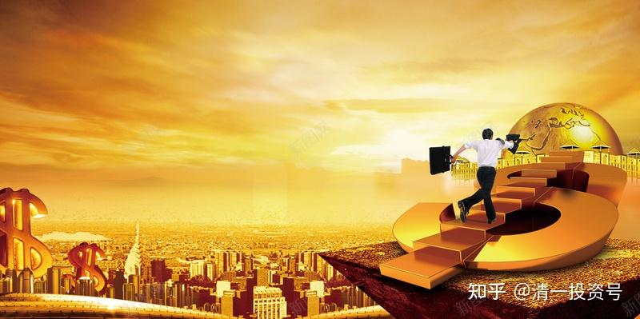

27篇.《人生十二讲》自由讲投资：（2）金融投资和实业投资的差别

清一山长 2007年9月30日

**一：金融投资和实业投资的差别**

我们现在来讲金融投资和实业投资的差别。我们发现这个金融市场会带来意外的收获，但**在中国，往往会把投资看作是一种投机或者是一种纯粹的赌博，其实不是的**。

**中国一向强调“实业治国”，其实我很支持实业，起码我投资的全都是实业。另外是投资金融业务，它们有什么区别呢？**

实业行业都有一个周期，比如现在猪肉价格为什么会涨？你们谁能告诉我猪肉为什么涨的理由？**要搞投资，脑袋一定要活，不能等别人给你答案，投资永远是自己找答案。**

学生：我觉得主要的原因是供给与需求的差，第二个原因可能是中国CPI逐年在上升。所以本身国际上各种原料的成本价都在上升，导致养猪成本也在上升。

张老师：养猪成本也不至于一年当中涨了100％左右啊！

学生：第三个，我觉得比较重要的原因，可能还是一些投机的行为在里面，因为毕竟猪肉现在是一种很好的持有物，很多大的肉场和肉商都在大量囤积猪肉。一方面哄抬，另一方面......反正各种各样的因素都导致了他们大量囤积。当然我觉得这个还不是最根本的，最根本的原因还是在于，中国经济的快速增长，导致现在出现的通货膨胀。

张老师：那为什么别的就没有涨那么高呢？你看这个理由就有问题了。如果是这样，那别的东西没有涨100％，而猪肉却涨那么凶？鸡肉也涨了一点，但你们有没有发现鸡肉涨得很少，为什么？

学生：因为猪肉它的生长期比较长，而鸡它生长得快，但猪不是这样。

张老师：好了，我们可以看出他已经开始在寻找答案了。我现在告诉大家，猪肉价钱很不合理的根本原因就在于猪的价格太便宜了，当然不是现在。在一两年以前，猪肉的价格便宜到什么程度？便宜到谁养猪，谁就赔本，收购的价格两三块钱一斤。

这种情况怎么办？养猪的人、饲养场觉得不行啊！养了这么多，连饲料费都挣不回来，所以在这种情况之下只能不养，因此生猪的出栏数下降。另外还有一个重要的“黄金物资”就被砍缺了，是什么呢？母猪！

母猪是负责生小猪崽的，生下来的小猪崽赚不回来钱，怎么办呢？干脆把母猪也杀了。所以在一两年前，我们国家是在大量地宰杀母猪，他们怕生猪崽啊！生下来好麻烦——生下来没法养。所以就导致了猪肉价格低迷，加上养猪不赚钱，而且赔钱赔得还很厉害，所以就大量宰杀。因此生猪总量是在下降的，正好在去年的年底碰到一个拐点。

这个拐点是什么呢？慢慢下降到突然有一天发现，银子不太够了，肉价贵了。怎么办？加点钱，我还是想吃，加一点钱，也不够。怎么办？再加一点钱，越加越高，就形成了今天这个局面。那么今天这个局面的拐点，母猪能不能创造出来呢？不能，它是慢慢生小猪的，是不是？这个周期很长。

鸡就不一样了，鸡下蛋，下得很快，而且鸡养出来也很快，大家吃的鸡，养二十几天就够了。你们没研究过吗？你们吃的又鲜、又嫩、又滑的鸡，就是二十多天养出来的，因为现在是工业化制造。不过这种东西，我和我的弟子们是不吃的。理由我不说，说了之后，又要说我攻击这个产业，说不定什么时候还找我的不是，给我惹麻烦。你们自己研究去。

鸡可以很快上市，所以鸡肉就没怎么涨。同样是肉，所以你刚刚讲的那个理由是CPI，看起来很宏观，不需要那么宏观的，就看很简单的周期。这就叫一个周期，实业是有周期的。

我们也可以同样对这个周期得出下面的结果，未来两年之后的某个时间，相对于其它肉品，猪肉的价格会大幅下降，而且又会降到一个临界点，甚至会降到你又赚不到钱了。如果通货膨胀之后就不算了。

为什么呢？现在发现养猪会赚大钱了，比养鸡划算多了。那么高的价钱，到处抢购。前几年才卖两三块钱一斤、三四块钱一斤，现在居然卖十五块，甚至更高，一些大城市甚至卖到二十块钱。现在净利润是不是超高了？小猪崽的价格是不是超高？小猪崽的价格超高，母猪也就值钱了，就拼命地让母猪生生生，我们每个人都想在周期旺点的时候尽量地赚钱。所以这个谷底一定是一个波谷，波谷已经开始有拐点了，因为猪肉价格已经开始平稳着陆了，在慢慢地拐，这个拐点重新要升起来，升到一个高点的时候就赚不到钱，价格变低，景气度又开始下降。

这种规律存在于大多数的实业行业当中，特别在自由竞争的市场上。这种竞争是不断地存在的，只要你没有垄断资源，比如石油就是垄断资源，石油这些东西不是大家都可以做的，养猪谁不能养？大家都能做的事情，一定是根据竞争的周期有这样一个波动，而且波动越小，周期越小。像鸡二十几天就能养出来，所以它的周期特别小，很容易重新再平衡，因此鸡的周期永远只能拿一个平均后的利润率。这里面就提到了一个你能获取超高利润的机会，超高利润的机会是什么呢？

**一些投资家，很聪明的人就能找到这个拐点，并在拐点的时候进行投资，比如在他发现猪肉价格已经见底了，已经开始亏本了，这个时候一些聪明的投资家，就会让你开始去做实业，开始该干什么呢？**就把钱拿过去买母猪，不要去养猪。养猪很笨的，因为太辛苦，而且周期很长。母猪生小猪，小猪崽的价格成倍地往上翻，这种资金利润率回报就最高了。但是必须在拐点处囤积一批母猪，在拐点往上涨时布局。

这种方式是真正的投资家，有眼光的人都要做的事情，做实业都要投资，不是玩玩，不是傻傻地在那里养猪就够了。什么时候增，什么时候减，甚至什么时候空仓，都得有一个布局。

（1）广船国际举例

我们再说金融投资，金融投资与实业的差别。我们尽管可以去投资实业，实业投资也是其中一种投资，但不如投资金融业划算，怎么划算呢？

金融业投资，假定我看得出这个周期，而且我知道这个周期的拐点，对此我进行过很好的研究。虽然做投资很辛苦的，天天都要研究各种各样的报告，研究国际大事......最后我研究到这个拐点之后，可以干什么事情呢？我可以在一个养猪场快倒闭的时候，特别艰难的时候，根本赚不到钱，账面利润还是负数的时候，我就可以买入它的股，投入它的股份，将来突然碰到景气期，像这几年就会大赚，赚得一塌糊涂，它的股价会爆增。

这里面我觉得可以推荐一个股给大家，不过大家不要去买，我只告诉你这个股叫广船国际。这个股在两三年前在国际海运处于这种周期的低谷时，没人愿造船，而它是负责造船的，而且造船成本也很低。正好两三年前钢价上涨，它的进价高，就是成本原材料价格高，它造船的价格又提不上去，特别难受。因此这个时候它就没怎么赚钱，赚的钱很少，一股只赚几分钱，特别难受，它的股价跌到三块钱一股，最低时两块七毛多。

在去年年底以后，开始出现了海运复苏，国际海运市场的繁荣，以及由于中国竞争力增强，全世界的海运变得非常繁荣。繁荣到什么程度呢？繁荣到海运指数涨了几倍，也就是现在运价翻了倍，都在往上涨。那么多东西，没船运怎么办呢？就租船，买船，拼命地造船，造船的价格就越来越高，它手边的订单已经订到了两三年之后了，这就叫进入了一个高峰期。

在这个高峰期之内，如果你聪明一点，在一个低谷买进，高峰期之后，你能赚多少钱呢？现在它的价格是八十多元。很简单，你所需要做的事情，就是要能判断行业的高峰和低谷，并且要果断地在低谷的时候介入。现在你们在报纸上看到大量地推荐它的股份，当然它还是可以买，我个人认为它还有冲向一百元以上的空间，应该没问题的。

不过我没买，我退出了。因为我喜欢在最热闹的时候退出，我比较甘于寂寞。因为现在越来越热闹，各方面指数都越来越高。但是我可以忍一点，我可以发现一些更好的机会。我正在找另外一些还在低谷的东西，我喜欢找这样一些东西。所以我知道广船国际没到顶点，大概在这个位置，但后面的利润给别人吧！

那么你现在告诉我，你去做实业，包括你去养猪崽也好，包括你去投资做一个船厂，你有没有可能在两三年之内得到这么高的资产回报率？没可能。因此，只要你能真正证明你是个聪明人，你不要在最高点的时候买它。比如到了一百块，在这个高峰时期里买它，那你就惨了。而这个周期别人都看得到，都看得见的东西一定意味着是会带来损失的。现在别人都看到猪肉赚钱，假定让你去创业，你说咱也养猪，一算饲料是多少，一算现在我可以赚到这么高的利润，赶快去做，等你做出来的时候就不是这个价钱了。这就是不一样的地方。

（2）实业投资风险

**一般人的脑子只看现在，但投资者的脑子看未来**，现在不好的事，他可能说好啊好啊！好是看未来好；现在好，可能就是不好，因为它未来不好。就像原来股票跌价，也是从几十块慢慢跌下来的，跌得很惨。

所以我们会发现，实业投资跟金融投资有一个最大的差别，叫做什么呢？它有一个财务杠杆，而且这个杠杆的比例会被放得很大。实业投资永远达不到这个比例，这是它第一个优势。

金融投资跟实业投资相比，还有另外一个优势，就是金融投资的灵活性是谁都无法比的。

比如说我们现在做养猪厂，现在是顶峰期，我现在养了几千头猪，大股东投了很多钱。但是我觉得到了拐点，将来可能又会搞得不赚钱。我说：我不做了，我想把资产卖掉，好不好卖？

第一、没人接手，别人又不熟悉这一套，很多人还不知道怎么弄它，这个时候你要把它卖出去很难。特别是你的规模越大，退出来就越难。规模小一点没关系，我养个三五头猪，我卖掉就完了。如果规模大，有几千头猪，你看着它往下走，你还不得不撑起。

第二、特别是你身边再有一个团队，一些你的伙伴亲戚，七大姑八大姨的，他们都指望这个工厂赚钱。当初你忽悠他们进来，说有前途，大家都拿钱进来做。这个时候你说你想走，他们还想赚钱，你怎么走呢？你想想也不行啊！光你一个人不行，大家不会跟你一致的，风险也很大。而且你要对得起你的员工、对得起你的团队、对得起你的投资人。所以只有一起撑着，看着一天天往下跌，不得不撑着，就算你有眼光也没办法。

但金融投资不一样，当你发现了行业拐点的时候，比如当你发现它差不多了的时候，说要走，一天之内就可以跑掉。这个实业，你花半年时间都不一定能有人接手，这叫差距。因此，金融投资有灵活性。而在一个实业行业周期的顶点时，你退不出来，只好在这里面死守，那么这辈子都是养猪的，虽然是养猪大王。

美国就有这样的地方，但是你就不得不在周期中颠上颠下，忍受着。当然你可以说：自己做了一项事业很自豪。但如果你是金融投资者，你就可以在周期到顶峰的时候逃走，下一个周期到达顶峰的时候，再找一个别的公司投资，等它到达顶峰，再去找一个别的东西投资。在这个过程当中，你的积累效应会非常的快。

因此实业投资是线性的，是缓慢上升的，而金融投资是跳跃的，快速增长的。一个叫做线性增长，一个叫做指数级增长，这个概念就是投资的指数型增长。

**二：投资人的品质——生活方式简单、去泡沫化**

现在大家已经理解了投资的几个基本概念，第一个就是，**投资需要把资本和资金两个概念截然分开**。**在你的眼里，别说是一万块钱了，一分钱你都要看得很重。真正投资投得好的人，对钱的概念是非常不一样的，真的是连一分钱都很珍惜的，是不愿意浪费的人。这个特点必须变成投资者个性的一部分，生活习惯的一部分。**

**喜欢奢华、喜欢品牌就是喜欢泡沫，品牌就是泡沫。**我这个牌子如果把它换一个耐克的标志，可能价值就会涨几倍。但是**对投资者来说，他要看它舒不舒服，适不适合他需要。投资者不会买最烂的东西，同样的价格，会买品质比较好的东西，不愿意为溢价付出，偶尔会有例外。这些习惯，已经成了生活习惯的一部分。**

**另外他也会把复杂的、表面的、浮华的东西去掉。在生活中，你会看到他简朴、单调，甚至有点沉闷，而且他不喜欢喧闹的地方，这就是一种思维习惯的养成过程。**要做投资者必须这么做，没办法的。

**而喜欢喧闹、浮华的那种人，不可能会赚钱，但可能会赔钱，赔钱的可能性很大。因为那种人特别喜欢在这个时候去买东西。你们自己看一下周围的人，包括现在很多已经赚了钱的人。**我敢肯定这些人将来会赔大钱的，时间是今年五月份之后，五月、七月都有几次大振荡，这些大振荡让很多人都会血本无归，甚至还有人死掉。

**三：金融投资失败案例分析**

据说还有最悲惨的例子，是说有一个人，研究生毕业，他娶了一个如花似玉的老婆，两个人感情特别好，但是买了房子，贷了款，看到别人股市上挣了点钱，就眼红，然后把房子拿去抵押，借了一笔钱投入股市。开始赚了一点钱，2007年5月30日大跌，跌得很惨，很多股票跌了50%。这一下，他的资产和房子都没了，最后男研究生一下想不开，就在家里自杀了。

他老婆下班回来，看到老公自杀了，感情那么好，怎么办呢？陪着他也自杀了，一下三条命都没了。哦，忘了她肚子里还有一条命。

这是今年五月份发生的很悲惨的故事。但是回过头来，我们再想想这个人犯了什么错误？

（注：“**[530股灾](http://link.zhihu.com/?target=https%3A//baike.baidu.com/item/530%25E8%2582%25A1%25E7%2581%25BE)”**，是指2007年5月30日，A股上证指数收盘收于4620.27点，暴跌281.81，跌幅6.5%；深成指跌829.45，跌幅6.16%。其中上证指数在短短的5个交易日里最大跌幅达到21.49%。两市超2000只个股下跌，500只个股跌停。）

**第一个错误，他显然不知道周期性。**比如他是在去年年底投入，而不是在疯狂的时候进去的，像今年四月底，跟现在的气氛差不多，也很疯狂，这个时候投入是在尖峰上，很倒霉的。

**第二个错误，他买的东西肯定是别人疯狂推荐的东西，他肯定要倒霉。**

在2007年“530股灾”中，也有一些股票抗过去了，根本不跌，甚至还往上涨，就看你的选择。比如刚刚说的振华港机，没怎么跌，广安国际，也没怎么跌，它稍微跌一点，一下又上去了，绝对不会跌50%，没可能的，很多人居然在等着抢单。

**如果你投资的品种不同，思维不同，带来的结果就不同，这就是悲剧的原因。而这样的悲剧，在未来的十年内会演出多起，大家将来看看我说的对不对。甚至于现在一些叱咤风云的人物，也会在未来十年这种大的变动中，可能会变得非常倒霉，其中也可能包括我自己，今天感觉不错，到时候变得倒霉也有可能。而我要做的就是尽量防止这种事情出现，我不能说永远是这样的思维就不对，思维永远是从正反两个方面考量的。**

**参考链接：**

[25篇.《人生十二讲》自由讲投资：（1）复利的魅力](https://zhuanlan.zhihu.com/p/606914565)

[29篇.](https://zhuanlan.zhihu.com/p/610852390)[《人生十二讲》](https://zhuanlan.zhihu.com/p/608151379)[自由讲投资：（3）张氏投资法：看大势的“基础研究”加“心理分析”](https://zhuanlan.zhihu.com/p/610852390)

[30篇.](https://zhuanlan.zhihu.com/p/612686722)[《人生十二讲》](https://zhuanlan.zhihu.com/p/608151379)[自由讲投资：（4）自我投资和人生目标](https://zhuanlan.zhihu.com/p/612686722)

[32篇.《人生十二讲》自由讲投资：（5）学生自由提问](https://zhuanlan.zhihu.com/p/613765261)

[34篇.《人生十二讲》自由讲投资：（6）投资杂问（完结）](https://zhuanlan.zhihu.com/p/615302216)

