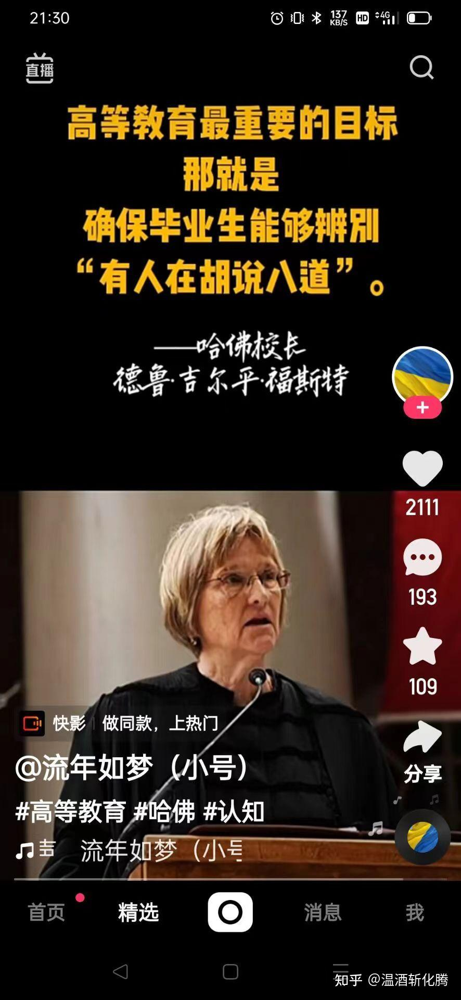

**这是我给14岁的小女和她的伙伴同学开设的【私人定制专享课程】：外人来上这种课程，收费不菲的。你们看了，就知道为啥小女不上体制学校了？家里明明自己会做牛排大餐，干嘛非送孩子辛辛苦苦的跑社区食堂，去吃高粱饭呀？谁说是“国家免费提供的”（义务教育），但吃多了拉不出来，不是更麻烦吗！**

本课程就是教孩子们辨别：有人在胡说八道！下文中收获大量点赞的文章，就恰好证明了：很多国人已经失去了了这种能力。因为从小没有人教这种本事。很多人，就是习惯了让自己宝贵的大脑被一些混蛋灌狗屎进去---只要让这些人相信灌的是“鸡汤”就行！给孩子们研究的转发文章的作者，就是一个相信自己正在喝鸡汤的蠢蛋！但这种人实在太多了！

**课前作业：**

**今日开讲“主子与奴仆”：国人千年延续的奴性根源探寻！**

**奴性的根源，就是得过且过。自己无法做自己的主人，就去做奴隶。如果找不到固定的主人收留自己当奴隶，就去做金钱的奴隶。绝大多数人甘心被一点小钱所驱策，富人们甘心被大钱所驱使。这些放弃了做自己的主人，由于找不到自己沉醉的事业和热爱，找不到自己的主。就只能去当奴隶，找让自己沉醉的毒品来度日，这就是绝大多数人悲哀的一生！每个人活得跟动物没有两样。所谓的与动物的差别，也许就是动物吃不到冰激凌——但动物可以吃“生猛海鲜”呀，各种山珍野味呢。起码，作为野生动物是相对自由的，不需要打卡上班！豢养的动物猪先生，相对也比人更自由的，起码不需要每天用工作来换吃喝玩乐，轻松一生。只是寿命短了一点。但既然人生也没啥意义，作为麻醉品的奴隶，比做普通的奴隶更悲催，活长一点，短一点其实也没啥意义。干嘛一定要长命百岁呢？————这样苟且的人生，还不如动物的人生。我们居然习以为常，是不是我们错了？难道人生的意义，就是为了吃到动物没有的沉醉品？比动物更高的得到性满足的难度吗（追求异性的门槛更高）？**

**1：**当年明月在《明朝那些事儿》结尾的话来说，就是：“**真正的成功只有一种，就是按照自己喜欢的方式度过一生**。”。**那么，你是否知道你喜欢什么样的人生？并知道如何去度过这样的一生吗？**

**2：为了实现你的追求，** **你愿意放弃一些什么去获得你想要的东西？**

3：你想像以下图片中这些人一样活著吗？与酒？女人（异性）和各种麻醉品度过一生？**你认为所有人都是某些事物的奴隶吗？**你是否认识周围的一个人，他过了不一样的，你更喜欢的人生和案例？你愿意像他一样去过完一生？请找到一个你喜欢的人生案例，介绍给我们！并写出你怎样才能成为你心中榜样的人生？

4：据说，你想过什么样的人生，可以想想现在你已经死了，你周围的人在开追掉会。你希望他们怎样评价你？你就按照这样的目标去生活，这样就可以获得无憾的人生。请模拟为你的人生终点。写一份墓志铭！

5：你怎样才能在物质生活，精神追求，人生理想上取得平衡？请写出你在物质生活上的追求和目标？以及精神生活上的追求和目标？以及你想要实现的人生理想？并在每一项追求上，排列出你的优先次序！

四：有个人这样回答人生为什么而活著，获得了很多人的点赞。请认真点评他，不要嘲笑他的“人生理想”，尽量去理解他的人生理想，**并写出你如何跟这种人相处？这种人就是自我麻醉的人，奴性意识极其的深刻**

**（我提供的问题参考是思路启发，并不需要你们一一回答，只是一种帮助你们理解他的思路，很多看起来难的问题，其实你会问问题的话，答案就自动出来了）**

**人生就是为了吃喝玩乐，为了快乐。**

【思考——这个人生目标，与动物的生存目标有啥不同？】

**我的快乐就是吃好吃的，看美的事物，跟喜欢的人待在一起。**

【“好吃”的定义是什么？你需要为“好吃”支付什么代价？（金钱和健康的代价？也许还哺乳动物正常？他认为什么是美？他喜欢什么样的人？）

**我知道生活很辛苦，我知道上班很累，我知道快乐其实没那么多。**

【辛苦的定义是什么？动物的生活不辛苦吗？为啥上班很累？累的根源是什么？追求快乐为啥找不到快乐？】

**但是我就是喜欢跟喜欢的人一起吃冰淇淋，喜欢那份不那么多的快乐。**

【一个把吃冰激凌就认为是人生难得的快乐的人，思维的档次有多高？一个以人生就是为了快乐的人，却找不到快乐，这是否很荒唐？怎样才能每天都快乐？每时每刻都快乐？难道是每天都吃冰淇淋吗?每时每刻都吃冰激凌吗？】

**我很俗气，我就是贪吃，我就是颜狗，我就是小话精。**

【这句话背后，是信念的自我强化——通过自我激励，自我强化，他的灵魂就接受他自创的人生哲学吗？他为啥需要强化这些信念？】

**我开心，我喜欢人间的烟火气。**

【一个说我开心的人是啥人？真开心的人吗？开心的理由就是拥有烧食物的“烟火气”？与动物看到食物的开心有啥两样？】

**烧烤摊上的烧烤是真的香，吸溜。**

【这个动作，与狗闻到了食物，秃鹰瞄见了腐尸的样子，有啥实质区别？还觉得自己特别的有档次，写个文章自我表彰？这文章发到知乎上获得这么多赞，你认为是啥原因？】

**[原味冰淇淋](https://www.zhihu.com/search?q=%E5%8E%9F%E5%91%B3%E5%86%B0%E6%B7%87%E6%B7%8B&search_source=Entity&hybrid_search_source=Entity&hybrid_search_extra=%7B%22sourceType%22%3A%22answer%22%2C%22sourceId%22%3A1546395468%7D)是真的好好吃。**

**超喜欢吃玉米罐头和[橘子罐头](https://www.zhihu.com/search?q=%E6%A9%98%E5%AD%90%E7%BD%90%E5%A4%B4&search_source=Entity&hybrid_search_source=Entity&hybrid_search_extra=%7B%22sourceType%22%3A%22answer%22%2C%22sourceId%22%3A1546395468%7D)。**

【一个超喜欢吃，以吃为生命目标的人，原来他的食谱就这么的简单，最廉价的垃圾食品就已经满足。你能窥见他的生活状况吗？他有了更多钱会做什么？会更有利想吗？还是会拥有更多的食谱？是不是拥有比他多万倍资产的富人，吃更珍稀物品的贵人，信念系统就比他高级了？】

**花好漂亮，大海好漂亮，海边的沙子好舒服，海风吹也好舒服，我超喜欢海边。**

【他对“漂亮”的定义如此贫瘠，说明什么？他在玩什么把戏？他真是“超喜欢海边”的原因，会不会是因为极其难得去一次海边，觉得超级的自豪，就拿出来装13】

案例二：图片文字

我至今见过的家伙，都是同一副德行：有时是酒，有时是女人。当然也有少数神明的时候（去教堂）。大概找不到东西让自己沉醉，人就没法活下去吧？所有的人，都是某些事务的奴隶。