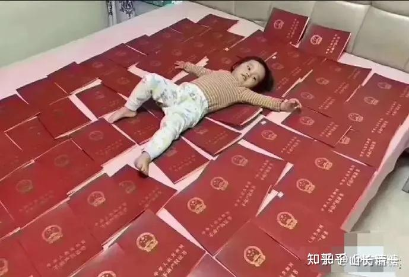
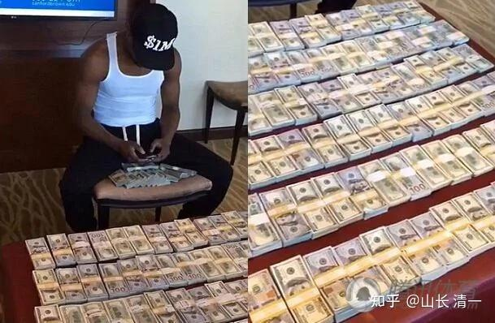

**世界上唯一可以不劳而获的就是贫穷，唯一可以无中生有的是梦想。**

**中国富二代最悲哀的就是：**

**父母长辈从小教给他“不劳而获”的思想，从此种下穷根。成为未来败家的根源！**

**而父母辈从小教他“有钱就有一切”，从此让他失去了梦想！也失去了让自己创造和发展的能力！**

樊登在一次公开的演讲中说：“你做生意亏了就是钱的事，但**你培养一个人培养坏了，是整个家族的沉痛！**”

下面这张孩子躺在房产证上的照片，成为“人生躺赢”的标志。让多少国人羡慕嫉妒恨。这孩子---真是生在“富贵人家”，但----这只是她不幸的开始。

*难道这就是“躺赢”的人生？*

金钱的确可以买到很多东西---包括灾祸在内！因为金钱不会懂得分辨好坏，而且金钱总是被人追逐，更是被坏人惦记。也许你留给后代的钱越多，换来的灾难越大！

这孩子，你们看到的是羡慕嫉妒恨，我看到是可怜：她的童年，好像会很幸福，享用的东西都可以毫不费力弄到手。但长大一点点，她需要的不仅仅是简单的物质，而是有情感需要，社交需要，尊重需要，自我成就需要。而这一切，用钱是买不来的。因此，青春期开启后，她的灾难就开启了，她会发现很多她想要的东西，用金钱可买不到---友谊，尊重，能力，德行等。她还会遇到种种金钱解决不了的问题，让她感到困扰。相反---骗子也自动聚焦在她的身边。很可能她的一生，就是写一个凄凉的人生故事。

本质上：父母并不真心的关爱她，她只是父母拿来秀自己的面子的工具，秀自己“本事”的道具。父母不会关心她的自我成长---当然这种父母，也不可能懂得什么是“成长”。父母也不会关心她的心灵需要。父母只会拿钱砸她，去买各种物质来“满足自己”，以为这就是世界上的一切。而她会遇到越来越大的困惑。因此---青春期开始后，她就自然地寻找自我。但早就迷失心灵的她，从小被放纵的欲望，会给她造成巨大的困扰。她的寻找自我工程，只会更无助。因此这种炫富教育思维中长大的她，未来注定暗淡！看了她，我只觉得可怜！

下图是拳王梅威瑟---数钱玩的游戏：他一场比赛上亿美金，当然数钱数到手抽筋！

*梅威瑟没事数钱玩的照片*

这一床的美金，看起来好吓人，其实一叠就一万美金，最多总共也就两三百万美金，没多吓人的！也许还没有上面这位土豪的房产贵！

他们是不是人生赢家不知道。我只知道：上一个比肩梅威瑟的拳王是泰森，20多年前一场比赛数千万美金。狂赚4亿多美金。然而：2002年他就宣布破产了。

传闻走投无路的泰森，后来就开始到酒吧里当陪练，成为人肉沙袋，拍垃圾电影三级片。有人说这是无中生有。但有一件事是真的，就是当年破产后流浪街头，被女粉丝带回家收留。 为了赚钱，泰森在中国的电影上，被中国演员揍了一顿肯定是真的，为了证明咏春可以打世界级拳王。为了挣钱生活，他也是拼了。当年赚到普通人十辈子也花不完的钱的泰森，别说富不过三代了，他居然玩了一个中年破产。钱能保证的东西其实很少。

中国的三西首富，李海仓。这个家族跌落的速度，比升起的速度更快！

你们家长，每天拼命赚钱，说要留给孩子。以为留下钱就解决了一切问题。问题是---你能赚多少?比得上泰森吗？比得上李海仓吗？别人连二代都传不下去。凭啥你一点小钱，就“家族传承，代代相传”了？做梦吧你。

**古人说：无德不足以存财！只认钱，不认人，不认天道，你以为有好下场？**

**自以为是，狂妄自大的人，老天饶过谁？ 现世报可能就在眼前！**

*清一新教育的“富二代对决”*

这张照片里的两个年轻人，一男一女。虽然来自不同的城市。但他们有一个共同的身份：两人都是富二代！而且财富数值，应该是中国【万里挑一】的这种家庭。不是自己筹钱自我包装出来的“中国名媛”。

男孩父亲是北京一家公司的董事长。一家人谦虚，低调，根本看不出半点“富贵逼人”的气势！家长送孩子来武道馆练武，打泰，跟伙伴们在一起，服务他人，给武士们当司机，做场务，啥事都做。这孩子不仅个性良好，学业成绩也很优秀。这个男孩是学霸，凭本事考上的三语高中，还是全奖学生。父母却申请他不去考大学，专心学武。因为家里不需要打工证！只要素质！

------这才是真正的富养-----用武术来浇灌自己孩子的强悍心灵。而不是用文凭来点缀自己的客厅墙面！

前一张富二代女孩，躺在房产证上的照片，你看到的是女孩父辈的骄狂和洋洋得意。看不到这女孩本人的优点和值得赞扬的自我努力。

后面这两张【富二代的拳照】上，你看到的是富二代们的自律和自强，以及在父辈的支持下，比常人更刻苦，更强悍的奋斗精神！她们没有躺在父母创造的钱堆上“躺赚”，而是决心自己用汗水，不惜流血，受伤，去为家族夺取父辈们不曾拥有的荣誉！争取让家族获得更高的荣誉和地位！她们想创造一个世界纪录----格斗界唯一考上世界名校的案例！这才是一代人对另一代人，相互的支持和付出，感恩！同时---他们也是我们民族提升的希望。家里有钱了，就去做一些不再为赚钱而活的挑战，为自己，为家族，为国家获取荣誉！

*格斗比赛前的沉思*

现在的富人家庭，有几个有这样的眼光？现在的富二代孩子，有多少人有这样的担当？

[https://www.zhihu.com/zvideo/1612371487557713920](https://www.zhihu.com/zvideo/1612371487557713920)

[https://www.zhihu.com/zvideo/1612374713329745920](https://www.zhihu.com/zvideo/1612374713329745920)

前几天：有个当老板的家长，找我咨询孩子的教育和家族传承问题。他快60岁了，他最小，也是最宠的孩子才十几岁。很关心让孩子拥有最好的未来，希望送他去最好的学校。

我就问他：你想要孩子成为怎样的人？希望他怎样生活？

他很懵，说从来没有想过。

我说：这种事情，你都不想。将来孩子长成了你不想成为的人，应该不意外。因为你根本就没有规划！只是随波逐流。

我用提问来帮你想清楚吧!

你想要孩子成为怎样的人，只要设想你死了之后，你希望孩子怎样过生活就行了！

你想在你死前，给孩子在世界上留下了一点什么，来表达你对你孩子的爱？难道是一堆房产证吗？

他想：我把我赚到的所有的钱，财产，全都都留给他，不就行了（没直说这话，差不多这意思）。大概全中国的家长，都这样想吧！以为留给钱，给财产，给越多，就证明自己越爱孩子。这不就行了？

我笑著说：**你觉得----你有很多，很多的钱给他，这就够了吗？他就会幸福成功过一生了？**

我说：孩子如果必须为谋生去工作，的确这种人生很无奈。富人家庭，都不愿意孩子去做打工仔！为一碗饭去牺牲自己。但---**你如果给孩子超过他正常生活所需的钱，对他没有好处，只有坏处。**

**第一：钱多了，这孩子就失去了奋斗的愿望，躺平。**而且会养成很多的坏毛病。他很可能用钱来伤害自己---沉迷于黄赌毒等，成为一个商业世界中的奴隶。因此---反而不如没钱的穷人更健康，更快乐。穷人不得不自己奋斗努力，反而获得了很多能力，人活得还像个样子，会受到人的尊重。成天消费，醉生梦死，会得抑郁症的！

**第二：如果你给孩子留下了很多钱。这孩子注定会成为别人的猎物。**世界上很多人都在追逐有钱的猎物，心狠手辣，手段高超，聪明绝顶。一旦发现你家孩子有财产，就会用各种明的暗的手段来对付他，设置种种陷阱给他跳。因此，金钱更容易吸引来最大的灾难甚至杀生之祸。甚至你还没法请保镖。请“专业团队”来保护你的孩子。因为很多凶案，就是保镖，身边人干的。没钱的穷人，天生会期待怎样用巧取豪夺，弄走你给孩子留下的金钱，而不是天生喜欢当你家孩子的奴才。难道你死之后，会指望你留下来的金钱自动保护好你孩子吗？错了---**金钱只会加速害死你孩子！越多越危险！**

这家长傻眼了----留钱的确不够聪明。哪么---应该留什么？

[曾氏子孙的解答：中国人“富不过三代”的真实原因](https://zhuanlan.zhihu.com/p/139835450)

家长就问我，**难道你真的不给孩子留钱吗？给你的孩子留什么呢？**

我说：我想留，也不敢留钱给孩子！因为留钱给她，只会害死她。所以，如果我知道自己不会长命百岁，我没法一直保护和关照我女儿，我就希望我死后，会有一些人愿意替我来照顾和关心帮助小女。肯定不是我的同辈人，大家可能20-30年后都死了。所以一定是比我年轻的人，最好还是女儿的同辈人。而为了实现这个目的，我现在就应该提前去帮助这些人！

所以：我死后要留给孩子的东西，不是钱，而是“留人情”。我必须在我死前，就尽量留下更多的人情给孩子！我想将来给孩子什么好处，我就要给别人什么好处。我的钱，不要花在买宝贝，金珠，豪车，豪宅上，而要花在“留人情”上。比存在银行里面留给孩子更好，也比买房子，土地给小女更好，更有价值。

曾国藩忠告：“**有富不可享尽，有势不可使尽**！”，俗话说：“做人留一线，日后好相见！”。现在的富人们，都太自私自利了，有钱只想自己人用。宁肯自己瞎花，胡乱糟蹋掉，都不肯用来救济最需要的人。这就是“富要享尽，势要使尽”，生怕自己吃亏，结果---自己吃了最大的亏！

因此：我为了孩子，我必须现在就去做一个好人，我必须尽量为世界做一点好事。我会在有能力的情况下，尽量去帮助别人。将来，我死了，我留人情的对象，可能会看在我今天所做的一切，会感恩我给他们的帮助。假如我的孩子遇到困难，这些人将来会愿意出来帮她，而不是相反---想害她。因此---**-留人情，显然比留金钱珠宝更有价值！**

杜月笙有一个高论：**“给你一万块钱，你早晚花完；给你一万个交情，你这辈子都花不完。别人挣了钱都存起来，我杜某不存钱，只存交情。”**杜月笙的格局可见一斑。

1951年，行将就木的上海滩大佬杜月笙，让管家拉出了几个大箱子，里面装满了别人写给他的欠条。然后他当着全家人的面，一把火将欠条都烧了。他的妻儿不理解他的做法， 因为那可不是一笔小数目。而杜月笙则说：“该还我的早就还了，不想还我的，你怎么要也没用，说不定以后还会招来杀身之祸！”

这就是杜月笙的格局，他看清了金钱的两面性和危险性：留钱，就是留祸！贪钱爱财，就会引火上身。而相反---烧掉这些借条，没留钱给后人，就留下了人情。将来有无好处先不说，起码当时就可以免祸了。子孙宁肯讨饭，也不要去要债。这就是明达之人！

老板听了我的话：觉得有道理。但觉得---不是谁都可以做杜月笙的。不知道该怎样“留情”。留情有啥用。

WAN ELLA当时正好在身边， 我就说：ELLA现在我正好有能力支持她。我现在照顾她，帮助她，给她各种发展的机会。现在公主班的孩子，我都在照顾和供养她们。这个班，就是跟小女同龄，为小女建的专班。将来我死了，这些人不就是我留的人情吗？你认为她们将来，难道不会愿意去帮助我的女儿吗？小女有这样的一群好伙伴，不比我这个老头一直不死，死命要保护她更好吗？

而且：公主班不是只有一个班，而是每年都有一个班级。每个班都学不同国家的语言，将来会去不同的国家发展。我预计这件事情还要做20年，至少会有20个公主班。还会有其他国家的“外国公主专班”。将来，每个班的孩子，都去世界上不同的国家生活和工作，成为这些国家上流社会的一员。将来我的孩子，自然走遍天下都有好朋友，好伙伴了。这就是我留给孩子的“人情”。

**所以---爱孩子，绝对不是父母每天拼命去挣钱，然后留给孩子去花。而是要去设法为孩子花掉这些钱，去留给孩子一群好伙伴，好平台，好机会！**

**家长点头：说知道了，就是家长每天都去支持和帮助他人。**

**仅仅资助人，留下了人情，就够了吗？**

家长又蒙了，说：难道还不够呀？

当然不够了。我说：你是做生意的， 搞投资的，你当然知道【不投资，就没有回报】的道理。你不付出人情，当然也没有人情还你。但你投资，也不能乱投。你如果投错了对象，一样是血本无归的。比如你投资买了“恒大”，买了“乐视”股票。你多少投资都白花了，不可能有回报的。

**“人情”也一样，你选错了人，养个白眼狼，无论你投入多少，都不会有回报的---甚至更坏。可能还会引来祸害。这就是杜月笙要烧掉借条的原因！投出去的钱，只能认其归零！**

家长觉得头大----做好人也不能随便做，那么，该怎么办？

这个没办法。**第一只能是选人如选股，不是随便看到一个股票就乱买。不是任何人都值得帮忙。要非常认真的选择帮助对象**，要尽量选择【道德品质好，人格善良，个性正直，有感恩之心】的对象来帮助。其他的宵小之徒，市井小人，投机分子，都是不值得帮的人。再聪明，再能干，也跟你无关，也不用多管，尽量离他们远一点，尽量不得罪就行了。亲君子，远小人！公主班的孩子，都是从今日三校里面选出来的优秀学生，不仅仅是聪明，最关键的指标是善良正直，要做到这一点很难。选出这些人也很难。这是我办学20年，现在才攒出来的这一个小班！的确很不易！

不过---就算搞成这样子了，也不够。为啥？

因为：人是会骗人的。我们再聪明，也必须知道自己会上当，当年的乐视，贾会计弄得就像是最靓丽的股票一样。**骗子需要你的时候，也会投其所好，装的情深意长的。**

因此，为了避免风险，你只能在尽量选择君子的条件下，也要防止伪君子危害。所以，我们就跟股票一样-----需要分散风险，所以：选股不要单押一股。选人，你也不要指望任何人还情。否则，你的希望越大，你的失望就越大！

所以----最好的办法，只能是广种薄收。**学曾国藩一样----只问耕耘，不问收获！每**天认认真种福田，然后等待自然结果！这就是我每天在做的事情！

家长说：这应该够了吧？

我说还不够！还缺啥呢？

缺关键的一环，才是最重要的：**你的孩子，你必须教她德行良好，不能讨人嫌。**

假如你今天胡乱宠溺她，让她养成一身的坏毛病，过于自以为是，将来就成为一个讨人嫌的熊孩子。不懂感恩之心的傻孩子。自私自利的坏孩子。将来你留下的所有人情，都全部无效！因为就算你今天留了这些人情，别人将来只会给个机会，帮助提携你孩子。但不会有人愿意去当你孩子的奴仆，去侍候她一辈子的。公主班我培养出来的孩子，都是按照精英模式培养，不可能愿意当奴才。更不可能当我家的家奴！所以，小女如果摆出一副少主人的样子来，我在世的时候，可能别人还忍住一点，我死了，绝对没有人愿意理她的！

所以：**习惯照顾你，纵容你孩子任性胡闹的爷爷奶奶，以及菲佣，保姆等，就是害你孩子将来倒霉的凶手**。除非你确定这些老人就不会死，会愿意一直侍候你的孩子。否则，你就不能让这种人陪着你孩子，教给他错误的观念。让你孩子习惯这种环境，让她以为别人照顾她是理所应当的。你花钱养个仆人宠孩子很容易，找个有责任心的明师，严格要求和管教孩子却很难！

因此---我的孩子才3岁多，就被我赶去学校寄宿，不许她回家。老人对我很有意见，抱怨很多，但我不为所动。我的目的，就是让她从小学会平等地和他人相处！不让她在被特别照顾的环境中长大。而且我经常教育她：不能讨人嫌，只能讨人喜欢！目前来看，这种教育是成功的！WAN ELLA也表示：小女很受公主班的孩子欢迎，大家都喜欢做她的朋友！

当然：最重要的安排，就是观世音菩萨的话：**求人不如求己！让孩子自身强大，才是最重要的！**

由此，最爱孩子的父母，一定是让孩子在自己死前，就能学会一切自己照顾自己的本事。因此她必须有能力！古人也说：你设计再好的方案，留下的德行，人情再多，也不可能让子孙后代一直享用的，**所以有“君子之泽，三世而斩”的说法**！（孟子原文是五世，太理想化了，可能圣人有五世吧？）

因此：做父母的人，如果你真心爱自己的孩子，就是要从小严格要求孩子，严格训练孩子。要给孩子最好的教育，和最有提升的机会（而不是从小给孩子最好吃，最好玩的东西），甚至不是去拿文凭。父母只要天天想----自己死了，孩子能不能轻松地活下去？还有啥不放心的？你就去做！这样坚持不断去做的家长，才是真正的懂得【爱和自由】的家长，才是最爱孩子的家长。

当个只会拿物质，拿食物来哄孩子的家长，就跟养个宠物一样容易，连小孩子都会这一套。这种家长，谈得上“爱孩子”三个字吗？有智慧吗？

现在，很多自以为爱孩子的家长，在我看来，就是害孩子！就像前面躺在房产证上的女孩父母，我认为就是特别坏的父母---专坑自己孩子的大灰狼！---父母喜欢那这些东西出来秀，平时一定是喜欢“富贵而骄”的人。老子说：这是自己引祸害来身上的行为（富贵而骄 自遗其咎）。富贵之人，要学会“不骄”，还要学会谦虚，低调，服务他人。这就是有德。**无德不足以存财！**

穷人无德，没关系，反正损失也没啥！他们也不需要机会。

**富人无德，损失就太大了！**

家长听完我讲的内容：说刷新三观，从来没有这样想过！

但又表示：山长能力强，为女儿的设计考虑非常的周到。这些事情，我们想做，都做不来。花钱都买不来！

我说：每个人能力不一样，你能做多少，算多少吧，没必要跟我一样折腾。我是个“宠女狂魔”。你们总有自己的事情，玩自己的游戏，喜欢吃喝玩乐。我只是专心为我的儿女铺路罢了，每天为我死后，能够安心离开而做事。

当然，我设计的这一套东西，的确不是一般人能做的。我花的钱也不少，已经用了20年的时间，花了几个亿的投资了。未来20年，要建设【公主环球家园】，至少还要砸几十个亿进去呢！

其实不是钱的问题，马云就算投下几百亿，也烧不出来这样的东西。

家长说: **我们能力虽然也不够，钱有点，也不够多。但我们家长，也想给孩子跟小明慧一样的东西，我们该咋办？**

我哈哈大笑：说----你们想要我给小女的礼物，说容易也容易，说难也难！

说容易：你们可以不花一分钱，就轻松拿走我辛辛苦苦给小女花了20年，花了几个亿，甚至将来还要更多的投资，建设和安排出来的一切礼物。

说难：**就是你花费再多钱，恐怕也拿不走我白送的这些礼物！**

家长表示困惑：为啥？

我就说，举个例子：WAN ELLA将来计划是要在泰国，东南亚发展的。20-30年后，她肯定就跟泰国的上流社会圈子融入了。假如小女有事情，比如：她丈夫的产业，被人敲诈了，她就找ELLA帮助解决。只要不是非法的事情，ELLA肯定可以找到当初朱拉隆功的校友，现在泰国各地的政要来帮助解决。因为ELLA当年是泰国北大---朱拉隆功大学的校花，在校期间表现很突出，文武双全，很多校友对她都有好感，由此ELLA出面找他们，校友们都愿意帮忙，这种事情，不就是我自己都做不到的事情，将来就有势头的人出面，来帮小女吗？何况泰国和东南亚发展的小公主们，并不是ELLA一个人，而是一群人，一个班的公主。30年后，她们的社会地位都会很高的，在东南亚地区都会很有影响力。或者她们嫁的人，肯定都是高层次的人。她们互相之间感情都很好，都会彼此互相帮忙，处理很多普通人根本就难以处理的事情，不就是很容易的吗？

家长蒙了：这个情况，就算是这样。小明慧当然很多人都会愿意帮她，这是你今天给她留下的资源。但我们也得不到这种机会呀？

我大笑：一旦我成立起来了这种未来的互助架构，你不花钱，一分钱不给我，也可以轻易把我辛苦40-50年多少亿搭出来的平台资源轻松拿走，为你家所用！而且----**你们得到的，会跟小明慧得到的一样多！**

家长认为我忽悠他：怎么敢跟你们家女儿比！

我就说：假如---你儿子将来娶了ELLA，或者别的小公主。你得到的礼物，比小明慧得到的少吗？她能有的一切资源，关系，你家不是一样都有吗？Ella和明慧是好友，假如Ella找明慧帮忙她老公的家族做啥事，你认为小明慧不会尽全力来协助吗？她认识的所有的伙伴，我留下的这些资源，Ella不是都一样可以享受吗？我一旦投资建设了这个公主平台，虽然最开始的目的，是为自己的孩子可以用的。但我必须把这个平台，变成所有参与者都能分享共用的公共资源！这个平台，应该99%的机会是别人在使用。我的家族能够得到1%的机会就行了。对我来说，就是100%的价值了。因此，这个最终建成的平台，不再是我家的“私有资源”，而是变成所有参与者拥有的“公共平台”，真正的“集体所有制”。甚至这个平台，能够帮到更多有需要的普通中国人！这就是老子说的“因其无私，故能成其私”。

这种占大便宜的事情，真的有。娶个公主的难度，比**成为公主**的难度要低一些。毕竟---优秀女生太多了，竞争公主会很激烈。娶公主---应该简单多了。只是--**-你家的儿子，需要成器一点，要比别的男孩有出息一些**。起码不能让人反感。因为公主们可不愿意胡乱嫁人！因此：你只要认真培养好儿子，就可以不花一分钱就得到我们的公主。还得到以后你孙子上学的超级学位证。公主们还会免费教你的子孙后代成为精英。

但---如果你的孩子不成器，不讨人喜欢，不受人尊重，你家里有多少钱也白搭，就算是马云的儿子来也没用！因为---我培养的公主大多数是不爱钱的！只爱美德！你孩子的个人品质很重要。

就算是娶不到公主，只要你认识公主们，给公主们留下了好印象。甚至你只是公主们的学生，你就拥有这个公主人脉。20-30年后，她们互相能够说上话，互相尊重。将来对于很多人来说特别复杂，无法解决的问题，一样可以轻松解决，对吧？

就怕你儿子送来学堂，只会吃喝玩乐，给公主们留下很不良的坏印象，让人讨嫌，你就是花钱买抽了！

有些家长：居然在公主们面前耀武扬威，摆谱吹牛，摆脸子。也是自取没趣。我都不敢这么任性的。因为这些家长实在不知道什么才是真正的财富！这些都是未来的人才，前途无可限量。我们还是要尊重一点。