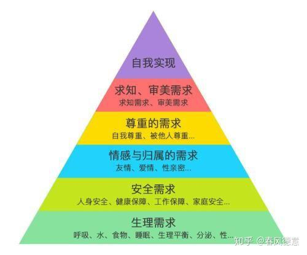

左师公曰：“父母之爱子，则为之计深远”

我们这一生的努力和奋斗，是否能够给子孙后代，留下一个更好的世界和未来呢？

一个健康和发展的社会和家族，可以做到优胜劣汰。相反，一个机制有问题的社会，可能只有流氓才能胜出！丛林社会，是不可能诞生真正的发明的。战争之地，往往是最流氓，最无耻的混蛋才能够取得最终的胜利！ 一个缺乏文明逻辑的社会，自然就是造成小人得志，骗子升天，劣币驱逐良币。当然是泥沙俱下，社会无法提升。

中国几千年来，一直在极低的层级上不断的轮回（流氓与混蛋轮流执政，老百姓总是做炮灰，文明和理性之光，从未照耀这个民族----黑格尔语）。这样每个的家庭，只能跟随国家社会的盛衰而被动沉浮，谁也无法改变家族的命运。一代人竭尽全力，拼尽运气，努力获得的美好结果，也往往三世而衰。几十年后，就一切只能从头开始！

我们这一代，各种机缘巧合，让我们成为这个社会TOP1%的精英阶级。能否让下一代，可以站在1%的起点上，去冲击成为千分之一，万分之一的优胜者？实现真正的自我实现理想？而不是只能跟大山上的农民，底层的打工阶级，一起从零起跑线---生存下去，开始我们人生的竞争？（北大的一项研究表明，一直找不到后代上北大概率提高的有效模式）

一个永远只关注焦虑于“生存”的民族，如果代代相传的智慧，如果停留在"怎样活下去，怎样活好一点"。这样眼光短浅的民族，这样的家庭和家族，是没有未来的，不可能获得尊重和发展！

100年后，你的子孙后代，能否“世界因你而不同”？获得比普通人更多的机会？更好的发展平台？让子孙可以比我们这一代取得更大的发展，更多的创造和荣誉？可以脱离低级趣味？脱离“丛林社会”，走向文明的创造？为世界留下更美好的篇章？

你能否在百年前，就奠定了后代子孙注定不平凡的一生？让他一出生就拥有财富自由，可以去追求更高远的目标？实现更伟大的创造？

后代子孙能否站在你开辟的前进平台上，不再需要考虑“生存”的问题，而是继续攀登人类精神的高峰？而不是每一代人都只能“从零开始”起步？

我们的子孙后代如果还要读书上学，能否摆脱社会的惯性习惯，摆脱我们这一代的卑微低贱的心理，让她从小就不考虑“求职”就业的需要？不用去担心未来的生活工作压力，读书上学，纯粹只是为了满足她“求知”的需要？让她们有机会成为一个“更有内涵”的人？专心塑造自己成为一个“更好的自己”？

如果你真的还有“下一世”，你希望未来重新降生来到这个世界，你希望你投身的家庭已经返贫归零，让你不得不从零开始慢慢奋斗呢？还是希望走在你上一世已经设计好的“不断提升”之路上？从普通人不可想象的1%的高起点，快速开始你的新一生更有趣的新探索？

这些历史上，还没有人做过的事情，你是否愿意去创造？去搭建一个前人没有见过的永续传承的世界奇迹？

很多父母，都只会每天傻傻的忙着挣钱留给孩子。甚至牺牲自己的理想，追求，甚至牺牲自己的尊严和健康去赚钱。但你想过没有？

你的子孙后代，他们真正的需要的是金钱吗？真不是！而是你认为，你只要用金钱，可以买来让他们人生发展中的重要机会！其实---你根本不知道该用钱买啥？金钱，往往会买来相反的东西！

人为啥要喝茅台酒？难道茅台比可乐更好喝？还是比饮料更健康？其实都不是。喝茅台的人，是想用茅台的尊贵，来证明自己的阶级，地位和档次的尊贵！

同理----买车，买房，都是要“证明”自己的“阶级层次”。这是人类最深层次的追求。可惜----顶流人生的地位和阶级，不是金钱能够买到的。甚至权利也换不来！

父母都想要留给子孙“高端阶级”的身份地位，可惜有钱，只能证明你是土豪！金钱买不来荣誉和地位，甚至买不来尊重。面对土豪，他人骨子里面想的只是如何弄走你留下来的金钱！土豪是无法获得尊重，成为“世家”的。

身为父母，你还想把自己开创的事业，留给子孙去经营吗？----但就算是最有能力的父母，都无法应对变化完全的市场。自己也无法保证自己的事业久远。何况成功经营一份事业要求极高。富裕家庭娇生惯养的子孙后代，无论德，能，都无法承担继承和发扬家业的任务！还不如把事业交给老部下更靠谱。王安电脑的故事，当年压得IBM喘息都困难，相当于今天苹果电脑的地位。最终突然垮掉，就是他非要传给自己的儿子，最终导致离心离德，一个非常有前途的事业就失败了。这就是典型的误人，误己，误家，误国。

现在的家长，你们谁有比王安电脑更强大的事业可以传给子孙后代呢？

**为子孙计久远，聪明的父母，应该按照马斯洛的人类需求金字塔理论，认真地为子孙安排未来，尽量设法满足这些需要。这需要的是智慧，不仅仅是金钱！数百亿富豪家族都无法完成这个任务---家族不断提升，需要代代相传的智慧。光有钱只能有豪门，富而不贵，显然是不行的。**

**你认真看看8项人生的追求，需要，你能够用钱来买的有几项？你就知道金钱的局限性有多大了！**

相关知识背景：

马斯洛（1943年，1954年），提出的人类需求模型，深刻展示了作为人类真正的内心渴望，远远不仅仅是物质的满足。马斯洛的五阶段模型，后期已经扩大为八阶，包括认知和审美需求（马斯洛，1970a） [4] 和后来的超越需求（马斯洛，1970b） [3] 。先陈述一下相关内容！

生理的需要（physiological need）：食物、水分、空气、睡眠、性的需要等。它们在人的需要中最重要，最有力量。

安全需要（safety need）:人们需要稳定、安全、受到保护、有秩序、能免除恐惧和焦虑等。

归属和爱的需要（belongingness and love need）：一个人要求与其他人建立感情的联系或关系。例子：结交朋友、追求爱情。

尊重的需要（esteem need）:马斯洛分为两类：（一） 尊重自己（尊严、成就、掌握、独立）和（二） 对他人的名誉或尊重（例如地位、威望）。

认知需求（Cognitive needs）- 知识和理解、好奇心、探索、意义和可预测性需求。（马斯洛，1970a） [4]

审美需求（Aesthetic needs）- 欣赏和寻找美，平衡，形式等。（马斯洛，1970a） [4]

自我实现的需要（self -actualization need）:人们追求实现自己的能力或者潜能，并使之完善化。

超越需要（Transcendence needs）- 一个人的动机是超越个人自我的价值观

由此可见：中国大多数父母，只知道满足孩子的“基本生理需要”，生存需要。只知道关心孩子的吃吃喝喝，怪不得出现这么多的抑郁症患者，怪不得中国青少年的自杀率，全世界最高了。中国家长。在衣食问题已经解决的情况下，需要多关心一下“精神需求的满足”，这一点，用钱恐怕买不来了，要用心才行！

**作业：你能否根据以上的马斯洛人类需求层次理论，拿出一个可靠的落地方案。不考虑需要付出的代价，只考虑你需要做什么，才能让一个人，比如你的子孙后代不受利益集团的 奴役，能够获得从最基本的生活生存需要，到最高层的精神需要的满足？请完成以下作业：**

**一：基本生存需要！能让子孙后代拥有住房，每个月还能拿到一份相当于社会基本工资收入的稳定收入，就可以实现这个要求了！**

这看起来似乎很容易的---但如何留给子孙就很难了。留钱？无论你留多少钱。只要遇到个败家子就彻底完蛋。似乎留的钱越多，越容易遇到败家子，也更容易吸引骗子和强盗！所以----钱越多越危险，越留不下来！留房子？留几百套房子收租拥有稳定的现金流？天知道未来的房子是资产还是负债。中国未来人口塌陷，底特律危机未必就不会出现。社会动乱，也可以快速毁灭房产价值！

还有最大的威胁----全世界的政府，都会系统地，有计划地进行“抢钱”的规划----通货膨胀的威胁，足以毁灭你现在创造的一切财富---50年前的7元茅台酒，现在是2000多元。羊肉50年前0.65元一斤，今天是90-120元一斤！老挝国今年2月就贬值46%的恶性通货通胀，20万元买一碗米线面条，足够毁掉一切祖传的财富。

留美元硬通货就好了？----作为一个世界最大的债务国，过去几十年，是靠金融霸权掠夺全球来供养自己。一旦趋势逆转，未来的霸权不再，抢不到钱的美国，叠加不再创造价值，消费主义，逆差严重，种族矛盾严重的美国就可能陷入严重的内乱。1930年代的德国，未必就不是50年后的美国。

现在，你对自己留钱给子孙，还有多大的信心？对银行的“信托基金”。你还能有多大的指望？

**作业1：你要怎样安排你的资产，才能让你百年后的子孙后代，每个月能拥有最基本的稳定收入，不至于被生活所迫，不得不为利益集团打工？去做自己不喜欢的事情？**

**作业2：要实现“百年永续家族传承”，你需要多少启动资金才能实现这个“家族成员不在为利益集团打工”的财富自由需要？请估算一个大致的数字！**

**二：安全保证需要：**

古语说---30年河东，40年河西。又说“天下大势。久分必合，久合必分”，分分合合之下，是严重的不可控的社会安全的危机。一旦社会动荡，豪门大族的命运，比普通百姓更为凄惨！豪华社区，可能立马变成乱民们掠夺的重灾区。特别在中国这种具有“吃大户，吃绝户”国民集体仇富文化的国家，99%的穷人，会把1%的富人视为生活失败后的嗔恨对象。现在太平时候，做TOP1%的人上人很爽。动乱时刻，你的高级身份，就是你的灾难！疫情中高级社区的保安都可以对你冷言相对，动乱中这些侍候你的“仆人”会怎么做？飘的作品，惦记和要掠夺斯嘉丽农庄的，就是当年的奴才。主子也会快速变身奴才，周围熟人们都“乐见其成”。这就是中国的人性和历史！你怎样才能给子孙后代留一片安全祥和的生活空间？古人的方式是隐世而居，躲到深山里面去避世。但这样后世子孙，虽然活著，但也失去了与文明接轨的机会。

**作业1：请你设计一种可行的方案，让你的子孙后代，能够在文明发展的时候与中心文明在一起，不脱节。同时在几乎不可避免的盛衰周期发生，乱世之时离开可能发生战乱的国家，避免乱世杀戮，实现百年传承？（不考虑成本）【中美世界大转换就在眼前，怎样不离不弃？不远不近？远离危险的地方？】**

**作业2：请估算要实现这种安全需要，百年永续传承？你需要怎样恰当的安排你现在的经济支持路线？需要多少资金来做这件事情？**

**三：情感和归宿，爱的需求满足**

人类是感情的动物，孤独的人是可耻的。“嘤其鸣矣，求其友声”，骨子里面，我们每一个人都期待伙伴和心灵家园。富二代们最可怕的是心灵的孤独。你怎样才能为孩子找到搭配他层次的伙伴朋友呢？你能用钱买到奴仆，但是买不到伙伴！

**作业1：你应该如何安排，才能让你的子孙后代解决“伙伴情感归宿”问题？你怎样才能提升你的子孙后代在伙伴和婚姻上的竞争力呢？更值得爱？（提升竞争力，是指后代在个人其他条件相同情况下，他的家族背景---父辈的存在，留给他的条件，能否让他在婚姻市场上获得额外的加分?)**

**作业2：为实现你提升子孙后代婚姻竞争力的指标，你现在需要投资多少，才能创造这个条件？请列出你需要的投资准备！ **

**四：尊重需求的满足。**

尊重需求，包括人类的自尊和被尊重的需求。一个缺乏自尊的人，会自我放纵，会在游戏，烟酒，色情，毒品等里面逃避自我，忘记自己“寻找尊重而不可得”。现在的父母们，你们能留下足够的金钱，为您和您的孩子买来“自尊与人尊”吗？如果没有，即使原衣食无忧，子孙后代也活得毫无生存质量。再好的物质条件， 也不可能让她快乐自信，只能越来越堕落！

有人说：一个民族要获得世界的尊重，关键要看这个民族为世界做出了什么样的文化贡献！提供商品（物质）显然无法得到尊重，也许会有一点点的感谢。

**作业：你怎样让你的子孙后代拥有自尊，而且获得人尊重？你现在能留下什么资源，帮子孙后代解决这个问题？**

**五：认知需求 **

**人不是动物，只要活著就够了。人会本能地去探索世界的奥秘，会去寻找一些重要人生观，宇宙问题的答案。人会仰望星空。人还会自己找不到答案的情况下，急切的寻求人生导师来帮助解决自己的最大疑问。如果他周围找不到真正的导师，他要么自我麻醉，用各种麻醉物质和各种忙活来让自己失去思考。他还会去寻找宗教，寻找骗子大师。因此，大量的文化骗子，正在瞄准这些“衣食有余”的家庭---物质条件完全已经满足的富人家庭成员，心灵的空虚亟需填补，骗子善于使用虚假的知识和认知，满足和喂养这些求知欲极强的人类，最终让这些人成为精神的奴隶。中国大陆存在一大批生活富足后的老板阶级人员，去供养【西藏上师】的现象。就是这种认知需求，和导师皈依的情感需求在社会上的具体表现。**

**作业1：您会给孩子提供什么样的机会来“满足认知需求”呢？你怎样才能为他们找到合适的人生导师，帮助他们认清生活的真相？**

**作业2：这个问题似乎用钱解决不了。也许你认为可以？如果这样请你为此开一个价格？**

**六：审美需求的满足。**

孔子说“游于艺”，艺术诞生于人类的审美需求。因为人类无法像机器一样只是工作，也不能像动物一样只是“活著”，他们必须活在“人生意义和情趣”里面---而审美需求，就是人类在满足认知需求后，人类具有的更高的精神需要。各位家长----你怎样才能为的子孙后代，留下让他可以获得快乐和享受的“审美需求”呢？难道是买一堆古玩？艺术品？就可以让他快乐了吗？

**作业：中国人普遍缺乏艺术修养。你怎样才能让子孙后代拥有“艺术情调”，拥有美好的审美情调？而不是只会跳广场舞？追星，听二人转？你怎样才能让孩子成为一个趣味高尚的人？**

**七：自我实现的需要 自我实现，其实就是自我价值的判定需要！**

人生最大的悲哀，就是不被需要。这种“无价值感”，会对生命带来巨大的伤害。工作并不仅仅是一种谋生的手段，其实也是一种自我价值实现的手段。尽管工作的时候会埋怨辛苦。但人最怕的其实是失业，是没有工作，没人需要自己。很多老人退休后，仅仅三五年就死去了。为啥？因为突然发现---- 这个世界其实根本就不需要自己。女性往往还可以在家庭子孙后代上找到需求，但男性老人，如果除了工作以外毫无价值，就会陷入巨大的人生困境。作为富人家庭的孩子，出生就财务自由，等于没就业就“失业”了。家长们用钱，能买到“子孙后代的自我成就”吗？

**作业：你该怎样安排你的家族百年计划，让你的子孙后代获得真正的自我实现？你该从什么时候就努力做这件事情？**

**八：人生顶级享受---超越的需要，创造的需要。**

人，最需要的不仅仅是“活着”，而是“活得有价值”！而最顶级的价值。就是超越他人，超越平庸。 人来到世界，绝对不是为了如同动物一样的生存和繁殖。而是为了创造和体验！让世界因我而不同。

家长们：你怎样才能支持和帮助自己的子孙后代，能够活出人的尊严和荣誉，有机会去追求和实现自己最大的理想和创造的梦想呢？你能通过支持自己的子孙后代的伟大创造，去实现自己的“超越需要”吗？如果你能实现，你就超越了一个古今帝王都无法实现的目标。云南哀牢山有一支唐朝李姓皇族的后人，逃到此处避乱。虽然子孙后代活下来了，但现在，只是一群普通的山民，只能做民工，干农活。子孙后代这样活著，与动物无异，你认为这种家族子孙的传承，符合您的心意吗？

**作业：你如何让你的子孙后代拥有“创造的热情和愿望和机会”？请设计你是如何给子孙后代提供人生的创造机会的？**

最终总结性作业：

要实现你的家族【百年世家永续传承】，科学上有【**最小可存活种群】的理论。**minimum viable population 科学家认为：至少需要50或者500个个体才能保证种群的延续。

1：品质保证 你如何才能让你的“家族传承种群”，有机会传递百年甚至更长时间？而让你的后代还能保持较高的种群层次而不衰退？

2：数量保证：个体的延续充满了偶然性。除非一个超级有力量且稳定的群体合作，才有希望实现真正的百年永续传承！你至少需要多少个样本，来作为你的「家族初始种群」？

3：如果【清一百年世家永续】真的是拥有几乎无限资源的帝王，最想要却无力实现的梦想。你认为帝王为啥做不到这一点？什么东西限制了他们注定无法实现这个梦想？你的【百年方案】中，有无这种“帝王无法实现”的要素呈现？如果没有？肯定是有缺陷的。因为如能行的话，帝王肯定就做出来了！

参考资料：

[山长 清一：下一个挑战世界纪录的清一创造：【百年世家计划】](https://zhuanlan.zhihu.com/p/610008244)

作业示范：（可以参考这种方式来回答处理以上问题）

一：生存需要 作业

这一年是2073年，刘小慧从大学毕业了。她还没找到自己想要从事的职业，不想过早进入职场。但她想去“采风”，像一个普通人一样，去各国旅行，了解各国的人情民风。她是三语人才，西班牙语水平已经是母语水平，所以重点是去南美各国。以游学的方式到处访学采风。因为她未来准备在南美30国发展事业，她认为去这些国家先转一转。了解民众的需求之后，她可以找到自己的兴趣点和民众需求结合，就可以开始创业了。这几年他根本就不担心赚钱养活自己的问题。因为她继承了家族的【百年世家永续俱乐部】的权利人身份。现在她每个月，都可以领到现在俱乐部发给她的34万零5000元的“世家生活费”。拥有这笔钱，完全够她正常过日子了。而且最重要是：俱乐部还提供了她一套“世家住房”，他不用花租金，可以活的比其他工作都轻松。这笔钱，每个月都会发给她。直到她有了自己的事业，不需要了位置。她就可以把这个世家权利人的身份，转给其他需要的家族人员。这个【世家生活费】的存在，几十年来一直保障了她们刘家的子孙后代不再焦虑，一出生就拥有财富自由。因此不用去和别人卷。可以专心从事自己喜欢的事业。因此，刘家人如今有好几个后代，做出了一些很有价值的社会改进的创造性解决方案，获得了很大的声誉。

**一：百年世家保障计划：只要世家子孙，每个月都能拿到一份稳定的相当于普通人的工资收入，就可以实现第一个作业要求的“家庭生存需要”。因此，可以每个月发放【世家生活保障金】。按照当时世家会员所在国家的员工基本月度工资标准发出就可满足这一要求！每月**345000元**工资标准的确认，是因为2023年，相比50年前1973年的中国，一份普通工作的工资大约是涨了100倍到200倍的样子。未来通胀数据不清楚，预计的普通人的工资标准就取中位数---150倍来算！就是这个数据的来源！ **

**作业二：目前的欧美，进入低息时代，未来中国也差不多。无风险收益每年可能只有1-2%。而且要面对本币年年贬值的风险，还要避免所在国家的银行和企业破产，造成的本金完全损失。因此未来只能采用跨国多项目投资的方式，来维持这笔资金的稳定收入。资金运作可以参考诺贝尔奖金的经营方式，或者目前的国家主权投资资金的运行管理方式，来维持家族的百年运行，以获取长期的被动投资收入的方式来做好永续经营的准备。还要做好至少两三个“备份”，防止本金的彻底损失，还要支付负责管理的资产管理人员的管理费，还有多国跨国风险预备的项目。因此：预期未来要实现百年源源不绝的基本财富自由，2023年的初始启动资金，大约需要2000万以上！**

**另一种方式就是【没有初始资金】，就需要家族成员的工作来换取“逐步积累”，用工作来换取【传承】的机会！一代一代人逐步积累的结果，聚焦目标，最终也可以实现【世家永续】的任务。不一定需要初始资金投入！**

**作业二：安全需要 只有在全世界的不同国家，都拥有成熟的“生存基地”，“生活平台”，才能解决100年永续的传承安全问题。（作业略）**