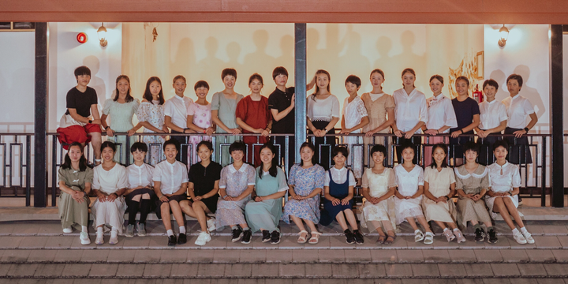

学生意见----给我选的教师差一点就好了！居然还有嫌弃给的机会太好的学生吗？

学生本应该是学校的主人，但在中国，大多数学校的学生，就是被教师们各种虐的奴才，被逼着听课，写作业，刷试卷。甚至一些教师上课就是骂人，根本没教学生啥有价值的东西。但学生对此却毫无办法。我认为这种情况太荒唐了。因此，为了保证学生的教育权利，【今日国际学校】的要求，是学生可以选老师。如果家长和学生认为带班教师不满意，可以申请换教师。家长送孩子上私立精英学校，对教学质量要求很高。因此拿不出好的成绩来，家长肯定不干，三校的PK，就倒逼教师们认真去研究和发展教学水平，避免被淘汰。这种教育设计机制，恰如其分的让学校成为真正服务家长核心需求的学校。

实行这种要求的学校， 教学压力肯定比普通学校要大得多，但新教育教师职位由于很受人尊重，依然有很多有理想的人申请入职。我们不拒绝体质学校的教师，但体制学校毕业的本科，研究生，博士们，很难竞争过从小在新教育“泡出来”的学生。

【今日国际学校】本学期就出现了一个带班职位空缺，想加入新教育的申请者积极补位。经过今日塾校长和教师团队从申请人中进行初选之后，选出了五个候选人，提供给家长和学生共同决定他们要谁当新的带班教师。家长们经过首轮的面试，选出了三个他们想要的教师，然后这三个人，公平每人带班一周，让学生们决定选谁做带班教师。候选人中，有外围学堂的带班教师，还有三语高中毕业的学霸，还有武道馆练武出身的新晋教师。

最终结果昨天出来了：清一武道馆的新木兰蔡凯琪被选出来作为该班级的指导教师。

明莉督导对选聘情况的点评介绍：

这次竞岗PK很精彩。刚开始提供了五个候选人，家长选择了陈##、陈##、蔡凯琪三人来进行带班PK，当时蔡凯琪的票数其实是最少的。在PK期间，何同同负责做观察员，每天播报情况。三位指导每人带班一周，都各有突出的风格，所以学生和家长每周都觉得有超出期待的收获，觉得几位老师都很优秀，在面临选择的时候很纠结。还有学生跟家长说，如果给我选择的老师差一点就好了，这样我就好选了，现在太难选了。所以，非常感谢三位指导的付出，捍卫了平台的荣誉[表情]

凯琪的风格真诚、务实、进取，带班的时候学生觉得她贴心，给他们的辅导效果好，方法实用。善于做团队建设，能很快帮他们解决矛盾。上的主题课，学生们也觉得好，虽然讲不是很深但很实用，所以给她的评价是文武双全。凯琪也跟学生说到自己的短板是英语不好，但学生说没关系，自己凡尔赛说我们班里有同学就很厉害。所以，就像山长说的，专业、技能并不重要，贴心才是最重要的。

而且，凯琪带班PK并没有压力山大，还一度怀疑自己是不是不够重视，每天该休息休息该运动运动。

看她带班觉得就应该是这样的。感谢山长和刘老师的培养[表情]

**今日塾赵校长的评价：**

谢谢山长的点评与指导 [表情]

这次三位新老师的竞岗PK，其实PK还挺激烈的。从第一周开始，孩子们就表示很纠结了，不知道该选哪位。所以，这次三位竞岗老师，表现都挺好的。昨天，家长们应该是投了两轮的票，才把新任带班老师选出来。

凯琪这次能胜出，跟她在武道馆训练所得的素质密不可分。当时，我们邀请她来今日时，我们也认为她还需要一些时间来成长成熟。但是很看中她有打过泰拳的心理素质优势，和与孩子互动良好的教师核心素质优势。但在与凯琪交流过程中，尤其是看她带班过程中，我们发现凯琪不仅具备以上优势，而且做事能力也很强，虽然带班时出的招不多（郭导还说她有点佛系），但却基本上招招都很管用，这就跟武道训练的要求非常像。这方面是给我们的惊喜，也超过了我们对她的预期 [表情]

所以，今日塾也决定，以后只要是来自武道馆有兴趣加入今日做老师的，我们都会优先考虑给予实习名额或带班机会[表情]

*清一新教育的未来教师团队---公主班合照*

照片中的这些学生，是我的【公主近卫军】。她们的理想全都是要做新教育教师。15岁正式入读【清一大学少年师资预备班】，18岁左右，她们就要开始走上职场竞争今日三校的教师职位。没有选上教职的学生，就继续留下学习【清一大学研究生课程】，或者去泰国一流大学留学，留名。随时准备上岗教学。（因为今日不扩招，

每年提供的新教学职位很有限）。

目前，新教育已经培养出了一个校长。这张照片中，未来应该会有很多校长的。就不知道是谁了！看你们的眼光，猜猜看20-30年后，这里面会出多少个校长？

如果你要问新教育学校难道没有男教师吗？当然有了。新的男教师，似乎更愿意去【今日国际学校的无名塾】，这里的校长，居然是新教育的小女生。如果6月份他们PK赢了，他们会有更多的班级需要新教育补充。目前预备补录的教师，都是男的。他们会成为蔡凯琪的直接竞争对手。

9月份的高中会考，应该会有更多的人申请进入公主班。上面这个队伍，会越来越多人的。另外---今年下半年，可能就会开招国际学生班了。我将资助20-30个东南亚学生来【今日国际学校】上学，带这些国际学生的新一代3.0教师，就在这张照片中选出来。她们都是熟悉当地语言的本土化教师，我们不预备教学生中文，将直接用学生的母语来教学，为东南亚国家培养未来的人才，同时为我们国家赢取所在国的民心！因此不教中文，是避免这些学生将来为中国人打工，这样就失去了帮助本国发展的意义！我们将支持这些学生直接进入本国最顶尖的大学学习。

这些学生，现在在学什么东西？

她们的公众号有一些作业分享内容。你看看号称【大学少年班】的她们，上的是不是大学课程？还是小学课程？

起码不是科举课程！

[明德女塾 少年班](https://www.zhihu.com/people/qq-60-70-24)