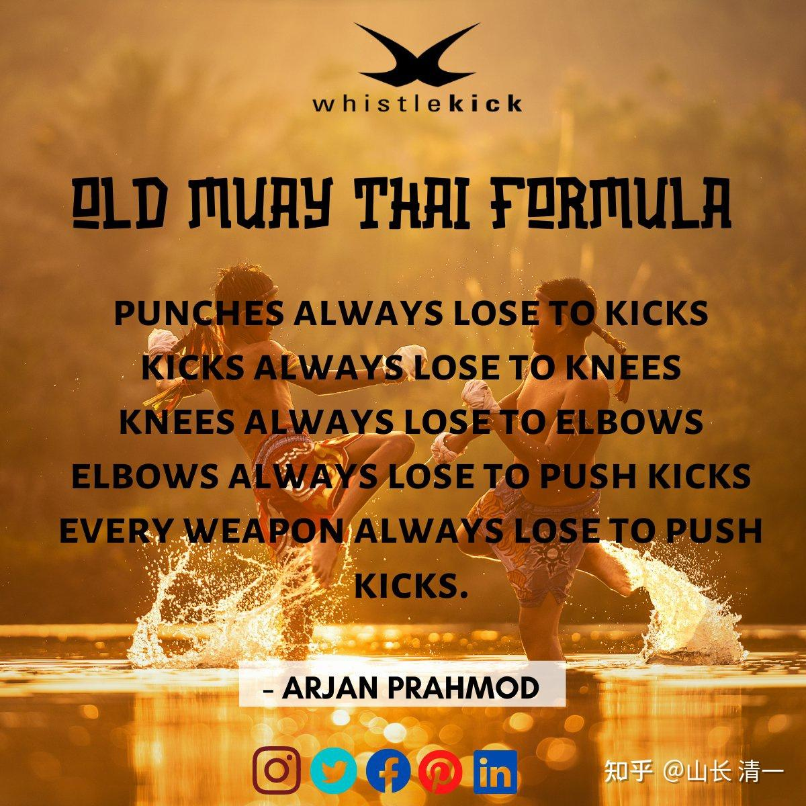

古泰拳和现代泰拳，其实是两个格斗体系，拥有非常不同的格斗思路。古泰拳与中国传武很相似---强调单重，强调肢体发力。现代泰拳，跟西方的格斗技术很相似---都是双重拳法，肌肉发力！

古泰拳，采用的外形招数，有点像中国的内家拳，只要补上内功发力技术，跟内家拳也差不多。

现代泰拳，技术发力，跟中国的外家拳完全一样。比如陈家沟的“炮锤”，本质上与泰拳发力技术相同，但过于复杂。多了很多啰嗦的东西，效率上不如泰拳。但要说练好了能打，也还是能的。就是打得效率低一点。

兰纳泰拳，是流行于古兰纳国的古泰拳。习惯用特别的音乐来配套，练习打斗，也帮助放松。有点像跳舞一样轻松。但并不缺乏实战能力。中国云南和广西的壮族和傣族，至今依然流行类似的拳法。与泰国的古泰拳相似程度很高！因为古代这些地区与古兰纳国的范围重叠。所以一些文化和生活习惯相似也不奇怪！有人古壮拳的传人，说泰拳是来源于古壮拳的，这个就不知道了。历史专家们去研究吧。

[https://www.zhihu.com/zvideo/1609884443941949441](https://www.zhihu.com/zvideo/1609884443941949441)

**第一：核心攻击手段不同（泰拳喜用扫腿，古泰拳喜欢用正蹬）**

现代泰拳，最核心的技术是泰扫，用强硬的小腿胫骨打击对手。这个技术对拳手的骨密度要求很高，一些体质存在问题的拳手（从小喝牛奶过多导致骨质疏松），会在强力攻击对手的时候，把自己的小腿胫骨扫断，赛场上已经多次发生这样的事故了。当然---这个技术用于打击对手，也非常的危险。很容易KO对手，泰拳的强力扫腿攻击，经常打断对手的手臂，以及小腿等。大多数没有训练过的普通人，根本不能和泰拳手对抗，因为普通人的胫骨身体手臂都很弱，如果遭到职业拳手的全力一击，胫骨就会骨裂或者断掉，非常容易受伤。实际上，一些新拳手在擂台上比赛，往往普通一个扫腿就被KO了。因此---说明泰扫的确是威力最大的武器。所有的泰拳运动员，每天花时间练习最多的项目，上场后采用的最重要的技术，就是泰扫。

古泰拳就完全不一样：古泰拳认为---超越一切格斗武器的是正蹬。正蹬终结其他格斗技术！所以古泰拳练习者，往往放弃了扫腿技术的使用。而重点练习更有威胁力的正蹬。

以下是古泰拳的宗师人物的【古泰格言】：拳会输给腿击（含扫腿），腿击会输给膝击。膝击会输给肘击。肘击会输给正蹬！最终总结----所有的攻击技术，都会输给正蹬！

*古泰格言*

**区别二：古泰拳更重视防守技术，现代泰拳更重视攻击技术！**

现代泰拳强调双方实力的对拼，最喜欢练习“硬度”，体能强度等。优秀泰拳手，更像是坦克车一样，稳步上前攻击对手，压制感很强。并不强调要躲过对手的攻击，而更喜欢硬接对方攻击后，再快速反击，用硬度和耐力来消耗对手。最终往往是抗击力不行（硬度不够）的拳手败下阵来。如果双方是势均力敌的拳手，打一场比赛下来，双方都会伤痕累累。双方实力有差距的，弱者会在中途就被KO。泰拳手与外国拳手比赛，第一局往往没有明显优势，但泰拳手抗击打强的优势，会在后程比赛中表现出来。比赛中不断积累的打击，特别是扫腿不断扫中对方的同一部位，就会让对手受伤，身体越来越虚弱。因此往往前面两局对攻表现良好的外国拳手，会在三四五局惨败。

古泰拳因为是古战场的实用武术，战场上，往往双方是持有兵器的，万一自己的要害被击中，就会直接退出战斗了。因此，古泰拳非常重视防守技术，会在防守好自己的情况下才考虑进攻。因此，在格斗技术上，古泰拳更加强调防守技术。要求必须在保护好自己安全的情况下才攻击对方。因此表面看起来，可能不像现代泰拳这样双方对拼非常凶猛，双方的场上缠斗会相对比较多！这是为了限制对方的出招机会，特别是不给对方的强大扫腿有出击的机会。这就与主要用于擂台比赛的现代泰拳互攻不一样。因此练习古泰拳的人，在实战比赛中更不容易受伤，很难被现代泰拳的拳手KO。现代泰拳正式比赛中赢过古泰拳练习者，主要靠点数胜，裁判判赢。但相反：现代泰拳的格斗者，有接近50%的概率，会被古泰拳练习者KO！

古泰拳这种特别重视防守反击的特征，会让练习古泰拳的女拳手，有能力与体重相同的男职业拳手比赛。虽然男拳手相比女拳手，速度会更快，力量会更强。但如果遇到善于防守的人，这种威胁不会比优秀的女拳手更大！

**区别三：现代泰拳强调步法移动稳定和强调力量支撑。古泰拳强调身形的移动灵活和变化！**

现代泰拳遇到的重要攻击，主要来自于侧面，比如左右扫腿。以及后手摆拳。这些攻击都力量很大。为了有效承受这种攻击，泰拳手们都特别强调侧面防守，站立的姿势也强调对两侧的支撑。拳手们通过缓慢而稳健的移动，步步靠近对方，给对手很大的压力！一旦对方防守出现问题，就会遭到连续的击打。

古泰拳的攻击手段，相比现代泰拳更加丰富，还特别擅长正面直线方向的攻击。古泰拳要求能够躲开对手侧面攻击的同时，还要进攻对方的中线。因此：古泰拳特别强调步伐的灵活。会有各种跳步，滑步等等。上面的兰纳古泰拳视频的拳师，就说传下来有32种步法。因此可以说古泰拳是用快速的变化，来对付现代泰拳的强大力量和稳定的。双方打在一起，更容易让不太适应这种打法的现代泰拳手无法适应，技术难于发挥。因此难以击败古泰拳练习者。

**区别四：现代泰拳擅长远距离攻击，而且拳腿的攻击力量很大。古泰拳更善于中近距离的攻击，拳腿力量不如现代泰拳，但更善用肘膝。**

现代泰拳的主要攻击是扫腿，这种腿法身体后仰可以带来更远的攻击距离。远远超过古泰拳的正蹬攻击距离。这也是现代泰拳会基本放弃使用和训练正蹬技术的原因，因为用正蹬来攻击之前。很可能先被扫腿击中。用拳的话，现代泰拳的后手摆拳攻击距离也很远，力量还很大。

为了避免在现代泰拳的“优势范围”内作战，古泰拳的练习者，会设法尽量拉近与对手的距离，不让对手的攻击有效展开。因此场面上看，练习古泰拳的拳手，会不断的前进试图靠近对方。而练习现代泰拳的拳手，会不习惯这个距离，会被迫不断的退步，设法拉开有效距离然后攻击。这种完全不同于现代泰拳手的正常打法，就是因为两者格斗的哲学不一样，双方对于格斗需要的“正常距离”是不一样的。

正由于没有现代泰拳一样的远距离攻击手段，古泰拳更强调内围战和肘膝攻击。现代泰拳手们常常会在内围战中被古泰拳手的肘膝攻击KO。因此现代泰拳手们面对古泰拳手的内围战攻击会非常紧张，体力消耗非常的巨大。往往第三回合就会耗尽体力，失去优势。而现代泰拳手，互相之间的内围战就没有这么剧烈。甚至内围战还是双方互相紧紧抱住，获得一点喘息机会的有效方法！

古泰拳也不是完全没有远距离攻击手段，他们有一些优秀的拳手，为了强化超远距离的突然攻击，会用快速的跳步，飞身步，用步法的优势来进行远距离的攻击。托尼贾在拳霸电影中，就表现了这种远距离攻击的技术。当然，在擂台实战中，要用出来的难度很高。

**核心区别五：学习的难易程度不一样。**

古泰拳的主要缺点，就是技术动作更多，变化更大，更难学。而且发力方式与普通人的习惯是相反的，由此更加难以掌握。只有少数悟性较高的人才能学会。

而现代泰拳大大简化了学习入门的方式，已经形成规范化的培训手段。只要拳手愿意跟随泰拳教练，每天刻苦练习，认真踏实增进体力，就可以很快掌握基本技术要领。虽然要取得很好的成绩也不容易，需要多年磨炼提高。但如果仅仅是要求能上擂台打职业比赛，练个一两年，就可以上擂台了。很多泰国拳手17岁左右就可以拿到泰拳的地区冠军，虽然是从小练习的。但也说明练习泰拳达到较高水平的成熟期，并不是太长。

但古泰拳的原则与常识相反，小孩子不容易理解，不容易学会。培养的周期就会很长，很难实现短期内上擂台比赛的目标。有些人，就是怎么也学不会这些古泰拳技术，只有少数学习能力很强的拳手，经过多年的练习，才能学会古泰拳的实战方式！

也许是因为这个原因，所以目前泰国的拳手中，只有很少的人，会学习古泰拳。大多数拳手，都在学习现代泰拳。虽然一些地方的拳场，有古泰拳的表演，但把古泰拳用于实战的拳场很少，即使在泰国，要看到古泰拳的实战情况也很难。

广告：

清迈某拳场，为了满足外国游客的需要，计划每周末，会专门举办一次“古泰拳和现代泰拳真实战比赛”。让游客们只需一次观看，就可以集中地看到古泰拳和现代泰拳的比赛，了解古泰拳与现代泰拳的不同之处。相比其他仅仅是现代泰拳手们的比赛，游客们可以获得更多的泰拳体验！